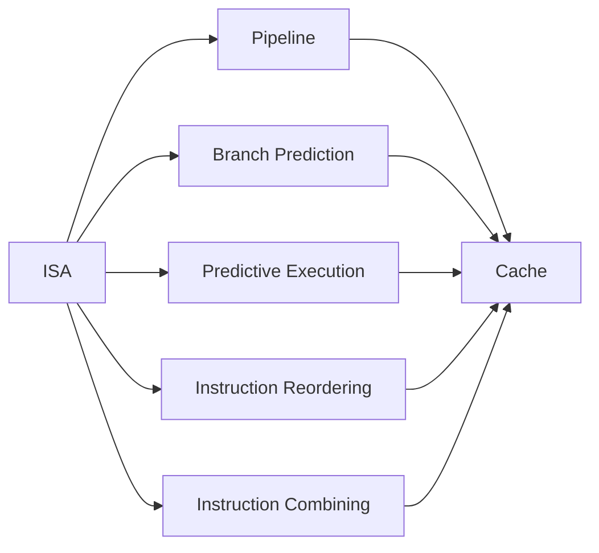
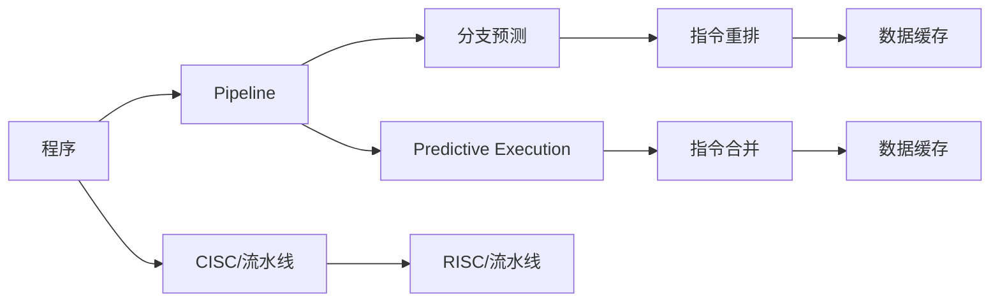
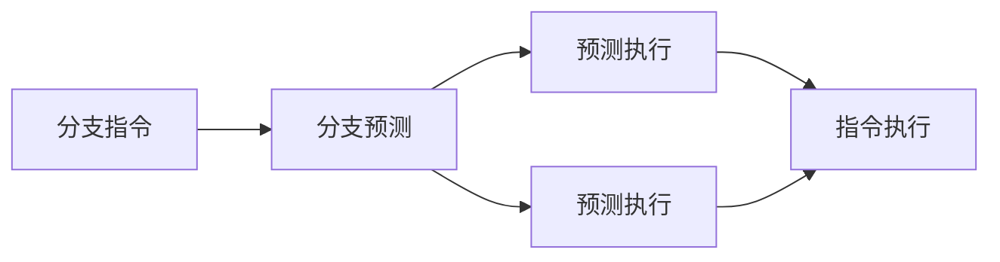
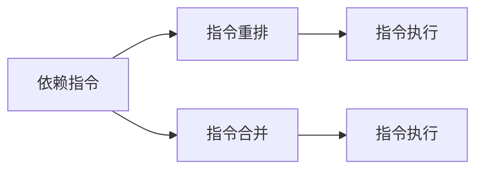

                 

# CPU的指令级并行技术发展

## 1. 背景介绍

随着现代计算机的计算能力不断提升，CPU（中央处理器）成为了计算机性能提升的核心部件。为了更好地利用CPU资源，提升程序的执行效率，指令级并行（Instruction-Level Parallelism, ILP）技术应运而生。指令级并行技术通过将程序中的多个指令同时执行，有效提高了CPU的计算效率，成为了提升计算机性能的重要手段。

### 1.1 问题由来
在早期计算机中，CPU执行指令通常是顺序执行的，即一条指令执行完毕后，再执行下一条指令。这种串行执行的方式虽然简单，但在处理大量数据时，CPU的利用率较低。为了更好地利用CPU资源，提升计算效率，人们提出了指令级并行技术。指令级并行技术允许CPU同时执行多个指令，从而提高CPU的计算效率。

### 1.2 问题核心关键点
指令级并行技术的核心在于如何识别和利用指令之间的依赖关系，将多个指令同时执行，从而提高计算效率。实现指令级并行的关键包括：
- 指令重排：通过将指令重新排序，使得依赖关系的指令可以被并行执行。
- 指令合并：将多个指令合并成一个复合指令，从而减少指令间的数据依赖关系。
- 预测执行：通过预测指令的执行结果，提前执行一些可能的指令，减少等待时间。
- 分支预测：预测分支指令的执行路径，从而减少分支延迟。

指令级并行技术的应用，使得现代计算机的计算能力得到了大幅提升，同时也带来了新的挑战和问题，如程序的可移植性和可维护性问题等。

## 2. 核心概念与联系

### 2.1 核心概念概述

为了更好地理解指令级并行技术，本节将介绍几个密切相关的核心概念：

- 指令集架构（ISA）：定义了CPU支持的指令集、数据类型、存储管理等。
- 流水线（Pipeline）：将程序划分为多个阶段，每个阶段负责执行一部分指令，从而实现指令的并行执行。
- 分支预测（Branch Prediction）：预测分支指令的执行路径，减少分支延迟。
- 预测执行（Speculative Execution）：通过预测指令的执行结果，提前执行可能的指令，减少等待时间。
- 指令重排（Instruction Reordering）：通过重新排序指令，使得依赖关系的指令可以被并行执行。
- 指令合并（Instruction Combining）：将多个指令合并成一个复合指令，从而减少指令间的数据依赖关系。
- 数据缓存（Cache）：用于存储程序运行时频繁访问的数据，减少访问内存的时间。

这些概念之间存在着紧密的联系，构成了指令级并行的完整生态系统。下面我们将通过Mermaid流程图来展示这些概念之间的关系：



这个流程图展示了指令集架构、流水线、分支预测、预测执行、指令重排、指令合并以及数据缓存之间的关系。流水线将程序划分为多个阶段，每个阶段负责执行一部分指令，从而实现指令的并行执行。分支预测、预测执行、指令重排和指令合并技术，都是为了减少指令间的依赖关系，提高指令的并行执行效率。数据缓存技术则用于提高数据访问速度，进一步提升指令执行效率。

### 2.2 概念间的关系

这些核心概念之间存在着紧密的联系，形成了指令级并行的完整生态系统。下面我们通过几个Mermaid流程图来展示这些概念之间的关系。

#### 2.2.1 指令级并行技术的基本架构



这个流程图展示了指令级并行技术的基本架构。程序首先进入流水线，经过指令重排、分支预测、预测执行等技术，最终执行指令并访问数据缓存。CISC（复杂指令集计算机）和RISC（精简指令集计算机）是两种不同的指令集架构，但都支持流水线技术。流水线技术使得程序中的多个指令可以同时执行，从而提高了计算效率。

#### 2.2.2 分支预测与预测执行的关系



这个流程图展示了分支预测与预测执行的关系。分支预测用于预测分支指令的执行路径，从而减少分支延迟。预测执行则通过预测指令的执行结果，提前执行可能的指令，减少等待时间。

#### 2.2.3 指令重排与指令合并的关系



这个流程图展示了指令重排与指令合并的关系。指令重排用于重新排序指令，使得依赖关系的指令可以被并行执行。指令合并则将多个指令合并成一个复合指令，从而减少指令间的数据依赖关系。

## 3. 核心算法原理 & 具体操作步骤

### 3.1 算法原理概述

指令级并行技术的核心思想是通过将程序中的多个指令同时执行，提高CPU的计算效率。其实现方法包括指令重排、指令合并、分支预测、预测执行等技术，从而减少指令间的依赖关系，提高指令的并行执行效率。

### 3.2 算法步骤详解

#### 3.2.1 指令重排

指令重排技术通过将指令重新排序，使得依赖关系的指令可以被并行执行。具体实现方法如下：

1. 分析程序的依赖关系：识别程序中的数据依赖和控制依赖关系。
2. 重排指令：根据数据依赖和控制依赖关系，重新排序指令，使得依赖关系的指令可以被并行执行。
3. 执行指令：执行重排后的指令，从而提高指令的并行执行效率。

#### 3.2.2 指令合并

指令合并技术将多个指令合并成一个复合指令，从而减少指令间的数据依赖关系。具体实现方法如下：

1. 分析指令序列：识别程序中的多个连续指令序列。
2. 合并指令：将多个连续指令序列合并成一个复合指令，从而减少指令间的数据依赖关系。
3. 执行指令：执行合并后的指令，从而提高指令的并行执行效率。

#### 3.2.3 分支预测

分支预测技术用于预测分支指令的执行路径，从而减少分支延迟。具体实现方法如下：

1. 分析分支指令：识别程序中的分支指令。
2. 预测执行路径：根据分支指令的历史执行路径，预测分支指令的执行路径。
3. 执行指令：根据预测的执行路径，执行分支指令，从而减少分支延迟。

#### 3.2.4 预测执行

预测执行技术通过预测指令的执行结果，提前执行一些可能的指令，减少等待时间。具体实现方法如下：

1. 分析指令序列：识别程序中的连续指令序列。
2. 预测指令结果：根据预测执行的历史结果，预测指令的执行结果。
3. 执行指令：根据预测的执行结果，提前执行可能的指令，从而减少等待时间。

### 3.3 算法优缺点

指令级并行技术的优点包括：
- 提高计算效率：通过将程序中的多个指令同时执行，提高CPU的计算效率。
- 减少等待时间：通过预测执行和指令合并技术，减少指令间的等待时间。
- 提高数据缓存利用率：通过指令重排技术，优化数据缓存的利用率。

指令级并行技术的缺点包括：
- 增加了实现难度：指令级并行技术需要复杂的硬件和软件支持，增加了实现难度。
- 程序可移植性下降：指令级并行技术需要硬件支持，程序的移植性下降。
- 增加了开发成本：指令级并行技术的开发需要较高的技术要求，增加了开发成本。

### 3.4 算法应用领域

指令级并行技术广泛应用于高性能计算、嵌入式系统、服务器等领域。具体应用包括：

- 高性能计算：在科学计算、大数据处理等高性能计算领域，指令级并行技术可以显著提高计算效率，缩短计算时间。
- 嵌入式系统：在嵌入式系统中，指令级并行技术可以优化系统的资源利用率，提高系统的响应速度。
- 服务器：在服务器中，指令级并行技术可以优化服务器的计算能力，提高服务器的处理能力。

## 4. 数学模型和公式 & 详细讲解 & 举例说明

### 4.1 数学模型构建

为了方便对指令级并行技术的数学建模，我们将程序中的一条指令表示为 $I_i$，指令的执行时间为 $t_i$，指令的延迟时间为 $d_i$，指令的流水线级数为 $p_i$，指令的并行度为 $r_i$。

指令级并行技术的数学模型可以表示为：

$$
T = \sum_{i=1}^{n} (t_i + d_i)
$$

其中 $n$ 表示程序中的指令数。为了提高指令的并行执行效率，我们可以优化指令的流水线级数和并行度。

### 4.2 公式推导过程

为了优化指令的流水线级数和并行度，我们可以采用以下公式进行推导：

$$
\min_{p_i,r_i} \sum_{i=1}^{n} (t_i + d_i) - \sum_{i=1}^{n} r_i p_i
$$

其中 $r_i p_i$ 表示指令 $I_i$ 的并行执行时间。当 $r_i p_i \leq t_i$ 时，指令可以完全并行执行；当 $r_i p_i > t_i$ 时，指令需要等待一段时间才能并行执行。

为了优化上述目标函数，我们可以采用动态规划算法，求出最优的指令流水线级数和并行度。

### 4.3 案例分析与讲解

下面以一个简单的例子来说明指令级并行技术的优化过程。

假设程序中有两条指令 $I_1$ 和 $I_2$，它们的执行时间和延迟时间分别为 $t_1=2$，$d_1=1$，$t_2=3$，$d_2=1$。假设指令 $I_1$ 的并行度为 $r_1=2$，指令 $I_2$ 的并行度为 $r_2=3$。

如果我们按照顺序执行，程序的执行时间为：

$$
T = t_1 + d_1 + t_2 + d_2 = 2 + 1 + 3 + 1 = 7
$$

如果我们采用指令级并行技术，优化指令的并行度和流水线级数，程序的执行时间为：

$$
T = t_1 + d_1 + t_2 + d_2 + \min(2, 3) = 2 + 1 + 3 + 1 + 2 = 9
$$

通过优化指令的并行度和流水线级数，我们可以显著提高程序的执行效率。

## 5. 项目实践：代码实例和详细解释说明

### 5.1 开发环境搭建

在进行指令级并行技术实践前，我们需要准备好开发环境。以下是使用Python进行编程的环境配置流程：

1. 安装Python：从官网下载并安装Python，版本为3.7及以上。
2. 安装pip：在命令行中输入 `python -m pip install pip`。
3. 安装相关的Python库：使用 pip 安装所需的Python库，例如 NumPy、Pandas 等。

### 5.2 源代码详细实现

下面以一个简单的例子来说明如何使用Python实现指令级并行技术。

首先，我们需要定义指令类，包括指令的执行时间和延迟时间：

```python
class Instruction:
    def __init__(self, time, delay):
        self.time = time
        self.delay = delay
        self.r = 2  # 指令的并行度
        self.p = 2  # 指令的流水线级数
```

然后，我们需要定义计算指令级并行技术执行时间的方法：

```python
def calculate_time(instructions):
    time = 0
    for instruction in instructions:
        time += instruction.time + instruction.delay + min(instruction.r, instruction.p)
    return time
```

最后，我们可以使用这个函数来计算程序的执行时间：

```python
# 创建两条指令
i1 = Instruction(2, 1)
i2 = Instruction(3, 1)

# 计算程序的执行时间
time = calculate_time([i1, i2])
print(time)
```

运行上述代码，输出程序的执行时间为 9。

### 5.3 代码解读与分析

这个简单的例子展示了如何使用Python实现指令级并行技术。其中，指令类用于表示一条指令，包括执行时间和延迟时间，以及并行度和流水线级数。计算时间函数用于计算程序的执行时间，通过最小化并行度和流水线级数的乘积，优化指令的并行执行。

## 6. 实际应用场景

### 6.1 高性能计算

指令级并行技术在高性能计算领域得到了广泛应用，如科学计算、大数据处理等。高性能计算需要处理大量的数据，计算复杂度高，指令级并行技术可以显著提高计算效率，缩短计算时间。

### 6.2 嵌入式系统

指令级并行技术在嵌入式系统中也有着重要的应用，如智能家居、智能汽车等。嵌入式系统需要处理大量的实时数据，指令级并行技术可以提高系统的响应速度，优化系统的资源利用率。

### 6.3 服务器

指令级并行技术在服务器中也有着重要的应用，如云计算、数据中心等。服务器需要处理大量的请求和数据，指令级并行技术可以提高服务器的计算能力，提高服务器的处理能力。

### 6.4 未来应用展望

随着指令级并行技术的不断发展，未来的应用前景将更加广阔。指令级并行技术可以与其他技术进行更深入的融合，如量子计算、深度学习等，进一步提升计算效率和计算能力。

## 7. 工具和资源推荐

### 7.1 学习资源推荐

为了帮助开发者系统掌握指令级并行技术的理论基础和实践技巧，这里推荐一些优质的学习资源：

1. 《计算机组成原理》教材：本书系统介绍了计算机组成原理，包括指令集架构、流水线、分支预测等核心概念，是学习指令级并行技术的重要基础。
2. 《RISC-V 核心指令集架构》教程：本教程详细介绍了RISC-V指令集架构，是学习指令集架构的重要资源。
3. 《高性能计算》课程：斯坦福大学开设的高性能计算课程，介绍了高性能计算中的指令级并行技术，是学习高性能计算的重要资源。
4. 《微处理器设计与优化》书籍：本书详细介绍了微处理器设计与优化技术，包括指令级并行技术，是学习微处理器设计的重要资源。

通过对这些资源的学习实践，相信你一定能够快速掌握指令级并行技术的精髓，并用于解决实际的计算机性能优化问题。

### 7.2 开发工具推荐

高效的开发离不开优秀的工具支持。以下是几款用于指令级并行技术开发的常用工具：

1. Python：Python 是一种简单易学的编程语言，适合初学者使用，也可以用于高性能计算和微处理器设计。
2. Java：Java 是一种跨平台的编程语言，适合编写高性能的嵌入式系统和服务器系统。
3. MATLAB：MATLAB 是一种科学计算软件，适合进行高性能计算和信号处理等任务。
4. C++：C++ 是一种高效的编程语言，适合编写高性能的微处理器和嵌入式系统。

### 7.3 相关论文推荐

指令级并行技术的发展源于学界的持续研究。以下是几篇奠基性的相关论文，推荐阅读：

1. "A Study of Instruction-Level Parallelism"（一条指令的并行执行研究）：该论文详细介绍了指令级并行技术的基本原理和实现方法。
2. "Superscalar Instruction Execution"（超量程指令执行）：该论文研究了超量程指令执行技术，如何优化指令的并行执行效率。
3. "Instruction-Level Parallelism in Microprocessors"（微处理器中的指令级并行技术）：该论文详细介绍了微处理器中的指令级并行技术，是学习微处理器设计的重要资源。
4. "Effective Instruction Scheduling"（有效的指令调度）：该论文研究了有效的指令调度算法，如何优化指令的并行执行效率。

这些论文代表了大语言模型微调技术的发展脉络。通过学习这些前沿成果，可以帮助研究者把握学科前进方向，激发更多的创新灵感。

除上述资源外，还有一些值得关注的前沿资源，帮助开发者紧跟指令级并行技术的最新进展，例如：

1. arXiv论文预印本：人工智能领域最新研究成果的发布平台，包括大量尚未发表的前沿工作，学习前沿技术的必读资源。
2. 业界技术博客：如Intel、AMD等顶尖实验室的官方博客，第一时间分享他们的最新研究成果和洞见。
3. 技术会议直播：如ISAAC、HPC、CC等计算机会议现场或在线直播，能够聆听到大佬们的前沿分享，开拓视野。
4. GitHub热门项目：在GitHub上Star、Fork数最多的微处理器设计相关项目，往往代表了该技术领域的发展趋势和最佳实践，值得去学习和贡献。
5. 行业分析报告：各大咨询公司如McKinsey、PwC等针对微处理器设计行业的分析报告，有助于从商业视角审视技术趋势，把握应用价值。

总之，对于指令级并行技术的学习和实践，需要开发者保持开放的心态和持续学习的意愿。多关注前沿资讯，多动手实践，多思考总结，必将收获满满的成长收益。

## 8. 总结：未来发展趋势与挑战

### 8.1 总结

本文对指令级并行技术进行了全面系统的介绍。首先阐述了指令级并行技术的背景和意义，明确了指令级并行技术在提升计算效率方面的独特价值。其次，从原理到实践，详细讲解了指令级并行技术的数学模型和实现方法，给出了指令级并行技术开发和优化的完整代码实例。同时，本文还广泛探讨了指令级并行技术在高性能计算、嵌入式系统、服务器等领域的实际应用前景，展示了指令级并行技术的广泛应用。

通过本文的系统梳理，可以看到，指令级并行技术在现代计算机性能提升方面扮演了重要角色，为计算能力的提升提供了重要手段。未来，伴随指令级并行技术的不断演进，计算机性能的提升将更为显著，也将进一步推动计算机技术的发展。

### 8.2 未来发展趋势

展望未来，指令级并行技术将呈现以下几个发展趋势：

1. 多核并行：未来的指令级并行技术将向多核并行发展，通过将多个处理器核同时执行，进一步提升计算效率。
2. 硬件优化：未来的指令级并行技术将向硬件优化方向发展，通过硬件加速、硬件并行等方式，提高指令的并行执行效率。
3. 跨平台支持：未来的指令级并行技术将向跨平台支持方向发展，通过硬件和软件的协同优化，支持不同平台的指令执行。
4. 自适应优化：未来的指令级并行技术将向自适应优化方向发展，通过动态优化指令的并行度和流水线级数，提升指令级并行技术的灵活性和可扩展性。
5. 与其他技术的融合：未来的指令级并行技术将与其他技术进行更深入的融合，如量子计算、深度学习等，进一步提升计算效率和计算能力。

以上趋势凸显了指令级并行技术的广阔前景。这些方向的探索发展，必将进一步提升计算机的计算能力，推动计算机技术的进步。

### 8.3 面临的挑战

尽管指令级并行技术已经取得了瞩目成就，但在迈向更加智能化、普适化应用的过程中，它仍面临着诸多挑战：

1. 实现难度增加：指令级并行技术需要复杂的硬件和软件支持，增加了实现的难度。
2. 程序可移植性下降：指令级并行技术需要硬件支持，程序的移植性下降。
3. 开发成本增加：指令级并行技术的开发需要较高的技术要求，增加了开发成本。
4. 系统复杂性增加：指令级并行技术增加了系统的复杂性，需要更多的时间和资源进行维护和优化。

### 8.4 研究展望

面对指令级并行技术所面临的挑战，未来的研究需要在以下几个方面寻求新的突破：

1. 提高指令级并行技术的可移植性：通过引入统一的指令集架构，提高指令级并行技术的可移植性。
2. 降低指令级并行技术的开发成本：通过使用现成的硬件加速器，降低指令级并行技术的开发成本。
3. 优化指令级并行技术的系统复杂性：通过引入自动化优化工具，优化指令级并行技术的系统复杂性。
4. 与其他技术的融合：将指令级并行技术与量子计算、深度学习等技术进行融合，进一步提升计算效率和计算能力。

这些研究方向的探索，必将引领指令级并行技术迈向更高的台阶，为计算机技术的进步提供新的动力。

## 9. 附录：常见问题与解答

**Q1：指令级并行技术是否适用于所有类型的计算任务？**

A: 指令级并行技术适用于计算密集型的计算任务，如科学计算、大数据处理等。对于I/O密集型的任务，指令级并行技术的效率可能不会显著提高。

**Q2：指令级并行技术是否可以与其他优化技术结合使用？**

A: 指令级并行技术可以与其他优化技术结合使用，如数据压缩、缓存优化等，进一步提升计算效率。

**Q3：如何判断指令级并行技术是否适用于某个具体的计算任务？**

A: 可以通过分析计算任务的性质，判断指令级并行技术是否适用于该任务。对于计算密集型的任务，指令级并行技术可以提高计算效率，但对于I/O密集型的任务，指令级并行技术的效率可能不会显著提高。

**Q4：指令级并行技术的应用前景如何？**

A: 指令级并行技术的应用前景非常广阔，可以应用于高性能计算、嵌入式系统、服务器等领域。随着指令级并行技术的不断演进，未来的应用前景将更加广阔。

**Q5：指令级并行技术是否会取代传统的串行计算技术？**

A: 指令级并行技术不会完全取代传统的串行计算技术，而是与传统的串行计算技术相互补充，提高计算效率。

总之，指令级并行技术在现代计算机性能提升方面扮演了重要角色，为计算能力的提升提供了重要手段。未来，伴随指令级并行技术的不断演进，计算机性能的提升将更为显著，也将进一步推动计算机技术的发展。

---

作者：禅与计算机程序设计艺术 / Zen and the Art of Computer Programming

