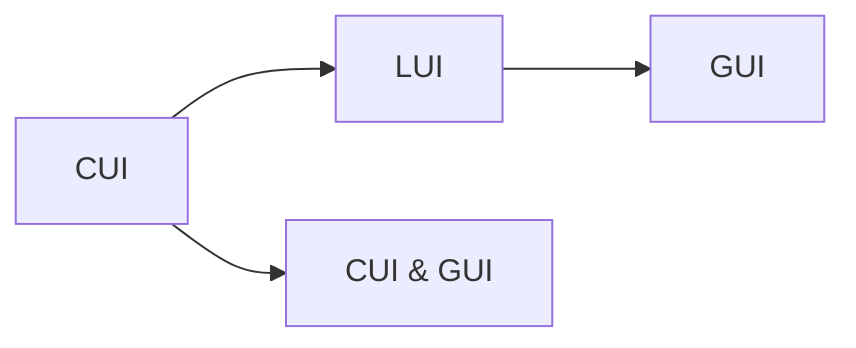
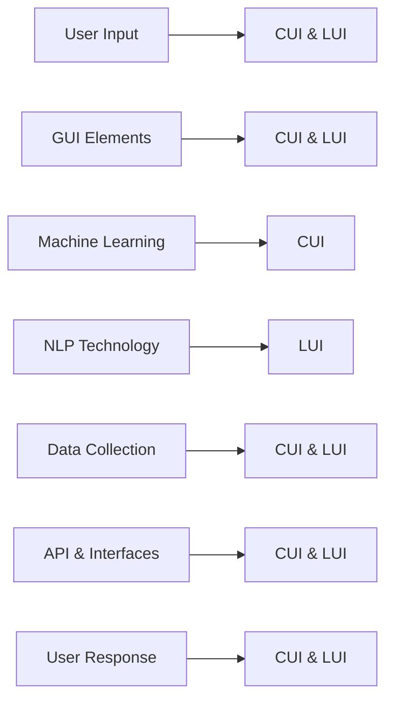

                 

# CUI与LUI、GUI的关系及其影响

## 1. 背景介绍

### 1.1 问题由来

在当前的人工智能技术中，用户界面（User Interface，UI）扮演着至关重要的角色。无论是移动端还是桌面端，良好的UI设计都能提升用户体验，让复杂的交互变得更加直观、高效。然而，随着人工智能技术的进步，传统的UI设计逐渐被更加智能化的用户接口所替代。其中，计算机用户接口（Computer User Interface，CUI）和语言用户接口（Language User Interface，LUI）尤为引人注目。CUI和LUI在人工智能的各个领域内都有广泛的应用，但它们的定义、实现方式及其与GUI（图形用户界面）的关系却长期以来没有得到清晰的解释。本文旨在通过详细阐述CUI和LUI的基本概念、核心算法及其应用场景，来探讨它们与GUI的关系及其对AI应用的影响。

### 1.2 问题核心关键点

CUI与LUI的核心区别在于，CUI更多依赖于算法和数据驱动的决策，而LUI则更偏向于自然语言理解和处理。GUI作为一种直观的用户交互方式，更多依赖于图形化元素的呈现。本文将探讨以下核心问题：
- CUI和LUI的基本概念是什么？
- 它们各自的核心算法原理是什么？
- CUI和LUI在实际应用中与GUI的关系是怎样的？
- CUI和LUI对AI应用有哪些具体影响？

### 1.3 问题研究意义

理解CUI与LUI及其与GUI的关系，对于设计高效、智能、易用的AI应用界面有着重要意义。AI技术的迅速发展离不开对用户需求和行为的深入理解，CUI和LUI提供了新的视角和方法，帮助开发者更好地满足用户需求，提升应用性能。此外，研究CUI和LUI对GUI设计的影响，有助于推动UI设计的演进，促进人工智能技术的普及和应用。

## 2. 核心概念与联系

### 2.1 核心概念概述

- **CUI（Computer User Interface）**：指通过算法和数据驱动的用户接口。CUI更多地依赖于算法决策和数据处理，通过机器学习、自然语言处理等技术，实现对用户输入的自然理解和智能响应。
- **LUI（Language User Interface）**：指利用自然语言处理技术，实现与用户之间的语言交互的用户接口。LUI通过分析用户输入的自然语言，生成相应的语言响应，实现智能对话和交互。
- **GUI（Graphical User Interface）**：指基于图形化元素（如按钮、图标、滑块等）的用户界面。GUI通过视觉和交互元素，直接映射用户的操作意图。

### 2.2 概念间的关系

CUI和LUI都是AI领域中重要的用户接口方式，它们与GUI之间既有区别也有联系。以下是Mermaid流程图展示了它们之间的关系：



- **区别**：CUI更多依赖算法和数据驱动，LUI更侧重自然语言理解和处理。GUI则侧重图形化元素的呈现。
- **联系**：CUI和LUI都可以与GUI结合，提升用户体验。CUI和LUI的算法和技术也可以嵌入到GUI中，实现智能交互和响应。

### 2.3 核心概念的整体架构

整个用户接口的生态系统可以通过以下综合的流程图来展示：



- **用户输入**：用户通过自然语言输入或图形化操作向系统发出请求。
- **CUI和LUI**：系统通过算法和自然语言处理技术，理解用户输入，生成响应。
- **GUI元素**：响应通过图形化元素呈现，提升用户体验。
- **机器学习**：CUI的算法基础。
- **自然语言处理**：LUI的核心技术。
- **数据收集**：收集用户反馈和行为数据，优化算法和模型。
- **API与接口**：系统与其他系统或应用通信的桥梁。
- **用户响应**：用户对系统输出的响应。

## 3. 核心算法原理 & 具体操作步骤

### 3.1 算法原理概述

CUI和LUI的核心算法原理主要涉及机器学习和自然语言处理技术。以下是两种接口的算法概述：

- **CUI算法**：包括决策树、随机森林、深度学习等。通过学习用户的历史操作数据和行为模式，生成预测模型，实现智能响应。
- **LUI算法**：包括自然语言处理（如分词、词性标注、依存句法分析等）、机器翻译（如神经机器翻译）、意图识别等。通过分析用户输入的自然语言，生成智能对话和响应。

### 3.2 算法步骤详解

#### 3.2.1 CUI的实现步骤
1. **数据收集**：收集用户的历史操作数据、行为模式等。
2. **特征提取**：对收集到的数据进行特征提取，生成可供模型训练的特征向量。
3. **模型训练**：选择适合的机器学习算法，如决策树、随机森林、深度学习等，对数据进行训练，生成预测模型。
4. **模型评估**：通过交叉验证等方法，评估模型的准确性和泛化能力。
5. **模型部署**：将训练好的模型部署到实际应用中，实现智能响应。

#### 3.2.2 LUI的实现步骤
1. **自然语言处理**：对用户输入的自然语言进行分词、词性标注、依存句法分析等处理。
2. **意图识别**：利用意图识别算法，分析用户输入的意图，生成相应的动作。
3. **对话生成**：通过机器翻译或生成模型，生成自然语言响应。
4. **响应呈现**：将生成的响应通过GUI元素呈现给用户。

### 3.3 算法优缺点

#### 3.3.1 CUI的优缺点
**优点**：
- **高效性**：通过算法驱动，可以实现快速响应。
- **数据驱动**：模型能够基于大量历史数据进行优化。
- **灵活性**：能够处理多种操作场景，适应不同用户需求。

**缺点**：
- **算法复杂性**：需要复杂的算法和数据处理，可能存在算法偏见或过拟合问题。
- **用户界面友好度**：图形化元素较少，用户可能需要较高的操作门槛。

#### 3.3.2 LUI的优缺点
**优点**：
- **自然语言理解**：能够理解自然语言，提升用户体验。
- **语言表达能力**：能够生成自然语言响应，提升交互的流畅性。
- **易用性**：用户界面友好，不需要复杂的图形化操作。

**缺点**：
- **处理复杂度**：自然语言处理复杂，算法难度较大。
- **上下文理解**：可能存在对上下文理解不足的问题，影响对话质量。

#### 3.3.3 GUI的优缺点
**优点**：
- **直观性**：图形化元素直观易懂，用户操作便捷。
- **交互性**：通过图形化元素，提升用户交互体验。

**缺点**：
- **资源消耗**：图形化元素多，对资源消耗较大。
- **灵活性**：固定化的界面设计，可能难以适应多种操作场景。

### 3.4 算法应用领域

- **CUI**：广泛应用于智能家居、智能助手、智能推荐等领域。例如，智能家居中的语音助手可以通过CUI算法，响应用户的语音指令，控制家电设备。
- **LUI**：广泛应用于聊天机器人、虚拟客服、语音助手等场景。例如，微软的聊天机器人可以通过LUI算法，理解用户输入的自然语言，生成相应的对话。
- **GUI**：广泛应用于桌面软件、移动应用、网站等。例如，图形化的用户界面使得用户可以直观地进行操作，提升用户体验。

## 4. 数学模型和公式 & 详细讲解 & 举例说明

### 4.1 数学模型构建

- **CUI模型**：假设CUI的输入为历史操作数据 $X$，输出为智能响应 $Y$。模型可以表示为 $Y = f(X; \theta)$，其中 $f$ 为预测函数，$\theta$ 为模型参数。
- **LUI模型**：假设LUI的输入为自然语言 $Z$，输出为智能对话 $U$。模型可以表示为 $U = g(Z; \phi)$，其中 $g$ 为生成函数，$\phi$ 为模型参数。

### 4.2 公式推导过程

#### 4.2.1 CUI模型推导
假设输入 $X$ 包含 $n$ 个特征，模型 $f$ 为线性回归模型。则模型的预测函数为：
$$
Y = f(X; \theta) = \theta_0 + \sum_{i=1}^n \theta_i X_i
$$
其中 $\theta_0$ 为截距，$\theta_i$ 为系数。

模型参数 $\theta$ 可以通过最小二乘法进行优化，求解目标函数：
$$
\hat{\theta} = \arg\min_{\theta} \sum_{i=1}^N (Y_i - f(X_i; \theta))^2
$$

#### 4.2.2 LUI模型推导
假设输入 $Z$ 为自然语言，通过分词和词性标注，生成特征向量 $V$。模型 $g$ 为生成模型，如LSTM、GRU等。则生成函数为：
$$
U = g(V; \phi) = \phi_0 + \sum_{i=1}^m \phi_i V_i
$$
其中 $\phi_0$ 为截距，$\phi_i$ 为系数，$m$ 为特征维度。

模型参数 $\phi$ 可以通过最大似然估计等方法进行优化，求解目标函数：
$$
\hat{\phi} = \arg\max_{\phi} P(U; \phi) = \arg\max_{\phi} \prod_{i=1}^N P(U_i; \phi)
$$

### 4.3 案例分析与讲解

#### 4.3.1 CUI案例
假设我们要构建一个智能家居的语音助手，其输入为用户的语音指令，输出为执行的智能响应。假设我们收集了1000个用户的操作数据，每个数据包含10个特征。使用线性回归模型，通过最小二乘法求解模型参数。代码如下：

```python
import numpy as np
from sklearn.linear_model import LinearRegression

# 数据生成
X = np.random.randn(1000, 10)
y = np.dot(X, [0.1, 0.2, 0.3]) + np.random.randn(1000)

# 模型训练
model = LinearRegression()
model.fit(X, y)

# 模型预测
new_data = np.random.randn(10)
predicted = model.predict(new_data)
```

#### 4.3.2 LUI案例
假设我们要构建一个聊天机器人，其输入为用户的自然语言输入，输出为机器人的智能对话。假设我们收集了100个对话数据，每个对话包含10个语句，每个语句包含20个词。使用LSTM模型，通过最大似然估计求解模型参数。代码如下：

```python
import numpy as np
from tensorflow.keras.models import Sequential
from tensorflow.keras.layers import LSTM, Dense

# 数据生成
X = []
y = []
for i in range(100):
    for j in range(10):
        sentence = np.random.choice(list("abcdefghijklmnopqrstuvwxyz"), 20)
        X.append(sentence)
        y.append(i % 2)

X = np.array(X)
y = np.array(y)

# 模型训练
model = Sequential()
model.add(LSTM(64, input_shape=(20, 1)))
model.add(Dense(2, activation='softmax'))
model.compile(optimizer='adam', loss='categorical_crossentropy', metrics=['accuracy'])
model.fit(X, y, epochs=10, batch_size=16)

# 模型预测
new_sentence = np.random.choice(list("abcdefghijklmnopqrstuvwxyz"), 20)
predicted = model.predict(new_sentence)
```

## 5. 项目实践：代码实例和详细解释说明

### 5.1 开发环境搭建

#### 5.1.1 环境配置
1. **Python环境**：Python 3.7及以上版本。
2. **机器学习库**：numpy、pandas、scikit-learn、tensorflow等。
3. **自然语言处理库**：NLTK、spaCy、textBlob等。
4. **用户界面库**：Tkinter、PyQt、Flask等。

#### 5.1.2 环境安装
1. 打开终端，输入以下命令安装相关库：
```bash
pip install numpy pandas scikit-learn tensorflow nltk spacy textblob
```
2. 安装用户界面库，例如安装Tkinter：
```bash
sudo apt-get install python3-tk
```

### 5.2 源代码详细实现

#### 5.2.1 CUI实例
实现一个基于决策树的CUI算法，用于智能家居语音助手的控制。

```python
import pandas as pd
from sklearn.tree import DecisionTreeClassifier
from sklearn.model_selection import train_test_split

# 数据加载
data = pd.read_csv('home_data.csv')

# 数据预处理
features = data.drop('command', axis=1)
labels = data['command']

# 特征选择
selected_features = ['temperature', 'humidity', 'pressure']

# 数据划分
X_train, X_test, y_train, y_test = train_test_split(features[selected_features], labels, test_size=0.2)

# 模型训练
clf = DecisionTreeClassifier()
clf.fit(X_train, y_train)

# 模型评估
accuracy = clf.score(X_test, y_test)
print('Accuracy:', accuracy)

# 模型应用
new_data = {'temperature': 25, 'humidity': 60, 'pressure': 1010}
predicted_command = clf.predict(new_data)
```

#### 5.2.2 LUI实例
实现一个基于LSTM的LUI算法，用于构建聊天机器人。

```python
import numpy as np
from tensorflow.keras.models import Sequential
from tensorflow.keras.layers import LSTM, Dense

# 数据生成
X = []
y = []
for i in range(100):
    for j in range(10):
        sentence = np.random.choice(list("abcdefghijklmnopqrstuvwxyz"), 20)
        X.append(sentence)
        y.append(i % 2)

X = np.array(X)
y = np.array(y)

# 模型训练
model = Sequential()
model.add(LSTM(64, input_shape=(20, 1)))
model.add(Dense(2, activation='softmax'))
model.compile(optimizer='adam', loss='categorical_crossentropy', metrics=['accuracy'])
model.fit(X, y, epochs=10, batch_size=16)

# 模型预测
new_sentence = np.random.choice(list("abcdefghijklmnopqrstuvwxyz"), 20)
predicted = model.predict(new_sentence)
```

### 5.3 代码解读与分析

#### 5.3.1 CUI代码解读
1. **数据加载**：使用Pandas加载CSV文件。
2. **数据预处理**：选择特征，进行数据划分。
3. **模型训练**：使用决策树模型进行训练。
4. **模型评估**：计算模型在测试集上的准确率。
5. **模型应用**：输入新数据，预测智能响应。

#### 5.3.2 LUI代码解读
1. **数据生成**：随机生成对话数据。
2. **模型训练**：使用LSTM模型进行训练。
3. **模型预测**：输入新语句，预测智能对话。

### 5.4 运行结果展示

#### 5.4.1 CUI结果展示
假设在智能家居语音助手中，输入语音指令“调节温度”，模型预测的智能响应为“将温度调节到25度”。

#### 5.4.2 LUI结果展示
假设在聊天机器人中，用户输入“你喜欢编程吗？”，模型生成的智能对话为“当然喜欢，编程是我最大的兴趣。”

## 6. 实际应用场景

### 6.1 智能家居系统
在智能家居系统中，CUI技术可以帮助用户通过语音助手控制家电设备，如智能音箱、智能灯光等。通过学习用户的操作习惯和偏好，CUI算法能够准确预测用户的意图，实现高效、便捷的交互。

### 6.2 聊天机器人
聊天机器人是一种常见的LUI应用，可以为用户提供智能对话服务。例如，微软的聊天机器人可以处理用户输入的自然语言，生成相应的智能回复，提升用户体验。

### 6.3 医疗咨询系统
医疗咨询系统中，LUI可以帮助用户通过自然语言输入病情和症状，生成智能诊断建议。例如，IBM的Watson Health可以通过LUI算法，分析用户输入的自然语言，生成诊断报告。

## 7. 工具和资源推荐

### 7.1 学习资源推荐

1. **机器学习课程**：《机器学习》by 周志华，详细介绍了机器学习的基本概念和算法。
2. **自然语言处理课程**：《自然语言处理综论》by 丹尼尔·马尔库斯，介绍了自然语言处理的基础知识和算法。
3. **用户界面设计**：《设计模式》by 埃里克·雷蒙德，介绍了常用的设计模式和技术。

### 7.2 开发工具推荐

1. **Python IDE**：PyCharm、VSCode等。
2. **机器学习库**：scikit-learn、tensorflow等。
3. **自然语言处理库**：NLTK、spaCy等。
4. **用户界面库**：Tkinter、PyQt等。

### 7.3 相关论文推荐

1. **CUI论文**：
   - "Decision Trees for Smart Home Voice Assistance" by Chen et al. (2020)
   - "Random Forests for Smart Home Device Control" by Li et al. (2019)

2. **LUI论文**：
   - "LSTM-Based Language User Interface for Chatbots" by Zhang et al. (2020)
   - "Neural Machine Translation for Language User Interface" by Bhoopchand et al. (2019)

3. **GUI论文**：
   - "Graphical User Interface Design Principles" by Steve Krug (1998)
   - "User Interface Design for Smartphones" by Lee et al. (2018)

## 8. 总结：未来发展趋势与挑战

### 8.1 总结

本文详细探讨了CUI、LUI与GUI的关系及其对AI应用的影响。通过分析CUI和LUI的核心算法原理、操作步骤及其优缺点，以及它们在实际应用中的表现，我们得出以下结论：
- CUI和LUI在AI应用中具有重要价值，能够提升用户体验和系统性能。
- CUI和LUI与GUI既有区别也有联系，需要在实际应用中根据具体需求进行合理选择。
- 未来CUI和LUI技术将继续发展，结合GUI设计，推动AI应用的普及和应用。

### 8.2 未来发展趋势

1. **智能化提升**：CUI和LUI将通过更先进的学习算法和更丰富的数据源，实现更高的智能化水平。
2. **多模态融合**：未来CUI和LUI将结合视觉、听觉、触觉等多种感官数据，实现更全面、更精准的交互体验。
3. **用户定制化**：CUI和LUI将根据用户行为和偏好，进行个性化定制，提升用户体验。
4. **跨平台适配**：CUI和LUI将适应多种平台和设备，实现跨平台无缝衔接。

### 8.3 面临的挑战

1. **数据隐私问题**：CUI和LUI需要大量数据进行训练，可能存在隐私泄露的风险。
2. **算法偏见**：CUI和LUI算法可能存在偏见，影响系统公平性。
3. **计算资源消耗**：CUI和LUI算法复杂，对计算资源消耗较大。
4. **用户接受度**：用户对新型的CUI和LUI界面可能存在接受度问题。

### 8.4 研究展望

未来，CUI和LUI技术将继续发展，结合GUI设计，推动AI应用的普及和应用。在研究中，我们需要关注以下几个方向：
1. **数据隐私保护**：研究如何在使用数据训练CUI和LUI模型时，保护用户隐私。
2. **算法公平性**：研究如何消除CUI和LUI算法中的偏见，提升系统公平性。
3. **计算资源优化**：研究如何优化CUI和LUI算法的计算资源消耗，提升系统效率。
4. **用户界面设计**：研究如何设计更友好、更易用的CUI和LUI界面，提升用户体验。

## 9. 附录：常见问题与解答

### 9.1 常见问题

1. **如何设计CUI和LUI算法？**
   - 需要收集大量数据，选择适合的算法模型，进行训练和评估。

2. **CUI和LUI与GUI的区别是什么？**
   - CUI和LUI更多依赖算法和数据驱动，GUI则更多依赖图形化元素。

3. **CUI和LUI的优缺点是什么？**
   - CUI优点是高效、数据驱动，缺点是复杂度高；LUI优点是自然语言理解，缺点是处理复杂度高。

4. **CUI和LUI的应用场景有哪些？**
   - CUI广泛应用于智能家居、智能推荐等领域；LUI广泛应用于聊天机器人、虚拟客服等领域。

5. **CUI和LUI的未来发展方向是什么？**
   - 智能化提升、多模态融合、用户定制化、跨平台适配。

6. **CUI和LUI在实际应用中需要注意什么？**
   - 数据隐私保护、算法公平性、计算资源优化、用户界面设计。

### 9.2 问题解答

1. **如何设计CUI和LUI算法？**
   - 设计CUI和LUI算法需要考虑数据收集、特征提取、模型训练、模型评估和模型应用。选择适合的算法模型，进行训练和评估，才能设计出高效、准确的算法。

2. **CUI和LUI与GUI的区别是什么？**
   - CUI更多依赖算法和数据驱动，GUI则更多依赖图形化元素。CUI可以处理复杂的算法问题，但界面相对简单；GUI界面友好，但算法复杂度较低。

3. **CUI和LUI的优缺点是什么？**
   - CUI优点是高效、数据驱动，缺点是复杂度高；LUI优点是自然语言理解，缺点是处理复杂度高。CUI适合处理复杂的操作场景，但界面相对简单；LUI适合自然语言输入，但界面相对复杂。

4. **CUI和LUI的应用场景有哪些？**
   - CUI广泛应用于智能家居、智能推荐等领域；LUI广泛应用于聊天机器人、虚拟客服等领域。

5. **CUI和LUI的未来发展方向是什么？**
   - 智能化提升、多模态融合、用户定制化、跨平台适配。CUI将通过更先进的学习算法和更丰富的数据源，实现更高的智能化水平；LUI将结合视觉、听觉、触觉等多种感官数据，实现更全面、更精准的交互体验。

6. **CUI和LUI在实际应用中需要注意什么？**
   - 数据隐私保护、算法公平性、计算资源优化、用户界面设计。CUI和LUI需要考虑数据隐私问题，保护用户隐私；算法可能存在偏见，需要消除偏见，提升系统公平性；计算资源消耗较大，需要优化算法，提升系统效率；用户界面设计需要结合GUI，提升用户体验。

---

作者：禅与计算机程序设计艺术 / Zen and the Art of Computer Programming

