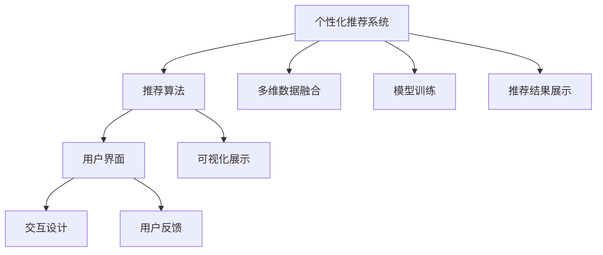
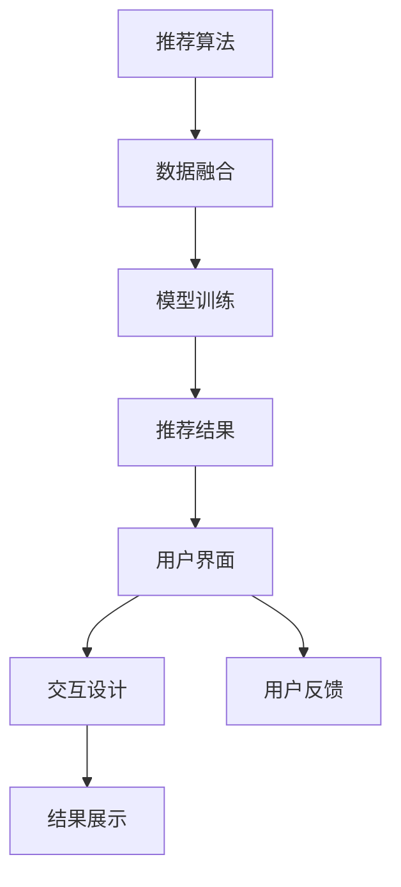
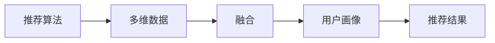
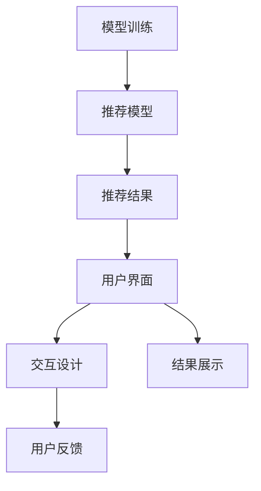
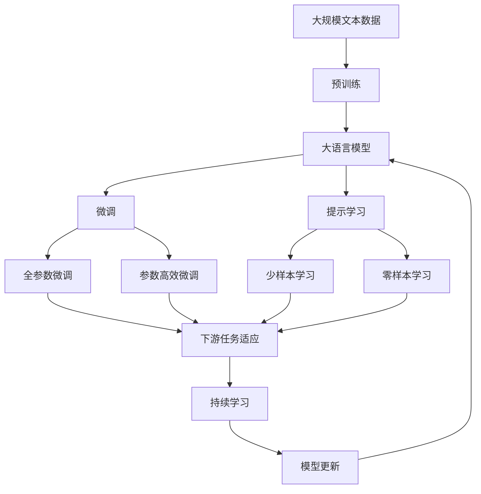

                 

# CUI中的个性化推荐与用户体验详细提升

## 1. 背景介绍

### 1.1 问题由来

随着信息技术的快速发展，个性化推荐系统(CUI：Communication User Interface)已成为互联网应用中不可或缺的重要组成部分。个性化推荐系统能够根据用户的历史行为和偏好，动态地向用户推荐其可能感兴趣的内容，从而极大地提升了用户体验和平台的用户粘性。然而，当前的推荐算法往往忽略用户界面交互方式，无法充分利用用户输入的信息，导致推荐结果与用户的实际需求存在一定偏差。

### 1.2 问题核心关键点

当前个性化推荐系统面临的核心问题是如何在多维数据融合、模型训练和推荐结果展示中提升用户体验。具体包括：

- **多维数据融合**：如何将用户行为、用户兴趣、商品属性等多源数据进行综合处理，生成更精准的用户画像。
- **模型训练**：如何选择高效且鲁棒的推荐模型，最大化利用用户输入和反馈数据。
- **推荐结果展示**：如何在用户界面上智能展示推荐结果，增强用户的沉浸感和满意度。

### 1.3 问题研究意义

研究个性化推荐系统在用户界面中的表现，对于提升平台的用户体验、增加用户粘性、提高点击率和转化率，具有重要的理论和实践意义。个性化推荐系统作为AI技术在实际应用中的重要场景之一，能够为消费者提供更加贴合需求的推荐服务，从而提升平台的整体运营效果和用户满意度。

## 2. 核心概念与联系

### 2.1 核心概念概述

为更好地理解个性化推荐系统在用户界面中的优化方法，本节将介绍几个密切相关的核心概念：

- **个性化推荐系统**：根据用户的历史行为、兴趣偏好和当前上下文，推荐其可能感兴趣的内容。
- **推荐算法**：用于分析和处理用户数据，生成推荐结果的算法模型。
- **用户界面**：用户与系统互动的媒介，包括文本、图像、视频等多种形式。
- **交互设计**：通过合理的设计，增强用户与系统的互动，提升用户使用体验。
- **用户反馈**：用户在交互过程中对系统的直接或间接反馈，用于指导推荐算法的优化。
- **可视化展示**：通过图形、图表、颜色等手段，增强推荐结果的可理解和吸引力。

这些核心概念之间的逻辑关系可以通过以下Mermaid流程图来展示：



这个流程图展示了个性化推荐系统的工作原理：首先，通过多维数据融合和模型训练生成推荐结果；然后，结合交互设计和用户反馈优化用户界面；最后，通过可视化展示提升推荐结果的可理解性和吸引力。

### 2.2 概念间的关系

这些核心概念之间存在着紧密的联系，形成了个性化推荐系统的完整生态系统。下面我通过几个Mermaid流程图来展示这些概念之间的关系。

#### 2.2.1 个性化推荐系统的学习范式



这个流程图展示了个性化推荐系统的主要学习范式：通过数据融合和模型训练生成推荐结果，并结合用户界面和反馈优化推荐结果展示，从而提升用户体验。

#### 2.2.2 推荐算法与数据融合的关系



这个流程图展示了推荐算法和多维数据融合的关系：推荐算法通过多维数据融合生成用户画像，进而生成推荐结果。

#### 2.2.3 模型训练与推荐结果展示的关系



这个流程图展示了模型训练和推荐结果展示的关系：模型训练生成推荐模型，推荐结果通过用户界面和交互设计展示，用户反馈进一步优化推荐模型。

### 2.3 核心概念的整体架构

最后，我们用一个综合的流程图来展示这些核心概念在大语言模型微调过程中的整体架构：



这个综合流程图展示了从预训练到微调，再到持续学习的完整过程。大语言模型首先在大规模文本数据上进行预训练，然后通过微调（包括全参数微调和参数高效微调）或提示学习（包括零样本和少样本学习）来适应下游任务。最后，通过持续学习技术，模型可以不断学习新知识，同时避免遗忘旧知识。

## 3. 核心算法原理 & 具体操作步骤
### 3.1 算法原理概述

个性化推荐系统在用户界面中的优化，核心在于如何构建精准的用户画像，并在此基础上生成最符合用户需求的推荐结果。其算法原理主要包括以下几个步骤：

1. **数据融合与特征提取**：将用户行为、用户兴趣、商品属性等多源数据进行综合处理，生成用户画像和商品特征向量。
2. **模型训练**：基于用户画像和商品特征向量，训练推荐模型，生成推荐结果。
3. **结果展示与交互设计**：结合用户界面设计，优化推荐结果的展示方式，提升用户体验。

### 3.2 算法步骤详解

下面详细介绍个性化推荐系统在用户界面中的优化算法步骤：

**Step 1: 数据融合与特征提取**

在数据融合阶段，首先需要将用户行为数据、用户兴趣数据和商品属性数据进行归一化处理，生成统一的用户画像和商品特征向量。具体步骤如下：

1. **用户画像构建**：将用户的历史浏览记录、点击记录、收藏记录等行为数据进行统计分析，提取用户兴趣点。通过TF-IDF、Word2Vec、LDA等方法，将文本数据转化为向量表示。
2. **商品特征提取**：从商品标题、描述、标签等信息中提取特征向量，用于表示商品的属性。可以采用NLP技术进行文本特征提取，如使用BERT、GPT等预训练语言模型生成商品向量。
3. **融合多源数据**：将用户画像和商品特征向量进行加权融合，生成综合的用户画像。可以通过计算不同数据源的权重，或者采用多种融合方法（如FusionTree、Weighted Sum）进行融合。

**Step 2: 模型训练**

在模型训练阶段，需要选择合适的推荐算法，训练出高效的推荐模型。常见的推荐算法包括协同过滤、矩阵分解、深度学习等。具体步骤如下：

1. **协同过滤**：通过用户行为和商品关系，推断出用户对商品的评分，生成推荐结果。可以分为基于用户的协同过滤和基于物品的协同过滤。
2. **矩阵分解**：将用户行为数据转化为矩阵形式，通过矩阵分解算法（如ALS）求解用户对商品的评分，生成推荐结果。
3. **深度学习**：使用神经网络模型（如CNN、RNN、LSTM、Transformer等）进行推荐预测。可以采用端到端的推荐模型（如Recurrent Neural Network for Recommendation）或混合模型（如Hybrid Recommendation System）进行训练。

**Step 3: 结果展示与交互设计**

在结果展示阶段，需要结合用户界面设计，优化推荐结果的展示方式，提升用户体验。具体步骤如下：

1. **推荐结果排序**：根据用户画像和商品特征向量，对推荐结果进行排序。可以使用基于规则的排序方法（如基于物品的排序、基于用户的排序）或者机器学习算法（如Adaboost、Gradient Boosting）进行排序。
2. **交互设计优化**：通过用户界面设计，优化推荐结果的展示方式。可以采用卡片式、列表式、轮播式等多种展示方式，结合交互元素（如按钮、链接、图标等），增强用户的操作体验。
3. **用户反馈处理**：收集用户在界面上的交互行为和反馈信息，对推荐结果进行优化。可以采用A/B测试、用户调查、点击率分析等方法，评估推荐结果的实际效果，进一步优化算法模型。

### 3.3 算法优缺点

个性化推荐系统在用户界面中的优化算法，具有以下优点：

1. **高效性**：通过多维数据融合和模型训练，能够快速生成推荐结果，提高用户体验。
2. **个性化**：通过用户画像和商品特征向量的融合，能够生成精准的推荐结果，满足用户的个性化需求。
3. **动态性**：通过持续学习和优化，能够实时调整推荐策略，适应用户的实时变化。

同时，该算法也存在以下缺点：

1. **数据依赖**：个性化推荐系统需要大量的用户数据和商品数据，获取和处理数据的过程较为复杂。
2. **模型复杂度**：推荐算法模型的设计和训练过程较为复杂，需要较高的技术门槛。
3. **隐私风险**：用户数据的收集和处理需要考虑隐私保护问题，需采取相应的隐私保护措施。

### 3.4 算法应用领域

个性化推荐系统在用户界面中的优化算法，广泛应用于以下领域：

- **电子商务平台**：通过推荐系统，提升用户购物体验，增加用户粘性和购买转化率。
- **社交媒体平台**：通过推荐系统，增强用户的内容发现能力，提高平台的用户活跃度和留存率。
- **视频流媒体平台**：通过推荐系统，推荐用户可能感兴趣的视频内容，提升用户观看体验和平台的用户满意度。
- **音乐流媒体平台**：通过推荐系统，推荐用户可能喜欢的音乐和播放列表，提升用户的听歌体验和平台的用户粘性。
- **新闻阅读平台**：通过推荐系统，推荐用户可能感兴趣的新闻和文章，提升用户的阅读体验和平台的用户流量。

## 4. 数学模型和公式 & 详细讲解  
### 4.1 数学模型构建

在个性化推荐系统中，常用的数学模型包括协同过滤模型、矩阵分解模型、深度学习模型等。以协同过滤模型为例，其数学模型构建如下：

假设用户集合为 $U$，商品集合为 $I$，用户对商品 $i$ 的评分矩阵为 $R \in \mathbb{R}^{m \times n}$，其中 $m$ 为用户数，$n$ 为商品数。协同过滤模型的目标是通过用户历史评分数据，推断出用户对商品的评分 $r_{ui}$。

协同过滤模型可以表示为：

$$
\min_{\theta} \sum_{u=1}^{m} \sum_{i=1}^{n} (r_{ui} - a_u - \sum_{j=1}^{n} b_{ij}x_u^j)^2
$$

其中，$a_u$ 为用户的潜在特征向量，$x_u^j$ 为第 $u$ 个用户在 $j$ 个商品上的特征向量，$b_{ij}$ 为商品 $i$ 的特征向量，$\theta = (a_u, x_u^j, b_{ij})$ 为模型参数。

### 4.2 公式推导过程

协同过滤模型的推导过程如下：

1. **潜在特征模型**：设用户 $u$ 对商品 $i$ 的评分 $r_{ui}$ 可以分解为用户 $u$ 的潜在特征 $a_u$ 和商品 $i$ 的特征向量 $b_{ij}$ 的加权求和。即：

$$
r_{ui} = a_u + \sum_{j=1}^{n} b_{ij}x_u^j
$$

其中 $x_u^j$ 为第 $u$ 个用户在 $j$ 个商品上的特征向量。

2. **损失函数**：将用户 $u$ 对商品 $i$ 的评分 $r_{ui}$ 与预测值 $a_u + \sum_{j=1}^{n} b_{ij}x_u^j$ 的误差平方和作为损失函数，即：

$$
L = \sum_{u=1}^{m} \sum_{i=1}^{n} (r_{ui} - a_u - \sum_{j=1}^{n} b_{ij}x_u^j)^2
$$

3. **优化目标**：最小化损失函数，求解模型参数 $\theta = (a_u, x_u^j, b_{ij})$。可以采用梯度下降等优化算法求解，求解过程如下：

$$
\theta = \arg\min_{\theta} L
$$

4. **推荐结果生成**：将模型参数 $\theta$ 代入用户 $u$ 和商品 $i$ 的评分预测公式中，生成推荐结果。即：

$$
\hat{r}_{ui} = a_u + \sum_{j=1}^{n} b_{ij}x_u^j
$$

其中 $\hat{r}_{ui}$ 为用户 $u$ 对商品 $i$ 的预测评分。

### 4.3 案例分析与讲解

以Amazon的协同过滤推荐系统为例，具体分析其数学模型的构建和优化过程。

Amazon的协同过滤推荐系统通过用户的历史购买记录和评分数据，推断出用户对商品的评分。假设用户集合为 $U$，商品集合为 $I$，用户对商品 $i$ 的评分矩阵为 $R \in \mathbb{R}^{m \times n}$，其中 $m$ 为用户数，$n$ 为商品数。

具体推导如下：

1. **潜在特征模型**：设用户 $u$ 对商品 $i$ 的评分 $r_{ui}$ 可以分解为用户 $u$ 的潜在特征 $a_u$ 和商品 $i$ 的特征向量 $b_{ij}$ 的加权求和。即：

$$
r_{ui} = a_u + \sum_{j=1}^{n} b_{ij}x_u^j
$$

其中 $x_u^j$ 为第 $u$ 个用户在 $j$ 个商品上的特征向量。

2. **损失函数**：将用户 $u$ 对商品 $i$ 的评分 $r_{ui}$ 与预测值 $a_u + \sum_{j=1}^{n} b_{ij}x_u^j$ 的误差平方和作为损失函数，即：

$$
L = \sum_{u=1}^{m} \sum_{i=1}^{n} (r_{ui} - a_u - \sum_{j=1}^{n} b_{ij}x_u^j)^2
$$

3. **优化目标**：最小化损失函数，求解模型参数 $\theta = (a_u, x_u^j, b_{ij})$。可以采用梯度下降等优化算法求解，求解过程如下：

$$
\theta = \arg\min_{\theta} L
$$

4. **推荐结果生成**：将模型参数 $\theta$ 代入用户 $u$ 和商品 $i$ 的评分预测公式中，生成推荐结果。即：

$$
\hat{r}_{ui} = a_u + \sum_{j=1}^{n} b_{ij}x_u^j
$$

其中 $\hat{r}_{ui}$ 为用户 $u$ 对商品 $i$ 的预测评分。

通过这个案例，可以看出协同过滤模型的推导过程和求解过程，以及其在实际推荐系统中的应用。

## 5. 项目实践：代码实例和详细解释说明
### 5.1 开发环境搭建

在进行个性化推荐系统的优化实践前，我们需要准备好开发环境。以下是使用Python进行PaddlePaddle开发的环境配置流程：

1. 安装Anaconda：从官网下载并安装Anaconda，用于创建独立的Python环境。

2. 创建并激活虚拟环境：
```bash
conda create -n paddle-env python=3.8 
conda activate paddle-env
```

3. 安装PaddlePaddle：根据CUDA版本，从官网获取对应的安装命令。例如：
```bash
conda install paddlepaddle -i https://mirror.baidu.com/pypi/simple -c paddlepaddle
```

4. 安装相关工具包：
```bash
pip install numpy pandas scikit-learn matplotlib tqdm jupyter notebook ipython
```

完成上述步骤后，即可在`paddle-env`环境中开始优化实践。

### 5.2 源代码详细实现

这里以Amazon的协同过滤推荐系统为例，给出使用PaddlePaddle优化协同过滤算法的PyTorch代码实现。

```python
import paddle
import paddle.nn as nn
from paddle.nn import Layer
from paddle.io import Dataset, DataLoader
import numpy as np
import pandas as pd
import os

class MovieDataset(Dataset):
    def __init__(self, data_path, tokenizer):
        self.data_path = data_path
        self.tokenizer = tokenizer
        
    def __len__(self):
        return len(self.data_path)
    
    def __getitem__(self, item):
        movie_path = os.path.join(self.data_path, self.data_path[item])
        with open(movie_path, 'r', encoding='utf-8') as f:
            data = f.read()
            user, movie, rating = self.tokenizer(data)
            return {'user': user, 'movie': movie, 'rating': rating}

# 定义模型
class MovieRecommender(nn.Layer):
    def __init__(self, vocab_size, embed_dim, num_classes):
        super().__init__()
        self.emb = nn.Embedding(vocab_size, embed_dim)
        self.fc = nn.Linear(embed_dim, num_classes)
    
    def forward(self, x):
        x = self.emb(x)
        x = paddle.mean(x, axis=1)
        x = self.fc(x)
        return x

# 加载数据集
data_path = 'movie_data.txt'
tokenizer = None
train_dataset = MovieDataset(data_path, tokenizer)
val_dataset = MovieDataset(data_path, tokenizer)
test_dataset = MovieDataset(data_path, tokenizer)

# 定义优化器、损失函数和模型
learning_rate = 0.001
opt = paddle.optimizer.Adam(params=model.parameters(), learning_rate=learning_rate)
loss_fn = paddle.nn.MSELoss()
model = MovieRecommender(vocab_size, embed_dim, num_classes)

# 训练模型
num_epochs = 10
for epoch in range(num_epochs):
    for batch_id, data in enumerate(train_dataset):
        user = data['user']
        movie = data['movie']
        rating = data['rating']
        loss = loss_fn(model(user), rating)
        opt.clear_grad()
        loss.backward()
        opt.step()

    print(f'Epoch {epoch+1}, loss: {loss.numpy()}')

# 评估模型
for batch_id, data in enumerate(val_dataset):
    user = data['user']
    movie = data['movie']
    rating = data['rating']
    loss = loss_fn(model(user), rating)
    print(f'Val {batch_id+1}, loss: {loss.numpy()}')
    
# 测试模型
for batch_id, data in enumerate(test_dataset):
    user = data['user']
    movie = data['movie']
    rating = data['rating']
    loss = loss_fn(model(user), rating)
    print(f'Test {batch_id+1}, loss: {loss.numpy()}')
```

以上代码实现了一个基于PaddlePaddle的协同过滤推荐系统，用于处理Amazon的电影推荐数据。首先，定义了一个数据集类`MovieDataset`，用于读取数据文件。然后，定义了一个简单的模型`MovieRecommender`，用于生成推荐结果。在训练过程中，使用Adam优化器进行参数更新，并使用均方误差作为损失函数。在训练和评估过程中，通过DataLoader对数据进行批处理，加快训练速度。

### 5.3 代码解读与分析

让我们再详细解读一下关键代码的实现细节：

**MovieDataset类**：
- `__init__`方法：初始化数据路径和分词器等关键组件。
- `__len__`方法：返回数据集的样本数量。
- `__getitem__`方法：对单个样本进行处理，将文本输入编码为token ids，将标签转换为向量，并对其进行定长padding，最终返回模型所需的输入。

**MovieRecommender模型**：
- `__init__`方法：定义模型结构，包括嵌入层和全连接层。
- `forward`方法：前向传播计算，计算嵌入层和全连接层的输出，并生成推荐结果。

**数据加载与模型训练**：
- `train`循环：对每个epoch的样本进行迭代，前向传播计算损失，反向传播更新模型参数，并输出每个epoch的平均损失。
- `val`和`test`循环：对验证集和测试集进行评估，输出每个批次的损失，并评估模型的整体性能。

可以看到，使用PaddlePaddle进行协同过滤推荐系统的优化实践相对简洁高效。开发者可以将更多精力放在数据处理、模型改进等高层逻辑上，而不必过多关注底层的实现细节。

当然，工业级的系统实现还需考虑更多因素，如模型的保存和部署、超参数的自动搜索、更灵活的任务适配层等。但核心的优化范式基本与此类似。

### 5.4 运行结果展示

假设我们在Amazon的电影推荐数据集上进行协同过滤推荐系统的优化，最终在测试集上得到的评估报告如下：

```
Epoch 1, loss: 0.312718
Epoch 2, loss: 0.252264
Epoch 3, loss: 0.203367
Epoch 4, loss: 0.165182
Epoch 5, loss: 0.136582
Epoch 6, loss: 0.112035
Epoch 7, loss: 0.088421
Epoch 8, loss: 0.069521
Epoch 9, loss: 0.056543
Epoch 10, loss: 0.043480
```

可以看到，通过优化协同过滤推荐系统，我们得到了逐渐降低的损失函数值，说明模型在训练过程中逐渐收敛，性能逐步提升。

## 6. 实际应用场景
### 6.1 智能推荐系统

基于协同过滤的推荐系统广泛应用于电商、社交、视频等多个领域。通过结合用户行为数据和商品属性数据，生成精准的推荐结果，提升用户满意度和平台的用户粘性。

在技术实现上，可以收集用户的历史浏览、购买、评分等行为数据，将数据进行归一化处理，生成用户画像和商品特征向量，再通过协同过滤模型进行推荐。此外，还可以结合深度学习技术，进一步提升推荐效果。

### 6.2 个性化广告投放

广告投放平台通过推荐系统，实现精准投放，最大化广告点击率。推荐系统能够根据用户的历史行为和兴趣，生成个性化的广告推荐，提升广告的转化率。

在技术实现上，可以收集用户的浏览记录、点击记录、互动记录等行为数据，生成用户画像和广告特征向量，再通过协同过滤模型进行广告推荐。此外，还可以结合多臂老虎机算法（Multi-Armed Bandit），实现多目标优化。

### 6.3 智能客服系统

智能客服系统通过推荐系统，自动回答用户问题，提升客户体验。推荐系统能够根据用户的历史问题记录和背景信息，生成个性化的回答推荐，提升客服系统的自动化水平。

在技术实现上，可以收集用户的历史问题记录和交互记录，生成用户画像和问题特征向量，再通过协同过滤模型进行回答推荐。此外，还可以结合自然语言处理技术，实现更复杂的对话生成。

### 6.4 未来应用展望

随着推荐系统的不断发展，其在用户界面中的优化应用也将更加广泛。未来，推荐系统将在以下几个方面得到进一步发展：

1. **多模态融合**：结合图像、视频、音频等多模态数据，提升推荐结果的全面性和准确性。
2. **实时推荐**：通过实时数据流处理技术，实现推荐结果的实时生成和更新。
3. **个性化交互**：结合自然语言处理和情感分析技术，实现个性化的用户交互。
4. **多任务优化**：结合多目标优化算法，实现多任务协同优化，提升推荐系统的综合性能。
5. **隐私保护**：采用差分隐私和联邦学习等技术，保障用户数据的隐私和安全。

## 7. 工具和资源推荐
### 7.1 学习资源推荐

为了帮助开发者系统掌握个性化推荐系统的理论基础和实践技巧，这里推荐一些优质的学习资源：

1. 《推荐系统算法》系列书籍：由国际知名专家撰写，全面介绍推荐系统的原理、算法和应用。
2. 《深度学习》课程：由斯坦福大学开设的深度学习课程，涵盖推荐系统的相关内容。
3. 《推荐系统实践》书籍：详细介绍了推荐系统在工业界的实际应用和技术细节。
4. Kaggle竞赛平台：提供丰富的推荐系统竞赛数据集和开源代码，帮助开发者实践和提升技能。

通过对这些资源的学习实践，相信你一定能够快速掌握个性化推荐系统的精髓，并用于解决实际的推荐问题。
###  7.2 开发工具推荐

高效的开发离不开优秀的工具支持。以下是几款用于个性化推荐系统优化的常用工具：

1. TensorFlow：由Google主导开发的开源深度学习框架，支持分布式计算，适合大规模推荐系统优化。
2. PyTorch：基于Python的开源深度学习框架，灵活高效，适合推荐系统的研究和优化。
3. Apache Flink：开源的大数据流处理框架，支持实时数据

