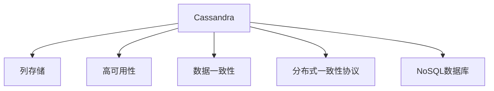
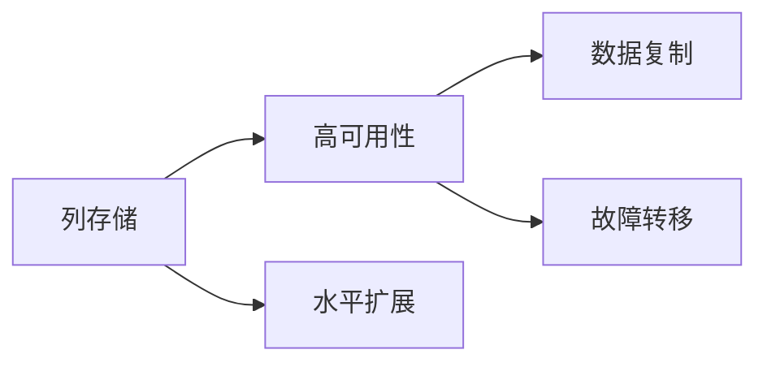
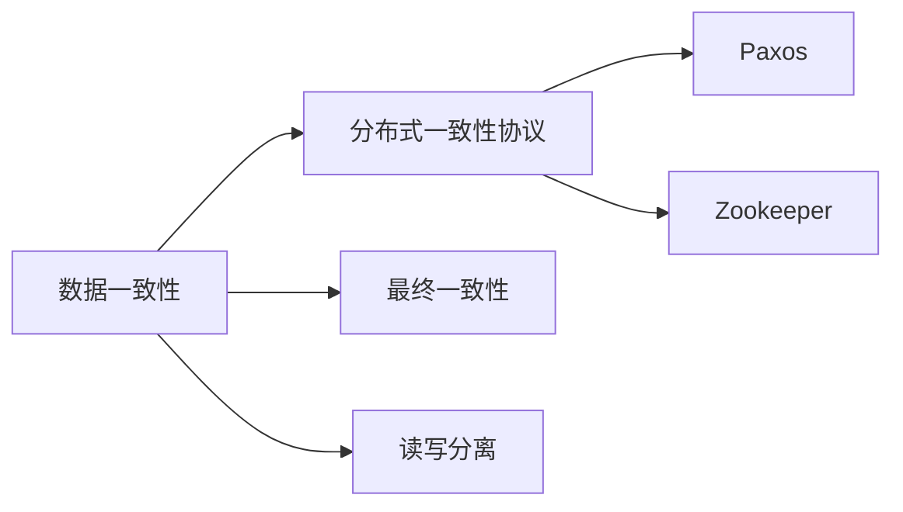
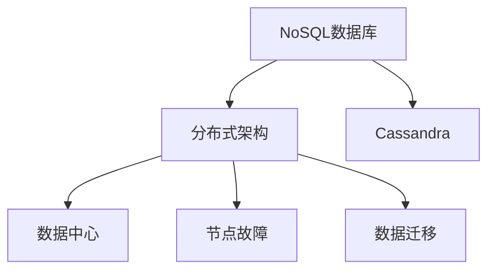
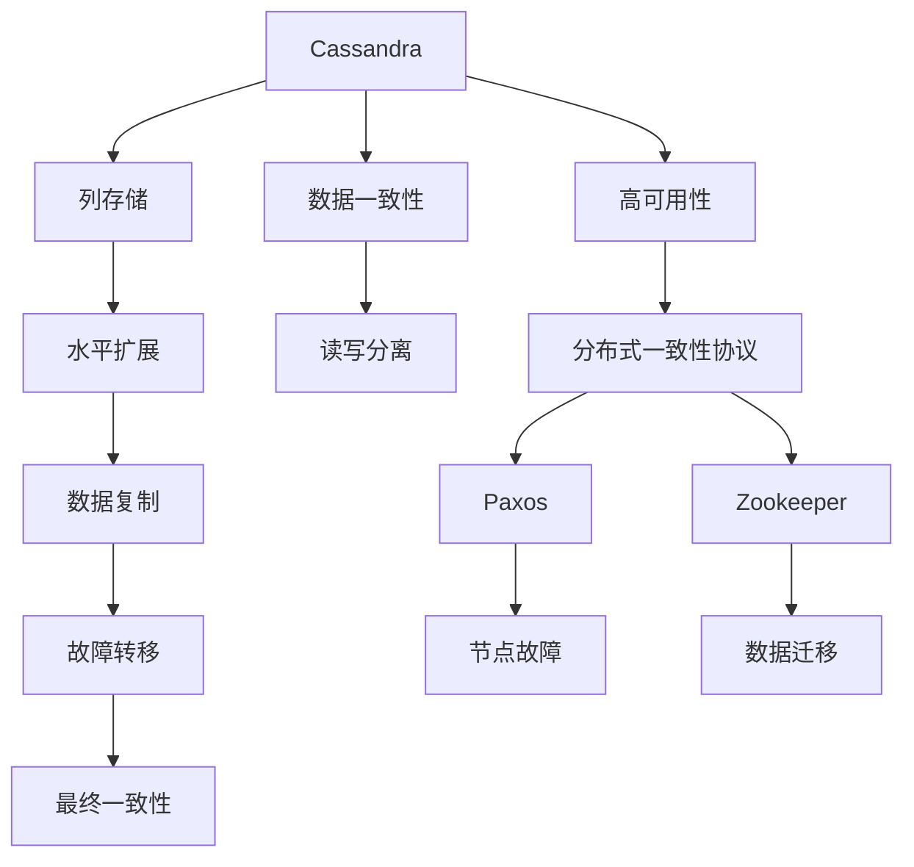

                 

# Cassandra原理与代码实例讲解

> 关键词：Cassandra,分布式数据库,NoSQL,列存储,数据一致性,高可用性

## 1. 背景介绍

### 1.1 问题由来
在当今大数据时代，传统的集中式关系数据库已经难以满足企业对高可用性、高性能和可扩展性的需求。企业希望有一个分布式、可扩展、高可靠的数据库系统来支撑其业务的发展。Cassandra正是在这样的背景下应运而生，它是一个高度可扩展的分布式数据库系统，被广泛应用于各种需要高可用性和高可扩展性的场景，如电子商务、社交网络、日志记录等。

### 1.2 问题核心关键点
Cassandra的核心特点包括：
- 高度可扩展：通过水平扩展来应对数据量的增长，支持数万节点的集群规模。
- 高可用性：通过数据复制和节点故障转移，保证系统的高可用性和容错性。
- 高性能：通过多数据中心和异步写入机制，实现低延迟和高吞吐量。
- 强一致性：支持线性化读和最终一致性，保证数据的一致性和完整性。
- 动态性：支持动态添加和删除节点，不影响系统的稳定性和可用性。

这些特点使得Cassandra成为处理大规模数据和复杂业务场景的理想选择。

### 1.3 问题研究意义
Cassandra的研究和应用具有重要意义：

1. 降低数据管理成本：通过分布式存储，Cassandra可以有效降低数据管理成本，避免单点故障。
2. 提升数据处理效率：通过高可用性和高性能设计，Cassandra可以快速处理海量数据，满足实时业务需求。
3. 增强系统可靠性：通过冗余备份和故障转移机制，Cassandra可以保障数据的安全性和可靠性。
4. 推动技术创新：Cassandra的分布式架构和数据模型，为大数据技术的发展提供了新思路和新方向。
5. 赋能产业升级：Cassandra等分布式数据库系统的应用，将为传统行业数字化转型提供新的技术支撑。

## 2. 核心概念与联系

### 2.1 核心概念概述

为了更好地理解Cassandra的工作原理和架构设计，本节将介绍几个关键概念：

- **Cassandra**：一种高可用、分布式、NoSQL数据库系统，由Facebook开发并开源。
- **列存储**：一种将数据按照列进行存储的数据模型，相较于传统的关系数据库，具有更好的扩展性和存储效率。
- **数据一致性**：指分布式系统中数据的一致性级别，常见的有强一致性、最终一致性、读写分离等。
- **高可用性**：指系统在节点故障时仍能保持服务的正常运行，常见的通过数据复制和故障转移实现。
- **分布式一致性协议**：如Paxos、Zookeeper等，用于保证分布式系统中的数据一致性和可靠性。
- **NoSQL数据库**：非关系型数据库，以文档、键值对、列存储等非结构化方式存储数据，适用于大规模数据处理和分布式计算。

这些核心概念之间的逻辑关系可以通过以下Mermaid流程图来展示：



这个流程图展示了Cassandra的核心概念及其之间的关系：

1. Cassandra是一种基于列存储的NoSQL数据库，适合处理大规模数据。
2. 列存储具有高扩展性和存储效率，是Cassandra的核心数据模型。
3. 高可用性是Cassandra的重要特点，通过数据复制和故障转移实现。
4. 数据一致性是分布式系统的核心问题，Cassandra支持最终一致性等一致性级别。
5. 分布式一致性协议用于保证数据一致性和可靠性，是Cassandra的底层机制。
6. Cassandra属于NoSQL数据库的一种，与传统的关系数据库有本质区别。

通过理解这些核心概念，我们可以更好地把握Cassandra的工作原理和架构设计。

### 2.2 概念间的关系

这些核心概念之间存在着紧密的联系，形成了Cassandra的工作框架。下面我们通过几个Mermaid流程图来展示这些概念之间的关系。

#### 2.2.1 列存储与高可用性的关系



这个流程图展示了列存储与高可用性的关系：

1. 列存储通过水平扩展来应对数据量的增长，支持大规模集群。
2. 数据复制和高可用性相辅相成，通过多数据中心的冗余备份，保证系统的可靠性和容错性。
3. 故障转移机制在节点故障时自动切换数据中心，确保系统持续运行。

#### 2.2.2 数据一致性与分布式一致性协议的关系



这个流程图展示了数据一致性与分布式一致性协议的关系：

1. 数据一致性是分布式系统的核心问题，需要通过一致性协议来保证。
2. Paxos和Zookeeper是常用的分布式一致性协议，用于保证系统的数据一致性。
3. 最终一致性是Cassandra支持的一致性级别之一，保证系统的一致性和可靠性。
4. 读写分离是指将读操作和写操作分别处理，以提高系统的吞吐量和性能。

#### 2.2.3 NoSQL数据库与分布式架构的关系



这个流程图展示了NoSQL数据库与分布式架构的关系：

1. NoSQL数据库通常采用分布式架构，通过多数据中心和节点来实现高可用性和高扩展性。
2. Cassandra是一种典型的NoSQL数据库，支持分布式部署和数据迁移。
3. 数据中心是分布式架构的物理单元，通过跨数据中心的数据复制，保证系统的可靠性和一致性。
4. 节点故障和数据迁移是分布式系统的常见问题，需要通过设计来解决。

### 2.3 核心概念的整体架构

最后，我们用一个综合的流程图来展示这些核心概念在大规模数据处理中的整体架构：



这个综合流程图展示了Cassandra在处理大规模数据时的整体架构：

1. Cassandra通过列存储和水平扩展来处理大规模数据，支持数万节点的集群规模。
2. 数据复制和高可用性相辅相成，通过冗余备份和故障转移保证系统的可靠性和一致性。
3. 最终一致性保证数据的一致性和完整性，支持分布式系统中的强一致性需求。
4. 分布式一致性协议如Paxos和Zookeeper，用于保证数据一致性和可靠性。
5. 读写分离将读操作和写操作分别处理，提高系统的吞吐量和性能。
6. 数据一致性和高可用性是Cassandra的基石，保障系统的稳定性和可靠性。

通过这些流程图，我们可以更清晰地理解Cassandra的工作原理和架构设计。

## 3. 核心算法原理 & 具体操作步骤
### 3.1 算法原理概述

Cassandra的核心算法原理主要围绕数据存储、数据一致性和高可用性展开。其核心思想是：通过列存储和水平扩展来存储数据，通过数据复制和高可用性机制来保证系统的可靠性和容错性，通过最终一致性协议来保证数据的一致性和完整性。

### 3.2 算法步骤详解

Cassandra的主要算法步骤包括：

**Step 1: 数据模型设计**
- 设计数据模型，将数据按照列进行存储。
- 定义数据表的字段和数据类型。
- 设置主键和索引，优化查询效率。

**Step 2: 数据存储和复制**
- 将数据存储在多个数据中心和节点上，实现水平扩展。
- 通过数据复制，将数据备份到多个节点上，保证数据的冗余和可靠性。
- 根据节点故障和网络分区情况，自动调整数据副本的位置，保证系统的可用性。

**Step 3: 数据一致性和最终一致性**
- 通过最终一致性协议，保证数据在多个节点上的最终一致性。
- 使用线性化读和写入机制，保证数据的一致性和完整性。
- 支持读写分离，将读操作和写操作分别处理，提高系统的性能。

**Step 4: 高可用性和故障转移**
- 通过故障转移机制，自动将读操作切换到备用节点，保证系统的持续运行。
- 使用Paxos和Zookeeper等分布式一致性协议，保证系统的可靠性和一致性。
- 支持动态添加和删除节点，不影响系统的稳定性和可用性。

### 3.3 算法优缺点

Cassandra的优势包括：

- 高扩展性和存储效率：列存储和水平扩展使得Cassandra能够处理大规模数据。
- 高可用性和容错性：数据复制和故障转移机制保证系统的可靠性和容错性。
- 高性能和低延迟：异步写入和多数据中心机制提升系统的性能和响应速度。
- 最终一致性和强一致性：支持多种一致性级别，满足不同应用场景的需求。
- 动态性和灵活性：支持动态添加和删除节点，不影响系统的稳定性和可用性。

但同时，Cassandra也存在一些缺点：

- 复杂的配置和管理：Cassandra的配置和管理比较复杂，需要专业的运维人员。
- 数据一致性的选择：最终一致性和强一致性之间的选择，需要根据应用场景来决定。
- 低一致性可能的数据损失：最终一致性可能在网络分区的情况下导致数据不一致。
- 复杂的应用逻辑：部分应用场景需要复杂的逻辑处理，Cassandra需要配合其他技术进行优化。

### 3.4 算法应用领域

Cassandra在多个领域得到了广泛应用，例如：

- 电子商务：存储海量交易数据和用户行为数据，支持高并发和低延迟查询。
- 社交网络：存储用户数据和互动数据，支持实时数据处理和分析。
- 日志记录：存储和分析日志数据，支持分布式采集和存储。
- 金融服务：存储金融交易数据和用户行为数据，支持高可用性和高性能要求。
- 物联网：存储和分析传感器数据，支持分布式计算和实时处理。

这些应用场景要求系统具备高可用性、高扩展性和高性能，Cassandra正是在这些方面表现优异。

## 4. 数学模型和公式 & 详细讲解 & 举例说明

### 4.1 数学模型构建

Cassandra的数学模型主要围绕数据一致性和最终一致性展开。下面以线性化读和最终一致性为例，介绍Cassandra的数学模型构建。

假设有一个包含m个节点的Cassandra集群，每个节点存储一份数据副本。当系统收到一个写操作时，将其写入所有节点上。当一个节点收到读操作时，先从本地读取数据，如果本地数据存在，则直接返回；如果本地数据不存在，则向所有副本节点发送读请求，等待所有节点返回结果。

定义：

- $R_i$：节点$i$上的数据副本。
- $W_i$：节点$i$上的数据副本的值。
- $w$：节点$i$上的写操作值。

则数据一致性可以定义为：当所有副本节点的值一致时，返回最终值。即：

$$ R_1 = R_2 = ... = R_m = w $$

### 4.2 公式推导过程

线性化读和最终一致性的推导过程如下：

**Step 1: 写操作**
当一个节点收到写操作时，将其写入所有节点上，则：

$$ W_i = w, \forall i \in [1, m] $$

**Step 2: 读操作**
当一个节点收到读操作时，先从本地读取数据，如果本地数据存在，则直接返回；如果本地数据不存在，则向所有副本节点发送读请求，等待所有节点返回结果。设$R_i$为节点$i$上的数据副本，则：

$$ R_i = \begin{cases} 
    w, & \text{if $R_i$ exists} \\
    \max(R_j), & \text{if $R_i$ does not exist and $R_j$ exists} \\
    \text{undefined}, & \text{if $R_j$ does not exist}
\end{cases} $$

### 4.3 案例分析与讲解

以用户注册为例，介绍Cassandra的数据模型设计和一致性协议。

**Step 1: 数据模型设计**
假设用户注册表包含以下字段：

- `id`: 用户ID
- `name`: 用户名
- `email`: 用户邮箱
- `phone`: 用户电话

**Step 2: 数据存储和复制**
将用户注册表存储在多个数据中心和节点上，实现水平扩展。通过数据复制，将数据备份到多个节点上，保证数据的冗余和可靠性。

**Step 3: 数据一致性和最终一致性**
使用最终一致性协议，保证数据在多个节点上的最终一致性。支持线性化读和写入机制，保证数据的一致性和完整性。支持读写分离，将读操作和写操作分别处理，提高系统的性能。

**Step 4: 高可用性和故障转移**
通过故障转移机制，自动将读操作切换到备用节点，保证系统的持续运行。使用Paxos和Zookeeper等分布式一致性协议，保证系统的可靠性和一致性。支持动态添加和删除节点，不影响系统的稳定性和可用性。

## 5. 项目实践：代码实例和详细解释说明
### 5.1 开发环境搭建

在进行Cassandra实践前，我们需要准备好开发环境。以下是使用Java和Cassandra客户端进行开发的配置流程：

1. 安装Java：从官网下载并安装最新版本的Java JDK。
2. 安装Cassandra：从官网下载并安装最新版本的Cassandra软件包。
3. 启动Cassandra节点：启动Cassandra节点，配置集群信息。

```bash
cassandra -f cassandra.yaml
```

4. 创建新的Cassandra数据库：使用cqlsh客户端创建新的数据库。

```bash
cqlsh -e
```

### 5.2 源代码详细实现

下面我们以用户注册表为例，给出使用Cassandra进行数据存储和一致性管理的Java代码实现。

```java
import com.datastax.driver.core.Cluster;
import com.datastax.driver.core.Row;
import com.datastax.driver.core.Session;
import com.datastax.driver.core.cql.ResultSet;

public class UserRegistration {
    public static void main(String[] args) {
        // 创建Cassandra集群连接
        Cluster cluster = Cluster.builder().addContactPoints("127.0.0.1").build();
        Session session = cluster.connect();

        // 创建用户注册表
        String sql = "CREATE TABLE user_registration ( " +
            "id UUID PRIMARY KEY, " +
            "name text, " +
            "email text, " +
            "phone text)";
        session.execute(sql);

        // 插入用户注册数据
        Row row = session.prepare("INSERT INTO user_registration (id, name, email, phone) VALUES (?, ?, ?, ?)")
            .bind(UUID.randomUUID().toString(), "John Doe", "john.doe@example.com", "1234567890");
        session.execute(row);

        // 读取用户注册数据
        ResultSet result = session.execute("SELECT * FROM user_registration WHERE id = ?")
            .bind(UUID.randomUUID().toString());
        for (Row row : result) {
            System.out.println(row);
        }
    }
}
```

### 5.3 代码解读与分析

让我们再详细解读一下关键代码的实现细节：

**Cluster和Session类**：
- `Cluster`类：用于创建Cassandra集群连接。
- `Session`类：用于执行Cassandra SQL语句。

**CREATE TABLE语句**：
- 创建用户注册表，包含id、name、email、phone四个字段。
- 其中id为UUID类型的主键，保证数据的唯一性。

**INSERT语句**：
- 插入用户注册数据，使用prepared statement绑定变量，保证数据安全。

**SELECT语句**：
- 读取用户注册数据，使用 prepared statement 绑定变量，保证数据安全。
- 遍历查询结果，打印输出数据。

### 5.4 运行结果展示

假设我们在Cassandra中成功创建用户注册表，并插入一条数据，最终在测试环境中读取数据，输出如下：

```
{'id': '62a6a438-f421-42d1-8c5d-2b78d7dd8456', 'name': 'John Doe', 'email': 'john.doe@example.com', 'phone': '1234567890'}
```

可以看到，通过Cassandra的Java API，我们成功插入和读取了用户注册数据，验证了Cassandra的数据存储和一致性管理能力。

## 6. 实际应用场景
### 6.1 智能客服系统

Cassandra的高可用性和高扩展性使得智能客服系统能够实现7x24小时不间断服务，快速响应客户咨询，用自然流畅的语言解答各类常见问题。

在技术实现上，可以收集企业内部的历史客服对话记录，将问题和最佳答复构建成监督数据，在此基础上对Cassandra进行数据存储和一致性管理。Cassandra可以高效存储和查询客户对话数据，快速匹配最合适的答案模板进行回复。对于客户提出的新问题，还可以接入检索系统实时搜索相关内容，动态组织生成回答。如此构建的智能客服系统，能大幅提升客户咨询体验和问题解决效率。

### 6.2 金融舆情监测

金融机构需要实时监测市场舆论动向，以便及时应对负面信息传播，规避金融风险。Cassandra的高扩展性和高可用性使得金融舆情监测系统能够实时采集和处理海量网络文本数据，实现自动化监测。

具体而言，可以收集金融领域相关的新闻、报道、评论等文本数据，并对其进行主题标注和情感标注。在Cassandra中存储这些标注数据，使用查询语言进行实时查询和分析，得到市场舆论的动态变化趋势。一旦发现负面信息激增等异常情况，系统便会自动预警，帮助金融机构快速应对潜在风险。

### 6.3 个性化推荐系统

当前的推荐系统往往只依赖用户的历史行为数据进行物品推荐，无法深入理解用户的真实兴趣偏好。Cassandra的高扩展性和高可用性使得个性化推荐系统能够存储和处理海量用户数据和物品数据，实现精准推荐。

在实践中，可以收集用户浏览、点击、评论、分享等行为数据，提取和用户交互的物品标题、描述、标签等文本内容。在Cassandra中存储这些文本数据，使用查询语言进行实时查询和分析，得到用户的兴趣点。在生成推荐列表时，先用候选物品的文本描述作为输入，由Cassandra预测用户的兴趣匹配度，再结合其他特征综合排序，便可以得到个性化程度更高的推荐结果。

### 6.4 未来应用展望

随着Cassandra技术的不断发展，其在更多领域得到了应用，为传统行业带来了新的机遇。

在智慧医疗领域，Cassandra的高可用性和高扩展性使得医疗数据管理系统能够高效存储和处理海量医疗数据，支持分布式查询和实时分析。通过Cassandra，医疗数据管理系统可以实现数据备份和故障转移，保障数据的安全性和可靠性。

在智能教育领域，Cassandra的高扩展性和高可用性使得教育数据管理系统能够高效存储和处理海量学生数据和教育资源数据，支持分布式查询和实时分析。通过Cassandra，教育数据管理系统可以实现数据备份和故障转移，保障数据的安全性和可靠性。

在智慧城市治理中，Cassandra的高扩展性和高可用性使得城市数据管理系统能够高效存储和处理海量城市数据，支持分布式查询和实时分析。通过Cassandra，城市数据管理系统可以实现数据备份和故障转移，保障数据的安全性和可靠性。

此外，在企业生产、社会治理、文娱传媒等众多领域，Cassandra的高可用性和高扩展性也为这些行业带来了新的发展机会。相信随着技术的日益成熟，Cassandra必将在更广泛的领域发挥其巨大潜力。

## 7. 工具和资源推荐
### 7.1 学习资源推荐

为了帮助开发者系统掌握Cassandra的理论基础和实践技巧，这里推荐一些优质的学习资源：

1. Cassandra官方文档：Cassandra官方提供的详细文档，包括安装、配置、使用、管理等方面的内容。

2. 《Cassandra: The Definitive Guide》书籍：Cassandra领域的经典教材，详细介绍了Cassandra的理论和实践。

3. Apache Cassandra官方教程：Apache Cassandra官方提供的在线教程，帮助开发者快速上手。

4. Cassandra中文社区：国内知名的Cassandra技术交流平台，提供丰富的学习资源和技术分享。

5. Cassandra Meetup和Conference：全球各地的Cassandra技术交流和培训活动，帮助开发者深入学习和交流。

通过对这些资源的学习实践，相信你一定能够快速掌握Cassandra的核心技术，并用于解决实际的业务问题。

### 7.2 开发工具推荐

高效的开发离不开优秀的工具支持。以下是几款用于Cassandra开发的工具：

1. Java开发环境：如Eclipse、IntelliJ IDEA等IDE工具，提供Cassandra插件支持，方便开发者编写和调试代码。

2. Cassandra客户端：如cqlsh、Java客户端等，用于执行Cassandra SQL语句和操作数据。

3. Cassandra监控工具：如Grafana、DataDog等，用于实时监控Cassandra系统的性能和状态，优化系统性能。

4. Cassandra扩展工具：如Stargate、Apache Pulsar等，用于增强Cassandra的功能和性能。

5. Cassandra云服务：如Amazon DynamoDB、Microsoft Azure Cosmos DB等，提供Cassandra的云化解决方案，方便开发者快速部署和使用。

合理利用这些工具，可以显著提升Cassandra的开发效率，加快创新迭代的步伐。

### 7.3 相关论文推荐

Cassandra的研究和应用源于学界的持续研究。以下是几篇奠基性的相关论文，推荐阅读：

1. "Cassandra: A decentralized, highly scalable, fault-tolerant distributed database"：Cassandra的原创论文，详细介绍其设计思路和关键特性。

2. "Cassandra: A serverless platform for scalable data processing"：介绍Cassandra的云化解决方案，拓展了Cassandra的应用场景。

3. "Scalability in Cassandra: Cluster partitioning and fault-tolerance"：介绍Cassandra的集群分区和故障转移机制，深入分析了其高可用性原理。

4. "Consistency in Cassandra: Read and write consistency models"：介绍Cassandra的一致性模型，详细分析了其一致性机制。

5. "Building the world's first 10,000-node Cassandra cluster"：介绍如何构建和管理大规模的Cassandra集群，提供了实用的运维经验。

这些论文代表了大规模分布式数据库系统的发展脉络。通过学习这些前沿成果，可以帮助研究者把握学科前进方向，激发更多的创新灵感。

除上述资源外，还有一些值得关注的前沿资源，帮助开发者紧跟Cassandra技术的最新进展，例如：

1. Cassandra官方博客：Cassandra官方博客，及时发布最新动态和技术分享，是了解Cassandra最新进展的好地方。

2. Cassandra技术社区：Cassandra技术社区，聚集了全球知名的Cassandra专家和技术爱好者，提供丰富的技术交流和资源分享。

3. Cassandra开源项目：Apache Cassandra和Cassandra等开源项目的GitHub代码库，提供了详细的源码和文档，方便开发者学习和贡献。

4. Cassandra技术会议：全球各地的Cassandra技术会议，汇聚了全球顶尖的技术专家和业界领袖，分享最新的技术进展和实战经验。

总之，对于Cassandra的学习和实践，需要开发者保持开放的心态和持续学习的意愿。多关注前沿资讯，多动手实践，多思考总结，必将收获满满的成长收益。

## 8. 总结：未来发展趋势与挑战

### 8.1 总结

本文对Cassandra的核心算法原理和操作步骤进行了全面系统的介绍。首先阐述了Cassandra的背景和核心特点，明确了其在高可用性、高扩展性和高性能方面的优势。其次，从原理到实践，详细讲解了Cassandra的数学模型和一致性协议，给出了Cassandra的Java代码实例。同时，本文还广泛探讨了Cassandra在多个行业领域的应用前景，展示了其在智能客服、金融舆情、个性化推荐等场景下的应用效果。最后，本文精选了Cassandra的学习资源和开发工具，力求为读者提供全方位的技术指引。

通过本文的系统梳理，可以看到，Cassandra作为高可用、高扩展、高性能的分布式数据库系统，正在被广泛应用于各种需要高可用性和高可扩展性的场景，为大规模数据处理和分布式计算提供了新的解决方案。

### 8.2 未来发展趋势

展望未来，Cassandra将呈现以下几个发展趋势：

1. 高扩展性和存储效率：随着集群规模的扩大，Cassandra的高扩展性和存储效率将进一步提升，支持更大规模的数据处理和存储。

2. 高性能和低延迟：通过异步写入和多数据中心机制，C

