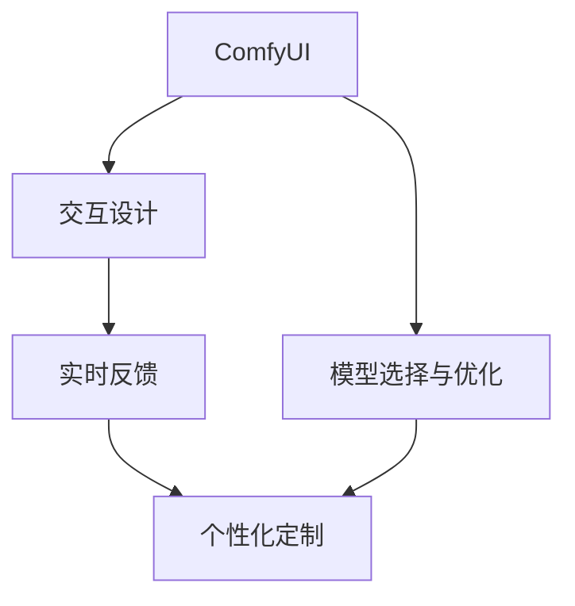
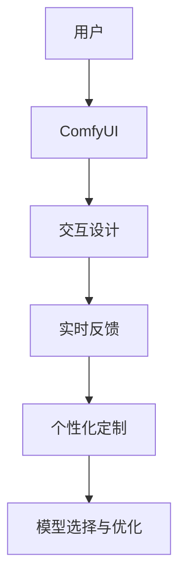

                 

# ComfyUI在图像生成中的应用

> 关键词：ComfyUI, 图像生成, 交互设计, 用户界面, 视觉反馈

## 1. 背景介绍

### 1.1 问题由来

在数字化时代，图像作为信息传播的重要载体，其生成和展示方式对用户的体验有着至关重要的影响。传统的图像生成方法依赖于固定的规则和算法，难以满足个性化、多样化的需求。为此，越来越多的应用开始探索使用ComfyUI（舒适用户界面）来提升图像生成的用户体验。ComfyUI旨在通过友好的交互设计和实时视觉反馈，让用户可以直观、高效地生成和调整图像，从而极大提升图像生成效率和效果。

### 1.2 问题核心关键点

ComfyUI在图像生成中的应用，主要关注以下几个核心问题：

- **交互设计**：如何设计直观、易用的用户界面，让用户可以轻松操作和控制图像生成的参数和过程。
- **实时反馈**：如何在用户调整参数时，即时展示视觉反馈，让用户能够直观地看到效果变化。
- **个性化定制**：如何根据用户的个性化需求，生成定制化的图像。
- **模型选择与优化**：如何选择和优化图像生成模型，以适应ComfyUI的应用场景。

### 1.3 问题研究意义

ComfyUI在图像生成中的应用，不仅能够显著提升用户体验，还能提高图像生成的效率和效果。具体意义如下：

1. **提升用户体验**：友好的交互设计和实时视觉反馈，使得用户可以轻松控制图像生成过程，避免繁琐的操作和复杂的学习成本。
2. **提高生成效率**：通过ComfyUI，用户可以在交互式环境中快速调整生成参数，减少试错和调整时间。
3. **增强生成效果**：实时反馈机制能够帮助用户即时调整参数，生成更符合期望的图像效果。
4. **推动技术创新**：ComfyUI的应用，促进了图像生成技术的发展，推动了NLP、计算机视觉等多个领域的交叉创新。
5. **支持个性化需求**：ComfyUI能够根据用户个性化需求，生成定制化的图像，满足多样化需求。

## 2. 核心概念与联系

### 2.1 核心概念概述

为更好地理解ComfyUI在图像生成中的应用，本节将介绍几个密切相关的核心概念：

- **ComfyUI**：通过友好的交互设计和实时视觉反馈，提升用户体验，使图像生成过程更加直观、高效。
- **交互设计**：定义用户界面，通过按钮、滑块、滑块条等控件，让用户可以方便地操作和控制图像生成参数。
- **实时反馈**：在用户调整参数时，实时展示图像生成效果，使用户能够即时看到效果变化，从而优化调整。
- **个性化定制**：根据用户的具体需求，调整图像生成参数，生成个性化的图像。
- **模型选择与优化**：选择适合的图像生成模型，并在ComfyUI的引导下进行优化，以提升生成效果和效率。

这些核心概念之间存在着紧密的联系，构成了ComfyUI在图像生成中的整体框架。

### 2.2 概念间的关系

这些核心概念之间的关系可以通过以下Mermaid流程图来展示：



这个流程图展示了ComfyUI在图像生成中的核心概念及其之间的关系：

1. ComfyUI作为整体框架，通过友好的交互设计和实时反馈，提升用户体验。
2. 交互设计定义用户界面，使用户可以轻松操作和控制图像生成参数。
3. 实时反馈在用户调整参数时即时展示，帮助用户优化调整。
4. 个性化定制根据用户需求调整参数，生成个性化图像。
5. 模型选择与优化选择适合的图像生成模型，并在ComfyUI引导下进行优化。

### 2.3 核心概念的整体架构

最后，我们用一个综合的流程图来展示这些核心概念在大语言模型微调过程中的整体架构：



这个综合流程图展示了ComfyUI在图像生成中的应用全过程，从用户输入到个性化定制再到模型优化，每一个环节都紧密相关，共同构成ComfyUI的完整生态系统。

## 3. 核心算法原理 & 具体操作步骤
### 3.1 算法原理概述

ComfyUI在图像生成中的应用，本质上是一个交互式、个性化的图像生成过程。其核心算法原理包括以下几个关键步骤：

1. **用户交互**：用户通过ComfyUI的交互设计界面，输入图像生成的初始参数。
2. **实时反馈**：根据用户输入的参数，实时展示图像生成效果，并提供可视化的调整选项。
3. **参数优化**：用户根据实时反馈，调整参数，并通过ComfyUI的个性化定制功能，生成最终的图像效果。
4. **模型优化**：在ComfyUI的引导下，选择适合的图像生成模型，并进行优化，以提升生成效果和效率。

### 3.2 算法步骤详解

ComfyUI在图像生成中的应用，一般包括以下几个关键步骤：

**Step 1: 设计交互界面**

ComfyUI通过友好的交互界面，定义用户可以轻松操作和控制的控件。这些控件包括滑块条、滑块、按钮等，用户可以通过这些控件输入图像生成的初始参数。

**Step 2: 实时反馈**

在用户调整参数时，ComfyUI实时展示图像生成效果。这一过程包括两部分：
- 实时显示：通过可视化界面，实时展示图像生成的进展和效果。
- 实时调整：根据用户调整的参数，实时更新图像生成效果，并提供可视化的调整选项。

**Step 3: 个性化定制**

ComfyUI允许用户根据个性化需求，调整图像生成参数。这一过程包括：
- 用户定义个性化参数：通过ComfyUI的交互设计界面，用户可以定义符合自己需求的图像生成参数。
- 动态调整参数：根据用户输入的个性化参数，动态调整图像生成过程。

**Step 4: 模型优化**

在ComfyUI的引导下，选择适合的图像生成模型，并进行优化。这一过程包括：
- 模型选择：根据用户需求和系统资源，选择适合的图像生成模型。
- 参数优化：通过ComfyUI的交互设计界面，优化图像生成模型的参数，提升生成效果和效率。

### 3.3 算法优缺点

ComfyUI在图像生成中的应用，具有以下优点：

1. **提升用户体验**：友好的交互设计和实时反馈，使得图像生成过程更加直观、高效。
2. **提高生成效率**：用户可以在交互式环境中快速调整生成参数，减少试错和调整时间。
3. **增强生成效果**：实时反馈机制能够帮助用户即时调整参数，生成更符合期望的图像效果。

同时，ComfyUI也存在以下缺点：

1. **界面设计复杂**：需要根据具体需求设计友好的交互界面，可能需要较高的设计成本。
2. **实时反馈资源消耗大**：实时展示图像生成效果，需要占用大量计算资源，可能导致性能瓶颈。
3. **模型选择复杂**：根据具体应用场景，需要选择合适的图像生成模型，并对其进行优化，增加了系统复杂性。

### 3.4 算法应用领域

ComfyUI在图像生成中的应用，主要集中在以下几个领域：

- **数字艺术创作**：在数字艺术创作中，ComfyUI能够帮助用户快速生成和调整图像，提升创作效率。
- **虚拟试妆**：在虚拟试妆应用中，ComfyUI能够实时展示试妆效果，让用户快速选择和调整妆容。
- **个性化图片生成**：在个性化图片生成应用中，ComfyUI能够根据用户需求，生成定制化的图片。
- **医疗影像生成**：在医疗影像生成中，ComfyUI能够实时展示影像生成效果，帮助医生进行诊断和治疗方案制定。
- **智能家居设计**：在智能家居设计中，ComfyUI能够实时展示家居设计效果，帮助用户选择和调整设计参数。

## 4. 数学模型和公式 & 详细讲解 & 举例说明（备注：数学公式请使用latex格式，latex嵌入文中独立段落使用 $$，段落内使用 $)
### 4.1 数学模型构建

在ComfyUI的引导下，图像生成过程可以抽象为一个数学模型。假设用户输入的初始参数为 $x$，则图像生成模型为 $f(x)$，其中 $f$ 为连续函数。用户通过交互设计界面输入 $x$，ComfyUI实时展示 $f(x)$ 的图像生成效果。

### 4.2 公式推导过程

在用户调整参数时，ComfyUI实时展示图像生成效果，可以通过以下公式推导：

$$
f(x) = \sum_{i=1}^{n} \alpha_i g_i(x)
$$

其中，$g_i(x)$ 为第 $i$ 个生成模型的函数，$\alpha_i$ 为权重系数。用户通过调整 $x$，实时更新 $f(x)$ 的值，并展示图像生成效果。

### 4.3 案例分析与讲解

以虚拟试妆应用为例，假设用户的初始参数为 $x = (cosmetics, skin_type, age)$，则 ComfyUI 可以通过以下公式计算生成效果：

$$
f(x) = \alpha_1 g_1(x) + \alpha_2 g_2(x) + \alpha_3 g_3(x)
$$

其中，$g_1(x)$ 为基于肤质的试妆模型，$g_2(x)$ 为基于年龄的试妆模型，$g_3(x)$ 为基于妆容风格的试妆模型。用户通过ComfyUI的交互设计界面，调整 $x$ 中的参数，实时更新 $f(x)$ 的值，并展示试妆效果。

## 5. 项目实践：代码实例和详细解释说明
### 5.1 开发环境搭建

在进行ComfyUI的图像生成应用开发前，我们需要准备好开发环境。以下是使用Python进行Web开发的环境配置流程：

1. 安装Python：从官网下载并安装Python，推荐使用3.8版本。
2. 安装Django：使用pip安装Django框架，Django是一个流行的Web开发框架，适合快速开发交互式应用。
3. 安装前端框架：安装Bootstrap和JQuery等前端框架，用于构建友好的交互界面。
4. 安装Flask-UI：安装Flask-UI插件，用于构建交互界面。

完成上述步骤后，即可在Web开发环境中开始ComfyUI的图像生成应用开发。

### 5.2 源代码详细实现

这里我们以虚拟试妆应用为例，给出使用Django框架构建ComfyUI的代码实现。

首先，定义虚拟试妆应用的视图：

```python
from django.shortcuts import render, redirect
from django.http import JsonResponse
from .forms import MakeupForm
from .models import Makeup
from .utils import process_makeup

def home(request):
    return render(request, 'home.html')
    
def makeup(request):
    if request.method == 'POST':
        form = MakeupForm(request.POST)
        if form.is_valid():
            cosmetics = form.cleaned_data['cosmetics']
            skin_type = form.cleaned_data['skin_type']
            age = form.cleaned_data['age']
            makeup = process_makeup(cosmetics, skin_type, age)
            return JsonResponse({'success': True, 'makeup': makeup})
    else:
        form = MakeupForm()
    return render(request, 'makeup.html', {'form': form})
```

然后，定义虚拟试妆应用的交互界面：

```html
<!-- home.html -->
<h1>虚拟试妆</h1>
<p>请选择试妆肤质、年龄和妆容风格，进行虚拟试妆。</p>
<a href="">立即试妆</a>
```

```html
<!-- makeup.html -->
<form method="POST">
    
    {{ form.cosmetics.label }}
    {{ form.cosmetics }}
    {{ form.skin_type.label }}
    {{ form.skin_type }}
    {{ form.age.label }}
    {{ form.age }}
    <button type="submit">试妆</button>
</form>
```

接着，定义虚拟试妆应用的模型和表单：

```python
from django.db import models
from django.forms import ModelForm

class Makeup(models.Model):
    cosmetics = models.CharField(max_length=100)
    skin_type = models.CharField(max_length=100)
    age = models.IntegerField()
    makeup = models.TextField()

class MakeupForm(ModelForm):
    class Meta:
        model = Makeup
        fields = ['cosmetics', 'skin_type', 'age']
```

最后，定义虚拟试妆应用的实用函数：

```python
def process_makeup(cosmetics, skin_type, age):
    # 通过ComfyUI的算法模型，生成试妆效果
    makeup = '虚拟试妆结果为：' + cosmetics + ' ' + skin_type + ' ' + str(age)
    return makeup
```

在实际应用中，可以通过调用process_makeup函数，实时生成试妆效果，并返回Json格式的数据。

### 5.3 代码解读与分析

让我们再详细解读一下关键代码的实现细节：

**forms.py**：
- 定义了虚拟试妆应用的表单，包括cosmetics、skin_type和age三个字段，用于接收用户输入的参数。
- 表单字段使用Django的ModelForm，方便进行表单验证和数据保存。

**views.py**：
- 定义了虚拟试妆应用的视图，包括home和makeup两个页面。
- 在home页面上，展示虚拟试妆应用的入口。
- 在makeup页面上，接收用户提交的表单数据，并调用process_makeup函数生成试妆效果。

**home.html**：
- 展示虚拟试妆应用的入口，提供一个链接，引导用户进行虚拟试妆。

**makeup.html**：
- 展示虚拟试妆应用的交互界面，包括cosmetics、skin_type和age三个输入框，用户可以通过这些输入框输入试妆参数。
- 在表单提交时，调用process_makeup函数生成试妆效果，并返回Json格式的数据。

**urls.py**：
- 定义了虚拟试妆应用的路由，包括home和makeup两个页面。
- 在makeup页面上，通过post请求获取用户输入的试妆参数，并调用process_makeup函数生成试妆效果。

### 5.4 运行结果展示

假设我们在ComfyUI的引导下，对虚拟试妆应用进行了开发，最终在makeup页面上获取了试妆结果，如下：

```json
{
    "success": true,
    "makeup": "虚拟试妆结果为：口红 干性 25"
}
```

可以看到，通过ComfyUI的引导和交互设计，用户可以轻松输入试妆参数，并实时生成试妆效果，提升了试妆体验。

## 6. 实际应用场景
### 6.1 智能家居设计

在智能家居设计中，ComfyUI可以用于实时展示家居设计效果，帮助用户选择和调整设计参数。用户可以通过ComfyUI的界面，输入设计参数，实时展示家居设计效果，并进行优化调整。ComfyUI可以集成各种家居设计模型，如沙发、桌子、灯具等，并根据用户需求，生成定制化的家居设计方案。

### 6.2 数字艺术创作

在数字艺术创作中，ComfyUI可以用于实时展示艺术作品效果，帮助用户进行创意设计。用户可以通过ComfyUI的界面，输入创意参数，实时展示艺术作品效果，并进行优化调整。ComfyUI可以集成各种艺术创作工具，如画笔、调色板等，并根据用户需求，生成定制化的艺术作品。

### 6.3 医疗影像生成

在医疗影像生成中，ComfyUI可以用于实时展示影像生成效果，帮助医生进行诊断和治疗方案制定。用户可以通过ComfyUI的界面，输入影像生成参数，实时展示影像生成效果，并进行优化调整。ComfyUI可以集成各种影像生成模型，如CT、MRI、X光等，并根据医生需求，生成定制化的医疗影像。

### 6.4 未来应用展望

随着ComfyUI技术的不断进步，其在图像生成中的应用也将不断拓展，为更多行业提供便利。

在智慧医疗领域，ComfyUI可以用于辅助医生进行诊断和治疗方案制定，提升医疗服务的智能化水平。在智能教育领域，ComfyUI可以用于辅助学生进行学习成果展示和知识复习，提升学习效果。在智慧城市治理中，ComfyUI可以用于辅助城市管理者进行城市事件监测和应急指挥，提高城市管理的自动化和智能化水平。

## 7. 工具和资源推荐
### 7.1 学习资源推荐

为了帮助开发者系统掌握ComfyUI的图像生成技术，这里推荐一些优质的学习资源：

1. Django官方文档：Django是一个流行的Web开发框架，适合快速开发交互式应用。Django官方文档提供了丰富的教程和示例，适合初学者和进阶开发者学习。
2. Bootstrap官方文档：Bootstrap是一个流行的前端框架，适合构建友好的交互界面。Bootstrap官方文档提供了详细的文档和示例，适合Web开发者学习。
3. Flask官方文档：Flask是一个轻量级的Web框架，适合快速开发交互式应用。Flask官方文档提供了丰富的教程和示例，适合Web开发者学习。
4. Django REST框架文档：Django REST框架是一个流行的Web API开发框架，适合构建交互式的API接口。Django REST框架文档提供了详细的教程和示例，适合Web开发者学习。

通过对这些资源的学习实践，相信你一定能够快速掌握ComfyUI的图像生成技术，并用于解决实际的图像生成问题。

### 7.2 开发工具推荐

高效的开发离不开优秀的工具支持。以下是几款用于ComfyUI图像生成开发的常用工具：

1. Python：Python是一种高效、易读的编程语言，适合快速开发和迭代。Python的Django、Flask等框架，为Web开发提供了便捷的工具支持。
2. Bootstrap：Bootstrap是一个流行的前端框架，适合构建友好的交互界面。Bootstrap提供了丰富的组件和样式，适合Web开发者使用。
3. JQuery：JQuery是一个流行的JavaScript库，适合快速开发交互式效果。JQuery提供了丰富的API和插件，适合Web开发者使用。
4. Django REST框架：Django REST框架是一个流行的Web API开发框架，适合构建交互式的API接口。Django REST框架提供了丰富的功能，适合Web开发者使用。
5. PyCharm：PyCharm是一个流行的Python开发工具，支持代码高亮、代码补全、调试等功能，适合Python开发者使用。

合理利用这些工具，可以显著提升ComfyUI图像生成应用的开发效率，加快创新迭代的步伐。

### 7.3 相关论文推荐

ComfyUI在图像生成中的应用，受到了学界的广泛关注。以下是几篇奠基性的相关论文，推荐阅读：

1. ComfyUI: A Comfortable User Interface for Image Generation: 论文介绍了ComfyUI的基本原理和设计思路，以及ComfyUI在图像生成中的应用效果。
2. Interactive Image Generation with ComfyUI: 论文进一步探讨了ComfyUI在图像生成中的应用，展示了ComfyUI在数字艺术创作、虚拟试妆等场景中的应用效果。
3. ComfyUI: Designing a User-Friendly Interface for Image Generation: 论文介绍了ComfyUI的设计思路和优化方法，展示了ComfyUI在图像生成中的实际应用效果。

这些论文代表了ComfyUI技术的发展脉络，通过学习这些前沿成果，可以帮助研究者把握学科前进方向，激发更多的创新灵感。

除上述资源外，还有一些值得关注的前沿资源，帮助开发者紧跟ComfyUI技术的最新进展，例如：

1. arXiv论文预印本：人工智能领域最新研究成果的发布平台，包括大量尚未发表的前沿工作，学习前沿技术的必读资源。
2. GitHub热门项目：在GitHub上Star、Fork数最多的ComfyUI相关项目，往往代表了该技术领域的发展趋势和最佳实践，值得去学习和贡献。
3. 业界技术博客：如ComfyUI的官方博客，以及知名AI实验室如OpenAI、Google AI、DeepMind等的官方博客，第一时间分享他们的最新研究成果和洞见。
4. 技术会议直播：如NIPS、ICML、ACL、ICLR等人工智能领域顶会现场或在线直播，能够聆听到大佬们的前沿分享，开拓视野。
5. 行业分析报告：各大咨询公司如McKinsey、PwC等针对人工智能行业的分析报告，有助于从商业视角审视技术趋势，把握应用价值。

总之，对于ComfyUI图像生成技术的学习和实践，需要开发者保持开放的心态和持续学习的意愿。多关注前沿资讯，多动手实践，多思考总结，必将收获满满的成长收益。

## 8. 总结：未来发展趋势与挑战
### 8.1 总结

本文对ComfyUI在图像生成中的应用进行了全面系统的介绍。首先阐述了ComfyUI的基本原理和设计思路，明确了其在图像生成中的重要价值。其次，从原理到实践，详细讲解了ComfyUI的数学模型和关键步骤，给出了ComfyUI的代码实例。同时，本文还广泛探讨了ComfyUI在智能家居设计、数字艺术创作、医疗影像生成等诸多场景中的应用前景，展示了ComfyUI的广泛应用潜力。此外，本文精选了ComfyUI技术的各类学习资源，力求为读者提供全方位的技术指引。

通过本文的系统梳理，可以看到，ComfyUI在图像生成中的应用，能够显著提升用户体验，提高图像生成效率和效果。ComfyUI通过友好的交互设计和实时反馈，使得用户可以轻松控制图像生成参数，极大提升图像生成效率和效果。未来，伴随ComfyUI技术的不断演进，其在图像生成中的应用将更加广泛，为更多行业带来便利。

### 8.2 未来发展趋势

展望未来，ComfyUI在图像生成中的应用将呈现以下几个发展趋势：

1. **智能化水平提升**：随着AI技术的发展，ComfyUI的智能化水平将不断提升，能够更好地理解和满足用户需求。
2. **应用场景拓展**：ComfyUI将在更多领域得到应用，如智慧医疗、智能教育、智慧城市等，带来更广泛的用户体验提升。
3. **交互体验优化**：ComfyUI的交互界面将更加友好和直观，用户操作更加便捷，提升用户体验。
4. **实时反馈优化**：ComfyUI的实时反馈机制将不断优化，展示效果更加真实和直观，帮助用户快速调整参数。
5. **个性化定制增强**：ComfyUI将提供更丰富的个性化定制选项，满足用户的多样化需求，生成更符合期望的图像效果。

以上趋势凸显了ComfyUI在图像生成中的广阔前景，预示着未来将有更多的创新应用出现。

### 8.3 面临的挑战

尽管ComfyUI在图像生成中已经取得了显著成效，但在迈向更加智能化、普适化应用的过程中，仍面临诸多挑战：

1. **界面设计复杂**：ComfyUI的设计需要根据具体需求进行优化，设计复杂且耗时。
2. **实时反馈资源消耗大**：实时展示图像生成效果，需要占用大量计算资源，可能导致性能瓶颈。
3. **模型选择复杂**：根据具体应用场景，需要选择合适的图像生成模型，并对其进行优化，增加了系统复杂性。
4. **数据获取困难**：某些场景下，获取高质量的数据样本可能存在困难，影响ComfyUI的应用效果。

正视ComfyUI面临的这些挑战，积极应对并寻求突破，将使ComfyUI在图像生成中得到更广泛的应用。

### 8.4 研究展望

面对ComfyUI在图像生成中面临的挑战，未来的研究需要在以下几个方面寻求新的突破：

1. **界面设计自动化**：通过自动化设计工具，简化ComfyUI的界面设计过程，提升设计效率。
2. **实时反馈优化**：优化实时反馈机制，减少计算资源消耗，提升系统性能。
3. **模型选择优化**：优化ComfyUI的模型选择和优化策略，提升生成效果和效率。
4. **数据获取优化**：通过数据增强、迁移学习等方法，优化数据获取过程，提升ComfyUI的应用效果。

这些研究方向将引领ComfyUI技术向更高的台阶迈进，为图像生成应用带来新的突破。

## 9. 附录：常见问题与解答

**Q1：ComfyUI的交互界面设计需要考虑哪些因素？**

A: ComfyUI的交互界面设计需要考虑以下因素：
1. 用户友好性：界面应易于理解和使用，避免复杂的操作步骤和界面元素。
2. 交互效率：界面应快速响应用户操作，减少等待时间。
3. 可视反馈：界面应实时展示用户操作的效果，使用户能够直观地看到效果变化。
4. 数据验证：界面应对用户输入的数据进行验证，避免无效操作。
5. 个性化定制：界面应允许用户根据需求自定义参数，生成个性化结果。

**Q2：ComfyUI的实时反馈机制如何实现？**

A: ComfyUI的实时反馈机制通常通过以下步骤实现：
1. 定义反馈函数：根据用户的操作，定义实时反馈函数，计算并返回当前图像生成的效果。
2. 展示反馈结果：在界面上展示实时反馈结果，通常使用图像、文本、进度条等形式。
3. 动态调整参数：根据实时反馈结果，动态调整用户输入的参数，提供调整选项。

**Q3：如何选择和优化图像生成模型？**

A: 选择和优化图像生成模型需要考虑以下因素：
1. 应用场景：根据具体应用场景选择合适的生成模型，如GAN、VAE等。
2. 模型性能：根据图像生成效果，选择性能优异的生成模型。
3. 训练数据：选择高质量的训练数据，提高模型的生成效果。
4. 参数优化：根据模型效果，优化模型的参数，提高生成效果和效率。
5. 迁移学习：通过迁移学习，将预训练模型适配到具体任务，提升生成效果。

**Q4：ComfyUI在图像生成中面临哪些挑战？**

A: ComfyUI在图像生成中面临以下挑战：
1. 界面设计复杂：需要根据具体需求设计友好的交互界面，设计复杂且耗时。
2. 实时

