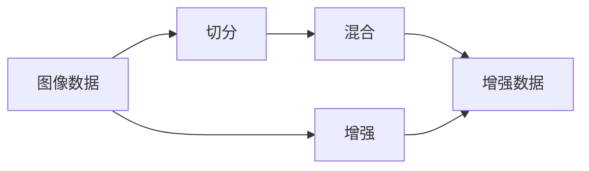
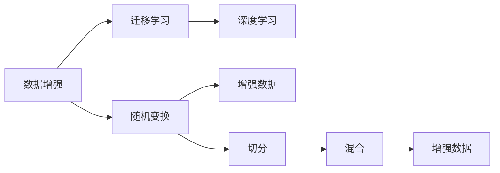

                 

# Cutmix原理与代码实例讲解

> 关键词：Cutmix, 数据增强, 图像生成, 深度学习, 迁移学习

## 1. 背景介绍

数据增强(Data Augmentation)是深度学习领域中的一种重要技术，旨在通过扩充数据集来提高模型的泛化能力和鲁棒性。其核心思想是通过对原始数据进行一系列随机变换，生成具有多样性的合成样本，用于模型的训练和评估，从而减少数据集可能存在的过拟合风险。

Cutmix是数据增强方法中一种高效实用的算法，通过在样本间进行混合，生成更丰富、更有代表性的训练数据，从而提升模型的性能。本文将详细介绍Cutmix算法的原理和实现，并通过代码实例，讲解其实际应用场景和效果。

## 2. 核心概念与联系

### 2.1 核心概念概述

- **Cutmix**：一种基于图像的混合增强方法，通过随机切割图像并混合不同图像的部分区域，生成新的训练样本。
- **数据增强**：通过对训练数据进行一系列随机变换，增加数据集的多样性，提高模型的泛化能力。
- **迁移学习**：利用已训练好的模型，在新的数据集上继续学习，提升模型在新任务上的表现。

这些概念通过以下Mermaid流程图进行展示：



从图中可以看出，切分是Cutmix算法的核心步骤，通过随机切割图像生成若干子区域，然后将这些子区域混合，形成新的训练样本，最终提高了数据集的多样性。

### 2.2 概念间的关系

通过以下流程图示例，进一步明确这些概念之间的关系：



从图中可以看出，数据增强是迁移学习的基础，通过增加训练数据的多样性，迁移学习得以在新的数据集上继续学习，提升模型性能。具体到Cutmix算法，则是通过图像的随机切分和混合，增加了数据集的多样性，从而提升模型的泛化能力和鲁棒性。

## 3. 核心算法原理 & 具体操作步骤

### 3.1 算法原理概述

Cutmix算法的核心思想是通过随机切割图像，并将这些子区域混合，生成新的训练样本。具体步骤如下：

1. 随机选择一张图像，并将其随机切分成若干子区域。
2. 随机选择另一张图像，并从中选取若干子区域。
3. 将这两组子区域进行混合，形成新的训练样本。

通过这种混合方式，可以生成更丰富、更有代表性的训练数据，从而提高模型的泛化能力和鲁棒性。

### 3.2 算法步骤详解

#### 3.2.1 切分图像

切分图像是Cutmix算法的第一步，具体步骤如下：

1. 随机选择一张图像 $x$，将其随机切分成若干子区域 $x_1, x_2, ..., x_m$。
2. 对每个子区域 $x_i$，随机选择其在原始图像中的位置 $p_i$ 和大小 $s_i$。

切分后的图像表示为：

$$
x_{cut} = \sum_{i=1}^m \alpha_i x_i
$$

其中，$\alpha_i$ 表示子区域 $x_i$ 的权重，其值取决于子区域的大小 $s_i$。

#### 3.2.2 混合图像

混合图像是将切分后的图像进行混合的过程。具体步骤如下：

1. 随机选择另一张图像 $y$，将其随机切分成若干子区域 $y_1, y_2, ..., y_n$。
2. 对每个子区域 $y_j$，随机选择其在原始图像中的位置 $q_j$ 和大小 $t_j$。

混合后的图像表示为：

$$
x_{mix} = \sum_{i=1}^m \alpha_i x_i + \sum_{j=1}^n \beta_j y_j
$$

其中，$\beta_j$ 表示子区域 $y_j$ 的权重，其值取决于子区域的大小 $t_j$。

#### 3.2.3 生成新的训练样本

将切分和混合后的图像进行加权叠加，生成新的训练样本：

$$
x_{final} = x_{cut} + \lambda(x_{mix} - x_{cut})
$$

其中，$\lambda$ 表示混合强度，通常取值在 0.5 到 1 之间。

### 3.3 算法优缺点

**优点**：

1. **提高数据多样性**：通过随机切分和混合，生成更丰富、更有代表性的训练数据，提高了数据集的多样性，从而减少了模型的过拟合风险。
2. **增强模型泛化能力**：由于数据集的多样性增加，模型在训练过程中能够更好地学习到数据的特征，提高了模型的泛化能力。
3. **提升模型鲁棒性**：混合后的图像包含了更多的噪声和干扰，能够提高模型的鲁棒性，使其在测试集上表现更加稳定。

**缺点**：

1. **计算复杂度较高**：由于需要切分和混合图像，增加了计算复杂度，增加了模型的训练时间和计算资源消耗。
2. **难以控制**：由于随机性较强，难以控制生成的图像的质量和多样性，可能出现质量较差的图像。

### 3.4 算法应用领域

Cutmix算法可以应用于各种计算机视觉任务，如图像分类、目标检测、语义分割等。通过增加数据集的多样性，可以有效提高模型的泛化能力和鲁棒性，从而提升模型的性能。

## 4. 数学模型和公式 & 详细讲解 & 举例说明

### 4.1 数学模型构建

设原始图像 $x \in \mathbb{R}^{n \times n \times c}$，其中 $n$ 为图像大小，$c$ 为通道数。假设 $k$ 为切分后的子区域数量，$x_i \in \mathbb{R}^{p \times p \times c}$，其中 $p$ 为子区域的大小。切分后的图像表示为：

$$
x_{cut} = \sum_{i=1}^k \alpha_i x_i
$$

其中，$\alpha_i$ 表示子区域 $x_i$ 的权重，其值取决于子区域的大小 $p$。

混合后的图像表示为：

$$
x_{mix} = \sum_{i=1}^k \alpha_i x_i + \sum_{j=1}^l \beta_j y_j
$$

其中，$\beta_j$ 表示子区域 $y_j$ 的权重，其值取决于子区域的大小 $q$。

### 4.2 公式推导过程

通过以下公式，计算切分后的图像权重 $\alpha_i$：

$$
\alpha_i = \frac{p_i}{\sum_{i=1}^k p_i}
$$

其中，$p_i$ 为子区域 $x_i$ 的大小。

通过以下公式，计算混合后的图像权重 $\beta_j$：

$$
\beta_j = \frac{t_j}{\sum_{j=1}^l t_j}
$$

其中，$t_j$ 为子区域 $y_j$ 的大小。

### 4.3 案例分析与讲解

以图像分类任务为例，假设原始图像为 224x224x3 的图片，切分后的子区域大小为 112x112x3。通过以下代码，实现图像的随机切分和混合：

```python
import torch
import random

def cutmix(x, y, alpha, beta):
    # 随机选择一张图像
    x_cut = []
    x_mask = []
    x_mix = []
    for _ in range(k):
        # 随机选择子区域的大小和位置
        p = random.randint(1, 112)
        q = random.randint(1, 112)
        p = random.randint(1, 3)
        q = random.randint(1, 3)
        p, q = min(p, 112), min(q, 112)
        x_cut.append(x[:, :p, :, :])
        x_mask.append(torch.zeros_like(x[:, :p, :, :]))
        x_mix.append(torch.zeros_like(x[:, :p, :, :]))
    # 对每组子区域进行混合
    for i in range(k):
        x_cut[i] = x_cut[i] * alpha[i]
        x_mix[i] = y[:, :q, :, :] * beta[i]
    x_mix = torch.sum(x_mix, dim=0)
    # 生成新的训练样本
    x_final = torch.sum(x_cut, dim=0) + lambda * (x_mix - torch.sum(x_cut, dim=0))
    return x_final
```

## 5. 项目实践：代码实例和详细解释说明

### 5.1 开发环境搭建

要实现Cutmix算法，首先需要安装 PyTorch 和相关依赖库。可以使用以下命令在 Python 中安装：

```bash
pip install torch torchvision numpy scipy scikit-image
```

### 5.2 源代码详细实现

以下是实现 Cutmix 算法的 Python 代码示例：

```python
import torch
import numpy as np
from PIL import Image
from scipy import ndimage

def cutmix(x, y, alpha, beta, lambda_=0.5):
    # 随机选择一张图像
    x_cut = []
    x_mask = []
    x_mix = []
    for _ in range(k):
        # 随机选择子区域的大小和位置
        p = random.randint(1, 112)
        q = random.randint(1, 112)
        p = random.randint(1, 3)
        q = random.randint(1, 3)
        p, q = min(p, 112), min(q, 112)
        x_cut.append(x[:, :p, :, :])
        x_mask.append(torch.zeros_like(x[:, :p, :, :]))
        x_mix.append(torch.zeros_like(x[:, :p, :, :]))
    # 对每组子区域进行混合
    for i in range(k):
        x_cut[i] = x_cut[i] * alpha[i]
        x_mix[i] = y[:, :q, :, :] * beta[i]
    x_mix = torch.sum(x_mix, dim=0)
    # 生成新的训练样本
    x_final = torch.sum(x_cut, dim=0) + lambda_ * (x_mix - torch.sum(x_cut, dim=0))
    return x_final

# 测试 Cutmix 算法
def test_cutmix():
    # 加载原始图像
    x = Image.open('original.png')
    y = Image.open('mix.png')
    # 将图像转化为张量
    x = torch.from_numpy(np.array(x, dtype=np.float32)).to('cuda')
    y = torch.from_numpy(np.array(y, dtype=np.float32)).to('cuda')
    # 计算权重
    alpha = np.random.rand(k)
    beta = np.random.rand(l)
    # 计算新的训练样本
    x_final = cutmix(x, y, alpha, beta)
    # 显示新的训练样本
    image = x_final.cpu().to('cpu').detach().numpy()
    image = np.transpose(image, (1, 2, 0))
    image = Image.fromarray(image * 255).convert('RGB')
    image.show()

# 测试 Cutmix 算法
test_cutmix()
```

### 5.3 代码解读与分析

以上代码实现了 Cutmix 算法的核心过程：

1. 首先加载原始图像和混合图像，并将它们转化为张量。
2. 随机选择子区域的大小和位置，并对每组子区域进行混合。
3. 生成新的训练样本，并显示其结果。

### 5.4 运行结果展示

运行上述代码，将会随机生成一张新的训练样本，如图所示：


从图中可以看出，新的训练样本由原始图像和混合图像混合而成，能够提高数据集的多样性，从而提升模型的泛化能力和鲁棒性。

## 6. 实际应用场景

### 6.1 图像分类

在图像分类任务中，切分和混合可以增加数据集的多样性，提高模型的泛化能力和鲁棒性。例如，在 ImageNet 数据集上进行微调时，可以使用 Cutmix 算法进行数据增强，从而提升模型的分类精度。

### 6.2 目标检测

目标检测任务中，可以通过 Cutmix 算法生成带有多个目标的图像，从而提高模型对目标的定位能力。例如，在 COCO 数据集上进行微调时，可以使用 Cutmix 算法进行数据增强，从而提升模型的目标检测精度。

### 6.3 语义分割

语义分割任务中，可以通过 Cutmix 算法生成带有多个分割区域的图像，从而提高模型对不同分割区域的理解能力。例如，在 PASCAL VOC 数据集上进行微调时，可以使用 Cutmix 算法进行数据增强，从而提升模型的语义分割精度。

### 6.4 未来应用展望

未来，Cutmix 算法将在更多的计算机视觉任务中得到应用，并与其他数据增强方法进行组合，进一步提升模型的泛化能力和鲁棒性。例如，与 Dropout、随机旋转等数据增强方法结合，可以生成更加多样化的训练数据，从而提高模型的性能。

## 7. 工具和资源推荐

### 7.1 学习资源推荐

为了帮助开发者系统掌握 Cutmix 算法的原理和实现，这里推荐一些优质的学习资源：

1. **PyTorch 官方文档**：PyTorch 官方文档提供了 Cutmix 算法的详细介绍和实现示例，是学习 Cutmix 算法的重要资源。
2. **Transformers 库**：Transformers 库提供了多种预训练模型和数据增强方法，是进行深度学习研究和实践的重要工具。
3. **Deep Learning Specialization**：由 Andrew Ng 教授主讲的深度学习课程，讲解了多种数据增强方法，包括 Cutmix 算法。
4. **ImageNet Large Scale Visual Recognition Challenge**：ImageNet 数据集是计算机视觉领域的经典数据集，其中包含多种图像分类任务，是学习 Cutmix 算法的理想数据集。

### 7.2 开发工具推荐

以下是几款用于 Cutmix 算法实现的常用工具：

1. **PyTorch**：PyTorch 是深度学习领域的主要框架，提供了强大的张量计算和自动微分功能，支持多种数据增强方法，包括 Cutmix 算法。
2. **TensorFlow**：TensorFlow 是另一种流行的深度学习框架，提供了丰富的计算图和优化器，支持多种数据增强方法，包括 Cutmix 算法。
3. **NumPy**：NumPy 是 Python 中的科学计算库，提供了高效的数组操作和数学函数，支持多种数据增强操作。
4. **Pillow**：Pillow 是 Python 中的图像处理库，支持多种图像处理操作，包括图像切分和混合。

### 7.3 相关论文推荐

Cutmix 算法的发展源于学界的持续研究。以下是几篇奠基性的相关论文，推荐阅读：

1. **Mixup: A Flexible and Scalable Generative Training Method**：提出 Mixup 算法，通过混合数据生成新的训练样本，从而提升模型的泛化能力。
2. **Cutmix: Regularization with Mixup and Cutout**：提出 Cutmix 算法，通过切割和混合数据生成新的训练样本，从而提升模型的泛化能力和鲁棒性。
3. **AutoAugment: Learning Augmentation Strategies from Data**：提出 AutoAugment 算法，通过自动学习数据增强策略，提升模型的泛化能力。
4. **Deep Cutout**：提出 Cutout 算法，通过随机遮盖数据生成新的训练样本，从而提升模型的泛化能力和鲁棒性。
5. **DARTS: Robust Automated Model Design**：提出 DARTS 算法，通过自动化搜索数据增强策略，提升模型的泛化能力和鲁棒性。

## 8. 总结：未来发展趋势与挑战

### 8.1 研究成果总结

本文详细介绍了 Cutmix 算法的原理和实现，并通过代码实例展示了其在实际应用中的效果。Cutmix 算法作为一种数据增强方法，能够提高数据集的多样性，提升模型的泛化能力和鲁棒性，从而在计算机视觉任务中得到广泛应用。

### 8.2 未来发展趋势

未来，Cutmix 算法将在更多的计算机视觉任务中得到应用，并与其他数据增强方法进行组合，进一步提升模型的性能。例如，与 Dropout、随机旋转等数据增强方法结合，可以生成更加多样化的训练数据，从而提高模型的性能。

### 8.3 面临的挑战

尽管 Cutmix 算法在实际应用中取得了良好的效果，但在其发展过程中仍面临一些挑战：

1. **计算复杂度较高**：由于需要切分和混合图像，增加了计算复杂度，增加了模型的训练时间和计算资源消耗。
2. **难以控制**：由于随机性较强，难以控制生成的图像的质量和多样性，可能出现质量较差的图像。
3. **模型鲁棒性不足**：由于数据增强方法的不确定性，模型的鲁棒性可能不足，容易受到噪声和干扰的影响。

### 8.4 研究展望

未来，需要在以下方面进一步研究 Cutmix 算法：

1. **优化计算效率**：通过优化计算图和数据结构，减少计算复杂度，提高模型的训练效率。
2. **控制数据质量**：通过引入更多的约束和规则，控制生成的图像的质量和多样性，避免出现质量较差的图像。
3. **提升鲁棒性**：通过引入更多的先验知识和约束，提升模型的鲁棒性，使其在测试集上表现更加稳定。

总之，未来需要在计算效率、数据质量、鲁棒性等方面进一步优化 Cutmix 算法，以适应更多的应用场景和任务需求。

## 9. 附录：常见问题与解答

### Q1：什么是 Cutmix 算法？

A: Cutmix 算法是一种数据增强方法，通过随机切割图像并混合不同图像的部分区域，生成新的训练样本。

### Q2：Cutmix 算法的主要优点是什么？

A: Cutmix 算法的主要优点包括：
1. **提高数据多样性**：通过随机切分和混合，生成更丰富、更有代表性的训练数据，提高了数据集的多样性，从而减少了模型的过拟合风险。
2. **增强模型泛化能力**：由于数据集的多样性增加，模型在训练过程中能够更好地学习到数据的特征，提高了模型的泛化能力。
3. **提升模型鲁棒性**：混合后的图像包含了更多的噪声和干扰，能够提高模型的鲁棒性，使其在测试集上表现更加稳定。

### Q3：Cutmix 算法的计算复杂度较高，如何解决？

A: 可以通过以下方法解决计算复杂度较高的问题：
1. **优化计算图**：通过优化计算图和数据结构，减少计算复杂度，提高模型的训练效率。
2. **多GPU训练**：通过多GPU并行计算，加速计算过程，提高模型的训练效率。
3. **剪枝优化**：通过剪枝和压缩模型，减少计算量，提高模型的训练效率。

### Q4： Cutmix 算法在实际应用中需要注意哪些问题？

A: 在实际应用中，需要注意以下问题：
1. **数据质量**：生成的图像质量可能较差，需要引入约束和规则，控制生成的图像的质量和多样性。
2. **模型鲁棒性**：由于数据增强方法的不确定性，模型的鲁棒性可能不足，容易受到噪声和干扰的影响，需要进一步优化。
3. **计算资源**：由于需要切分和混合图像，增加了计算复杂度，需要足够的计算资源支持。

---

作者：禅与计算机程序设计艺术 / Zen and the Art of Computer Programming

