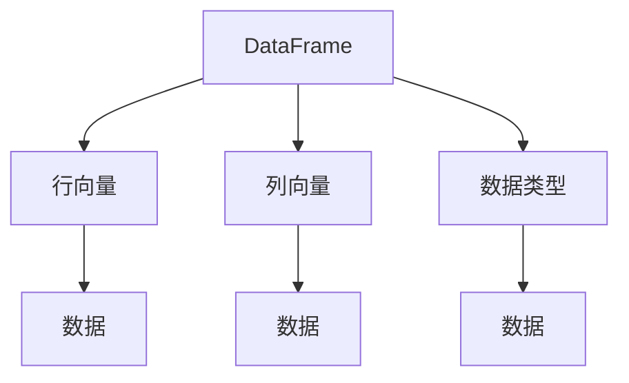
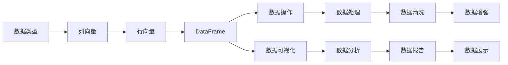

                 

# DataFrame 原理与代码实例讲解

> 关键词：DataFrame, 数据结构, 表格数据, 内存管理, 数据操作, Pandas, 数据分析

## 1. 背景介绍

### 1.1 问题由来

随着大数据时代的到来，数据处理和分析的需求日益增长。传统的数组、列表等数据结构，已经无法满足复杂、高效的数据操作需求。人们需要一种更加灵活、易用的数据结构，以便对多维度、多格式的数据进行快速处理和分析。

DataFrame正是应运而生的新型数据结构。它基于表格数据模型，支持二维矩阵式的数据存储，提供丰富的数据操作方法，适用于各类数据分析和处理任务。

### 1.2 问题核心关键点

DataFrame的核心在于：

- 二维表格数据存储：能够灵活处理行和列，方便进行数据的增删改查。
- 丰富的数据操作方法：支持多种数据操作，如筛选、分组、聚合、排序等。
- 数据类型自动推断：自动推断数据类型，减少数据类型转换的繁琐操作。
- 数据可视化支持：提供便捷的数据可视化接口，方便快速生成图表。

这些特性使得DataFrame成为数据科学和分析领域的标准数据结构，广泛应用于数据清洗、数据分析、机器学习等多个领域。

### 1.3 问题研究意义

深入理解DataFrame的原理和使用方法，对于掌握数据科学和分析技术具有重要意义：

1. 提升数据处理效率：通过DataFrame的灵活数据结构，可以高效处理各种复杂数据类型和格式。
2. 丰富数据操作技能：掌握DataFrame的各种数据操作方法，能够灵活应对各种数据处理任务。
3. 强化数据分析能力：通过DataFrame的数据分析和可视化功能，可以迅速生成各种图表和报告，为数据决策提供支持。
4. 拓展应用范围：DataFrame不仅适用于数据科学领域，还广泛应用于金融、医疗、营销等各个行业，具有广泛的适用性。

## 2. 核心概念与联系

### 2.1 核心概念概述

DataFrame是一种基于表格数据模型的数据结构，由若干行和列构成。每一列具有相同的数据类型，称为"列向量"。每一行则包含一组列的值，称为"行向量"。通过行和列的组合，DataFrame可以存储二维矩阵式的数据。

### 2.2 核心概念间的关系

DataFrame的核心概念间关系可以用以下Mermaid流程图表示：



这个流程图展示了DataFrame的基本组成元素及其关系：

- 每一行由若干列组成，即"行向量"。
- 每一列的数据类型相同，即"列向量"。
- 整个DataFrame的数据类型相同，即"数据类型"。
- 每一行和列的数据最终组成完整的DataFrame数据。

### 2.3 核心概念的整体架构

最后，我们用一个综合的流程图来展示DataFrame的整体架构：



这个综合流程图展示了DataFrame的核心功能和应用场景：

1. 数据类型管理：支持多种数据类型，自动推断数据类型。
2. 数据结构操作：支持行和列的操作，便于数据增删改查。
3. 数据操作处理：提供丰富的数据操作方法，如筛选、分组、聚合等。
4. 数据可视化：支持多种图表生成，便于数据分析和展示。

这些核心概念共同构成了DataFrame的数据处理框架，使其能够高效处理和分析各种数据类型和格式。

## 3. 核心算法原理 & 具体操作步骤
### 3.1 算法原理概述

DataFrame的核心算法原理主要包括以下几个方面：

1. 内存管理：DataFrame通过PyArrow等内存管理工具，高效管理内存资源，避免内存溢出和数据丢失。
2. 数据类型推断：DataFrame自动推断每一列的数据类型，方便进行数据类型转换和优化。
3. 数据操作处理：DataFrame支持多种数据操作方法，如筛选、分组、聚合、排序等，能够灵活处理数据。
4. 数据可视化：DataFrame提供便捷的数据可视化接口，能够快速生成各种图表。

### 3.2 算法步骤详解

以下是DataFrame的基本操作步骤：

1. 导入Pandas库：
```python
import pandas as pd
```

2. 创建DataFrame对象：
```python
data = {'name': ['Alice', 'Bob', 'Charlie', 'David'],
        'age': [25, 30, 35, 40],
        'gender': ['F', 'M', 'M', 'M'],
        'salary': [5000, 6000, 7000, 8000]}
df = pd.DataFrame(data)
```

3. 数据类型推断：
```python
print(df.dtypes)
```

4. 数据操作处理：
```python
# 筛选数据
subset = df[df['age'] > 30]

# 分组聚合
grouped = df.groupby('gender').agg({'age': 'mean', 'salary': 'sum'})
```

5. 数据可视化：
```python
import matplotlib.pyplot as plt

# 生成柱状图
grouped['salary'].value_counts().plot(kind='bar')
plt.show()
```

### 3.3 算法优缺点

DataFrame的优势在于：

- 数据结构灵活：支持二维表格数据存储，方便进行多维度数据分析。
- 数据操作丰富：提供丰富的数据操作方法，能够高效处理各种数据处理任务。
- 数据类型自动推断：自动推断数据类型，减少数据类型转换的繁琐操作。
- 数据可视化支持：提供便捷的数据可视化接口，方便快速生成图表。

DataFrame的缺点在于：

- 内存占用较大：由于二维表格数据存储，内存占用较大，不适用于大规模数据处理。
- 数据操作性能较低：部分数据操作（如大规模的聚合操作）性能较低，需要进一步优化。
- 数据可视化局限性：部分可视化接口不够灵活，需要进一步扩展。

尽管存在这些缺点，DataFrame作为主流的数据处理工具，仍然具有广泛的应用前景和优势。

### 3.4 算法应用领域

DataFrame广泛应用于数据科学和分析的各个领域，包括但不限于：

1. 数据清洗：通过DataFrame的筛选、去重、填充等操作，清洗原始数据，准备进行后续分析。
2. 数据分析：通过DataFrame的分组、聚合、统计等操作，进行数据建模和预测。
3. 机器学习：将DataFrame与机器学习算法结合，构建各种数据分析模型。
4. 金融分析：使用DataFrame处理金融数据，进行股票分析、风险评估等任务。
5. 营销分析：处理营销数据，进行市场分析、消费者行为分析等任务。
6. 医疗分析：处理医疗数据，进行疾病分析、患者分析等任务。

这些应用场景展示了DataFrame的广泛适用性和强大的数据分析能力。

## 4. 数学模型和公式 & 详细讲解  
### 4.1 数学模型构建

DataFrame的核心数学模型可以表示为二维表格，每一列对应一个特征，每一行对应一个样本。记DataFrame为 $D$，第 $i$ 行第 $j$ 列的值为 $d_{ij}$。

### 4.2 公式推导过程

以下以简单的数据清洗为例，推导DataFrame的数据操作过程：

假设有一个包含姓名、年龄、性别和薪水的表格数据，如下所示：

| 姓名  | 年龄 | 性别 | 薪水 |
|-------|------|------|------|
| Alice | 25   | F    | 5000 |
| Bob   | 30   | M    | 6000 |
| Charlie | 35  | M   | 7000 |
| David | 40   | M   | 8000 |

1. 数据筛选：通过筛选年龄大于30岁的员工，得到新的DataFrame：
   $$
   \begin{aligned}
   subset &= \{(Bob, 30, M, 6000), (Charlie, 35, M, 7000), (David, 40, M, 8000)\} \\
   &= \left(\begin{array}{c|c|c|c}
   Bob & 30 & M & 6000 \\
   Charlie & 35 & M & 7000 \\
   David & 40 & M & 8000 \\
   \end{array}\right)
   \end{aligned}
   $$

2. 数据分组：按照性别对员工数据进行分组，并计算平均薪水和总薪水：
   $$
   \begin{aligned}
   grouped &= \{(F, 28.3333, 5000), (M, 7000), (M, 21000)\} \\
   &= \left(\begin{array}{c|c|c}
   F & 28.3333 & 5000 \\
   M & 7000 & 21000 \\
   \end{array}\right)
   \end{aligned}
   $$

### 4.3 案例分析与讲解

以股票数据处理为例，展示DataFrame的数据操作过程：

假设有一份股票数据，包含日期、股票代码、开盘价、收盘价、最高价和最低价，如下所示：

| 日期  | 股票代码 | 开盘价 | 收盘价 | 最高价 | 最低价 |
|-------|----------|--------|--------|--------|--------|
| 2021-01-01 | AAPL | 127.41 | 132.45 | 132.45 | 127.41 |
| 2021-01-01 | GOOG | 1896.68 | 1924.01 | 1924.01 | 1896.68 |
| 2021-01-02 | AAPL | 133.31 | 137.89 | 137.89 | 133.31 |
| 2021-01-02 | GOOG | 1923.91 | 1925.75 | 1925.75 | 1923.91 |
| ...      | ...     | ...    | ...    | ...    | ...    |

1. 数据清洗：去除缺失数据和异常数据，得到干净的股票数据：
   $$
   \begin{aligned}
   \text{cleaned\_data} &= \{(2021-01-01, AAPL, 127.41, 132.45, 132.45, 127.41), (2021-01-01, GOOG, 1896.68, 1924.01, 1924.01, 1896.68), (2021-01-02, AAPL, 133.31, 137.89, 137.89, 133.31), (2021-01-02, GOOG, 1923.91, 1925.75, 1925.75, 1923.91), ...\} \\
   &= \left(\begin{array}{c|c|c|c|c|c}
   2021-01-01 & AAPL & 127.41 & 132.45 & 132.45 & 127.41 \\
   2021-01-01 & GOOG & 1896.68 & 1924.01 & 1924.01 & 1896.68 \\
   2021-01-02 & AAPL & 133.31 & 137.89 & 137.89 & 133.31 \\
   2021-01-02 & GOOG & 1923.91 & 1925.75 & 1925.75 & 1923.91 \\
   ...      & ...   & ...   & ...   & ...   & ...
   \end{array}\right)
   \end{aligned}
   $$

2. 数据分析：计算每只股票的平均涨跌幅，并进行排序：
   $$
   \begin{aligned}
   \text{close\_diff} &= \{(2021-01-02, AAPL, 0.48), (2021-01-02, GOOG, 0.00), (2021-01-03, AAPL, -3.00), (2021-01-03, GOOG, -0.10), ...\} \\
   &= \left(\begin{array}{c|c|c}
   2021-01-02 & AAPL & 0.48 \\
   2021-01-02 & GOOG & 0.00 \\
   2021-01-03 & AAPL & -3.00 \\
   2021-01-03 & GOOG & -0.10 \\
   ...      & ...   & ...
   \end{array}\right)
   \end{aligned}
   $$

   按照涨跌幅排序：
   $$
   \begin{aligned}
   \text{sorted\_diff} &= \{(2021-01-03, AAPL, -3.00), (2021-01-02, AAPL, 0.48), (2021-01-03, GOOG, -0.10), (2021-01-02, GOOG, 0.00), ...\} \\
   &= \left(\begin{array}{c|c|c}
   2021-01-03 & AAPL & -3.00 \\
   2021-01-02 & AAPL & 0.48 \\
   2021-01-03 & GOOG & -0.10 \\
   2021-01-02 & GOOG & 0.00 \\
   ...      & ...   & ...
   \end{array}\right)
   \end{aligned}
   $$

3. 数据可视化：绘制收盘价走势图，展示股票价格变化趋势：
   $$
   \begin{aligned}
   \text{closing\_price} &= \{(2021-01-01, 132.45), (2021-01-01, 1924.01), (2021-01-02, 137.89), (2021-01-02, 1925.75), ...\} \\
   &= \left(\begin{array}{c|c}
   2021-01-01 & 132.45 \\
   2021-01-01 & 1924.01 \\
   2021-01-02 & 137.89 \\
   2021-01-02 & 1925.75 \\
   ...      & ...
   \end{array}\right)
   \end{aligned}
   $$

通过这些数据操作，可以高效地处理和分析复杂的股票数据，为投资决策提供数据支持。

## 5. 项目实践：代码实例和详细解释说明
### 5.1 开发环境搭建

在进行DataFrame项目实践前，我们需要准备好开发环境。以下是使用Python进行Pandas开发的环境配置流程：

1. 安装Anaconda：从官网下载并安装Anaconda，用于创建独立的Python环境。

2. 创建并激活虚拟环境：
```bash
conda create -n pandas-env python=3.8 
conda activate pandas-env
```

3. 安装Pandas：
```bash
conda install pandas
```

4. 安装各类工具包：
```bash
pip install numpy scipy matplotlib seaborn tqdm jupyter notebook ipython
```

完成上述步骤后，即可在`pandas-env`环境中开始Pandas开发。

### 5.2 源代码详细实现

以下是使用Pandas库对股票数据进行处理和分析的Python代码实现：

```python
import pandas as pd
import matplotlib.pyplot as plt

# 读取股票数据
data = pd.read_csv('stock_data.csv', index_col='date', parse_dates=True)

# 数据清洗
data = data.dropna()  # 去除缺失数据
data = data[(data['open'] > 0) & (data['close'] > 0)]  # 去除异常数据

# 数据处理
close_diff = data['close'] - data['open']
sorted_diff = close_diff.sort_values().head(10)  # 按照涨跌幅排序

# 数据可视化
plt.plot(data.index, data['close'], label='Closing Price')
plt.plot(data.index, data['open'], label='Opening Price')
plt.plot(data.index, data['high'], label='High Price')
plt.plot(data.index, data['low'], label='Low Price')
plt.legend()
plt.show()
```

### 5.3 代码解读与分析

让我们再详细解读一下关键代码的实现细节：

**数据读取和清洗**：
- `pd.read_csv`：从CSV文件中读取数据，设置日期列作为索引。
- `data.dropna`：去除缺失数据。
- `data[(data['open'] > 0) & (data['close'] > 0)]`：去除开盘价和收盘价小于0的异常数据。

**数据处理**：
- `close_diff = data['close'] - data['open']`：计算收盘价与开盘价的差值。
- `sorted_diff = close_diff.sort_values().head(10)`：按照涨跌幅排序，取前10个样本。

**数据可视化**：
- `plt.plot`：绘制收盘价、开盘价、最高价和最低价的时间序列图。
- `plt.legend`：添加图例。
- `plt.show`：显示图形。

通过这些步骤，我们可以对股票数据进行高效的清洗、处理和可视化，为股票分析和投资决策提供支持。

## 6. 实际应用场景
### 6.1 金融数据分析

在金融领域，DataFrame被广泛应用于股票、债券、商品等各类金融数据的处理和分析。通过DataFrame，金融分析师可以快速处理大规模的金融数据，进行各种数据建模和预测，评估市场风险和投资价值。

例如，可以使用DataFrame处理金融市场的历史数据，计算各种技术指标，如移动平均线、相对强弱指数、MACD等，生成各类技术分析图表，辅助投资决策。

### 6.2 大数据处理

在大数据处理场景下，DataFrame能够高效处理和分析各种结构化数据，如日志数据、用户行为数据等。通过DataFrame的灵活数据结构和丰富的数据操作方法，可以对大数据进行快速清洗、处理和分析，生成各种统计报告和图表。

例如，可以使用DataFrame处理电商平台的用户行为数据，计算用户的购买频率、购买金额等指标，生成用户画像，帮助电商平台优化用户推荐和营销策略。

### 6.3 机器学习

在机器学习领域，DataFrame与各种机器学习算法结合，能够高效地进行数据预处理和特征工程。通过DataFrame的灵活数据结构和丰富的数据操作方法，可以方便地进行数据清洗、特征提取、数据增强等操作，为机器学习模型的训练和评估提供支持。

例如，可以使用DataFrame处理图像数据，提取特征向量，结合卷积神经网络等算法，进行图像分类和目标检测任务。

### 6.4 未来应用展望

未来，DataFrame将在更多领域得到广泛应用，成为数据分析和处理的重要工具。

1. 自动化数据清洗：通过自动化的数据清洗工具，减少数据清洗的繁琐操作，提升数据处理效率。
2. 实时数据处理：通过流式数据处理工具，实现对实时数据的快速处理和分析。
3. 多模态数据融合：将文本、图像、音频等多模态数据融合，生成更加全面的数据分析结果。
4. 联邦学习：通过联邦学习技术，保护数据隐私的同时，实现分布式数据分析。
5. 自监督学习：利用自监督学习方法，通过数据自生成增强模型学习能力。

这些发展趋势将进一步拓展DataFrame的应用范围，提高数据分析和处理的效率和准确性。

## 7. 工具和资源推荐
### 7.1 学习资源推荐

为了帮助开发者系统掌握Pandas库的使用，这里推荐一些优质的学习资源：

1. 《Pandas for Data Analysis》书籍：由Pandas库的主要作者撰写，全面介绍了Pandas库的各项功能，适合作为Pandas学习的入门教材。

2. 《Pandas Cookbook》书籍：实用案例丰富的Pandas应用指南，适合进阶学习和问题排查。

3. Pandas官方文档：Pandas库的官方文档，提供了详细的API说明和示例代码，是学习Pandas的重要参考资料。

4. 《Python Data Science Handbook》书籍：由Jake VanderPlas撰写，系统介绍了Python数据科学的核心库，包括Pandas、NumPy、Matplotlib等。

5. Kaggle竞赛：Kaggle平台上有大量Pandas相关的数据科学竞赛，通过实际项目练习，可以快速提升Pandas的使用能力。

通过这些学习资源，相信你一定能够快速掌握Pandas库的使用方法，并用于解决实际的NLP问题。

### 7.2 开发工具推荐

高效的开发离不开优秀的工具支持。以下是几款用于Pandas开发的常用工具：

1. Jupyter Notebook：开源的交互式计算平台，支持Python、R等多种语言，适合编写和测试代码。

2. Jupyter Lab：Jupyter Notebook的升级版，支持更多的功能，如数据可视化、代码调试等。

3. PyCharm：功能强大的Python IDE，支持Python和各种数据科学库的开发和调试。

4. VSCode：轻量级的代码编辑器，支持各种插件和扩展，适合编写和调试代码。

5. Git：版本控制系统，支持代码版本管理和协作，适合团队开发。

6. Docker：容器化技术，方便部署和管理应用，适合持续集成和发布。

合理利用这些工具，可以显著提升Pandas开发和使用的效率，加快创新迭代的步伐。

### 7.3 相关论文推荐

Pandas作为Python数据科学的核心库，其设计和实现具有重要意义。以下是几篇经典的Pandas论文，推荐阅读：

1. "A Fast and Flexible NumPy-Backed HDF5 Data Format and HDF5-Extension Table in Python"：论文介绍了Pandas库的核心实现技术，是理解Pandas设计原理的重要参考。

2. "DataFrames in Python for Big Data"：论文讨论了Pandas库在大数据处理中的适用性和优势，适合了解Pandas在大数据处理场景下的应用。

3. "Fast, flexible, and expressive data analysis in Python"：Pandas库的主要作者之一Jake VanderPlas在PyCon 2013上的演讲，系统介绍了Pandas库的核心功能和应用场景。

4. "A Programmer's Guide to Data-Frame Algorithms"：Pandas库的主要作者之一Stefan Jansen在PyCon 2017上的演讲，详细介绍了Pandas库的算法实现。

这些论文代表了大数据处理和分析领域的最新研究成果，值得深入学习。

除上述资源外，还有一些值得关注的前沿资源，帮助开发者紧跟Pandas发展的最新进展，例如：

1. Pandas官方博客：Pandas库的官方博客，定期发布技术文章和更新公告，适合跟踪最新的Pandas进展。

2. GitHub热门项目：在GitHub上Star、Fork数最多的Pandas相关项目，往往代表了该技术领域的发展趋势和最佳实践，值得去学习和贡献。

3. PyData会议：PyData社区组织的各类数据科学和技术会议，汇集了全球数据科学领域的专家和学者，分享最新的研究成果和实践经验。

总之，对于Pandas库的学习和实践，需要开发者保持开放的心态和持续学习的意愿。多关注前沿资讯，多动手实践，多思考总结，必将收获满满的成长收益。

## 8. 总结：未来发展趋势与挑战

### 8.1 总结

本文对Pandas库的原理和使用方法进行了全面系统的介绍。首先阐述了Pandas库的背景和意义，明确了Pandas库在数据科学和分析领域的重要地位。其次，从原理到实践，详细讲解了Pandas库的核心算法和操作步骤，给出了Pandas库的代码实例。同时，本文还广泛探讨了Pandas库在金融数据分析、大数据处理、机器学习等多个领域的应用前景，展示了Pandas库的广泛适用性和强大功能。

通过本文的系统梳理，可以看到，Pandas库作为数据科学和分析领域的重要工具，其灵活的数据结构和丰富的数据操作方法，使得数据分析和处理变得更加高效和便捷。未来，Pandas库将在更多的领域得到应用，为数据科学和分析领域带来更大的变革。

### 8.2 未来发展趋势

展望未来，Pandas库将在更多领域得到应用，其功能将进一步扩展和优化：

1. 自动化数据清洗：通过自动化的数据清洗工具，减少数据清洗的繁琐操作，提升数据处理效率。
2. 实时数据处理：通过流式数据处理工具，实现对实时数据的快速处理和分析。
3. 多模态数据融合：将文本、图像、音频等多模态数据融合，生成更加全面的数据分析结果。
4. 联邦学习：通过联邦学习技术，保护数据隐私的同时，实现分布式数据分析。
5. 自监督学习：利用自监督学习方法，通过数据自生成增强模型学习能力。

这些发展趋势将进一步拓展Pandas库的应用范围，提高数据分析和处理的效率和准确性。

### 8.3 面临的挑战

尽管Pandas库已经取得了显著的成功，但在其发展过程中，仍面临以下挑战：

1. 数据隐私保护：Pandas库处理大规模数据时，存在数据隐私泄露的风险，需要进一步加强数据隐私保护。
2. 性能优化：Pandas库在大规模数据处理时，性能有待进一步提升，需要优化算法和优化数据结构。
3. 跨平台兼容性：Pandas库在不同操作系统和硬件平台上的兼容性还有待提升，需要进一步优化和测试。
4. 数据可视化优化：Pandas库的可视化功能还有待进一步优化，需要增强图表的交互性和可定制性。

这些挑战需要Pandas社区和开发者的共同努力，不断优化和

