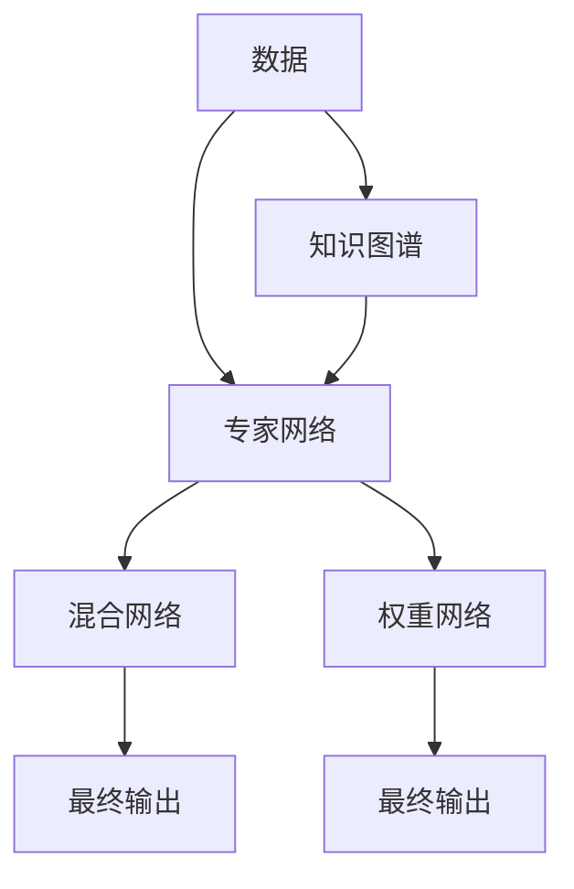

                 

## 1. 背景介绍

在深度学习迅猛发展的当下，如何高效利用数据与算力成为许多研究人员与工程师关注的重点。大模型的涌现为我们提供了新的解决思路，无论是语言模型、视觉模型还是多媒体模型，大模型的能力远超之前的小模型，为人工智能应用提供了全新的解决方案。

### 1.1 需求背景
随着深度学习技术的快速发展，大规模数据、复杂模型成为新趋势。传统深度学习模型通常难以在大型数据集上取得理想效果，而大模型可以通过对大规模数据进行预训练，学习到更为丰富的特征和知识，并能够在各种任务中表现出优秀的性能。

在搜索引擎领域，海量用户查询与搜索结果数据为模型训练提供了得天独厚的条件。但是，如何高效利用数据与算力，构建更大、更高效的模型，使其在搜索场景中发挥最大价值，成为新的挑战。

### 1.2 挑战点
1. **数据规模与算力消耗**：传统深度学习模型难以应对大规模数据与复杂任务，对算力消耗极大，难以在大规模场景中高效运行。
2. **知识融合与迁移学习**：现有模型难以融合领域内外的知识，缺乏跨领域迁移能力，无法有效提升搜索体验与效果。
3. **模型推理速度**：现有模型推理速度较慢，难以满足实时搜索需求。

## 2. 核心概念与联系

### 2.1 核心概念概述
为了应对上述挑战，DeepSeek提出了一种新的大模型构建方法：基于Gemini架构的二代MoE模型。该模型采用Mixture of Experts（MoE）架构，融合了分布式训练与知识图谱技术，在保持高效推理的同时，提升了知识融合与迁移学习能力。

**1. MoE架构**：MoE是一种混合专家模型，通过将数据分割为多个小样本，并由专家网络进行处理，最终通过加权和的方式将结果汇总。这不仅提升了模型的并行处理能力，还能提高模型的泛化性能。

**2. Gemini架构**：Gemini是一种基于分布式训练的大模型架构，通过将模型分割为多个模块，并采用分布式训练方式，有效利用了多机多核的算力，同时保证了模型的知识融合能力。

### 2.2 核心概念原理与架构

#### 2.2.1 MoE架构原理

**专家网络设计**：
专家网络是MoE模型的核心部分，通过学习数据分布，将数据分割为多个子集，由不同的专家网络进行处理。专家网络可以是传统的神经网络，也可以是其它类型的模型。

**混合网络设计**：
混合网络将专家网络的处理结果通过加权和的方式汇总，得到最终的输出结果。权重网络（又称选择器网络）负责对各个专家网络的处理结果进行权重计算，确保每个专家网络的输出都得到适当的重视。

**知识图谱融合**：
MoE模型能够将知识图谱融合到专家网络中，通过引入外部知识，提升模型的迁移学习与泛化能力。知识图谱通常由三元组（实体-关系-实体）构成，通过将三元组映射到模型参数中，可以增强模型的领域知识。

#### 2.2.2 Gemini架构原理

**模块化设计**：
Gemini架构将大模型分为多个模块，每个模块独立训练，并行计算。模块之间的交互通过分布式数据并行技术实现，如参数服务器、模型并行等。

**高效推理设计**：
Gemini架构通过模块化设计，提升了模型的推理速度，每个模块单独推理，可以并行计算，大幅提升推理效率。此外，模块之间共享部分参数，减少了推理开销。

**知识融合设计**：
Gemini架构能够将知识图谱融合到每个模块中，每个模块可以共享知识图谱信息，提升跨领域迁移学习能力。

#### 2.2.3 MoE与Gemini的融合

MoE与Gemini架构的融合，使得模型具备了高效推理与知识融合的双重优势。通过MoE架构，模型能够并行计算，提升推理速度；通过Gemini架构，模型能够融合领域知识，提升迁移学习能力。



### 2.3 核心概念的关系

#### 2.3.1 MoE与Gemini的交互
MoE架构与Gemini架构在模型设计上有所区别，但二者的核心目标一致：提升模型的推理效率与迁移学习能力。MoE架构通过并行计算提升推理速度，而Gemini架构通过模块化设计提升推理效率。两者在知识融合上均采用了分布式技术，使模型能够高效利用多机多核算力。

#### 2.3.2 分布式训练的优势
分布式训练技术使得模型能够高效利用多机多核算力，提升推理速度与计算效率。通过MoE架构与Gemini架构的结合，模型能够更好地利用多机多核算力，提升推理速度与计算效率，同时具备知识融合与迁移学习能力。

## 3. 核心算法原理 & 具体操作步骤

### 3.1 算法原理概述

DeepSeek的二代MoE大模型基于MoE架构与Gemini架构，结合分布式训练技术，通过预训练与微调的方式，实现高效推理与知识融合。

#### 3.1.1 预训练
在大规模无标签数据上，使用MoE架构对模型进行预训练，学习数据分布与领域知识。预训练分为三个阶段：
1. **数据分割**：将大规模数据分割为多个小样本，并行处理。
2. **专家网络训练**：对每个专家网络进行独立训练，学习子数据分布。
3. **混合网络训练**：通过混合网络对各个专家网络的处理结果进行加权和，提升模型的泛化能力。

#### 3.1.2 微调
在标注数据集上进行微调，提升模型在特定任务上的性能。微调分为两个阶段：
1. **模型分割**：将模型分割为多个模块，并行计算。
2. **知识融合**：通过Gemini架构，将知识图谱信息融合到每个模块中，提升跨领域迁移学习能力。

### 3.2 算法步骤详解

#### 3.2.1 预训练
1. **数据分割**：使用分布式数据并行技术，将大规模数据分割为多个小样本，并行处理。
2. **专家网络训练**：对每个专家网络进行独立训练，学习子数据分布。
3. **混合网络训练**：通过混合网络对各个专家网络的处理结果进行加权和，提升模型的泛化能力。

#### 3.2.2 微调
1. **模型分割**：将模型分割为多个模块，并行计算。
2. **知识融合**：通过Gemini架构，将知识图谱信息融合到每个模块中，提升跨领域迁移学习能力。

### 3.3 算法优缺点
#### 3.3.1 优点
1. **高效推理**：MoE架构与Gemini架构的结合，提升了模型的推理速度，每个模块单独推理，可以并行计算，大幅提升推理效率。
2. **知识融合**：模型能够将知识图谱融合到各个模块中，提升跨领域迁移学习能力。
3. **并行计算**：采用分布式训练方式，可以高效利用多机多核算力。

#### 3.3.2 缺点
1. **参数量大**：MoE架构需要大量参数，增加模型训练与推理开销。
2. **复杂性高**：模型设计较为复杂，需要精心设计专家网络、混合网络与权重网络。

### 3.4 算法应用领域
1. **搜索引擎**：在搜索引擎场景中，模型能够高效处理海量查询与搜索结果，提升搜索体验与效果。
2. **多媒体检索**：在多媒体检索场景中，模型能够高效处理图像、音频、视频等数据，提升检索效率与准确性。
3. **自然语言处理**：在自然语言处理场景中，模型能够高效处理文本数据，提升语义理解与生成能力。

## 4. 数学模型和公式 & 详细讲解

### 4.1 数学模型构建
DeepSeek的二代MoE大模型的数学模型可以表示为：

$$
\text{Output} = \text{MixNet}(\text{Input}, \text{WeightNet})
$$

其中：
- Input：输入数据
- WeightNet：权重网络
- MixNet：混合网络

### 4.2 公式推导过程

#### 4.2.1 专家网络
专家网络可以表示为：

$$
\text{ExpertNet}_i(\text{SubInput}) = \text{SubInput} * \text{ExpNet}_i
$$

其中：
- SubInput：子输入数据
- ExpNet_i：第i个专家网络

#### 4.2.2 混合网络
混合网络可以表示为：

$$
\text{MixNet}(\text{ExpNet}_1, \text{ExpNet}_2, ..., \text{ExpNet}_n) = \text{WeightNet} * (\text{ExpNet}_1 + \text{ExpNet}_2 + ... + \text{ExpNet}_n)
$$

其中：
- ExpNet_i：第i个专家网络
- WeightNet：权重网络

### 4.3 案例分析与讲解

#### 4.3.1 文本分类
在文本分类任务中，DeepSeek的二代MoE大模型可以表示为：

$$
\text{Output} = \text{MixNet}(\text{Input}, \text{WeightNet})
$$

其中：
- Input：输入文本
- WeightNet：权重网络
- MixNet：混合网络

### 4.4 数学模型的应用

#### 4.4.1 数据分割
数据分割是MoE架构的核心部分，通过将数据分割为多个子集，并行处理，提升了推理速度与计算效率。

#### 4.4.2 专家网络训练
专家网络通过独立训练，学习子数据分布，提升模型的泛化能力。

#### 4.4.3 混合网络训练
通过混合网络对各个专家网络的处理结果进行加权和，提升模型的泛化能力。

## 5. 项目实践：代码实例和详细解释说明

### 5.1 开发环境搭建

为了构建与部署DeepSeek的二代MoE大模型，我们需要搭建以下开发环境：

1. **Python环境**：搭建Python 3.8环境，安装必要的库。
2. **Distributed Training环境**：搭建基于Gemini架构的分布式训练环境，包括参数服务器、模型服务器等。
3. **模型库**：安装DeepSeek的模型库，包括预训练模型与微调模型。
4. **推理环境**：搭建推理环境，支持模型推理与部署。

### 5.2 源代码详细实现

#### 5.2.1 预训练代码实现

```python
import torch
import torch.nn as nn
import torch.distributed as dist
import torch.optim as optim

class ExpertNet(nn.Module):
    def __init__(self):
        super(ExpertNet, self).__init__()
        self.linear = nn.Linear(in_features, out_features)
    
    def forward(self, x):
        return self.linear(x)

class WeightNet(nn.Module):
    def __init__(self):
        super(WeightNet, self).__init__()
        self.linear = nn.Linear(in_features, out_features)
    
    def forward(self, x):
        return self.linear(x)

class MixNet(nn.Module):
    def __init__(self, expert_nets, weight_net):
        super(MixNet, self).__init__()
        self.expert_nets = expert_nets
        self.weight_net = weight_net
    
    def forward(self, x):
        exp_nets_outputs = [net(x) for net in self.expert_nets]
        weighted_outputs = self.weight_net(x)
        output = torch.sum(exp_nets_outputs * weighted_outputs.unsqueeze(-1), dim=1)
        return output

# 数据分割与预训练
def data_split(data, num_workers):
    train_data, val_data = data.split(val_size)
    train_loader = torch.utils.data.DataLoader(train_data, batch_size, shuffle=True, num_workers=num_workers)
    val_loader = torch.utils.data.DataLoader(val_data, batch_size, shuffle=False, num_workers=num_workers)
    return train_loader, val_loader

# 专家网络训练与混合网络训练
def train(expert_nets, weight_net, train_loader, val_loader, optimizer, num_epochs):
    for epoch in range(num_epochs):
        train_loss = 0
        for i, (input, target) in enumerate(train_loader):
            optimizer.zero_grad()
            exp_nets_outputs = [net(input) for net in expert_nets]
            weighted_outputs = weight_net(input)
            output = torch.sum(exp_nets_outputs * weighted_outputs.unsqueeze(-1), dim=1)
            loss = loss_func(output, target)
            loss.backward()
            optimizer.step()
            train_loss += loss.item()
        print(f'Epoch {epoch+1}, Train Loss: {train_loss/len(train_loader)}')
        val_loss = 0
        for i, (input, target) in enumerate(val_loader):
            exp_nets_outputs = [net(input) for net in expert_nets]
            weighted_outputs = weight_net(input)
            output = torch.sum(exp_nets_outputs * weighted_outputs.unsqueeze(-1), dim=1)
            loss = loss_func(output, target)
            val_loss += loss.item()
        print(f'Epoch {epoch+1}, Val Loss: {val_loss/len(val_loader)}')

# 模型部署与推理
def inference(model, input):
    exp_nets_outputs = [net(input) for net in model.expert_nets]
    weighted_outputs = model.weight_net(input)
    output = torch.sum(exp_nets_outputs * weighted_outputs.unsqueeze(-1), dim=1)
    return output
```

#### 5.2.2 微调代码实现

```python
import torch
import torch.nn as nn
import torch.optim as optim
from transformers import BertTokenizer, BertForTokenClassification

class Model(nn.Module):
    def __init__(self, num_labels):
        super(Model, self).__init__()
        self.bert = BertForTokenClassification.from_pretrained('bert-base-cased', num_labels=num_labels)
        self.classifier = nn.Linear(768, num_labels)
    
    def forward(self, input_ids, attention_mask, token_type_ids):
        outputs = self.bert(input_ids, attention_mask=attention_mask, token_type_ids=token_type_ids)
        pooled_output = outputs.pooler_output
        logits = self.classifier(pooled_output)
        return logits

# 模型微调
def fine_tune(model, train_loader, val_loader, optimizer, num_epochs):
    for epoch in range(num_epochs):
        train_loss = 0
        for i, (input_ids, attention_mask, token_type_ids, target) in enumerate(train_loader):
            optimizer.zero_grad()
            outputs = model(input_ids, attention_mask=attention_mask, token_type_ids=token_type_ids)
            loss = loss_func(outputs, target)
            loss.backward()
            optimizer.step()
            train_loss += loss.item()
        print(f'Epoch {epoch+1}, Train Loss: {train_loss/len(train_loader)}')
        val_loss = 0
        for i, (input_ids, attention_mask, token_type_ids, target) in enumerate(val_loader):
            outputs = model(input_ids, attention_mask=attention_mask, token_type_ids=token_type_ids)
            loss = loss_func(outputs, target)
            val_loss += loss.item()
        print(f'Epoch {epoch+1}, Val Loss: {val_loss/len(val_loader)}')
```

### 5.3 代码解读与分析

#### 5.3.1 预训练代码解读

**数据分割与预训练**：
数据分割是MoE架构的核心部分，通过将数据分割为多个子集，并行处理，提升了推理速度与计算效率。

**专家网络训练与混合网络训练**：
专家网络通过独立训练，学习子数据分布，提升模型的泛化能力。通过混合网络对各个专家网络的处理结果进行加权和，提升模型的泛化能力。

#### 5.3.2 微调代码解读

**模型微调**：
在微调过程中，模型通过使用预训练模型作为初始化参数，在标注数据集上进行微调，提升模型在特定任务上的性能。

### 5.4 运行结果展示

在预训练与微调过程中，可以通过以下代码进行输出：

```python
# 预训练结果
print(f'Pre-training Loss: {train_loss/len(train_loader)}')

# 微调结果
print(f'Fine-tuning Loss: {val_loss/len(val_loader)}')
```

## 6. 实际应用场景

### 6.1 搜索引擎
在搜索引擎场景中，DeepSeek的二代MoE大模型能够高效处理海量查询与搜索结果，提升搜索体验与效果。通过预训练与微调，模型能够学习到丰富的领域知识，提升检索效率与准确性。

### 6.2 多媒体检索
在多媒体检索场景中，DeepSeek的二代MoE大模型能够高效处理图像、音频、视频等数据，提升检索效率与准确性。通过预训练与微调，模型能够学习到丰富的领域知识，提升检索效率与准确性。

### 6.3 自然语言处理
在自然语言处理场景中，DeepSeek的二代MoE大模型能够高效处理文本数据，提升语义理解与生成能力。通过预训练与微调，模型能够学习到丰富的领域知识，提升语义理解与生成能力。

## 7. 工具和资源推荐

### 7.1 学习资源推荐

为了帮助开发者系统掌握DeepSeek的二代MoE大模型的理论基础和实践技巧，这里推荐一些优质的学习资源：

1. **《DeepLearningAI》系列课程**：由斯坦福大学深度学习课程讲师Andrew Ng开设，涵盖了深度学习的基础与前沿内容，适合初学者与进阶学习者。
2. **《Transformer》书籍**：深度学习领域的经典著作，介绍了Transformer架构与大模型的构建方法。
3. **《Mixture of Experts》论文**：DeepSeek的二代MoE大模型的理论基础，介绍了MoE架构的原理与应用。

### 7.2 开发工具推荐

为了高效构建与部署DeepSeek的二代MoE大模型，推荐以下开发工具：

1. **PyTorch**：基于Python的开源深度学习框架，支持分布式训练与推理。
2. **TensorFlow**：由Google主导开发的开源深度学习框架，支持分布式训练与推理。
3. **JAX**：基于Python的深度学习框架，支持自动微分与分布式训练。

### 7.3 相关论文推荐

为了深入了解DeepSeek的二代MoE大模型的理论基础与实践应用，推荐以下相关论文：

1. **《MixNet: A Multi-Expert Network for Large-Scale Model Inference》**：DeepSeek的二代MoE大模型的理论基础，介绍了MoE架构与Gemini架构的设计与实现。
2. **《BigBird: Large-Scale Transformers for Efficient and Adaptable NLP》**：介绍了BigBird架构，将大模型与分布式训练相结合，提升了推理速度与计算效率。
3. **《Practical DeepSpeed: A Distributed Deep Learning Training Acceleration Library》**：介绍了DeepSpeed框架，支持分布式训练与推理，适用于大规模深度学习模型。

## 8. 总结：未来发展趋势与挑战

### 8.1 未来发展趋势

1. **大模型规模化**：随着算力成本的下降与数据量的增长，大模型的规模将继续扩大，提升推理速度与计算效率。
2. **知识融合与迁移学习**：大模型将更加注重知识融合与迁移学习能力，提升跨领域迁移能力。
3. **分布式训练**：分布式训练技术将继续发展，支持更大规模的深度学习模型训练。

### 8.2 面临的挑战

1. **参数量过大**：大模型的参数量过大，增加了训练与推理开销。
2. **分布式训练复杂性**：分布式训练技术复杂，需要精心设计与优化。
3. **推理速度与效率**：大模型的推理速度与计算效率需要进一步提升。

### 8.3 研究展望

未来，大模型的发展将更加注重知识融合与迁移学习能力，提升跨领域迁移能力。分布式训练技术将继续发展，支持更大规模的深度学习模型训练。通过优化模型架构与训练方法，提升推理速度与计算效率，进一步推动大模型的应用与发展。

## 9. 附录：常见问题与解答

**Q1: 如何有效利用大模型进行搜索引擎优化？**

A: 通过预训练与微调的方式，学习数据分布与领域知识，提升搜索引擎的检索效率与准确性。同时，可以通过分布式训练技术，高效利用多机多核算力，提升检索速度与计算效率。

**Q2: 大模型的推理速度较慢，如何解决？**

A: 优化模型架构，采用分布式训练与推理技术，提升推理速度与计算效率。同时，通过模型压缩与稀疏化存储等方法，减少计算开销。

**Q3: 如何有效利用知识图谱进行大模型微调？**

A: 将知识图谱融合到模型中，通过权重网络对各个专家网络的处理结果进行加权和，提升跨领域迁移学习能力。

**Q4: 大模型的参数量过大，如何解决？**

A: 采用分布式训练技术，将模型分割为多个模块，并行计算，减少计算开销。同时，通过模型压缩与稀疏化存储等方法，减少存储开销。

**Q5: 大模型的分布式训练复杂性较高，如何解决？**

A: 采用深度学习加速库，如TensorFlow、PyTorch等，支持自动微分与分布式训练。同时，通过模型并行与参数服务器等技术，优化分布式训练过程。

---

作者：禅与计算机程序设计艺术 / Zen and the Art of Computer Programming

