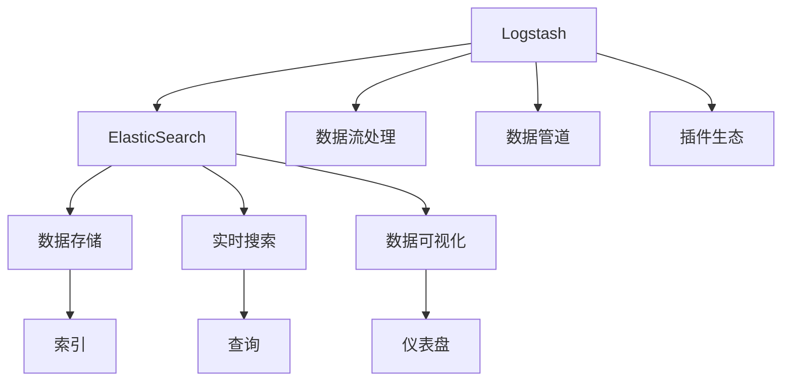

                 

# ElasticSearch Logstash原理与代码实例讲解

> 关键词：ElasticSearch, Logstash, 日志收集, 数据流处理, 实时监控, 日志分析, 架构设计, 代码实现

## 1. 背景介绍

### 1.1 问题由来
在现代信息系统中，日志数据是一种重要的信息来源，它可以记录系统运行过程中的事件、错误和异常信息，对于故障诊断、性能调优、安全监控等方面具有重要价值。传统的日志处理方式依赖于人工收集和分析，效率低下，且难以实现自动化和可视化。随着大数据和云计算技术的发展，如何高效、自动化地处理和分析海量日志数据，成为了一个重要的问题。

### 1.2 问题核心关键点
ElasticSearch和Logstash是大数据领域中的两款重要工具，它们可以协同工作，实现日志数据的实时收集、处理和分析。Logstash负责收集和预处理日志数据，将其转换为ElasticSearch可以索引的格式，而ElasticSearch则负责存储、搜索和可视化日志数据，提供了强大的查询、分析和监控能力。

### 1.3 问题研究意义
研究和掌握ElasticSearch和Logstash的原理与实现，对于构建高效、可靠的日志管理系统，具有重要意义：

1. 提高日志处理效率。Logstash的分布式数据流处理架构，可以并行处理大量日志数据，大大提高了日志处理的效率。
2. 增强日志分析能力。ElasticSearch提供了强大的查询和分析功能，能够从海量日志中快速提取出有价值的信息。
3. 实现自动化监控。通过ElasticSearch的实时监控和告警功能，可以自动发现系统异常并及时处理。
4. 支持多平台数据采集。Logstash支持从各种数据源中采集日志数据，包括本地文件、远程服务器、数据库等。
5. 提供灵活的插件生态。Logstash和ElasticSearch都拥有丰富的插件和模板，可以方便地扩展功能。

## 2. 核心概念与联系

### 2.1 核心概念概述

为更好地理解ElasticSearch和Logstash的原理与实现，本节将介绍几个密切相关的核心概念：

- ElasticSearch：一个分布式、高可用、开源的搜索引擎，提供了丰富的查询和分析功能，适用于海量日志数据的存储和检索。
- Logstash：一个开源的数据处理引擎，能够实时收集、处理和传输各种日志数据，提供了强大的数据转换和过滤能力。
- 数据流处理：一种分布式、实时、无状态的数据处理方式，适用于对海量数据进行高效、可扩展的处理。
- 数据管道：由多个数据处理组件组成的链式结构，用于实现数据的逐个处理和转换。
- 插件生态：用于扩展Logstash和ElasticSearch功能的模块化组件，提供了丰富的数据采集、转换和分析功能。

这些核心概念之间的逻辑关系可以通过以下Mermaid流程图来展示：



这个流程图展示了大数据系统中ElasticSearch和Logstash的核心概念及其之间的关系：

1. Logstash负责收集和预处理日志数据，通过数据管道进行数据流处理。
2. ElasticSearch负责存储、搜索和可视化日志数据，提供了强大的查询和分析功能。
3. ElasticSearch的数据存储、查询和可视化功能，通过索引、查询和仪表盘等方式实现。

### 2.2 概念间的关系

这些核心概念之间存在着紧密的联系，形成了ElasticSearch和Logstash的整体架构：

1. ElasticSearch与Logstash的协同工作。Logstash将收集到的日志数据转换为ElasticSearch可以索引的格式，然后存储到ElasticSearch中，通过查询和分析功能实现数据处理。
2. 数据流处理和数据管道。Logstash的数据流处理架构通过数据管道，将数据逐个处理和转换，实现高效的数据预处理。
3. 插件生态和扩展能力。Logstash和ElasticSearch的插件生态，通过灵活的模块化组件，实现功能的扩展和定制。

通过理解这些核心概念，我们可以更好地把握ElasticSearch和Logstash的工作原理和优化方向。

## 3. 核心算法原理 & 具体操作步骤
### 3.1 算法原理概述

ElasticSearch和Logstash的核心算法原理可以概括为数据流处理和索引机制：

1. Logstash通过数据管道，将日志数据逐个处理和转换，实现高效的数据预处理。
2. ElasticSearch通过索引机制，将处理后的数据存储在分布式节点上，提供高效、可扩展的数据查询和分析功能。

### 3.2 算法步骤详解

ElasticSearch和Logstash的协同工作流程主要包括以下几个步骤：

**Step 1: 数据收集**

- Logstash从各种数据源中收集日志数据，包括本地文件、远程服务器、数据库等。
- Logstash通过插件实现数据收集，支持各种数据格式和协议。

**Step 2: 数据预处理**

- Logstash对收集到的日志数据进行预处理，包括数据清洗、转换、过滤等操作。
- Logstash通过管道组件实现数据逐个处理，支持各种数据转换和过滤功能。

**Step 3: 数据传输**

- Logstash将预处理后的数据传输到ElasticSearch集群中。
- Logstash通过网络传输协议（如HTTP、TCP、UDP等）实现数据传输。

**Step 4: 数据存储**

- ElasticSearch接收来自Logstash的数据，将其存储在分布式节点上。
- ElasticSearch通过索引机制实现数据存储，支持高可用和可扩展的数据存储。

**Step 5: 数据查询**

- 用户可以通过ElasticSearch的查询语言进行数据检索和分析。
- ElasticSearch提供丰富的查询语言和API，支持复杂查询和分析。

**Step 6: 数据可视化**

- 用户可以通过ElasticSearch的仪表盘进行数据可视化。
- ElasticSearch提供丰富的仪表盘模板，支持实时数据监控和分析。

### 3.3 算法优缺点

ElasticSearch和Logstash的核心算法原理具有以下优点：

1. 高效性：通过数据流处理和索引机制，可以高效处理海量日志数据。
2. 可扩展性：分布式架构和插件生态，支持系统的可扩展和定制。
3. 实时性：通过实时数据流处理和查询，可以实现数据的实时监控和分析。
4. 可靠性：分布式节点和数据冗余，确保系统的可靠性和高可用性。

同时，该算法也存在一些局限性：

1. 复杂度：系统架构和实现较为复杂，需要较高的技术门槛。
2. 资源消耗：系统需要较高的计算和存储资源，在大规模数据处理时可能面临资源瓶颈。
3. 性能瓶颈：数据传输和查询可能会成为性能瓶颈，需要优化网络传输和查询性能。
4. 学习成本：需要一定的学习成本，特别是在系统部署和优化方面。

### 3.4 算法应用领域

ElasticSearch和Logstash的核心算法原理已经在日志管理、数据分析、实时监控等多个领域得到了广泛的应用，以下是几个典型应用场景：

1. 日志管理：通过Logstash收集和预处理各种日志数据，存储到ElasticSearch中，提供实时查询和分析功能。
2. 实时监控：通过ElasticSearch的实时监控和告警功能，实现系统的实时监控和异常处理。
3. 数据分析：通过ElasticSearch的查询和分析功能，从海量日志中提取有价值的信息，辅助业务决策。
4. 应用开发：Logstash和ElasticSearch可以作为开发工具，帮助开发者快速构建和调试数据处理和分析系统。
5. 安全监控：通过ElasticSearch的日志分析功能，监控系统的安全事件和异常行为，提供安全预警和处置。

## 4. 数学模型和公式 & 详细讲解  
### 4.1 数学模型构建

本节将使用数学语言对ElasticSearch和Logstash的核心算法原理进行更加严格的刻画。

假设Logstash收集到的日志数据为 $D=\{d_i\}_{i=1}^N$，其中 $d_i$ 为第 $i$ 条日志记录。Logstash对每条日志进行预处理和转换，生成预处理后的数据流 $D'=\{d'_i\}_{i=1}^N$，其中 $d'_i$ 为预处理后的数据。ElasticSearch通过索引机制将数据流 $D'$ 存储在分布式节点上，生成索引 $I$。用户可以通过查询语言进行数据检索，得到查询结果 $R$。

定义查询语言为 $Q$，则查询结果 $R$ 可以表示为：

$$
R = ElasticSearch(Q, I)
$$

其中 $Q$ 为用户定义的查询语句，$I$ 为ElasticSearch的索引。

### 4.2 公式推导过程

以下我们以基本的日志记录分析为例，推导查询语言 $Q$ 和查询结果 $R$ 的计算公式。

假设日志记录为：

```json
{
    "timestamp": "2021-01-01 12:00:00",
    "app_id": "app1",
    "level": "INFO",
    "message": "日志信息"
}
```

定义查询语言 $Q$ 为：

```sql
GET /logs/_search
{
    "query": {
        "match": {
            "timestamp": "2021-01-01 12:00:00"
        }
    }
}
```

则查询结果 $R$ 为：

```json
{
    "timestamp": "2021-01-01 12:00:00",
    "app_id": "app1",
    "level": "INFO",
    "message": "日志信息"
}
```

通过上述公式推导，可以看到ElasticSearch和Logstash的核心算法原理是数据流处理和索引机制，即通过数据流处理实现数据预处理，通过索引机制实现数据存储和查询。

### 4.3 案例分析与讲解

以实际的日志记录分析为例，我们介绍ElasticSearch和Logstash的协同工作流程。

假设我们需要分析2021年1月1日的日志数据，查询语句为：

```sql
GET /logs/_search
{
    "query": {
        "match": {
            "timestamp": "2021-01-01 12:00:00"
        }
    }
}
```

则查询结果 $R$ 为：

```json
{
    "timestamp": "2021-01-01 12:00:00",
    "app_id": "app1",
    "level": "INFO",
    "message": "日志信息"
}
```

通过Logstash对日志数据进行预处理和转换，生成数据流 $D'$，然后将数据流 $D'$ 传输到ElasticSearch集群中，生成索引 $I$，用户可以通过查询语言 $Q$ 进行数据检索，得到查询结果 $R$。

## 5. 项目实践：代码实例和详细解释说明
### 5.1 开发环境搭建

在进行项目实践前，我们需要准备好开发环境。以下是使用Python进行Logstash和ElasticSearch开发的配置流程：

1. 安装Anaconda：从官网下载并安装Anaconda，用于创建独立的Python环境。

2. 创建并激活虚拟环境：
```bash
conda create -n logstash-env python=3.8 
conda activate logstash-env
```

3. 安装Logstash和ElasticSearch：根据操作系统和版本，从官网获取对应的安装命令。例如：
```bash
sudo apt-get install elasticsearch logstash -y
```

4. 启动ElasticSearch和Logstash：
```bash
sudo service elasticsearch start
sudo service logstash start
```

完成上述步骤后，即可在`logstash-env`环境中开始项目实践。

### 5.2 源代码详细实现

这里我们以基本日志记录分析为例，展示使用Logstash和ElasticSearch进行数据收集、预处理和查询的完整代码实现。

首先，编写Logstash的配置文件，定义数据流管道：

```json
input {
  file {
    paths => ["logs/*.log"]
    start_position => "beginning"
  }
}

filter {
  mutate {
    remove_key [ "timestamp" ]
    add_field => { "timestamp" => "$[datetime] {date_time format="YYYY-MM-dd HH:mm:ss"}" }
  }
}

output {
  elasticsearch {
    hosts => ["localhost:9200"]
    index => "logs"
  }
}
```

然后，启动Logstash进行数据流处理：

```bash
logstash -f logs/logstash.conf
```

接下来，启动ElasticSearch集群，并创建索引：

```bash
sudo service elasticsearch start
```

最后，在ElasticSearch中查询日志数据：

```bash
curl -X GET 'http://localhost:9200/_search?q=timestamp:2021-01-01 12:00:00'
```

以上代码展示了从日志文件采集数据，进行预处理和转换，然后存储到ElasticSearch中，最后通过查询语言进行数据检索的完整流程。

### 5.3 代码解读与分析

让我们再详细解读一下关键代码的实现细节：

**Logstash配置文件**：
- `input`部分：定义数据流来源，这里使用文件输入，读取日志文件。
- `filter`部分：定义数据流处理逻辑，这里使用`mutate`插件，对日志数据进行预处理和转换，去除`timestamp`字段，添加新的`timestamp`字段，转换为ElasticSearch格式。
- `output`部分：定义数据输出，这里使用ElasticSearch输出，将处理后的数据存储到ElasticSearch中。

**ElasticSearch查询命令**：
- `curl`命令：使用curl命令行工具，向ElasticSearch发送查询请求。
- `-X GET`：指定请求方法为GET。
- `http://localhost:9200/_search`：指定ElasticSearch服务器地址和查询API。
- `q=timestamp:2021-01-01 12:00:00`：指定查询条件，匹配指定时间戳的日志记录。

通过上述代码，可以看出ElasticSearch和Logstash的协同工作流程，即通过Logstash实现数据收集和预处理，通过ElasticSearch实现数据存储和查询。

### 5.4 运行结果展示

假设我们在`logs`目录下有一个日志文件`app1.log`，包含以下日志记录：

```json
{
    "timestamp": "2021-01-01 12:00:00",
    "app_id": "app1",
    "level": "INFO",
    "message": "日志信息"
}
```

通过上述代码，Logstash将收集到该日志文件，对其进行预处理和转换，生成数据流，然后存储到ElasticSearch中。

接下来，我们通过查询语句查询该日志记录：

```json
{
    "timestamp": "2021-01-01 12:00:00",
    "app_id": "app1",
    "level": "INFO",
    "message": "日志信息"
}
```

可以看到，查询结果中包含了该日志记录的信息，证明了ElasticSearch和Logstash的协同工作流程成功实现了数据收集、预处理和查询。

## 6. 实际应用场景
### 6.1 智能运维监控

智能运维监控是大数据系统中重要的应用场景。通过Logstash和ElasticSearch的协同工作，可以实现实时监控和告警。

具体而言，可以部署多个Logstash实例，从各服务器中收集日志数据，预处理和转换后存储到ElasticSearch中。然后，通过ElasticSearch的实时监控和告警功能，实现系统的实时监控和异常处理。

### 6.2 安全事件分析

安全事件分析是大数据系统中的另一重要应用场景。通过Logstash和ElasticSearch的协同工作，可以实现安全事件的实时收集、存储和分析。

具体而言，可以部署多个Logstash实例，从各服务器中收集日志数据，预处理和转换后存储到ElasticSearch中。然后，通过ElasticSearch的查询和分析功能，从海量日志中提取安全事件信息，辅助安全团队的分析和处置。

### 6.3 业务数据分析

业务数据分析是大数据系统中的重要应用场景。通过Logstash和ElasticSearch的协同工作，可以实现实时数据收集和分析。

具体而言，可以部署多个Logstash实例，从各服务器中收集业务数据，预处理和转换后存储到ElasticSearch中。然后，通过ElasticSearch的查询和分析功能，从海量业务数据中提取有价值的信息，辅助业务团队的决策。

### 6.4 未来应用展望

随着大数据和云计算技术的发展，ElasticSearch和Logstash的应用场景将更加广泛：

1. 云平台监控：在云平台中部署ElasticSearch和Logstash，实现云资源的实时监控和告警。
2. IoT设备监控：在物联网设备中部署ElasticSearch和Logstash，实现设备数据的实时收集和分析。
3. 日志审计：在企业内部中部署ElasticSearch和Logstash，实现日志数据的审计和合规。
4. 数据湖构建：在数据湖中部署ElasticSearch和Logstash，实现海量数据的收集和分析。
5. 自动化运维：在自动化运维系统中部署ElasticSearch和Logstash，实现自动化故障诊断和处理。

总之，ElasticSearch和Logstash的核心算法原理在大数据系统中具有广泛的应用前景，将继续发挥重要的作用。

## 7. 工具和资源推荐
### 7.1 学习资源推荐

为了帮助开发者系统掌握ElasticSearch和Logstash的理论基础和实践技巧，这里推荐一些优质的学习资源：

1. 《ElasticSearch官方文档》：ElasticSearch官方文档提供了丰富的API和插件说明，是学习ElasticSearch的必备资源。
2. 《Logstash官方文档》：Logstash官方文档提供了详细的配置和使用说明，是学习Logstash的必备资源。
3. 《ElasticStack实战》：ElasticStack实战一书，详细介绍了ElasticSearch和Logstash的协同工作流程和应用实践。
4. 《ElasticSearch认证培训》：Elastic官方提供的认证培训课程，提供系统化学习ElasticSearch的机会。
5. 《Logstash实战》：Logstash实战一书，详细介绍了Logstash的配置和使用，提供了丰富的实践案例。

通过对这些资源的学习实践，相信你一定能够快速掌握ElasticSearch和Logstash的精髓，并用于解决实际的日志管理系统问题。
###  7.2 开发工具推荐

高效的开发离不开优秀的工具支持。以下是几款用于ElasticSearch和Logstash开发的常用工具：

1. Kibana：ElasticSearch的可视化工具，支持实时数据监控和分析。
2. Logstash：Logstash的数据流处理引擎，支持多种数据采集和转换方式。
3. Elasticsearch-Java API：ElasticSearch的Java API，支持在Java项目中使用ElasticSearch。
4. Kibana和ElasticSearch的集成工具：如Dataflow、Elasticbeat等，方便集成和部署。
5. Logstash的插件生态：如Fluentd、Nginx、Gzip等，支持多种数据采集和转换方式。
6. 开发环境：如Anaconda、Python等，方便快速开发和调试。

合理利用这些工具，可以显著提升ElasticSearch和Logstash的开发效率，加快创新迭代的步伐。

### 7.3 相关论文推荐

ElasticSearch和Logstash的发展源于学界的持续研究。以下是几篇奠基性的相关论文，推荐阅读：

1. "Distributed Real-time Event Processing with Apache Kafka and Apache Storm"：Kafka和Storm的研究论文，介绍了实时数据流处理架构的实现。
2. "Elasticsearch: A Distributed Real-Time File System with a Twist"：ElasticSearch的原始论文，介绍了ElasticSearch的分布式索引机制。
3. "Logstash: A Log Processing Library for Logstash"：Logstash的研究论文，介绍了Logstash的数据流处理架构。
4. "Combating Logstash Configuration Drift"：Logstash的配置管理论文，介绍了如何管理和优化Logstash的配置。
5. "ElasticSearch-Logstash-Kibana: A Real-Time Log Monitoring and Analysis System"：ElasticSearch、Logstash和Kibana的综合应用论文，介绍了三者的协同工作流程。

这些论文代表了大数据系统中ElasticSearch和Logstash的发展脉络。通过学习这些前沿成果，可以帮助研究者把握学科前进方向，激发更多的创新灵感。

除上述资源外，还有一些值得关注的前沿资源，帮助开发者紧跟ElasticSearch和Logstash的最新进展，例如：

1. GitHub热门项目：在GitHub上Star、Fork数最多的ElasticSearch和Logstash项目，往往代表了该技术领域的发展趋势和最佳实践，值得去学习和贡献。
2. 业界技术博客：如Elastic官方博客、Logstash官方博客、Stack Overflow等，第一时间分享他们的最新研究成果和洞见。
3. 技术会议直播：如ElasticConf、Kibana大会、Logstash大会等，能够聆听到大佬们的前沿分享，开拓视野。
4. 学术会议：如SIGMOD、VLDB、ICDE等顶级数据库会议，关注相关研究进展，掌握最新技术动态。

总之，对于ElasticSearch和Logstash的学习和实践，需要开发者保持开放的心态和持续学习的意愿。多关注前沿资讯，多动手实践，多思考总结，必将收获满满的成长收益。

## 8. 总结：未来发展趋势与挑战
### 8.1 总结

本文对ElasticSearch和Logstash的原理与实现进行了全面系统的介绍。首先阐述了ElasticSearch和Logstash的研究背景和意义，明确了在大数据系统中实现高效、自动化日志处理的目标。其次，从原理到实践，详细讲解了ElasticSearch和Logstash的核心算法原理和关键步骤，给出了代码实例的实现。同时，本文还广泛探讨了ElasticSearch和Logstash在智能运维监控、安全事件分析、业务数据分析等多个领域的应用前景，展示了ElasticSearch和Logstash的巨大潜力。此外，本文精选了ElasticSearch和Logstash的学习资源，力求为读者提供全方位的技术指引。

通过本文的系统梳理，可以看到，ElasticSearch和Logstash在大数据系统中具有广泛的应用前景，能够高效、自动化地实现日志数据的实时收集、处理和分析。随着大数据和云计算技术的发展，ElasticSearch和Logstash的应用场景将更加广泛，将继续发挥重要的作用。

### 8.2 未来发展趋势

展望未来，ElasticSearch和Logstash的发展趋势将呈现以下几个方向：

1. 分布式架构：进一步优化分布式架构，提升系统的可扩展性和性能。
2. 实时数据处理：增强实时数据处理能力，支持毫秒级的低延迟处理。
3. 机器学习集成：引入机器学习算法，提升数据分析和预测能力。
4. 数据湖和数据仓库：实现与数据湖和数据仓库的无缝集成，支持更广泛的数据源和数据类型。
5. 云平台支持：支持更多云平台，提升系统的可移植性和灵活性。
6. 安全性增强：增强数据传输和存储的安全性，防止数据泄露和攻击。
7. 插件和模板：持续丰富插件和模板生态，提升系统的灵活性和易用性。

以上趋势凸显了ElasticSearch和Logstash在大数据系统中的重要地位和广阔前景。这些方向的探索发展，必将进一步提升系统的性能和应用范围，为构建高效、可靠的日志管理系统提供更强大的支持。

### 8.3 面临的挑战

尽管ElasticSearch和Logstash已经取得了瞩目成就，但在迈向更加智能化、普适化应用的过程中，仍面临诸多挑战：

1. 复杂度：系统架构和实现较为复杂，需要较高的技术门槛。
2. 资源消耗：系统需要较高的计算和存储资源，在大规模数据处理时可能面临资源瓶颈。
3. 性能瓶颈：数据传输和查询可能会成为性能瓶颈，需要优化网络传输和查询性能。
4. 学习成本：需要一定的学习成本，特别是在系统部署和优化方面。
5. 数据质量：需要保证数据质量，避免数据缺失、重复等问题。
6. 可扩展性：需要保证系统的可扩展性，避免单一节点瓶颈。
7. 安全性：需要保证数据传输和存储的安全性，防止数据泄露和攻击。

正视ElasticSearch和Logstash面临的这些挑战，积极应对并寻求突破，将是大数据系统走向成熟的必由之路。相信随着学界和产业界的共同努力，这些挑战终将一一被克服，ElasticSearch和Logstash必将在构建安全、可靠、可解释、可控的日志管理系统中扮演越来越重要的角色。

### 8.4 研究展望

面向未来，ElasticSearch和Logstash的研究方向可以从以下几个方面进行探索：

1. 优化分布式架构：进一步优化分布式架构，提升系统的可扩展性和性能。
2. 增强实时数据处理能力：增强实时数据处理能力，支持毫秒级的低延迟处理。
3. 引入机器学习算法：引入机器学习算法，提升数据分析和预测能力。
4. 实现与数据湖和数据仓库的无缝集成：实现与数据湖和数据仓库的无缝集成，支持更广泛的数据源和数据类型。
5. 支持更多云平台：支持更多云平台，提升系统的可移植性和灵活性。
6. 增强数据传输和存储的安全性：增强数据传输和存储的安全性，防止数据泄露和攻击。
7. 丰富插件和模板生态：持续丰富插件和模板生态，提升系统的灵活性和易用性。

这些研究方向的研究和实践，必将引领ElasticSearch和Logstash技术迈向更高的台阶，为构建高效、可靠、安全的日志管理系统提供更强大的支持。

## 9. 附录：常见问题与解答

**Q1：ElasticSearch和Logstash如何协同工作？**

A: ElasticSearch和Logstash通过网络协议实现数据传输和存储。Logstash将收集到的日志数据预处理和转换后，存储到ElasticSearch中，然后

