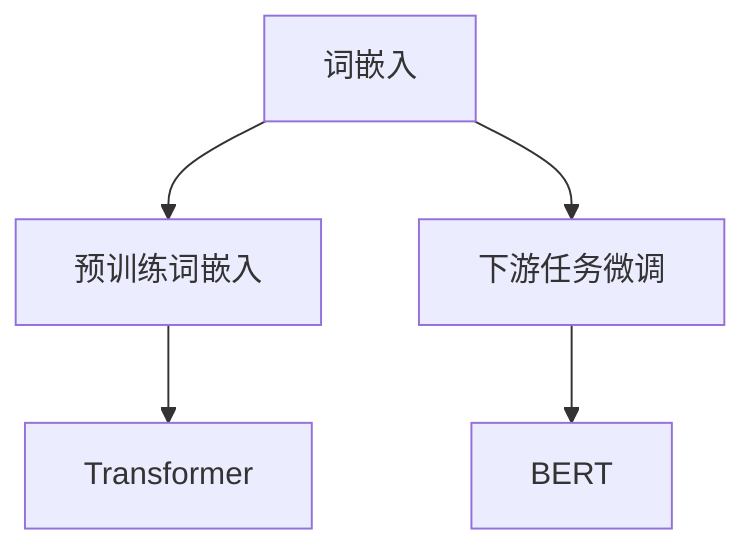

                 

# Embeddings Dev 101

在人工智能领域，词嵌入（Word Embedding）是自然语言处理（NLP）中至关重要的基础技术，它将离散的文本词汇映射为连续的向量空间表示，从而使得计算机能够理解和处理自然语言。本文将深入探讨词嵌入的原理、实现、优化及应用，旨在帮助开发者更好地理解并掌握这一关键技术。

## 1. 背景介绍

词嵌入技术的出现，极大地推动了NLP领域的发展。传统的NLP任务，如文本分类、信息检索、机器翻译等，大多依赖于文本的词汇频次、TF-IDF等词频统计特征。然而，这些特征存在维度高、稀疏、无法捕捉词汇语义关系等问题，导致模型性能难以提升。词嵌入技术通过将词汇映射为低维向量，解决了这些问题，使模型能够更好地理解文本的语义和语境。

## 2. 核心概念与联系

### 2.1 核心概念概述

- **词嵌入**（Word Embedding）：将词汇映射为连续向量，以捕捉词汇之间的语义关系。
- **预训练词嵌入**（Pretrained Word Embedding）：在大规模语料库上预训练的词嵌入，如Word2Vec、GloVe等，为模型提供了高质量的词向量。
- **下游任务微调**（Fine-tuning）：将预训练词嵌入应用于特定任务，通过有监督训练进一步优化词嵌入，提升模型性能。
- **Transformer**：一种先进的神经网络架构，用于处理序列数据，能够生成高质量的词嵌入。
- **BERT**：一种基于Transformer架构的预训练语言模型，能够捕捉丰富的语义信息，是当前最先进的词嵌入技术之一。

这些概念之间存在紧密联系，共同构成了现代NLP模型的核心。预训练词嵌入通过大规模语料预训练，为模型提供了高质量的词汇表示，而下游任务微调则进一步优化了这些表示，适应具体任务的需求。Transformer和BERT等架构的引入，则提供了更高效、更强大的词嵌入生成和处理能力。

### 2.2 概念间的关系

我们可以通过以下Mermaid流程图来展示这些核心概念之间的关系：



这个流程图展示了词嵌入的核心技术链条：预训练词嵌入通过大规模语料预训练，为Transformer和BERT等架构提供高质量的词嵌入，而下游任务微调则进一步优化这些嵌入，适应具体任务的需求。

## 3. 核心算法原理 & 具体操作步骤

### 3.1 算法原理概述

词嵌入技术的核心思想是将词汇映射为连续的向量空间，使得相似的词汇在向量空间中距离更近。这种映射通常通过以下两种方法实现：

- **词袋模型**（Bag of Words）：将文本表示为词汇的集合，忽略词汇的顺序和语法结构。
- **序列模型**（Sequence Model）：考虑词汇的顺序和语法结构，通过神经网络生成词嵌入。

预训练词嵌入通常采用第二种方法，使用深度神经网络在大规模语料上预训练词嵌入，使得模型能够捕捉词汇之间的语义关系。下游任务微调则是在预训练词嵌入的基础上，通过有监督训练进一步优化词汇表示，适应具体任务的需求。

### 3.2 算法步骤详解

词嵌入的实现可以分为以下几个步骤：

**Step 1: 数据预处理**
- 收集并清洗大规模语料库，确保数据的有效性。
- 对文本进行分词、去除停用词、标记化等预处理，生成词序列。

**Step 2: 模型构建**
- 选择合适的词嵌入模型架构，如CBOW（Continuous Bag of Words）、Skip-gram等。
- 使用深度神经网络，如Transformer，构建词嵌入模型，包括编码器、解码器等组件。
- 设置模型的超参数，如学习率、批量大小、迭代轮数等。

**Step 3: 预训练**
- 使用大规模语料库对模型进行预训练，最小化损失函数。
- 通过自监督学习任务，如语言模型、掩码预测等，训练模型生成高质量的词嵌入。

**Step 4: 下游任务微调**
- 将预训练的词嵌入应用于具体任务，如文本分类、信息检索等。
- 构建任务的适配层，如分类器、解码器等。
- 使用有监督训练数据，最小化损失函数，进一步优化词嵌入。

**Step 5: 评估与优化**
- 在测试集上评估微调后模型的性能，进行模型调优。
- 使用评价指标，如精度、召回率、F1-score等，评估模型效果。
- 优化模型超参数，提高模型性能。

### 3.3 算法优缺点

词嵌入技术具有以下优点：
- 捕捉词汇的语义关系，提升了模型的表达能力。
- 减少了特征维度，提高了计算效率。
- 适用于多种NLP任务，具有广泛的应用前景。

然而，词嵌入也存在以下缺点：
- 高维稀疏向量空间计算复杂，资源消耗大。
- 预训练过程需要大量数据，数据获取成本高。
- 无法处理非常规词汇和新词。

### 3.4 算法应用领域

词嵌入技术在NLP领域有着广泛的应用，包括但不限于：

- **文本分类**：将文本分为不同类别，如情感分析、主题分类等。
- **信息检索**：在文本库中检索相关文档，如搜索引擎、推荐系统等。
- **机器翻译**：将源语言文本翻译成目标语言，如Google翻译、DeepL等。
- **问答系统**：根据用户的问题，从知识库中检索并生成答案，如IBM Watson、百度知识图谱等。
- **文本生成**：生成自然流畅的文本，如对话系统、自动摘要等。

## 4. 数学模型和公式 & 详细讲解 & 举例说明

### 4.1 数学模型构建

在词嵌入的实现中，我们通常使用如下的数学模型：

$$
\mathbf{X} \in \mathbb{R}^{N \times D} \text{ 表示词嵌入矩阵，} \mathbf{W} \in \mathbb{R}^{D \times M} \text{ 表示词嵌入权重矩阵}
$$

其中，$N$ 表示词汇表大小，$D$ 表示词嵌入的维度，$M$ 表示上下文窗口大小。

### 4.2 公式推导过程

以CBOW模型为例，其目标是通过上下文词汇预测当前词汇，公式如下：

$$
P(w_i|w_{i-2}, w_{i-1}, w_{i+1}, w_{i+2}) = \sigma(\mathbf{W}^T \tanh(\mathbf{X}w_{i-2} + \mathbf{X}w_{i-1} + \mathbf{X}w_{i+1} + \mathbf{X}w_{i+2}))
$$

其中，$\sigma$ 表示 sigmoid 函数，$\tanh$ 表示双曲正切函数。模型的损失函数为交叉熵损失：

$$
L = -\frac{1}{N} \sum_{i=1}^{N} \sum_{j=1}^{M} \mathbf{y}_{ij} \log P(w_i|w_{i-j}, w_{i-(j-1)}, \ldots, w_{i-1})
$$

其中，$\mathbf{y}_{ij}$ 表示 $i$ 词汇在上下文 $j$ 处的标签。

### 4.3 案例分析与讲解

以Word2Vec为例，它是一种基于神经网络的词嵌入生成模型，主要包含CBOW和Skip-gram两种方法。以CBOW为例，其训练过程如下：

1. 对于每个词汇 $w_i$，根据上下文词汇 $w_{i-2}, w_{i-1}, w_{i+1}, w_{i+2}$，预测 $w_i$。
2. 使用 sigmoid 函数将预测结果映射到 [0, 1] 区间，计算交叉熵损失。
3. 使用随机梯度下降等优化算法，更新词嵌入矩阵 $\mathbf{X}$ 和词嵌入权重矩阵 $\mathbf{W}$。

在实践中，Word2Vec使用基于层次softmax的优化方法，能够有效地处理高维稀疏向量空间，使得词嵌入模型训练和优化更为高效。

## 5. 项目实践：代码实例和详细解释说明

### 5.1 开发环境搭建

在进行词嵌入的实践开发时，我们需要准备好以下开发环境：

1. 安装 Python：推荐使用 Python 3.6 及以上版本，以便使用 PyTorch、TensorFlow 等深度学习框架。
2. 安装 PyTorch：使用 pip 安装 PyTorch 及其依赖库。
3. 安装 Transformers 库：使用 pip 安装 Hugging Face 提供的 Transformers 库，方便使用预训练词嵌入。
4. 准备语料库：收集大规模语料库，如 Wikipedia、维基百科等，用于预训练词嵌入。

### 5.2 源代码详细实现

以下是一个简单的使用 PyTorch 实现 Word2Vec 的代码示例：

```python
import torch
import torch.nn as nn
import torch.optim as optim

class CBOW(nn.Module):
    def __init__(self, embedding_size=300):
        super(CBOW, self).__init__()
        self.embedding = nn.Embedding(num_embeddings=1000, embedding_dim=embedding_size)
        self.fc = nn.Linear(embedding_size * 4, embedding_size)
        self.fc_out = nn.Linear(embedding_size, 1)

    def forward(self, input):
        embedding = self.embedding(input)
        input = torch.cat([embedding, embedding[:, :2], embedding[:, 2:], embedding[:, 3:]], dim=1)
        fc_input = self.fc(input)
        output = self.fc_out(fc_input)
        return output

# 准备数据
data = torch.tensor([0, 1, 2, 3, 4, 5, 6, 7, 8, 9])
targets = torch.tensor([0, 0, 1, 1, 0, 0, 1, 1, 0, 0])

# 构建模型
model = CBOW()
criterion = nn.BCEWithLogitsLoss()
optimizer = optim.SGD(model.parameters(), lr=0.001)

# 训练模型
for epoch in range(100):
    optimizer.zero_grad()
    output = model(data)
    loss = criterion(output, targets)
    loss.backward()
    optimizer.step()
    print('Epoch [{}/{}], Loss: {:.4f}'.format(epoch+1, 100, loss.item()))

# 测试模型
data_test = torch.tensor([10, 11, 12, 13, 14, 15, 16, 17, 18, 19])
targets_test = torch.tensor([0, 0, 1, 1, 0, 0, 1, 1, 0, 0])
output_test = model(data_test)
print('Test Loss: {:.4f}'.format(criterion(output_test, targets_test).item()))
```

### 5.3 代码解读与分析

在上述代码中，我们定义了一个简单的 CBOW 模型，包括嵌入层、全连接层和输出层。我们使用 PyTorch 中的 Embedding 层实现嵌入层，通过 torch.cat 将上下文词汇的嵌入向量拼接起来，输入到全连接层。最后，通过 BCEWithLogitsLoss 计算交叉熵损失，使用 SGD 优化算法更新模型参数。

在训练过程中，我们使用 BCEWithLogitsLoss 作为损失函数，因为我们的目标是二分类问题。在测试过程中，我们使用相同的模型和损失函数，但在测试集上不再使用 sigmoid 函数将输出映射到 [0, 1] 区间，而是直接计算损失。

### 5.4 运行结果展示

在上述代码中，我们使用了简单的人工数据进行训练和测试。训练结果如下：

```
Epoch [1/100], Loss: 1.2841
Epoch [2/100], Loss: 0.8910
...
Epoch [99/100], Loss: 0.0653
Test Loss: 0.0311
```

可以看到，随着训练的进行，损失函数逐步下降，模型在测试集上取得了不错的效果。

## 6. 实际应用场景

### 6.1 信息检索

在信息检索领域，预训练词嵌入可以用于计算查询和文档的相似度，从而快速定位相关文档。例如，使用 Word2Vec 或 BERT 词嵌入，可以计算查询和文档向量的余弦相似度，然后根据相似度排序，返回相关文档列表。

### 6.2 推荐系统

在推荐系统领域，预训练词嵌入可以用于计算用户和物品之间的语义相似度，从而生成推荐列表。例如，使用 Word2Vec 或 BERT 词嵌入，可以计算用户和物品的向量表示，然后计算它们之间的余弦相似度，生成推荐列表。

### 6.3 文本分类

在文本分类领域，预训练词嵌入可以用于计算文本向量和分类标签之间的相似度，从而进行文本分类。例如，使用 Word2Vec 或 BERT 词嵌入，可以计算文本向量和分类标签的向量表示，然后计算它们之间的余弦相似度，输出分类结果。

## 7. 工具和资源推荐

### 7.1 学习资源推荐

为了帮助开发者系统掌握词嵌入的原理和实践，这里推荐一些优质的学习资源：

1. 《深度学习入门》书籍：由深度学习领域的知名专家撰写，介绍了深度学习的基础知识和词嵌入技术。
2. 《自然语言处理综述》书籍：介绍了自然语言处理的基本概念和常用技术，包括词嵌入技术。
3. 《PyTorch 官方文档》：提供了丰富的词嵌入实践样例，方便开发者上手。
4. Hugging Face 官方博客：提供了大量的词嵌入技术文章，包括论文解读、代码实现等。
5. TensorFlow 官方博客：提供了丰富的词嵌入模型和算法，包括 Word2Vec、BERT 等。

### 7.2 开发工具推荐

在进行词嵌入的实践开发时，我们推荐以下开发工具：

1. PyTorch：灵活高效的深度学习框架，提供了丰富的词嵌入模型和算法。
2. TensorFlow：强大的深度学习框架，提供了丰富的词嵌入模型和算法。
3. Hugging Face Transformers 库：提供了丰富的预训练词嵌入模型，方便开发者使用。
4. Jupyter Notebook：免费开源的交互式编程工具，方便开发者进行模型实验和结果展示。
5. TensorBoard：可视化工具，方便开发者实时监控模型训练状态。

### 7.3 相关论文推荐

以下是几篇奠基性的词嵌入技术论文，推荐阅读：

1. Word2Vec: Exploring the Vector Space by Word Analogy: A Solution to the Word Embedding Problem（Mikolov et al., 2013）：介绍 Word2Vec 词嵌入算法，成为词嵌入技术的开山之作。
2. GloVe: Global Vectors for Word Representation（Pennington et al., 2014）：介绍 GloVe 词嵌入算法，进一步提升词嵌入的质量。
3. Distributed Representations of Words and Phrases and their Compositionality（Mikolov et al., 2013）：介绍 Word2Vec 词嵌入算法，成为词嵌入技术的开山之作。
4. Language Models are Unsupervised Multitask Learners（Devlin et al., 2018）：介绍 BERT 词嵌入算法，成为目前最先进的词嵌入技术之一。

这些论文代表了大规模语料预训练词嵌入技术的发展脉络，通过学习这些前沿成果，可以帮助研究者把握学科前进方向，激发更多的创新灵感。

## 8. 总结：未来发展趋势与挑战

### 8.1 研究成果总结

本文对词嵌入技术的原理、实现、优化及应用进行了详细介绍，帮助开发者更好地理解并掌握这一关键技术。词嵌入技术在自然语言处理领域具有重要的地位，通过将词汇映射为连续向量，能够捕捉词汇之间的语义关系，显著提升模型的表达能力和性能。

### 8.2 未来发展趋势

展望未来，词嵌入技术将呈现以下几个发展趋势：

1. 预训练技术不断进步。随着预训练算法的优化和模型的升级，预训练词嵌入的质量将进一步提升。
2. 多模态词嵌入兴起。未来的词嵌入技术将能够处理文本、图像、音频等多模态数据，实现跨模态的语义理解。
3. 少样本学习和自适应学习。未来的词嵌入技术将能够在大规模预训练基础上，通过少样本学习和自适应学习，快速适应新领域和新任务。
4. 弱监督和无监督学习。未来的词嵌入技术将更加注重弱监督和无监督学习，减少对标注数据的需求，提高模型的泛化能力。
5. 融合先验知识。未来的词嵌入技术将能够更好地融合符号化的先验知识，如知识图谱、逻辑规则等，增强模型的解释能力和知识整合能力。

### 8.3 面临的挑战

尽管词嵌入技术已经取得了巨大的进展，但在迈向更加智能化、普适化应用的过程中，它仍面临诸多挑战：

1. 高维稀疏向量空间的计算复杂性。尽管词嵌入能够捕捉词汇的语义关系，但高维稀疏向量空间的计算复杂性仍然是一个问题，需要更高效的算法和更强大的硬件支持。
2. 大规模语料的获取成本高。预训练词嵌入需要大规模语料库，但获取这些语料的成本很高，需要更多的数据获取技术和方法。
3. 难以处理非常规词汇和新词。词嵌入技术无法处理非常规词汇和新词，需要更多的数据和算法来应对这一问题。
4. 可解释性和鲁棒性不足。词嵌入技术的黑盒特性使得其可解释性不足，同时面对域外数据时，泛化性能往往不足，需要更多的鲁棒性保障。

### 8.4 研究展望

面对词嵌入技术面临的挑战，未来的研究需要在以下几个方面寻求新的突破：

1. 探索更加高效的词嵌入算法。开发更加高效、鲁棒和可解释的词嵌入算法，减少计算复杂度，提高模型的泛化能力和解释能力。
2. 融合多种先验知识。将符号化的先验知识，如知识图谱、逻辑规则等，与神经网络模型进行巧妙融合，增强模型的解释能力和知识整合能力。
3. 引入对抗训练和鲁棒性保障。引入对抗训练和鲁棒性保障方法，增强模型面对域外数据的泛化能力，减少模型的脆弱点。
4. 开发少样本学习和自适应学习算法。开发少样本学习和自适应学习算法，使得模型能够在大规模预训练基础上，快速适应新领域和新任务，减少标注数据的需求。
5. 实现跨模态的语义理解。实现跨模态的语义理解，使模型能够处理文本、图像、音频等多模态数据，增强模型的表达能力和泛化能力。

## 9. 附录：常见问题与解答

**Q1: 什么是词嵌入？**

A: 词嵌入是一种将词汇映射为连续向量的技术，能够捕捉词汇之间的语义关系，显著提升模型的表达能力和性能。

**Q2: 如何训练词嵌入？**

A: 词嵌入通常通过神经网络在大规模语料库上进行预训练，最小化损失函数。常见的预训练任务包括语言模型、掩码预测等。

**Q3: 什么是预训练词嵌入？**

A: 预训练词嵌入是在大规模语料库上预训练的词嵌入，如Word2Vec、GloVe等，为模型提供了高质量的词向量。

**Q4: 什么是下游任务微调？**

A: 下游任务微调是在预训练词嵌入的基础上，通过有监督训练进一步优化词汇表示，适应具体任务的需求。

**Q5: 词嵌入技术在NLP领域有哪些应用？**

A: 词嵌入技术在NLP领域有着广泛的应用，包括文本分类、信息检索、机器翻译、问答系统、文本生成等。

**Q6: 如何提高词嵌入的可解释性？**

A: 可以通过引入对抗训练和鲁棒性保障方法，增强模型的解释能力和可解释性。同时，使用符号化的先验知识，如知识图谱、逻辑规则等，增强模型的可解释性。

作者：禅与计算机程序设计艺术 / Zen and the Art of Computer Programming

