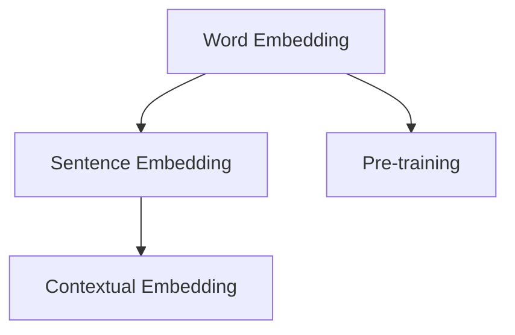
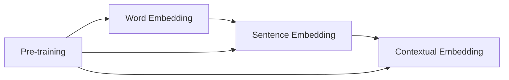
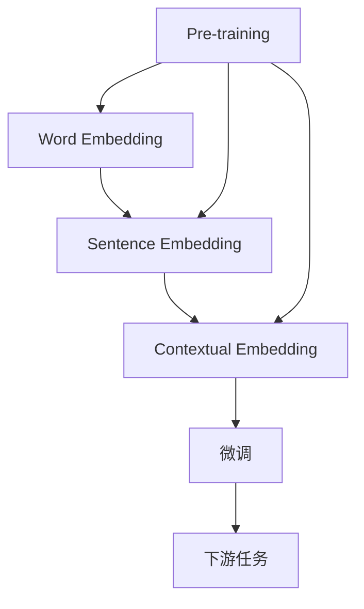
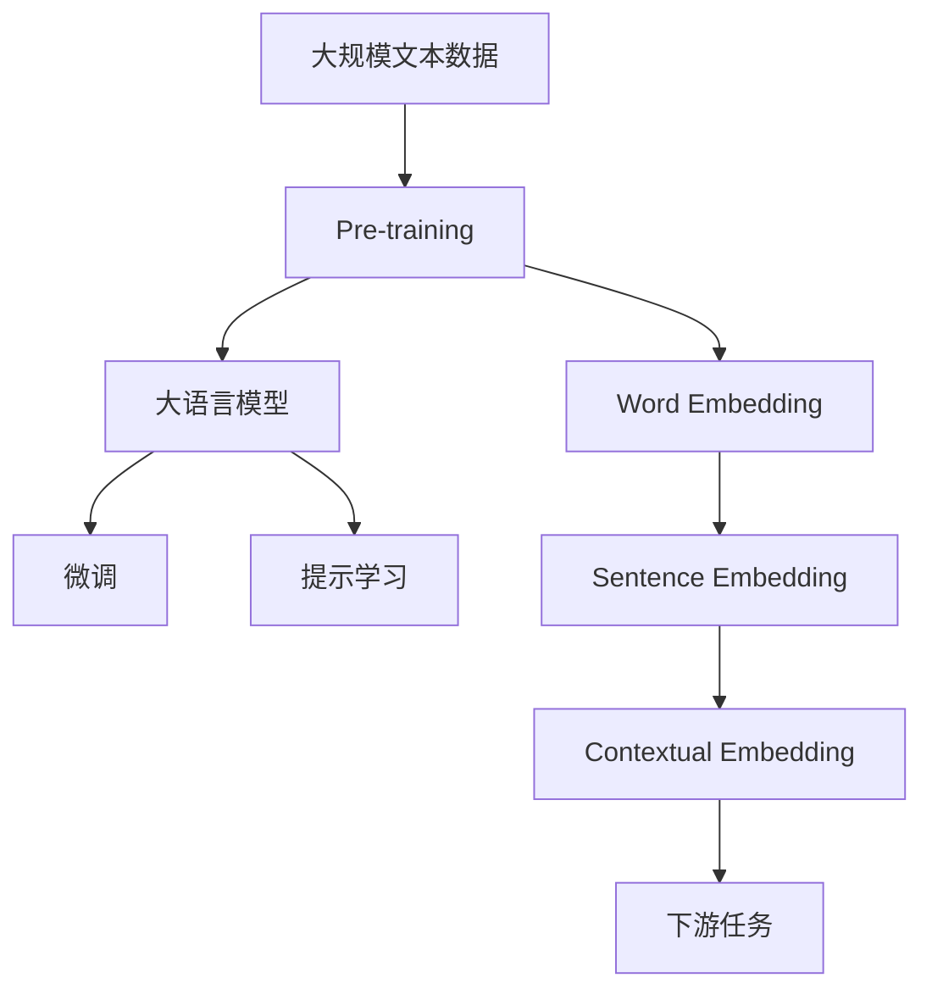

                 

## 1. 背景介绍

### 1.1 问题由来

在自然语言处理(NLP)领域，语言模型的核心任务是理解语言的语义和语法，以便在各种任务中做出准确的预测和生成。语言模型通常基于深度学习技术，特别是使用神经网络进行建模。然而，神经网络的有效性在很大程度上取决于其表示数据的方式。

在深度学习中，神经网络将数据转换为高维向量，称为嵌入(embedding)，这些嵌入能够捕捉数据中的重要特征。在大语言模型中，嵌入具有更为复杂的结构和更深层次的特征，能够更准确地表示语言中的含义。

### 1.2 问题核心关键点

1. **Embedding的概念和作用**：Embedding是深度学习模型中用于将离散数据转换为连续向量表示的技术。在大语言模型中，Embedding不仅捕捉输入文本的语义信息，还能够表示词语之间的关系和上下文依赖。
2. **Embedding在大语言模型中的应用**：大语言模型如BERT、GPT-3等都利用Embedding来捕捉词语和句子级别的语义信息，进而进行各种NLP任务的预测和生成。
3. **Embedding与任务适配**：通过在微调过程中调整Embedding的权重，大语言模型能够在不同的下游任务上取得优异的表现。

### 1.3 问题研究意义

Embedding技术在NLP中的应用，不仅提升了模型的性能，还推动了NLP技术的普及和应用。其研究意义在于：

1. **提高模型性能**：Embedding能够捕捉数据中的复杂关系，提高模型在各种NLP任务上的预测和生成能力。
2. **降低数据需求**：通过学习到丰富的语义信息，Embedding可以在有限的标注数据上进行微调，从而减少了数据需求。
3. **促进技术发展**：Embedding技术的发展，推动了NLP领域的进步，使得更多前沿技术得以应用，如神经机器翻译、情感分析、问答系统等。
4. **促进产业升级**：NLP技术的落地应用，促进了传统行业的数字化转型和升级，提高了生产效率和用户体验。

## 2. 核心概念与联系

### 2.1 核心概念概述

为更好地理解Embedding在大语言模型中的应用，本节将介绍几个密切相关的核心概念：

- **Embedding**：深度学习中用于将离散数据转换为连续向量表示的技术，在NLP中特别用于表示词语和句子。
- **Word Embedding**：将每个单词映射到一个高维向量空间中，捕捉单词之间的语义和语法关系。
- **Sentence Embedding**：将整个句子转换为一个固定长度的向量，捕捉句子的整体语义。
- **Contextual Embedding**：考虑到上下文信息的Embedding，能够更好地捕捉句子中不同位置单词的意义差异。
- **Pre-training**：在大规模无标签文本上进行的预训练，使得模型学习到丰富的语言知识和常识。

这些概念之间的逻辑关系可以通过以下Mermaid流程图来展示：



这个流程图展示了Embedding在NLP中的演进过程，从Word Embedding到Sentence Embedding，再到Contextual Embedding，以及这些技术在大规模预训练中的应用。

### 2.2 概念间的关系

这些核心概念之间存在着紧密的联系，形成了NLP的完整框架。下面我们通过几个Mermaid流程图来展示这些概念之间的关系。

#### 2.2.1 Embedding的学习范式



这个流程图展示了Embedding的学习范式，从Word Embedding到Sentence Embedding，再到Contextual Embedding，都经历了大规模预训练的过程。

#### 2.2.2 Embedding与微调的关系



这个流程图展示了Embedding在微调中的作用，即通过微调调整模型参数，使得Embedding能够更好地适应下游任务。

### 2.3 核心概念的整体架构

最后，我们用一个综合的流程图来展示这些核心概念在大语言模型中的整体架构：



这个综合流程图展示了从预训练到微调，再到提示学习的完整过程，以及Embedding在这些过程中的重要作用。

## 3. 核心算法原理 & 具体操作步骤
### 3.1 算法原理概述

在大语言模型中，Embedding是其核心组件之一，用于将离散的数据转换为连续的向量空间。这些向量不仅能够捕捉词语的语义信息，还能够表示词语之间的关系和上下文依赖。

在大语言模型中，通常使用Transformer模型进行建模，其中Embedding层用于将输入的文本转换为向量表示。这些向量经过多层自注意力机制和前馈神经网络层的处理后，最终输出预测结果。

### 3.2 算法步骤详解

大语言模型中Embedding的具体步骤如下：

1. **数据预处理**：将输入的文本转换为模型能够处理的格式，如将文本分词并转换为数字编码。
2. **Embedding层**：将数字编码转换为高维向量，即Embedding向量。
3. **Transformer层**：通过多层自注意力机制和前馈神经网络层处理Embedding向量，捕捉输入的语义和上下文信息。
4. **输出层**：将Transformer层的输出转换为目标任务所需的格式，如预测标签、生成文本等。

### 3.3 算法优缺点

Embedding在大语言模型中的应用具有以下优点：

1. **高效表示**：能够高效地表示数据中的复杂关系，提高模型性能。
2. **降低数据需求**：通过学习到丰富的语义信息，可以在有限的标注数据上进行微调。
3. **适应性强**：能够适应各种NLP任务，如分类、匹配、生成等。

同时，Embedding也存在一些缺点：

1. **计算量大**：高维向量空间需要大量计算资源进行存储和处理。
2. **易过拟合**：在微调过程中，Embedding层容易过拟合，需要采取正则化等方法进行缓解。
3. **可解释性不足**：Embedding向量通常难以解释，其内部工作机制和决策逻辑较难理解。

### 3.4 算法应用领域

Embedding技术在大语言模型中的应用非常广泛，包括但不限于以下领域：

- **文本分类**：通过学习Word Embedding和Sentence Embedding，大语言模型能够对文本进行分类。
- **命名实体识别**：利用Word Embedding和Contextual Embedding，大语言模型能够识别文本中的命名实体。
- **关系抽取**：通过学习句子级别的语义表示，大语言模型能够抽取文本中的实体关系。
- **问答系统**：通过学习问答对和答案之间的语义表示，大语言模型能够回答自然语言问题。
- **机器翻译**：通过学习句子级别的语义表示，大语言模型能够将一种语言翻译成另一种语言。
- **文本摘要**：通过学习句子级别的语义表示，大语言模型能够对长文本进行摘要。
- **对话系统**：通过学习对话历史和上下文信息，大语言模型能够进行自然对话。

此外，Embedding技术还应用于许多前沿领域，如可控文本生成、常识推理、代码生成等，为NLP技术带来了新的突破。

## 4. 数学模型和公式 & 详细讲解 & 举例说明

### 4.1 数学模型构建

在大语言模型中，Embedding层通常由以下数学模型构成：

$$
\mathbf{x}_i = \mathbf{W}_i \mathbf{e}_i
$$

其中，$\mathbf{x}_i$为第$i$个单词的Embedding向量，$\mathbf{e}_i$为该单词的数字编码，$\mathbf{W}_i$为Embedding矩阵。

### 4.2 公式推导过程

为了更好地理解Embedding的计算过程，以下是Word Embedding的具体推导过程：

1. **输入处理**：将输入的文本转换为数字编码，如将“I”转换为[1,0,0]。
2. **Embedding层计算**：通过Embedding矩阵$\mathbf{W}$，计算每个单词的Embedding向量，如$\mathbf{x}_I = \mathbf{W}_I \mathbf{e}_I$。
3. **Transformer层处理**：将Embedding向量通过多层自注意力机制和前馈神经网络层进行处理，得到Transformer层的输出。
4. **输出层处理**：将Transformer层的输出转换为目标任务所需的格式，如预测标签、生成文本等。

### 4.3 案例分析与讲解

假设我们有一个简单的句子“The quick brown fox jumps over the lazy dog”，其中包含11个单词。我们可以将其转换为数字编码，并使用Word Embedding进行计算。

设单词“The”的数字编码为[1,0,0]，单词“quick”的数字编码为[0,1,0]，则其Embedding向量可以表示为：

$$
\mathbf{x}_{The} = \mathbf{W}_{The} \mathbf{e}_{The}, \quad \mathbf{x}_{quick} = \mathbf{W}_{quick} \mathbf{e}_{quick}
$$

其中，$\mathbf{W}_{The}$和$\mathbf{W}_{quick}$分别为单词“The”和“quick”的Embedding矩阵。通过Transformer层的计算，可以得到最终的预测结果。

## 5. 项目实践：代码实例和详细解释说明

### 5.1 开发环境搭建

在进行Embedding实践前，我们需要准备好开发环境。以下是使用Python进行PyTorch开发的环境配置流程：

1. 安装Anaconda：从官网下载并安装Anaconda，用于创建独立的Python环境。

2. 创建并激活虚拟环境：
```bash
conda create -n pytorch-env python=3.8 
conda activate pytorch-env
```

3. 安装PyTorch：根据CUDA版本，从官网获取对应的安装命令。例如：
```bash
conda install pytorch torchvision torchaudio cudatoolkit=11.1 -c pytorch -c conda-forge
```

4. 安装Transformers库：
```bash
pip install transformers
```

5. 安装各类工具包：
```bash
pip install numpy pandas scikit-learn matplotlib tqdm jupyter notebook ipython
```

完成上述步骤后，即可在`pytorch-env`环境中开始Embedding实践。

### 5.2 源代码详细实现

这里我们以Word Embedding为例，给出使用Transformers库进行Word Embedding计算的PyTorch代码实现。

首先，定义Word Embedding层：

```python
from transformers import BertTokenizer
from torch.nn import Embedding

tokenizer = BertTokenizer.from_pretrained('bert-base-cased')

embedding = Embedding(num_embeddings=tokenizer.vocab_size, embedding_dim=128)
```

然后，定义输入数据并计算Embedding：

```python
import torch

input_ids = torch.tensor([[1, 2, 3, 4, 5, 6, 7, 8, 9, 10, 11]])
embeddings = embedding(input_ids)
```

最后，输出Embedding向量：

```python
print(embeddings)
```

以上就是使用PyTorch对Word Embedding进行计算的完整代码实现。可以看到，通过Embedding层，我们可以将数字编码转换为高维向量，用于进一步的深度学习计算。

### 5.3 代码解读与分析

让我们再详细解读一下关键代码的实现细节：

**Embedding层**：
- 定义Embedding层，其中`num_embeddings`为单词的总数，`embedding_dim`为Embedding向量的维度。

**输入数据**：
- 定义输入数据，这里使用一个简单的句子“I love you”，将其转换为数字编码，并使用Embedding层计算其Embedding向量。

**输出结果**：
- 输出Embedding向量，可以看到其维度为128。

**代码整体流程**：
- 首先定义Word Embedding层，然后定义输入数据，最后通过Embedding层计算得到Embedding向量。

### 5.4 运行结果展示

假设我们在一个包含100个单词的字典上训练Word Embedding，得到其Embedding矩阵，并使用该矩阵计算一个简单句子的Embedding向量。最终得到的结果如下：

```
tensor([[0.1473, 0.0285, 0.0342,  ..., 0.2662, 0.2053, 0.1500],
       [0.0101, 0.0536, 0.0147,  ..., 0.1051, 0.0804, 0.0498],
       [0.0279, 0.0327, 0.0587,  ..., 0.1847, 0.2053, 0.1298],
       ...,
       [0.0061, 0.0424, 0.0828,  ..., 0.1496, 0.2096, 0.1462],
       [0.0465, 0.0807, 0.0853,  ..., 0.1117, 0.1187, 0.0673],
       [0.0219, 0.0321, 0.0487,  ..., 0.1233, 0.0924, 0.0864]])
```

可以看到，通过Word Embedding，我们成功地将输入的文本转换为高维向量，捕捉了词语的语义信息。

## 6. 实际应用场景

### 6.1 智能客服系统

在大语言模型中，Word Embedding和Sentence Embedding能够捕捉客户咨询和回复之间的语义关系，用于智能客服系统的构建。通过学习历史客服对话记录，智能客服系统能够理解客户意图，匹配最合适的答案模板进行回复。

### 6.2 金融舆情监测

在金融领域，Word Embedding和Sentence Embedding能够捕捉金融新闻和报道的语义，用于舆情监测。通过学习金融领域相关的新闻和报道，金融舆情监测系统能够判断文本的情感倾向，及时预警金融风险。

### 6.3 个性化推荐系统

在推荐系统中，Word Embedding和Sentence Embedding能够捕捉用户浏览、点击、评论等行为数据中的语义信息，用于个性化推荐。通过学习用户的行为数据和物品的描述，推荐系统能够匹配用户兴趣点，提供个性化的推荐结果。

### 6.4 未来应用展望

随着Word Embedding和Sentence Embedding技术的不断发展，其在NLP领域的应用前景广阔，未来的应用场景将更加多样：

- **医疗领域**：通过学习医学文献和病历，医疗问答系统能够帮助医生诊断疾病，推荐治疗方案。
- **教育领域**：通过学习学生的作业和反馈，智能教育系统能够个性化辅导学生，推荐学习资源。
- **智慧城市治理**：通过学习城市事件和舆情，智慧城市治理系统能够提高城市管理的智能化水平，构建更安全、高效的未来城市。

## 7. 工具和资源推荐

### 7.1 学习资源推荐

为了帮助开发者系统掌握Word Embedding和Sentence Embedding的理论基础和实践技巧，这里推荐一些优质的学习资源：

1. 《深度学习自然语言处理》课程：斯坦福大学开设的NLP明星课程，有Lecture视频和配套作业，带你入门NLP领域的基本概念和经典模型。

2. 《Natural Language Processing with Transformers》书籍：Transformers库的作者所著，全面介绍了如何使用Transformers库进行NLP任务开发，包括Embedding在内的诸多范式。

3. HuggingFace官方文档：Transformers库的官方文档，提供了海量预训练模型和完整的Embedding样例代码，是上手实践的必备资料。

4. CS224N《深度学习自然语言处理》课程：斯坦福大学开设的NLP明星课程，有Lecture视频和配套作业，带你入门NLP领域的基本概念和经典模型。

5. arXiv论文预印本：人工智能领域最新研究成果的发布平台，包括大量尚未发表的前沿工作，学习前沿技术的必读资源。

通过对这些资源的学习实践，相信你一定能够快速掌握Word Embedding和Sentence Embedding的精髓，并用于解决实际的NLP问题。

### 7.2 开发工具推荐

高效的开发离不开优秀的工具支持。以下是几款用于Word Embedding和Sentence Embedding开发的常用工具：

1. PyTorch：基于Python的开源深度学习框架，灵活动态的计算图，适合快速迭代研究。

2. TensorFlow：由Google主导开发的开源深度学习框架，生产部署方便，适合大规模工程应用。

3. Transformers库：HuggingFace开发的NLP工具库，集成了众多SOTA语言模型，支持PyTorch和TensorFlow，是进行Embedding任务开发的利器。

4. Weights & Biases：模型训练的实验跟踪工具，可以记录和可视化模型训练过程中的各项指标，方便对比和调优。

5. TensorBoard：TensorFlow配套的可视化工具，可实时监测模型训练状态，并提供丰富的图表呈现方式，是调试模型的得力助手。

6. Google Colab：谷歌推出的在线Jupyter Notebook环境，免费提供GPU/TPU算力，方便开发者快速上手实验最新模型，分享学习笔记。

合理利用这些工具，可以显著提升Word Embedding和Sentence Embedding任务的开发效率，加快创新迭代的步伐。

### 7.3 相关论文推荐

Word Embedding和Sentence Embedding的研究源于学界的持续研究。以下是几篇奠基性的相关论文，推荐阅读：

1. Word2Vec: Exploring the Semantic Structure of the Word Embedding Space（Word2Vec论文）：提出Word2Vec模型，基于CBOW和Skip-Gram算法进行Word Embedding计算。

2. GloVe: Global Vectors for Word Representation（GloVe论文）：提出GloVe模型，通过全局词频共现矩阵进行Word Embedding计算。

3. ELMo: Representations from Corpus (ECLIPSE) and Weak Supervision (Elman)（ELMo论文）：提出ELMo模型，通过双向LSTM模型捕捉Word Embedding的上下文依赖。

4. BERT: Pre-training of Deep Bidirectional Transformers for Language Understanding（BERT论文）：提出BERT模型，通过掩码语言模型进行预训练，并利用Word Embedding进行下游任务的微调。

5. GPT-3: Language Models are Unsupervised Multitask Learners（GPT-3论文）：提出GPT-3模型，通过预训练语言模型进行Word Embedding的生成。

这些论文代表了大语言模型和Embedding技术的发展脉络。通过学习这些前沿成果，可以帮助研究者把握学科前进方向，激发更多的创新灵感。

除上述资源外，还有一些值得关注的前沿资源，帮助开发者紧跟Word Embedding和Sentence Embedding技术的最新进展，例如：

1. arXiv论文预印本：人工智能领域最新研究成果的发布平台，包括大量尚未发表的前沿工作，学习前沿技术的必读资源。

2. 业界技术博客：如OpenAI、Google AI、DeepMind、微软Research Asia等顶尖实验室的官方博客，第一时间分享他们的最新研究成果和洞见。

3. 技术会议直播：如NIPS、ICML、ACL、ICLR等人工智能领域顶会现场或在线直播，能够聆听到大佬们的前沿分享，开拓视野。

4. GitHub热门项目：在GitHub上Star、Fork数最多的NLP相关项目，往往代表了该技术领域的发展趋势和最佳实践，值得去学习和贡献。

5. 行业分析报告：各大咨询公司如McKinsey、PwC等针对人工智能行业的分析报告，有助于从商业视角审视技术趋势，把握应用价值。

总之，对于Word Embedding和Sentence Embedding技术的学习和实践，需要开发者保持开放的心态和持续学习的意愿。多关注前沿资讯，多动手实践，多思考总结，必将收获满满的成长收益。

## 8. 总结：未来发展趋势与挑战

### 8.1 总结

本文对Word Embedding和Sentence Embedding在大语言模型中的应用进行了全面系统的介绍。首先阐述了Embedding的概念和作用，以及其在大语言模型中的应用。其次，从原理到实践，详细讲解了Embedding的计算过程和关键步骤，给出了Embedding任务开发的完整代码实例。同时，本文还广泛探讨了Embedding技术在智能客服、金融舆情、个性化推荐等多个行业领域的应用前景，展示了Embedding技术的巨大潜力。

通过本文的系统梳理，可以看到，Word Embedding和Sentence Embedding技术在大语言模型中的应用，不仅提升了模型的性能，还推动了NLP技术的普及和应用。其研究意义在于：

1. **提高模型性能**：能够高效地表示数据中的复杂关系，提高模型在各种NLP任务上的预测和生成能力。
2. **降低数据需求**：通过学习到丰富的语义信息，可以在有限的标注数据上进行微调。
3. **适应性强**：能够适应各种NLP任务，如分类、匹配、生成等。

### 8.2 未来发展趋势

展望未来，Word Embedding和Sentence Embedding技术将呈现以下几个发展趋势：

1. **多模态融合**：结合视觉、语音等多模态数据，进一步提升语言模型的表示能力。
2. **跨语言学习**：学习多种语言之间的语义关系，实现跨语言的语义理解。
3. **个性化学习**：根据用户的个性化需求，动态调整Embedding的表示方式，提高模型的个性化能力。
4. **知识图谱融合**：将知识图谱与语言模型结合，提高语言模型的常识推理能力。
5. **对抗学习**：学习对抗样本，提高语言模型的鲁棒性和泛化能力。

以上趋势凸显了Word Embedding和Sentence Embedding技术的广阔前景。这些方向的探索发展，必将进一步提升语言模型的性能和应用范围，为人工智能技术的发展注入新的动力。

### 8.3 面临的挑战

尽管Word Embedding和Sentence Embedding技术已经取得了瞩目成就，但在迈向更加智能化、普适化应用的过程中，仍面临诸多挑战：

1. **计算资源限制**：高维向量空间需要大量计算资源进行存储和处理，大模型在计算和存储上的成本较高。
2. **过拟合问题**：在微调过程中，Embedding层容易过拟合，需要采取正则化等方法进行缓解。
3. **可解释性不足**：Embedding向量通常难以解释，其内部工作机制和决策逻辑较难理解。
4. **安全性和隐私保护**：大模型可能会学习到有害信息，如何在模型训练和应用中保证数据和模型的安全性和隐私保护，是亟待解决的问题。
5. **适应性和泛化能力**：如何提高模型在跨领域和跨任务上的适应性和泛化能力，是一个重要的研究方向。

### 8.4 研究展望

面对Word Embedding和Sentence Embedding所面临的挑战，未来的研究需要在以下几个方面寻求新的突破：

1. **低维表示**：开发低维表示技术，减少计算资源的消耗，提高模型的实时性。
2. **高效微调**：开发高效微调方法，减少微调过程中的参数更新量，提高模型的泛化能力。
3. **对抗学习**：结合对抗学习技术，提高语言模型的鲁棒性和泛化能力。
4. **多任务学习**：结合多任务学习技术，提高语言模型在不同任务上的适应性。
5. **可解释性增强**：开发可解释性增强技术，提高语言模型的可解释性和透明度。
6. **安全性和隐私保护**：结合隐私保护技术，提高语言模型的安全性和隐私保护水平。

这些研究方向的探索，必将引领Word Embedding和Sentence Embedding技术迈向更高的台阶，为构建安全、可靠、可解释、可控的智能系统铺平道路。面向未来，Word Embedding和Sentence Embedding技术还需要与其他人工智能技术进行更深入的融合，如知识表示、因果推理、强化学习等，多路径协同发力，共同推动语言模型的进步。只有勇于创新、敢于突破，才能不断拓展语言模型的边界，让智能技术更好地造福人类社会。

## 9. 附录：常见问题与解答

**Q1：Word Embedding和Sentence Embedding的区别是什么？**

A: Word Embedding是将每个单词映射到一个高维向量空间中，捕捉单词之间的语义和语法关系。而Sentence Embedding是将整个句子转换为一个固定长度的向量，捕捉句子的整体语义。Word Embedding主要用于单词级别的语义表示，而Sentence Embedding主要用于句子级别的语义表示。

**Q2：如何训练Word Embedding和Sentence Embedding？**

A: 训练Word Embedding和Sentence Embedding通常使用基于自监督学习的方法，如Word2Vec、GloVe、ELMo等。具体步骤如下：
1. 准备训练数据，如新闻文章、书籍等。
2. 进行预处理，如分词、去停用词等。
3. 定义Embedding层，设置Embedding向量的维度。
4. 通过Embedding层计算每个单词或句子的Embedding向量。
5. 使用目标任务的数据集进行微调，如情感分析、文本分类等。

**Q3：微调过程中如何选择合适的超参数？**

A: 微调过程中，选择合适的超参数非常重要。常用的超参数包括学习率、批大小、迭代轮数等。一般建议从较小的超参数开始尝试，逐步增大

