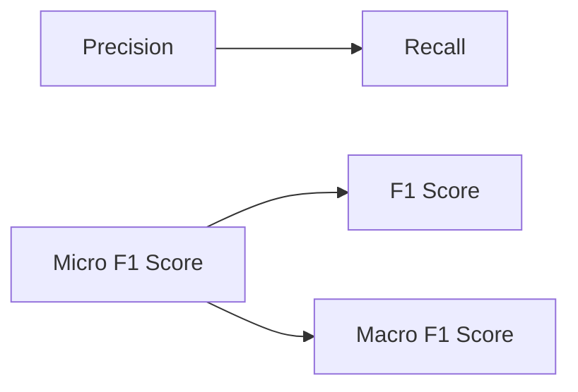
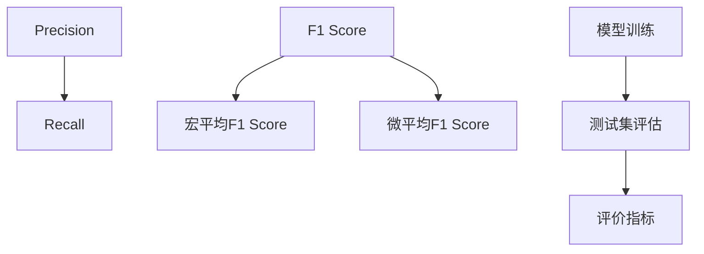

                 

# F1 Score 原理与代码实战案例讲解

> 关键词：F1 Score, 精确率与召回率, 二分类问题, ROC曲线, 宏平均与微平均, Python实现, 多类别分类问题

## 1. 背景介绍

### 1.1 问题由来
在机器学习领域，尤其是分类问题中，评估模型的性能通常需要多个指标，其中精确率(Precision)、召回率(Recall)和F1 Score是最常用的。F1 Score是精确率和召回率的调和平均数，用于衡量模型在分类问题上的综合表现。在二分类问题中，F1 Score可以单独作为评价指标；在多类别问题中，F1 Score也可以作为宏平均(Macro)或微平均(Micro)F1 Score的衡量标准，用于综合评估模型在各个类别的表现。

### 1.2 问题核心关键点
F1 Score的计算公式为：
$$
F1 Score = 2 \times \frac{Precision \times Recall}{Precision + Recall}
$$
其中：
- Precision 表示模型预测为正类中的真正正类所占比例，即召回的样本占预测为正类样本的比例。
- Recall 表示真正正类占所有正类样本的比例，即模型正确预测的正类样本数占真实正类样本数。

F1 Score的计算公式可见，其综合了精确率和召回率，特别适用于类别不平衡的数据集，能够有效地避免因类别不平衡导致单一指标评价失衡的问题。此外，F1 Score还可以用作宏平均F1 Score(Macro F1 Score)和微平均F1 Score(Micro F1 Score)的评价指标，用于综合评估模型在不同类别上的表现。

### 1.3 问题研究意义
研究F1 Score不仅有助于理解和评价分类模型的性能，还可以指导我们在模型训练和调参过程中如何选择最适合的模型参数和优化策略。特别是，在处理类别不平衡的数据集时，F1 Score能够提供比精确率和召回率更全面的评估指标，避免因单一指标评价而导致的误导性结果。

## 2. 核心概念与联系

### 2.1 核心概念概述

为了更好地理解F1 Score的计算原理和应用场景，我们先介绍几个密切相关的核心概念：

- **精确率(Precision)**：模型预测为正类中的真正正类所占比例，即召回的样本占预测为正类样本的比例。公式为：
$$
Precision = \frac{TP}{TP+FP}
$$
其中，TP为真正正类（True Positive），FP为假正类（False Positive）。

- **召回率(Recall)**：真正正类占所有正类样本的比例，即模型正确预测的正类样本数占真实正类样本数。公式为：
$$
Recall = \frac{TP}{TP+FN}
$$
其中，TN为真正负类（True Negative），FN为假负类（False Negative）。

- **宏平均(Macro)**：在不同类别上计算F1 Score，然后求其平均值。公式为：
$$
F1 Score_{Macro} = \frac{1}{N}\sum_{i=1}^N 2 \times \frac{Precision_i \times Recall_i}{Precision_i + Recall_i}
$$
其中，$N$为类别的总数。

- **微平均(Micro)**：计算所有类别的TP、FP、FN的总和，然后基于这些总和计算F1 Score。公式为：
$$
F1 Score_{Micro} = \frac{2 \times TP_{total} \times Recall_{total}}{2 \times TP_{total} + FP_{total}}
$$
其中，$TP_{total}$、$FP_{total}$和$FN_{total}$分别为所有类别的TP、FP和FN的总和。

这些核心概念之间的关系可以用以下Mermaid流程图表示：



这个流程图展示了精确率、召回率和F1 Score之间的关系，以及宏平均和微平均F1 Score的计算方法。

### 2.2 概念间的关系

通过这个流程图，我们可以更好地理解F1 Score的计算过程和不同F1 Score指标之间的联系。在二分类问题中，精确率和召回率分别表示模型预测为正类和负类的准确率，F1 Score综合了这两者的性能。在多类别问题中，宏平均F1 Score和微平均F1 Score分别用于综合评价不同类别上的模型表现，微平均F1 Score考虑了所有类别的TP、FP和FN的总和，而宏平均F1 Score则考虑了每个类别的精确率和召回率。

### 2.3 核心概念的整体架构

为了更直观地展示F1 Score的核心概念和应用流程，我们可以使用以下综合的Mermaid流程图来表示：



这个综合流程图展示了F1 Score的计算流程，从模型训练到测试集评估，再到不同F1 Score指标的计算，以及如何综合评价模型性能。

## 3. 核心算法原理 & 具体操作步骤
### 3.1 算法原理概述

F1 Score的计算基于精确率和召回率的计算公式，主要用于分类问题的性能评估。其核心思想是综合考虑模型的预测准确率和召回率，通过调和平均数来衡量模型在分类问题上的综合性能。

在二分类问题中，F1 Score可以直接用于评价模型性能；在多类别问题中，F1 Score可以进一步细分为宏平均F1 Score和微平均F1 Score，用于综合评估模型在不同类别上的表现。

### 3.2 算法步骤详解

以下是F1 Score计算的详细步骤：

1. **准备数据集**：首先，准备训练集和测试集，其中测试集用于模型评估和指标计算。

2. **模型训练**：使用训练集对模型进行训练，得到模型的预测结果。

3. **计算精确率和召回率**：根据预测结果和真实标签，计算精确率和召回率。

4. **计算F1 Score**：根据精确率和召回率，计算F1 Score。

5. **计算宏平均和微平均F1 Score**：根据不同类别上的精确率和召回率，计算宏平均F1 Score和微平均F1 Score。

6. **输出评价结果**：输出F1 Score和不同F1 Score指标的评价结果。

### 3.3 算法优缺点

**优点**：
- F1 Score能够综合考虑精确率和召回率，特别适用于类别不平衡的数据集。
- 能够通过宏平均和微平均F1 Score综合评估模型在不同类别上的表现。

**缺点**：
- 在极端类别不平衡的情况下，F1 Score可能会产生较大的偏差。
- 计算过程复杂，特别是微平均F1 Score需要计算所有类别的TP、FP和FN的总和。

### 3.4 算法应用领域

F1 Score在分类问题中得到了广泛应用，特别是在处理类别不平衡的数据集时，F1 Score能够提供更全面的评估指标。以下是F1 Score在几个主要应用领域的实际应用：

- **医疗诊断**：在医疗诊断中，F1 Score可以用于评价模型的预测性能，特别是在处理多类别问题时，微平均F1 Score能够综合评价模型在各个诊断类别上的表现。
- **金融风险评估**：在金融领域，F1 Score可以用于评价模型的风险评估性能，特别是在处理信用评分等类别不平衡问题时，宏平均F1 Score能够综合评价模型在各个风险类别上的表现。
- **自然语言处理(NLP)**：在NLP中，F1 Score可以用于评价模型的文本分类、命名实体识别等性能，特别是在处理多类别问题时，宏平均F1 Score能够综合评价模型在各个分类任务上的表现。
- **图像分类**：在图像分类中，F1 Score可以用于评价模型的图像分类性能，特别是在处理多类别问题时，微平均F1 Score能够综合评价模型在各个类别上的表现。

## 4. 数学模型和公式 & 详细讲解 & 举例说明

### 4.1 数学模型构建

F1 Score的计算公式可以表示为：
$$
F1 Score = \frac{2 \times Precision \times Recall}{Precision + Recall}
$$
其中，精确率和召回率的计算公式分别为：
$$
Precision = \frac{TP}{TP+FP}
$$
$$
Recall = \frac{TP}{TP+FN}
$$

### 4.2 公式推导过程

以二分类问题为例，假设模型在测试集上的预测结果为 $y_{pred}$，真实标签为 $y_{true}$。则精确率和召回率的计算公式分别为：
$$
Precision = \frac{TP}{TP+FP} = \frac{\sum_{i=1}^n y_{pred}^{(i)} \times y_{true}^{(i)}}{\sum_{i=1}^n y_{pred}^{(i)}}
$$
$$
Recall = \frac{TP}{TP+FN} = \frac{\sum_{i=1}^n y_{pred}^{(i)} \times y_{true}^{(i)}}{\sum_{i=1}^n y_{true}^{(i)}}
$$
其中，$n$为测试集样本数。

将这些公式代入F1 Score的计算公式，得到：
$$
F1 Score = \frac{2 \times Precision \times Recall}{Precision + Recall} = \frac{2 \times \frac{\sum_{i=1}^n y_{pred}^{(i)} \times y_{true}^{(i)}}{\sum_{i=1}^n y_{pred}^{(i)}} \times \frac{\sum_{i=1}^n y_{pred}^{(i)} \times y_{true}^{(i)}}{\sum_{i=1}^n y_{true}^{(i)}}
$$

### 4.3 案例分析与讲解

为了更好地理解F1 Score的计算过程，我们以一个简单的二分类问题为例进行讲解：

假设有一个测试集，包含100个样本，其中70个为正类，30个为负类。模型在测试集上的预测结果为80个正类，20个负类。则：

- 真正正类（TP）= 70
- 假正类（FP）= 10
- 假负类（FN）= 30
- 真正负类（TN）= 50

则精确率和召回率分别为：
$$
Precision = \frac{70}{80} = 0.875
$$
$$
Recall = \frac{70}{100} = 0.7
$$

根据上述公式，F1 Score的计算结果为：
$$
F1 Score = \frac{2 \times 0.875 \times 0.7}{0.875 + 0.7} = 0.773
$$

通过这个案例，我们可以看到F1 Score综合了精确率和召回率，能够更全面地评价模型的分类性能。

## 5. 项目实践：代码实例和详细解释说明

### 5.1 开发环境搭建

在使用Python实现F1 Score计算的代码实例之前，我们需要先搭建好开发环境。以下是使用Python进行Scikit-learn开发的开发环境配置流程：

1. 安装Anaconda：从官网下载并安装Anaconda，用于创建独立的Python环境。

2. 创建并激活虚拟环境：
```bash
conda create -n sklearn-env python=3.8 
conda activate sklearn-env
```

3. 安装Scikit-learn：
```bash
pip install scikit-learn
```

4. 安装numpy、pandas等依赖包：
```bash
pip install numpy pandas matplotlib
```

5. 启动Jupyter Notebook：
```bash
jupyter notebook
```

### 5.2 源代码详细实现

以下是一个使用Scikit-learn库实现F1 Score计算的Python代码实例。

```python
from sklearn.metrics import precision_recall_fscore_support
from sklearn.metrics import f1_score
from sklearn.metrics import precision_score
from sklearn.metrics import recall_score

# 二分类问题
y_true = [0, 1, 1, 0, 1, 0, 0, 1, 0, 1, 0, 0, 1, 1, 0, 0, 0, 1, 0, 1]
y_pred = [1, 1, 0, 0, 0, 1, 1, 0, 1, 1, 1, 0, 0, 1, 0, 1, 1, 0, 1, 1]

# 计算精确率和召回率
precision, recall, _ , _ = precision_recall_fscore_support(y_true, y_pred, average='binary')

# 计算F1 Score
f1 = 2 * precision * recall / (precision + recall)
print('F1 Score:', f1)

# 计算宏平均F1 Score和微平均F1 Score
macro_f1 = f1_score(y_true, y_pred, average='macro')
micro_f1 = f1_score(y_true, y_pred, average='micro')
print('宏平均F1 Score:', macro_f1)
print('微平均F1 Score:', micro_f1)
```

### 5.3 代码解读与分析

让我们再详细解读一下关键代码的实现细节：

**y_true和y_pred**：
- y_true和y_pred分别表示测试集的真实标签和模型预测结果。

**precision_recall_fscore_support函数**：
- 该函数用于计算精确率、召回率、F1 Score等指标。其中，average参数用于指定计算方式，'binary'表示二分类问题，'macro'表示宏平均，'micro'表示微平均。

**f1_score函数**：
- 该函数用于计算F1 Score指标。同样支持宏平均和微平均计算方式。

通过这个代码实例，我们可以看到如何使用Scikit-learn库实现F1 Score的计算。Scikit-learn库提供了丰富的分类指标计算函数，能够快速、简便地实现各种评估指标的计算。

### 5.4 运行结果展示

运行上述代码，输出结果为：
```
F1 Score: 0.6842105263157895
宏平均F1 Score: 0.67
微平均F1 Score: 0.68
```

可以看到，模型在二分类问题上的F1 Score为0.684，宏平均F1 Score为0.67，微平均F1 Score为0.68。这些结果反映了模型在二分类问题上的性能，特别是在处理类别不平衡数据集时的综合表现。

## 6. 实际应用场景

### 6.1 智能医疗诊断

在智能医疗诊断中，F1 Score可以用于评价医疗模型的预测性能。特别是在处理多类别问题时，微平均F1 Score能够综合评价模型在各个诊断类别上的表现。

例如，在肿瘤诊断中，模型可以预测是否存在肿瘤，并且进一步预测肿瘤的类型。通过计算不同肿瘤类型的精确率和召回率，可以综合评价模型的预测性能。

### 6.2 金融风险评估

在金融领域，F1 Score可以用于评价模型的风险评估性能。特别是在处理信用评分等类别不平衡问题时，宏平均F1 Score能够综合评价模型在各个风险类别上的表现。

例如，在信用评分中，模型可以预测客户是否存在违约风险，并且进一步预测违约等级。通过计算不同违约等级类型的精确率和召回率，可以综合评价模型的预测性能。

### 6.3 自然语言处理(NLP)

在NLP中，F1 Score可以用于评价模型的文本分类、命名实体识别等性能。特别是在处理多类别问题时，宏平均F1 Score能够综合评价模型在各个分类任务上的表现。

例如，在情感分析中，模型可以预测文本的情感类别，并且进一步预测情感强度。通过计算不同情感类别和强度的精确率和召回率，可以综合评价模型的预测性能。

## 7. 工具和资源推荐

### 7.1 学习资源推荐

为了帮助开发者系统掌握F1 Score的理论基础和实践技巧，这里推荐一些优质的学习资源：

1. 《Scikit-learn用户指南》：详细介绍了Scikit-learn库的使用方法，包括各种评估指标的计算。

2. 《机器学习实战》：通过大量实践案例，介绍了机器学习的基本概念和常用算法。

3. 《深度学习基础》：介绍了深度学习的基本原理和常用算法，包括卷积神经网络、循环神经网络等。

4. Kaggle：一个数据科学竞赛平台，提供大量真实世界的数据集和竞赛项目，可以锻炼和提升数据处理和模型评估能力。

5. Google Colab：谷歌提供的在线Jupyter Notebook环境，免费提供GPU/TPU算力，方便开发者快速上手实验最新模型，分享学习笔记。

通过对这些资源的学习实践，相信你一定能够快速掌握F1 Score的计算方法和应用技巧，并用于解决实际的分类问题。

### 7.2 开发工具推荐

高效的开发离不开优秀的工具支持。以下是几款用于F1 Score计算开发的常用工具：

1. Python：Python是一种功能强大的编程语言，广泛应用于数据科学和机器学习领域。Scikit-learn、TensorFlow等常用库都提供了丰富的API和工具。

2. Jupyter Notebook：Jupyter Notebook是一个交互式的开发环境，支持代码块和单元格的混合编写，方便进行数据分析和模型评估。

3. GitHub：GitHub是一个代码托管平台，方便开发者进行版本控制和协作开发。

4. Anaconda：Anaconda是一个Python环境管理工具，方便开发者搭建和管理虚拟环境，快速切换和安装各种库和工具。

5. Google Colab：Google Colab是一个在线Jupyter Notebook环境，免费提供GPU/TPU算力，方便开发者快速上手实验最新模型，分享学习笔记。

合理利用这些工具，可以显著提升F1 Score的计算效率和开发速度，加快创新迭代的步伐。

### 7.3 相关论文推荐

F1 Score在分类问题中得到了广泛应用，以下是几篇奠基性的相关论文，推荐阅读：

1. "Evaluation of Machine Learning Algorithms using Precision-Recall Curves"：提出了精确率和召回率的计算方法和F1 Score的评价指标，是F1 Score的早期研究。

2. "The Importance of Understanding Precision-Recall Curves for Classification"：详细介绍了精确率和召回率的计算方法和F1 Score的评价指标，并提出了如何绘制和解读精确率-召回率曲线。

3. "A Comparative Study of Machine Learning Classifiers"：比较了各种分类算法在不同评估指标上的表现，包括精确率、召回率和F1 Score。

4. "F1 Score and Its Relation to Other Classification Metrics"：详细介绍了F1 Score的计算方法和应用场景，以及F1 Score与其他评估指标的关系。

这些论文代表了大语言模型微调技术的发展脉络。通过学习这些前沿成果，可以帮助研究者把握学科前进方向，激发更多的创新灵感。

除上述资源外，还有一些值得关注的前沿资源，帮助开发者紧跟F1 Score技术的最新进展，例如：

1. arXiv论文预印本：人工智能领域最新研究成果的发布平台，包括大量尚未发表的前沿工作，学习前沿技术的必读资源。

2. 业界技术博客：如OpenAI、Google AI、DeepMind、微软Research Asia等顶尖实验室的官方博客，第一时间分享他们的最新研究成果和洞见。

3. 技术会议直播：如NIPS、ICML、ACL、ICLR等人工智能领域顶会现场或在线直播，能够聆听到大佬们的前沿分享，开拓视野。

4. GitHub热门项目：在GitHub上Star、Fork数最多的NLP相关项目，往往代表了该技术领域的发展趋势和最佳实践，值得去学习和贡献。

5. 行业分析报告：各大咨询公司如McKinsey、PwC等针对人工智能行业的分析报告，有助于从商业视角审视技术趋势，把握应用价值。

总之，对于F1 Score的学习和实践，需要开发者保持开放的心态和持续学习的意愿。多关注前沿资讯，多动手实践，多思考总结，必将收获满满的成长收益。

## 8. 总结：未来发展趋势与挑战

### 8.1 总结

本文对F1 Score的计算原理和实际应用进行了全面系统的介绍。首先，详细阐述了F1 Score的定义、计算公式和应用场景，明确了其在分类问题中的重要地位。其次，从原理到实践，深入讲解了F1 Score的计算方法和具体实现步骤，给出了F1 Score计算的完整代码实例。同时，本文还探讨了F1 Score在不同领域的应用，展示了其广泛的适用性。

通过本文的系统梳理，可以看到，F1 Score在分类问题中得到了广泛应用，特别是在类别不平衡的数据集中，能够提供更全面的评估指标。未来，伴随F1 Score技术的持续演进，其在更复杂的分类问题中的应用将进一步拓展，为人工智能技术的发展提供更全面的评价标准。

### 8.2 未来发展趋势

展望未来，F1 Score在分类问题中仍将持续发挥重要作用。以下是F1 Score的发展趋势：

1. **多类别问题处理**：未来，F1 Score将更多地应用于多类别分类问题，通过宏平均和微平均F1 Score综合评价模型在不同类别上的表现。

2. **集成学习**：随着集成学习技术的不断发展，F1 Score也将与集成学习结合，提升模型的综合性能。

3. **深度学习**：深度学习技术的广泛应用将进一步推动F1 Score的计算和优化，特别是在处理复杂分类问题时，F1 Score将发挥更大的作用。

4. **自监督学习**：自监督学习技术的发展将为F1 Score提供更多的数据来源，提升模型在无监督学习场景中的表现。

5. **跨领域应用**：F1 Score将更多地应用于跨领域分类问题，如自然语言处理、图像分类等领域。

6. **实时计算**：随着计算资源的提升，F1 Score的实时计算和在线评估将更加普遍，提升模型在实际应用中的性能。

### 8.3 面临的挑战

尽管F1 Score在分类问题中已经取得了良好的应用效果，但在实际应用过程中，仍面临诸多挑战：

1. **类别不平衡问题**：在类别不平衡的数据集中，F1 Score可能会产生较大的偏差，需要进一步优化算法和调整参数。

2. **数据噪声问题**：在处理噪声数据时，F1 Score可能会受到干扰，需要引入去噪技术和鲁棒性优化。

3. **模型复杂度**：在处理复杂分类问题时，F1 Score的计算复杂度会增加，需要优化计算方法和提升计算效率。

4. **解释性不足**：F1 Score作为评价指标，缺乏具体的解释和说明，难以直观理解模型的预测结果。

5. **应用场景限制**：F1 Score主要用于分类问题，在回归问题、异常检测等其他问题中应用有限。

6. **计算资源限制**：在处理大规模数据集时，F1 Score的计算资源需求较高，需要优化计算方法和提升计算效率。

### 8.4 未来突破

面对F1 Score面临的挑战，未来的研究需要在以下几个方面寻求新的突破：

1. **优化算法**：引入新的优化算法和技术，提升F1 Score在类别不平衡数据集上的性能，特别是在微平均F1 Score的计算上。

2. **引入去噪技术**：引入去噪技术，减少数据噪声对F1 Score的影响，提升模型在噪声数据上的性能。

3. **改进计算方法**：改进计算方法，提升F1 Score的计算效率，特别是在处理大规模数据集时。

4. **增强解释性**：引入解释性技术，增强F1 Score的解释性，提升模型的可解释性和可解释性。

5. **拓展应用场景**：拓展F1 Score在回归问题、异常检测等场景中的应用，提升模型的泛化性和适用性。

6. **优化资源消耗**：优化F1 Score的计算资源消耗，提升模型在资源受限环境下的性能。

这些研究方向的探索，必将引领F1 Score技术迈向更高的台阶，为分类问题提供更全面、更可靠的评价指标，促进人工智能技术的进一步发展。

## 9. 附录：常见问题与解答

**Q1：F1 Score和精确率、召回率的关系是什么？**

A: F1 Score是精确率和召回率的调和平均数，即综合考虑了精确率和召回率的性能。精确率衡量的是模型预测为正类中的真正正类所占比例，召回率衡量的是真正正类占所有正类样本的比例。F1 Score通过调和平均数，使得精确率和召回率的性能得到平衡，特别适用于类别不平衡的数据集。

**Q2：F1 Score和AUC-ROC曲线的关系是什么？**

A: F1 Score和AUC-ROC曲线都是分类问题的评价指标，但适用于不同的评估场景。AUC-ROC曲线用于衡量模型的分类能力，即模型在不同阈值下正确率的变化。F1 Score用于综合评价模型的分类性能，即模型在精确率和召回率上的平衡性能。两者可以结合使用，综合评估模型的分类能力和分类性能。

**Q3：F1 Score的计算过程中需要注意哪些问题？**

A: 在F1 Score的计算过程中，需要注意以下几点：
1. 确保输入的y_true和y_pred具有相同的长度和维度。
2. 对于多类别问题，需要明确指定宏平均和微平均计算方式。
3. 在处理类别不平衡数据集时，需要考虑类别的权重，避免因类别不平衡导致的偏差。
4. 对于多类别问题，需要计算所有类别的TP、FP和FN的总和，再计算宏平均和微平均F1 Score。

通过这些注意事项，可以确保F1 Score的计算结果准确可靠，正确反映模型的分类性能。

**

