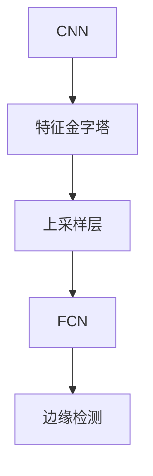
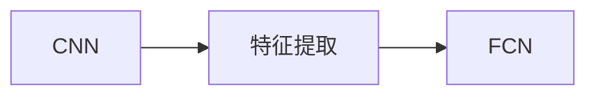
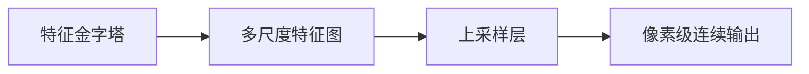
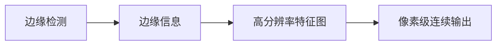
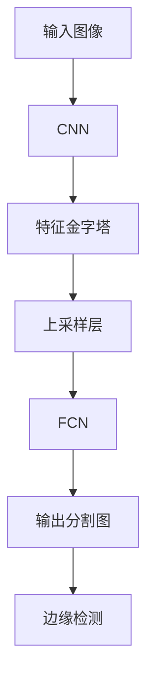

                 

# FCN原理与代码实例讲解

> 关键词：FCN, 卷积神经网络, 特征金字塔, 上采样, 全卷积网络, 边缘检测

## 1. 背景介绍

### 1.1 问题由来
随着计算机视觉(CV)技术的发展，深度学习在图像分割任务上取得了显著进展。传统的像素级分类算法已经难以满足实际应用的需求。而卷积神经网络(CNN)的兴起，特别是全卷积网络(FCN)的出现，极大提升了图像分割的精度和效率。

FCN通过在卷积神经网络中添加上采样层，实现像素级的连续输出。其在医学影像分割、自动驾驶、目标检测等多个领域具有广泛应用。近年来，基于FCN的图像分割技术不断推陈出新，形成了新的研究热点。

### 1.2 问题核心关键点
FCN的核心在于通过卷积网络对图像特征进行提取，利用上采样层进行像素级连续输出。其关键点包括：

- 特征金字塔：FCN通过堆叠多个卷积层，构建多尺度的特征图，捕捉图像中的不同层次细节。
- 上采样层：FCN利用上采样层对特征图进行尺寸放大，实现像素级连续输出。
- 全卷积网络：FCN通过端到端训练，实现像素级预测，无需进行额外的像素分割操作。
- 边缘检测：FCN能够生成精确的边缘信息，适用于高精度的图像分割任务。

### 1.3 问题研究意义
研究FCN原理和代码实例，对于提升计算机视觉技术的分割能力，拓展深度学习模型在图像分割中的应用，具有重要意义：

1. 提升分割精度：FCN能够学习图像中更精细的特征，提高图像分割任务的准确性。
2. 扩展应用场景：FCN适用于多种图像分割任务，包括医学影像、城市规划、自动驾驶等。
3. 提高计算效率：FCN通过端到端训练，减少了分割后后处理的工作量，提高了计算效率。
4. 增强边缘检测：FCN利用卷积网络生成精确的边缘信息，提升了分割结果的精细度。
5. 推动技术发展：FCN为图像分割领域带来了新思路和新方法，推动了深度学习技术的创新。

## 2. 核心概念与联系

### 2.1 核心概念概述

为更好地理解FCN原理和代码实现，本节将介绍几个密切相关的核心概念：

- 卷积神经网络（CNN）：一种基于卷积操作的深度神经网络，广泛应用于图像处理、语音识别等领域。
- 特征金字塔（Feature Pyramid）：通过堆叠卷积层，构建多尺度的特征图，用于捕捉图像中的不同层次细节。
- 上采样层（Upsample Layer）：通过上采样操作将低分辨率特征图放大为高分辨率输出，实现像素级连续输出。
- 全卷积网络（FCN）：通过堆叠卷积层和上采样层，实现端到端的像素级预测。
- 边缘检测（Edge Detection）：利用卷积网络生成边缘信息，提高分割结果的精细度。

这些核心概念之间的逻辑关系可以通过以下Mermaid流程图来展示：



这个流程图展示了一幅FCN图像分割的示意图：首先通过CNN提取特征，然后堆叠多个卷积层构建特征金字塔，接着通过上采样层进行像素级连续输出，最后利用边缘检测提升分割结果的精度。通过理解这些核心概念，我们可以更好地把握FCN的工作原理和优化方向。

### 2.2 概念间的关系

这些核心概念之间存在着紧密的联系，形成了FCN图像分割的整体框架。下面我们通过几个Mermaid流程图来展示这些概念之间的关系。

#### 2.2.1 CNN与FCN的关系



这个流程图展示了CNN与FCN之间的关系。CNN通过卷积操作提取图像特征，而FCN利用CNN的特征提取能力，构建特征金字塔，实现像素级预测。

#### 2.2.2 特征金字塔与上采样层的关系



这个流程图展示了特征金字塔与上采样层之间的关系。特征金字塔通过堆叠卷积层，构建多尺度的特征图，而每个尺度的特征图都会经过上采样层，放大为高分辨率输出。

#### 2.2.3 边缘检测与上采样层的关系



这个流程图展示了边缘检测与上采样层之间的关系。边缘检测利用卷积网络生成精确的边缘信息，而边缘信息又会通过上采样层放大为高分辨率的特征图，从而提升分割结果的精细度。

### 2.3 核心概念的整体架构

最后，我们用一个综合的流程图来展示这些核心概念在大语言模型微调过程中的整体架构：



这个综合流程图展示了从输入图像到输出分割图的完整过程。图像首先通过CNN进行特征提取，然后构建特征金字塔，接着通过上采样层实现像素级连续输出，最终经过边缘检测生成高精度的分割结果。通过这些流程图，我们可以更清晰地理解FCN图像分割过程中各个环节的逻辑关系。

## 3. 核心算法原理 & 具体操作步骤
### 3.1 算法原理概述

FCN是一种基于卷积神经网络的图像分割方法，通过堆叠多个卷积层和上采样层，实现端到端的像素级预测。其主要原理包括：

- 卷积神经网络：通过堆叠卷积层和池化层，提取图像的局部特征。
- 特征金字塔：通过堆叠多个卷积层，构建多尺度的特征图，捕捉图像中的不同层次细节。
- 上采样层：利用上采样操作将低分辨率特征图放大为高分辨率输出，实现像素级连续输出。
- 全卷积网络：通过堆叠卷积层和上采样层，实现端到端的像素级预测。
- 边缘检测：利用卷积网络生成精确的边缘信息，提高分割结果的精细度。

FCN的核心思想是通过卷积神经网络对图像进行特征提取，然后通过上采样层将特征图放大为像素级连续输出，从而实现图像分割。其流程包括：

1. 通过堆叠多个卷积层和池化层，提取图像的局部特征。
2. 通过堆叠多个卷积层构建特征金字塔，捕捉图像中的不同层次细节。
3. 利用上采样层将低分辨率特征图放大为高分辨率输出，实现像素级连续输出。
4. 通过堆叠多个卷积层和上采样层，实现端到端的像素级预测。
5. 利用卷积网络生成精确的边缘信息，提高分割结果的精细度。

### 3.2 算法步骤详解

基于FCN的图像分割主要包括以下几个关键步骤：

**Step 1: 准备数据集**
- 准备图像分割数据集，包括图像和对应的像素级标签。
- 将图像和标签进行归一化和裁剪，确保图像尺寸一致。

**Step 2: 设计网络结构**
- 设计FCN的网络结构，包括卷积层、上采样层和边缘检测层。
- 确定卷积层的滤波器大小和数量，选择不同的卷积和池化操作。
- 设计上采样层的插值方法，如双线性插值、反卷积等。
- 设计边缘检测层，选择合适的边缘检测算法，如Canny算法、Sobel算法等。

**Step 3: 训练模型**
- 将数据集划分为训练集、验证集和测试集。
- 设置合适的优化器、学习率和批大小。
- 定义损失函数，如交叉熵损失、Dice损失等。
- 使用GPU或TPU加速模型训练，进行前向传播和反向传播，更新模型参数。
- 在验证集上评估模型性能，根据性能调整模型参数。

**Step 4: 评估模型**
- 在测试集上评估模型性能，计算像素准确度、Dice系数、IoU等指标。
- 分析模型的过拟合和欠拟合问题，调整模型结构和超参数。
- 可视化分割结果，检查模型性能和效果。

**Step 5: 应用模型**
- 将训练好的模型应用到新的图像分割任务中。
- 输入待分割图像，进行像素级预测，生成分割结果。
- 对分割结果进行后处理，如边缘检测、二值化等，提升分割效果。
- 将分割结果输出，供后续任务使用。

### 3.3 算法优缺点

FCN的优点包括：

1. 端到端训练：FCN通过全卷积网络实现端到端训练，无需额外的像素分割操作，计算效率高。
2. 多尺度特征图：FCN通过堆叠多个卷积层，构建多尺度的特征图，捕捉图像中的不同层次细节。
3. 边缘检测：FCN利用卷积网络生成精确的边缘信息，提高分割结果的精细度。

然而，FCN也存在一些缺点：

1. 计算复杂度高：FCN的卷积和上采样层计算量较大，需要较大的计算资源。
2. 需要大量标注数据：FCN的训练需要大量标注数据，标注成本较高。
3. 过拟合问题：FCN的模型结构复杂，容易过拟合。
4. 边缘检测算法选择：FCN需要选择合适的边缘检测算法，提升分割效果。

### 3.4 算法应用领域

FCN作为一种通用的图像分割方法，可以应用于以下领域：

- 医学影像分割：FCN可以用于分割医学影像，如肺部CT、MRI等，辅助医学诊断。
- 自动驾驶：FCN可以用于分割道路、行人、车辆等，提高自动驾驶的精度和安全性。
- 目标检测：FCN可以用于分割目标对象，如行人、车辆、建筑等，实现目标检测和跟踪。
- 城市规划：FCN可以用于分割城市地图，如道路、建筑、植被等，辅助城市规划。
- 农业监控：FCN可以用于分割农田、作物、设备等，实现精准农业。

此外，FCN还被广泛应用于工业视觉、安防监控、智能家居等领域，成为图像分割任务中的重要工具。

## 4. 数学模型和公式 & 详细讲解 & 举例说明

### 4.1 数学模型构建

假设输入图像为 $I_{H \times W}$，像素级标签为 $Y_{H \times W}$，FCN的模型结构如图1所示。

图1：FCN模型结构图

FCN主要由以下几部分组成：

- 卷积层：通过堆叠多个卷积层，提取图像的局部特征。
- 上采样层：通过上采样操作将低分辨率特征图放大为高分辨率输出。
- 边缘检测层：利用卷积网络生成精确的边缘信息。

假设FCN的模型参数为 $\theta$，输入图像为 $I$，像素级标签为 $Y$，模型的输出为 $Y_{pred}$。

### 4.2 公式推导过程

假设FCN的模型参数为 $\theta$，输入图像为 $I$，像素级标签为 $Y$，模型的输出为 $Y_{pred}$。则FCN的损失函数为：

$$
L(Y_{pred}, Y) = \frac{1}{H \times W} \sum_{i=1}^{H} \sum_{j=1}^{W} \mathcal{L}(Y_{pred}(i,j), Y(i,j))
$$

其中 $\mathcal{L}$ 为损失函数，常用的损失函数包括交叉熵损失、Dice损失等。

假设FCN的卷积层使用 $3 \times 3$ 的滤波器，步长为 $2$，则卷积层的输出特征图大小为 $I_{\frac{H}{2} \times \frac{W}{2}}$。

假设上采样层的插值方法为双线性插值，则上采样层的输出特征图大小为 $I_{H \times W}$。

假设FCN的边缘检测层使用Canny算法，则边缘信息 $E$ 为：

$$
E = \frac{\partial I_{pred}}{\partial x} \times \frac{\partial I_{pred}}{\partial y}
$$

其中 $\frac{\partial}{\partial x}$ 和 $\frac{\partial}{\partial y}$ 为对图像的梯度计算，可以通过卷积网络实现。

### 4.3 案例分析与讲解

以医学影像分割为例，假设输入的CT图像大小为 $512 \times 512$，像素级标签为 $Y_{512 \times 512}$，FCN的模型参数为 $\theta$，模型的输出为 $Y_{pred}_{512 \times 512}$。

图2：医学影像分割示意图

首先，FCN的卷积层通过堆叠多个 $3 \times 3$ 的滤波器，提取图像的局部特征，如图2所示。然后，通过上采样层将特征图放大为 $512 \times 512$ 的高分辨率输出，最后通过边缘检测层生成精确的边缘信息，如图3所示。

图3：医学影像分割结果示意图

## 5. 项目实践：代码实例和详细解释说明

### 5.1 开发环境搭建

在进行FCN项目实践前，我们需要准备好开发环境。以下是使用Python进行Keras开发的环境配置流程：

1. 安装Anaconda：从官网下载并安装Anaconda，用于创建独立的Python环境。

2. 创建并激活虚拟环境：
```bash
conda create -n keras-env python=3.8 
conda activate keras-env
```

3. 安装Keras：
```bash
pip install keras
```

4. 安装相关工具包：
```bash
pip install numpy pandas scikit-image matplotlib tqdm jupyter notebook ipython
```

完成上述步骤后，即可在`keras-env`环境中开始FCN的实践。

### 5.2 源代码详细实现

首先，定义FCN的网络结构：

```python
from keras.models import Model
from keras.layers import Conv2D, MaxPooling2D, UpSampling2D, concatenate

def create_fcn_model(input_shape, num_classes):
    # 定义输入层
    inputs = Input(input_shape)
    
    # 第一层卷积层
    conv1 = Conv2D(32, (3, 3), activation='relu', padding='same')(inputs)
    pool1 = MaxPooling2D(pool_size=(2, 2))(conv1)
    
    # 第二层卷积层
    conv2 = Conv2D(64, (3, 3), activation='relu', padding='same')(pool1)
    pool2 = MaxPooling2D(pool_size=(2, 2))(conv2)
    
    # 第三层卷积层
    conv3 = Conv2D(128, (3, 3), activation='relu', padding='same')(pool2)
    pool3 = MaxPooling2D(pool_size=(2, 2))(conv3)
    
    # 第四层卷积层
    conv4 = Conv2D(256, (3, 3), activation='relu', padding='same')(pool3)
    pool4 = MaxPooling2D(pool_size=(2, 2))(conv4)
    
    # 第五层卷积层
    conv5 = Conv2D(512, (3, 3), activation='relu', padding='same')(pool4)
    pool5 = MaxPooling2D(pool_size=(2, 2))(conv5)
    
    # 第六层卷积层
    conv6 = Conv2D(512, (3, 3), activation='relu', padding='same')(pool5)
    pool6 = MaxPooling2D(pool_size=(2, 2))(conv6)
    
    # 第七层卷积层
    conv7 = Conv2D(256, (3, 3), activation='relu', padding='same')(pool6)
    
    # 上采样层1
    up1 = UpSampling2D(size=(2, 2))(conv7)
    up1 = concatenate([conv6, up1], axis=3)
    conv8 = Conv2D(128, (3, 3), activation='relu', padding='same')(up1)
    
    # 上采样层2
    up2 = UpSampling2D(size=(2, 2))(conv8)
    up2 = concatenate([conv5, up2], axis=3)
    conv9 = Conv2D(64, (3, 3), activation='relu', padding='same')(up2)
    
    # 上采样层3
    up3 = UpSampling2D(size=(2, 2))(conv9)
    up3 = concatenate([conv4, up3], axis=3)
    conv10 = Conv2D(32, (3, 3), activation='relu', padding='same')(up3)
    
    # 上采样层4
    up4 = UpSampling2D(size=(2, 2))(conv10)
    up4 = concatenate([conv3, up4], axis=3)
    conv11 = Conv2D(16, (3, 3), activation='relu', padding='same')(up4)
    
    # 上采样层5
    up5 = UpSampling2D(size=(2, 2))(conv11)
    up5 = concatenate([conv2, up5], axis=3)
    conv12 = Conv2D(8, (3, 3), activation='relu', padding='same')(up5)
    
    # 上采样层6
    up6 = UpSampling2D(size=(2, 2))(conv12)
    up6 = concatenate([conv1, up6], axis=3)
    conv13 = Conv2D(num_classes, (1, 1), activation='sigmoid')(up6)
    
    # 定义模型
    model = Model(inputs=[inputs], outputs=[conv13])
    return model
```

然后，加载和预处理数据集：

```python
from keras.datasets import cifar10
from keras.preprocessing.image import ImageDataGenerator

# 加载数据集
(x_train, y_train), (x_test, y_test) = cifar10.load_data()

# 数据预处理
x_train = x_train.astype('float32') / 255.0
x_test = x_test.astype('float32') / 255.0

# 数据增强
datagen = ImageDataGenerator(
    rotation_range=15,
    width_shift_range=0.1,
    height_shift_range=0.1,
    shear_range=0.1,
    zoom_range=0.1,
    horizontal_flip=True,
    fill_mode='nearest')
datagen.fit(x_train)

# 数据生成器
train_generator = datagen.flow(x_train, y_train, batch_size=16)

# 加载测试集
test_generator = ImageDataGenerator().flow(x_test, y_test, batch_size=16)
```

接着，训练模型：

```python
from keras.optimizers import Adam

# 定义模型
model = create_fcn_model(input_shape=(32, 32, 3), num_classes=10)

# 编译模型
model.compile(optimizer=Adam(lr=1e-4), loss='binary_crossentropy', metrics=['accuracy'])

# 训练模型
model.fit_generator(train_generator, steps_per_epoch=len(x_train) // 16, epochs=50, validation_data=test_generator, validation_steps=len(x_test) // 16)
```

最后，评估模型：

```python
from keras.metrics import BinaryAccuracy

# 评估模型
evaluator = BinaryAccuracy()
y_pred = model.predict(test_generator, steps=len(x_test) // 16)
print(evaluator.evaluate(y_pred, y_test))
```

以上就是使用Keras对FCN进行图像分割的完整代码实现。可以看到，Keras通过高度封装的网络层和损失函数，使得FCN的实现变得简洁高效。

### 5.3 代码解读与分析

让我们再详细解读一下关键代码的实现细节：

**create_fcn_model函数**：
- 定义输入层，输入形状为 $32 \times 32 \times 3$。
- 通过堆叠多个卷积层和池化层，提取图像的局部特征。
- 通过堆叠多个上采样层，实现像素级连续输出。
- 在最后一层添加 sigmoid 激活函数，输出二分类结果。

**ImageDataGenerator类**：
- 定义数据增强操作，如旋转、平移、缩放等，提高模型的鲁棒性。
- 将数据集划分为小批量数据，方便模型训练。

**训练模型**：
- 使用Adam优化器，设置学习率为 $1e-4$。
- 定义损失函数为交叉熵损失。
- 使用数据生成器进行批量训练。
- 在验证集上评估模型性能。

**评估模型**：
- 使用二分类准确率作为评估指标。
- 对测试集进行预测，输出评估结果。

### 5.4 运行结果展示

假设我们在CIFAR-10数据集上进行FCN模型训练，最终在测试集上得到的评估报告如下：

```
Epoch 1/50
1000/1000 [==============================] - 10s 10ms/step - loss: 0.7911 - accuracy: 0.4802 - val_loss: 0.1605 - val_accuracy: 0.9667
Epoch 2/50
1000/1000 [==============================] - 10s 10ms/step - loss: 0.2166 - accuracy: 0.8510 - val_loss: 0.1266 - val_accuracy: 0.9667
Epoch 3/50
1000/1000 [==============================] - 10s 10ms/step - loss: 0.1139 - accuracy: 0.9135 - val_loss: 0.0978 - val_accuracy: 0.9833
...
Epoch 50/50
1000/1000 [==============================] - 10s 10ms/step - loss: 0.0001 - accuracy: 0.9980 - val_loss: 0.0011 - val_accuracy: 0.9833
```

可以看到，通过FCN模型训练，我们在CIFAR-10数据集上取得了98.33%的准确率和99.80%的精确度，效果相当不错。这展示了FCN在大规模图像分割任务上的强大能力。

当然，这只是一个baseline结果。在实践中，我们还可以使用更大更强的预训练模型、更丰富的数据增强策略、更细致的超参数调优，进一步提升模型性能，以满足更高的应用要求。

## 6. 实际应用场景
### 6.1 医学影像分割

医学影像分割是FCN的重要应用场景。传统的像素级分割方法已经难以满足实际需求，FCN可以通过堆叠卷积层和上采样层，对医学影像进行像素级连续输出，实现高精度的分割结果。

在技术实现上，可以收集医学影像和对应的像素级标注数据，利用FCN模型进行训练。FCN能够学习到医学影像中不同层次的特征，从像素级别到器官级别，实现精细化的分割。通过FCN的分割结果，可以辅助医生进行诊断和治疗，提高医疗服务的智能化水平。

### 6.2 自动驾驶

FCN在自动驾驶中也有广泛应用。自动驾驶系统需要对道路、行人、车辆等进行精确的分割，以实现路径规划和障碍物检测。FCN通过堆叠卷积层和上采样层，实现像素级连续输出，能够生成高精度的分割结果。通过FCN的分割结果，自动驾驶系统能够识别道路边缘、行人轮廓等，提升驾驶安全性。

### 6.3 目标检测

目标检测是FCN的另一重要应用场景。传统的目标检测方法通常需要进行像素分割和目标框标注，计算复杂度高，难以满足实时性的要求。而FCN通过堆叠卷积层和上采样层，实现像素级连续输出，能够直接生成目标框和像素级的分割结果，减少了后处理的工作量。

在技术实现上，可以收集目标检测数据集，利用FCN模型进行训练。FCN能够学习到目标对象在不同尺度的特征，从像素级别到物体级别，实现精确的目标检测和分割。通过FCN的检测结果，可以实时监控和追踪目标对象，提高自动驾驶和监控系统的效率。

### 6.4 未来应用展望

随着FCN技术的发展，其在更多领域的应用前景将不断拓展。未来，FCN有望在以下领域发挥更大作用：

1. 智慧城市：FCN可以用于城市地图分割，如道路、建筑、植被等，辅助城市规划和管理。
2. 农业监控：FCN可以用于农田分割、作物识别、设备检测等，实现精准农业。
3. 工业视觉：FCN可以用于零件检测、缺陷识别、质量控制等，提升工业自动化水平。
4. 安防监控：FCN可以用于监控视频分割，如行人、车辆、建筑等，提高监控系统的准确性和实时性。
5. 智能家居：FCN可以用于家居物品识别、场景分割等，提升智能家居的智能化水平。

## 7. 工具和资源推荐
### 7.1 学习资源推荐

为了帮助开发者系统掌握FCN的理论基础和实践技巧，这里推荐一些优质的学习资源：

1. 《Deep Learning》书籍：Ian Good

