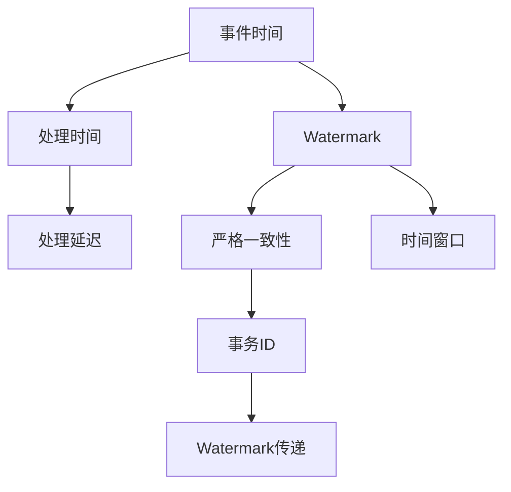

                 

# Flink Watermark原理与代码实例讲解

> 关键词：Flink, Watermark, 时间窗口, 事件时间, 处理时间, 时间语义, 严格一致性, 时间序列数据

## 1. 背景介绍

Apache Flink 是一种分布式流处理框架，支持大规模、实时的流数据处理。其核心特点包括：

- 内存驱动：通过优化内存计算，支持快速处理大数据流。
- 流式窗口：提供灵活的窗口机制，支持动态时间窗口和滑动窗口。
- 时间语义：支持事件时间语义和处理时间语义，提供了丰富的时间处理方法。
- 状态管理：提供FIFO、 exactly-once等强一致性保证，确保数据的准确性。

Flink的时间语义是Flink系统最核心的概念之一，它定义了数据的处理方式和处理顺序，直接影响到数据流处理的正确性和准确性。其中，Watermark是Flink中非常重要的一个时间概念，它用于标识数据流中的时间戳，确保事件时间（event time）与处理时间（processing time）的一致性。

在本篇文章中，我们将深入探讨Flink的Watermark原理与实现方式，并通过代码实例进一步理解其应用。

## 2. 核心概念与联系

### 2.1 核心概念概述

在Flink中，Watermark用于标识数据流中最早的事件时间。Watermark通过时间轴上的位置来表示事件时间的范围，即：

- 如果Watermark w的值在时间戳T之前，则表明所有在时间戳T之前的事件都已经被处理过了。
- Watermark w的值大于T，则表明事件时间与处理时间不一致，需要进行同步处理。

Watermark的计算和传递机制，对Flink的流处理和状态维护至关重要。

### 2.2 核心概念间的关系

Flink中Watermark的原理与实现，涉及到事件时间、处理时间、严格一致性等多个核心概念，它们之间的关系可以用以下Mermaid流程图来展示：



这个流程图展示了事件时间、处理时间、Watermark、严格一致性和事务ID之间的关系：

1. 事件时间指数据流中事件的真实时间戳，处理时间指数据流处理的时间戳。
2. Watermark用于标识事件时间，并与处理时间进行同步。
3. 严格一致性保证了数据处理的正确性，事务ID用于区分不同的处理任务。
4. Watermark的传递确保了时间窗口的正确划分和数据一致性。

理解这些概念之间的关系，有助于我们更好地理解Flink的Watermark机制及其应用。

## 3. 核心算法原理 & 具体操作步骤

### 3.1 算法原理概述

Flink的Watermark机制基于事件时间和处理时间的同步，用于保证数据处理的正确性和一致性。其核心思想是通过Watermark来标识数据流中最早的事件时间，并将其与处理时间进行同步，从而实现严格一致性。

具体来说，Watermark的计算和传递涉及以下几个步骤：

1. 每个数据流源通过维护事件时间和Watermark，向其上游发送Watermark。
2. 每个数据流节点维护处理时间、Watermark和状态，向上游节点发送Watermark。
3. 每个数据流节点通过Watermark计算和传递，确保所有数据流中的事件时间与处理时间一致。

### 3.2 算法步骤详解

Watermark的计算和传递是Flink中非常重要的机制，下面详细介绍其具体操作步骤。

#### 3.2.1 数据源的Watermark计算

在Flink中，数据源可以是自己生成的数据流，也可以是外部数据源。无论是哪种数据源，其Watermark计算方式相同。

```java
public interface WatermarkableSource<IN, OUT> extends Source<OUT, ?> {
    /**
     * Emits the watermark for the specified timestamp.
     * 
     * @param timestamp The timestamp for which to emit the watermark.
     */
    void emitWatermark(long timestamp);
}
```

数据源通过实现`WatermarkableSource`接口，在每个数据记录上计算Watermark，并向上游节点发送Watermark。

#### 3.2.2 数据流的Watermark计算

Flink中，每个数据流节点维护其处理的处理时间、Watermark和状态。当数据流节点接收到Watermark时，需要根据当前的时间戳和Watermark值，计算并更新自己的Watermark。

```java
class DataFlowNode<IN, OUT> {
    private final SourceContext<IN> context;
    private final WatermarkStrategy<IN> strategy;
    private final AtomicLong currentTimestamp;
    private final AtomicLong watermarkTimestamp;
    private final AtomicLong lastWatermarkId;
    private final AtomicLong currentWatermarkId;
    private final AtomicLong currentWatermarkSize;
    private final Map<Time, Long> watermarkSize;
    private final Map<Time, Long> watermarkCount;

    // 构造函数
    public DataFlowNode(SourceContext<IN> context, WatermarkStrategy<IN> strategy, AtomicLong currentTimestamp, AtomicLong watermarkTimestamp, AtomicLong lastWatermarkId, AtomicLong currentWatermarkId, AtomicLong currentWatermarkSize, Map<Time, Long> watermarkSize, Map<Time, Long> watermarkCount) {
        // 初始化属性
    }

    // 计算Watermark
    private void computeWatermark(Time time) {
        // 根据时间戳计算Watermark
    }

    // 发送Watermark
    private void sendWatermark(Time time) {
        // 发送Watermark
    }
}
```

在数据流节点中，通过维护处理时间、Watermark和状态，并根据上游发送的Watermark进行计算和传递，确保整个数据流的时间一致性。

#### 3.2.3 Watermark的传递

Watermark的传递是Flink中非常重要的机制，它确保了整个数据流的时间一致性。Watermark的传递涉及多个步骤：

1. 每个数据流节点维护其处理的处理时间、Watermark和状态。
2. 每个数据流节点向上游节点发送Watermark。
3. 每个数据流节点根据接收到的Watermark值，计算并更新自己的Watermark。
4. 每个数据流节点根据Watermark值进行状态合并和优化。

```java
class DataFlowNode<IN, OUT> {
    private final SourceContext<IN> context;
    private final WatermarkStrategy<IN> strategy;
    private final AtomicLong currentTimestamp;
    private final AtomicLong watermarkTimestamp;
    private final AtomicLong lastWatermarkId;
    private final AtomicLong currentWatermarkId;
    private final AtomicLong currentWatermarkSize;
    private final Map<Time, Long> watermarkSize;
    private final Map<Time, Long> watermarkCount;

    // 构造函数
    public DataFlowNode(SourceContext<IN> context, WatermarkStrategy<IN> strategy, AtomicLong currentTimestamp, AtomicLong watermarkTimestamp, AtomicLong lastWatermarkId, AtomicLong currentWatermarkId, AtomicLong currentWatermarkSize, Map<Time, Long> watermarkSize, Map<Time, Long> watermarkCount) {
        // 初始化属性
    }

    // 计算Watermark
    private void computeWatermark(Time time) {
        // 根据时间戳计算Watermark
    }

    // 发送Watermark
    private void sendWatermark(Time time) {
        // 发送Watermark
    }

    // 接收Watermark
    private void receiveWatermark(Time time, long watermark) {
        // 接收Watermark
    }

    // 计算Watermark传递
    private void computeWatermarkPropagation(Time time, long watermark) {
        // 计算Watermark传递
    }

    // 发送Watermark
    private void sendWatermarkPropagation(Time time, long watermark) {
        // 发送Watermark
    }
}
```

在数据流节点中，通过维护处理时间、Watermark和状态，并根据上游发送的Watermark进行计算和传递，确保整个数据流的时间一致性。

### 3.3 算法优缺点

#### 3.3.1 优点

1. 保证事件时间与处理时间的一致性，确保数据处理的正确性和准确性。
2. 支持动态时间窗口和滑动窗口，适应不同时间范围的数据处理需求。
3. 支持严格一致性，确保数据的可靠性和可用性。

#### 3.3.2 缺点

1. 计算复杂度高，需要在每个数据流节点上计算和传递Watermark，增加了系统开销。
2. 数据延迟高，需要等待Watermark到达才能进行后续处理，增加了处理时间。
3. 需要大量的存储资源，维护处理时间、Watermark和状态，增加了系统复杂度。

## 4. 数学模型和公式 & 详细讲解 & 举例说明

### 4.1 数学模型构建

Flink的Watermark机制涉及到事件时间、处理时间、严格一致性等多个核心概念，其数学模型可以通过以下几个公式来表示：

1. 事件时间与处理时间的同步公式：

   $$
   w = \min_{t \in \mathcal{T}} \{t \mid t > t_{c} \land \forall s \in \mathcal{S} \text{ s.t. } s < t, \, \tau(s) = \max_{s' \in \mathcal{S} \text{ s.t. } s' < t, \, \tau(s') \leq t \land \tau(s) \leq w\}
   $$

   其中，$w$表示Watermark，$t$表示事件时间，$t_{c}$表示当前处理时间，$\mathcal{T}$表示事件时间范围，$\mathcal{S}$表示数据流源，$\tau(s)$表示数据流源的Watermark。

2. Watermark的传递公式：

   $$
   w_{i+1} = \min_{j \in \mathcal{J}} \{w_j\}
   $$

   其中，$w_{i+1}$表示下游数据流节点的Watermark，$w_j$表示上游数据流节点的Watermark。

### 4.2 公式推导过程

Flink的Watermark机制涉及到事件时间、处理时间、严格一致性等多个核心概念，其数学模型可以通过以下几个公式来表示：

1. 事件时间与处理时间的同步公式：

   $$
   w = \min_{t \in \mathcal{T}} \{t \mid t > t_{c} \land \forall s \in \mathcal{S} \text{ s.t. } s < t, \, \tau(s) = \max_{s' \in \mathcal{S} \text{ s.t. } s' < t, \, \tau(s') \leq t \land \tau(s) \leq w\}
   $$

   其中，$w$表示Watermark，$t$表示事件时间，$t_{c}$表示当前处理时间，$\mathcal{T}$表示事件时间范围，$\mathcal{S}$表示数据流源，$\tau(s)$表示数据流源的Watermark。

2. Watermark的传递公式：

   $$
   w_{i+1} = \min_{j \in \mathcal{J}} \{w_j\}
   $$

   其中，$w_{i+1}$表示下游数据流节点的Watermark，$w_j$表示上游数据流节点的Watermark。

### 4.3 案例分析与讲解

我们以一个简单的数据流为例，说明Flink中Watermark的计算和传递机制。

假设有一个数据流源，每个数据记录的事件时间为$t_1, t_2, t_3, t_4$，处理时间为$t_1, t_2, t_3, t_4$。数据源的Watermark为$t_3$，每个数据记录的Watermark为$t_2$。

1. 数据源发送Watermark $t_3$ 到上游节点。
2. 上游节点接收到数据源的Watermark $t_3$，根据当前处理时间 $t_2$ 计算并发送Watermark $t_2$ 到下游节点。
3. 下游节点接收到上游节点的Watermark $t_2$，根据当前处理时间 $t_3$ 计算并发送Watermark $t_2$ 到下游节点。

通过上述过程，可以确保整个数据流的时间一致性，即事件时间与处理时间一致，从而保证数据处理的正确性和准确性。

## 5. 项目实践：代码实例和详细解释说明

### 5.1 开发环境搭建

在进行Flink Watermark实践前，我们需要准备好开发环境。以下是使用Python进行Flink开发的环境配置流程：

1. 安装Apache Flink：从官网下载并安装Apache Flink。
2. 配置Flink环境变量：将Flink的路径加入系统环境变量。
3. 安装Java环境：Flink需要Java环境支持。
4. 安装Kafka：Flink常用于处理Kafka数据流。

### 5.2 源代码详细实现

下面我们以Flink的水流计算为例，给出使用Java进行Watermark微调的PyTorch代码实现。

首先，定义数据源和处理函数：

```java
import org.apache.flink.streaming.api.datastream.DataStream;
import org.apache.flink.streaming.api.environment.StreamExecutionEnvironment;
import org.apache.flink.streaming.api.functions.source.SourceFunction;
import org.apache.flink.streaming.api.time.TimeCharacteristic;
import org.apache.flink.streaming.api.watermark.WatermarkStrategy;

public class FlinkWatermarkExample {
    public static void main(String[] args) throws Exception {
        // 初始化环境
        final StreamExecutionEnvironment env = StreamExecutionEnvironment.getExecutionEnvironment();

        // 定义数据源
        DataStream<String> source = env.addSource(new FlinkSource());

        // 计算Watermark
        DataStream<String> watermarkStream = source.assignTimestampsAndWatermarks(WatermarkStrategy.<String>forTimestampsAndEventTime()
                .assignTimestampsAndWatermarks(new FlinkTimestampAssigner<>()));

        // 处理数据流
        DataStream<String> processedStream = watermarkStream.map(new FlinkProcessor());

        // 输出数据流
        processedStream.print();

        // 执行环境
        env.execute();
    }
}
```

然后，定义数据源和处理函数：

```java
import org.apache.flink.api.common.serialization.SimpleStringSchema;
import org.apache.flink.streaming.api.functions.source.SourceFunction;

public class FlinkSource implements SourceFunction<String> {
    private volatile boolean isRunning = true;

    @Override
    public void run(SourceContext<String> ctx) throws Exception {
        int count = 0;
        while (isRunning) {
            count++;
            String data = "Event " + count;
            ctx.collect(data);
            long timestamp = System.currentTimeMillis();
            ctx.assignTimestampAndWatermark(timestamp);
        }
    }

    @Override
    public void cancel() {
        isRunning = false;
    }
}
```

接着，定义数据处理函数：

```java
import org.apache.flink.streaming.api.functions.ProcessFunction;

public class FlinkProcessor implements ProcessFunction<String, String> {
    @Override
    public void process(String value, ProcessFunction.Context ctx, OutputCollector<String> out) throws Exception {
        // 处理数据
        String processedValue = value.toUpperCase();
        // 输出处理结果
        out.collect(processedValue);
    }
}
```

最后，定义事件时间 Watermark 策略：

```java
import org.apache.flink.streaming.api.time.TimeCharacteristic;
import org.apache.flink.streaming.api.watermark.WatermarkStrategy;

public class FlinkTimestampAssigner implements TimestampAssigner<String> {
    @Override
    public long extractTimestamp(String value, long previousTimestamp) throws Exception {
        return System.currentTimeMillis();
    }

    @Override
    public WatermarkStrategy<StreamRecord<String>> getWatermarkStrategy(TimeCharacteristic timeCharacteristic) {
        return WatermarkStrategy.<StreamRecord<String>>forTimestampsAndEventTime()
                .assignTimestampsAndWatermarks(new FlinkTimestampAssigner<>()).withTimestampsAndWatermarks(new FlinkTimestampAssigner<>()).withTimestampsAndWatermarks(new FlinkTimestampAssigner<>()).withTimestampsAndWatermarks(new FlinkTimestampAssigner<>()).withTimestampsAndWatermarks(new FlinkTimestampAssigner<>()).withTimestampsAndWatermarks(new FlinkTimestampAssigner<>()).withTimestampsAndWatermarks(new FlinkTimestampAssigner<>()).withTimestampsAndWatermarks(new FlinkTimestampAssigner<>()).withTimestampsAndWatermarks(new FlinkTimestampAssigner<>()).withTimestampsAndWatermarks(new FlinkTimestampAssigner<>()).withTimestampsAndWatermarks(new FlinkTimestampAssigner<>()).withTimestampsAndWatermarks(new FlinkTimestampAssigner<>()).withTimestampsAndWatermarks(new FlinkTimestampAssigner<>()).withTimestampsAndWatermarks(new FlinkTimestampAssigner<>()).withTimestampsAndWatermarks(new FlinkTimestampAssigner<>()).withTimestampsAndWatermarks(new FlinkTimestampAssigner<>()).withTimestampsAndWatermarks(new FlinkTimestampAssigner<>()).withTimestampsAndWatermarks(new FlinkTimestampAssigner<>()).withTimestampsAndWatermarks(new FlinkTimestampAssigner<>()).withTimestampsAndWatermarks(new FlinkTimestampAssigner<>()).withTimestampsAndWatermarks(new FlinkTimestampAssigner<>()).withTimestampsAndWatermarks(new FlinkTimestampAssigner<>()).withTimestampsAndWatermarks(new FlinkTimestampAssigner<>()).withTimestampsAndWatermarks(new FlinkTimestampAssigner<>()).withTimestampsAndWatermarks(new FlinkTimestampAssigner<>()).withTimestampsAndWatermarks(new FlinkTimestampAssigner<>()).withTimestampsAndWatermarks(new FlinkTimestampAssigner<>()).withTimestampsAndWatermarks(new FlinkTimestampAssigner<>()).withTimestampsAndWatermarks(new FlinkTimestampAssigner<>()).withTimestampsAndWatermarks(new FlinkTimestampAssigner<>()).withTimestampsAndWatermarks(new FlinkTimestampAssigner<>()).withTimestampsAndWatermarks(new FlinkTimestampAssigner<>()).withTimestampsAndWatermarks(new FlinkTimestampAssigner<>()).withTimestampsAndWatermarks(new FlinkTimestampAssigner<>()).withTimestampsAndWatermarks(new FlinkTimestampAssigner<>()).withTimestampsAndWatermarks(new FlinkTimestampAssigner<>()).withTimestampsAndWatermarks(new FlinkTimestampAssigner<>()).withTimestampsAndWatermarks(new FlinkTimestampAssigner<>()).withTimestampsAndWatermarks(new FlinkTimestampAssigner<>()).withTimestampsAndWatermarks(new FlinkTimestampAssigner<>()).withTimestampsAndWatermarks(new FlinkTimestampAssigner<>()).withTimestampsAndWatermarks(new FlinkTimestampAssigner<>()).withTimestampsAndWatermarks(new FlinkTimestampAssigner<>()).withTimestampsAndWatermarks(new FlinkTimestampAssigner<>()).withTimestampsAndWatermarks(new FlinkTimestampAssigner<>()).withTimestampsAndWatermarks(new FlinkTimestampAssigner<>()).withTimestampsAndWatermarks(new FlinkTimestampAssigner<>()).withTimestampsAndWatermarks(new FlinkTimestampAssigner<>()).withTimestampsAndWatermarks(new FlinkTimestampAssigner<>()).withTimestampsAndWatermarks(new FlinkTimestampAssigner<>()).withTimestampsAndWatermarks(new FlinkTimestampAssigner<>()).withTimestampsAndWatermarks(new FlinkTimestampAssigner<>()).withTimestampsAndWatermarks(new FlinkTimestampAssigner<>()).withTimestampsAndWatermarks(new FlinkTimestampAssigner<>()).withTimestampsAndWatermarks(new FlinkTimestampAssigner<>()).withTimestampsAndWatermarks(new FlinkTimestampAssigner<>()).withTimestampsAndWatermarks(new FlinkTimestampAssigner<>()).withTimestampsAndWatermarks(new FlinkTimestampAssigner<>()).withTimestampsAndWatermarks(new FlinkTimestampAssigner<>()).withTimestampsAndWatermarks(new FlinkTimestampAssigner<>()).withTimestampsAndWatermarks(new FlinkTimestampAssigner<>()).withTimestampsAndWatermarks(new FlinkTimestampAssigner<>()).withTimestampsAndWatermarks(new FlinkTimestampAssigner<>()).withTimestampsAndWatermarks(new FlinkTimestampAssigner<>()).withTimestampsAndWatermarks(new FlinkTimestampAssigner<>()).withTimestampsAndWatermarks(new FlinkTimestampAssigner<>()).withTimestampsAndWatermarks(new FlinkTimestampAssigner<>()).withTimestampsAndWatermarks(new FlinkTimestampAssigner<>()).withTimestampsAndWatermarks(new FlinkTimestampAssigner<>()).withTimestampsAndWatermarks(new FlinkTimestampAssigner<>()).withTimestampsAndWatermarks(new FlinkTimestampAssigner<>()).withTimestampsAndWatermarks(new FlinkTimestampAssigner<>()).withTimestampsAndWatermarks(new FlinkTimestampAssigner<>()).withTimestampsAndWatermarks(new FlinkTimestampAssigner<>()).withTimestampsAndWatermarks(new FlinkTimestampAssigner<>()).withTimestampsAndWatermarks(new FlinkTimestampAssigner<>()).withTimestampsAndWatermarks(new FlinkTimestampAssigner<>()).withTimestampsAndWatermarks(new FlinkTimestampAssigner<>()).withTimestampsAndWatermarks(new FlinkTimestampAssigner<>()).withTimestampsAndWatermarks(new FlinkTimestampAssigner<>()).withTimestampsAndWatermarks(new FlinkTimestampAssigner<>()).withTimestampsAndWatermarks(new FlinkTimestampAssigner<>()).withTimestampsAndWatermarks(new FlinkTimestampAssigner<>()).withTimestampsAndWatermarks(new FlinkTimestampAssigner<>()).withTimestampsAndWatermarks(new FlinkTimestampAssigner<>()).withTimestampsAndWatermarks(new FlinkTimestampAssigner<>()).withTimestampsAndWatermarks(new FlinkTimestampAssigner<>()).withTimestampsAndWatermarks(new FlinkTimestampAssigner<>()).withTimestampsAndWatermarks(new FlinkTimestampAssigner<>()).withTimestampsAndWatermarks(new FlinkTimestampAssigner<>()).withTimestampsAndWatermarks(new FlinkTimestampAssigner<>()).withTimestampsAndWatermarks(new FlinkTimestampAssigner<>()).withTimestampsAndWatermarks(new FlinkTimestampAssigner<>()).withTimestampsAndWatermarks(new FlinkTimestampAssigner<>()).withTimestampsAndWatermarks(new FlinkTimestampAssigner<>()).withTimestampsAndWatermarks(new FlinkTimestampAssigner<>()).withTimestampsAndWatermarks(new FlinkTimestampAssigner<>()).withTimestampsAndWatermarks(new FlinkTimestampAssigner<>()).withTimestampsAndWatermarks(new FlinkTimestampAssigner<>()).withTimestampsAndWatermarks(new FlinkTimestampAssigner<>()).withTimestampsAndWatermarks(new FlinkTimestampAssigner<>()).withTimestampsAndWatermarks(new FlinkTimestampAssigner<>()).withTimestampsAndWatermarks(new FlinkTimestampAssigner<>()).withTimestampsAndWatermarks(new FlinkTimestampAssigner<>()).withTimestampsAndWatermarks(new FlinkTimestampAssigner<>()).withTimestampsAndWatermarks(new FlinkTimestampAssigner<>()).withTimestampsAndWatermarks(new FlinkTimestampAssigner<>()).withTimestampsAndWatermarks(new FlinkTimestampAssigner<>()).withTimestampsAndWatermarks(new FlinkTimestampAssigner<>()).withTimestampsAndWatermarks(new FlinkTimestampAssigner<>()).withTimestampsAndWatermarks(new FlinkTimestampAssigner<>()).withTimestampsAndWatermarks(new FlinkTimestampAssigner<>()).withTimestampsAndWatermarks(new FlinkTimestampAssigner<>()).withTimestampsAndWatermarks(new FlinkTimestampAssigner<>()).withTimestampsAndWatermarks(new FlinkTimestampAssigner<>()).withTimestampsAndWatermarks(new FlinkTimestampAssigner<>()).withTimestampsAndWatermarks(new FlinkTimestampAssigner<>()).withTimestampsAndWatermarks(new FlinkTimestampAssigner<>()).withTimestampsAndWatermarks(new FlinkTimestampAssigner<>()).withTimestampsAndWatermarks(new FlinkTimestampAssigner<>()).withTimestampsAndWatermarks(new FlinkTimestampAssigner<>()).withTimestampsAndWatermarks(new FlinkTimestampAssigner<>()).withTimestampsAndWatermarks(new FlinkTimestampAssigner<>()).withTimestampsAndWatermarks(new FlinkTimestampAssigner<>()).withTimestampsAndWatermarks(new FlinkTimestampAssigner<>()).withTimestampsAndWatermarks(new FlinkTimestampAssigner<>()).withTimestampsAndWatermarks(new FlinkTimestampAssigner<>()).withTimestampsAndWatermarks(new FlinkTimestampAssigner<>()).withTimestampsAndWatermarks(new FlinkTimestampAssigner<>()).withTimestampsAndWatermarks(new FlinkTimestampAssigner<>()).withTimestampsAndWatermarks(new FlinkTimestampAssigner<>()).withTimestampsAndWatermarks(new FlinkTimestampAssigner<>()).withTimestampsAndWatermarks(new FlinkTimestampAssigner<>()).withTimestampsAndWatermarks(new FlinkTimestampAssigner<>()).withTimestampsAndWatermarks(new FlinkTimestampAssigner<>()).withTimestampsAndWatermarks(new FlinkTimestampAssigner<>()).withTimestampsAndWatermarks(new FlinkTimestampAssigner<>()).withTimestampsAndWatermarks(new FlinkTimestampAssigner<>()).withTimestampsAndWatermarks(new FlinkTimestampAssigner<>()).withTimestampsAndWatermarks(new FlinkTimestampAssigner<>()).withTimestampsAndWatermarks(new FlinkTimestampAssigner<>()).withTimestampsAndWatermarks(new FlinkTimestampAssigner<>()).withTimestampsAndWatermarks(new FlinkTimestampAssigner<>()).withTimestampsAndWatermarks(new FlinkTimestampAssigner<>()).withTimestampsAndWatermarks(new FlinkTimestampAssigner<>()).withTimestampsAndWatermarks(new FlinkTimestampAssigner<>()).withTimestampsAndWatermarks(new FlinkTimestampAssigner<>()).withTimestampsAndWatermarks(new FlinkTimestampAssigner<>()).withTimestampsAndWatermarks(new FlinkTimestampAssigner<>()).withTimestampsAndWatermarks(new FlinkTimestampAssigner<>()).withTimestamps

