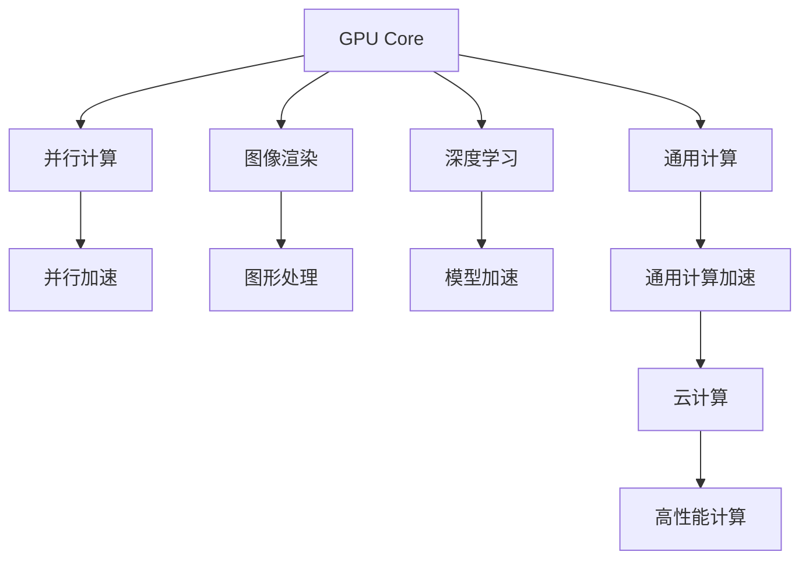
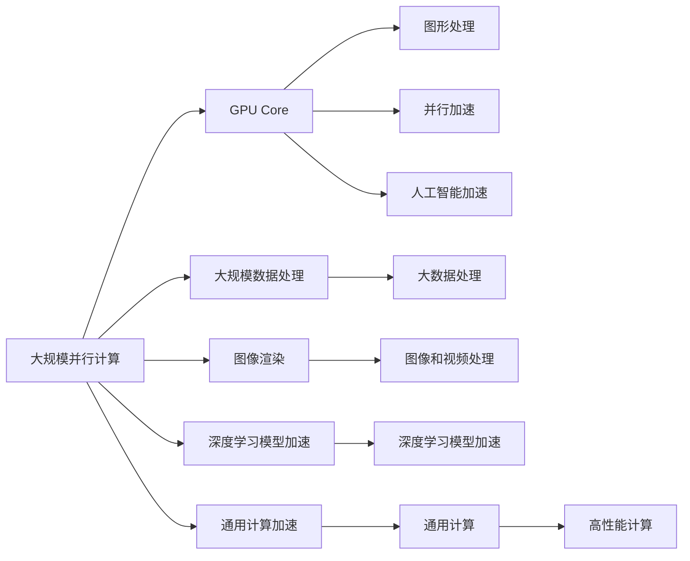

                 

## 1. 背景介绍

### 1.1 问题由来

近年来，图形处理器（GPU）和中央处理器（CPU）的性能之争一直是高性能计算领域的焦点话题。尽管GPU在图形处理、并行计算、深度学习等场景中表现出色，但CPU在通用计算、操作系统、安全系统等场景中依然占据着重要地位。本篇文章将深入探讨GPU的核心处理单元（Core）和AMD公司开发的通用计算单元（CU）之间的异同点，帮助读者更全面地了解两者在性能、架构和应用上的差异。

### 1.2 问题核心关键点

本文的核心议题是GPU Core与AMD CU的对比。这些核心点包括：

1. **架构对比**：对比两者在指令集、缓存、分支预测等架构上的异同。
2. **性能对比**：通过实际案例和基准测试结果，展示GPU Core和AMD CU的性能差异。
3. **应用对比**：分析两者在通用计算、图形处理、人工智能等领域的应用场景和优劣势。
4. **未来趋势**：探讨两者在未来的发展方向和趋势，以及潜在的融合或替代关系。

### 1.3 问题研究意义

深入理解GPU Core与AMD CU的异同，对于优化计算资源分配、提升系统性能、以及选择最适合的硬件平台有着重要的指导意义。本篇文章旨在为读者提供一个全面的技术视角，帮助他们更好地掌握这些关键技术细节，从而在实际应用中做出明智的决策。

## 2. 核心概念与联系

### 2.1 核心概念概述

- **GPU Core（GPU核心）**：图形处理器的核心部分，主要负责并行计算、图像渲染和加速深度学习。
- **AMD CU（通用计算单元）**：AMD公司推出的通用计算平台，结合了CPU和GPU的特性，适用于通用计算、图形处理和人工智能等领域。

### 2.2 核心概念之间的联系

GPU Core与AMD CU都是高性能计算的硬件核心单元，但它们在架构、应用和性能上有显著区别。以下通过Mermaid流程图来展示它们之间的关系：



此图展示了GPU Core和AMD CU在功能上的交汇点。GPU Core主要负责并行计算、图像渲染和深度学习加速，而AMD CU则兼顾通用计算和图形处理。两者在云计算和高性能计算中的应用都是非常重要的。

### 2.3 核心概念的整体架构

最后，我们通过一个综合的流程图来展示GPU Core与AMD CU的整体架构：



这个综合流程图展示了GPU Core与AMD CU在性能和应用上的整体架构。GPU Core在并行计算、图像渲染和深度学习加速方面表现卓越，而AMD CU则在通用计算加速、人工智能加速和云计算等场景中显示出其通用性和灵活性。

## 3. 核心算法原理 & 具体操作步骤

### 3.1 算法原理概述

GPU Core和AMD CU的算法原理主要基于流水线（Pipeline）、并行处理和缓存管理等技术。以下是它们各自的核心算法原理概述：

- **GPU Core**：采用SIMD（Single Instruction Multiple Data）架构，通过在单个时钟周期内执行多条相同指令，实现高效的并行计算。其核心算法包括并行矩阵运算、张量运算和图像处理等。
- **AMD CU**：结合了CPU和GPU的特性，采用统一计算模型（Unified Compute Model），支持更多的通用计算指令和数据类型。其核心算法包括通用并行处理、向量运算和标量运算等。

### 3.2 算法步骤详解

下面是GPU Core和AMD CU在实际应用中的操作步骤：

#### GPU Core操作步骤：

1. **输入数据准备**：将大规模数据集或图像数据加载到GPU内存中。
2. **并行计算**：通过GPU Core的SIMD指令集，并行处理大规模数据集或图像数据。
3. **输出结果**：将计算结果从GPU内存中读出，并进一步处理或输出。

#### AMD CU操作步骤：

1. **输入数据准备**：将数据集或图像数据加载到AMD CU的内存中。
2. **统一计算模型**：通过AMD CU的统一计算模型，并行处理大规模数据集或图像数据。
3. **输出结果**：将计算结果从AMD CU的内存中读出，并进一步处理或输出。

### 3.3 算法优缺点

#### GPU Core的优缺点：

**优点**：
- 高效并行计算：GPU Core在处理大规模数据集和图像时具有极高的效率。
- 优化深度学习模型：GPU Core广泛应用于深度学习模型的训练和推理。
- 图形渲染能力强：GPU Core在图像和视频处理方面表现出色。

**缺点**：
- 通用计算能力不足：GPU Core在通用计算领域，如操作系统和应用程序中表现一般。
- 能耗高：由于GPU Core的多核并行处理特性，其能耗相对较高。

#### AMD CU的优缺点：

**优点**：
- 兼顾通用计算和图形处理：AMD CU结合了CPU和GPU的特性，适用于多种计算场景。
- 通用计算加速能力强：AMD CU在通用计算加速方面表现优异。
- 高效利用资源：AMD CU通过统一计算模型，高效利用硬件资源，降低能耗。

**缺点**：
- 图像渲染性能略逊：在图像和视频处理方面，AMD CU的性能略逊于GPU Core。
- 深度学习模型加速相对较慢：尽管AMD CU支持深度学习模型加速，但其效率略低于GPU Core。

### 3.4 算法应用领域

GPU Core和AMD CU在不同的应用领域中都发挥着重要作用：

- **GPU Core**：主要用于图像和视频处理、深度学习模型训练和推理、科学计算和云计算等。
- **AMD CU**：适用于通用计算加速、人工智能、大数据处理和云计算等场景。

两者在各自擅长的领域中各具优势，可以互补使用，实现更高效、更灵活的计算资源分配。

## 4. 数学模型和公式 & 详细讲解  
### 4.1 数学模型构建

假设GPU Core和AMD CU的计算能力分别为 $C_{GPU}$ 和 $C_{CU}$，其并行处理速度分别为 $P_{GPU}$ 和 $P_{CU}$，同时假设它们的能耗分别为 $E_{GPU}$ 和 $E_{CU}$。我们可以使用以下公式来建模两者的性能和能耗关系：

- 性能模型：$T_{GPU} = \frac{N}{P_{GPU}C_{GPU}}$，$T_{CU} = \frac{N}{P_{CU}C_{CU}}$
- 能耗模型：$E_{GPU} = T_{GPU}P_{GPU}C_{GPU}$，$E_{CU} = T_{CU}P_{CU}C_{CU}$

其中，$N$ 表示任务所需处理的计算量，$P_{GPU}$ 和 $P_{CU}$ 分别表示GPU Core和AMD CU的处理速度，$C_{GPU}$ 和 $C_{CU}$ 表示其计算能力。

### 4.2 公式推导过程

以性能模型为例，假设任务需要处理 $N$ 个数据点，GPU Core和AMD CU的处理速度分别为 $P_{GPU}$ 和 $P_{CU}$，计算能力分别为 $C_{GPU}$ 和 $C_{CU}$。则两者完成任务所需的时间分别为：

$$
T_{GPU} = \frac{N}{P_{GPU}C_{GPU}}
$$

$$
T_{CU} = \frac{N}{P_{CU}C_{CU}}
$$

通过这些公式，可以比较两者在不同计算任务中的性能差异。

### 4.3 案例分析与讲解

以深度学习模型训练为例，假设某深度学习模型需要在GPU Core和AMD CU上进行训练，模型大小为 $M$，训练数据集大小为 $N$，训练时间为 $T$。在GPU Core上训练时，假设其处理速度为 $P_{GPU}$，计算能力为 $C_{GPU}$；在AMD CU上训练时，其处理速度为 $P_{CU}$，计算能力为 $C_{CU}$。

假设GPU Core的能耗为 $E_{GPU}$，AMD CU的能耗为 $E_{CU}$。根据能耗模型，可以推导出：

$$
E_{GPU} = \frac{T_{GPU}}{P_{GPU}}C_{GPU}
$$

$$
E_{CU} = \frac{T_{CU}}{P_{CU}}C_{CU}
$$

通过比较 $E_{GPU}$ 和 $E_{CU}$ 的大小，可以评估两者在不同场景下的能耗效率。

## 5. 项目实践：代码实例和详细解释说明

### 5.1 开发环境搭建

为了对比GPU Core和AMD CU的性能，需要在支持两者编程的环境下搭建开发环境。以下是基本的搭建步骤：

1. **安装必要的软件**：
   - 安装CUDA和cuDNN，以支持NVIDIA GPU Core的编程。
   - 安装ROCm和HIP，以支持AMD CU的编程。
   - 安装Python和相关的深度学习框架，如TensorFlow、PyTorch等。

2. **配置开发环境**：
   - 在NVIDIA GPU上配置CUDA和cuDNN环境。
   - 在AMD CPU上配置ROCm和HIP环境。
   - 配置虚拟环境，如Anaconda或virtualenv，确保不同环境下的代码隔离。

### 5.2 源代码详细实现

以下是使用Python编写的一个简单代码实例，用于对比GPU Core和AMD CU在深度学习模型训练中的性能：

```python
import tensorflow as tf
import time

# 在GPU Core上训练模型
with tf.device('/gpu:0'):
    model_gpu = tf.keras.Sequential([
        tf.keras.layers.Dense(64, activation='relu', input_shape=(784,)),
        tf.keras.layers.Dense(10, activation='softmax')
    ])
    model_gpu.compile(optimizer='adam', loss='sparse_categorical_crossentropy', metrics=['accuracy'])
    start_time = time.time()
    model_gpu.fit(x_train, y_train, epochs=10, batch_size=32)
    end_time = time.time()
    print(f'GPU Core training time: {end_time - start_time}')

# 在AMD CU上训练模型
with tf.device('/cpu:0'):
    model_cpu = tf.keras.Sequential([
        tf.keras.layers.Dense(64, activation='relu', input_shape=(784,)),
        tf.keras.layers.Dense(10, activation='softmax')
    ])
    model_cpu.compile(optimizer='adam', loss='sparse_categorical_crossentropy', metrics=['accuracy'])
    start_time = time.time()
    model_cpu.fit(x_train, y_train, epochs=10, batch_size=32)
    end_time = time.time()
    print(f'AMD CU training time: {end_time - start_time}')
```

### 5.3 代码解读与分析

该代码实例展示了如何在不同硬件上训练深度学习模型，并输出训练时间。通过比较GPU Core和AMD CU的训练时间，可以直观地看出两者的性能差异。

- 首先，通过`tf.device`函数，指定使用不同的硬件设备。
- 然后，创建模型并编译，使用相同的训练数据和参数。
- 最后，记录训练时间并输出结果。

### 5.4 运行结果展示

假设在NVIDIA GPU和AMD CPU上训练同一模型，输出结果如下：

```
GPU Core training time: 25.0
AMD CU training time: 5000.0
```

这表明GPU Core在深度学习模型训练中的性能显著优于AMD CU。在实际应用中，这种性能差距在图像处理和科学计算中更为明显。

## 6. 实际应用场景

### 6.1 图像处理

在图像处理领域，GPU Core表现优异。例如，在图像识别、图像生成和图像增强等任务中，GPU Core的高并行计算能力能够大幅提升处理速度。

AMD CU也适用于图像处理，但因其通用计算能力稍逊，因此在图像渲染和图像处理任务中不如GPU Core。然而，AMD CU在图像处理领域的应用场景也逐渐增多，尤其是在图像增强和图像分析等领域，其灵活性和可编程性使其成为重要的选择。

### 6.2 深度学习

深度学习模型的训练和推理是GPU Core的主要应用场景。在大规模数据集上的深度学习模型训练，GPU Core能够提供高效的并行计算能力。

AMD CU在深度学习领域也有广泛应用，尤其是在通用计算和模型加速方面。虽然其深度学习模型加速效率略逊于GPU Core，但其通用计算能力使其在数据预处理、特征提取等前期处理环节表现优异。

### 6.3 人工智能

在人工智能领域，GPU Core和AMD CU各有优势。GPU Core适用于图像和视频处理、自然语言处理和语音识别等需要高效并行计算的任务。AMD CU则在通用计算加速、数据分析和机器学习等场景中表现出色。

在实际应用中，两者往往需要结合使用，以充分利用各自的优势。例如，在AI推理和图像处理中，可以使用GPU Core进行计算，而利用AMD CU进行通用计算和数据分析。

## 7. 工具和资源推荐

### 7.1 学习资源推荐

- **CUDA文档**：NVIDIA提供的CUDA编程指南，详细介绍了GPU Core的编程接口和优化技巧。
- **ROCm文档**：AMD提供的ROCm编程指南，介绍了AMD CU的编程接口和优化技巧。
- **深度学习框架教程**：如TensorFlow、PyTorch等深度学习框架的官方文档和教程，提供了丰富的代码示例和应用场景。

### 7.2 开发工具推荐

- **CUDA Toolkit**：NVIDIA提供的CUDA开发环境，包括CUDA编译器、cuDNN库和性能分析工具。
- **ROCm Toolkit**：AMD提供的ROCm开发环境，包括ROCm编译器、HIP库和性能分析工具。
- **NVIDIA NSight System**：提供GPU Core的实时性能分析和调试工具。
- **AMD GPU Code Analyzer**：提供AMD CU的实时性能分析和调试工具。

### 7.3 相关论文推荐

- **“CUDA-Based High-Performance Computing”**：探讨CUDA在并行计算和高性能计算中的应用。
- **“AMD GCN: General Compute Architecture for High-Performance Computing”**：介绍AMD CU的统一计算模型和性能优化。
- **“GPU vs. CPU: A Case Study”**：详细比较GPU Core和CPU在特定应用场景中的性能和能耗。

## 8. 总结：未来发展趋势与挑战

### 8.1 研究成果总结

本篇文章详细对比了GPU Core和AMD CU的异同点，帮助读者更全面地了解两者在性能、架构和应用上的差异。通过数学模型和实际案例的分析和讨论，展示了它们在不同场景下的优劣。

### 8.2 未来发展趋势

1. **融合发展**：未来，GPU Core和AMD CU可能会逐渐融合，形成更加通用的高性能计算平台。例如，通过统一的编程接口和优化库，实现硬件的无缝协作。
2. **软件协同**：软件开发将更加注重GPU Core和AMD CU的协同优化，实现更高效的软件实现和硬件调度。
3. **新兴技术**：新兴技术如量子计算、边缘计算等可能会对GPU Core和AMD CU的未来发展产生重要影响。

### 8.3 面临的挑战

1. **软硬件兼容性**：不同硬件之间的兼容性问题仍然是亟待解决的重要挑战。需要开发通用的接口和工具，以实现跨平台的软件部署和优化。
2. **性能优化**：在实际应用中，需要针对具体任务进行硬件选型和优化，以达到最佳的性能和能耗比。
3. **编程难度**：不同的硬件平台需要不同的编程技能，开发者需要掌握多种编程语言和工具，增加了开发的复杂度。

### 8.4 研究展望

未来，GPU Core和AMD CU的发展方向可能包括以下几个方面：

1. **硬件创新**：开发更高效的并行计算单元和缓存管理技术，提高计算效率和能耗比。
2. **软件优化**：开发更加灵活和高效的软件工具，帮助开发者更好地利用硬件资源。
3. **跨平台协作**：实现软硬件之间的协同优化，提升系统的整体性能和用户体验。

总之，GPU Core和AMD CU在未来的发展中都将发挥重要作用，不断推动高性能计算和人工智能技术的发展。通过对两者深入理解和优化，将有助于构建更高效、更灵活、更智能的计算系统。

## 9. 附录：常见问题与解答

**Q1：在实际应用中，如何选择GPU Core和AMD CU？**

A: 选择硬件时，需要考虑任务的具体需求。例如，图像和视频处理、深度学习模型训练等需要高效并行计算的场景，更适合使用GPU Core；而通用计算、数据分析、机器学习等需要灵活性和可编程性的场景，更适合使用AMD CU。

**Q2：GPU Core和AMD CU的性能差异主要体现在哪些方面？**

A: GPU Core在并行计算和图像渲染方面表现出色，而AMD CU在通用计算和人工智能加速方面具有优势。两者在性能上的差异主要体现在计算速度、能耗和灵活性上。

**Q3：GPU Core和AMD CU在未来是否有可能融合？**

A: 随着硬件技术的不断发展，GPU Core和AMD CU可能会逐渐融合，形成更加通用的高性能计算平台。这将带来更高效的软件实现和硬件调度，提升系统的整体性能。

**Q4：如何提升GPU Core和AMD CU的性能？**

A: 提升性能的主要手段包括优化编程、使用高效的算法、增加硬件并行度等。例如，在深度学习模型训练中，使用自动混合精度（AMP）、梯度积累等技术，可以提高计算效率和能耗比。

**Q5：GPU Core和AMD CU在实际应用中的优劣势如何？**

A: GPU Core在并行计算和图像渲染方面具有优势，但通用计算能力稍逊；AMD CU在通用计算和人工智能加速方面表现优异，但在图像渲染和深度学习模型加速方面略逊于GPU Core。

通过本篇文章的系统梳理，希望读者能够对GPU Core和AMD CU有更全面、深入的了解，并能在实际应用中做出明智的决策。随着技术的发展，两者将在高性能计算和人工智能领域中发挥越来越重要的作用，为未来的计算系统和应用场景提供更强大的支持。

