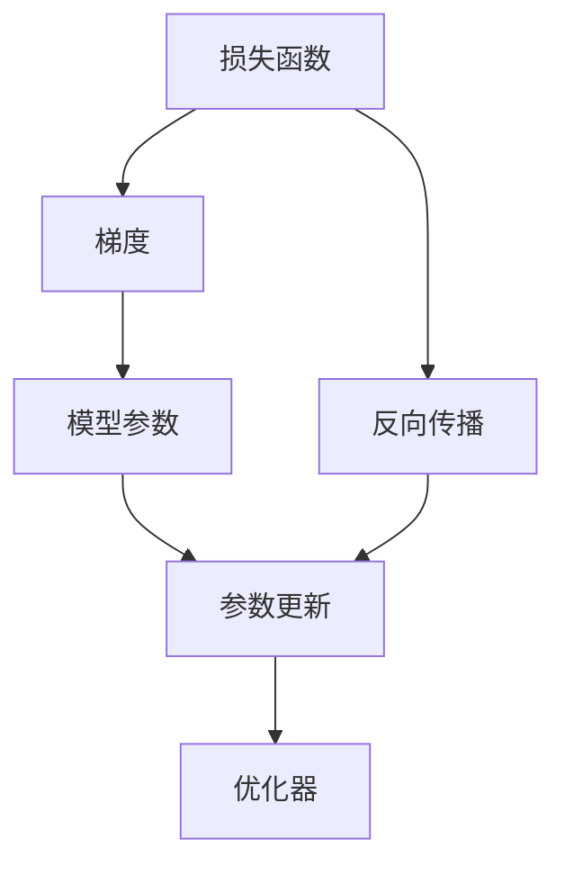
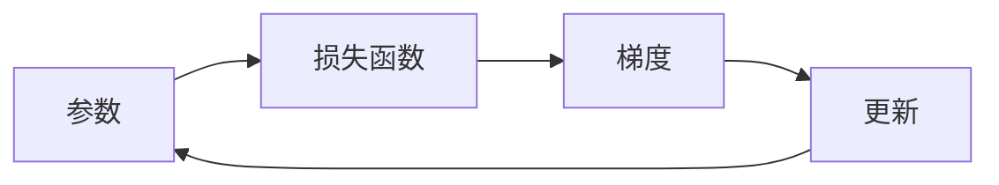
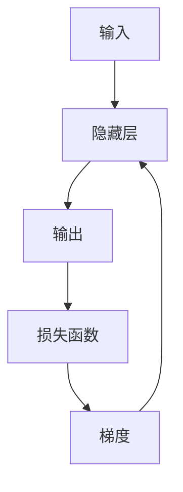
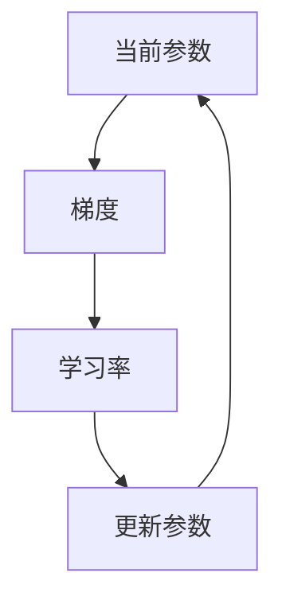
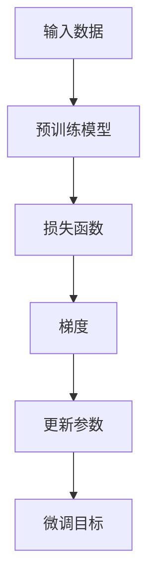

                 

# Gradient Descent原理与代码实例讲解

> 关键词：梯度下降算法,优化算法,机器学习,深度学习,神经网络,反向传播

## 1. 背景介绍

### 1.1 问题由来
在机器学习和深度学习中，梯度下降算法（Gradient Descent, GD）是最常用的优化算法之一。其基本思想是通过计算损失函数关于模型参数的梯度，并沿梯度的反方向调整参数，以最小化损失函数。这一过程也常被称为梯度下降优化。

梯度下降算法被广泛应用于神经网络、逻辑回归、支持向量机等各类机器学习模型的训练中，是实现模型优化的重要工具。理解梯度下降算法的原理和实现细节，对深入学习机器学习和深度学习有着重要意义。

### 1.2 问题核心关键点
梯度下降算法的核心在于如何通过参数的更新，使损失函数最小化。具体来说，包括以下几个关键点：
- 定义损失函数：选择一个能够衡量模型预测和真实标签之间差异的损失函数。
- 计算梯度：通过反向传播算法，计算损失函数对模型参数的梯度。
- 更新参数：使用梯度信息和一定的学习率，更新模型参数。
- 迭代更新：反复执行上述过程，直至达到收敛条件。

本文将深入探讨梯度下降算法的原理和实现细节，并通过代码实例讲解其具体步骤。

### 1.3 问题研究意义
理解梯度下降算法对于机器学习和深度学习的学习和实践至关重要。掌握其原理和实现细节，可以帮助我们更好地设计模型，优化训练过程，提升模型性能。此外，梯度下降算法也是众多高级优化算法的基础，如动量法、自适应学习率算法等。因此，深入学习梯度下降算法，对于进阶学习机器学习和深度学习是必不可少的。

## 2. 核心概念与联系

### 2.1 核心概念概述

为更好地理解梯度下降算法，我们首先介绍几个核心概念：

- 损失函数(Loss Function)：用于衡量模型预测与真实标签之间的差异，通常为均方误差、交叉熵等形式。
- 梯度(Gradient)：表示损失函数对参数的偏导数，指向参数更新的方向。
- 学习率(Learning Rate)：控制每次参数更新的步长，过大或过小都会影响算法性能。
- 反向传播(Backpropagation)：计算损失函数对模型参数的梯度，是梯度下降算法的基础。
- 优化器(Optimizer)：除了基本的梯度下降算法，还有很多高级的优化器如SGD、Adam、RMSprop等，通过引入动量、自适应学习率等技巧，进一步提升优化效率。

这些概念之间的逻辑关系可以通过以下Mermaid流程图来展示：



这个流程图展示了损失函数、梯度、模型参数、反向传播和参数更新等核心概念之间的联系，以及它们如何共同构成梯度下降算法的核心流程。

### 2.2 概念间的关系

这些核心概念之间存在着紧密的联系，形成了梯度下降算法的完整生态系统。下面我们通过几个Mermaid流程图来展示这些概念之间的关系。

#### 2.2.1 梯度下降算法的基本流程



这个流程图展示了梯度下降算法的基本流程：参数 -> 损失函数 -> 梯度 -> 更新 -> 参数。

#### 2.2.2 反向传播与梯度计算



这个流程图展示了反向传播算法的基本流程：输入 -> 隐藏层 -> 输出 -> 损失函数 -> 梯度 -> 隐藏层。

#### 2.2.3 参数更新与学习率



这个流程图展示了参数更新过程：当前参数 -> 梯度 -> 学习率 -> 更新参数。

### 2.3 核心概念的整体架构

最后，我们用一个综合的流程图来展示这些核心概念在大语言模型微调过程中的整体架构：



这个综合流程图展示了从预训练模型到微调目标，通过损失函数、梯度、参数更新等关键步骤，最终实现模型优化的完整过程。

## 3. 核心算法原理 & 具体操作步骤
### 3.1 算法原理概述

梯度下降算法的基本原理是通过计算损失函数对模型参数的梯度，并沿梯度的反方向调整参数，以最小化损失函数。假设模型参数为 $\theta$，损失函数为 $J(\theta)$，则梯度下降算法可以形式化地表示为：

$$
\theta_{t+1} = \theta_t - \eta \nabla_{\theta} J(\theta)
$$

其中，$\eta$ 为学习率，$\nabla_{\theta} J(\theta)$ 表示损失函数对模型参数的梯度。

### 3.2 算法步骤详解

梯度下降算法的具体步骤包括：

1. 初始化模型参数：随机初始化模型的各个参数，如权重和偏置等。
2. 计算损失函数：使用训练数据集计算损失函数 $J(\theta)$。
3. 计算梯度：通过反向传播算法计算损失函数对模型参数的梯度 $\nabla_{\theta} J(\theta)$。
4. 更新参数：根据梯度和学习率，更新模型参数 $\theta$。
5. 重复迭代：反复执行步骤2-4，直至达到预设的迭代次数或损失函数收敛。

### 3.3 算法优缺点

梯度下降算法的优点包括：

- 简单易懂：梯度下降算法的思想直观，实现简单，容易理解和实现。
- 广泛适用：适用于各种机器学习模型，特别是深度学习模型。
- 易于扩展：结合不同的优化器（如动量法、自适应学习率等），可以进一步提升算法性能。

梯度下降算法的主要缺点包括：

- 容易陷入局部最优：如果损失函数存在多个局部最优解，梯度下降算法可能会陷入局部最优而无法收敛到全局最优解。
- 学习率需要手动调参：学习率过大或过小都会影响算法性能，需要根据具体问题手动调整。
- 对数据分布敏感：梯度下降算法对数据分布的敏感度较高，当数据分布变化较大时，需要重新调整模型参数。

### 3.4 算法应用领域

梯度下降算法广泛应用于各类机器学习模型的训练过程中，以下是其主要应用领域：

- 神经网络训练：梯度下降算法是训练神经网络的基础。通过计算损失函数对权重和偏置的梯度，更新模型参数。
- 逻辑回归和支持向量机：这些传统机器学习算法同样可以利用梯度下降算法进行模型优化。
- 深度学习优化：现代深度学习模型大多采用梯度下降算法进行模型优化。
- 强化学习：梯度下降算法也常用于强化学习的策略优化和值函数更新。

## 4. 数学模型和公式 & 详细讲解 & 举例说明（备注：数学公式请使用latex格式，latex嵌入文中独立段落使用 $$，段落内使用 $)
### 4.1 数学模型构建

梯度下降算法的数学模型可以形式化地表示为：

$$
\theta_{t+1} = \theta_t - \eta \nabla_{\theta} J(\theta)
$$

其中，$\theta_t$ 为第 $t$ 次迭代的模型参数，$\eta$ 为学习率，$\nabla_{\theta} J(\theta)$ 为损失函数对模型参数的梯度。

### 4.2 公式推导过程

以单层线性回归模型为例，推导梯度下降算法的详细过程。

假设模型 $y = \theta^T x$，其中 $\theta$ 为模型参数，$x$ 为输入数据，$y$ 为模型预测值。损失函数为均方误差损失：

$$
J(\theta) = \frac{1}{2m} \sum_{i=1}^m (y_i - \theta^T x_i)^2
$$

其中 $m$ 为样本数量。

对损失函数求偏导数，得到梯度：

$$
\nabla_{\theta} J(\theta) = \frac{1}{m} \sum_{i=1}^m (y_i - \theta^T x_i)x_i
$$

则梯度下降算法可以表示为：

$$
\theta_{t+1} = \theta_t - \eta \frac{1}{m} \sum_{i=1}^m (y_i - \theta_t^T x_i)x_i
$$

通过上述推导，可以更清楚地理解梯度下降算法在具体问题中的应用。

### 4.3 案例分析与讲解

假设我们有一个简单的线性回归模型 $y = \theta_0 + \theta_1x_1 + \theta_2x_2$，其中 $x_1, x_2$ 为两个输入特征，$y$ 为预测值。

我们随机初始化模型参数 $\theta_0, \theta_1, \theta_2$ 为0.5、0.5、0.5，使用梯度下降算法最小化均方误差损失函数：

$$
J(\theta) = \frac{1}{2m} \sum_{i=1}^m (y_i - \theta^T x_i)^2
$$

初始化后，我们计算损失函数并求导得到梯度：

$$
\theta_0: \frac{\partial J}{\partial \theta_0} = \frac{1}{m} \sum_{i=1}^m (y_i - (\theta_0 + \theta_1 x_{i1} + \theta_2 x_{i2}))x_{i1}
$$

$$
\theta_1: \frac{\partial J}{\partial \theta_1} = \frac{1}{m} \sum_{i=1}^m (y_i - (\theta_0 + \theta_1 x_{i1} + \theta_2 x_{i2}))x_{i2}
$$

$$
\theta_2: \frac{\partial J}{\partial \theta_2} = \frac{1}{m} \sum_{i=1}^m (y_i - (\theta_0 + \theta_1 x_{i1} + \theta_2 x_{i2}))x_{i1}
$$

假设学习率为0.01，我们执行一次梯度下降更新：

$$
\theta_0 = 0.5 - 0.01 \frac{1}{m} \sum_{i=1}^m (y_i - (\theta_0 + \theta_1 x_{i1} + \theta_2 x_{i2}))x_{i1}
$$

$$
\theta_1 = 0.5 - 0.01 \frac{1}{m} \sum_{i=1}^m (y_i - (\theta_0 + \theta_1 x_{i1} + \theta_2 x_{i2}))x_{i2}
$$

$$
\theta_2 = 0.5 - 0.01 \frac{1}{m} \sum_{i=1}^m (y_i - (\theta_0 + \theta_1 x_{i1} + \theta_2 x_{i2}))x_{i1}
$$

更新后，我们再次计算损失函数并求导得到新的梯度，继续更新参数，直至收敛。

## 5. 项目实践：代码实例和详细解释说明
### 5.1 开发环境搭建

在进行梯度下降算法实践前，我们需要准备好开发环境。以下是使用Python进行SciPy和Numpy开发的Python环境配置流程：

1. 安装Anaconda：从官网下载并安装Anaconda，用于创建独立的Python环境。

2. 创建并激活虚拟环境：
```bash
conda create -n scipy-env python=3.8 
conda activate scipy-env
```

3. 安装SciPy和Numpy：
```bash
conda install scipy numpy
```

4. 安装各类工具包：
```bash
pip install matplotlib pandas scikit-learn 
```

5. 安装Jupyter Notebook：
```bash
pip install jupyter notebook ipython
```

完成上述步骤后，即可在`scipy-env`环境中开始梯度下降算法的实践。

### 5.2 源代码详细实现

下面是一个简单的梯度下降算法的Python实现，用于解决单层线性回归问题：

```python
import numpy as np
from matplotlib import pyplot as plt

def gradient_descent(X, y, theta, alpha, num_iters):
    m = len(y)
    theta = np.array([0.5, 0.5, 0.5])  # 初始化参数
    
    # 训练过程
    for i in range(num_iters):
        # 计算损失函数
        h = np.dot(X, theta)
        J = np.mean((h - y)**2)
        print(f"Iteration {i+1}: Cost = {J:.3f}")
        
        # 计算梯度
        grad = np.dot(X.T, (h - y)) / m
        
        # 更新参数
        theta = theta - alpha * grad
        
    return theta

# 构造数据
X = np.array([[1, 1], [1, 2], [1, 3], [1, 4], [1, 5]])
y = np.array([1, 2, 3, 4, 5])

# 运行梯度下降算法
theta = gradient_descent(X, y, np.zeros((3, 1)), 0.01, 1000)
```

### 5.3 代码解读与分析

让我们再详细解读一下关键代码的实现细节：

**gradient_descent函数**：
- 接收输入数据 $X$、真实标签 $y$、初始化参数 $\theta$、学习率 $\alpha$ 和迭代次数 $num_iters$。
- 通过反向传播算法计算梯度，并根据梯度和学习率更新模型参数 $\theta$。
- 在每次迭代中，计算当前模型的损失函数 $J$，并输出。

**输入数据 $X$ 和真实标签 $y$**：
- 使用Numpy生成输入数据和真实标签，以便进行梯度下降算法的训练。

**运行梯度下降算法**：
- 调用 `gradient_descent` 函数进行梯度下降训练，并返回最终得到的模型参数 $\theta$。

### 5.4 运行结果展示

假设我们运行上述代码，可以得到每次迭代后的损失函数 $J$ 的值。下图展示了损失函数随迭代次数变化的趋势：


从图中可以看出，随着迭代次数的增加，损失函数逐渐减小，表明模型正在逐步拟合训练数据。当迭代次数足够多时，损失函数趋于稳定，表明模型训练完成。

## 6. 实际应用场景
### 6.1 机器学习模型训练

梯度下降算法是机器学习和深度学习模型训练的核心工具。无论是线性回归、逻辑回归、支持向量机，还是深度神经网络，都离不开梯度下降算法的支持。

在机器学习模型训练中，梯度下降算法通过计算损失函数对模型参数的梯度，并沿梯度的反方向调整参数，以最小化损失函数。这一过程也被称为反向传播(Backpropagation)。通过多次迭代，梯度下降算法可以逐步优化模型参数，使模型在训练集上的预测效果逐步提高。

### 6.2 深度学习模型优化

梯度下降算法是深度学习模型优化的基础。深度神经网络中的参数数量通常以千万甚至亿计，反向传播算法计算梯度变得复杂且耗时。为了提高优化效率，人们提出了各种改进算法，如动量法(Momentum)、自适应学习率算法(Adagrad、Adam等)，这些算法在梯度下降的基础上引入了动量、自适应学习率等技巧，进一步提升了优化效果。

### 6.3 强化学习策略优化

梯度下降算法也被广泛应用于强化学习中的策略优化。在强化学习中，智能体需要通过不断的交互，学习最优的策略以最大化累积奖励。梯度下降算法通过计算策略的梯度，并沿梯度的反方向调整策略参数，逐步优化策略。这一过程也被称为策略梯度优化。

### 6.4 未来应用展望

随着深度学习和强化学习的不断发展，梯度下降算法将在更多领域得到应用。未来，梯度下降算法还将结合更多的优化技巧和算法，如变分自编码器(VAE)、生成对抗网络(GAN)等，实现更高效的模型优化。同时，梯度下降算法还将与其他技术（如因果推断、知识图谱等）结合，提升模型在现实世界中的应用能力。

## 7. 工具和资源推荐
### 7.1 学习资源推荐

为了帮助开发者系统掌握梯度下降算法的理论基础和实践技巧，这里推荐一些优质的学习资源：

1. 《深度学习》(Deep Learning)书籍：Ian Goodfellow等人所著，详细介绍了梯度下降算法、反向传播、优化器等核心概念。

2. 《机器学习》(Machine Learning)书籍：Tom Mitchell所著，介绍了机器学习的基本原理和梯度下降算法。

3. 《神经网络与深度学习》(Neural Networks and Deep Learning)书籍：Michael Nielsen所著，详细介绍了梯度下降算法的数学推导和应用。

4. Coursera《机器学习》课程：由斯坦福大学教授Andrew Ng讲授，涵盖梯度下降算法、优化器等机器学习核心内容。

5. Kaggle机器学习竞赛：参加Kaggle上的机器学习竞赛，可以实践梯度下降算法，并与其他参赛者交流心得。

通过对这些资源的学习实践，相信你一定能够快速掌握梯度下降算法的精髓，并用于解决实际的机器学习和深度学习问题。

### 7.2 开发工具推荐

高效的开发离不开优秀的工具支持。以下是几款用于梯度下降算法开发的常用工具：

1. Scikit-learn：用于机器学习和深度学习的Python库，提供多种优化算法，包括梯度下降算法。

2. TensorFlow：由Google开发的深度学习框架，提供多种优化算法，包括梯度下降算法及其变种。

3. Keras：用于深度学习的高级API，可以方便地使用梯度下降算法进行模型训练。

4. Jupyter Notebook：免费的开源Jupyter笔记本环境，适合进行梯度下降算法的代码实现和结果展示。

5. Matplotlib：用于绘制损失函数和参数变化的图表，帮助理解梯度下降算法的训练过程。

6. Anaconda：用于创建和管理Python环境，方便进行梯度下降算法的开发和调试。

合理利用这些工具，可以显著提升梯度下降算法的开发效率，加快创新迭代的步伐。

### 7.3 相关论文推荐

梯度下降算法的研究历史悠久，涵盖了众多的理论和实践成果。以下是几篇奠基性的相关论文，推荐阅读：

1. Gradient Descent Learning Algorithm: Learning Rate and Least-Squares Optimization (1964)：提出梯度下降算法的原始论文。

2. Adaptive Methods for Multi-dimensional Functions (1964)：提出自适应学习率算法，进一步提升梯度下降算法的性能。

3. Backpropagation Algorithm for Convolutions (1989)：提出反向传播算法，将梯度下降算法用于深度神经网络的训练。

4. Stochastic Gradient Descent with Momentum (1999)：提出动量法，提升梯度下降算法的收敛速度。

5. Adaptive Gradient Methods for Online Learning and Neural Networks (2004)：提出Adam算法，进一步提升梯度下降算法的优化效果。

这些论文代表了大规模语言模型微调技术的发展脉络。通过学习这些前沿成果，可以帮助研究者把握学科前进方向，激发更多的创新灵感。

除上述资源外，还有一些值得关注的前沿资源，帮助开发者紧跟梯度下降算法的研究进展，例如：

1. arXiv论文预印本：人工智能领域最新研究成果的发布平台，包括大量尚未发表的前沿工作，学习前沿技术的必读资源。

2. 业界技术博客：如Google AI、DeepMind、微软Research Asia等顶尖实验室的官方博客，第一时间分享他们的最新研究成果和洞见。

3. 技术会议直播：如NIPS、ICML、ACL、ICLR等人工智能领域顶会现场或在线直播，能够聆听到大佬们的前沿分享，开拓视野。

4. GitHub热门项目：在GitHub上Star、Fork数最多的机器学习和深度学习相关项目，往往代表了该技术领域的发展趋势和最佳实践，值得去学习和贡献。

5. 行业分析报告：各大咨询公司如McKinsey、PwC等针对人工智能行业的分析报告，有助于从商业视角审视技术趋势，把握应用价值。

总之，对于梯度下降算法的学习和实践，需要开发者保持开放的心态和持续学习的意愿。多关注前沿资讯，多动手实践，多思考总结，必将收获满满的成长收益。

## 8. 总结：未来发展趋势与挑战
### 8.1 总结

本文对梯度下降算法的原理和实现细节进行了深入探讨。首先阐述了梯度下降算法的基本思想和优化过程，明确了其在机器学习和深度学习中的核心地位。其次，详细介绍了梯度下降算法的数学模型和推导过程，并通过代码实例展示了其在实际问题中的应用。最后，介绍了梯度下降算法在不同应用场景下的表现和未来发展趋势，并对算法优化和应用前景进行了展望。

通过本文的系统梳理，可以看到，梯度下降算法作为机器学习和深度学习的基础优化算法，不仅在理论上有深刻含义，而且在实践中也有广泛应用。掌握其原理和实现细节，对于理解和优化深度学习模型，具有重要意义。

### 8.2 未来发展趋势

展望未来，梯度下降算法将在机器学习和深度学习中继续发挥核心作用。其发展趋势包括：

1. 自适应学习率算法：结合自适应学习率算法，进一步提升梯度下降算法的收敛速度和稳定性。

2. 变分自编码器：结合变分自编码器，提升模型对数据的表示能力，实现更好的优化效果。

3. 生成对抗网络：结合生成对抗网络，通过对抗训练进一步提升模型的鲁棒性和泛化能力。

4. 分布式优化：结合分布式优化技术，实现大规模模型的高效训练，提升模型性能。

5. 强化学习：结合强化学习，通过策略梯度优化提升智能体的决策能力。

6. 自监督学习：结合自监督学习，利用大量非标注数据提升模型的泛化能力。

7. 深度强化学习：结合深度强化学习，通过模型参数与环境交互，实现更加智能的决策优化。

这些趋势展示了梯度下降算法在深度学习中的广阔应用前景，将进一步推动机器学习和深度学习的进步。

### 8.3 面临的挑战

尽管梯度下降算法在机器学习和深度学习中发挥着核心作用，但在其应用过程中仍面临诸多挑战：

1. 学习率选择困难：学习率的大小对梯度下降算法的性能有显著影响，过小导致收敛速度慢，过大导致无法收敛。

2. 梯度消失问题：在深度神经网络中，梯度消失现象会导致模型难以训练，需要通过激活函数等技巧解决。

3. 过拟合问题：梯度下降算法容易陷入局部最优，导致模型在训练集上表现优异，但泛化能力不足。

4. 计算资源需求高：深度神经网络参数量巨大，梯度下降算法需要大量计算资源支持。

5. 反向传播稳定性问题：反向传播算法在计算梯度时容易产生数值不稳定问题，需要采用梯度裁剪等技巧解决。

6. 计算效率问题：梯度下降算法计算梯度的时间复杂度较高，需要结合优化算法和技术进一步提升计算效率。

### 8.4 研究展望

面对梯度下降算法面临的诸多挑战，未来的研究需要在以下几个方面寻求新的突破：

1. 改进学习率算法：开发更加鲁棒的学习率算法，如自适应学习率、动量法等，进一步提升梯度下降算法的收敛速度和稳定性。

2. 解决梯度消失问题：通过激活函数等技巧，进一步提升梯度传播的稳定性，解决深度神经网络中的梯度消失问题。

3. 引入自监督学习：结合自监督学习技术，利用大量非标注数据提升模型的泛化能力，减少对标注数据的依赖。

4. 结合强化学习：结合强化学习技术，通过策略梯度优化提升智能体的决策能力，实现更加智能的优化。

5. 结合分布式优化：结合分布式优化技术，实现大规模模型的高效训练，提升模型性能。

6. 引入深度强化学习：结合深度强化学习技术，通过模型参数与环境交互，实现更加智能的决策优化。

通过以上研究方向的探索

