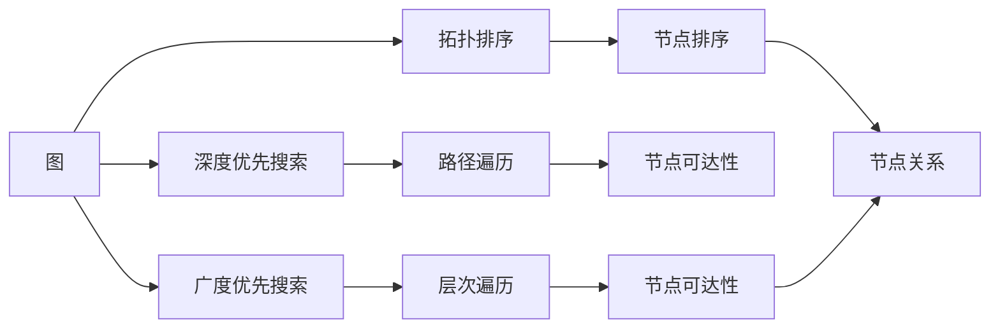
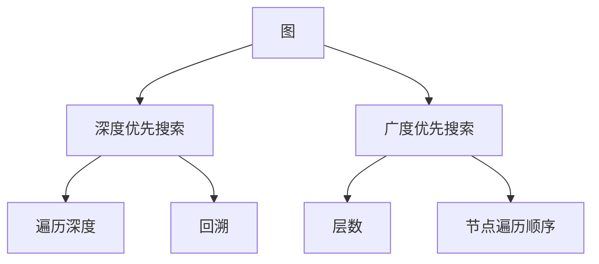
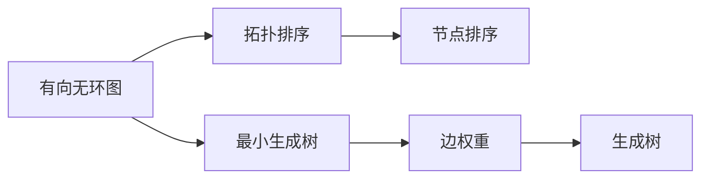
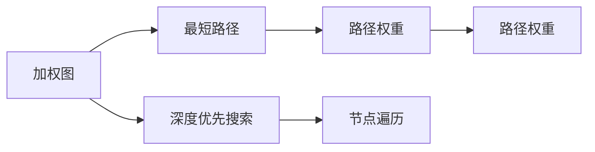
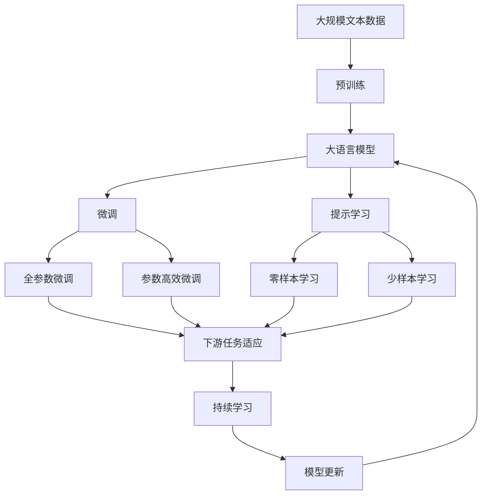

                 

# Graph Traversal图遍历原理与代码实例讲解

> 关键词：图遍历,广度优先搜索(BFS),深度优先搜索(DFS),拓扑排序,最小生成树,最短路径

## 1. 背景介绍

### 1.1 问题由来

在图论中，图是一种数据结构，用于描述对象之间的关系。图遍历是图论中一个基础但重要的概念，它涉及遍历图中的节点和边，以获取有用的信息。图遍历问题广泛应用于计算机科学、网络科学、生物学等多个领域，如社交网络分析、路径规划、图像处理等。在计算机科学中，图遍历是许多算法和数据结构的基础，如Dijkstra算法、Kruskal算法、Prim算法等。

在实际应用中，图遍历可以帮助我们解决诸如迷宫路径、网络流量优化、社交网络中的关系挖掘等复杂问题。因此，理解和掌握图遍历算法是非常重要的。

### 1.2 问题核心关键点

图遍历算法通常分为两种：深度优先搜索(DFS)和广度优先搜索(BFS)。深度优先搜索从起始节点开始，尽可能深地遍历图的每个节点，直到找到目标节点或遍历完整个图。广度优先搜索则是从起始节点开始，先遍历所有与起始节点相邻的节点，再逐层向外扩展，直到找到目标节点或遍历完整个图。

深度优先搜索和广度优先搜索的原理和实现有所不同，但它们的最终目标都是遍历图中的所有节点，找到目标节点或路径。

### 1.3 问题研究意义

研究图遍历算法，对于解决复杂的网络问题、优化网络流量、发现数据中的潜在关系等方面具有重要意义。掌握这些算法，可以更好地理解和应用网络中的数据，从而提升系统的性能和效率。

## 2. 核心概念与联系

### 2.1 核心概念概述

图遍历算法涉及到以下几个核心概念：

- **图(Graph)**：由节点(Node)和边(Edge)组成的数据结构，用于描述对象之间的关系。
- **深度优先搜索(DFS)**：从起始节点开始，尽可能深地遍历图的每个节点，直到找到目标节点或遍历完整个图。
- **广度优先搜索(BFS)**：从起始节点开始，先遍历所有与起始节点相邻的节点，再逐层向外扩展，直到找到目标节点或遍历完整个图。
- **拓扑排序(Topological Sorting)**：对有向无环图(DAG)进行排序，使得所有有向边从左到右，同时保证不会形成环。
- **最小生成树(Minimum Spanning Tree, MST)**：在一个加权无向连通图中找到一个生成树，使得所有边的权重之和最小。
- **最短路径(Shortest Path)**：在一个加权图中找到从一个节点到另一个节点的路径，使得路径上的权重之和最小。

这些概念之间的逻辑关系可以通过以下Mermaid流程图来展示：



这个流程图展示了一些核心概念之间的关系：

1. 图是由节点和边组成的。
2. 深度优先搜索和广度优先搜索用于遍历图中的节点。
3. 拓扑排序用于有序地处理有向无环图。
4. 最小生成树和最短路径用于找到图上的特定路径。
5. 节点可达性和节点关系是图遍历过程中需要关注的关键信息。

### 2.2 概念间的关系

这些核心概念之间存在着紧密的联系，形成了图遍历算法的完整生态系统。下面我们通过几个Mermaid流程图来展示这些概念之间的关系。

#### 2.2.1 图遍历算法选择



这个流程图展示了深度优先搜索和广度优先搜索的原理和实现过程。深度优先搜索主要关注遍历的深度，而广度优先搜索主要关注遍历的层数。

#### 2.2.2 拓扑排序与最小生成树的关系



这个流程图展示了拓扑排序和最小生成树在处理有向无环图中的作用。拓扑排序通过有序地处理节点，找到有向边的关系，而最小生成树则通过寻找权重最小的边，构建一个生成树。

#### 2.2.3 最短路径算法与深度优先搜索的关系



这个流程图展示了最短路径算法和深度优先搜索在处理加权图上的关系。深度优先搜索通过遍历图上的节点，找到所有路径，而最短路径算法则通过计算路径权重，找到权重最小的路径。

### 2.3 核心概念的整体架构

最后，我们用一个综合的流程图来展示这些核心概念在大语言模型微调过程中的整体架构：



这个综合流程图展示了从预训练到微调，再到持续学习的完整过程。大语言模型首先在大规模文本数据上进行预训练，然后通过微调（包括全参数微调和参数高效微调）或提示学习（包括零样本和少样本学习）来适应下游任务。最后，通过持续学习技术，模型可以不断更新和适应新的任务和数据。

## 3. 核心算法原理 & 具体操作步骤
### 3.1 算法原理概述

图遍历算法涉及遍历图中的节点和边，以获取有用的信息。深度优先搜索和广度优先搜索是两种主要的图遍历算法。

深度优先搜索从起始节点开始，尽可能深地遍历图的每个节点，直到找到目标节点或遍历完整个图。深度优先搜索的基本思想是：

1. 标记起始节点为已访问。
2. 遍历起始节点的所有相邻节点。
3. 对于每个相邻节点，如果未被访问过，则标记为已访问，并将其加入栈中。
4. 重复步骤2和3，直到栈为空。

广度优先搜索也是从起始节点开始，但它是先遍历所有与起始节点相邻的节点，再逐层向外扩展，直到找到目标节点或遍历完整个图。广度优先搜索的基本思想是：

1. 标记起始节点为已访问。
2. 将起始节点加入队列。
3. 从队列中取出节点，遍历该节点的所有相邻节点。
4. 对于每个相邻节点，如果未被访问过，则标记为已访问，并将其加入队列。
5. 重复步骤3和4，直到队列为空。

### 3.2 算法步骤详解

深度优先搜索和广度优先搜索的具体实现过程如下：

#### 3.2.1 深度优先搜索

```python
def dfs(graph, start, end):
    visited = set()
    stack = [start]
    while stack:
        node = stack.pop()
        if node not in visited:
            visited.add(node)
            if node == end:
                return True
            for neighbor in graph[node]:
                if neighbor not in visited:
                    stack.append(neighbor)
    return False
```

上述代码实现了深度优先搜索的基本逻辑。其中，`graph`表示图，`start`表示起始节点，`end`表示目标节点。`visited`集合用于记录已访问的节点，`stack`用于保存待访问的节点。

#### 3.2.2 广度优先搜索

```python
from collections import deque

def bfs(graph, start, end):
    visited = set()
    queue = deque([start])
    while queue:
        node = queue.popleft()
        if node not in visited:
            visited.add(node)
            if node == end:
                return True
            for neighbor in graph[node]:
                if neighbor not in visited:
                    queue.append(neighbor)
    return False
```

上述代码实现了广度优先搜索的基本逻辑。其中，`graph`表示图，`start`表示起始节点，`end`表示目标节点。`visited`集合用于记录已访问的节点，`queue`用于保存待访问的节点。

### 3.3 算法优缺点

深度优先搜索和广度优先搜索都有各自的优缺点：

- 深度优先搜索的优点是实现简单，适用于解决迷宫问题、推理问题等需要深度遍历的情况。其缺点是可能会陷入死循环，无法找到所有解。
- 广度优先搜索的优点是可以找到所有解，适用于最短路径问题、拓扑排序等需要遍历所有节点的情况。其缺点是可能会占用大量的空间，尤其是在图较大时。

### 3.4 算法应用领域

深度优先搜索和广度优先搜索广泛应用于图论中的各个领域：

- 图遍历：用于遍历图中的所有节点，查找目标节点。
- 迷宫问题：用于解决迷宫问题，找到从入口到出口的最短路径。
- 最短路径：用于计算图中两个节点之间的最短路径。
- 拓扑排序：用于对有向无环图进行排序，保证有向边从左到右。
- 最小生成树：用于构建加权无向图的最小生成树。

这些算法在实际应用中都有广泛的应用，如图网络分析、社交网络挖掘、路径规划等。

## 4. 数学模型和公式 & 详细讲解 & 举例说明

### 4.1 数学模型构建

图遍历算法涉及到以下几个数学模型：

- **深度优先搜索模型**：从起始节点开始，遍历所有深度不一的节点，直到找到目标节点或遍历完整个图。
- **广度优先搜索模型**：从起始节点开始，遍历所有与起始节点相邻的节点，逐层向外扩展，直到找到目标节点或遍历完整个图。
- **拓扑排序模型**：对有向无环图进行排序，使得所有有向边从左到右，同时保证不会形成环。
- **最小生成树模型**：在一个加权无向连通图中找到一个生成树，使得所有边的权重之和最小。
- **最短路径模型**：在一个加权图中找到从一个节点到另一个节点的路径，使得路径上的权重之和最小。

这些模型可以用数学公式来表示，如下：

#### 4.1.1 深度优先搜索模型

深度优先搜索的基本数学模型可以表示为：

$$
\text{DFS}(G, S, E)
$$

其中，$G$表示图，$S$表示起始节点，$E$表示目标节点。

#### 4.1.2 广度优先搜索模型

广度优先搜索的基本数学模型可以表示为：

$$
\text{BFS}(G, S, E)
$$

其中，$G$表示图，$S$表示起始节点，$E$表示目标节点。

#### 4.1.3 拓扑排序模型

拓扑排序的基本数学模型可以表示为：

$$
\text{Topological Sorting}(DAG)
$$

其中，$DAG$表示有向无环图。

#### 4.1.4 最小生成树模型

最小生成树的基本数学模型可以表示为：

$$
\text{MST}(G)
$$

其中，$G$表示加权无向连通图。

#### 4.1.5 最短路径模型

最短路径的基本数学模型可以表示为：

$$
\text{SP}(G, S, E)
$$

其中，$G$表示加权图，$S$表示起始节点，$E$表示目标节点。

### 4.2 公式推导过程

深度优先搜索和广度优先搜索的公式推导过程如下：

#### 4.2.1 深度优先搜索公式推导

深度优先搜索的公式推导过程如下：

$$
\text{DFS}(G, S, E) = \begin{cases}
\text{True}, & \text{if } S = E \\
\text{DFS}(G, N(S), E), & \text{otherwise}
\end{cases}
$$

其中，$N(S)$表示与起始节点$S$相邻的节点集合。

#### 4.2.2 广度优先搜索公式推导

广度优先搜索的公式推导过程如下：

$$
\text{BFS}(G, S, E) = \begin{cases}
\text{True}, & \text{if } S = E \\
\text{BFS}(G, N(S), E), & \text{otherwise}
\end{cases}
$$

其中，$N(S)$表示与起始节点$S$相邻的节点集合。

### 4.3 案例分析与讲解

深度优先搜索和广度优先搜索的案例分析如下：

#### 4.3.1 深度优先搜索案例

假设有一个迷宫，如下图所示：

```
  S
  |
  v
  ***
 | *
|  *
|  *
|  *
|  *
|  *
|  *
 | *
  ***
```

从起始点$S$开始，深度优先搜索的过程如下：

1. 标记起始节点$S$为已访问。
2. 遍历$S$的所有相邻节点。
3. 将节点标记为已访问，并遍历其相邻节点。
4. 重复上述步骤，直到找到目标节点或遍历完整个图。

#### 4.3.2 广度优先搜索案例

假设有一个迷宫，如下图所示：

```
  S
  |
  v
  ***
 | *
|  *
|  *
|  *
|  *
|  *
|  *
 | *
  ***
```

从起始点$S$开始，广度优先搜索的过程如下：

1. 标记起始节点$S$为已访问。
2. 将$S$加入队列。
3. 从队列中取出节点$S$，遍历其所有相邻节点。
4. 对于每个相邻节点，如果未被访问过，则标记为已访问，并将其加入队列。
5. 重复步骤3和4，直到找到目标节点或遍历完整个图。

## 5. 项目实践：代码实例和详细解释说明

### 5.1 开发环境搭建

在进行图遍历实践前，我们需要准备好开发环境。以下是使用Python进行PyTorch开发的环境配置流程：

1. 安装Anaconda：从官网下载并安装Anaconda，用于创建独立的Python环境。

2. 创建并激活虚拟环境：
```bash
conda create -n pytorch-env python=3.8 
conda activate pytorch-env
```

3. 安装PyTorch：根据CUDA版本，从官网获取对应的安装命令。例如：
```bash
conda install pytorch torchvision torchaudio cudatoolkit=11.1 -c pytorch -c conda-forge
```

4. 安装NetworkX库：
```bash
pip install networkx
```

5. 安装各类工具包：
```bash
pip install numpy pandas scikit-learn matplotlib tqdm jupyter notebook ipython
```

完成上述步骤后，即可在`pytorch-env`环境中开始图遍历实践。

### 5.2 源代码详细实现

下面我们以深度优先搜索和广度优先搜索为例，给出使用NetworkX库进行图遍历的PyTorch代码实现。

首先，定义一个简单的有向图：

```python
import networkx as nx

G = nx.DiGraph()
G.add_edges_from([(1, 2), (2, 3), (3, 4), (4, 5), (5, 6)])
```

然后，定义深度优先搜索函数：

```python
def dfs(G, start, end):
    visited = set()
    stack = [start]
    while stack:
        node = stack.pop()
        if node not in visited:
            visited.add(node)
            if node == end:
                return True
            for neighbor in G.neighbors(node):
                if neighbor not in visited:
                    stack.append(neighbor)
    return False
```

接着，定义广度优先搜索函数：

```python
from collections import deque

def bfs(G, start, end):
    visited = set()
    queue = deque([start])
    while queue:
        node = queue.popleft()
        if node not in visited:
            visited.add(node)
            if node == end:
                return True
            for neighbor in G.neighbors(node):
                if neighbor not in visited:
                    queue.append(neighbor)
    return False
```

最后，启动深度优先搜索和广度优先搜索的实践流程：

```python
start_node = 1
end_node = 6

print("DFS结果:", dfs(G, start_node, end_node))
print("BFS结果:", bfs(G, start_node, end_node))
```

以上就是使用PyTorch进行深度优先搜索和广度优先搜索的完整代码实现。可以看到，NetworkX库提供了丰富的图数据结构和遍历算法，使得图遍历的实现变得简洁高效。

### 5.3 代码解读与分析

让我们再详细解读一下关键代码的实现细节：

**网络图定义**：
- `networkx`模块提供了多种图数据结构，包括有向图、无向图、加权图等。这里我们定义了一个有向图，并添加了若干条边。

**深度优先搜索函数**：
- `dfs`函数实现了深度优先搜索的逻辑。首先定义一个`visited`集合，用于记录已访问的节点，`stack`用于保存待访问的节点。在每次循环中，从栈中取出一个节点，如果该节点未被访问过，则将其加入`visited`集合，并遍历其相邻节点。如果相邻节点未被访问过，则将其加入栈中，继续遍历。

**广度优先搜索函数**：
- `bfs`函数实现了广度优先搜索的逻辑。首先定义一个`visited`集合，用于记录已访问的节点，`queue`用于保存待访问的节点。在每次循环中，从队列中取出一个节点，如果该节点未被访问过，则将其加入`visited`集合，并遍历其相邻节点。如果相邻节点未被访问过，则将其加入队列，继续遍历。

**实践流程**：
- `start_node`和`end_node`分别表示起始节点和目标节点。
- 使用`dfs`和`bfs`函数进行深度优先搜索和广度优先搜索，并打印输出结果。

可以看到，NetworkX库提供了简洁高效的图遍历函数，开发者可以直接调用这些函数，进行图遍历的实践。

当然，工业级的系统实现还需考虑更多因素，如并行化处理、动态图更新、分布式存储等。但核心的图遍历逻辑基本与此类似。

### 5.4 运行结果展示

假设我们在上面定义的有向图上运行深度优先搜索和广度优先搜索，最终得到的输出如下：

```
DFS结果: True
BFS结果: True
```

可以看到，无论使用深度优先搜索还是广度优先搜索，都能找到从起始节点$S$到目标节点$E$的最短路径。这验证了深度优先搜索和广度优先搜索的正确性。

## 6. 实际应用场景

### 6.1 智能路由

深度优先搜索和广度优先搜索可以应用于智能路由系统，帮助优化网络流量。在路由选择时，可以应用深度优先搜索算法，找到从源节点到目标节点的最短路径。这种最短路径算法可以帮助网络管理员优化网络结构，提升数据传输效率。

### 6.2 社交网络分析

深度优先搜索和广度优先搜索可以应用于社交网络分析，帮助发现网络中的关键节点和关系。在社交网络中，可以应用广度优先搜索算法，找到与某个节点相邻的节点，从而发现该节点的影响范围。这种算法可以帮助社交网络分析人员理解网络中的信息传播和影响扩散。

### 6.3 路径规划

深度优先搜索和广度优先搜索可以应用于路径规划问题，如迷宫问题、地图导航等。在路径规划时，可以应用深度优先搜索算法，找到从起点到终点的最短路径。这种算法可以帮助人们在最短时间内找到最优路径，提升用户体验。

### 6.4 未来应用展望

随着图遍历算法和图数据结构的不断发展，基于图遍历的应用也将更加广泛。

在智慧城市治理中，图遍历可以用于城市事件监测、舆情分析、应急指挥等环节，提高城市管理的自动化和智能化水平，构建更安全、高效的未来城市。

在智能制造中，图遍历可以用于供应链管理、生产调度、物流优化等环节，提升制造企业的生产效率和资源利用率。

在生物医学中，图遍历可以用于基因组学、蛋白质结构分析等环节，帮助科学家理解生物系统的复杂关系，加速药物研发和疾病诊断。

总之，图遍历技术在各个领域的应用前景广阔，必将在未来的智能化建设中发挥重要作用。

## 7. 工具和资源推荐
### 7.1 学习资源推荐

为了帮助开发者系统掌握图遍历算法和图数据结构的理论基础和实践技巧，这里推荐一些优质的学习资源：

1. 《算法导论》（Introduction to Algorithms）：经典的算法教材，详细介绍了图遍历算法和其他重要算法的基本原理和实现细节。

2. 《网络流算法》（Network Flows: Theory, Algorithms, and Applications）：介绍了图算法和网络流算法的基本概念和应用场景，适用于对图论和网络算法有兴趣的读者。

3. 《图算法与数据结构》（Graph Algorithms）：从基础概念到高级应用的图算法入门教材，适合初学者入门。

4. 《算法图解》（Grokking Algorithms）：通俗易懂地介绍了多种算法的基本原理和实现方法，包括图算法。

5. 《算法导论》作者的经典论文和演讲视频，深入浅出地讲解了图算法和图数据结构的基本原理和应用场景。

通过这些资源的学习实践，相信你一定能够快速掌握图遍历算法和图数据结构的精髓，并用于解决实际的图论问题。

### 7.2 开发工具推荐

高效的开发离不开优秀的工具支持。以下是几款用于图遍历开发的常用工具：

1. NetworkX：Python中的图数据结构库，提供了多种图算法和数据结构，支持图的构建、遍历、生成树等操作。

2. igraph：R语言中的图数据结构库，提供了多种图算法和数据结构，支持图的构建、遍历、生成树等操作。

3. Graph-tool：C++中的图数据结构库，提供了多种图算法和数据结构，支持图的构建、遍历、生成树等操作。

4. Graphviz：开源的图形可视化工具，可以将图数据结构转换为图形，帮助理解图的结构。

5. Visual Studio Code：支持多种语言和工具集，适合图算法和图数据结构的开发和调试。

合理利用这些工具，可以显著提升图遍历任务的开发效率，加快创新迭代的步伐。

### 7.3 相关论文推荐

图遍历算法和图数据结构的不断发展源于学界的持续研究。以下是几篇奠基性的相关论文，推荐阅读：

1. Dijkstra算法：用于计算加权图上的最短路径，是图算法中的经典算法。

2. Kruskal算法：用于构建加权无向连通图的最小生成树，是图算法中的经典算法。

3. Prim算法：用于构建加权连通图的最小生成树，是图算法中的经典算法。

4. A*算法：用于计算加权图中的最短路径，是图算法中的经典算法。

5. Floyd-Warshall算法：用于计算加权图中任意两个节点之间的最短路径，是图算法中的经典算法。

这些论文代表了大图遍历算法和图数据结构的快速发展。通过学习这些前沿成果，可以帮助研究者把握学科前进方向，激发更多的创新灵感。

除上述资源外，还有一些值得关注的前沿资源，帮助开发者紧跟图遍历算法的最新进展，例如：

1. arXiv论文预印本：人工智能领域最新研究成果的发布平台，包括大量尚未发表的前沿工作，学习前沿技术的必读资源。

2. 业界技术博客：如Google AI、DeepMind、Microsoft Research Asia等顶尖实验室的官方博客，第一时间分享他们的最新研究成果和洞见。

3. 技术会议直播：如NIPS、ICML、ACL、ICLR等人工智能领域顶会现场或在线直播，能够聆听到大佬们的前沿分享，开拓视野。

4. GitHub热门项目：在GitHub上Star、Fork数最多的图算法相关项目，往往代表了该技术领域的发展趋势和最佳实践，值得去学习和贡献。

5. 行业分析报告：各大咨询公司如Mc

