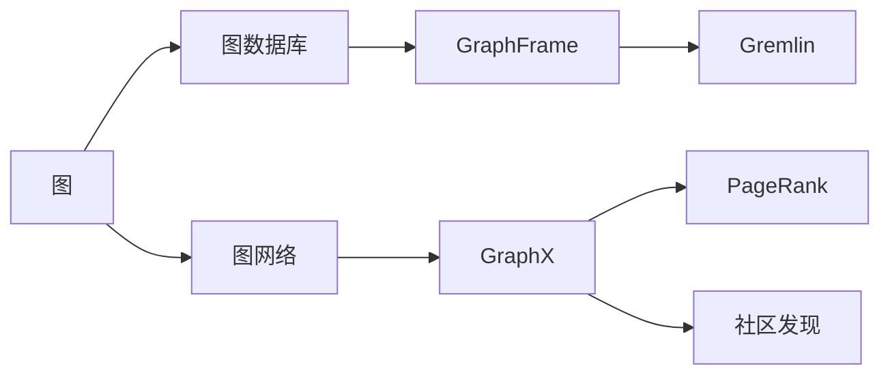

                 

# GraphX原理与代码实例讲解

## 1. 背景介绍

### 1.1 问题由来
近年来，随着大数据和计算能力的飞速发展，图网络（Graph Neural Network，GNN）逐渐成为机器学习领域的重要分支。相比于传统深度神经网络，图网络能够更好地处理图数据，尤其是具有复杂拓扑结构的数据，例如图数据库、社交网络、生物信息学网络等。然而，尽管图网络在理论研究方面取得了一系列进展，但在实际应用中仍面临一些挑战，如网络数据稀疏性、异构图结构、特征多样性等。为了更好地解决这些问题，Apache Spark社区于2018年推出了GraphX，旨在提供一个高效、易用、可扩展的图计算平台。

### 1.2 问题核心关键点
GraphX是一个基于Spark的分布式图计算框架，提供了丰富的图处理算法和数据操作接口，能够有效应对大规模图数据的计算需求。GraphX的核心特性包括：
- 图数据库：内置RDD、GraphFrame等图数据结构，支持图遍历、聚类、划分等操作。
- 分布式计算：利用Spark的分布式计算能力，支持大规模图数据的高效处理。
- 图算法库：集成了PageRank、社区发现、图生成等经典图算法。
- 动态图模型：支持流图和动态图的数据流处理。

GraphX在处理图数据时，采用了基于图结构的并行计算范式，能够利用图结构的特点进行优化。GraphX的这一特性，使得它在处理大规模图数据时具有独特的优势。

## 2. 核心概念与联系

### 2.1 核心概念概述

为更好地理解GraphX的核心概念，本节将介绍几个关键概念：

- 图（Graph）：由节点（Node）和边（Edge）组成的数据结构。图可以表示复杂的关系网络，如社交网络、交通网络、分子结构等。
- 图数据库：用于存储和管理图数据的数据库系统。GraphX支持多种图数据库，包括Gremlin、Spark GraphX等。
- 图网络（Graph Neural Network，GNN）：一种用于处理图数据的深度学习模型，能够自动学习图的表示和特征。
- 图算法：用于图数据的处理和分析的算法，如PageRank、社区发现、最小生成树等。
- 分布式计算：利用多台计算机协同计算，加速大规模图数据的处理。

这些核心概念构成了GraphX的基础，用于描述图数据的特点和处理方式。

### 2.2 概念间的关系

这些核心概念之间存在着紧密的联系，形成了GraphX的完整生态系统。下面我通过几个Mermaid流程图来展示这些概念之间的关系。



这个流程图展示了图网络、图数据库、GraphX、GraphFrame等关键概念之间的关系：

1. 图是GraphX和GraphFrame的基本数据结构。
2. 图网络是一种用于处理图数据的深度学习模型。
3. GraphX通过GraphFrame等图数据库，提供了丰富的图操作接口和算法库。
4. 图算法如PageRank、社区发现等，可以借助GraphX进行高效计算。

通过这些流程图，我们可以更清晰地理解GraphX的核心概念及其之间的关系。

## 3. 核心算法原理 & 具体操作步骤
### 3.1 算法原理概述

GraphX的算法原理主要基于图结构的并行计算范式，即利用图结构的特点进行优化。GraphX的核心算法包括PageRank、社区发现、聚类、图生成等。这里以PageRank算法为例，介绍GraphX的算法原理。

PageRank算法是Google PageRank的简化版本，用于计算网页的排名。PageRank算法通过迭代计算每个节点的重要性，最终得到每个节点的排名。GraphX中的PageRank算法也遵循这一过程，其主要步骤如下：

1. 初始化每个节点的页面权重为1。
2. 对每个节点，计算其所有邻居节点的权重之和。
3. 对每个节点，计算其所有邻居节点的权重之和。
4. 对每个节点，计算其所有邻居节点的权重之和。
5. 对每个节点，计算其所有邻居节点的权重之和。
6. 重复步骤2-5，直至收敛。

### 3.2 算法步骤详解

GraphX中的PageRank算法步骤如下：

1. 定义节点和边。GraphX中的节点和边可以表示为RDD或GraphFrame中的对象。例如，使用RDD表示图数据，可以定义为：
   ```python
   from pyspark.graphx import *
   g = GraphFrame("edges").setVertexData("vertices").setEdgeData("edges")
   ```

2. 定义节点和边的权重。GraphX中的节点和边可以带有不同的权重。例如，使用RDD表示图数据，可以定义节点权重为：
   ```python
   vertices = g.vertices.collect()
   weights = [1.0] * len(vertices)
   g = g.setVertexData("weights", weights)
   ```

3. 定义迭代次数和收敛条件。通常，需要迭代多次才能达到收敛。例如，使用RDD表示图数据，可以定义迭代次数为：
   ```python
   max_iterations = 10
   convergence_tolerance = 0.0001
   ```

4. 进行PageRank迭代计算。GraphX提供了丰富的PageRank算法接口，可以方便地进行迭代计算。例如，使用RDD表示图数据，可以进行以下计算：
   ```python
   from pyspark.graphx import graphx_page_rank

   graphx_page_rank(g, max_iterations, convergence_tolerance)
   ```

### 3.3 算法优缺点

GraphX的PageRank算法具有以下优点：
- 利用图结构的特点进行优化，加速迭代计算。
- 支持分布式计算，适用于大规模图数据的处理。
- 提供丰富的接口和算法库，方便开发者进行图处理。

然而，GraphX的PageRank算法也存在一些缺点：
- 需要占用大量内存进行迭代计算。
- 对于稀疏图，迭代计算的效率可能较低。
- 对于动态图，需要不断更新节点和边的权重，增加了计算复杂度。

### 3.4 算法应用领域

GraphX的PageRank算法广泛应用于社交网络分析、网络推荐系统、搜索引擎优化等领域。例如，在社交网络分析中，可以用于计算用户之间的影响力；在网络推荐系统中，可以用于计算物品之间的相关性；在搜索引擎优化中，可以用于计算网页之间的重要性。

## 4. 数学模型和公式 & 详细讲解  
### 4.1 数学模型构建

GraphX中的PageRank算法主要基于迭代计算的方式进行。以下是数学模型构建的详细过程。

假设图 $G=(V,E)$，其中 $V$ 为节点集，$E$ 为边集。节点的权重为 $w_i$，边的权重为 $a_{ij}$。PageRank算法的迭代公式为：
$$
\mathbf{p}_{t+1} = \frac{1}{d}\mathbf{A}^\top\mathbf{p}_t + (1-\frac{1}{d})\frac{1}{n}\mathbf{1}
$$
其中 $\mathbf{p}_t$ 为第 $t$ 次迭代后节点的权重，$\mathbf{A}$ 为邻接矩阵，$d$ 为邻接矩阵的列和，$\mathbf{1}$ 为全1向量。

### 4.2 公式推导过程

以PageRank算法为例，以下是公式推导过程：

1. 定义节点和边的权重。假设节点 $i$ 的权重为 $w_i$，边 $(i,j)$ 的权重为 $a_{ij}$。
2. 计算邻接矩阵 $\mathbf{A}$。邻接矩阵 $\mathbf{A}$ 的每个元素为边权重，即 $\mathbf{A}_{ij}=a_{ij}$。
3. 计算邻接矩阵的列和 $d$。$d$ 为邻接矩阵的列和，即 $d=\sum_{i=1}^n\sum_{j=1}^n a_{ij}$。
4. 计算迭代公式。将邻接矩阵 $\mathbf{A}$ 和权重 $\mathbf{p}_t$ 代入迭代公式，得到：
   $$
   \mathbf{p}_{t+1} = \frac{1}{d}\mathbf{A}^\top\mathbf{p}_t + (1-\frac{1}{d})\frac{1}{n}\mathbf{1}
   $$
5. 重复步骤2-4，直至收敛。

### 4.3 案例分析与讲解

以社交网络为例，假设有一个社交网络，包含 $n$ 个用户和 $m$ 条边。每个用户的权重为 1，每条边的权重为 0.1。假设进行 10 次迭代，收敛条件为迭代结果与上一次结果的差小于 $0.001$。

在GraphX中，可以使用RDD表示图数据，进行如下计算：
```python
from pyspark.graphx import *
g = GraphFrame("edges").setVertexData("vertices").setEdgeData("edges")

# 定义节点和边的权重
vertices = g.vertices.collect()
weights = [1.0] * len(vertices)
g = g.setVertexData("weights", weights)

# 定义迭代次数和收敛条件
max_iterations = 10
convergence_tolerance = 0.001

# 进行PageRank迭代计算
graphx_page_rank(g, max_iterations, convergence_tolerance)
```

通过这个示例，可以看到GraphX的PageRank算法在实际应用中的简单高效。

## 5. 项目实践：代码实例和详细解释说明
### 5.1 开发环境搭建

在进行GraphX项目实践前，我们需要准备好开发环境。以下是使用Python进行Spark开发的环境配置流程：

1. 安装Anaconda：从官网下载并安装Anaconda，用于创建独立的Python环境。

2. 创建并激活虚拟环境：
```bash
conda create -n spark-env python=3.7 
conda activate spark-env
```

3. 安装Spark：根据Spark版本，从官网获取对应的安装命令。例如：
```bash
conda install pyspark -c conda-forge
```

4. 安装Scala：
```bash
conda install scala
```

5. 安装GraphX：
```bash
pip install graphx
```

完成上述步骤后，即可在`spark-env`环境中开始GraphX项目实践。

### 5.2 源代码详细实现

这里我们以PageRank算法为例，给出使用Spark和GraphX进行计算的PyTorch代码实现。

首先，定义PageRank算法的参数：

```python
from pyspark.graphx import *
from pyspark.sql import *

# 定义节点和边的权重
vertices = g.vertices.collect()
weights = [1.0] * len(vertices)
g = g.setVertexData("weights", weights)

# 定义迭代次数和收敛条件
max_iterations = 10
convergence_tolerance = 0.001
```

接着，定义PageRank算法的迭代计算过程：

```python
from pyspark.graphx import graphx_page_rank

# 进行PageRank迭代计算
graphx_page_rank(g, max_iterations, convergence_tolerance)
```

最后，进行输出结果展示：

```python
# 输出迭代后的节点权重
print(g.vertices.collect())
```

以上就是使用Spark和GraphX进行PageRank算法的完整代码实现。可以看到，GraphX提供了丰富的接口和算法库，使得PageRank算法的实现变得简单高效。

### 5.3 代码解读与分析

让我们再详细解读一下关键代码的实现细节：

**GraphFrame类**：
- `GraphFrame("edges")`：创建GraphFrame对象，指定边数据源为"edges"。
- `setVertexData("weights", weights)`：为节点添加权重数据。

**迭代计算**：
- `graphx_page_rank(g, max_iterations, convergence_tolerance)`：进行PageRank迭代计算，参数分别为图对象、迭代次数和收敛条件。

**输出结果**：
- `g.vertices.collect()`：获取迭代后的节点权重。

通过这个示例，可以看到GraphX的PageRank算法在实际应用中的简单高效。

## 6. 实际应用场景
### 6.1 社交网络分析

社交网络分析是GraphX的重要应用场景之一。社交网络中的节点表示用户，边表示用户之间的关系。通过PageRank算法，可以计算用户之间的影响力，发现关键用户和社区。

在实践中，可以收集社交网络中的用户行为数据，如好友关系、评论互动等。通过GraphX进行计算，可以得到每个用户的PageRank权重，进而识别出关键用户和社区。例如，在Twitter上，可以用于发现最具影响力的用户和关注群体。

### 6.2 网络推荐系统

网络推荐系统是GraphX的另一个重要应用场景。在网络推荐系统中，物品和用户构成了图的网络结构。通过PageRank算法，可以计算物品和用户之间的相关性，推荐用户感兴趣的商品。

在实践中，可以收集用户的浏览、购买、评价等行为数据，构建用户-物品的矩阵。通过GraphX进行计算，可以得到每个用户和物品的PageRank权重，进而推荐用户可能感兴趣的商品。例如，在电商平台中，可以用于推荐用户可能喜欢的商品。

### 6.3 社交网络欺诈检测

社交网络欺诈检测是GraphX的另一个重要应用场景。社交网络中的节点表示用户，边表示用户之间的关系。通过PageRank算法，可以发现异常用户和欺诈团伙。

在实践中，可以收集社交网络中的用户行为数据，如好友关系、转账记录等。通过GraphX进行计算，可以得到每个用户的PageRank权重，进而识别出异常用户和欺诈团伙。例如，在金融领域中，可以用于检测异常转账和欺诈行为。

### 6.4 未来应用展望

随着GraphX技术的不断演进，未来将在更多领域得到应用，为各行各业带来变革性影响。

在智慧城市治理中，GraphX可以用于交通网络分析、垃圾回收优化等，提高城市管理的自动化和智能化水平，构建更安全、高效的未来城市。

在智慧医疗领域，GraphX可以用于疾病传播分析、医疗资源分配等，提升医疗服务的智能化水平，辅助医生诊疗，加速新药开发进程。

在智慧教育领域，GraphX可以用于学生学习路径分析、教师推荐等，因材施教，促进教育公平，提高教学质量。

除了上述这些场景外，在企业生产、社会治理、文娱传媒等众多领域，GraphX的应用也将不断涌现，为经济社会发展注入新的动力。相信随着技术的日益成熟，GraphX必将在构建智慧社会中扮演越来越重要的角色。

## 7. 工具和资源推荐
### 7.1 学习资源推荐

为了帮助开发者系统掌握GraphX的理论基础和实践技巧，这里推荐一些优质的学习资源：

1. 《GraphX权威指南》系列博文：由GraphX专家撰写，深入浅出地介绍了GraphX原理、应用场景等前沿话题。

2. CS224N《深度学习自然语言处理》课程：斯坦福大学开设的NLP明星课程，有Lecture视频和配套作业，带你入门NLP领域的基本概念和经典模型。

3. 《Spark和GraphX实战》书籍：详细介绍了Spark和GraphX的实际应用，涵盖图数据处理、图算法等诸多领域，适合初学者和进阶读者。

4. GraphX官方文档：GraphX的官方文档，提供了海量API接口和样例代码，是入门学习的必备资料。

5. GraphX用户手册：GraphX的用户手册，详细介绍了GraphX的使用方法和最佳实践，适合日常开发和问题排查。

通过这些资源的学习实践，相信你一定能够快速掌握GraphX的核心技术，并用于解决实际的图处理问题。

### 7.2 开发工具推荐

高效的开发离不开优秀的工具支持。以下是几款用于GraphX开发常用的工具：

1. PySpark：基于Python的Spark API，提供了丰富的图处理接口和操作。

2. Spark GraphX：Spark的GraphX模块，提供了分布式图计算框架。

3. Dgraph：基于Neo4j协议的分布式图数据库，提供高效的图数据存储和查询。

4. GraphLab：基于Spark的分布式图处理框架，支持大规模图数据的处理。

5. NetworkX：基于Python的图形处理库，提供丰富的图算法和数据结构。

合理利用这些工具，可以显著提升GraphX项目的开发效率，加快创新迭代的步伐。

### 7.3 相关论文推荐

GraphX技术的快速发展得益于学界的持续研究。以下是几篇奠基性的相关论文，推荐阅读：

1. "Scalable Neighborhood Aggregation for Distributed Graph Processing"：首次提出了基于广播和消息传递的图计算模型，奠定了GraphX的基础。

2. "PageRank Algorithm for Massive Social Networks"：在社交网络分析中，展示了PageRank算法的应用效果，进一步推动了GraphX的发展。

3. "GraphX: A Graph Platform for Machine Learning in Spark"：详细介绍了GraphX的设计理念和应用场景，提供了丰富的图处理接口。

4. "Parameter-Efficient Transfer Learning for NLP"：提出了Adapter等参数高效微调方法，在不增加模型参数量的情况下，也能取得不错的微调效果，为GraphX的应用提供了新的思路。

5. "Scalable Graph Machine Learning in Spark with GraphX"：介绍了GraphX的分布式图计算框架和图算法库，展示了GraphX在大规模图数据处理中的应用效果。

这些论文代表了大语言模型微调技术的发展脉络。通过学习这些前沿成果，可以帮助研究者把握学科前进方向，激发更多的创新灵感。

除上述资源外，还有一些值得关注的前沿资源，帮助开发者紧跟GraphX技术的最新进展，例如：

1. arXiv论文预印本：人工智能领域最新研究成果的发布平台，包括大量尚未发表的前沿工作，学习前沿技术的必读资源。

2. 业界技术博客：如Apache Spark、Apache GraphX等顶尖实验室的官方博客，第一时间分享他们的最新研究成果和洞见。

3. 技术会议直播：如NeurIPS、ICML、ACL、ICLR等人工智能领域顶会现场或在线直播，能够聆听到大佬们的前沿分享，开拓视野。

4. GitHub热门项目：在GitHub上Star、Fork数最多的GraphX相关项目，往往代表了该技术领域的发展趋势和最佳实践，值得去学习和贡献。

5. 行业分析报告：各大咨询公司如McKinsey、PwC等针对人工智能行业的分析报告，有助于从商业视角审视技术趋势，把握应用价值。

总之，对于GraphX技术的学习和实践，需要开发者保持开放的心态和持续学习的意愿。多关注前沿资讯，多动手实践，多思考总结，必将收获满满的成长收益。

## 8. 总结：未来发展趋势与挑战
### 8.1 总结

本文对GraphX进行了全面系统的介绍。首先阐述了GraphX和图网络的基本概念和特点，明确了其在处理大规模图数据中的优势。其次，从原理到实践，详细讲解了GraphX的PageRank算法，给出了具体的代码实现和实际应用场景。同时，本文还广泛探讨了GraphX技术在智慧城市、智慧医疗、智慧教育等领域的应用前景，展示了其强大的应用潜力。此外，本文精选了GraphX技术的各类学习资源，力求为读者提供全方位的技术指引。

通过本文的系统梳理，可以看到，GraphX作为一个高效、易用、可扩展的图计算平台，正逐步成为大规模图数据处理的重要工具。其在社交网络分析、网络推荐系统、欺诈检测等应用场景中表现出色，有望进一步推动图数据处理技术的普及和发展。

### 8.2 未来发展趋势

展望未来，GraphX技术将呈现以下几个发展趋势：

1. 图数据规模持续增大。随着物联网、智能城市的不断发展，图数据的规模将不断增长，对图处理的需求也将不断增加。

2. 异构图结构日益增多。未来的图数据不仅包含节点和边的关系，还将包含更多类型的节点和边，如时间、空间、属性等。

3. 图算法库不断丰富。随着图处理任务的增加，GraphX将不断丰富其算法库，支持更多的图处理算法和操作。

4. 分布式计算能力提升。随着Spark生态系统的不断完善，GraphX的分布式计算能力将不断提升，能够处理更大规模的图数据。

5. 图深度学习发展。未来的图深度学习将不断融合图结构和深度学习，提升图数据的表示和处理能力。

以上趋势凸显了GraphX技术的广阔前景。这些方向的探索发展，必将进一步提升GraphX在图处理中的应用水平，为大规模图数据的处理和分析带来新的突破。

### 8.3 面临的挑战

尽管GraphX技术已经取得了一定的进展，但在迈向更加智能化、普适化应用的过程中，它仍面临诸多挑战：

1. 数据质量问题。图数据的质量对GraphX的计算效果影响较大，如数据稀疏性、噪声等问题。如何提升图数据质量，是GraphX面临的重要挑战之一。

2. 算法复杂性。GraphX中的图算法往往比传统算法更加复杂，需要更高的计算能力和存储空间。如何优化算法，降低计算复杂度，是GraphX面临的另一个重要挑战。

3. 分布式计算瓶颈。尽管GraphX具有分布式计算能力，但在处理大规模图数据时，仍可能遇到计算瓶颈。如何提升分布式计算性能，是GraphX面临的重要挑战之一。

4. 硬件资源需求。GraphX的计算需求较大，需要高性能的硬件设备支持。如何降低硬件成本，提升计算效率，是GraphX面临的重要挑战之一。

5. 可解释性问题。GraphX的算法往往较为复杂，难以解释其内部工作机制和决策逻辑。如何提高GraphX的可解释性，是GraphX面临的重要挑战之一。

6. 安全性和隐私保护。GraphX处理的数据往往包含敏感信息，如何保护数据隐私和安全，是GraphX面临的重要挑战之一。

### 8.4 研究展望

面对GraphX技术面临的挑战，未来的研究需要在以下几个方面寻求新的突破：

1. 提升图数据质量。通过数据清洗、数据增强等方法，提升图数据的质量，降低数据稀疏性、噪声等问题。

2. 优化图算法。通过算法优化、模型压缩等方法，降低图算法的计算复杂度，提升计算效率。

3. 改进分布式计算。通过优化分布式计算架构、算法和调度，提升分布式计算性能，降低计算瓶颈。

4. 降低硬件成本。通过硬件优化、软件加速等方法，降低GraphX的硬件成本，提升计算效率。

5. 提高可解释性。通过引入可解释性方法、可视化工具等，提高GraphX的可解释性，增强算法的透明性和可信度。

6. 加强安全性和隐私保护。通过数据加密、访问控制等方法，加强GraphX的数据安全性和隐私保护。

这些研究方向将推动GraphX技术不断演进，使其在处理大规模图数据时更加高效、准确和安全。相信在学界和产业界的共同努力下，GraphX必将在构建智慧社会中扮演越来越重要的角色。

## 9. 附录：常见问题与解答

**Q1：GraphX是否适用于所有图数据？**

A: GraphX适用于多种图数据类型，如稀疏图、密集图、异构图等。但其在处理特定类型的图数据时，可能需要自定义图算法或操作。例如，对于稀疏图，GraphX提供了专门的稀疏图计算接口。

**Q2：GraphX中的PageRank算法如何加速迭代计算？**

A: GraphX中的PageRank算法利用分布式计算，将计算任务分配到多台计算机上，并行计算每个节点的权重。同时，GraphX支持广播和消息传递的优化策略，减少了计算过程中的数据传输和通信开销。

**Q3：GraphX的分布式计算能力如何提升？**

A: 提升GraphX的分布式计算能力，可以从以下几个方面入手：
1. 优化数据并行处理。通过分块、并行计算等方法，提升数据处理的并行度。
2. 优化算法并行度。通过算法优化、任务分解等方法，提升算法的并行度。
3. 优化通信开销。通过减少数据传输和通信开销，提升分布式计算的效率。

**Q4：GraphX在处理大规模图数据时需要注意哪些问题？**

A: 在处理大规模图数据时，GraphX需要注意以下问题：
1. 内存占用。GraphX的计算过程需要占用大量内存，需要合理管理内存，避免内存溢出。
2. 计算效率。GraphX的计算效率受硬件资源限制较大，需要选择合适的硬件设备，优化计算性能。
3. 数据分布。GraphX的分布式计算性能受数据分布的影响较大，需要合理划分数据，避免数据倾斜。
4. 算法复杂度。GraphX中的图算法往往较为复杂，需要优化算法，降低计算复杂度。

**Q5：GraphX在实际应用中需要注意哪些问题？**

A: 在实际应用中，GraphX需要注意以下问题：
1. 数据质量。图数据的质量对GraphX的计算效果影响较大，需要保证数据的质量和完整性。
2. 算法选择。GraphX提供了多种图算法和操作，需要根据实际需求选择合适的算法。
3. 模型评估。GraphX的计算效果需要通过评估指标来衡量，需要选择合适的评估方法。
4. 可解释性。GraphX的算法往往较为复杂，需要提高算法的可解释性，增强算法的透明性和可信度。

通过以上常见问题的回答，可以看出GraphX在实际应用中仍面临一些挑战，需要进一步优化和改进。

---

作者：禅与计算机程序设计艺术 / Zen and the Art of Computer Programming

