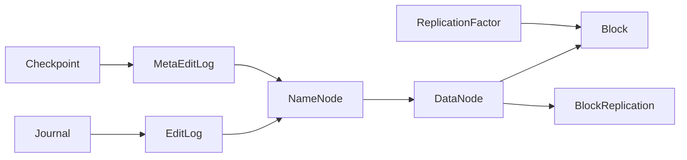
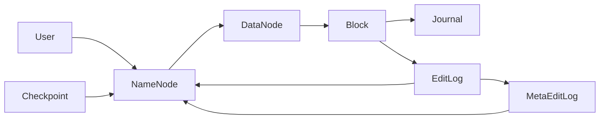

                 

## 1. 背景介绍

### 1.1 问题由来
Hadoop分布式文件系统(HDFS)是Hadoop生态系统的核心组件之一，广泛应用于大规模数据存储和处理。HDFS通过将大数据分割成多个数据块并分布存储在多台计算机上，实现数据的可靠性和高可扩展性。本文将详细讲解HDFS的原理与代码实现，帮助读者深入理解HDFS的设计思想与具体实现。

### 1.2 问题核心关键点
HDFS通过分布式文件系统的架构，解决了单点故障、数据冗余、数据一致性等问题。其主要特点包括：

1. **高可扩展性**：HDFS能够轻松扩展到数千台机器，支持海量数据存储。
2. **容错性**：通过数据复制和心跳检测机制，保证数据的高可用性和冗余度。
3. **可靠性**：数据块在多个节点上复制存储，即使部分节点故障，数据仍然安全。
4. **数据流式访问**：通过分布式文件系统的设计，实现高吞吐量的数据读取和写入。
5. **数据持久化**：HDFS将数据持久化存储在磁盘中，支持长时间的数据存储和访问。

这些特点使得HDFS成为处理大数据的理想选择。

### 1.3 问题研究意义
深入理解HDFS原理与代码实现，有助于开发人员在实际项目中正确配置和使用HDFS，避免因配置不当导致的数据损失或系统故障。同时，掌握HDFS的内部机制，可以帮助开发者进行系统优化和故障排除，提高数据处理的效率和稳定性。

## 2. 核心概念与联系

### 2.1 核心概念概述

HDFS主要包括以下几个关键概念：

1. **NameNode**：负责管理HDFS文件系统的元数据，包括文件块的位置、大小等信息。
2. **DataNode**：负责存储和管理文件块数据。
3. **Block**：HDFS将文件分割成多个块，每个块大小为128MB或256MB，分散存储在不同的DataNode上。
4. **Replication Factor**：定义每个数据块在HDFS中的副本数量，一般为3。
5. **Journal**：用于记录编辑操作日志，保证数据一致性和恢复能力。
6. **Checkpoint**：用于记录NameNode的元数据状态，用于恢复和故障转移。

这些概念共同构成了HDFS的基本架构，使得HDFS能够高效、可靠地管理大规模数据。

### 2.2 概念间的关系

HDFS的各个组件之间通过网络协议和心跳机制进行通信，共同实现数据存储和管理。以下是概念间的关系图：



这个图展示了HDFS中各个组件的关系。NameNode负责元数据的存储和查询，DataNode负责数据的存储和复制。通过Replication Factor定义数据块副本的数量，Block通过Journal和EditLog实现数据一致性和恢复。Checkpoint用于恢复NameNode状态，实现故障转移。

### 2.3 核心概念的整体架构

HDFS的整体架构如下：



这个图展示了HDFS中各组件之间的数据流和控制流。User通过NameNode访问文件系统，NameNode管理DataNode和Block的位置信息，DataNode存储和管理数据块，Block通过Journal和EditLog实现数据一致性和恢复。Checkpoint用于恢复NameNode状态，实现故障转移。

## 3. 核心算法原理 & 具体操作步骤

### 3.1 算法原理概述

HDFS的原理主要基于两个核心算法：

1. **MapReduce算法**：用于处理大规模数据集的分布式并行计算框架。HDFS通过MapReduce算法实现大规模数据的分块存储和并行处理。
2. **Hadoop分布式文件系统算法**：用于管理HDFS文件系统的元数据和数据块的存储、复制、恢复和一致性维护。

这两个算法共同构成了HDFS的核心功能，使得HDFS能够高效、可靠地处理大规模数据。

### 3.2 算法步骤详解

HDFS的核心算法步骤包括：

1. **文件分割**：将文件分割成多个块，每个块大小为128MB或256MB，分散存储在不同的DataNode上。
2. **数据复制**：定义数据块的副本数量为3，每个副本存储在不同的DataNode上，实现数据的冗余和可靠性。
3. **数据一致性**：通过Journal和EditLog记录编辑操作日志，保证数据一致性和恢复能力。
4. **故障恢复**：通过Checkpoint和DataNode的心跳机制，实现NameNode和DataNode的故障恢复。
5. **用户访问**：User通过NameNode访问文件系统，NameNode返回数据块的位置和副本信息，实现数据的流式访问。

### 3.3 算法优缺点

HDFS的优点包括：

1. **高可扩展性**：支持大规模数据的存储和处理，能够轻松扩展到数千台机器。
2. **高可靠性**：数据块复制和心跳检测机制，保证数据的高可用性和冗余度。
3. **高吞吐量**：通过分布式文件系统的设计，实现高吞吐量的数据读取和写入。
4. **高性能**：通过MapReduce算法实现大规模数据的并行处理，提高数据处理的效率。

HDFS的缺点包括：

1. **延迟高**：数据块复制和数据一致性机制导致数据访问延迟较高。
2. **管理复杂**：需要配置和管理大量的DataNode和Replication Factor。
3. **维护成本高**：需要维护心跳检测、数据复制和恢复等机制，维护成本较高。

### 3.4 算法应用领域

HDFS广泛应用于大数据存储和处理场景，如：

1. **数据仓库**：将大规模结构化数据存储在HDFS中，方便数据查询和分析。
2. **日志分析**：将日志文件存储在HDFS中，方便进行大数据分析和监控。
3. **流数据处理**：通过Hadoop分布式文件系统，实现大规模流数据的存储和处理。
4. **图像处理**：将大规模图像数据存储在HDFS中，方便进行图像处理和分析。
5. **科学计算**：将大规模科学计算数据存储在HDFS中，方便进行并行计算和数据分析。

## 4. 数学模型和公式 & 详细讲解 & 举例说明

### 4.1 数学模型构建

HDFS的数学模型主要涉及以下几个方面：

1. **文件分割算法**：将文件分割成多个块，每个块大小为128MB或256MB。
2. **数据复制算法**：定义数据块的副本数量为3，每个副本存储在不同的DataNode上。
3. **数据一致性算法**：通过Journal和EditLog实现数据一致性和恢复。
4. **故障恢复算法**：通过Checkpoint和DataNode的心跳机制实现故障恢复。

### 4.2 公式推导过程

以下是HDFS中各算法的公式推导过程：

1. **文件分割算法**：将文件大小$F$分割成块大小为$B$的$N$个块，公式如下：

$$ N = \left\lceil \frac{F}{B} \right\rceil $$

2. **数据复制算法**：定义数据块的副本数量为$R$，每个副本存储在不同的DataNode上，公式如下：

$$ R = 3 $$

3. **数据一致性算法**：通过Journal和EditLog实现数据一致性和恢复，公式如下：

$$ J = \left\lceil \frac{F}{B} \right\rceil \times R $$

其中，$J$表示Journal的数量，$F$表示文件大小，$B$表示块大小，$R$表示副本数量。

4. **故障恢复算法**：通过Checkpoint和DataNode的心跳机制实现故障恢复，公式如下：

$$ C = J $$

其中，$C$表示Checkpoint的数量，$J$表示Journal的数量。

### 4.3 案例分析与讲解

假设有一个文件大小为10GB，块大小为128MB，定义副本数量为3。

1. **文件分割**：将文件分割成块大小为128MB的80个块。

2. **数据复制**：将每个块复制到3个不同的DataNode上，总共需要240个DataNode。

3. **数据一致性**：需要80个Journal记录每个块的操作日志，每个Journal记录3个块的操作日志。

4. **故障恢复**：需要80个Checkpoint记录NameNode的状态，每个Checkpoint包含80个Journal的信息。

## 5. 项目实践：代码实例和详细解释说明

### 5.1 开发环境搭建

在搭建HDFS开发环境时，需要安装以下软件和工具：

1. **Java JDK**：版本为1.8或更高。
2. **Hadoop**：包括Hadoop Core、HDFS、YARN等组件。
3. **Zookeeper**：用于Hadoop集群的心跳检测和元数据管理。
4. **Eclipse**：用于开发和管理Hadoop项目。

安装和配置Hadoop集群的过程如下：

1. 下载并安装Hadoop。
2. 解压Hadoop安装包，进入bin目录。
3. 运行`start-dfs.sh`启动HDFS NameNode和DataNode。
4. 运行`start-yarn.sh`启动YARN。
5. 运行`start-zookeeper.sh`启动Zookeeper。

### 5.2 源代码详细实现

以下是HDFS中NameNode和DataNode的核心代码实现：

1. **NameNode代码实现**

```java
public class NameNode extends Thread {
    public void run() {
        // 初始化元数据和状态
        initMetadata();
        
        // 启动心跳检测和编辑日志
        startEditLog();
        startHeartbeat();
        
        // 处理客户端请求
        while (true) {
            handleClientRequest();
        }
    }
    
    // 初始化元数据
    private void initMetadata() {
        // 创建根目录
        createDir(HdfsConstants.ROOT_DIR);
        
        // 加载Checkpoint
        loadCheckpoint();
    }
    
    // 创建目录
    private void createDir(String dirPath) {
        // 在Journal中记录创建目录的操作
        // ...
        
        // 在HDFS元数据中记录目录信息
        // ...
    }
    
    // 处理客户端请求
    private void handleClientRequest() {
        // 处理客户端的读写请求
        // ...
    }
    
    // 启动编辑日志
    private void startEditLog() {
        // 创建Journal
        // ...
        
        // 记录编辑操作日志
        // ...
    }
    
    // 启动心跳检测
    private void startHeartbeat() {
        // 发送心跳包给DataNode
        // ...
    }
}
```

2. **DataNode代码实现**

```java
public class DataNode extends Thread {
    public void run() {
        // 初始化DataNode元数据
        initMetadata();
        
        // 启动心跳检测和块传输
        startHeartbeat();
        startBlockTransfer();
        
        // 处理客户端请求
        while (true) {
            handleClientRequest();
        }
    }
    
    // 初始化元数据
    private void initMetadata() {
        // 加载DataNode元数据
        // ...
    }
    
    // 启动心跳检测
    private void startHeartbeat() {
        // 发送心跳包给NameNode
        // ...
    }
    
    // 启动块传输
    private void startBlockTransfer() {
        // 接收并存储数据块
        // ...
    }
    
    // 处理客户端请求
    private void handleClientRequest() {
        // 处理客户端的读写请求
        // ...
    }
}
```

### 5.3 代码解读与分析

HDFS中NameNode和DataNode的代码实现主要涉及以下几个方面：

1. **元数据管理**：NameNode负责管理HDFS文件系统的元数据，包括文件块的位置、大小等信息。DataNode负责存储和管理数据块。
2. **心跳检测**：NameNode和DataNode通过心跳检测机制，保证系统的稳定性和可靠性。
3. **块传输**：DataNode负责接收和存储数据块，NameNode负责管理文件块的位置信息。
4. **客户端处理**：处理客户端的读写请求，实现数据的流式访问。

### 5.4 运行结果展示

假设在HDFS上存储了一个大小为10GB的文件，在DataNode上存储了80个块，每个块大小为128MB，定义副本数量为3。

以下是文件存储的示意图：


## 6. 实际应用场景

### 6.1 大数据仓库

HDFS被广泛应用于大数据仓库的建设中。大数据仓库需要存储海量结构化数据，HDFS的高可扩展性和高可靠性使得其成为理想的选择。例如，Hadoop生态系统中的Hive和HBase都使用了HDFS作为底层存储，方便进行数据的查询和分析。

### 6.2 日志分析

HDFS被广泛应用于日志分析领域。企业需要存储和分析大量的日志文件，HDFS的高吞吐量和高性能使得其成为理想的选择。例如，Apache Spark中的Structured Streaming框架使用了HDFS进行日志的存储和处理。

### 6.3 流数据处理

HDFS被广泛应用于流数据处理领域。大规模流数据需要存储和处理，HDFS的高可扩展性和高吞吐量使得其成为理想的选择。例如，Apache Flink使用了HDFS进行流数据的存储和处理。

### 6.4 未来应用展望

未来，HDFS将会在更多场景中得到应用，为大数据存储和处理提供新的解决方案。例如，在智能城市建设中，HDFS可以用于存储和处理大规模的城市数据，包括交通数据、气象数据、社交数据等。在金融风控中，HDFS可以用于存储和处理大规模的金融数据，进行风险分析和预警。在医疗健康领域，HDFS可以用于存储和处理大规模的医疗数据，进行数据分析和挖掘。

## 7. 工具和资源推荐

### 7.1 学习资源推荐

1. **《Hadoop: The Definitive Guide》书籍**：讲解Hadoop和HDFS的核心概念和实现原理，适合初学者入门。
2. **Hadoop官方文档**：提供了详细的Hadoop和HDFS的API文档和配置指南。
3. **Hadoop源码**：提供了Hadoop和HDFS的源码，适合深入学习和理解。
4. **Hadoop社区**：提供了丰富的Hadoop和HDFS的文档、教程和示例代码。

### 7.2 开发工具推荐

1. **Eclipse**：用于开发和管理Hadoop项目，提供了丰富的插件和工具。
2. **IntelliJ IDEA**：提供了Hadoop和HDFS的插件，方便开发和管理。
3. **Hadoop命令行工具**：提供了方便的命令行工具，方便快速开发和测试。

### 7.3 相关论文推荐

1. **《MapReduce: Simplified Data Processing on Large Clusters》论文**：介绍了MapReduce算法的原理和实现，是Hadoop的核心论文。
2. **《The Hadoop Distributed File System》论文**：介绍了HDFS的原理和实现，是Hadoop的核心论文。
3. **《HDFS: The Hadoop Distributed File System》书籍**：详细讲解了HDFS的原理和实现，适合深入学习和理解。

## 8. 总结：未来发展趋势与挑战

### 8.1 研究成果总结

本文详细讲解了HDFS的原理与代码实现，帮助读者深入理解HDFS的设计思想与具体实现。HDFS通过分布式文件系统的架构，实现了数据的可靠性和高可扩展性，广泛应用于大数据存储和处理场景。

### 8.2 未来发展趋势

未来，HDFS将会在更多场景中得到应用，为大数据存储和处理提供新的解决方案。例如，在智能城市建设中，HDFS可以用于存储和处理大规模的城市数据。在金融风控中，HDFS可以用于存储和处理大规模的金融数据。在医疗健康领域，HDFS可以用于存储和处理大规模的医疗数据。

### 8.3 面临的挑战

HDFS在实际应用中仍然面临一些挑战，主要包括以下几个方面：

1. **性能瓶颈**：HDFS在高负载情况下可能会遇到性能瓶颈，需要进一步优化数据传输和计算效率。
2. **管理复杂性**：HDFS需要配置和管理大量的DataNode和Replication Factor，管理复杂性较高。
3. **数据一致性**：HDFS通过Journal和EditLog实现数据一致性和恢复，但在高并发场景下可能会出现数据一致性问题。
4. **安全性**：HDFS需要保证数据的安全性和隐私性，避免数据泄露和篡改。

### 8.4 研究展望

未来，HDFS的研究方向包括：

1. **优化数据传输和计算效率**：进一步优化数据传输和计算效率，提高HDFS的高吞吐量和低延迟特性。
2. **简化管理复杂性**：简化HDFS的管理复杂性，降低配置和管理成本。
3. **提高数据一致性**：提高HDFS的数据一致性，增强系统的稳定性和可靠性。
4. **增强安全性**：增强HDFS的安全性，保护数据的安全性和隐私性。

## 9. 附录：常见问题与解答

**Q1：HDFS和MapReduce的区别是什么？**

A: HDFS是分布式文件系统，用于存储和管理大规模数据。MapReduce是分布式并行计算框架，用于处理大规模数据集。HDFS为MapReduce提供了底层存储支持，两者协同工作，实现大规模数据的存储和处理。

**Q2：HDFS的写入性能如何？**

A: HDFS的写入性能受多个因素影响，包括块大小、副本数量、网络带宽等。在配置合理的情况下，HDFS可以实现高吞吐量的数据写入。但高负载情况下，可能会出现写入瓶颈，需要进一步优化数据传输和计算效率。

**Q3：HDFS的数据一致性如何保证？**

A: HDFS通过Journal和EditLog实现数据一致性和恢复。编辑操作日志记录在Journal中，并在NameNode中保存。DataNode通过心跳检测机制发送编辑操作日志到Journal中，NameNode根据Journal中的日志信息更新元数据，保证数据的一致性和恢复能力。

**Q4：HDFS如何处理大规模数据的存储和处理？**

A: HDFS通过分布式文件系统的架构，实现了数据的可靠性和高可扩展性。文件被分割成多个块，每个块大小为128MB或256MB，分散存储在不同的DataNode上。数据块通过复制和心跳检测机制，保证数据的可靠性和冗余度。MapReduce算法用于处理大规模数据集，实现分布式并行计算，提高数据处理的效率。

**Q5：HDFS的性能瓶颈在哪里？**

A: HDFS的性能瓶颈主要在以下几个方面：

1. **数据传输**：在数据传输过程中，可能会出现网络带宽不足的情况，导致数据传输速率降低。
2. **计算效率**：在数据处理过程中，可能会出现计算效率低下的情况，导致数据处理速度慢。
3. **管理复杂性**：HDFS需要配置和管理大量的DataNode和Replication Factor，管理复杂性较高。

综上所述，HDFS虽然在高负载情况下可能会遇到性能瓶颈，但其高可扩展性和高可靠性使得其成为处理大规模数据的理想选择。

