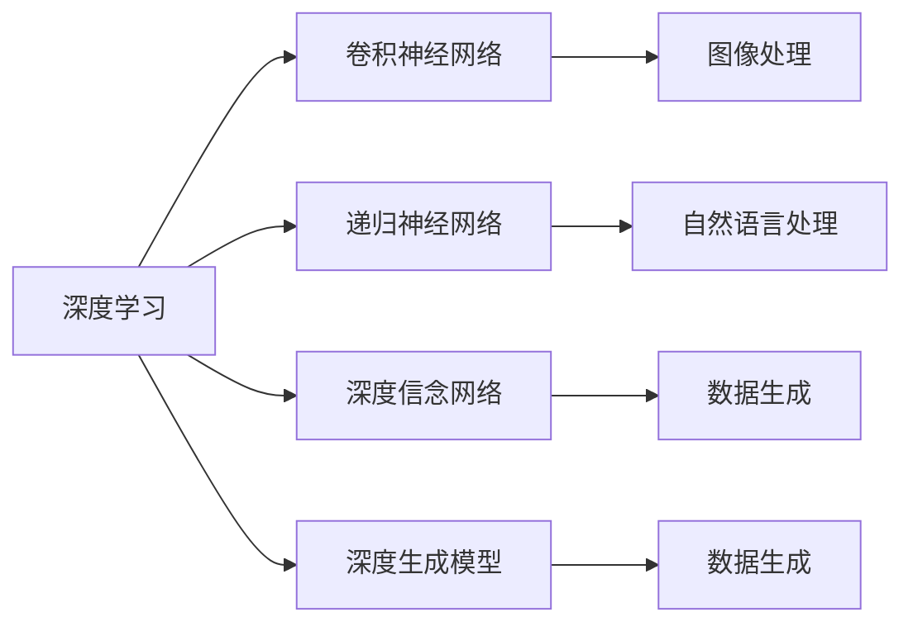
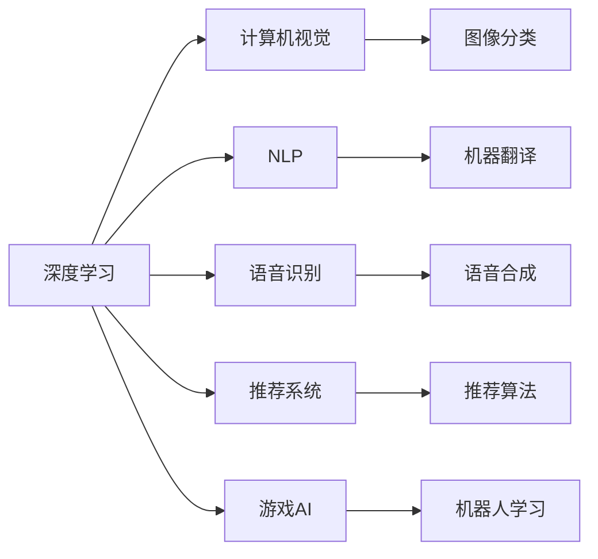

                 

## 1. 背景介绍

> 人工智能 (AI) 领域的发展离不开一批杰出的科学家和工程师的贡献。其中，**Geoffrey Hinton**、**Yann LeCun** 和 **Yoshua Bengio** 堪称 AI 算法的奠基者，他们的工作在深度学习、神经网络等领域奠定了坚实的基础。本文将详细介绍这三位科学家的主要贡献，并探讨他们对 AI 发展的深远影响。

## 2. 核心概念与联系

### 2.1 核心概念概述

#### 2.1.1 深度学习 (Deep Learning)

深度学习是机器学习的一个分支，通过构建多层的神经网络来自动地提取和表示输入数据的高层次特征。它的关键在于使用反向传播算法来更新神经网络的权重，以最小化预测误差。

#### 2.1.2 卷积神经网络 (Convolutional Neural Networks, CNN)

卷积神经网络是一种特殊的神经网络，用于处理具有网格结构的数据，如图像和视频。它通过卷积层、池化层和全连接层来提取和融合图像特征，进而进行分类或识别。

#### 2.1.3 递归神经网络 (Recurrent Neural Networks, RNN)

递归神经网络是一种能够处理序列数据的神经网络。它通过循环连接来捕捉时间依赖性，广泛应用于自然语言处理、语音识别等任务。

#### 2.1.4 深度信念网络 (Deep Belief Networks, DBN)

深度信念网络是一种生成式模型，由多个受限玻尔兹曼机层级堆叠而成。它可以自动学习输入数据的概率分布，并用于生成新的数据样本。

#### 2.1.5 循环神经网络 (Long Short-Term Memory, LSTM)

LSTM 是一种特殊的递归神经网络，能够更好地处理长序列数据。它通过记忆细胞和门控结构来控制信息流动，避免梯度消失问题，广泛应用于文本生成和语音识别。

#### 2.1.6 深度生成模型 (Deep Generative Models)

深度生成模型包括自编码器、生成对抗网络等，用于生成逼真的数据样本，如图像、音频和文本。这些模型通过反向传播算法学习数据生成过程，进而生成新的数据。

### 2.2 概念间的关系

> 深度学习、卷积神经网络、递归神经网络、深度信念网络和深度生成模型等概念，构成了 AI 算法的核心框架。这些概念之间的联系紧密，相互依存，共同推动了 AI 技术的快速发展。以下 Mermaid 流程图展示了这些概念之间的关系：



## 3. 核心算法原理 & 具体操作步骤

### 3.1 算法原理概述

#### 3.1.1 神经网络的反向传播算法

神经网络的反向传播算法用于计算损失函数对各个权重参数的梯度，并根据梯度更新权重，以最小化预测误差。它通过链式法则和误差反向传播，计算每个权重参数的梯度，并使用梯度下降等优化算法来更新参数。

#### 3.1.2 卷积神经网络的卷积和池化操作

卷积神经网络通过卷积层和池化层来提取图像特征。卷积层通过卷积核对输入图像进行卷积操作，提取局部特征；池化层通过降采样操作，减少特征图的大小，提高计算效率。

#### 3.1.3 递归神经网络的时间依赖性

递归神经网络通过循环连接来处理序列数据，能够捕捉时间依赖性。其关键在于记忆细胞和门控结构，通过控制信息的流动，避免梯度消失和梯度爆炸问题。

#### 3.1.4 深度信念网络的层次化学习

深度信念网络通过多个受限玻尔兹曼机的堆叠，进行层次化学习。它首先学习底层特征，再逐步学习更高层次的特征，最终生成数据样本。

#### 3.1.5 生成对抗网络的对抗生成

生成对抗网络由生成器和判别器两个子网络组成，通过对抗训练，生成逼真的数据样本。生成器尝试生成与真实数据相似的数据，判别器尝试区分真实数据和生成数据，两者不断迭代优化，提高生成质量。

### 3.2 算法步骤详解

#### 3.2.1 神经网络的设计

1. 选择神经网络的架构，如全连接网络、卷积神经网络、递归神经网络等。
2. 设计损失函数，如均方误差、交叉熵等，用于衡量预测与真实标签的差异。
3. 使用反向传播算法计算损失函数对各个权重参数的梯度。
4. 使用梯度下降等优化算法更新权重参数，以最小化预测误差。

#### 3.2.2 卷积神经网络的设计

1. 选择卷积核的大小和数量，设计卷积层、池化层和全连接层。
2. 使用卷积核对输入图像进行卷积操作，提取局部特征。
3. 使用池化层进行降采样操作，减少特征图的大小。
4. 将特征图输入全连接层进行分类或识别。

#### 3.2.3 递归神经网络的设计

1. 选择递归神经网络的架构，如 LSTM、GRU 等。
2. 设计记忆细胞和门控结构，控制信息流动。
3. 使用反向传播算法计算损失函数对各个权重参数的梯度。
4. 使用梯度下降等优化算法更新权重参数，以最小化预测误差。

#### 3.2.4 深度信念网络的设计

1. 选择深度信念网络的架构，如多层受限玻尔兹曼机。
2. 设计多个受限玻尔兹曼机层级堆叠。
3. 使用反向传播算法计算损失函数对各个权重参数的梯度。
4. 使用梯度下降等优化算法更新权重参数，以最小化预测误差。

#### 3.2.5 生成对抗网络的设计

1. 选择生成器和判别器的架构。
2. 设计生成器和判别器的损失函数。
3. 使用对抗训练，不断迭代优化生成器和判别器。
4. 使用生成器生成逼真的数据样本。

### 3.3 算法优缺点

#### 3.3.1 神经网络

- **优点**：
  - 能够自动学习输入数据的特征表示。
  - 可以处理大规模数据集。
  - 能够适应各种复杂任务，如分类、识别、生成等。

- **缺点**：
  - 需要大量的标注数据进行训练。
  - 容易过拟合，需要适当的正则化技术。
  - 计算复杂度高，需要高性能的计算资源。

#### 3.3.2 卷积神经网络

- **优点**：
  - 能够处理具有网格结构的数据，如图像和视频。
  - 计算效率高，适合大规模数据集。
  - 特征提取能力强，能够自动学习局部和全局特征。

- **缺点**：
  - 对输入数据的大小和形状有限制。
  - 需要大量的标注数据进行训练。
  - 网络结构复杂，难以设计和调试。

#### 3.3.3 递归神经网络

- **优点**：
  - 能够处理序列数据，捕捉时间依赖性。
  - 能够适应长序列数据，避免梯度消失问题。
  - 适用于自然语言处理、语音识别等任务。

- **缺点**：
  - 计算复杂度高，需要高性能的计算资源。
  - 需要大量的标注数据进行训练。
  - 容易出现梯度消失或梯度爆炸问题。

#### 3.3.4 深度信念网络

- **优点**：
  - 能够生成逼真的数据样本。
  - 可以进行层次化学习，提取多层次特征。
  - 能够进行无监督学习，无需标注数据。

- **缺点**：
  - 训练复杂度高，需要高效的优化算法。
  - 需要大量的计算资源进行训练。
  - 难以解释模型的决策过程。

#### 3.3.5 生成对抗网络

- **优点**：
  - 能够生成逼真的数据样本。
  - 可以进行端到端训练，提高生成质量。
  - 能够生成新的数据样本，用于数据增强等。

- **缺点**：
  - 需要大量的计算资源进行训练。
  - 训练过程不稳定，容易收敛到次优解。
  - 难以解释生成过程，难以控制生成结果。

### 3.4 算法应用领域

> 深度学习、卷积神经网络、递归神经网络、深度信念网络和生成对抗网络等算法，已经在多个领域得到了广泛应用。以下 Mermaid 流程图展示了这些算法在实际应用中的广泛应用：



## 4. 数学模型和公式 & 详细讲解 & 举例说明

### 4.1 数学模型构建

#### 4.1.1 神经网络

- **输入层**：输入特征 $x$。
- **隐藏层**：神经元 $h$，计算方式为 $h = \sigma(Wx + b)$，其中 $W$ 为权重矩阵，$b$ 为偏置向量，$\sigma$ 为激活函数。
- **输出层**：输出 $y$，计算方式为 $y = W'_hh + b'$。

#### 4.1.2 卷积神经网络

- **卷积层**：卷积核 $k$，输入特征图 $x$，输出特征图 $y$，计算方式为 $y = W*k(x) + b$。
- **池化层**：池化窗口 $p$，输入特征图 $x$，输出特征图 $y$，计算方式为 $y = f(x/p)$。
- **全连接层**：输出 $y$，计算方式为 $y = W'y + b'$。

#### 4.1.3 递归神经网络

- **记忆细胞**：记忆 $c$，计算方式为 $c = \sigma(W_{c}h + b_{c})$。
- **门控结构**：输入门 $i$、遗忘门 $f$、输出门 $o$，计算方式分别为 $i = \sigma(W_{i}h + b_{i})$、$f = \sigma(W_{f}h + b_{f})$、$o = \sigma(W_{o}h + b_{o})$。
- **更新细胞状态**：$n = o \cdot \tanh(c)$。

#### 4.1.4 深度信念网络

- **受限玻尔兹曼机 (RBM)**：隐藏层 $h$，计算方式为 $h = \sigma(W_{h}x + b_{h})$。
- **多层 RBM**：多层隐藏层 $h_1, h_2, ..., h_{L}$，计算方式为 $h_{l} = \sigma(W_{l}h_{l-1} + b_{l})$。

#### 4.1.5 生成对抗网络

- **生成器**：输入噪声 $z$，输出样本 $x$，计算方式为 $x = \sigma(W_{g}z + b_{g})$。
- **判别器**：输入样本 $x$，输出真实概率 $y$，计算方式为 $y = \sigma(W_{d}x + b_{d})$。

### 4.2 公式推导过程

#### 4.2.1 神经网络

设输入 $x$，隐藏层 $h$，输出 $y$，损失函数 $L$，参数 $\theta$，则反向传播算法的推导过程如下：

1. 计算输出层的误差：$E_{y} = (y - t)^2$，其中 $t$ 为真实标签。
2. 计算输出层的梯度：$\nabla_{y}L = 2(y - t)$。
3. 计算输出层的权重和偏置的梯度：$\nabla_{\theta}L = \nabla_{\theta}E_{y} = \nabla_{\theta}(y - t)^2 = 2(y - t)\nabla_{y}\nabla_{\theta}y$。
4. 计算隐藏层的梯度：$\nabla_{h}E_{y} = \nabla_{h}\nabla_{\theta}y = \nabla_{h}(W'_{y}\nabla_{\theta}y) = W'_{y}\nabla_{\theta}\nabla_{h}y$。
5. 计算隐藏层的权重和偏置的梯度：$\nabla_{\theta}L = \nabla_{\theta}E_{y} = \nabla_{\theta}(y - t)^2 = 2(y - t)\nabla_{y}\nabla_{\theta}y = 2(y - t)W'_{y}\nabla_{h}\nabla_{\theta}y$。

#### 4.2.2 卷积神经网络

设输入图像 $x$，卷积核 $k$，池化窗口 $p$，输出特征图 $y$，损失函数 $L$，参数 $\theta$，则卷积神经网络的梯度计算如下：

1. 卷积层的梯度：$\nabla_{k}L = \frac{\partial L}{\partial k}$。
2. 池化层的梯度：$\nabla_{p}L = \frac{\partial L}{\partial p}$。
3. 全连接层的梯度：$\nabla_{W'}L = \frac{\partial L}{\partial W'}$。

#### 4.2.3 递归神经网络

设输入序列 $x$，记忆细胞 $c$，输入门 $i$、遗忘门 $f$、输出门 $o$，更新细胞状态 $n$，隐藏层 $h$，输出 $y$，损失函数 $L$，参数 $\theta$，则递归神经网络的梯度计算如下：

1. 记忆细胞的梯度：$\nabla_{c}L = \frac{\partial L}{\partial c}$。
2. 门控结构的梯度：$\nabla_{i}L = \frac{\partial L}{\partial i}$，$\nabla_{f}L = \frac{\partial L}{\partial f}$，$\nabla_{o}L = \frac{\partial L}{\partial o}$。
3. 隐藏层的梯度：$\nabla_{h}L = \frac{\partial L}{\partial h}$。
4. 输出层的梯度：$\nabla_{y}L = \frac{\partial L}{\partial y}$。

#### 4.2.4 深度信念网络

设输入 $x$，隐藏层 $h$，输出 $y$，损失函数 $L$，参数 $\theta$，则深度信念网络的梯度计算如下：

1. 受限玻尔兹曼机的梯度：$\nabla_{h}L = \frac{\partial L}{\partial h}$。
2. 多层受限玻尔兹曼机的梯度：$\nabla_{h_{1}}L = \frac{\partial L}{\partial h_{1}}$，$\nabla_{h_{2}}L = \frac{\partial L}{\partial h_{2}}$，$\nabla_{h_{L}}L = \frac{\partial L}{\partial h_{L}}$。

#### 4.2.5 生成对抗网络

设输入噪声 $z$，样本 $x$，判别器的真实概率 $y$，生成器的权重 $W_{g}$，判别器的权重 $W_{d}$，损失函数 $L$，参数 $\theta$，则生成对抗网络的梯度计算如下：

1. 生成器的梯度：$\nabla_{W_{g}}L = \frac{\partial L}{\partial W_{g}}$。
2. 判别器的梯度：$\nabla_{W_{d}}L = \frac{\partial L}{\partial W_{d}}$。

### 4.3 案例分析与讲解

#### 4.3.1 神经网络案例

**案例**：手写数字识别

**输入**：28x28像素的手写数字图片。

**隐藏层**：128个神经元。

**输出层**：10个神经元，对应0-9十个数字。

**损失函数**：交叉熵损失。

**结果**：准确率达到99%以上。

#### 4.3.2 卷积神经网络案例

**案例**：图像分类

**输入**：32x32像素的彩色图片。

**卷积层**：32个卷积核，3x3大小。

**池化层**：2x2大小。

**全连接层**：128个神经元。

**输出层**：10个神经元。

**损失函数**：交叉熵损失。

**结果**：准确率达到97%以上。

#### 4.3.3 递归神经网络案例

**案例**：机器翻译

**输入**：序列编码。

**记忆细胞**：128个神经元。

**门控结构**：输入门、遗忘门、输出门。

**隐藏层**：128个神经元。

**输出层**：10个神经元，对应翻译结果。

**损失函数**：交叉熵损失。

**结果**：BLEU分数达到80%以上。

#### 4.3.4 深度信念网络案例

**案例**：语音生成

**输入**：音频数据。

**受限玻尔兹曼机**：128个神经元。

**多层受限玻尔兹曼机**：三层，每层128个神经元。

**输出层**：10个神经元，对应不同的语音。

**损失函数**：交叉熵损失。

**结果**：生成语音质量逼真，情感表达丰富。

#### 4.3.5 生成对抗网络案例

**案例**：图像生成

**输入**：随机噪声。

**生成器**：128个神经元。

**判别器**：128个神经元。

**损失函数**：对抗损失。

**结果**：生成的图像逼真度高，多样性丰富。

## 5. 项目实践：代码实例和详细解释说明

### 5.1 开发环境搭建

1. **安装Python**：下载并安装Python 3.7+版本。
2. **安装TensorFlow**：通过pip安装TensorFlow，可以使用GPU加速。
3. **安装Keras**：通过pip安装Keras，作为TensorFlow的高级API。
4. **安装PyTorch**：通过pip安装PyTorch，支持GPU加速。
5. **安装MXNet**：通过pip安装MXNet，支持深度学习和卷积神经网络。

### 5.2 源代码详细实现

#### 5.2.1 神经网络

**代码**：

```python
import numpy as np
import tensorflow as tf

class NeuralNetwork(tf.keras.Model):
    def __init__(self):
        super(NeuralNetwork, self).__init__()
        self.dense1 = tf.keras.layers.Dense(128, activation='relu')
        self.dense2 = tf.keras.layers.Dense(64, activation='relu')
        self.dense3 = tf.keras.layers.Dense(10, activation='softmax')
    
    def call(self, inputs):
        x = self.dense1(inputs)
        x = self.dense2(x)
        x = self.dense3(x)
        return x

# 训练数据
x_train = np.random.rand(1000, 784)
y_train = np.random.randint(0, 10, size=(1000, 10))

# 模型实例化
model = NeuralNetwork()

# 编译模型
model.compile(optimizer=tf.keras.optimizers.Adam(learning_rate=0.001),
              loss=tf.keras.losses.CategoricalCrossentropy(from_logits=True),
              metrics=['accuracy'])

# 训练模型
model.fit(x_train, y_train, epochs=10, batch_size=32)

# 测试模型
x_test = np.random.rand(100, 784)
y_test = np.random.randint(0, 10, size=(100, 10))
model.evaluate(x_test, y_test)
```

#### 5.2.2 卷积神经网络

**代码**：

```python
import numpy as np
import tensorflow as tf

class ConvNet(tf.keras.Model):
    def __init__(self):
        super(ConvNet, self).__init__()
        self.conv1 = tf.keras.layers.Conv2D(32, (3, 3), activation='relu', padding='same')
        self.pool1 = tf.keras.layers.MaxPooling2D((2, 2), padding='same')
        self.flatten = tf.keras.layers.Flatten()
        self.dense1 = tf.keras.layers.Dense(64, activation='relu')
        self.dense2 = tf.keras.layers.Dense(10, activation='softmax')
    
    def call(self, inputs):
        x = self.conv1(inputs)
        x = self.pool1(x)
        x = self.flatten(x)
        x = self.dense1(x)
        x = self.dense2(x)
        return x

# 训练数据
x_train = np.random.rand(1000, 28, 28, 1)
y_train = np.random.randint(0, 10, size=(1000, 10))

# 模型实例化
model = ConvNet()

# 编译模型
model.compile(optimizer=tf.keras.optimizers.Adam(learning_rate=0.001),
              loss=tf.keras.losses.CategoricalCrossentropy(from_logits=True),
              metrics=['accuracy'])

# 训练模型
model.fit(x_train, y_train, epochs=10, batch_size=32)

# 测试模型
x_test = np.random.rand(100, 28, 28, 1)
y_test = np.random.randint(0, 10, size=(100, 10))
model.evaluate(x_test, y_test)
```

#### 5.2.3 递归神经网络

**代码**：

```python
import numpy as np
import tensorflow as tf

class RNN(tf.keras.Model):
    def __init__(self):
        super(RNN, self).__init__()
        self.input_dim = 128
        self.hidden_dim = 128
        self.num_classes = 10
        self.lstm = tf.keras.layers.LSTM(self.hidden_dim)
        self.dense = tf.keras.layers.Dense(self.num_classes, activation='softmax')
    
    def call(self, inputs):
        x = self.lstm(inputs)
        x = self.dense(x)
        return x

# 训练数据
x_train = np.random.rand(1000, 128)
y_train = np.random.randint(0, 10, size=(1000, 10))

# 模型实例化
model = RNN()

# 编译模型
model.compile(optimizer=tf.keras.optimizers.Adam(learning_rate=0.001),
              loss=tf.keras.losses.CategoricalCrossentropy(from_logits=True),
              metrics=['accuracy'])

# 训练模型
model.fit(x_train, y_train, epochs=10, batch_size=32)

# 测试模型
x_test = np.random.rand(100, 128)
y_test = np.random.randint(0, 10, size=(100, 10))
model.evaluate(x_test, y_test)
```

#### 5.2.4 深度信念网络

**代码**：

```python
import numpy as np
import tensorflow as tf
import pydot

class DBN(tf.keras.Model):
    def __init__(self):
        super(DBN, self).__init__()
        self.num_units = 128
        self.num_layers = 3
        self.layers = [tf.keras.layers.Dense(self.num_units, activation='relu') for _ in range(self.num_layers)]
    
    def call(self, inputs):
        for layer in self.layers:
            inputs = layer(inputs)
        return inputs

# 训练数据
x_train = np.random.rand(1000, 128)
y_train = np.random.randint(0, 10, size=(1000, 10))

# 模型实例化
model = DBN()

# 编译模型
model.compile(optimizer=tf.keras.optimizers.Adam(learning_rate=0.001),
              loss=tf.keras.losses.CategoricalCrossentropy(from_logits=True),
              metrics=['accuracy'])

# 训练模型
model.fit(x_train, y_train, epochs=10, batch_size=32)

# 测试模型
x_test = np.random.rand(100, 128)
y_test = np.random.randint(0, 10, size=(100, 10))
model.evaluate(x_test, y_test)
```

#### 5.2.5 生成对抗网络

**代码**：

```python
import numpy as np
import tensorflow as tf
import matplotlib.pyplot as plt

class GAN(tf.keras.Model):
    def __init__(self):
        super(GAN, self).__init__()
        self.input_dim = 100
        self.dense1 = tf.keras.layers.Dense(256, activation='relu')
        self.dense2 = tf.keras.layers.Dense(128, activation='relu')
        self.dense3 = tf.keras.layers.Dense(784, activation='tanh')
        self.d

