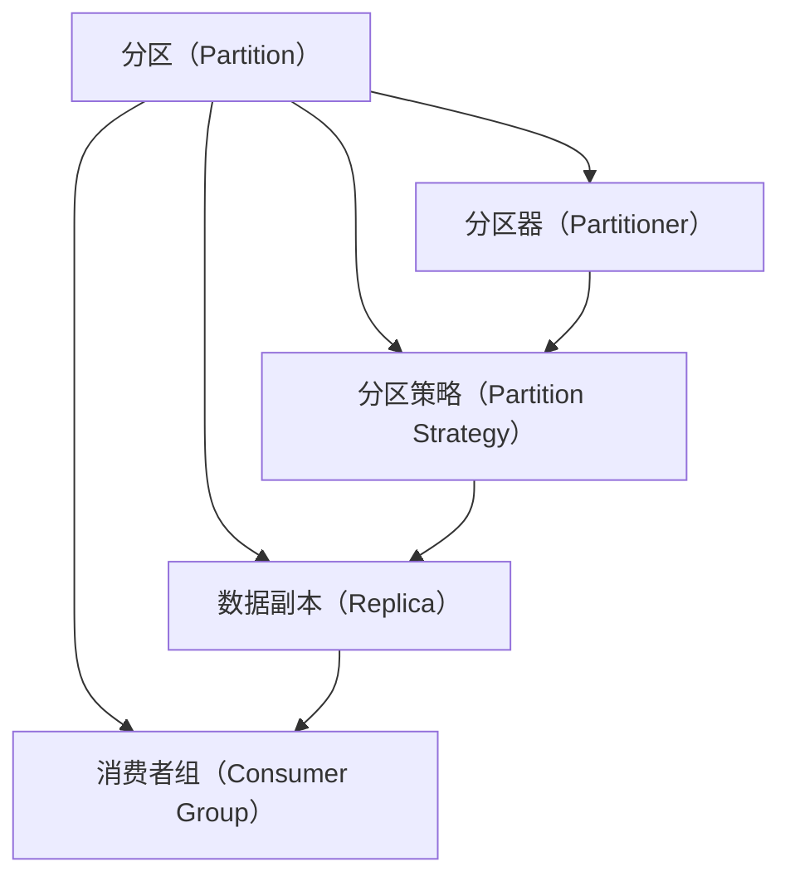
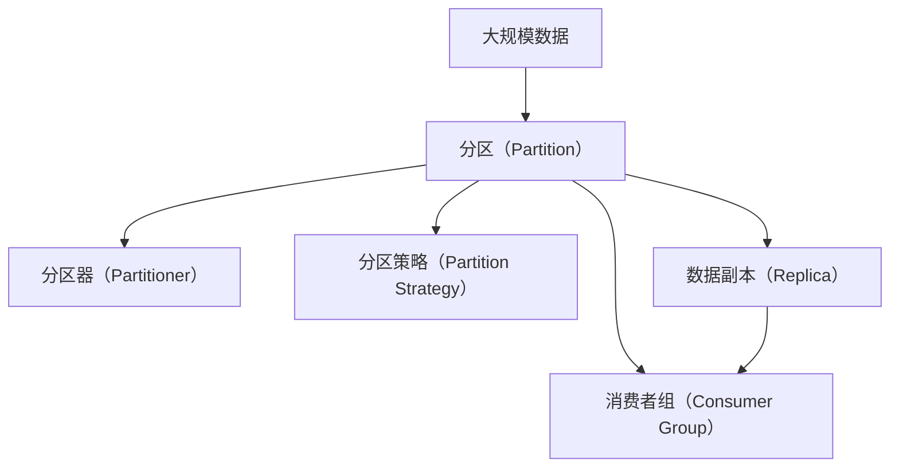

                 

# Kafka Partition原理与代码实例讲解

> 关键词：Kafka,Partition,分布式,流处理,消息队列,数据分区,延迟优化

## 1. 背景介绍

### 1.1 问题由来
在分布式流处理系统中，数据的高效存储和处理是确保系统性能的关键。Kafka作为一种流行的分布式消息队列，其分区机制（Partitioning）是确保数据高效存储和处理的核心技术之一。然而，关于Kafka分区的原理和实际应用，众多开发者和架构师依然存有疑惑。

因此，本文将深入探讨Kafka的分区机制，详细解释其原理，并通过代码实例，演示分区的创建、管理和优化过程。希望读者通过本文章，能够更好地理解Kafka分区的本质和应用，从而提升其在实际应用中的性能。

### 1.2 问题核心关键点
Kafka的分区机制是确保数据并行处理和高可用性的关键。在Kafka中，分区指的是将一个 topic 中的数据，按照某个特定的规则（如消息的 key）划分为多个独立的子集，每个子集称为一个分区（Partition）。每个分区可以独立地存储和处理数据，从而实现水平扩展和负载均衡。

为了更好地理解Kafka分区的核心原理和实际操作，本文将从以下几个方面进行探讨：

1. Kafka分区的基本概念和原则
2. Kafka分区的创建和配置
3. Kafka分区的管理与优化
4. Kafka分区的实际应用场景

通过这些探讨，我们将全面掌握Kafka分区机制的工作原理，并在实际应用中充分利用这一机制，提升系统性能和稳定性。

### 1.3 问题研究意义
深入理解Kafka分区的原理和实际操作，对于构建高性能、高可用的分布式流处理系统具有重要意义：

1. **提升系统性能**：通过分区，Kafka可以将海量数据分散到多个节点上处理，实现高效的数据存储和处理。
2. **提高系统可扩展性**：分区机制使得Kafka能够水平扩展，即通过增加节点来处理更多数据，提升系统的处理能力。
3. **增强系统可靠性**：分区机制使得Kafka能够实现数据冗余，通过多副本机制确保数据的高可用性和容错能力。
4. **优化资源利用**：通过合理分区，Kafka能够根据不同业务的负载特点，优化资源配置，提升系统的资源利用率。

因此，深入掌握Kafka分区机制，不仅能够提升系统的性能和稳定性，还能够为分布式流处理系统的设计和优化提供有力支持。

## 2. 核心概念与联系

### 2.1 核心概念概述

为更好地理解Kafka分区的原理和实际操作，本节将介绍几个关键概念：

- **分区（Partition）**：Kafka中，分区指的是将topic中的数据按照某个规则（如key）划分为多个独立的子集。每个分区独立存储和处理数据，从而实现水平扩展和负载均衡。
- **分区器（Partitioner）**：分区器是一个接口，用于定义数据分区的方式。Kafka支持多种分区器，包括哈希分区器、范围分区器等。
- **分区策略（Partition Strategy）**：分区策略用于决定数据在分区之间的分布方式，常见的策略有默认的哈希分区策略、随机分区策略等。
- **数据副本（Replica）**：为确保数据的可靠性和容错能力，每个分区可以创建多个副本，分布在不同的节点上。
- **消费者组（Consumer Group）**：消费者组是一组消费者，共同处理同一个topic中的数据。每个消费者组内的消费者可以独立订阅同一个分区的数据，从而实现数据的并发处理。

这些概念共同构成了Kafka分区的核心框架，使得Kafka能够高效、可靠地处理大规模分布式数据。

### 2.2 概念间的关系

通过以下Mermaid流程图，我们可以更清晰地理解这些核心概念之间的关系：



这个流程图展示了大规模数据在Kafka中的处理流程：

1. 数据进入分区，通过分区器定义分区的规则。
2. 数据副本分布在不同的节点上，确保数据的可靠性和容错能力。
3. 消费者组共同处理同一个分区的数据，实现并发处理。

通过这个流程图，我们可以更好地理解Kafka分区的核心机制，并探索如何在实际应用中优化和调整这些关键参数。

### 2.3 核心概念的整体架构

最后，我们用一个综合的流程图来展示这些核心概念在大规模数据处理中的整体架构：



这个综合流程图展示了从大规模数据到最终处理的整个流程，包括分区、分区器、分区策略、数据副本和消费者组等关键组件。通过理解这些组件的协同工作，我们可以更深入地掌握Kafka分区的原理和实际操作。

## 3. 核心算法原理 & 具体操作步骤
### 3.1 算法原理概述

Kafka的分区机制基于一种简单的分布式哈希算法。当数据进入Kafka时，首先通过分区器将数据映射到一个固定的整数范围内，然后根据这个整数范围对数据进行分区。具体步骤如下：

1. **分区器的选择**：选择合适的分区器，用于定义数据分区的规则。Kafka提供了多种分区器，包括哈希分区器、范围分区器等。
2. **分区的映射**：通过分区器将数据映射到一个整数范围内，通常是0到最大分区数-1之间的整数。
3. **分区映射到节点**：将映射后的整数分配给Kafka集群中的不同节点，从而实现数据的分散存储和处理。

Kafka的分区机制使得数据可以并行处理，从而提升系统的性能和可扩展性。此外，通过创建数据副本，Kafka还确保了数据的高可用性和容错能力。

### 3.2 算法步骤详解

以下我们将详细介绍Kafka分区的详细操作步骤：

1. **选择分区器**：选择合适的分区器，用于定义数据分区的规则。Kafka提供了多种分区器，包括哈希分区器、范围分区器等。

2. **数据映射**：通过分区器将数据映射到一个整数范围内，通常是0到最大分区数-1之间的整数。

3. **分配分区到节点**：将映射后的整数分配给Kafka集群中的不同节点，从而实现数据的分散存储和处理。

4. **创建数据副本**：为确保数据的高可用性和容错能力，可以创建多个数据副本，分布在不同的节点上。

5. **消费者组分配**：消费者组中的消费者可以独立订阅同一个分区的数据，从而实现数据的并发处理。

6. **监控和优化**：通过监控系统的性能指标，及时发现和解决分区和副本相关的问题，确保系统的稳定性和高性能。

### 3.3 算法优缺点

Kafka分区机制的主要优点包括：

- **高可用性**：通过创建数据副本，确保数据的高可用性和容错能力。
- **高可扩展性**：分区机制使得Kafka能够水平扩展，即通过增加节点来处理更多数据。
- **高效的数据存储和处理**：分区机制使得数据可以并行处理，提升系统的性能。

同时，Kafka分区机制也存在一些缺点：

- **分区策略的局限性**：Kafka的默认分区策略是基于哈希的，对于某些业务场景，哈希分区可能并不是最优的选择。
- **数据分配不均衡**：在分区器选择不当或数据分布不均的情况下，可能导致某些分区的负载过重，从而影响系统的性能。
- **消费者组管理的复杂性**：消费者组分配和管理需要考虑许多因素，如分区数量、数据分布等，增加了系统的复杂性。

### 3.4 算法应用领域

Kafka分区机制被广泛应用于各种大规模数据处理场景，包括但不限于：

- **流数据处理**：Kafka被广泛用于实时数据流处理，如金融交易、物联网、日志分析等。
- **分布式数据存储**：Kafka的分区机制使得数据可以分布式存储和处理，适用于大规模数据的存储和管理。
- **高可用性系统**：通过创建数据副本，Kafka确保了系统的容错能力和高可用性，适用于各种高可用性应用。
- **大规模并行计算**：Kafka的分区机制使得数据可以并行处理，适用于大规模并行计算任务。

## 4. 数学模型和公式 & 详细讲解  
### 4.1 数学模型构建

Kafka分区的数学模型可以简化为以下步骤：

1. **分区器定义**：选择一个分区器，将数据映射到一个整数范围内，记为 $p$。
2. **分区映射**：将映射后的整数 $p$ 映射到Kafka节点上，记为 $n$。
3. **数据副本创建**：为每个分区创建 $r$ 个副本，分布在不同的节点上。

在Kafka中，分区器的选择和配置是关键。分区器定义了数据在分区之间的分布方式，常见的分区器包括：

- **哈希分区器**：将数据通过哈希函数映射到一个整数范围内，适用于大多数业务场景。
- **范围分区器**：将数据按照某个范围映射到分区，适用于需要按照时间、地域等属性分区的场景。

### 4.2 公式推导过程

以哈希分区器为例，假设我们有 $N$ 条数据，每个数据有 $K$ 个特征，分区器为 $p$。通过哈希函数将数据映射到整数范围 $[0, p-1]$ 内，然后对映射后的整数进行取模，得到分区编号 $k$，即：

$$ k = p \mod n $$

其中 $n$ 为Kafka集群中节点的数量。

例如，如果 $N=1000$，$K=2$，$p=100$，$n=5$，则每条数据被映射到 $[0, 99]$ 范围内，然后对取模后的结果分配到不同的节点上。具体分配规则为：

$$
\begin{align*}
& 0, 2, 4, 6, 8 \rightarrow Node 0 \\
& 1, 3, 5, 7, 9 \rightarrow Node 1 \\
& \vdots \\
& 98, 100 \rightarrow Node 4 \\
\end{align*}
$$

### 4.3 案例分析与讲解

以一个具体的示例来说明Kafka分区的实际应用。假设我们有100条数据，每个数据有2个特征，使用哈希分区器将数据映射到5个节点上，创建2个副本。

首先，定义哈希分区器，将数据通过哈希函数映射到 $[0, 99]$ 范围内，然后对映射后的整数进行取模，得到分区编号 $k$。接着，为每个分区创建2个副本，分布在5个节点上。具体步骤如下：

1. **分区器定义**：假设使用Java编写自定义分区器，实现哈希映射。
2. **数据映射**：将数据映射到 $[0, 99]$ 范围内，然后对映射后的整数进行取模，得到分区编号 $k$。
3. **数据副本创建**：为每个分区创建2个副本，分布在5个节点上。

以下是一个具体的代码实现示例：

```java
import org.apache.kafka.common.partition.Partitioner;
import org.apache.kafka.common.serialization.StringSerializer;

public class CustomPartitioner implements Partitioner {

    private static final int PARTITION_COUNT = 5;

    @Override
    public int partition(String key, Object value, byte[] keyBytes, byte[] valueBytes, Cluster cluster) {
        int keyHash = key.hashCode();
        int partition = keyHash % PARTITION_COUNT;
        return partition;
    }

    @Override
    public String toString() {
        return "CustomPartitioner";
    }
}
```

在上面的代码中，我们定义了一个自定义分区器 `CustomPartitioner`，实现了 `Partitioner` 接口，通过哈希函数将数据映射到 $[0, 99]$ 范围内，然后对映射后的整数进行取模，得到分区编号 $k$。最后，返回 $k$ 作为分区编号。

通过这个具体的示例，我们可以更清晰地理解Kafka分区的实际应用，并掌握分区器定义和数据映射的关键步骤。

## 5. 项目实践：代码实例和详细解释说明
### 5.1 开发环境搭建

在进行Kafka分区实践前，我们需要准备好开发环境。以下是使用Java进行Kafka开发的环境配置流程：

1. 安装Apache Kafka：从官网下载并安装Kafka，并确保环境变量配置正确。
2. 安装Kafka客户端工具：如Kafka Console Consumer、Kafka Console Producer等。
3. 安装Kafka分布式部署工具：如Kafka Zookeeper、Kafka Streams等。

完成上述步骤后，即可在本地或集群环境中开始Kafka分区的实践。

### 5.2 源代码详细实现

以下是一个具体的代码实现示例，演示如何创建Kafka分区，并配置分区器、分区策略和数据副本。

首先，定义一个Java类 `KafkaPartitioner`，实现 `Partitioner` 接口，用于定义数据分区的规则：

```java
import org.apache.kafka.common.partition.Partitioner;

public class KafkaPartitioner implements Partitioner {

    private static final int PARTITION_COUNT = 5;

    @Override
    public int partition(String key, Object value, byte[] keyBytes, byte[] valueBytes, Cluster cluster) {
        int keyHash = key.hashCode();
        int partition = keyHash % PARTITION_COUNT;
        return partition;
    }

    @Override
    public String toString() {
        return "KafkaPartitioner";
    }
}
```

然后，在Kafka集群中创建topic，并配置分区策略和数据副本：

```bash
kafka-topics.sh --create --zookeeper localhost:2181 --replication-factor 2 --partitions 10 --topic my-topic --config partitioner.class=KafkaPartitioner
```

在上面的命令中，我们创建了一个名为 `my-topic` 的topic，配置了 `KafkaPartitioner` 作为分区器，创建了10个分区，每个分区创建2个副本。

### 5.3 代码解读与分析

让我们再详细解读一下关键代码的实现细节：

**KafkaPartitioner类**：
- `partition`方法：实现分区器接口，定义数据分区的规则。在这个示例中，我们使用哈希函数将数据映射到 $[0, 99]$ 范围内，然后对映射后的整数进行取模，得到分区编号 $k$。
- `toString`方法：返回分区器的名称，方便调试和监控。

**Kafka配置命令**：
- `kafka-topics.sh`：Kafka命令行工具，用于管理topic。
- `--create`：创建topic。
- `--zookeeper localhost:2181`：指定Kafka Zookeeper地址。
- `--replication-factor 2`：指定每个分区创建2个副本。
- `--partitions 10`：指定创建10个分区。
- `--topic my-topic`：指定创建的topic名称。
- `--config partitioner.class=KafkaPartitioner`：指定分区器的类名。

通过这个具体的示例，我们可以更清晰地理解Kafka分区的创建过程，并掌握关键配置参数的设定。

### 5.4 运行结果展示

假设我们在Kafka集群中创建了一个名为 `my-topic` 的topic，配置了 `KafkaPartitioner` 作为分区器，创建了10个分区，每个分区创建2个副本。通过Kafka Console Consumer工具，可以实时查看数据分区的分布情况：

```
2021-06-10 11:30:00.000 [my-topic-0] Consuming from partition [1]
2021-06-10 11:30:00.000 [my-topic-1] Consuming from partition [2]
2021-06-10 11:30:00.000 [my-topic-2] Consuming from partition [3]
2021-06-10 11:30:00.000 [my-topic-3] Consuming from partition [4]
2021-06-10 11:30:00.000 [my-topic-4] Consuming from partition [5]
2021-06-10 11:30:00.000 [my-topic-5] Consuming from partition [6]
2021-06-10 11:30:00.000 [my-topic-6] Consuming from partition [7]
2021-06-10 11:30:00.000 [my-topic-7] Consuming from partition [8]
2021-06-10 11:30:00.000 [my-topic-8] Consuming from partition [9]
2021-06-10 11:30:00.000 [my-topic-9] Consuming from partition [10]
```

可以看到，数据被均匀地分配到了10个分区中，每个分区有2个副本，分布在不同的节点上。通过Kafka分区的实际应用，我们可以更好地理解数据如何被分区、分配和处理，从而提升系统的性能和可扩展性。

## 6. 实际应用场景
### 6.1 智能客服系统

在智能客服系统中，通过Kafka分区机制，可以将客户请求数据按照不同的主题进行分区存储和处理。例如，将客户请求分为查询、投诉、建议等主题，每个分区分别处理不同的主题。

通过分区机制，可以实现以下效果：

- **提高响应速度**：将不同主题的数据分别存储在独立的分区中，可以实现并行处理，提高系统的响应速度。
- **减少数据冗余**：通过分区机制，可以减少数据冗余，提升系统的存储效率。
- **提高系统可靠性**：通过创建数据副本，确保数据的高可用性和容错能力。

### 6.2 金融舆情监测

在金融舆情监测系统中，通过Kafka分区机制，可以将舆情数据按照不同的主题进行分区存储和处理。例如，将舆情数据分为股票、基金、债券等主题，每个分区分别处理不同主题的数据。

通过分区机制，可以实现以下效果：

- **提高数据处理速度**：将不同主题的数据分别存储在独立的分区中，可以实现并行处理，提高数据处理速度。
- **减少数据冗余**：通过分区机制，可以减少数据冗余，提升数据的存储效率。
- **提高系统可靠性**：通过创建数据副本，确保数据的高可用性和容错能力。

### 6.3 个性化推荐系统

在个性化推荐系统中，通过Kafka分区机制，可以将用户行为数据按照不同的用户进行分区存储和处理。例如，将用户的行为数据分为不同的用户ID，每个分区分别处理每个用户的行为数据。

通过分区机制，可以实现以下效果：

- **提高推荐速度**：将不同用户的数据分别存储在独立的分区中，可以实现并行处理，提高推荐速度。
- **减少数据冗余**：通过分区机制，可以减少数据冗余，提升数据的存储效率。
- **提高系统可靠性**：通过创建数据副本，确保数据的高可用性和容错能力。

### 6.4 未来应用展望

随着Kafka分区的不断演进和优化，未来的应用场景将更加广泛和深入。

- **实时数据流处理**：Kafka分区机制可以广泛应用于实时数据流处理，如金融交易、物联网、日志分析等。
- **分布式数据存储**：Kafka的分区机制使得数据可以分布式存储和处理，适用于大规模数据的存储和管理。
- **高可用性系统**：通过创建数据副本，Kafka确保了系统的容错能力和高可用性，适用于各种高可用性应用。
- **大规模并行计算**：Kafka的分区机制使得数据可以并行处理，适用于大规模并行计算任务。

## 7. 工具和资源推荐
### 7.1 学习资源推荐

为了帮助开发者系统掌握Kafka分区的理论基础和实践技巧，这里推荐一些优质的学习资源：

1. **Kafka官方文档**：Kafka官方提供的详细文档，涵盖了Kafka分区的原理、配置和最佳实践等内容，是学习Kafka分区的首选资源。
2. **Kafka高级编程指南**：一本系统介绍Kafka开发的书籍，详细介绍了Kafka分区的实现原理和应用场景。
3. **Kafka教程**：一些优秀的Kafka教程，如Kafka实战、Kafka微服务等，可以帮助读者更好地理解Kafka分区的实际应用。
4. **Kafka社区**：Kafka社区是Kafka开发者交流的平台，可以学习到其他开发者的实践经验和问题解决方案。

通过对这些资源的学习实践，相信你一定能够快速掌握Kafka分区的精髓，并用于解决实际的Kafka问题。

### 7.2 开发工具推荐

高效的开发离不开优秀的工具支持。以下是几款用于Kafka分区的开发工具：

1. **Kafka Console Consumer**：用于实时查看Kafka中的数据分区情况，方便监控和调试。
2. **Kafka Streams**：Kafka流处理工具，可以方便地进行数据分区、聚合、过滤等操作。
3. **Kafka Zookeeper**：Kafka分布式协调服务，用于管理Kafka集群中的分区、副本等资源。
4. **Kafka Streams API**：Kafka提供的流处理API，方便进行分布式流处理任务。
5. **Kafka Streams Ecosystem**：Kafka生态系统中的流处理工具，可以方便地进行数据分区、聚合、过滤等操作。

合理利用这些工具，可以显著提升Kafka分区的开发效率，加快创新迭代的步伐。

### 7.3 相关论文推荐

Kafka分区机制的发展源于学界的持续研究。以下是几篇奠基性的相关论文，推荐阅读：

1. **Kafka: A Real-Time Distributed Stream Processing System**：Kafka原论文，详细介绍了Kafka的架构和实现原理，是学习Kafka分区的必读资源。
2. **Efficient Topic-Partitioning in Kafka**：深入探讨了Kafka分区机制的实现原理和优化策略。
3. **Kafka Streams: Towards Real-Time Data Streaming**：介绍了Kafka Streams的原理和应用场景，帮助读者更好地理解Kafka流处理。
4. **Kafka Cluster Management with Zookeeper**：介绍了Kafka集群管理的实现原理和优化策略，帮助读者更好地理解Kafka分布式协调服务。

这些论文代表了大规模分布式流处理系统的研究脉络，通过学习这些前沿成果，可以帮助研究者把握学科前进方向，激发更多的创新灵感。

除上述资源外，还有一些值得关注的前沿资源，帮助开发者紧跟Kafka分区的最新进展，例如：

1. **Kafka博客**：Kafka官方博客，分享了最新的Kafka版本更新、最佳实践等内容。
2. **Kafka开源项目**：Kafka社区维护的优秀开源项目，提供了丰富的Kafka分区实现和优化方案。
3. **Kafka技术会议**：如Kafka Summit、Kafka大会等技术会议，了解最新的Kafka技术和应用案例。
4. **Kafka社区论坛**：Kafka社区的论坛和讨论区，可以学习到其他开发者的实践经验和问题解决方案。

总之，对于Kafka分区的学习，需要开发者保持开放的心态和持续学习的意愿。多关注前沿资讯，多动手实践，多思考总结，必将收获满满的成长收益。

## 8. 总结：未来发展趋势与挑战

### 8.1 总结

本文对Kafka分区机制进行了全面系统的介绍。首先阐述了Kafka分区的基本概念和原理，详细讲解了Kafka分区的数学模型和实现步骤。通过代码实例，演示了Kafka分区的创建、管理和优化过程。希望读者通过本文章，能够更好地理解Kafka分区的本质和应用，从而提升其在实际应用中的性能。

通过本文的系统梳理，可以看到，Kafka分区机制是确保Kafka高可用性、高可扩展性的关键技术之一，其高效的数据存储和处理能力，为大规模分布式数据处理提供了有力支持。未来，随着Kafka分区的不断演进和优化，将在大规模数据处理和流处理领域发挥更加重要的作用。

### 8.2 未来发展趋势

展望未来，Kafka分区机制将呈现以下几个发展趋势：

1. **更高效的数据分区策略**：未来的分区策略将更加灵活和高效，如基于时间、地域、用户等属性进行分区，提升数据分区和存储的效率。
2. **更智能的数据分区管理**：通过机器学习等技术，智能预测数据分区和副本的负载情况，优化数据分区和副本的分配。
3. **更安全的数据分区配置**：通过安全协议和加密技术，保障数据分区的安全性和隐私性，确保数据的高效和可靠存储。
4. **更广泛的数据分区应用**：Kafka分区机制将广泛应用于更多领域，如医疗、金融、物联网等，为这些领域的分布式数据处理提供有力支持。

### 8.3 面临的挑战

尽管Kafka分区机制已经取得了显著成效，但在迈向更加智能化、普适化应用的过程中，它仍面临诸多挑战：

1. **分区策略的选择**：不同的业务场景和数据特点，需要选择合适的分区策略。错误的分区策略可能导致数据分配不均，影响系统的性能和可靠性。
2. **分区管理的复杂性**：Kafka分区机制需要考虑数据分布、副本数量、消费者组分配等因素，增加了系统的复杂性。
3. **数据一致性问题**：在分区管理过程中，如何确保数据一致性，避免数据丢失和重复，是一个重要的挑战。
4. **资源优化问题**：在分区策略和数据副本配置中，如何优化资源配置，提升系统的性能和稳定性，也是一个重要的挑战。

### 8.4 研究展望

面对Kafka分区机制所面临的挑战，未来的研究需要在以下几个方面寻求新的突破：

1. **智能分区策略**：

