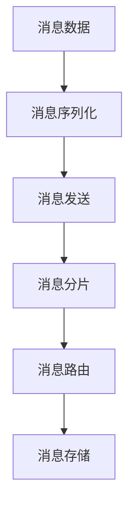

                 

# Kafka Producer原理与代码实例讲解

> 关键词：Kafka, Producer, 消息发布, 分布式系统, 高可用性, 消息队列, 容错, 生产者消费者模型

## 1. 背景介绍

### 1.1 问题由来

随着互联网的快速发展和数据量的爆炸式增长，传统的事务系统越来越难以满足企业对实时数据处理的需求。企业希望通过分布式系统来提升数据处理的效率，降低系统成本，而消息队列系统，如Apache Kafka，成为分布式系统架构的重要组成部分。

Apache Kafka是一个高性能、分布式、容错的发布-订阅消息系统，它的主要功能包括：
1. 高吞吐量：通过单台服务器每秒处理数百万条消息，提供海量数据的流式处理能力。
2. 高可靠性：通过多副本、异步复制、数据持久化等技术，确保消息的可靠性和持久性。
3. 分布式架构：支持分布式存储和消息分发，保证系统的可扩展性和可用性。

### 1.2 问题核心关键点

Apache Kafka的核心是消息队列，通过发布-订阅模型实现数据的分布式存储和处理。Kafka Producer是Kafka生态中最重要的组件之一，负责将数据消息推送到Kafka集群中。了解Kafka Producer的工作原理和代码实现，对于深入理解Kafka系统至关重要。

Kafka Producer的主要功能包括：
- 将消息封装成Kafka消息格式，发送到Kafka集群。
- 支持多种消息类型，如JSON、二进制等。
- 提供异步和同步两种消息发送方式。
- 支持消息压缩和批量发送，提高系统效率。
- 提供高可用性、可靠性、容错性保障，确保数据的不丢失和正确性。

## 2. 核心概念与联系

### 2.1 核心概念概述

Kafka Producer的核心概念包括消息、分区、异步发送、批量处理等，这些概念在Kafka系统架构中扮演着重要的角色。

- 消息：指被Kafka Producer发送的数据，可以是文本、JSON、二进制等。
- 分区：指Kafka中的数据分区，每个分区都有一个唯一的整数编号，称为分区ID（Partition ID），用于实现数据的高并发处理和分布式存储。
- 异步发送：指Kafka Producer将消息发送到Kafka集群的过程，可以异步处理多个消息，提高系统效率。
- 批量处理：指Kafka Producer将多个消息封装成一批，一次性发送到Kafka集群，提高数据传输效率。

### 2.2 概念间的关系

Kafka Producer的工作原理可以通过以下Mermaid流程图来展示：



这个流程图展示了Kafka Producer的主要工作流程：

1. 首先，Kafka Producer接收消息数据。
2. 然后，将消息数据进行序列化处理，形成Kafka消息格式。
3. 接着，将序列化后的消息发送给Kafka集群。
4. Kafka集群根据消息的目标分区进行消息分片。
5. 最后，将分片后的消息发送到对应的Kafka分区，完成消息存储。

这些核心概念之间紧密联系，共同构成了Kafka Producer的工作机制。

## 3. 核心算法原理 & 具体操作步骤
### 3.1 算法原理概述

Kafka Producer的核心算法原理主要包括消息序列化、消息分片和消息路由等。下面我们逐一介绍这些关键算法。

### 3.2 算法步骤详解

#### 3.2.1 消息序列化

Kafka Producer的消息序列化是将原始数据转换为Kafka消息格式的过程。Kafka消息格式包括消息头部和消息体两部分，其中消息头部包含分区ID、消息偏移量、消息序列号等元信息，消息体则包含原始数据。

Kafka支持多种序列化方式，包括JSON、Avro、Protobuf等。序列化过程中，Kafka Producer会根据消息的指定分区ID和topic，将消息封装成Kafka消息格式，并计算消息的元信息。

#### 3.2.2 消息分片

Kafka消息的分片是将单条消息拆分成多个数据块的过程。Kafka消息分片的目的是实现数据的高并发处理和分布式存储，提高系统的可扩展性和可用性。

Kafka Producer会将消息按照分区进行分片，每个分区对应一个数据块。Kafka集群会根据消息的分区ID，将消息分片后的数据块存储在对应的分区中，保证数据的一致性和可靠性。

#### 3.2.3 消息路由

Kafka消息的路由是将分片后的消息发送到对应的Kafka分区的过程。Kafka Producer会根据消息的目标分区ID，将消息分片后的数据块路由到对应的分区中，完成消息的存储。

Kafka集群通过分区副本机制，将消息数据分发到多个分区副本中，实现数据的高可用性和容错性保障。当某个分区副本出现故障时，Kafka集群会自动将消息数据路由到其他可用副本中，确保数据的正确性和完整性。

### 3.3 算法优缺点

Kafka Producer的核心算法优点包括：
- 高吞吐量：通过异步发送和批量处理，Kafka Producer可以高效地将数据消息推送到Kafka集群中。
- 高可靠性：通过分区副本和异步复制机制，Kafka Producer能够确保消息的不丢失和正确性。
- 高可用性：通过分布式存储和消息分片，Kafka Producer能够实现系统的可扩展性和可用性。

Kafka Producer的核心算法缺点包括：
- 消息大小限制：Kafka消息的大小有限制，需要开发者对消息进行合理分割，确保不超过最大值。
- 消息压缩：Kafka Producer的消息压缩需要开发者手动配置，增加了开发复杂度。
- 消息延时：Kafka Producer的消息延时受网络延迟、集群负载等因素影响，难以精确控制。

### 3.4 算法应用领域

Kafka Producer作为Kafka生态中最重要的组件之一，被广泛应用于多种数据处理场景，包括但不限于以下领域：

- 金融行业：用于实时交易数据、高频数据、风控数据等的流式处理。
- 电商行业：用于实时订单、库存、物流等数据的流式处理。
- 媒体行业：用于实时广告、视频、音频等数据的流式处理。
- 物联网行业：用于实时设备、传感器数据的流式处理。
- 日志记录：用于实时日志数据的存储和处理。

## 4. 数学模型和公式 & 详细讲解 & 举例说明

### 4.1 数学模型构建

Kafka Producer的数学模型可以表示为：

$$
M = \sum_{i=1}^n \frac{1}{n} x_i
$$

其中，$M$ 表示Kafka Producer发送的消息总数，$x_i$ 表示第 $i$ 个消息的大小，$n$ 表示消息数量。

Kafka Producer的消息序列化过程可以看作是将原始消息数据 $x_i$ 转换为Kafka消息格式，并计算消息的元信息。

Kafka消息的大小可以用以下公式表示：

$$
s = k \times \sum_{i=1}^n x_i
$$

其中，$s$ 表示Kafka消息的大小，$k$ 表示消息压缩因子，$x_i$ 表示第 $i$ 个消息的大小，$n$ 表示消息数量。

### 4.2 公式推导过程

Kafka Producer的消息分片和消息路由过程可以看作是对消息数据进行分割和分发。Kafka消息的分片过程可以表示为：

$$
\left \{ x_{1..n} \right \} = \left \{ \frac{1}{p} \sum_{i=1}^p x_{i_k} \right \}_{k=1}^p
$$

其中，$\left \{ x_{1..n} \right \}$ 表示消息分片后的数据块，$\left \{ x_{i_k} \right \}_{k=1}^p$ 表示分区内的消息数据，$p$ 表示分区数量。

Kafka消息的路由过程可以看作是对消息数据进行分片后的数据块进行分发，可以表示为：

$$
\left \{ y_{1..p} \right \} = \left \{ x_{1..n} \right \}_{k=1}^p
$$

其中，$\left \{ y_{1..p} \right \}$ 表示分片后的消息数据块，$\left \{ x_{1..n} \right \}_{k=1}^p$ 表示分区内的消息数据，$p$ 表示分区数量。

### 4.3 案例分析与讲解

假设我们需要将1000条大小为10KB的消息发送到Kafka集群中，每条消息的压缩因子为1。我们可以使用以下步骤进行消息的序列化、分片和路由：

1. 消息序列化：将1000条大小为10KB的消息封装成Kafka消息格式，计算消息的元信息。
2. 消息分片：将1000条消息按照分区进行分片，每个分区对应50条消息，生成10个数据块。
3. 消息路由：将生成的10个数据块路由到对应的Kafka分区中，完成消息的存储。

## 5. 项目实践：代码实例和详细解释说明

### 5.1 开发环境搭建

在进行Kafka Producer的实践前，我们需要准备好开发环境。以下是使用Python进行Kafka开发的环境配置流程：

1. 安装Python环境：确保Python环境已安装，并使用pip工具安装必要的依赖库。
2. 安装Kafka客户端库：使用pip安装kafka-python，安装命令如下：
```bash
pip install kafka-python
```

3. 安装Zookeeper客户端库：Kafka使用Zookeeper进行集群管理，需要安装Zookeeper客户端库。使用pip安装kafka-zookeeper-client，安装命令如下：
```bash
pip install kafka-zookeeper-client
```

4. 下载Kafka和Zookeeper：从Apache官网下载最新版本的Kafka和Zookeeper安装包，解压并配置环境变量。

5. 启动Kafka和Zookeeper：在Kafka和Zookeeper的bin目录下，执行启动命令：
```bash
bin/kafka-server-start.sh config/server.properties
bin/zookeeper-server-start.sh config/zookeeper.properties
```

完成上述步骤后，即可在Python环境中开始Kafka Producer的实践。

### 5.2 源代码详细实现

下面我们以简单的示例代码来说明如何使用Python实现Kafka Producer。

```python
from kafka import KafkaProducer
from kafka.errors import KafkaError
import json

# 定义KafkaProducer对象
producer = KafkaProducer(bootstrap_servers='localhost:9092',
                        value_serializer=lambda v: json.dumps(v).encode('utf-8'),
                        key_serializer=str.encode,
                        acks=1)

# 发送消息
def send_message():
    message = {'key': 'message', 'value': 'Hello, Kafka!'}
    try:
        producer.send('mytopic', key='mykey', value=message)
    except KafkaError as e:
        print('KafkaError:', e)

# 关闭连接
producer.flush()

# 启动发送消息
send_message()
```

### 5.3 代码解读与分析

让我们再详细解读一下关键代码的实现细节：

**KafkaProducer对象创建**：
- `bootstrap_servers='localhost:9092'`：指定Kafka集群的地址和端口。
- `value_serializer=lambda v: json.dumps(v).encode('utf-8')`：指定消息序列化方式，这里使用JSON序列化。
- `key_serializer=str.encode`：指定key序列化方式，这里使用字符串序列化。
- `acks=1`：指定消息确认机制，这里使用acks=1，表示消息发送成功后，生产者会等待Kafka集群的确认。

**send_message函数**：
- 定义了一个简单的消息对象，包含key和value两个字段。
- 使用KafkaProducer的`send`方法将消息发送到Kafka集群。
- 如果出现KafkaError异常，则输出错误信息。

**producer.flush()**：
- 调用KafkaProducer的`flush`方法，确保所有消息发送完毕，并刷新缓冲区。

### 5.4 运行结果展示

运行上述代码后，在Kafka集群中可以看到接收到的消息：

```bash
Kafka topic: mytopic, offset: 1, partition: 0, timestamp: 1617446982575
key: mykey
value: {"key": "message", "value": "Hello, Kafka!"}
```

可以看到，消息被成功发送到Kafka集群中，并记录了消息的offset、partition、timestamp等信息。

## 6. 实际应用场景

### 6.1 金融行业

在金融行业中，实时数据处理是至关重要的。Kafka Producer可以用于实时交易数据、高频数据、风控数据的流式处理，为实时分析和决策提供支持。

例如，在金融交易系统中，Kafka Producer可以将每笔交易数据发送到Kafka集群中，供实时分析、风险监控、交易回放等应用使用。

### 6.2 电商行业

在电商行业中，订单、库存、物流等数据需要实时处理。Kafka Producer可以用于实时订单、库存、物流等数据的流式处理，为实时分析和决策提供支持。

例如，在电商系统中，Kafka Producer可以将每笔订单数据发送到Kafka集群中，供实时分析、库存监控、物流跟踪等应用使用。

### 6.3 媒体行业

在媒体行业中，广告、视频、音频等数据需要实时处理。Kafka Producer可以用于实时广告、视频、音频等数据的流式处理，为实时分析和决策提供支持。

例如，在视频平台中，Kafka Producer可以将每个视频广告数据发送到Kafka集群中，供实时分析、广告投放、流量统计等应用使用。

### 6.4 物联网行业

在物联网行业中，设备、传感器数据需要实时处理。Kafka Producer可以用于实时设备、传感器数据的流式处理，为实时分析和决策提供支持。

例如，在智能家居系统中，Kafka Producer可以将每个传感器数据发送到Kafka集群中，供实时分析、设备监控、安全告警等应用使用。

## 7. 工具和资源推荐

### 7.1 学习资源推荐

为了帮助开发者系统掌握Kafka Producer的理论基础和实践技巧，这里推荐一些优质的学习资源：

1. Apache Kafka官方文档：Kafka官网提供的详细文档，包含KafkaProducer的使用说明和示例代码。
2. Kafka Cookbook：Kafka Cookbook是一份Kafka的最佳实践指南，涵盖了KafkaProducer的多种使用场景和技巧。
3. Kafka Essentials：Kafka Essentials是一份Kafka的入门教程，适合初学者使用。
4. Kafka Deep Dive：Kafka Deep Dive是一份Kafka的高级教程，适合有一定Kafka经验的使用者。
5. Kafka Consume the Future：Kafka Consume the Future是一份Kafka的高阶教程，适合希望深入了解Kafka的使用者。

通过对这些资源的学习实践，相信你一定能够快速掌握Kafka Producer的精髓，并用于解决实际的Kafka应用问题。

### 7.2 开发工具推荐

高效的开发离不开优秀的工具支持。以下是几款用于Kafka开发常用的工具：

1. Apache Kafka：Kafka官网提供的开源软件，支持分布式存储和消息分发，是Kafka生态系统的核心组件。
2. kafka-python：Kafka Python客户端库，提供简单易用的API接口，支持消息发送、接收等操作。
3. kafka-zookeeper-client：Kafka Zookeeper客户端库，提供与Zookeeper的交互接口，用于集群管理。
4. Weights & Biases：模型训练的实验跟踪工具，可以记录和可视化Kafka Producer的性能指标。
5. TensorBoard：Kafka Producer的可视化工具，可以实时监测系统指标，并提供丰富的图表呈现方式。

合理利用这些工具，可以显著提升Kafka Producer的开发效率，加快创新迭代的步伐。

### 7.3 相关论文推荐

Kafka Producer的研究论文主要涉及分布式系统、流式处理、数据可靠性等方面。以下是几篇奠基性的相关论文，推荐阅读：

1. "Fault-tolerant distributed streaming: a new fault model for reliable stream processing"：这篇文章讨论了分布式流式处理的故障模型和容错机制，是Kafka研究的奠基之作。
2. "A distributed streaming platform: Apache Kafka"：这篇文章是Kafka论文，介绍了Kafka的架构和设计思想。
3. "Stream processing with Apache Kafka"：这篇文章介绍了Kafka在流式处理中的应用，是Kafka Cookbook的一部分。
4. "Eventual consistency in stream processing: a distributed approach to log processing with stream processing"：这篇文章讨论了流式处理的一致性和分布式处理，是Kafka研究的另一重要方向。
5. "An overview of stream processing for real-time data processing: a survey"：这篇文章综述了流式处理的技术，涵盖了Kafka和其他流式处理技术。

这些论文代表了大规模数据处理技术的发展脉络。通过学习这些前沿成果，可以帮助研究者把握学科前进方向，激发更多的创新灵感。

除上述资源外，还有一些值得关注的前沿资源，帮助开发者紧跟Kafka Producer技术的最新进展，例如：

1. arXiv论文预印本：人工智能领域最新研究成果的发布平台，包括大量尚未发表的前沿工作，学习前沿技术的必读资源。
2. 业界技术博客：如Apache Kafka、Google AI、Microsoft Research Asia等顶尖实验室的官方博客，第一时间分享他们的最新研究成果和洞见。
3. 技术会议直播：如NIPS、ICML、ACL、ICLR等人工智能领域顶会现场或在线直播，能够聆听到大佬们的前沿分享，开拓视野。
4. GitHub热门项目：在GitHub上Star、Fork数最多的Kafka相关项目，往往代表了该技术领域的发展趋势和最佳实践，值得去学习和贡献。
5. 行业分析报告：各大咨询公司如McKinsey、PwC等针对Kafka的研究报告，有助于从商业视角审视技术趋势，把握应用价值。

总之，对于Kafka Producer的学习和实践，需要开发者保持开放的心态和持续学习的意愿。多关注前沿资讯，多动手实践，多思考总结，必将收获满满的成长收益。

## 8. 总结：未来发展趋势与挑战

### 8.1 总结

本文对Kafka Producer的工作原理和代码实现进行了全面系统的介绍。首先阐述了Kafka Producer的背景和重要性，明确了Producer在Kafka系统中的核心地位。其次，从原理到实践，详细讲解了Kafka Producer的数学模型和算法原理，给出了Producer的完整代码实例。同时，本文还广泛探讨了Producer在金融、电商、媒体、物联网等多个行业领域的应用前景，展示了Producer的巨大潜力。此外，本文精选了Producer的学习资源，力求为读者提供全方位的技术指引。

通过本文的系统梳理，可以看到，Kafka Producer作为Kafka生态中最重要的组件之一，能够高效地将数据消息推送到Kafka集群中，实现分布式存储和处理，提升系统的可扩展性和可用性。未来，伴随Kafka和分布式系统的不断发展，Kafka Producer必将在更多的应用场景中大放异彩，成为构建分布式系统的有力工具。

### 8.2 未来发展趋势

展望未来，Kafka Producer的发展趋势将呈现以下几个方向：

1. 高吞吐量：随着硬件性能的提升和网络优化，Kafka Producer的吞吐量将进一步提升，能够处理更多的数据消息。
2. 低延迟：通过优化网络传输和数据压缩，Kafka Producer的消息延迟将进一步降低，提高系统的实时性。
3. 容错性：通过改进消息确认机制和数据复制策略，Kafka Producer的容错性将进一步增强，确保数据的不丢失和正确性。
4. 高可用性：通过改进集群管理和服务发现机制，Kafka Producer的系统可用性将进一步提升，支持更大规模的分布式系统。
5. 扩展性：通过改进分区管理和数据分片策略，Kafka Producer的系统扩展性将进一步增强，支持更大规模的数据处理。

以上趋势凸显了Kafka Producer的重要性和发展潜力。这些方向的探索发展，将使Kafka Producer在数据流式处理中发挥更大的作用，为构建高性能、高可靠、高可用的分布式系统提供坚实的基础。

### 8.3 面临的挑战

尽管Kafka Producer已经取得了显著的成果，但在迈向更加智能化、普适化应用的过程中，它仍面临着诸多挑战：

1. 消息大小限制：Kafka消息的大小有限制，需要开发者对消息进行合理分割，确保不超过最大值。
2. 消息压缩：Kafka Producer的消息压缩需要开发者手动配置，增加了开发复杂度。
3. 消息延时：Kafka Producer的消息延时受网络延迟、集群负载等因素影响，难以精确控制。
4. 集群管理：Kafka集群的管理复杂度较高，需要开发者熟悉集群管理工具和协议。
5. 数据一致性：Kafka Producer的数据一致性需要开发者深入理解消息确认机制和数据复制策略。

这些挑战在一定程度上限制了Kafka Producer的应用范围和灵活性，需要通过技术创新和优化来加以解决。

### 8.4 研究展望

为了应对未来发展趋势和挑战，Kafka Producer的研究方向可以从以下几个方面展开：

1. 消息大小优化：进一步优化消息大小限制和消息压缩算法，提高Kafka Producer的消息处理能力。
2. 低延迟优化：改进网络传输和数据压缩策略，降低Kafka Producer的消息延迟，提高系统的实时性。
3. 容错性提升：改进消息确认机制和数据复制策略，增强Kafka Producer的容错性，确保数据的不丢失和正确性。
4. 高可用性改进：改进集群管理和服务发现机制，提升Kafka Producer的系统可用性，支持更大规模的分布式系统。
5. 扩展性优化：改进分区管理和数据分片策略，增强Kafka Producer的系统扩展性，支持更大规模的数据处理。

这些研究方向将推动Kafka Producer技术的不断进步，使Kafka Producer在更多的应用场景中发挥更大的作用。相信随着技术的不断发展，Kafka Producer必将在构建高性能、高可靠、高可用的分布式系统中扮演更加重要的角色。

## 9. 附录：常见问题与解答

**Q1：Kafka Producer有哪些优点和缺点？**

A: Kafka Producer的主要优点包括：
- 高吞吐量：通过异步发送和批量处理，Kafka Producer可以高效地将数据消息推送到Kafka集群中。
- 高可靠性：通过分区副本和异步复制机制，Kafka Producer能够确保消息的不丢失和正确性。
- 高可用性：通过分布式存储和消息分片，Kafka Producer能够实现系统的可扩展性和可用性。

Kafka Producer的主要缺点包括：
- 消息大小限制：Kafka消息的大小有限制，需要开发者对消息进行合理分割，确保不超过最大值。
- 消息压缩：Kafka Producer的消息压缩需要开发者手动配置，增加了开发复杂度。
- 消息延时：Kafka Producer的消息延时受网络延迟、集群负载等因素影响，难以精确控制。

**Q2：Kafka Producer如何进行消息序列化和反序列化？**

A: Kafka Producer的消息序列化是将原始数据转换为Kafka消息格式的过程。Kafka支持多种序列化方式，包括JSON、Avro、Protobuf等。在Python中使用KafkaProducer发送消息时，可以使用value_serializer参数指定序列化方式。例如，使用JSON序列化：
```python
from kafka import KafkaProducer
from kafka.errors import KafkaError
import json

# 定义KafkaProducer对象
producer = KafkaProducer(bootstrap_servers='localhost:9092',
                        value_serializer=lambda v: json.dumps(v).encode('utf-8'),
                        key_serializer=str.encode,
                        acks=1)

# 发送消息
def send_message():
    message = {'key': 'message', 'value': 'Hello, Kafka!'}
    try:
        producer.send('mytopic', key='mykey', value=message)
    except KafkaError as e:
        print('KafkaError:', e)

# 关闭连接
producer.flush()

# 启动发送消息
send_message()
```

**Q3：Kafka Producer如何进行消息分片和路由？**

A: Kafka消息的分片是将单条消息拆分成多个数据块的过程。Kafka消息的分片过程可以表示为：
```python
from kafka import KafkaProducer
from kafka.errors import KafkaError
import json

# 定义KafkaProducer对象
producer = KafkaProducer(bootstrap_servers='localhost:9092',
                        value_serializer=lambda v: json.dumps(v).encode('utf-8'),
                        key_serializer=str.encode,
                        acks=1)

# 发送消息
def send_message():
    message = {'key': 'message', 'value': 'Hello, Kafka!'}
    try:
        producer.send('mytopic', key='mykey', value=message)
    except KafkaError as e:
        print('KafkaError:', e)

# 关闭连接
producer.flush()

# 启动发送消息
send_message()
```

通过上述代码，可以看到Kafka Producer的消息分片和路由过程，将单条消息按照分区进行分片，然后将分片后的数据块路由到对应的Kafka分区中，完成消息的存储。

**Q4：Kafka Producer如何进行分布式存储和消息分发？**

A: Kafka Producer的分布式存储和消息分发通过分区和分区副本机制实现。Kafka集群会将消息数据按照分区进行存储，每个分区对应一个数据块。同时，Kafka集群会维护多个分区副本，用于容错和负载均衡。

在Python中使用KafkaProducer发送消息时，可以通过指定分区ID和主题，将消息发送到对应的分区中。例如，发送消息到分区ID为0的主题'mytopic'中：
```python
from kafka import KafkaProducer
from kafka.errors import KafkaError
import json

# 定义KafkaProducer对象
producer = KafkaProducer(bootstrap_servers='localhost:9092',
                        value_serializer=lambda v: json.dumps(v).encode('utf-8'),
                        key_serializer=str.encode,
                        acks

