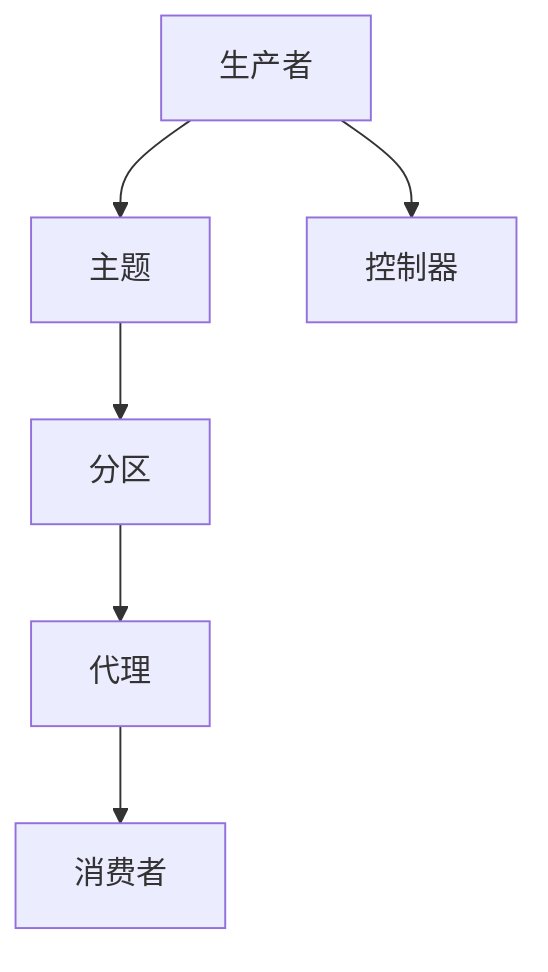
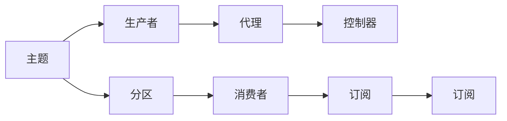
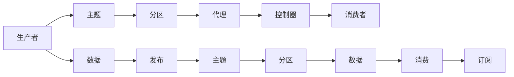

                 

# Kafka 原理与代码实例讲解

> 关键词：Kafka,分布式,流数据,消息队列,高可用性,容错性,高吞吐量,实时数据流

## 1. 背景介绍

### 1.1 问题由来
在当下数据驱动的世界里，数据流的处理和存储成为了许多企业关注的焦点。随着互联网的迅速发展，数据量呈指数级增长，如何高效地存储、处理和分析这些海量数据成为了一个重要问题。特别是对于那些需要实时处理的数据，如日志、实时监控数据、社交网络数据等，传统的数据存储和处理方式显得力不从心。这时，Kafka作为一种分布式流数据处理系统，以其高性能、高可靠性、高可扩展性等优点脱颖而出，成为了处理海量数据的首选。

### 1.2 问题核心关键点
Kafka的诞生是为了解决企业级系统在处理大规模流数据时面临的挑战。它提供了一种高性能、分布式、可靠的消息队列系统，可以存储和处理无限量的数据流。Kafka的设计理念是分布式、可扩展、高吞吐量、低延迟和容错性，适用于各种大数据场景，包括实时数据流处理、日志收集、消息队列等。

Kafka的核心概念包括：
- 主题（Topic）：数据的容器，类似数据库中的表。
- 分区（Partition）：主题下的子集，每个分区独立维护一个日志。
- 生产者（Producer）：发布数据到主题。
- 消费者（Consumer）：从主题订阅数据并消费。
- 代理（Broker）：Kafka集群中的核心节点，负责存储和管理数据。
- 控制器（Controller）：管理分区的副本，负责分配和管理分区的复制因子。

### 1.3 问题研究意义
研究Kafka的原理与代码实例，对于深入理解分布式流数据处理技术，掌握其实现细节，以及开发和优化基于Kafka的应用系统，具有重要意义。Kafka的应用已经深入到各种领域，包括金融、电商、物联网、大数据等，是现代数据基础设施的重要组成部分。掌握Kafka的使用和实现原理，可以帮助开发者更好地设计和实现高效、可靠的数据流系统，提升企业的竞争力。

## 2. 核心概念与联系

### 2.1 核心概念概述

为了更好地理解Kafka的工作原理，本节将介绍几个关键概念及其相互关系：

- **主题（Topic）**：是Kafka中数据的基本容器，类似于数据库中的表，生产者向主题发布数据，消费者从主题订阅数据。
- **分区（Partition）**：一个主题可以包含多个分区，每个分区是主题数据的子集，可以独立管理和读写。
- **生产者（Producer）**：负责向主题发布数据，可以是任何能够产生数据流的应用程序。
- **消费者（Consumer）**：负责从主题订阅数据，可以是任何需要处理数据的应用程序。
- **代理（Broker）**：Kafka集群的核心节点，负责存储和管理主题数据。
- **控制器（Controller）**：管理分区的副本，确保数据的高可用性和容错性。

这些概念通过以下Mermaid流程图展示它们之间的联系：



这个图表展示了生产者如何将数据发布到主题中，主题被进一步分为多个分区，分区的数据存储在代理中，控制器管理分区的副本，消费者从分区中订阅数据。这些概念共同构成了Kafka的核心架构。

### 2.2 概念间的关系

这些核心概念之间的关系可以通过以下Mermaid流程图进一步展示：



这个流程图展示了主题如何通过分区来存储数据，生产者将数据发布到主题，代理存储和管理数据，控制器管理分区的副本，消费者从分区中订阅数据，并进一步订阅主题。这些关系形成了Kafka的数据流处理架构。

### 2.3 核心概念的整体架构

最后，我们用一个综合的流程图来展示Kafka核心概念的整体架构：



这个流程图展示了数据从生产者到消费者的完整处理流程：生产者发布数据到主题，主题数据被分区存储，分区数据由代理管理，控制器管理分区的副本，消费者订阅并消费数据。通过这些概念和流程，Kafka实现了高效、可靠、分布式的流数据处理。

## 3. 核心算法原理 & 具体操作步骤

### 3.1 算法原理概述

Kafka的核心算法原理包括以下几个方面：

- **分布式数据存储**：通过分区和代理，Kafka实现了数据的分布式存储，每个分区独立管理数据，代理负责存储和管理数据，确保数据的可靠性和高可用性。
- **异步数据传输**：Kafka使用异步数据传输机制，生产者可以异步地向主题发布数据，消费者可以异步地订阅和消费数据，提高了系统的吞吐量和性能。
- **高容错性**：通过分区副本和控制器管理，Kafka确保数据的高容错性。如果某个代理或分区出现问题，控制器可以自动调整数据副本，确保数据的完整性和可用性。
- **流数据处理**：Kafka设计之初就考虑了流数据的实时处理，支持高吞吐量的数据流处理，适合处理日志、实时数据流等。

### 3.2 算法步骤详解

以下是Kafka的核心算法步骤详解：

1. **主题创建**：Kafka集群创建主题，定义主题的分区数量和配置。
2. **分区创建**：为每个主题创建分区，每个分区独立维护日志。
3. **数据生产**：生产者向主题发布数据，数据被分发到各个分区。
4. **数据存储**：代理存储和管理分区数据，确保数据的可靠性和高可用性。
5. **数据消费**：消费者从分区订阅数据，进行数据处理和分析。
6. **数据控制**：控制器管理分区的副本，确保数据的高容错性。

### 3.3 算法优缺点

Kafka作为分布式流数据处理系统，具有以下优点：

- **高吞吐量**：Kafka支持高吞吐量的数据流处理，适用于处理大规模数据。
- **高可靠性**：通过分区副本和控制器管理，Kafka确保数据的高可靠性。
- **高可扩展性**：Kafka支持水平扩展，可以轻松扩展代理和分区的数量。
- **低延迟**：Kafka使用异步数据传输机制，支持低延迟的数据处理。
- **灵活的数据流处理**：Kafka支持多种数据流处理方式，包括实时数据流处理和离线数据流处理。

同时，Kafka也存在一些缺点：

- **配置复杂**：Kafka的配置较为复杂，需要根据具体需求进行配置。
- **性能调优**：Kafka的性能调优需要一定的技术积累，需要深入理解系统的实现细节。
- **资源占用**：Kafka的资源占用较高，需要考虑系统的资源需求。

### 3.4 算法应用领域

Kafka在多个领域得到了广泛应用，包括：

- **实时数据流处理**：适用于日志收集、监控数据、实时消息队列等。
- **离线数据流处理**：适用于离线数据处理、批处理等。
- **分布式数据存储**：适用于大规模数据存储和处理。
- **企业级系统**：适用于企业级系统的高可用性和容错性需求。

## 4. 数学模型和公式 & 详细讲解 & 举例说明

### 4.1 数学模型构建

Kafka的数据流模型可以抽象为生产者发布数据到主题，主题数据被分区存储，分区数据由代理管理，消费者从分区订阅数据的过程。我们用以下数学模型来描述这一过程：

- **生产者发布数据**：设生产者发布数据到主题的速率为 $R$，则每个分区单位时间内的数据量为 $R/n$，其中 $n$ 为分区的数量。
- **数据存储和管理**：每个分区存储的数据量为 $V$，每个分区的数据管理量为 $V/d$，其中 $d$ 为分区的数据管理周期。
- **数据消费**：消费者从分区订阅数据，假设每个分区的消费速率为 $C$，则消费者单位时间内的数据消费量为 $C/n$。

### 4.2 公式推导过程

以下是Kafka数据流模型的数学推导过程：

1. **生产者数据发布**：设生产者单位时间发布的数据量为 $R$，则每个分区单位时间内的数据量为 $\frac{R}{n}$。
2. **数据存储和管理**：假设每个分区的数据管理周期为 $d$，则每个分区存储的数据量为 $\frac{R}{n} \times d$。
3. **数据消费**：消费者单位时间内的数据消费量为 $\frac{C}{n}$。

### 4.3 案例分析与讲解

假设有一个包含 5 个分区的 Kafka 主题，生产者单位时间发布的数据量为 10 条，数据管理周期为 1 小时，消费者单位时间内的数据消费量为 5 条，则每个分区单位时间内的数据量为 $\frac{10}{5}=2$ 条，每个分区存储的数据量为 $2 \times 1=2$ 条，消费者单位时间内的数据消费量为 $\frac{5}{5}=1$ 条。

## 5. 项目实践：代码实例和详细解释说明

### 5.1 开发环境搭建

在进行Kafka项目实践前，我们需要准备好开发环境。以下是使用Kafka搭建环境的步骤：

1. **安装Kafka**：从官网下载Kafka安装包，并解压缩到指定目录。
2. **配置环境变量**：设置KAFKADIR环境变量，指向Kafka的根目录。
3. **启动Kafka集群**：在Kafka根目录下执行 `bin/kafka-server-start.sh` 命令启动Kafka集群。
4. **创建主题**：使用 `bin/kafka-topics.sh` 命令创建主题。
5. **发送数据**：使用 `bin/kafka-console-producer.sh` 命令向主题发送数据。
6. **接收数据**：使用 `bin/kafka-console-consumer.sh` 命令接收主题数据。

### 5.2 源代码详细实现

以下是Kafka的源代码实现步骤：

1. **创建主题**：
```python
from kafka import KafkaAdminClient, KafkaConsumer, KafkaProducer

# 创建KafkaAdminClient实例
admin = KafkaAdminClient(bootstrap_servers='localhost:9092')

# 创建主题
topic_name = 'test'
partition_count = 1
config = {'broker.id': 'localhost', 'port': 9092}

# 创建主题
admin.create_topics([topic_name], [partition_count], config)
```

2. **发送数据**：
```python
# 创建KafkaProducer实例
producer = KafkaProducer(bootstrap_servers='localhost:9092')

# 发送数据到主题
for i in range(10):
    data = f'message {i}'
    producer.send(topic_name, value=data.encode())
```

3. **接收数据**：
```python
# 创建KafkaConsumer实例
consumer = KafkaConsumer('test', bootstrap_servers='localhost:9092', auto_offset_reset='earliest')

# 接收数据
for message in consumer:
    print(message)
```

### 5.3 代码解读与分析

Kafka的源代码实现主要涉及KafkaAdminClient、KafkaProducer和KafkaConsumer等核心类。

- **KafkaAdminClient**：用于管理Kafka集群，包括创建主题、删除主题、修改主题配置等操作。
- **KafkaProducer**：用于发送数据到Kafka主题，支持异步发送和批量发送。
- **KafkaConsumer**：用于从Kafka主题订阅数据，支持异步消费和批量消费。

### 5.4 运行结果展示

运行上述代码，可以看到生产者向主题发送的数据和消费者接收的数据。例如，生产者发送的数据为 `message 0`，`message 1`，`message 2`，...，`message 9`，消费者接收的数据为 `message 0`，`message 1`，`message 2`，...，`message 9`。

## 6. 实际应用场景

### 6.1 智能客服系统

智能客服系统通过Kafka可以实现实时消息队列，快速响应客户咨询，提高客户服务质量。例如，当客户提交问题时，生产者将问题数据发送到Kafka主题，消费者根据问题的类型订阅不同的主题，并匹配最佳答案进行回复。这种架构可以确保消息的可靠传输和高效处理，提高客户满意度。

### 6.2 金融舆情监测

金融舆情监测通过Kafka可以实现实时数据流处理，快速监测市场舆论动向，及时发现异常情况，规避金融风险。例如，系统可以实时抓取网络新闻、评论等数据，将其发送到Kafka主题，消费者根据预设的关键词订阅主题，分析舆情变化趋势，自动预警异常情况。这种架构可以提高金融风险管理的效率和精度。

### 6.3 个性化推荐系统

个性化推荐系统通过Kafka可以实现实时数据流处理，快速推荐个性化内容。例如，系统可以实时抓取用户的浏览、点击、评论等数据，将其发送到Kafka主题，消费者根据用户的兴趣点分析数据，生成个性化推荐列表。这种架构可以提高推荐系统的实时性和准确性。

### 6.4 未来应用展望

未来，Kafka将继续在更多领域得到应用，为各行各业提供高效、可靠的数据流处理服务。例如：

- **物联网**：Kafka可以实时处理物联网设备的传感器数据，支持设备状态监测、故障诊断等应用。
- **智慧城市**：Kafka可以处理智慧城市的各种数据流，如交通流量、气象数据等，支持城市管理的智能化。
- **智能制造**：Kafka可以处理智能制造设备的数据流，支持生产监控、质量控制等应用。
- **医疗健康**：Kafka可以处理医疗设备的传感器数据，支持医疗监测、病历分析等应用。

## 7. 工具和资源推荐

### 7.1 学习资源推荐

为了帮助开发者掌握Kafka的原理与实现，以下是一些优质的学习资源：

1. **Kafka官方文档**：Kafka官网提供详细的文档和教程，帮助开发者快速上手使用Kafka。
2. **Kafka实战**：由Kafka开发团队编写，详细介绍了Kafka的原理、实现和使用技巧。
3. **Kafka高级编程**：深入讲解Kafka的高级特性和最佳实践，帮助开发者深入理解Kafka。
4. **Kafka设计模式**：详细介绍了Kafka的设计模式，帮助开发者理解Kafka的核心架构。
5. **Kafka高级应用**：介绍了Kafka在实际应用中的高级应用场景，如流式数据处理、实时监控等。

### 7.2 开发工具推荐

Kafka的开源项目和相关工具非常多，以下是一些常用的开发工具：

1. **Kafka Manager**：Kafka的管理界面，帮助开发者监控和管理Kafka集群。
2. **Kafka Streams**：Kafka提供的流式数据处理库，支持流式数据的实时处理和分析。
3. **Kafka Connect**：Kafka提供的数据收集和传输工具，支持数据的实时采集和处理。
4. **Kafka Connect S3**：Kafka Connect的插件，支持将数据传输到Amazon S3等存储系统。
5. **Kafka Connect Kafka**：Kafka Connect的插件，支持将数据从Kafka传输到其他Kafka集群。

### 7.3 相关论文推荐

Kafka的研究和实践非常活跃，以下是一些重要的相关论文：

1. **Kafka: A Real-Time Distributed Streaming Platform**：Kafka的原创论文，介绍了Kafka的设计理念和实现原理。
2. **Kafka: Highly Scalable Stream Processing**：Kafka论文，详细介绍了Kafka的分布式架构和流式数据处理技术。
3. **Kafka Streams: Towards Stream Computing in Kafka**：介绍Kafka Streams的论文，探讨了Kafka的流式数据处理能力。
4. **Kafka Connect: Streams as a Service**：介绍Kafka Connect的论文，探讨了Kafka的数据采集和传输能力。
5. **Kafka Performance Tuning**：关于Kafka性能调优的论文，介绍了Kafka的优化技巧和最佳实践。

## 8. 总结：未来发展趋势与挑战

### 8.1 研究成果总结

Kafka作为分布式流数据处理系统，已经在多个领域得到了广泛应用，取得了显著的成果。以下是一些重要的研究成果：

- **高吞吐量**：Kafka支持高吞吐量的数据流处理，适用于处理大规模数据。
- **高可靠性**：Kafka通过分区副本和控制器管理，确保数据的高可靠性。
- **高可扩展性**：Kafka支持水平扩展，可以轻松扩展代理和分区的数量。
- **低延迟**：Kafka使用异步数据传输机制，支持低延迟的数据处理。

### 8.2 未来发展趋势

Kafka的未来发展趋势包括以下几个方面：

- **多云支持**：Kafka将支持更多的云平台，如AWS、Azure、Google Cloud等。
- **流式数据处理**：Kafka将继续加强流式数据处理能力，支持更多的数据流处理应用。
- **分布式计算**：Kafka将支持更多的分布式计算框架，如Spark、Flink等。
- **边缘计算**：Kafka将支持边缘计算，实现数据的本地处理和分析。
- **人工智能**：Kafka将结合人工智能技术，提供更智能的数据处理和分析能力。

### 8.3 面临的挑战

尽管Kafka取得了显著的成果，但在迈向更加智能化、普适化应用的过程中，仍面临以下挑战：

- **配置复杂**：Kafka的配置较为复杂，需要根据具体需求进行配置。
- **性能调优**：Kafka的性能调优需要一定的技术积累，需要深入理解系统的实现细节。
- **资源占用**：Kafka的资源占用较高，需要考虑系统的资源需求。
- **安全性**：Kafka的安全性需要进一步提升，确保数据的安全性和隐私保护。
- **可扩展性**：Kafka的横向扩展需要进一步优化，支持更多分区的扩展。

### 8.4 研究展望

Kafka的研究展望包括以下几个方向：

- **多云和边缘计算**：Kafka将支持更多的云平台和边缘计算，提供更灵活的数据处理和分析能力。
- **流式数据处理**：Kafka将继续加强流式数据处理能力，支持更多的数据流处理应用。
- **分布式计算**：Kafka将支持更多的分布式计算框架，实现更高效的数据处理和分析。
- **人工智能**：Kafka将结合人工智能技术，提供更智能的数据处理和分析能力。
- **安全性**：Kafka将加强安全性，确保数据的安全性和隐私保护。

## 9. 附录：常见问题与解答

**Q1：Kafka的分区机制有什么作用？**

A: Kafka的分区机制可以将主题的数据分散存储到不同的分区中，每个分区独立维护日志。通过分区，Kafka实现了数据的分布式存储，提高了系统的吞吐量和可靠性。分区机制还可以优化数据传输和处理，提高系统的性能。

**Q2：Kafka的实时数据流处理有什么优势？**

A: Kafka的实时数据流处理具有以下优势：
- 低延迟：Kafka使用异步数据传输机制，支持低延迟的数据处理。
- 高吞吐量：Kafka支持高吞吐量的数据流处理，适用于处理大规模数据。
- 高可靠性：通过分区副本和控制器管理，Kafka确保数据的高可靠性。
- 高可扩展性：Kafka支持水平扩展，可以轻松扩展代理和分区的数量。

**Q3：Kafka的配置复杂，有什么解决方法？**

A: 解决Kafka配置复杂的问题，可以采取以下措施：
- 使用Kafka Manager：Kafka Manager是Kafka的管理界面，可以帮助开发者监控和管理Kafka集群。
- 使用Kafka Connect：Kafka Connect是Kafka的数据收集和传输工具，支持数据的实时采集和处理。
- 使用Kafka Streams：Kafka Streams是Kafka的流式数据处理库，支持流式数据的实时处理和分析。
- 参考Kafka官方文档：Kafka官方文档提供了详细的配置说明和最佳实践，帮助开发者快速上手使用Kafka。

**Q4：Kafka如何实现高可靠性？**

A: Kafka通过分区副本和控制器管理，实现数据的高可靠性。每个分区可以创建多个副本，控制器管理分区的副本，确保数据的高可用性。当某个代理或分区出现问题时，控制器可以自动调整数据副本，确保数据的完整性和可用性。

**Q5：Kafka在实际应用中有什么应用场景？**

A: Kafka在实际应用中有多种应用场景，包括：
- 智能客服系统：通过Kafka实现实时消息队列，快速响应客户咨询，提高客户服务质量。
- 金融舆情监测：通过Kafka实现实时数据流处理，快速监测市场舆论动向，及时发现异常情况，规避金融风险。
- 个性化推荐系统：通过Kafka实现实时数据流处理，快速推荐个性化内容。
- 物联网：通过Kafka实现实时处理物联网设备的传感器数据，支持设备状态监测、故障诊断等应用。
- 智慧城市：通过Kafka实现处理智慧城市的各种数据流，支持城市管理的智能化。
- 智能制造：通过Kafka实现处理智能制造设备的数据流，支持生产监控、质量控制等应用。
- 医疗健康：通过Kafka实现处理医疗设备的传感器数据，支持医疗监测、病历分析等应用。

---

作者：禅与计算机程序设计艺术 / Zen and the Art of Computer Programming

