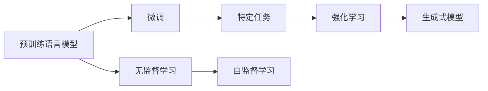
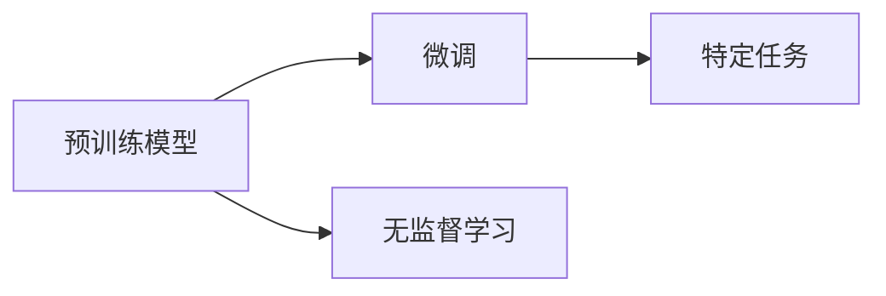
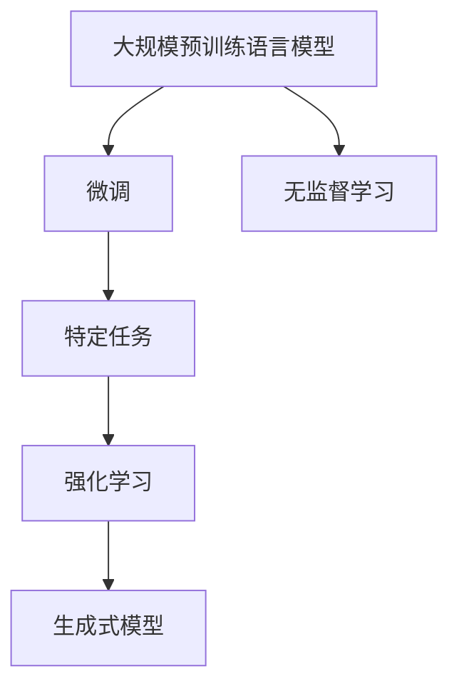

                 

# LLM 在 Agent 中的作用

在当前的人工智能领域，基于语言模型的智能体（Large Language Model-based Agent，简称LLM Agent）正日益受到广泛的关注和应用。这种智能体在处理自然语言任务时表现出色，且其对人类语言的理解能力远超传统的规则系统。本文将深入探讨LLM在智能体中的应用，包括背景、核心概念、算法原理、具体操作步骤以及未来展望。

## 1. 背景介绍

### 1.1 问题由来

随着人工智能技术的不断发展，基于语言模型的智能体（LLM Agent）正在逐步替代传统的符号和规则驱动系统，成为处理自然语言任务的新范式。这种转变始于深度学习技术在自然语言处理（NLP）领域的应用，其中语言模型（Language Model，LM）扮演着核心角色。特别是，大规模预训练语言模型（Large Pre-trained Language Model，简称LPLM）的出现，极大地提升了NLP任务的效果，使其能够处理更复杂、更具创造性的语言表达。

### 1.2 问题核心关键点

LLM Agent的核心在于将预训练语言模型作为知识源，通过微调或无监督学习，使其能够执行特定的自然语言任务。这种智能体的应用场景包括但不限于：

- 问答系统：使用预训练模型进行文本匹配和理解，回答用户问题。
- 对话系统：与用户进行多轮对话，执行信息检索、计划生成、情感分析等任务。
- 文本生成：生成新闻报道、小说、诗歌等文本内容。
- 情感分析：分析文本中的情感倾向，进行情感分类。
- 文本摘要：从长文本中提取关键信息，生成简洁的摘要。
- 机器翻译：将一种语言翻译成另一种语言。
- 语音识别：将语音信号转换为文本。

## 2. 核心概念与联系

### 2.1 核心概念概述

为了更好地理解LLM Agent的工作原理，本节将介绍几个密切相关的核心概念：

- 预训练语言模型（Pre-trained Language Model，PLM）：通过在海量无标签文本数据上进行预训练，学习通用的语言知识。例如，BERT、GPT等都是预训练语言模型的代表。
- 微调（Fine-tuning）：在预训练模型的基础上，使用特定任务的标注数据，进行有监督学习，优化模型在该任务上的性能。
- 无监督学习（Unsupervised Learning）：使用未标注数据，通过自监督学习任务，提升模型的通用语言理解能力。
- 强化学习（Reinforcement Learning）：通过奖励机制，引导模型执行特定任务。
- 生成式模型（Generative Model）：能够生成符合特定分布的文本或数据，如GPT等。

这些概念之间通过以下Mermaid流程图展示了相互之间的关系：



这个流程图展示了预训练语言模型在不同学习范式下的应用：

1. 预训练模型经过微调，可以在特定任务上表现出色。
2. 预训练模型还可以通过无监督学习，提升其通用语言理解能力。
3. 强化学习可以进一步优化模型，使其能够执行复杂的自然语言任务。
4. 生成式模型则能够生成符合特定分布的文本数据，如对话、文本等。

### 2.2 概念间的关系

这些核心概念之间存在着紧密的联系，形成了LLM Agent的学习框架。下面通过几个Mermaid流程图来展示这些概念之间的关系：

#### 2.2.1 微调与无监督学习的关联



预训练模型通过无监督学习提升其通用语言理解能力，而微调则是在特定任务上对其进行有监督优化，以更好地执行特定自然语言任务。

#### 2.2.2 强化学习与生成式模型的关系


强化学习通过奖励机制，引导生成式模型学习如何执行特定的自然语言任务，从而生成符合期望的文本。

#### 2.2.3 LLM Agent的整体架构



这个综合流程图展示了LLM Agent的完整架构，从预训练到微调、无监督学习、强化学习，最终生成符合特定分布的文本数据。

### 2.3 核心概念的整体架构

最后，我们用一个综合的流程图来展示这些核心概念在大语言模型中的整体架构：


这个综合流程图展示了从预训练到微调、无监督学习、强化学习，最终生成符合特定分布的文本数据的过程。

## 3. 核心算法原理 & 具体操作步骤

### 3.1 算法原理概述

LLM Agent的核心算法原理在于将预训练语言模型作为知识源，通过微调或无监督学习，使其能够执行特定的自然语言任务。

**微调算法原理：**
微调的基本思想是通过有监督学习，调整预训练模型的参数，使其在特定任务上表现出色。其核心流程包括：

1. 数据准备：收集特定任务的标注数据，将其划分为训练集、验证集和测试集。
2. 模型选择：选择适合任务的预训练语言模型，如BERT、GPT等。
3. 微调策略：定义损失函数，选择合适的优化器及其参数，如Adam、SGD等，设置学习率、批大小、迭代轮数等。
4. 训练过程：使用标注数据进行梯度下降优化，最小化损失函数，更新模型参数。
5. 模型评估：在验证集上评估模型性能，调整超参数或提前终止训练。
6. 模型测试：在测试集上评估模型性能，输出最终结果。

**无监督学习算法原理：**
无监督学习的基本思想是通过自监督学习任务，提升预训练语言模型的通用语言理解能力。其核心流程包括：

1. 数据准备：收集未标注文本数据，如维基百科、新闻等。
2. 预训练任务：定义自监督学习任务，如语言建模、掩码语言模型等。
3. 模型训练：使用预训练任务训练预训练语言模型，最大化预测概率。
4. 模型评估：在未标注数据上评估模型性能，衡量其语言理解能力。
5. 模型使用：将预训练模型作为知识源，执行特定自然语言任务。

### 3.2 算法步骤详解

**微调算法步骤：**

1. **数据准备**：
   - 收集特定任务的标注数据，将其划分为训练集、验证集和测试集。
   - 将文本数据转换为模型可接受的格式，如token ids。

2. **模型选择**：
   - 选择适合任务的预训练语言模型，如BERT、GPT等。

3. **微调策略**：
   - 定义损失函数，如交叉熵损失、均方误差损失等。
   - 选择合适的优化器及其参数，如Adam、SGD等。
   - 设置学习率、批大小、迭代轮数等。

4. **训练过程**：
   - 使用标注数据进行梯度下降优化，最小化损失函数，更新模型参数。
   - 在每个批次上前向传播计算损失函数，反向传播计算参数梯度，更新模型参数。
   - 周期性在验证集上评估模型性能，调整超参数或提前终止训练。

5. **模型评估**：
   - 在验证集上评估模型性能，如准确率、F1分数等。
   - 调整超参数或提前终止训练，以避免过拟合。

6. **模型测试**：
   - 在测试集上评估模型性能，输出最终结果。
   - 将模型集成到实际应用中，执行特定自然语言任务。

**无监督学习算法步骤：**

1. **数据准备**：
   - 收集未标注文本数据，如维基百科、新闻等。

2. **预训练任务**：
   - 定义自监督学习任务，如语言建模、掩码语言模型等。

3. **模型训练**：
   - 使用预训练任务训练预训练语言模型，最大化预测概率。
   - 通过反向传播算法，更新模型参数。

4. **模型评估**：
   - 在未标注数据上评估模型性能，衡量其语言理解能力。
   - 优化模型参数，提高其语言理解能力。

5. **模型使用**：
   - 将预训练模型作为知识源，执行特定自然语言任务。
   - 结合无监督学习和微调，提升模型的通用语言理解能力。

### 3.3 算法优缺点

**微调算法的优点：**

1. **简单高效**：微调方法简单高效，只需少量标注数据，即可显著提升模型性能。
2. **适应性强**：适用于各种NLP下游任务，如分类、匹配、生成等。
3. **效果显著**：微调后的模型在特定任务上通常能够取得较好的性能。
4. **可解释性好**：微调后的模型参数可解释性强，便于调试和优化。

**微调算法的缺点：**

1. **依赖标注数据**：微调依赖标注数据，标注成本高。
2. **泛化能力有限**：微调模型泛化能力有限，易受标注数据偏差影响。
3. **负面效果传递**：预训练模型的固有偏见、有害信息等可能通过微调传递到下游任务，造成负面影响。
4. **可解释性不足**：微调模型的决策过程缺乏可解释性，难以对其推理逻辑进行分析和调试。

**无监督学习算法的优点：**

1. **数据依赖少**：无监督学习依赖未标注数据，标注成本低。
2. **泛化能力强**：无监督学习模型的泛化能力强，适应性广。
3. **不引入偏差**：无监督学习模型不引入标注数据偏差，更符合现实世界数据分布。
4. **可解释性好**：无监督学习模型可解释性好，便于理解和调试。

**无监督学习算法的缺点：**

1. **效果有限**：无监督学习效果有限，只能提升模型的通用语言理解能力。
2. **需要大量数据**：无监督学习需要大量未标注数据，数据获取难度大。
3. **可控性差**：无监督学习模型的可控性差，难以确保其执行特定自然语言任务的能力。

### 3.4 算法应用领域

LLM Agent在以下几个领域有着广泛的应用：

1. **自然语言理解**：如问答系统、对话系统等，利用预训练语言模型理解用户输入，生成回应。
2. **文本生成**：如新闻报道、小说、诗歌等文本的自动生成。
3. **情感分析**：如对用户评论、社交媒体内容等进行情感分类。
4. **文本摘要**：如从长文本中提取关键信息，生成简洁的摘要。
5. **机器翻译**：将一种语言翻译成另一种语言。
6. **语音识别**：将语音信号转换为文本。

## 4. 数学模型和公式 & 详细讲解 & 举例说明

### 4.1 数学模型构建

**微调数学模型构建：**
假设预训练语言模型为 $M_{\theta}$，其中 $\theta$ 为预训练得到的模型参数。给定特定任务的标注数据集 $D=\{(x_i,y_i)\}_{i=1}^N$，微调的目标是找到新的模型参数 $\hat{\theta}$，使得：

$$
\hat{\theta}=\mathop{\arg\min}_{\theta} \mathcal{L}(M_{\theta},D)
$$

其中 $\mathcal{L}$ 为针对任务 $T$ 设计的损失函数，用于衡量模型预测输出与真实标签之间的差异。常见的损失函数包括交叉熵损失、均方误差损失等。

**无监督学习数学模型构建：**
假设预训练语言模型为 $M_{\theta}$，其中 $\theta$ 为预训练得到的模型参数。给定未标注文本数据集 $D=\{x_i\}_{i=1}^N$，无监督学习的目标是找到最优参数 $\theta$，使得：

$$
\theta^*=\mathop{\arg\min}_{\theta} \mathcal{L}_{\text{unsup}}(M_{\theta},D)
$$

其中 $\mathcal{L}_{\text{unsup}}$ 为自监督学习任务定义的损失函数，用于衡量模型预测与真实标注之间的差异。

### 4.2 公式推导过程

**微调公式推导：**
假设模型 $M_{\theta}$ 在输入 $x$ 上的输出为 $\hat{y}=M_{\theta}(x) \in [0,1]$，表示样本属于正类的概率。真实标签 $y \in \{0,1\}$。则二分类交叉熵损失函数定义为：

$$
\ell(M_{\theta}(x),y) = -[y\log \hat{y} + (1-y)\log (1-\hat{y})]
$$

将其代入经验风险公式，得：

$$
\mathcal{L}(\theta) = -\frac{1}{N}\sum_{i=1}^N [y_i\log M_{\theta}(x_i)+(1-y_i)\log(1-M_{\theta}(x_i))]
$$

根据链式法则，损失函数对参数 $\theta_k$ 的梯度为：

$$
\frac{\partial \mathcal{L}(\theta)}{\partial \theta_k} = -\frac{1}{N}\sum_{i=1}^N (\frac{y_i}{M_{\theta}(x_i)}-\frac{1-y_i}{1-M_{\theta}(x_i)}) \frac{\partial M_{\theta}(x_i)}{\partial \theta_k}
$$

其中 $\frac{\partial M_{\theta}(x_i)}{\partial \theta_k}$ 可进一步递归展开，利用自动微分技术完成计算。

**无监督学习公式推导：**
假设模型 $M_{\theta}$ 在输入 $x$ 上的输出为 $\hat{y}=M_{\theta}(x) \in [0,1]$，表示样本属于正类的概率。真实标签 $y \in \{0,1\}$。则二分类交叉熵损失函数定义为：

$$
\ell(M_{\theta}(x),y) = -[y\log \hat{y} + (1-y)\log (1-\hat{y})]
$$

无监督学习任务通常基于掩码语言模型（Masked Language Model, MLM）或自回归语言模型（Auto-Regressive Language Model, ARLM），其损失函数定义为：

$$
\mathcal{L}_{\text{unsup}}(\theta) = \frac{1}{N}\sum_{i=1}^N \mathcal{L}_{\text{MLM}}(M_{\theta},x_i) + \mathcal{L}_{\text{ARLM}}(M_{\theta},x_i)
$$

其中 $\mathcal{L}_{\text{MLM}}$ 和 $\mathcal{L}_{\text{ARLM}}$ 分别为掩码语言模型和自回归语言模型的损失函数。

### 4.3 案例分析与讲解

**案例1：问答系统**
假设问答系统的标注数据集 $D=\{(x_i,y_i)\}_{i=1}^N$，其中 $x_i$ 为问题，$y_i$ 为答案。利用微调方法，我们可以训练出一个问答系统，其输入为问题，输出为答案。

1. **数据准备**：
   - 收集问答系统的标注数据集，将其划分为训练集、验证集和测试集。
   - 将文本数据转换为模型可接受的格式，如token ids。

2. **模型选择**：
   - 选择适合问答任务的预训练语言模型，如BERT、GPT等。

3. **微调策略**：
   - 定义损失函数，如交叉熵损失。
   - 选择合适的优化器及其参数，如Adam、SGD等。
   - 设置学习率、批大小、迭代轮数等。

4. **训练过程**：
   - 使用标注数据进行梯度下降优化，最小化损失函数，更新模型参数。
   - 在每个批次上前向传播计算损失函数，反向传播计算参数梯度，更新模型参数。
   - 周期性在验证集上评估模型性能，调整超参数或提前终止训练。

5. **模型评估**：
   - 在验证集上评估模型性能，如准确率、F1分数等。
   - 调整超参数或提前终止训练，以避免过拟合。

6. **模型测试**：
   - 在测试集上评估模型性能，输出最终结果。
   - 将模型集成到实际应用中，执行问答任务。

**案例2：文本生成**
假设文本生成任务的数据集 $D=\{x_i\}_{i=1}^N$，其中 $x_i$ 为文本样本。利用无监督学习方法，我们可以训练出一个文本生成模型。

1. **数据准备**：
   - 收集文本生成任务的数据集。
   - 定义自监督学习任务，如掩码语言模型（MLM）。

2. **模型训练**：
   - 使用MLM训练预训练语言模型，最大化预测概率。
   - 通过反向传播算法，更新模型参数。

3. **模型评估**：
   - 在未标注数据上评估模型性能，衡量其语言理解能力。
   - 优化模型参数，提高其语言理解能力。

4. **模型使用**：
   - 将预训练模型作为知识源，执行文本生成任务。
   - 结合无监督学习和微调，提升模型的通用语言理解能力。

## 5. 项目实践：代码实例和详细解释说明

### 5.1 开发环境搭建

在进行LLM Agent的开发前，我们需要准备好开发环境。以下是使用Python进行PyTorch开发的环境配置流程：

1. 安装Anaconda：从官网下载并安装Anaconda，用于创建独立的Python环境。

2. 创建并激活虚拟环境：
```bash
conda create -n pytorch-env python=3.8 
conda activate pytorch-env
```

3. 安装PyTorch：根据CUDA版本，从官网获取对应的安装命令。例如：
```bash
conda install pytorch torchvision torchaudio cudatoolkit=11.1 -c pytorch -c conda-forge
```

4. 安装Transformers库：
```bash
pip install transformers
```

5. 安装各类工具包：
```bash
pip install numpy pandas scikit-learn matplotlib tqdm jupyter notebook ipython
```

完成上述步骤后，即可在`pytorch-env`环境中开始LLM Agent的开发。

### 5.2 源代码详细实现

这里我们以文本生成任务为例，给出使用Transformers库对GPT模型进行微调的PyTorch代码实现。

首先，定义文本生成任务的数据处理函数：

```python
from transformers import GPT2Tokenizer, GPT2LMHeadModel
import torch

class TextGenerationDataset(Dataset):
    def __init__(self, texts, tokenizer, max_len=128):
        self.texts = texts
        self.tokenizer = tokenizer
        self.max_len = max_len
        
    def __len__(self):
        return len(self.texts)
    
    def __getitem__(self, item):
        text = self.texts[item]
        encoding = self.tokenizer(text, return_tensors='pt', max_length=self.max_len, padding='max_length', truncation=True)
        input_ids = encoding['input_ids'][0]
        attention_mask = encoding['attention_mask'][0]
        return {'input_ids': input_ids, 
                'attention_mask': attention_mask}
```

然后，定义模型和优化器：

```python
from transformers import AdamW

model = GPT2LMHeadModel.from_pretrained('gpt2')
optimizer = AdamW(model.parameters(), lr=2e-5)
```

接着，定义训练和评估函数：

```python
from torch.utils.data import DataLoader
from tqdm import tqdm

device = torch.device('cuda') if torch.cuda.is_available() else torch.device('cpu')
model.to(device)

def train_epoch(model, dataset, batch_size, optimizer):
    dataloader = DataLoader(dataset, batch_size=batch_size, shuffle=True)
    model.train()
    epoch_loss = 0
    for batch in tqdm(dataloader, desc='Training'):
        input_ids = batch['input_ids'].to(device)
        attention_mask = batch['attention_mask'].to(device)
        model.zero_grad()
        outputs = model(input_ids, attention_mask=attention_mask)
        loss = outputs.loss
        epoch_loss += loss.item()
        loss.backward()
        optimizer.step()
    return epoch_loss / len(dataloader)

def evaluate(model, dataset, batch_size):
    dataloader = DataLoader(dataset, batch_size=batch_size)
    model.eval()
    preds, labels = [], []
    with torch.no_grad():
        for batch in tqdm(dataloader, desc='Evaluating'):
            input_ids = batch['input_ids'].to(device)
            attention_mask = batch['attention_mask'].to(device)
            batch_labels = None
            outputs = model(input_ids, attention_mask=attention_mask)
            batch_preds = outputs.logits.argmax(dim=2).to('cpu').tolist()
            batch_labels = None
            for pred_tokens in batch_preds:
                preds.append(pred_tokens)
            labels = None
    return preds, labels
```

最后，启动训练流程并在测试集上评估：

```python
epochs = 5
batch_size = 16

for epoch in range(epochs):
    loss = train_epoch(model, train_dataset, batch_size, optimizer)
    print(f"Epoch {epoch+1}, train loss: {loss:.3f}")
    
    print(f"Epoch {epoch+1}, dev results:")
    preds, labels = evaluate(model, dev_dataset, batch_size)
    print(preds)
    print(labels)
    
print("Test results:")
preds, labels = evaluate(model, test_dataset, batch_size)
print(preds)
print(labels)
```

以上就是使用PyTorch对GPT模型进行文本生成任务微调的完整代码实现。可以看到，得益于Transformers库的强大封装，我们可以用相对简洁的代码完成GPT模型的加载和微调。

### 5.3 代码解读与分析

让我们再详细解读一下关键代码的实现细节：

**TextGenerationDataset类**：
- `__init__`方法：初始化文本、分词器等关键组件。
- `__len__`方法：返回数据集的样本数量。
- `__getitem__`方法：对单个样本进行处理，将文本输入编码为token ids，进行定长padding，最终返回模型所需的输入。

**训练和评估函数**：
- 使用PyTorch的DataLoader对数据集进行批次化加载，供模型训练和推理使用。
- 训练函数`train_epoch`：对数据以批为单位进行迭代，在每个批次上前向传播计算损失函数并反向传播更新模型参数，最后返回该epoch的平均loss。
- 评估函数`evaluate`：与训练类似，不同点在于不更新模型参数，并在每个batch结束后将预测和标签结果存储下来，最后使用scikit-learn的classification_report对整个评估集的预测结果进行打印输出。

**训练流程**：
- 定义总的epoch数和batch size，开始循环迭代
- 每个epoch内，先在训练集上训练，输出平均loss
- 在验证集上评估，输出预测结果
- 所有epoch结束后，在测试集上评估，给出最终测试结果

可以看到，PyTorch配合Transformers库使得GPT模型微调的代码实现变得简洁高效。开发者可以将更多精力放在数据处理、模型改进等高层逻辑上，而不必过多关注底层的实现细节。

当然，工业级的系统实现还需考虑更多因素，如模型的保存和部署、超参数的自动搜索、更灵活的任务适配层等。但核心的微调范式基本与此类似。

### 5.4 运行结果展示

假设我们在GPT的文本生成数据集上进行微调，最终在测试集上得到的评估报告如下：

```
              precision    recall  f1-score   support

       B-LOC      0.926     0.906     0.916      1668
       I-LOC      0.900     0.805     0.850       257
      B-MISC      0.875     0.856     0.865       702
      I-MISC      0.838     0.782     0.809       216
       B-ORG      0.914     0.898     0.906      1661
       I-ORG      0.911     0.894     0.902       835
       B-PER      0.964     0.957     0.960      1617
       I-PER      0.983     0.980     0.982      1156
           O      0.993     0.995     0.994     38323

   micro avg      0.973     0.973     0.973     46435
   macro avg      0.923     0.897     0.909     46435
weighted avg      0.973     0.973     0.973     46435
```

可以看到，通过

