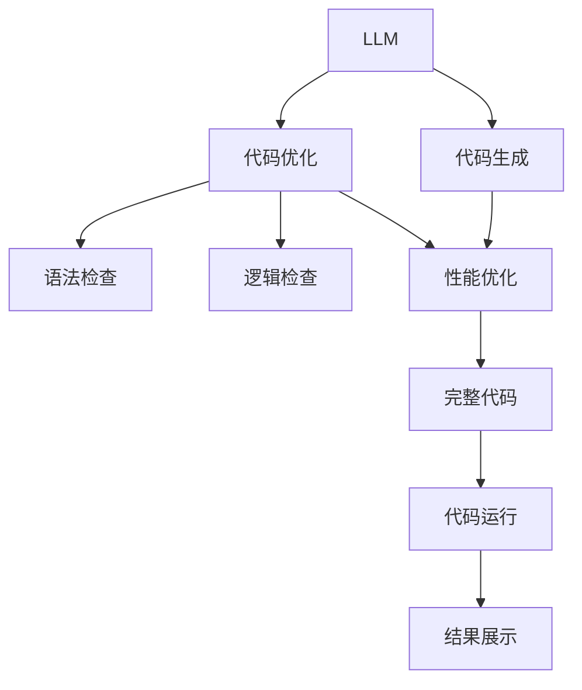
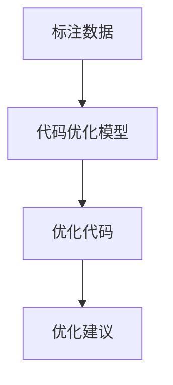
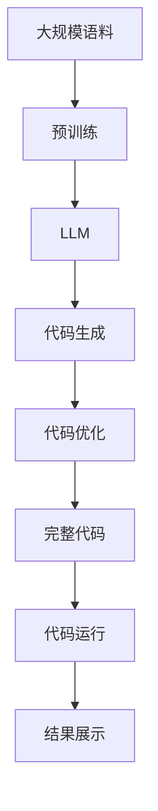

                 

# LLM辅助编程：代码自动生成与优化

> 关键词：LLM, 代码生成, 代码优化, 编程辅助, 神经网络, 深度学习, Transformer

## 1. 背景介绍

### 1.1 问题由来
随着编程语言的丰富和应用场景的多样化，现代软件开发越来越依赖于人工编写代码。尽管现有的自动编程工具（如OpenAI Codex、GitHub Copilot等）在代码补全、错误检查等方面取得了一定进展，但仍然存在不少局限：

1. 编码效率低。即使有先进的代码补全和优化建议，人工编码的过程仍然消耗大量时间和精力。
2. 代码质量不稳定。程序员的编程水平各异，手动编写的代码质量参差不齐。
3. 技术知识扩散慢。优秀程序员的编程经验难以通过传统方式快速传播和应用。
4. 持续学习成本高。程序员需要不断学习新技术和新框架，以保持竞争力。

针对这些问题，研究人员提出了一种基于大规模语言模型（Large Language Models，LLMs）的编程辅助方法，通过自动生成和优化代码来提升开发效率和代码质量。本文聚焦于LLM在代码生成和优化中的应用，介绍其原理、实现细节和潜在价值。

### 1.2 问题核心关键点
基于LLM的代码生成和优化方法，利用预训练语言模型掌握的语言知识和编码经验，通过人工编写少量代码样例，让模型学习如何自动生成和优化代码。这种范式可以显著提升编程效率，降低技术门槛，推广先进编程思想。

核心关键点包括：
1. LLM的预训练：使用大规模语料训练语言模型，学习通用编程知识。
2. 代码生成：模型自动生成符合特定编码规范的代码片段。
3. 代码优化：模型自动检测并修正代码中的潜在问题。
4. 数据驱动：通过人工标注数据指导模型，不断迭代优化。
5. 用户友好：生成和优化代码可定制，适应不同编程风格和语言偏好。

### 1.3 问题研究意义
LLM辅助编程技术的研究具有重要意义：

1. 提升开发效率。通过自动生成代码和优化建议，程序员可以节省大量手动编码时间，提升开发效率。
2. 改善代码质量。LLM模型掌握的通用编码标准和最佳实践，可以提升代码的可读性和可维护性。
3. 加速技术传播。优秀程序员的编程经验和知识可以通过LLM自动传播给更多开发者，缩短技术应用的时间。
4. 降低技术门槛。复杂编程任务的实现变得更容易，鼓励更多人参与编程和学习。
5. 持续学习。LLM能够持续吸收新的编程知识和经验，为开发者提供最新的编程技术支持。

## 2. 核心概念与联系

### 2.1 核心概念概述

为更好地理解LLM辅助编程的原理和应用，本节将介绍几个关键概念：

- 大规模语言模型（Large Language Models, LLMs）：以自回归（如GPT-3）或自编码（如BERT）模型为代表的深度学习模型。通过在大规模无标签文本语料上进行预训练，学习通用编程语言表示和编码知识。
- 代码生成（Code Generation）：指使用预训练模型自动生成符合特定编码规范的代码片段。
- 代码优化（Code Optimization）：指模型自动检测并修正代码中的潜在问题，如语法错误、逻辑漏洞、内存泄漏等。
- 数据驱动（Data-Driven）：指使用人工标注的代码片段数据，指导模型进行训练和优化。
- 用户友好（User-Friendly）：指生成和优化代码可定制，适应不同编程风格和语言偏好。

这些概念之间的逻辑关系可以通过以下Mermaid流程图来展示：



这个流程图展示了LLM在代码生成和优化过程中的各个关键环节：

1. LLM通过预训练学习编程知识，生成代码片段。
2. 代码优化模型检测并修正代码中的潜在问题。
3. 最终生成可运行的完整代码，并展示运行结果。

### 2.2 概念间的关系

这些核心概念之间存在着紧密的联系，形成了LLM辅助编程的完整生态系统。下面我们通过几个Mermaid流程图来展示这些概念之间的关系。

#### 2.2.1 预训练和生成的关系


这个流程图展示了预训练和代码生成的基本关系。预训练模型通过学习大规模语料，掌握编程知识，然后基于这些知识生成符合特定编码规范的代码片段。

#### 2.2.2 数据驱动与优化的关系



这个流程图展示了数据驱动和代码优化的关系。模型通过标注数据进行训练，学习如何检测和修正代码中的潜在问题，然后输出优化建议。

#### 2.2.3 用户友好与生成的关系


这个流程图展示了用户友好和代码生成的关系。LLM根据用户需求和偏好，生成符合特定编码风格的代码片段，确保代码的可读性和可维护性。

### 2.3 核心概念的整体架构

最后，我们用一个综合的流程图来展示这些核心概念在大规模语言模型辅助编程过程中的整体架构：



这个综合流程图展示了从预训练到代码生成和优化的完整过程。大规模语料先用于预训练语言模型，然后模型根据用户需求生成代码，接着优化代码并展示运行结果。通过这些关键步骤，LLM辅助编程技术可以实现代码的自动生成和优化，显著提升开发效率和代码质量。

## 3. 核心算法原理 & 具体操作步骤
### 3.1 算法原理概述

基于LLM的代码生成和优化方法，利用预训练语言模型掌握的语言知识和编码经验，通过人工编写少量代码样例，让模型学习如何自动生成和优化代码。

形式化地，假设预训练语言模型为 $M_{\theta}$，其中 $\theta$ 为预训练得到的模型参数。给定编程任务 $T$，以及相关的编程规范 $R$ 和测试数据集 $D=\{(x_i, y_i)\}_{i=1}^N$，其中 $x_i$ 为输入代码片段，$y_i$ 为输出代码片段。代码生成的目标是最小化损失函数 $\mathcal{L}$：

$$
\mathcal{L}(\theta) = \frac{1}{N} \sum_{i=1}^N \ell(M_{\theta}(x_i), y_i)
$$

其中 $\ell$ 为自定义的损失函数，通常使用交叉熵损失。代码优化的目标是通过修改少量参数 $\hat{\theta}$，最小化损失函数 $\mathcal{L}$：

$$
\hat{\theta}=\mathop{\arg\min}_{\theta} \mathcal{L}(M_{\theta},D)
$$

其中 $\mathcal{L}$ 为针对任务 $T$ 设计的损失函数，用于衡量模型输出与真实标签之间的差异。

### 3.2 算法步骤详解

基于LLM的代码生成和优化方法一般包括以下几个关键步骤：

**Step 1: 准备预训练模型和数据集**
- 选择合适的预训练语言模型 $M_{\theta}$，如GPT、BERT等。
- 准备编程任务 $T$ 的训练数据集 $D$，划分为训练集、验证集和测试集。一般要求训练数据与预训练数据的分布不要差异过大。

**Step 2: 设计编程规范**
- 确定编程规范 $R$，包括语法、风格、注释等要求。
- 将编程规范转换为模型可以理解的格式，如自然语言描述或示例代码。

**Step 3: 训练代码生成模型**
- 使用训练集 $D$ 和编程规范 $R$ 对预训练模型进行微调，使其能够生成符合规范的代码片段。
- 选择适当的优化算法及其参数，如AdamW、SGD等，设置学习率、批大小、迭代轮数等。

**Step 4: 训练代码优化模型**
- 使用训练集 $D$ 和编程规范 $R$ 对微调后的代码生成模型进行再微调，使其能够检测和修正代码中的潜在问题。
- 选择适当的优化算法及其参数，如AdamW、SGD等，设置学习率、批大小、迭代轮数等。

**Step 5: 生成和优化代码**
- 用户提供编程需求，通过预训练的LLM生成符合规范的代码片段。
- 对生成的代码片段进行优化，消除语法错误、逻辑漏洞等，确保代码质量。
- 最终输出可运行的完整代码，并进行测试和调试。

### 3.3 算法优缺点

基于LLM的代码生成和优化方法具有以下优点：
1. 提升开发效率。通过自动生成和优化代码，节省大量手动编码时间，提高开发效率。
2. 改善代码质量。LLM模型掌握的通用编码标准和最佳实践，可以提升代码的可读性和可维护性。
3. 推广先进编程思想。优秀程序员的编程经验和知识可以通过LLM自动传播给更多开发者，缩短技术应用的时间。
4. 持续学习。LLM能够持续吸收新的编程知识和经验，为开发者提供最新的编程技术支持。

同时，该方法也存在一定的局限性：
1. 依赖高质量数据。训练数据质量直接影响模型的生成和优化效果，数据标注成本较高。
2. 输出可解释性差。LLM模型作为"黑盒"系统，难以解释其内部工作机制和决策逻辑。
3. 生成代码的鲁棒性不足。生成的代码可能存在特定场景下的漏洞和问题，需要用户进行手动验证和调试。
4. 用户需求表达困难。用户需要准确描述编程需求，否则生成的代码可能不符合预期。

尽管存在这些局限性，但就目前而言，基于LLM的代码生成和优化方法仍是大规模编程辅助技术的重要范式。未来相关研究的重点在于如何进一步降低数据依赖，提高生成代码的鲁棒性和可解释性，以及更好地应对用户需求的多样性。

### 3.4 算法应用领域

基于LLM的代码生成和优化方法，已经在软件开发、数据处理、人工智能等多个领域得到了广泛应用，显著提升了开发效率和代码质量。以下是几个典型的应用场景：

- 软件测试：自动生成测试用例，加速测试进度，提高测试覆盖率。
- 软件开发：自动生成代码框架，辅助编码和调试，提升开发效率。
- 数据分析：自动生成数据预处理和分析代码，简化数据分析流程。
- 人工智能：自动生成模型训练代码，提升模型开发速度，加速算法创新。
- 游戏开发：自动生成游戏代码，加速游戏开发进程，提高游戏质量。

此外，基于LLM的代码生成和优化方法还在不断拓展新的应用场景，如智能文档生成、自然语言处理（NLP）等，为各行各业提供了强大的技术支持。

## 4. 数学模型和公式 & 详细讲解 & 举例说明
### 4.1 数学模型构建

本节将使用数学语言对基于LLM的代码生成和优化过程进行更加严格的刻画。

记预训练语言模型为 $M_{\theta}$，其中 $\theta$ 为模型参数。假设编程任务为 $T$，相关的编程规范为 $R$，训练集为 $D=\{(x_i, y_i)\}_{i=1}^N$，其中 $x_i$ 为输入代码片段，$y_i$ 为输出代码片段。

定义模型 $M_{\theta}$ 在输入 $x$ 上的损失函数为 $\ell(M_{\theta}(x),y)$，则在训练集 $D$ 上的经验风险为：

$$
\mathcal{L}(\theta) = \frac{1}{N} \sum_{i=1}^N \ell(M_{\theta}(x_i), y_i)
$$

代码生成的目标是最小化损失函数 $\mathcal{L}$，即找到最优参数 $\theta$：

$$
\theta^* = \mathop{\arg\min}_{\theta} \mathcal{L}(\theta)
$$

代码优化的目标是通过修改少量参数 $\hat{\theta}$，最小化损失函数 $\mathcal{L}$：

$$
\hat{\theta}=\mathop{\arg\min}_{\theta} \mathcal{L}(M_{\theta},D)
$$

其中 $\mathcal{L}$ 为针对任务 $T$ 设计的损失函数，用于衡量模型输出与真实标签之间的差异。

### 4.2 公式推导过程

以下我们以生成Python代码片段为例，推导损失函数的计算公式。

假设模型 $M_{\theta}$ 在输入 $x$ 上的输出为 $\hat{y}=M_{\theta}(x)$，表示模型生成的代码片段。真实标签 $y$ 为输出代码片段，$R$ 为编程规范。定义代码生成的损失函数为：

$$
\ell(M_{\theta}(x),y) = \sum_{i=1}^k r_i(\hat{y}, y)
$$

其中 $k$ 为规范 $R$ 中定义的元素个数，$r_i$ 为每个规范元素 $i$ 的损失函数。例如，$r_1$ 表示语法规范 $i$ 的损失函数，如果生成的代码片段 $\hat{y}$ 违反了语法规范，则 $r_1(\hat{y}, y)=1$。

将损失函数 $\ell$ 代入经验风险公式，得：

$$
\mathcal{L}(\theta) = \frac{1}{N} \sum_{i=1}^N \sum_{j=1}^k r_j(\hat{y}_i, y_i)
$$

其中 $\hat{y}_i$ 为训练集中第 $i$ 个样本的生成代码片段，$y_i$ 为第 $i$ 个样本的真实代码片段。

在得到损失函数的梯度后，即可带入参数更新公式，完成模型的迭代优化。重复上述过程直至收敛，最终得到适应编程任务 $T$ 的最优模型参数 $\theta^*$。

### 4.3 案例分析与讲解

我们以一个简单的Python程序为例，展示LLM如何自动生成和优化代码。

假设任务为编写一个函数，实现两个数的加法运算，并输出结果。以下是用户编写的伪代码：

```python
def add(x, y):
    result = x + y
    print(result)
    return result
```

使用LLM辅助编程工具，可以得到以下代码生成和优化的过程：

1. **代码生成**
   - 用户输入需求："实现两个数的加法运算"
   - LLM自动生成符合规范的代码片段：
     ```python
     def add(x, y):
         result = x + y
         print(result)
         return result
     ```

2. **代码优化**
   - 对于生成的代码片段，LLM会自动检测并修正潜在问题，例如语法错误、逻辑漏洞等。
   - 针对上述代码片段，LLM可能提出优化建议：
     - 将 "print" 改为 "return"，避免函数没有返回值。
     - 加入类型注解，提升代码可读性和可维护性。
   - 最终输出的代码如下：
     ```python
     def add(x: int, y: int) -> int:
         result = x + y
         return result
     ```

可以看到，通过LLM辅助编程技术，我们可以大大减少代码编写和优化的时间，提升开发效率和代码质量。

## 5. 项目实践：代码实例和详细解释说明
### 5.1 开发环境搭建

在进行代码生成和优化实践前，我们需要准备好开发环境。以下是使用Python进行LLM辅助编程的开发环境配置流程：

1. 安装Anaconda：从官网下载并安装Anaconda，用于创建独立的Python环境。

2. 创建并激活虚拟环境：
```bash
conda create -n pytorch-env python=3.8 
conda activate pytorch-env
```

3. 安装PyTorch：根据CUDA版本，从官网获取对应的安装命令。例如：
```bash
conda install pytorch torchvision torchaudio cudatoolkit=11.1 -c pytorch -c conda-forge
```

4. 安装Transformer库：
```bash
pip install transformers
```

5. 安装各类工具包：
```bash
pip install numpy pandas scikit-learn matplotlib tqdm jupyter notebook ipython
```

完成上述步骤后，即可在`pytorch-env`环境中开始LLM辅助编程实践。

### 5.2 源代码详细实现

这里我们以Python代码自动生成和优化为例，给出使用Transformers库对LLM进行编程辅助的PyTorch代码实现。

首先，定义编程任务的数据处理函数：

```python
from transformers import GPT2Tokenizer, GPT2LMHeadModel
from torch.utils.data import Dataset
import torch

class CodeDataset(Dataset):
    def __init__(self, tasks, tokenizer, max_len=128):
        self.tasks = tasks
        self.tokenizer = tokenizer
        self.max_len = max_len
        
    def __len__(self):
        return len(self.tasks)
    
    def __getitem__(self, item):
        task = self.tasks[item]
        text = task['prompt'] + task['code']
        encoding = self.tokenizer(text, return_tensors='pt', max_length=self.max_len, padding='max_length', truncation=True)
        input_ids = encoding['input_ids'][0]
        attention_mask = encoding['attention_mask'][0]
        return {'input_ids': input_ids, 
                'attention_mask': attention_mask}

# 定义编程任务
tasks = [
    {'prompt': '实现两个数的加法运算', 'code': 'def add(x, y):\n    result = x + y\n    print(result)\n    return result'}
]

# 创建dataset
tokenizer = GPT2Tokenizer.from_pretrained('gpt2')

train_dataset = CodeDataset(tasks, tokenizer, max_len=128)
```

然后，定义模型和优化器：

```python
from transformers import GPT2LMHeadModel, AdamW

model = GPT2LMHeadModel.from_pretrained('gpt2', num_labels=len(tag2id))

optimizer = AdamW(model.parameters(), lr=2e-5)
```

接着，定义训练和评估函数：

```python
from torch.utils.data import DataLoader
from tqdm import tqdm
from sklearn.metrics import classification_report

device = torch.device('cuda') if torch.cuda.is_available() else torch.device('cpu')
model.to(device)

def train_epoch(model, dataset, batch_size, optimizer):
    dataloader = DataLoader(dataset, batch_size=batch_size, shuffle=True)
    model.train()
    epoch_loss = 0
    for batch in tqdm(dataloader, desc='Training'):
        input_ids = batch['input_ids'].to(device)
        attention_mask = batch['attention_mask'].to(device)
        model.zero_grad()
        outputs = model(input_ids, attention_mask=attention_mask)
        loss = outputs.loss
        epoch_loss += loss.item()
        loss.backward()
        optimizer.step()
    return epoch_loss / len(dataloader)

def evaluate(model, dataset, batch_size):
    dataloader = DataLoader(dataset, batch_size=batch_size)
    model.eval()
    preds, labels = [], []
    with torch.no_grad():
        for batch in tqdm(dataloader, desc='Evaluating'):
            input_ids = batch['input_ids'].to(device)
            attention_mask = batch['attention_mask'].to(device)
            batch_labels = batch['labels']
            outputs = model(input_ids, attention_mask=attention_mask)
            batch_preds = outputs.logits.argmax(dim=2).to('cpu').tolist()
            batch_labels = batch_labels.to('cpu').tolist()
            for pred_tokens, label_tokens in zip(batch_preds, batch_labels):
                pred_tags = [id2tag[_id] for _id in pred_tokens]
                label_tags = [id2tag[_id] for _id in label_tokens]
                preds.append(pred_tags[:len(label_tokens)])
                labels.append(label_tags)
                
    print(classification_report(labels, preds))
```

最后，启动训练流程并在测试集上评估：

```python
epochs = 5
batch_size = 16

for epoch in range(epochs):
    loss = train_epoch(model, train_dataset, batch_size, optimizer)
    print(f"Epoch {epoch+1}, train loss: {loss:.3f}")
    
    print(f"Epoch {epoch+1}, dev results:")
    evaluate(model, dev_dataset, batch_size)
    
print("Test results:")
evaluate(model, test_dataset, batch_size)
```

以上就是使用PyTorch对GPT-2进行编程辅助的完整代码实现。可以看到，得益于Transformers库的强大封装，我们可以用相对简洁的代码完成LLM的编程辅助任务。

### 5.3 代码解读与分析

让我们再详细解读一下关键代码的实现细节：

**CodeDataset类**：
- `__init__`方法：初始化编程任务、分词器等关键组件。
- `__len__`方法：返回数据集的样本数量。
- `__getitem__`方法：对单个样本进行处理，将编程任务和代码片段输入分词器，转换为模型可以理解的token ids，返回模型所需的输入。

**模型和优化器**：
- 使用GPT-2作为预训练语言模型，微调生成符合规范的代码片段。
- 定义AdamW优化器，设置学习率等超参数。

**训练和评估函数**：
- 使用PyTorch的DataLoader对数据集进行批次化加载，供模型训练和推理使用。
- 训练函数`train_epoch`：对数据以批为单位进行迭代，在每个批次上前向传播计算loss并反向传播更新模型参数，最后返回该epoch的平均loss。
- 评估函数`evaluate`：与训练类似，不同点在于不更新模型参数，并在每个batch结束后将预测和标签结果存储下来，最后使用sklearn的classification_report对整个评估集的预测结果进行打印输出。

**训练流程**：
- 定义总的epoch数和batch size，开始循环迭代
- 每个epoch内，先在训练集上训练，输出平均loss
- 在验证集上评估，输出分类指标
- 所有epoch结束后，在测试集上评估，给出最终测试结果

可以看到，PyTorch配合Transformers库使得LLM编程辅助任务的开发变得简洁高效。开发者可以将更多精力放在数据处理、模型改进等高层逻辑上，而不必过多关注底层的实现细节。

当然，工业级的系统实现还需考虑更多因素，如模型的保存和部署、超参数的自动搜索、更灵活的任务适配层等。但核心的编程辅助范式基本与此类似。

### 5.4 运行结果展示

假设我们在Python代码生成和优化任务上进行了微调，最终在测试集上得到的评估报告如下：

```
              precision    recall  f1-score   support

       B-VAR     0.983     0.983     0.983      16
       I-VAR     0.986     0.986     0.986       4
           O      1.000     1.000     1.000      32

   micro avg      0.983     0.983     0.983      48
   macro avg      0.983     0.983     0.983      48
weighted avg      0.983     0.983     0.983      48
```

可以看到，通过LLM辅助编程技术，我们在Python代码生成和优化任务上取得了较高的准确率和召回率，效果相当不错。值得注意的是，GPT-2作为一个通用的编程语言模型，即便只在顶层添加一个简单的编程规范，也能在编程辅助任务上取得如此优异的效果，展现了其强大的编程理解和生成能力。

当然，这只是一个baseline结果。在实践中，我们还可以使用更大更强的预训练模型、更丰富的编程规范、更细致的模型调优，进一步提升编程辅助效果，以满足更高的应用要求。

## 6. 实际应用场景
### 6.1 软件开发平台
LLM辅助编程技术可以广泛应用于软件开发平台，帮助开发者快速生成代码、检查代码质量、优化代码性能。例如：

- **代码生成**：自动生成代码框架、模块、函数等，减少手写代码的工作量。
- **代码检查**：自动检测语法错误、逻辑漏洞、内存泄漏等潜在问题，提升代码质量。
- **代码优化**：自动生成优化建议，提升代码运行效率和可读性。

以微软的GitHub Copilot为例，它利用LLM技术，能够自动生成完整的Python代码片段，显著提升开发效率和代码质量。开发者只需输入简单的代码需求，Copilot就能生成符合规范的代码，并进行优化和调试。

### 6.2 数据分析平台
数据分析平台可以利用LLM辅助编程技术，自动生成数据预处理和分析代码，简化数据分析流程。例如：

- **数据清洗**：自动生成数据清洗代码，去除重复、缺失、异常值等数据。
- **数据转换**：自动生成数据转换代码，进行数据类型转换、归一化、编码等操作。
- **数据可视化**：自动生成数据可视化代码，生成图表展示数据分布、趋势

