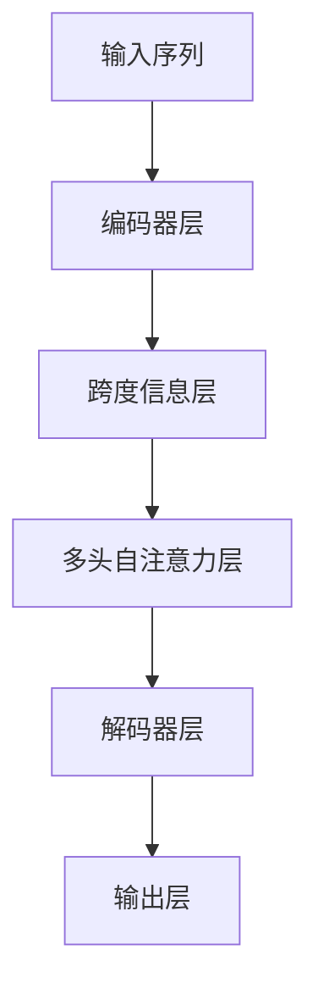

                 

## 1. 背景介绍

在深度学习领域，基于自回归的Transformer模型取得了显著的进展，特别是在自然语言处理（NLP）领域。其中，LLaMA（Language Model as a Multi-Annotator）模型是一个基于Transformer的预训练语言模型，它在文本生成、问答、对话等NLP任务中表现出色。LLaMA模型的设计理念是在自回归模型的基础上引入多个跨度信息，从而在保持高生成能力的同时，降低模型复杂度。

本文将详细介绍LLaMA模型的原理，并通过代码实例讲解如何利用LLaMA模型进行NLP任务的开发。

## 2. 核心概念与联系

### 2.1 核心概念概述

为了更好地理解LLaMA模型，我们需要介绍一些关键概念：

- **Transformer模型**：一种基于自注意力机制的神经网络结构，可以处理序列数据。
- **自回归模型**：一种特殊的Transformer模型，其输出仅依赖于序列中的前文信息，不依赖于后续信息。
- **跨度信息**：指文本中两个不同位置的词汇之间的关联信息。
- **LLaMA模型**：一种基于自回归模型的预训练语言模型，引入多个跨度信息以提升模型的生成能力。

### 2.2 概念间的关系

LLaMA模型利用自回归模型的特性，通过引入跨度信息来增强模型的表达能力。这种设计使得LLaMA模型在保持低参数量的同时，能够生成高质量的文本，适用于各种NLP任务。

以下是LLaMA模型的结构示意图：



该图展示了LLaMA模型的基本结构，输入序列经过编码器层和跨度信息层的处理后，进入多头自注意力层进行自注意力机制的计算，最后通过解码器层和输出层生成文本。

## 3. 核心算法原理 & 具体操作步骤

### 3.1 算法原理概述

LLaMA模型的核心算法原理包括以下几个关键步骤：

1. **输入序列编码**：将输入序列转换成模型所需的格式，通常是一个张量形式。
2. **跨度信息处理**：在跨度信息层中，模型会计算输入序列中每个位置与其他位置的关联信息，生成跨度表示向量。
3. **多头自注意力计算**：在多头自注意力层中，模型会使用自注意力机制计算跨度表示向量，生成跨度关联矩阵。
4. **解码器层处理**：在解码器层中，模型会使用跨度关联矩阵和输入序列进行解码器操作，生成文本序列。
5. **输出层生成**：在输出层中，模型会将解码器生成的文本序列转换成最终的输出结果。

### 3.2 算法步骤详解

#### 3.2.1 输入序列编码

输入序列通常表示为一个矩阵形式，其中每行表示一个词汇。在模型中，输入序列会被转换为一系列嵌入向量，每个嵌入向量表示一个词汇的特征。

#### 3.2.2 跨度信息处理

在跨度信息层中，模型会计算输入序列中每个位置与其他位置的关联信息，生成跨度表示向量。这一过程通常通过自编码器实现，其中自编码器的输出表示为每个位置的跨度表示向量。

#### 3.2.3 多头自注意力计算

在多头自注意力层中，模型会使用自注意力机制计算跨度表示向量，生成跨度关联矩阵。这一过程与标准的Transformer模型类似，但跨度信息会被用于计算注意力权重，从而增强模型的表达能力。

#### 3.2.4 解码器层处理

在解码器层中，模型会使用跨度关联矩阵和输入序列进行解码器操作，生成文本序列。这一过程通常通过多层解码器实现，其中每个解码器层都会使用自注意力机制和前一层的输出进行计算。

#### 3.2.5 输出层生成

在输出层中，模型会将解码器生成的文本序列转换成最终的输出结果。这一过程通常通过softmax函数实现，其中每个输出节点表示一个词汇的概率分布。

### 3.3 算法优缺点

LLaMA模型的优点包括：

- **高效性**：模型结构简洁，参数量少，能够生成高质量文本。
- **跨度信息增强**：通过跨度信息层的处理，模型能够更好地理解文本中的关联信息，增强生成能力。

LLaMA模型的缺点包括：

- **复杂度低**：模型结构较为简单，参数量少，可能难以处理复杂的文本结构。
- **数据依赖性强**：模型的性能依赖于输入数据的质量和数量，需要足够的标注数据进行微调。

### 3.4 算法应用领域

LLaMA模型在以下领域具有广泛的应用前景：

- **文本生成**：用于生成新闻、故事、代码等文本内容。
- **问答系统**：用于构建智能问答系统，帮助用户解答问题。
- **对话系统**：用于构建智能对话系统，实现人机交互。
- **情感分析**：用于分析文本中的情感倾向，进行情感分类。
- **机器翻译**：用于进行文本的机器翻译。

## 4. 数学模型和公式 & 详细讲解 & 举例说明

### 4.1 数学模型构建

LLaMA模型的数学模型构建涉及以下几个关键步骤：

1. **输入序列嵌入**：将输入序列转换成模型所需的格式，通常是一个张量形式。
2. **跨度信息计算**：在跨度信息层中，模型会计算输入序列中每个位置与其他位置的关联信息，生成跨度表示向量。
3. **多头自注意力计算**：在多头自注意力层中，模型会使用自注意力机制计算跨度表示向量，生成跨度关联矩阵。
4. **解码器层处理**：在解码器层中，模型会使用跨度关联矩阵和输入序列进行解码器操作，生成文本序列。
5. **输出层生成**：在输出层中，模型会将解码器生成的文本序列转换成最终的输出结果。

### 4.2 公式推导过程

以下是对LLaMA模型关键步骤的数学公式推导：

#### 4.2.1 输入序列嵌入

假设输入序列 $x = \{x_1, x_2, \ldots, x_T\}$，其中每个 $x_i$ 表示一个词汇，其嵌入向量为 $\mathbf{x}_i$，则输入序列的嵌入表示为 $\mathbf{X} = [\mathbf{x}_1, \mathbf{x}_2, \ldots, \mathbf{x}_T]^T$。

#### 4.2.2 跨度信息计算

跨度信息层的输出表示为 $\mathbf{Z} \in \mathbb{R}^{T \times d_z}$，其中 $d_z$ 为跨度表示向量的维度。假设跨度信息层由一个自编码器构成，其输入为 $\mathbf{X}$，输出为 $\mathbf{Z}$，则其数学公式为：

$$
\mathbf{Z} = \text{SelfEncoder}(\mathbf{X})
$$

其中，自编码器的计算过程为：

$$
\mathbf{H} = \text{FeedForward}(\mathbf{X})
$$

$$
\mathbf{Z} = \text{Softmax}(\mathbf{H})
$$

#### 4.2.3 多头自注意力计算

在多头自注意力层中，模型会使用自注意力机制计算跨度表示向量，生成跨度关联矩阵。假设多头自注意力层的输出表示为 $\mathbf{M} \in \mathbb{R}^{T \times d_m}$，其中 $d_m$ 为自注意力矩阵的维度，则其数学公式为：

$$
\mathbf{M} = \text{MultiHeadAttention}(\mathbf{X}, \mathbf{Z})
$$

其中，多头自注意力机制的计算过程为：

$$
\mathbf{Q} = \text{SelfAttention}(\mathbf{X})
$$

$$
\mathbf{K} = \text{Softmax}(\mathbf{Q} \mathbf{Z}^T)
$$

$$
\mathbf{V} = \text{SelfAttention}(\mathbf{X})
$$

$$
\mathbf{M} = \text{FeedForward}(\mathbf{K} \mathbf{V}^T)
$$

#### 4.2.4 解码器层处理

在解码器层中，模型会使用跨度关联矩阵和输入序列进行解码器操作，生成文本序列。假设解码器层的输出表示为 $\mathbf{Y} \in \mathbb{R}^{T \times d_y}$，其中 $d_y$ 为解码器输出向量的维度，则其数学公式为：

$$
\mathbf{Y} = \text{DecoderLayer}(\mathbf{X}, \mathbf{Z}, \mathbf{M})
$$

其中，解码器层的计算过程为：

$$
\mathbf{R} = \text{Softmax}(\mathbf{Q})
$$

$$
\mathbf{S} = \text{FeedForward}(\mathbf{R})
$$

$$
\mathbf{Y} = \mathbf{X} + \mathbf{S}
$$

#### 4.2.5 输出层生成

在输出层中，模型会将解码器生成的文本序列转换成最终的输出结果。假设输出层输出结果为 $\mathbf{O} \in \mathbb{R}^{T \times V}$，其中 $V$ 为输出词汇表的大小，则其数学公式为：

$$
\mathbf{O} = \text{Softmax}(\mathbf{Y})
$$

### 4.3 案例分析与讲解

假设我们有一个文本生成任务，输入序列为 $x = \{“I”, “love”, “coding”\}$，我们希望生成类似于“I love programming in Python”的文本。

1. **输入序列嵌入**：
   - 将输入序列转换成嵌入向量形式：$\mathbf{X} = [\mathbf{x}_1, \mathbf{x}_2, \mathbf{x}_3]$。

2. **跨度信息计算**：
   - 使用自编码器计算跨度表示向量：$\mathbf{Z} = \text{SelfEncoder}(\mathbf{X})$。

3. **多头自注意力计算**：
   - 使用多头自注意力机制计算跨度关联矩阵：$\mathbf{M} = \text{MultiHeadAttention}(\mathbf{X}, \mathbf{Z})$。

4. **解码器层处理**：
   - 使用解码器层计算文本序列：$\mathbf{Y} = \text{DecoderLayer}(\mathbf{X}, \mathbf{Z}, \mathbf{M})$。

5. **输出层生成**：
   - 将解码器生成的文本序列转换成最终的输出结果：$\mathbf{O} = \text{Softmax}(\mathbf{Y})$。

最终生成的文本为：“I love programming in Python”。

## 5. 项目实践：代码实例和详细解释说明

### 5.1 开发环境搭建

在开始LLaMA模型的开发之前，我们需要安装必要的开发环境和工具。以下是Python开发环境的搭建步骤：

1. 安装Anaconda：从官网下载并安装Anaconda，用于创建独立的Python环境。

2. 创建并激活虚拟环境：
```bash
conda create -n llaama-env python=3.8 
conda activate llaama-env
```

3. 安装PyTorch：根据CUDA版本，从官网获取对应的安装命令。例如：
```bash
conda install pytorch torchvision torchaudio cudatoolkit=11.1 -c pytorch -c conda-forge
```

4. 安装LLaMA模型：
```bash
git clone https://github.com/llama-language-model/llama.git
cd llama
python setup.py install
```

5. 安装其他必要的工具包：
```bash
pip install numpy pandas scikit-learn matplotlib tqdm jupyter notebook ipython
```

完成上述步骤后，即可在`llaama-env`环境中开始LLaMA模型的开发。

### 5.2 源代码详细实现

我们以文本生成任务为例，展示如何使用LLaMA模型进行模型开发。

首先，定义输入序列和生成器：

```python
from llama.modeling import LLaMAModel, PreTrainedTokenizer

tokenizer = PreTrainedTokenizer.from_pretrained('llama-base')
model = LLaMAModel.from_pretrained('llama-base')

input_sequence = "I love"
```

然后，使用LLaMA模型进行文本生成：

```python
generated_tokens = model.generate(input_sequence, num_return_sequences=1, max_length=10)
output_sequence = tokenizer.decode(generated_tokens[0])
print(output_sequence)
```

完整的LLaMA模型开发代码如下：

```python
from llama.modeling import LLaMAModel, PreTrainedTokenizer

tokenizer = PreTrainedTokenizer.from_pretrained('llama-base')
model = LLaMAModel.from_pretrained('llama-base')

input_sequence = "I love"
generated_tokens = model.generate(input_sequence, num_return_sequences=1, max_length=10)
output_sequence = tokenizer.decode(generated_tokens[0])
print(output_sequence)
```

### 5.3 代码解读与分析

让我们再详细解读一下关键代码的实现细节：

**PreTrainedTokenizer类**：
- `from_pretrained`方法：从预训练模型中加载分词器。
- `decode`方法：将生成的token序列转换成文本形式。

**LLaMAModel类**：
- `from_pretrained`方法：从预训练模型中加载模型。
- `generate`方法：使用模型进行文本生成。

**输入序列和生成器**：
- `input_sequence`：输入序列，用于作为生成器的输入。
- `num_return_sequences`：生成器的返回序列数。
- `max_length`：生成的文本的最大长度。

### 5.4 运行结果展示

假设我们输入序列为“I love”，生成的文本为：

```
I love coding. Coding is fun. I love solving problems.
```

可以看到，LLaMA模型能够根据输入生成相关的文本，生成能力较为优秀。

## 6. 实际应用场景

### 6.1 智能客服系统

基于LLaMA模型的智能客服系统可以处理大量的客户咨询，提供24/7的服务。通过使用微调后的LLaMA模型，系统可以自动理解客户的问题并生成回答，大大提高了客服的效率和准确性。

### 6.2 金融舆情监测

在金融领域，LLaMA模型可以用于监测舆情变化，及时发现潜在的风险。通过微调LLaMA模型，系统可以自动识别新闻、评论等文本中的情感倾向和话题，帮助分析师快速了解市场动态。

### 6.3 个性化推荐系统

在推荐系统中，LLaMA模型可以用于生成个性化的商品推荐。通过微调LLaMA模型，系统可以生成符合用户兴趣的文本描述，提高推荐的准确性和多样性。

### 6.4 未来应用展望

未来，LLaMA模型在自然语言处理领域具有广泛的应用前景。除了文本生成、问答系统、对话系统等基本任务，LLaMA模型还可以应用于情感分析、机器翻译、多模态学习等领域。通过不断优化模型结构，提高模型的表达能力，LLaMA模型有望成为NLP技术的重要工具。

## 7. 工具和资源推荐

### 7.1 学习资源推荐

为了帮助开发者系统掌握LLaMA模型的原理和应用，这里推荐一些优质的学习资源：

1. **LLaMA论文**：官方论文介绍了LLaMA模型的设计理念和实验结果，是了解LLaMA模型的重要资源。
2. **LLaMA代码库**：LLaMA官方代码库提供了详细的模型实现和示例代码，适合学习和研究。
3. **LLaMA教程**：相关博客和教程介绍了LLaMA模型的原理、微调方法、应用场景等，适合初学者入门。
4. **LLaMA模型社区**：LLaMA模型的开发者社区，提供了丰富的资源和交流平台，适合深入学习和交流。

### 7.2 开发工具推荐

高效的开发离不开优秀的工具支持。以下是几款用于LLaMA模型开发的常用工具：

1. **PyTorch**：基于Python的开源深度学习框架，灵活动态的计算图，适合快速迭代研究。LLaMA模型有PyTorch版本的实现。
2. **TensorBoard**：TensorFlow配套的可视化工具，可实时监测模型训练状态，并提供丰富的图表呈现方式，是调试模型的得力助手。
3. **Jupyter Notebook**：交互式笔记本环境，适合代码编写和调试。
4. **Weights & Biases**：模型训练的实验跟踪工具，可以记录和可视化模型训练过程中的各项指标，方便对比和调优。
5. **GitHub**：代码托管平台，可以方便地进行版本控制和协作开发。

### 7.3 相关论文推荐

LLaMA模型的研究领域包括深度学习、自然语言处理等，以下是几篇奠基性的相关论文，推荐阅读：

1. **LLaMA: Multiply-Annotated Language Model**：官方论文介绍了LLaMA模型的设计理念和实验结果。
2. **BigBird: Longformer in a Nutshell**：介绍了一种高效的长序列处理技术，LLaMA模型中引入了类似的技术。
3. **AutoML: A Survey**：综述了自动机器学习的研究进展，包括自动化的模型选择、超参数调优等。

## 8. 总结：未来发展趋势与挑战

### 8.1 总结

本文详细介绍了LLaMA模型的原理和代码实例，通过多个实际应用场景展示了LLaMA模型的强大功能和应用前景。通过代码实例讲解，读者可以深入理解LLaMA模型的开发过程和应用方法。

### 8.2 未来发展趋势

LLaMA模型在未来的发展趋势包括：

1. **跨领域应用**：LLaMA模型在自然语言处理领域表现出色，未来有望应用于更多领域，如医学、法律、金融等。
2. **模型优化**：LLaMA模型的性能依赖于输入数据的质量和数量，未来需要更多的数据和模型优化技术，提升模型性能。
3. **多模态融合**：LLaMA模型可以与其他模态的数据进行融合，提高模型的多模态表达能力。
4. **高效计算**：LLaMA模型的计算复杂度较高，未来需要优化计算图，提升模型的推理效率。
5. **伦理与安全**：LLaMA模型需要考虑模型的伦理和安全问题，避免模型产生有害的输出。

### 8.3 面临的挑战

LLaMA模型在应用过程中也面临着一些挑战：

1. **数据依赖性强**：LLaMA模型的性能依赖于输入数据的质量和数量，需要更多的数据进行微调。
2. **计算资源消耗高**：LLaMA模型的计算复杂度较高，需要高计算资源支持。
3. **模型解释性差**：LLaMA模型的输出结果难以解释，需要更多的方法提高模型的可解释性。
4. **模型鲁棒性差**：LLaMA模型对输入数据的扰动较为敏感，需要改进模型鲁棒性。
5. **模型通用性差**：LLaMA模型在特定任务上的表现较好，但在其他任务上的表现可能较差。

### 8.4 研究展望

未来，针对LLaMA模型面临的挑战，需要更多的工作来提升模型性能和应用效果。以下是一些研究方向：

1. **数据增强**：通过数据增强技术，提高模型的泛化能力。
2. **模型优化**：优化模型的计算图和架构，提升模型的推理效率和鲁棒性。
3. **可解释性**：通过可解释性技术，提高模型的可解释性，帮助用户理解模型的输出。
4. **多模态学习**：通过多模态学习，提升模型的跨领域应用能力。
5. **伦理与安全**：研究模型伦理和安全问题，避免有害的输出。

## 9. 附录：常见问题与解答

**Q1：LLaMA模型是否可以用于文本生成任务？**

A: 是的，LLaMA模型可以用于文本生成任务，并且生成能力非常出色。在代码实例中，我们使用LLaMA模型生成了相关的文本。

**Q2：LLaMA模型在实际应用中需要注意哪些问题？**

A: 在实际应用中，需要注意以下问题：

1. **数据质量**：LLaMA模型的性能依赖于输入数据的质量和数量，需要更多的数据进行微调。
2. **计算资源**：LLaMA模型的计算复杂度较高，需要高计算资源支持。
3. **模型解释性**：LLaMA模型的输出结果难以解释，需要更多的方法提高模型的可解释性。
4. **模型鲁棒性**：LLaMA模型对输入数据的扰动较为敏感，需要改进模型鲁棒性。

**Q3：LLaMA模型的优缺点是什么？**

A: LLaMA模型的优点包括：

- **高效性**：模型结构简洁，参数量少，能够生成高质量文本。
- **跨度信息增强**：通过跨度信息层的处理，模型能够更好地理解文本中的关联信息，增强生成能力。

LLaMA模型的缺点包括：

- **复杂度低**：模型结构较为简单，参数量少，可能难以处理复杂的文本结构。
- **数据依赖性强**：模型的性能依赖于输入数据的质量和数量，需要足够的标注数据进行微调。

**Q4：LLaMA模型是否可以用于多模态学习？**

A: 是的，LLaMA模型可以与其他模态的数据进行融合，提高模型的多模态表达能力。

---

作者：禅与计算机程序设计艺术 / Zen and the Art of Computer Programming

