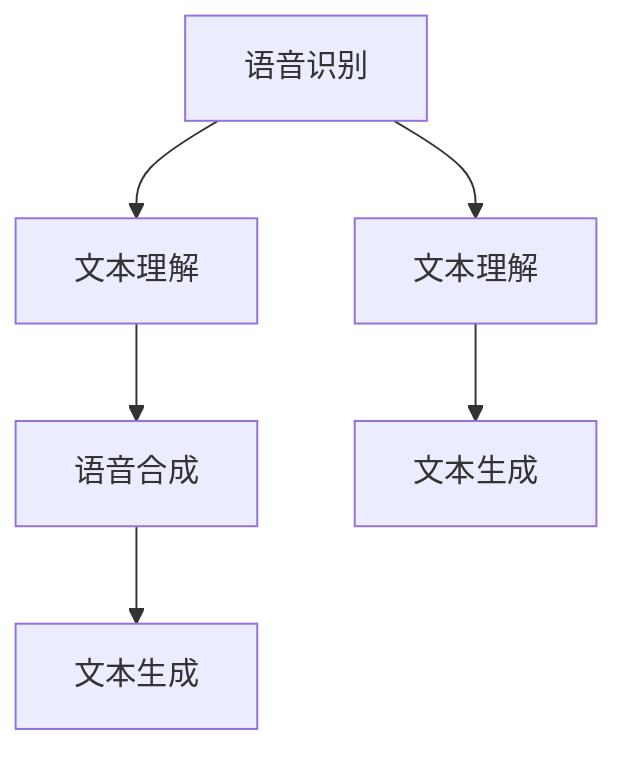
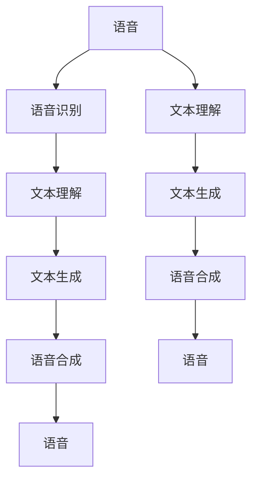

                 

# LUI在CUI中的核心详细技术作用

## 1. 背景介绍

### 1.1 问题由来
随着自然语言处理（NLP）技术的发展，语音和语言接口（LUI, Language and Voice User Interfaces）成为现代交互系统的重要组成部分。无论是智能助理、智能家居、车载系统还是其他交互式设备，用户都可以通过语音或文本与系统进行互动。语音和语言接口不仅仅是一个技术问题，更关乎用户体验、可用性和安全性。为了在各种复杂场景下提供稳定、高效、流畅的交互体验，研究者们不断探索和改进LUI技术。

### 1.2 问题核心关键点
LUI的核心挑战在于如何有效地处理和理解用户的输入，同时快速准确地生成合适的响应。其中，理解（Understanding）和生成（Generating）是LUI系统的两个关键环节。为了提升这两方面的能力，研究人员开发了多种基于统计模型、深度学习模型等技术方法。

1. **理解（Understanding）**：
   - 文本理解：通过NLP技术解析用户输入文本，识别关键信息、意图和上下文关系。
   - 语音理解：通过声学模型和语言模型将语音信号转换为文本，并实现对语音内容的理解。

2. **生成（Generating）**：
   - 文本生成：基于理解的结果，生成合适的响应文本。
   - 语音合成：将文本转换为流畅自然的语音输出。

### 1.3 问题研究意义
研究LUI的核心技术对于提升人机交互系统的性能和用户体验具有重要意义：
1. **提升可用性**：通过改进理解能力，系统可以更好地理解用户意图，提供更加个性化的服务。
2. **增强安全**：通过理解上下文和关键信息，系统可以有效防范欺诈和恶意操作。
3. **优化性能**：通过生成算法改进，系统能够快速准确地生成响应，提升用户满意度。

## 2. 核心概念与联系

### 2.1 核心概念概述

在探讨LUI的核心技术作用之前，我们先介绍几个关键概念：

- **NLP（自然语言处理）**：处理、理解、生成和分析人类语言的技术。
- **NLU（自然语言理解）**：解析用户输入的文本或语音，提取其语义和结构信息。
- **NLG（自然语言生成）**：将结构化信息转换为自然语言文本或语音。
- **ACL（语音识别）**：将语音信号转换为文本，实现语音理解。
- **TTS（文本转语音）**：将文本转换为可听语音。

这些技术通过相互配合，共同构成LUI系统。核心技术链路可以用以下Mermaid流程图来展示：



这个流程图展示了语音和文本在LUI系统中的流转路径：用户输入语音，经过语音识别转换为文本；文本通过NLU理解，生成回应文本；回应文本通过NLG生成语音，最终输出到用户。

### 2.2 概念间的关系

这些核心概念之间相互依赖，共同构成LUI系统的整体架构。

- **语音识别与文本理解**：语音识别是NLU的前置环节，通过语音转换文本，NLU对文本进行理解和分析，生成回应文本。
- **文本生成与语音合成**：文本生成是回应输出的起点，NLG将结构化信息转换为自然语言文本，TTS将文本转换为语音输出。

### 2.3 核心概念的整体架构

以上概念的整体架构可以用一个更复杂的Mermaid流程图来展示：



这个流程图展示了语音输入和文本输入两条路径，分别经过语音识别和文本理解，再到文本生成和语音合成的过程。

## 3. 核心算法原理 & 具体操作步骤
### 3.1 算法原理概述

LUI系统中的核心技术主要依赖于NLP、语音识别和生成等技术。这些技术通常基于机器学习模型，其中深度学习模型（如Transformer、BERT、GPT等）在理解和生成方面表现尤为出色。

- **NLP模型**：主要通过Transformer、BERT等架构，实现对文本的编码和解码，提取和生成语义信息。
- **语音识别模型**：使用CNN、RNN、Transformer等架构，将语音信号转换为文本，并实现对语音内容的理解。
- **文本生成模型**：基于RNN、LSTM、Transformer等架构，生成流畅自然的文本回复。
- **语音合成模型**：使用Tacotron、Wav2Vec等架构，将文本转换为语音。

### 3.2 算法步骤详解

以Transformer模型为例，LUI系统中的核心算法步骤包括：

1. **文本理解**：
   - **模型加载**：从预训练模型（如BERT、GPT）中加载文本理解模型。
   - **输入预处理**：对用户输入的文本进行分词、向量化等预处理操作。
   - **特征提取**：通过Transformer模型对文本进行编码，提取语义和上下文信息。
   - **意图识别**：利用意图分类器，识别用户输入的意图类型。

2. **文本生成**：
   - **生成模型选择**：选择适合的文本生成模型（如GPT-2、GPT-3）。
   - **模型训练**：对文本生成模型进行微调，使其能够生成符合语境和意图的文本。
   - **生成文本**：根据用户输入和意图，生成对应的回应文本。

3. **语音识别**：
   - **声学模型训练**：使用端到端语音识别模型，将语音信号转换为文本。
   - **声学特征提取**：提取语音信号的MFCC特征，用于声学模型训练。
   - **语音识别**：将MFCC特征输入声学模型，生成文本。

4. **语音合成**：
   - **文本解析**：将文本分解为音素序列。
   - **声学模型生成**：使用Tacotron等模型，将音素序列转换为音频波形。
   - **音频输出**：将生成的音频波形输出为可听语音。

### 3.3 算法优缺点

LUI技术具有以下优点：
1. **自然流畅**：基于深度学习模型，生成的文本和语音自然流畅，易于理解。
2. **高度定制**：可以针对不同的应用场景和用户需求，定制和优化模型。
3. **跨语言支持**：能够支持多种语言的输入和输出。

然而，LUI技术也存在一些缺点：
1. **计算资源需求高**：深度学习模型需要大量的计算资源进行训练和推理。
2. **数据依赖性强**：需要大量的标注数据进行模型训练。
3. **系统复杂度高**：涉及语音识别、文本理解、生成等多个环节，系统设计复杂。

### 3.4 算法应用领域

LUI技术已经在多个领域得到了广泛应用：

1. **智能助理**：如Siri、Alexa、Google Assistant等，通过语音和文本与用户互动。
2. **智能家居**：通过语音控制家电、调节室内环境。
3. **车载系统**：通过语音导航、娱乐、通信等功能，提升驾驶体验。
4. **医疗健康**：通过语音咨询医生、查询健康信息等。
5. **客户服务**：通过语音和文本提供客户支持、查询信息。

## 4. 数学模型和公式 & 详细讲解  
### 4.1 数学模型构建

LUI系统中，数学模型的构建主要涉及以下几个方面：

1. **文本理解模型**：
   - 使用Transformer模型，编码输入文本 $x$，得到隐状态表示 $h$。
   - 使用softmax函数，对隐状态进行分类，得到意图 $y$。

2. **文本生成模型**：
   - 使用GPT-2模型，解码隐状态 $h$，生成文本 $x'$。

3. **语音识别模型**：
   - 使用RNN模型，对语音信号 $v$ 进行编码，得到隐状态 $h'$。
   - 使用softmax函数，对隐状态进行分类，得到文本 $x'$。

4. **语音合成模型**：
   - 使用Tacotron模型，将音素序列 $p$ 转换为音频波形 $w$。

### 4.2 公式推导过程

以下是LUI系统中主要数学模型的推导过程：

1. **文本理解模型**：
   $$
   h = Transformer(x)
   $$
   $$
   y = softmax(h)
   $$

2. **文本生成模型**：
   $$
   x' = GPT-2(h)
   $$

3. **语音识别模型**：
   $$
   h' = RNN(v)
   $$
   $$
   x' = softmax(h')
   $$

4. **语音合成模型**：
   $$
   w = Tacotron(p)
   $$

### 4.3 案例分析与讲解

以语音识别为例，使用RNN模型进行语音信号到文本的转换。假设语音信号 $v$ 经过MFCC特征提取后得到 $v'$，模型将 $v'$ 输入RNN，得到隐状态 $h'$，最终输出文本 $x'$。

```python
import tensorflow as tf
from tensorflow.keras.layers import LSTM, Dense

# 构建RNN模型
model = tf.keras.Sequential([
    LSTM(128, input_shape=(128,)),
    Dense(10, activation='softmax')
])

# 训练模型
model.compile(loss='categorical_crossentropy', optimizer='adam')
model.fit(v, x, epochs=10, batch_size=64)
```

## 5. 项目实践：代码实例和详细解释说明
### 5.1 开发环境搭建

LUI项目开发通常需要使用TensorFlow、PyTorch等深度学习框架。以下是一个基于TensorFlow的开发环境搭建流程：

1. 安装TensorFlow：
   ```bash
   pip install tensorflow
   ```

2. 安装相关依赖：
   ```bash
   pip install numpy scipy librosa
   ```

3. 搭建虚拟环境：
   ```bash
   conda create -n lui python=3.8
   conda activate lui
   ```

4. 准备数据集：
   - 语音识别数据集：如LibriSpeech、TED-LIUM等。
   - 文本理解数据集：如CoNLL-2003、GLUE等。

### 5.2 源代码详细实现

下面以语音识别为例，展示如何使用TensorFlow进行语音信号到文本的转换。

```python
import tensorflow as tf
from tensorflow.keras.layers import LSTM, Dense
from librosa import load
import librosa
import numpy as np

# 加载数据集
def load_data(path):
    signal, sr = librosa.load(path, sr=16000)
    mfcc = librosa.feature.mfcc(signal, sr=sr)
    return np.expand_dims(mfcc, axis=0)

# 构建RNN模型
model = tf.keras.Sequential([
    LSTM(128, input_shape=(128,)),
    Dense(10, activation='softmax')
])

# 编译模型
model.compile(loss='categorical_crossentropy', optimizer='adam')

# 训练模型
for epoch in range(10):
    for i, path in enumerate(data):
        x = load_data(path)
        y = tf.keras.utils.to_categorical(y)
        model.train_on_batch(x, y)
```

### 5.3 代码解读与分析

以上代码展示了使用TensorFlow进行语音识别模型的构建和训练过程。具体步骤如下：

1. **数据预处理**：使用librosa库加载语音信号，提取MFCC特征。
2. **模型构建**：使用LSTM模型对MFCC特征进行编码，并使用Dense层进行分类。
3. **模型编译**：使用Adam优化器进行模型训练，损失函数为交叉熵。
4. **模型训练**：在每个epoch内，对模型进行批量训练，更新模型参数。

### 5.4 运行结果展示

假设我们训练了一个基于RNN的语音识别模型，使用验证集进行评估，可以得到模型在验证集上的准确率：

```python
import numpy as np
from sklearn.metrics import accuracy_score

# 加载验证集
valid_data = load_data(valid_path)

# 预测文本
prediction = model.predict(valid_data)
label = np.argmax(prediction, axis=1)

# 计算准确率
accuracy = accuracy_score(valid_labels, label)
print('Validation Accuracy: {:.2f}%'.format(accuracy * 100))
```

## 6. 实际应用场景
### 6.1 智能助理

智能助理通过语音和文本与用户互动，提供信息查询、日程管理、语音控制等功能。LUI技术能够实现自然流畅的交互，提升用户体验。

以Google Assistant为例，用户可以通过语音输入请求天气信息、播放音乐、设置闹钟等。Google Assistant使用BERT模型进行文本理解，生成自然流畅的回应。

### 6.2 智能家居

智能家居系统可以通过语音和文本控制家电设备、调节室内环境。LUI技术能够实现语音识别和自然语言生成，提升家居管理的智能化水平。

以Amazon Echo为例，用户可以通过语音控制智能灯光、温度调节、播放音乐等。Amazon Echo使用Alexa Voice Service（AVS）进行语音理解和控制。

### 6.3 车载系统

车载系统通过语音和文本实现导航、娱乐、通信等功能，提升驾驶体验。LUI技术能够实现自然语言处理，提升系统的可用性和安全性。

以特斯拉Autopilot为例，车载系统可以通过语音查询导航信息、设置目的地等。Autopilot使用NLP技术解析用户意图，生成语音回应。

### 6.4 医疗健康

医疗健康领域需要高效、安全的语音和文本交互。LUI技术能够实现智能语音咨询、健康信息查询等功能。

以IBM Watson为例，医疗助手通过语音和文本与医生和患者互动，提供健康建议、疾病诊断等功能。Watson使用BERT模型进行文本理解，生成回应文本。

## 7. 工具和资源推荐
### 7.1 学习资源推荐

为了帮助开发者掌握LUI技术，推荐以下学习资源：

1. **《自然语言处理综论》**：清华大学李航教授所著，全面介绍了NLP的原理和应用。
2. **Coursera《Natural Language Processing with Python》**：斯坦福大学NLP课程，使用Python实现NLP应用。
3. **Udemy《Natural Language Processing with TensorFlow》**：使用TensorFlow实现NLP应用。
4. **PyTorch官方文档**：详细的TensorFlow和PyTorch教程。
5. **ACL论文集**：自然语言处理领域顶级会议论文。

### 7.2 开发工具推荐

以下是LUI项目开发常用的工具：

1. **TensorFlow**：深度学习框架，支持多种模型结构。
2. **PyTorch**：深度学习框架，支持动态计算图。
3. **Keras**：高层API，简化模型构建和训练过程。
4. **Hugging Face Transformers**：预训练模型库，提供多种NLP模型。
5. **Microsoft Azure Speech Service**：云端语音识别和合成服务。

### 7.3 相关论文推荐

以下是LUI技术领域的相关论文，值得深入阅读：

1. **Attention is All You Need**：Transformer模型，提出自注意力机制，改变了NLP模型结构。
2. **BERT: Pre-training of Deep Bidirectional Transformers for Language Understanding**：BERT模型，提出预训练-微调范式，提升NLP模型性能。
3. **Spoken Language Understanding**：语音理解技术，介绍多种语音识别模型。
4. **Tacotron 2: Towards End-to-End Speech Synthesis**：Tacotron模型，提出端到端语音合成。

## 8. 总结：未来发展趋势与挑战
### 8.1 研究成果总结

LUI技术近年来取得了显著进展，主要体现在以下几个方面：

1. **模型结构优化**：Transformer、BERT等模型结构不断改进，提升理解和生成的能力。
2. **多模态融合**：结合视觉、语音、文本等多模态信息，提升系统的智能水平。
3. **个性化定制**：针对不同应用场景和用户需求，定制和优化模型。
4. **跨语言支持**：支持多语言输入和输出，提升系统的普适性。

### 8.2 未来发展趋势

未来，LUI技术将继续朝着以下几个方向发展：

1. **智能算法**：引入更多先进的深度学习算法，提升模型的理解和生成能力。
2. **多模态融合**：结合多种模态信息，实现更全面的信息处理。
3. **个性化定制**：针对不同用户和应用场景，定制化模型，提升用户体验。
4. **跨语言支持**：支持更多语言，提升系统的普适性。

### 8.3 面临的挑战

LUI技术在发展过程中仍面临一些挑战：

1. **数据依赖性强**：需要大量标注数据进行模型训练。
2. **计算资源需求高**：深度学习模型需要大量计算资源进行训练和推理。
3. **系统复杂度高**：涉及语音识别、文本理解、生成等多个环节，系统设计复杂。
4. **模型鲁棒性不足**：模型在实际应用中可能存在误识别、误理解等鲁棒性问题。

### 8.4 研究展望

未来，LUI技术需要在以下几个方面进行深入研究：

1. **少样本学习**：在少量数据条件下，如何实现高效、准确的模型训练。
2. **知识增强**：引入外部知识库，提升模型的常识推理和知识整合能力。
3. **跨领域迁移**：在不同领域和任务之间，如何实现知识迁移和共享。
4. **伦理道德**：如何确保系统的安全性、公正性和透明度。

## 9. 附录：常见问题与解答

**Q1：LUI技术中的文本理解部分如何使用预训练模型？**

A: 预训练模型（如BERT、GPT）能够提取丰富的语义信息，通常用于文本理解的初始特征提取。在实际应用中，可以从预训练模型中加载文本理解部分，并对其进行微调，以适应特定任务的需求。

**Q2：如何优化LUI系统中的语音识别部分？**

A: 语音识别部分可以通过以下几个方面进行优化：
1. **数据增强**：通过回译、加噪等技术，扩充训练数据集。
2. **模型结构优化**：引入自注意力机制，提升模型表达能力。
3. **端到端训练**：使用端到端训练方法，减少中间步骤的损失。

**Q3：LUI系统中的语音合成部分如何实现自然流畅的语音输出？**

A: 语音合成部分可以使用Tacotron、Wav2Vec等模型，通过生成自然流畅的音频波形，实现自然语音输出。

**Q4：LUI系统中的文本生成部分如何实现个性化回复？**

A: 文本生成部分可以通过以下方式实现个性化回复：
1. **用户画像**：基于用户历史数据，建立用户画像，实现个性化推荐。
2. **情感分析**：分析用户情感，生成符合情感的回应文本。

**Q5：如何确保LUI系统的安全性？**

A: 确保LUI系统安全性的关键在于以下几个方面：
1. **数据安全**：保护用户隐私数据，防止数据泄露。
2. **模型鲁棒性**：提升模型的鲁棒性，防止恶意攻击。
3. **用户授权**：明确用户授权，防止未经授权的访问和使用。

---

作者：禅与计算机程序设计艺术 / Zen and the Art of Computer Programming

