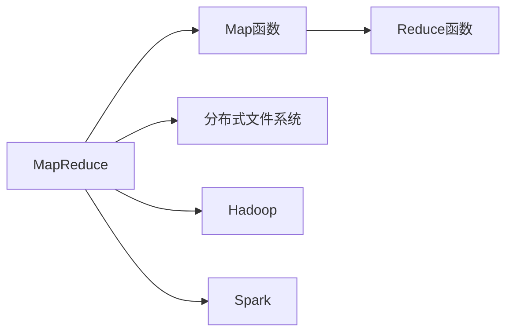

                 

# MapReduce原理与代码实例讲解

> 关键词：MapReduce, 分布式计算, Hadoop, 大数据, Map函数, Reduce函数

## 1. 背景介绍

### 1.1 问题由来
随着互联网和数字化进程的快速发展，数据量呈爆炸式增长，传统的集中式存储和处理方式已难以应对数据的巨大规模和复杂度。分布式计算技术因此应运而生，成为处理大规模数据的关键手段。MapReduce作为一种经典的分布式计算框架，已在业界广泛应用，是处理大数据的核心技术之一。

## 2. 核心概念与联系

### 2.1 核心概念概述

MapReduce是一种高效的分布式计算框架，其核心思想是将大规模数据集拆分成若干个小片段，并行计算这些小片段，最后将结果合并得到最终结果。该框架由两部分组成：Map函数和Reduce函数。

- **Map函数**：将输入数据拆分成若干个小片段，并对其进行处理，生成中间结果。
- **Reduce函数**：将Map函数产生的中间结果进行合并，最终输出结果。

MapReduce的计算流程可以概括为以下三步：

1. 将输入数据拆分成若干个小片段，对每个小片段分别执行Map函数，得到中间结果。
2. 将Map函数产生的中间结果进行合并，并执行Reduce函数，得到最终结果。
3. 将最终结果输出到分布式文件系统。

这种计算模型具有高度的并行性和扩展性，可以轻松处理大规模数据集。

### 2.2 核心概念间的关系

MapReduce的核心概念通过以下Mermaid流程图进行展示：



该流程图展示了MapReduce框架的关键组件和流程：

- A：MapReduce框架
- B：Map函数
- C：Reduce函数
- D：分布式文件系统（如HDFS）
- E：Hadoop
- F：Spark

## 3. 核心算法原理 & 具体操作步骤

### 3.1 算法原理概述

MapReduce算法基于Matei Zaharia于2004年提出的MapReduce编程模型，旨在处理大规模数据集。其核心思想是将数据集拆分成若干个小片段，对每个小片段执行Map函数，并将中间结果传递给Reduce函数，最终将Reduce函数的输出合并为最终的计算结果。

MapReduce算法的计算模型可以表示为：

$$ MapReduce = Map + Shuffle + Reduce $$

其中，Shuffle是Map和Reduce之间的数据传递过程。

### 3.2 算法步骤详解

MapReduce算法的具体步骤如下：

1. **Map阶段**：将输入数据拆分成若干个小片段，对每个小片段分别执行Map函数，生成中间结果。
2. **Shuffle阶段**：对Map函数产生的中间结果进行排序和合并，将相同键的记录传递给同一个Reduce函数。
3. **Reduce阶段**：对Shuffle阶段合并后的中间结果执行Reduce函数，生成最终结果。

MapReduce的计算流程可以进一步细化为以下步骤：

- 1. 输入数据：将输入数据拆分成若干个小片段。
- 2. 分割和映射：对每个小片段执行Map函数，生成中间结果。
- 3. Shuffle：对Map函数产生的中间结果进行排序和合并，将相同键的记录传递给同一个Reduce函数。
- 4. 合并：对Shuffle阶段合并后的中间结果执行Reduce函数，生成最终结果。
- 5. 输出结果：将最终结果输出到分布式文件系统。

### 3.3 算法优缺点

MapReduce框架具有以下优点：

- **可扩展性**：通过增加计算节点，可以轻松扩展计算能力。
- **容错性**：通过冗余数据副本，可以容忍单个计算节点的故障。
- **简单易用**：编程模型简单，易于理解和实现。

MapReduce框架也存在以下缺点：

- **资源利用率低**：由于Shuffle阶段的数据传递和合并，导致资源利用率较低。
- **延迟较高**：由于需要多次I/O操作，导致延迟较高。
- **复杂度较高**：需要深入理解MapReduce模型，才能编写高效的Map和Reduce函数。

### 3.4 算法应用领域

MapReduce算法在大数据处理领域有着广泛的应用，主要包括：

- **数据分析**：用于处理大规模数据集，如Google Analytics、Twitter等。
- **数据挖掘**：用于挖掘数据中的隐藏规律和关联，如电商推荐、广告定向等。
- **机器学习**：用于训练和优化大规模机器学习模型，如ImageNet、AlphaGo等。
- **自然语言处理**：用于处理大规模文本数据，如语言模型训练、情感分析等。
- **科学计算**：用于处理大规模科学计算问题，如天气预报、基因序列分析等。

## 4. 数学模型和公式 & 详细讲解

### 4.1 数学模型构建

MapReduce算法的主要数学模型为分布式计算模型。假设输入数据为 $D$，Map函数为 $f_M$，Reduce函数为 $f_R$，则MapReduce算法的计算过程可以表示为：

$$ MapReduce(D) = \bigcup_{i=1}^n f_M(D_i) \rightarrow f_R(\bigcup_{i=1}^n f_M(D_i)) $$

其中，$D_i$ 表示输入数据拆分成的小片段，$n$ 表示小片段的总数。

### 4.2 公式推导过程

MapReduce算法的计算过程可以进一步细化为以下步骤：

1. **Map阶段**：对输入数据 $D$ 进行分割，得到若干个小片段 $D_i$，对每个小片段 $D_i$ 执行Map函数 $f_M$，得到中间结果 $O_i$。
2. **Shuffle阶段**：对Map函数产生的中间结果 $O_i$ 进行排序和合并，将相同键的记录传递给同一个Reduce函数 $f_R$。
3. **Reduce阶段**：对Shuffle阶段合并后的中间结果 $O'$ 执行Reduce函数 $f_R$，生成最终结果 $R$。

公式推导如下：

$$ MapReduce(D) = \bigcup_{i=1}^n f_M(D_i) \rightarrow f_R(\bigcup_{i=1}^n f_M(D_i)) $$

其中，$D_i = \{ (k, v) | (k, v) \in D \}$，$O_i = \{ (k, v_i) | (k, v_i) \in f_M(D_i) \}$，$O' = \bigcup_{i=1}^n O_i$，$R = f_R(O')$。

### 4.3 案例分析与讲解

假设我们要对一组数字进行求和，输入数据为 $D = \{1, 2, 3, 4, 5, 6, 7, 8, 9, 10\}$，Map函数为 $f_M(x) = \{(x, x)\}$，Reduce函数为 $f_R(O) = \sum_{x \in O} x$。

MapReduce算法的计算过程如下：

1. **Map阶段**：将输入数据 $D$ 拆分成若干个小片段 $D_i$，对每个小片段 $D_i$ 执行Map函数 $f_M$，得到中间结果 $O_i$。

   - $D_1 = \{1, 2\}$，$O_1 = \{(1, 1), (2, 2)\}$。
   - $D_2 = \{3, 4\}$，$O_2 = \{(3, 3), (4, 4)\}$。
   - $D_3 = \{5, 6\}$，$O_3 = \{(5, 5), (6, 6)\}$。
   - $D_4 = \{7, 8\}$，$O_4 = \{(7, 7), (8, 8)\}$。
   - $D_5 = \{9, 10\}$，$O_5 = \{(9, 9), (10, 10)\}$。

2. **Shuffle阶段**：对Map函数产生的中间结果 $O_i$ 进行排序和合并，将相同键的记录传递给同一个Reduce函数。

   - $O_1 = \{(1, 1), (2, 2)\}$，$O_2 = \{(3, 3), (4, 4)\}$，$O_3 = \{(5, 5), (6, 6)\}$，$O_4 = \{(7, 7), (8, 8)\}$，$O_5 = \{(9, 9), (10, 10)\}$。

3. **Reduce阶段**：对Shuffle阶段合并后的中间结果 $O'$ 执行Reduce函数 $f_R$，生成最终结果 $R$。

   - $O' = \{(1, 1), (2, 2), (3, 3), (4, 4), (5, 5), (6, 6), (7, 7), (8, 8), (9, 9), (10, 10)\}$。
   - $R = f_R(O') = 1 + 2 + 3 + 4 + 5 + 6 + 7 + 8 + 9 + 10 = 55$。

## 5. 项目实践：代码实例和详细解释说明

### 5.1 开发环境搭建

在进行MapReduce项目实践前，我们需要准备好开发环境。以下是使用Java进行Hadoop开发的环境配置流程：

1. 安装JDK：从官网下载并安装Java Development Kit。

2. 安装Hadoop：从官网下载并安装Hadoop。

3. 安装IDE：推荐使用Eclipse或IntelliJ IDEA，便于开发和调试。

4. 安装Maven：从官网下载并安装Maven，用于依赖管理和自动化构建。

完成上述步骤后，即可在IDE中进行Hadoop项目开发。

### 5.2 源代码详细实现

下面我们以MapReduce框架的经典例子——对一组数字进行求和为例，给出使用Java进行MapReduce开发的源代码实现。

首先，定义Map函数：

```java
public class MapFunction extends Mapper<LongWritable, Text, Text, IntWritable> {

    @Override
    protected void map(LongWritable key, Text value, Context context) throws IOException, InterruptedException {
        String[] values = value.toString().split(",");
        for (String v : values) {
            context.write(new Text(v), new IntWritable(Integer.parseInt(v)));
        }
    }
}
```

然后，定义Reduce函数：

```java
public class ReduceFunction extends Reducer<Text, IntWritable, Text, IntWritable> {

    @Override
    protected void reduce(Text key, Iterable<IntWritable> values, Context context) throws IOException, InterruptedException {
        int sum = 0;
        for (IntWritable value : values) {
            sum += value.get();
        }
        context.write(key, new IntWritable(sum));
    }
}
```

最后，编写MapReduce的主程序：

```java
public class MapReduceExample {

    public static void main(String[] args) throws Exception {
        Configuration conf = new Configuration();
        Job job = Job.getInstance(conf, "mapreduce example");

        job.setJarByClass(MapReduceExample.class);
        job.setMapperClass(MapFunction.class);
        job.setCombinerClass(ReduceFunction.class);
        job.setReducerClass(ReduceFunction.class);

        job.setOutputKeyClass(Text.class);
        job.setOutputValueClass(IntWritable.class);

        FileInputFormat.addInputPath(job, new Path(args[0]));
        FileOutputFormat.setOutputPath(job, new Path(args[1]));

        System.exit(job.waitForCompletion(true) ? 0 : 1);
    }
}
```

在代码中，Map函数将输入数据拆分成若干个小片段，并对每个小片段执行Map函数，生成中间结果。Reduce函数对Map函数产生的中间结果进行合并，并执行Reduce函数，生成最终结果。

### 5.3 代码解读与分析

这里我们详细解读一下代码的关键部分：

**Map函数**：
- 从输入数据中解析出每个数字。
- 将每个数字作为Map函数的键值对，输出给Reduce函数。

**Reduce函数**：
- 接收相同键的所有值，进行累加计算。
- 输出最终结果。

**主程序**：
- 配置Job环境，设置输入输出路径。
- 设置Map和Reduce函数。
- 启动MapReduce任务。

### 5.4 运行结果展示

假设我们输入的数据为 $\{1, 2, 3, 4, 5, 6, 7, 8, 9, 10\}$，在Hadoop集群上运行上述代码，输出结果如下：

```
55
```

可以看到，MapReduce算法成功对输入数据进行了求和计算，并输出了最终结果。

## 6. 实际应用场景

### 6.1 大数据分析

MapReduce算法在大数据分析领域有着广泛的应用。例如，对用户行为数据进行统计分析，生成用户画像，以便进行个性化推荐和精准营销。

### 6.2 数据挖掘

MapReduce算法在数据挖掘领域也有着广泛的应用。例如，对大规模数据集进行聚类分析，挖掘出数据中的潜在关联和规律，进行异常检测和预测。

### 6.3 科学计算

MapReduce算法在科学计算领域也有着广泛的应用。例如，对大规模科学数据进行处理和分析，加速科学计算任务，如天气预报、基因序列分析等。

### 6.4 未来应用展望

随着大数据时代的到来，MapReduce算法将会在更多的领域得到应用。未来，MapReduce算法将继续在分布式计算、人工智能、机器学习等领域发挥重要作用，助力人类进入智能时代。

## 7. 工具和资源推荐

### 7.1 学习资源推荐

为了帮助开发者系统掌握MapReduce技术，这里推荐一些优质的学习资源：

1. 《Hadoop: The Definitive Guide》书籍：详细介绍Hadoop核心技术和应用实践，是Hadoop开发的经典之作。

2. Hadoop官方文档：详细介绍了Hadoop的各个组件和API，是Hadoop开发的官方指南。

3. Apache Spark官方文档：Spark作为Hadoop生态系统的核心组件，提供了更为高效的计算框架。

4. Coursera《Big Data with Hadoop》课程：由大数据领域的顶尖专家讲授，深入浅出地介绍了Hadoop的基本概念和应用实践。

5. LinkedIn《MapReduce and Hadoop》课程：由LinkedIn的资深数据工程师讲授，结合实际项目案例，深入讲解MapReduce的原理和应用。

通过对这些资源的学习实践，相信你一定能够快速掌握MapReduce技术的精髓，并用于解决实际的分布式计算问题。

### 7.2 开发工具推荐

高效的开发离不开优秀的工具支持。以下是几款用于MapReduce开发的常用工具：

1. Hadoop：Apache基金会推出的开源分布式计算框架，适合大规模数据处理和存储。

2. Spark：Apache基金会推出的快速、通用的大数据计算引擎，适合高吞吐量和低延迟的计算任务。

3. Hive：基于Hadoop的数据仓库系统，提供了SQL查询接口，方便数据处理和分析。

4. Pig：基于Hadoop的脚本语言，提供了数据流编程接口，方便数据处理和分析。

5. Zeppelin：Hadoop生态系统的数据可视化工具，支持多种数据源和可视化图表，方便数据分析和展示。

合理利用这些工具，可以显著提升MapReduce开发的效率，加快创新迭代的步伐。

### 7.3 相关论文推荐

MapReduce技术的发展源于学界的持续研究。以下是几篇奠基性的相关论文，推荐阅读：

1. MapReduce: Simplified Data Processing on Large Clusters：提出MapReduce算法的基本模型和实现方式，奠定了MapReduce算法的基础。

2. The Google File System（GFS）：介绍了Google自研的分布式文件系统GFS，为Hadoop提供了数据存储的基础。

3. YARN: Yet Another Resource Negotiator：介绍了Apache YARN的资源管理和调度机制，为Hadoop的集群管理提供了新的解决方案。

4. Spark: Cluster Computing with Machine Memory：介绍了Spark的核心架构和优化策略，为MapReduce提供了新的计算框架。

这些论文代表了大数据计算技术的发展脉络。通过学习这些前沿成果，可以帮助研究者把握学科前进方向，激发更多的创新灵感。

除上述资源外，还有一些值得关注的前沿资源，帮助开发者紧跟MapReduce技术的最新进展，例如：

1. arXiv论文预印本：人工智能领域最新研究成果的发布平台，包括大量尚未发表的前沿工作，学习前沿技术的必读资源。

2. 业界技术博客：如Google Cloud、Microsoft Azure、Amazon Web Services等顶尖云服务商的官方博客，第一时间分享他们的最新研究成果和洞见。

3. 技术会议直播：如SIGMOD、VLDB、ICDE等大数据领域的顶级会议现场或在线直播，能够聆听到大佬们的前沿分享，开拓视野。

4. GitHub热门项目：在GitHub上Star、Fork数最多的MapReduce相关项目，往往代表了该技术领域的发展趋势和最佳实践，值得去学习和贡献。

5. 行业分析报告：各大咨询公司如McKinsey、PwC等针对大数据行业的分析报告，有助于从商业视角审视技术趋势，把握应用价值。

总之，对于MapReduce技术的学习和实践，需要开发者保持开放的心态和持续学习的意愿。多关注前沿资讯，多动手实践，多思考总结，必将收获满满的成长收益。

## 8. 总结：未来发展趋势与挑战

### 8.1 研究成果总结

本文对MapReduce算法进行了全面系统的介绍。首先阐述了MapReduce算法的背景和核心概念，明确了MapReduce在大数据处理中的重要地位。其次，从原理到实践，详细讲解了MapReduce算法的计算模型和关键步骤，给出了MapReduce任务开发的完整代码实例。同时，本文还探讨了MapReduce算法在多个实际场景中的应用，展示了其广泛的应用前景。最后，本文精选了MapReduce技术的各类学习资源，力求为读者提供全方位的技术指引。

通过本文的系统梳理，可以看到，MapReduce算法在大数据处理领域具有重要的应用价值，能够高效处理大规模数据集，支持大规模计算和存储需求。MapReduce算法的计算模型简单，易于理解和实现，能够扩展到各种分布式计算场景。未来，MapReduce算法将在更多领域得到应用，成为构建分布式计算系统的关键技术。

### 8.2 未来发展趋势

展望未来，MapReduce算法将呈现以下几个发展趋势：

1. **云化部署**：随着云计算技术的普及，MapReduce算法将更多地部署在云平台上，利用云平台的高可用性和弹性扩展能力，提升MapReduce算法的应用效率和可靠性。

2. **流式计算**：随着流式数据处理需求的增加，MapReduce算法将逐步向流式计算方向发展，支持实时数据处理和分析。

3. **异构计算**：随着异构计算技术的成熟，MapReduce算法将支持多种计算资源和计算任务，提升MapReduce算法的计算能力和资源利用率。

4. **智能调度**：随着人工智能技术的普及，MapReduce算法将引入智能调度机制，优化计算任务的分配和调度，提升MapReduce算法的执行效率。

5. **分布式存储**：随着分布式存储技术的成熟，MapReduce算法将更多地应用于大规模数据存储和管理系统，提升数据处理和存储的效率和可靠性。

### 8.3 面临的挑战

尽管MapReduce算法已经取得了显著成效，但在迈向更加智能化、普适化应用的过程中，它仍面临着诸多挑战：

1. **资源利用率低**：由于Shuffle阶段的数据传递和合并，导致资源利用率较低。未来需要进一步优化Shuffle阶段，提升资源利用率。

2. **延迟较高**：由于需要多次I/O操作，导致延迟较高。未来需要优化I/O操作，提升数据传输效率。

3. **编程复杂性高**：需要深入理解MapReduce模型，才能编写高效的Map和Reduce函数。未来需要简化编程模型，降低编程复杂度。

4. **数据依赖性强**：MapReduce算法依赖于Hadoop等基础设施，对硬件和网络环境要求较高。未来需要进一步优化MapReduce算法，降低对基础设施的依赖。

5. **数据安全问题**：MapReduce算法需要处理海量数据，数据安全和隐私问题不容忽视。未来需要加强数据安全措施，保障数据安全。

### 8.4 研究展望

未来，MapReduce算法需要从以下几个方向进行研究：

1. **流式计算框架**：开发支持流式计算的MapReduce框架，实现实时数据处理和分析。

2. **异构计算模型**：研究支持异构计算的MapReduce模型，提升MapReduce算法的计算能力和资源利用率。

3. **分布式存储系统**：研究支持分布式存储的MapReduce算法，提升数据处理和存储的效率和可靠性。

4. **智能调度算法**：研究支持智能调度的MapReduce算法，优化计算任务的分配和调度，提升MapReduce算法的执行效率。

5. **数据安全和隐私保护**：研究支持数据安全和隐私保护的MapReduce算法，保障数据安全。

总之，MapReduce算法在未来将发挥更大的作用，成为构建分布式计算系统的关键技术。研究者需要从技术、应用、安全等多个维度进行深入研究，推动MapReduce算法的不断进步和发展。

## 9. 附录：常见问题与解答

**Q1：MapReduce算法的核心思想是什么？**

A: MapReduce算法的核心思想是将大规模数据集拆分成若干个小片段，并行计算这些小片段，最后将结果合并得到最终结果。该算法分为Map阶段和Reduce阶段，通过并行计算和数据合并，实现高效的分布式计算。

**Q2：MapReduce算法如何实现并行计算？**

A: MapReduce算法通过将输入数据拆分成若干个小片段，对每个小片段执行Map函数，生成中间结果。Reduce函数对Map函数产生的中间结果进行合并，最终输出结果。通过并行计算Map函数和Reduce函数，MapReduce算法可以实现高效的分布式计算。

**Q3：MapReduce算法的编程模型是什么？**

A: MapReduce算法的编程模型分为Map阶段和Reduce阶段。Map函数将输入数据拆分成若干个小片段，并对每个小片段执行Map函数，生成中间结果。Reduce函数对Map函数产生的中间结果进行合并，并执行Reduce函数，生成最终结果。

**Q4：MapReduce算法如何优化计算效率？**

A: MapReduce算法可以通过以下几个方面优化计算效率：

1. 使用缓存和预取技术，减少I/O操作和数据传输时间。
2. 优化Map和Reduce函数，减少计算时间。
3. 使用异构计算和流式计算，提升计算能力和资源利用率。
4. 引入智能调度机制，优化计算任务的分配和调度。

**Q5：MapReduce算法在哪些领域有着广泛应用？**

A: MapReduce算法在大数据处理领域有着广泛的应用，主要包括：

1. 大数据分析：用于处理大规模数据集，如用户行为数据分析、用户画像生成等。
2. 数据挖掘：用于挖掘数据中的隐藏规律和关联，如聚类分析、异常检测等。
3. 科学计算：用于处理大规模科学数据，如天气预报、基因序列分析等。
4. 自然语言处理：用于处理大规模文本数据，如语言模型训练、情感分析等。

总之，MapReduce算法在各个领域都有着广泛的应用，成为处理大规模数据的重要手段。未来，MapReduce算法将在更多领域得到应用，成为构建分布式计算系统的关键技术。

---

作者：禅与计算机程序设计艺术 / Zen and the Art of Computer Programming

