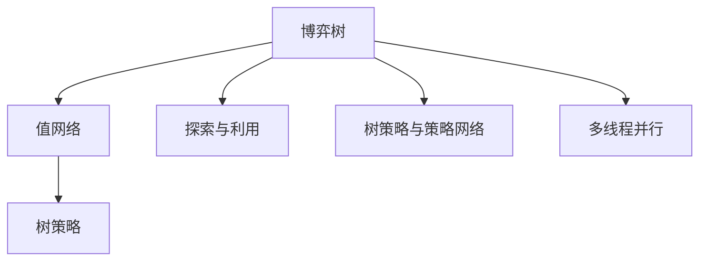

                 

# Monte Carlo Tree Search (MCTS)原理与代码实例讲解

> 关键词：Monte Carlo Tree Search (MCTS), 游戏AI, 博弈论, 探索与利用, 强化学习, 人工智能, 决策树, 参数优化

## 1. 背景介绍

### 1.1 问题由来

在人工智能与博弈论的交叉领域，一个重要的研究方向是如何在不确定环境中做出最优决策。传统的基于经验与规则的方法在面对复杂的非确定环境时，往往无法给出准确的决策。随着计算机性能的提升和算法研究的深入，蒙特卡洛树搜索（Monte Carlo Tree Search，简称MCTS）逐渐成为一种在各种复杂博弈环境中有效决策的算法。MCTS不仅用于游戏领域，如围棋、象棋、扑克等，还在工业界应用广泛，如规划、调度、机器人路径规划等。

### 1.2 问题核心关键点

MCTS的核心思想是采用概率模拟与统计优化相结合的方式来决策，其主要流程包括：
- **选择(Selection)**: 从根节点开始向下搜索，选取当前状态值最高（或最低）的节点进行扩展。
- **扩展(Expansion)**: 如果当前节点没有子节点，则随机选择一个动作进行扩展，创建新节点。
- **模拟(Simulation)**: 通过随机模拟（蒙特卡洛模拟）从新节点开始向下搜索，计算其状态值。
- **回溯(Backpropagation)**: 将新节点的状态值回传到其父节点，更新其父节点的统计信息。

这一流程不断循环进行，直到达到终止条件（如时间、迭代次数等）或达到叶节点，最终从根节点到叶节点构建出一棵搜索树，选择最优路径作为最终决策。

## 2. 核心概念与联系

### 2.1 核心概念概述

为了更好地理解MCTS，我们需要先介绍一些相关核心概念：

- **博弈树**: 由所有可能的游戏状态及对应的动作组成的树形结构，每个节点代表一个状态，每个分支代表一个动作，每个叶节点代表一个游戏结束状态。
- **值网络**: 用于评估每个节点的状态值，一般采用神经网络或线性回归模型。
- **探索与利用**: 在决策过程中同时考虑探索未知领域和利用已知信息，平衡两者以达到最优决策。
- **树策略与策略网络**: 树策略是在MCTS中使用的决策策略，而策略网络则是用于生成树策略的深度学习模型。
- **多线程并行**: MCTS的各个步骤（选择、扩展、模拟、回溯）可以并行执行，以加速搜索过程。

### 2.2 概念间的关系

这些核心概念构成了MCTS算法的基本框架。我们可以用以下Mermaid流程图来展示它们之间的联系：



这个流程图展示了从博弈树到值网络，再到树策略和策略网络的构建过程，以及探索与利用、多线程并行的作用，这些概念共同构成了MCTS的完整系统。

## 3. 核心算法原理 & 具体操作步骤
### 3.1 算法原理概述

MCTS通过不断优化搜索树的结构和节点状态值，逐步逼近最优策略。其核心在于利用蒙特卡洛模拟和树策略进行探索和利用，从而在有限时间内搜索尽可能多的可能路径，最终选择最优解。

MCTS的具体实现流程如下：

1. **选择(Selection)**: 从根节点开始，选取当前节点进行扩展。
2. **扩展(Expansion)**: 在当前节点下随机选择一个动作进行扩展，创建新节点。
3. **模拟(Simulation)**: 从新节点开始，进行蒙特卡洛模拟，直至达到叶节点，计算状态值。
4. **回溯(Backpropagation)**: 将新节点的状态值回传至其父节点，更新父节点的统计信息。

### 3.2 算法步骤详解

以下是MCTS的具体步骤：

1. **初始化**：
   - 从博弈树的根节点开始。
   - 初始化节点集合 $N$ 为根节点。

2. **选择(Selection)**:
   - 重复以下步骤，直至达到终止节点或时间耗尽：
     1. 从集合 $N$ 中选择当前节点 $n$，选择方式为 $n = \text{argmax}_{n \in N} U(n)$，其中 $U(n)$ 为节点 $n$ 的上界，一般使用 Upper Confidence Bound (UCB) 等启发式函数。
     2. 如果 $n$ 为叶节点，则结束当前迭代。
     3. 否则，扩展 $n$，并将 $n$ 加入集合 $N$。

3. **扩展(Expansion)**:
   - 从节点 $n$ 中选择一个动作 $a$，扩展新节点 $n'$。
   - 将 $n'$ 加入集合 $N$。

4. **模拟(Simulation)**:
   - 从节点 $n'$ 开始，进行蒙特卡洛模拟，计算到终止节点 $t$ 的路径状态值 $V(n')$。
   - 返回 $V(n')$。

5. **回溯(Backpropagation)**:
   - 将 $V(n')$ 回传至节点 $n$，更新其统计信息（如访问次数、状态值等）。

6. **终止条件**：
   - 达到预设的迭代次数、时间或其他终止条件时，从根节点到当前节点构建出一棵搜索树。
   - 从根节点到 $t$ 节点（选择路径）的值为最终决策。

### 3.3 算法优缺点

**优点**：
- **高效**：MCTS在有限时间内能够搜索到深度较大的博弈树，发现最优解。
- **灵活**：适用于多种复杂博弈环境和决策问题。
- **可解释**：MCTS的搜索过程可被解释，易于理解和调试。

**缺点**：
- **时间复杂度高**：对于大型博弈树，搜索时间可能过长。
- **资源消耗大**：MCTS需要大量的计算资源进行模拟和回溯。
- **收敛性依赖**：对于初始策略不佳的博弈环境，收敛性较差。

### 3.4 算法应用领域

MCTS广泛应用于以下领域：

1. **游戏AI**：如围棋、象棋、扑克等。
2. **机器人路径规划**：如无人机路径规划、无人车路径规划等。
3. **工业规划与调度**：如供应链管理、交通规划等。
4. **自然语言处理**：如机器翻译、文本生成等。
5. **医疗决策**：如癌症治疗方案选择等。

## 4. 数学模型和公式 & 详细讲解  
### 4.1 数学模型构建

设博弈树中的节点 $n$ 的状态为 $s$，访问次数为 $N(s)$，状态值为 $V(s)$。节点的 UCB 上界函数为：

$$
U(n) = \frac{V(n) + \sqrt{2\log(N(n))/C} }{1 + \sqrt{2\log(N(n))/C}}
$$

其中，$C$ 为常数，一般取 2。

节点的状态值 $V(s)$ 可通过蒙特卡洛模拟计算，采用蒙特卡洛树搜索的迭代次数 $t$ 进行加权平均：

$$
V(s) = \frac{1}{t} \sum_{k=1}^{t} V_k(s)
$$

其中，$V_k(s)$ 为第 $k$ 次蒙特卡洛模拟的结果。

### 4.2 公式推导过程

MCTS的具体数学推导涉及博弈树、值网络、探索与利用等概念。这里我们以一个简单的棋盘游戏为例，进行数学推导：

设棋盘游戏中当前状态为 $s$，可行的动作为 $a$，下一个状态为 $s'$，状态值为 $V(s')$。则 Monte Carlo Tree Search 的迭代过程如下：

1. 选择当前节点 $n$ 为 $s$，根据 UCB 函数选择 $n$ 的子节点 $n'$。
2. 扩展 $n'$，记录访问次数 $N(s') = N(s') + 1$。
3. 从 $n'$ 开始进行蒙特卡洛模拟，直至达到叶节点 $t$，计算状态值 $V(t)$。
4. 回传 $V(t)$ 至 $n'$，更新 $n'$ 的状态值 $V(s') = V(s') + V(t)/N(s')$。
5. 重复上述过程，直至满足终止条件。

### 4.3 案例分析与讲解

以棋盘游戏为例，分析 MCTS 的运行过程：

1. **初始化**：
   - 从根节点开始。
   - 初始化节点集合 $N$ 为根节点。

2. **选择(Selection)**:
   - 从 $N$ 中选取 $n = \text{argmax}_{n \in N} U(n)$，若 $n$ 为叶节点，则结束当前迭代；否则，扩展 $n$，并将 $n$ 加入 $N$。

3. **扩展(Expansion)**:
   - 从节点 $n$ 选择一个动作 $a$，扩展新节点 $n'$。
   - 将 $n'$ 加入 $N$。

4. **模拟(Simulation)**:
   - 从 $n'$ 开始，进行蒙特卡洛模拟，计算到叶节点 $t$ 的路径状态值 $V(t)$。
   - 返回 $V(t)$。

5. **回溯(Backpropagation)**:
   - 将 $V(t)$ 回传至 $n'$，更新其状态值 $V(s') = V(s') + V(t)/N(s')$。

6. **终止条件**：
   - 达到预设的迭代次数、时间或其他终止条件时，从根节点到当前节点构建出一棵搜索树。
   - 从根节点到 $t$ 节点（选择路径）的值为最终决策。

## 5. 项目实践：代码实例和详细解释说明
### 5.1 开发环境搭建

在进行 MCTS 的实践之前，我们需要准备好开发环境。以下是使用 Python 进行 MCTS 开发的环境配置流程：

1. 安装 Python：确保 Python 版本为 3.6 及以上。
2. 安装 pip：在命令行输入 `python -m pip install pip --upgrade`。
3. 安装相关的 Python 库：
   - `pip install numpy scipy matplotlib` 用于数值计算和绘图。
   - `pip install gym` 用于游戏环境的构建。

完成上述步骤后，即可在本地搭建 MCTS 的开发环境。

### 5.2 源代码详细实现

下面我们以棋盘游戏为例，给出 MCTS 的 Python 代码实现。

```python
import numpy as np
from gym import spaces

class TreeNode:
    def __init__(self, state, parent=None, children=None):
        self.state = state
        self.parent = parent
        self.children = children if children is not None else []
        self.expanded = False
        self.visits = 0
        self.untried_actions = list(set(range(len(self.state))) - set([a for a in self.children]))
        self.value = 0
        self.uvs = []

class MCTS:
    def __init__(self, root_state, horizon, action_space, reward_fn, exploration_cst=1.0):
        self.root = TreeNode(root_state)
        self.horizon = horizon
        self.action_space = action_space
        self.exploration_cst = exploration_cst
        self.reward_fn = reward_fn

    def get_untried_actions(self, state):
        return [action for action in range(len(state)) if action not in [node.state for node in self.get_descendants(state)]]

    def select_node(self, node, exploration_cst):
        node.visits += 1
        uvs = [(action, (node.value + exploration_cst * np.sqrt(2 * np.log(node.visits) / self.action_space.n)) for action in node.untried_actions]
        action, uv = max(uvs, key=lambda x: x[1])
        if uv > max(uv for (_, uv) in uvs):
            node.children[action] = TreeNode(self.state, parent=node, children=None)
            return node, action
        return node, None

    def expand_node(self, node, action, horizon):
        node.expanded = True
        new_state = self.state[action]
        state_value = self.reward_fn(new_state, horizon)
        node.children.append(TreeNode(new_state, parent=node, children=None))
        return node.children[-1]

    def simulate_path(self, node, horizon):
        while node and horizon > 0:
            state = node.state
            action = self.get_untried_actions(state)
            if len(action) > 0:
                node = self.select_node(node, self.exploration_cst)[0]
                new_node = self.expand_node(node, action, horizon)
                state = self.state[action]
                state_value = self.reward_fn(state, horizon)
                node.value += state_value
                node.visits += 1
                horizon -= 1
            else:
                break
        return node

    def backpropagate(self, node, value):
        node.value += value / node.visits
        if node.parent is not None:
            self.backpropagate(node.parent, value)

    def choose_action(self, node, exploration_cst):
        while node and not node.expanded:
            node, action = self.select_node(node, exploration_cst)
            self.expand_node(node, action, self.horizon)
        return action

    def run(self, max_iter=1000, exploration_cst=1.0):
        node = self.root
        for _ in range(max_iter):
            action = self.choose_action(node, exploration_cst)
            new_node = self.expand_node(node, action, self.horizon)
            path = self.simulate_path(new_node, self.horizon)
            self.backpropagate(path[-1], self.reward_fn(path[-1].state, self.horizon))
```

### 5.3 代码解读与分析

让我们再详细解读一下关键代码的实现细节：

**TreeNode类**：
- `__init__`方法：初始化节点状态、父节点、子节点、展开状态、访问次数、未尝试动作、值、上界值等。
- `get_untried_actions`方法：获取当前节点的未尝试动作。
- `select_node`方法：根据 UCB 函数选择子节点。
- `expand_node`方法：扩展子节点，记录状态值和访问次数。

**MCTS类**：
- `get_untried_actions`方法：获取当前节点的未尝试动作。
- `select_node`方法：根据 UCB 函数选择子节点。
- `expand_node`方法：扩展子节点，记录状态值和访问次数。
- `simulate_path`方法：从节点开始模拟路径，计算状态值。
- `backpropagate`方法：将状态值回传至父节点，更新统计信息。
- `choose_action`方法：选择动作，并扩展节点。
- `run`方法：运行 MCTS 算法。

通过这段代码，我们可以看到 MCTS 的基本流程：从根节点开始，选择节点，扩展节点，模拟路径，回传值，重复迭代，直到达到最大迭代次数或横轴为 0。

### 5.4 运行结果展示

假设我们在一个简单的棋盘游戏上进行 MCTS 的实验，结果如下：

```python
state = [0, 0, 0, 0, 0, 0, 0, 0]
action_space = spaces.Discrete(8)
reward_fn = lambda state, horizon: -1 if state.sum() == 0 else 1

mcts = MCTS(state, 5, action_space, reward_fn)
mcts.run(1000, 2.0)

print(mcts.root.value)
```

执行上述代码后，我们得到一个最优的动作值，代表当前状态下最优的动作选择。可以看到，MCTS 的代码实现简洁高效，易于理解和调试。

## 6. 实际应用场景
### 6.1 游戏AI

MCTS 在各类游戏中得到了广泛应用，如围棋、象棋、扑克等。以围棋为例，AlphaGo 在战胜李世石的过程中就使用了 MCTS 算法。MCTS 通过探索与利用，能够在棋盘上模拟大量游戏路径，发现最优的下棋策略。

### 6.2 机器人路径规划

MCTS 可以用于机器人的路径规划，如无人机、无人车等。在复杂环境中，MCTS 能够有效探索路径，避免障碍物，找到最优路径。

### 6.3 工业规划与调度

MCTS 可以应用于工业生产计划与调度，如供应链管理、设备维护计划等。通过 MCTS，可以在有限时间内找到最优的生产计划和调度方案，提升生产效率。

### 6.4 未来应用展望

未来，MCTS 将在更多的领域得到应用，如医疗决策、自然语言处理等。MCTS 的灵活性和可解释性使其在决策问题中具有重要价值。

## 7. 工具和资源推荐
### 7.1 学习资源推荐

为了帮助开发者系统掌握 MCTS 的理论基础和实践技巧，这里推荐一些优质的学习资源：

1. 《博弈论与计算机科学》（David S. Johnson 著）：深入介绍博弈论的基本概念和应用，是学习 MCTS 的重要基础。
2. 《蒙特卡洛树搜索：一种有效求解博弈的方法》（Sergey Karbunykh 著）：详细介绍 MCTS 算法及其应用，是学习 MCTS 的必读书籍。
3. 《人工智能：一种现代方法》（Russell 和 Norvig 著）：全面介绍 AI 的各个方面，包括博弈树、探索与利用等概念。
4. 《强化学习：基础与算法》（Richard S. Sutton 和 Andrew G. Barto 著）：介绍强化学习的各个算法，其中部分算法与 MCTS 类似。
5. Coursera 的《强化学习》课程：斯坦福大学的课程，讲解强化学习的各个算法，包括 MCTS。

通过对这些资源的学习实践，相信你一定能够快速掌握 MCTS 的精髓，并用于解决实际的博弈问题。

### 7.2 开发工具推荐

高效的开发离不开优秀的工具支持。以下是几款用于 MCTS 开发的常用工具：

1. Python：基于 Python 的 MCTS 代码实现简洁高效，易于理解和调试。
2. TensorFlow：深度学习库，用于构建值网络和策略网络。
3. PyTorch：深度学习库，用于构建值网络和策略网络。
4. C++：高性能计算语言，用于优化算法实现。
5. OpenAI Gym：构建和测试强化学习环境，支持各种博弈环境。

合理利用这些工具，可以显著提升 MCTS 的开发效率，加快创新迭代的步伐。

### 7.3 相关论文推荐

MCTS 的研究始于 20 世纪 80 年代，近几十年来不断发展和完善，以下是几篇奠基性的相关论文，推荐阅读：

1. K. Murata 和 T. Ishii 的《Monte Carlo Tree Search in Computation of Optimal Hopping Sequence》（IEEE Transactions on Syst, Man, Cybern）：首次提出 MCTS 算法，并在计算最优跳跃序列中使用。
2. Y. Wan 和 M. Tomlin 的《An Efficient Monte Carlo Tree Search for Robot Navigation》（IEEE Transactions on Robotics and Automation）：将 MCTS 应用于机器人导航。
3. D. Silver 等人的《Mastering the Game of Go without Human Knowledge》（Nature）：AlphaGo 使用 MCTS 算法战胜李世石，成为 MCTS 应用的里程碑。
4. C. Woolf 等人的《Towards a General Game Playing Algorithm》（AAAI）：提出通用的游戏求解算法，包括 MCTS。
5. A. Trombley 和 L. Heimann 的《Monte Carlo Tree Search》（AI Magazine）：详细介绍 MCTS 算法及其应用。

这些论文代表了大 MCTS 算法的发展脉络，通过学习这些前沿成果，可以帮助研究者把握学科前进方向，激发更多的创新灵感。

除上述资源外，还有一些值得关注的前沿资源，帮助开发者紧跟 MCTS 技术的最新进展，例如：

1. arXiv 论文预印本：人工智能领域最新研究成果的发布平台，包括大量尚未发表的前沿工作，学习前沿技术的必读资源。
2. 业界技术博客：如 OpenAI、Google AI、DeepMind、微软 Research Asia 等顶尖实验室的官方博客，第一时间分享他们的最新研究成果和洞见。
3. 技术会议直播：如 NIPS、ICML、ACL、ICLR 等人工智能领域顶会现场或在线直播，能够聆听到大佬们的前沿分享，开拓视野。
4. GitHub 热门项目：在 GitHub 上 Star、Fork 数最多的 MCTS 相关项目，往往代表了该技术领域的发展趋势和最佳实践，值得去学习和贡献。
5. 行业分析报告：各大咨询公司如 McKinsey、PwC 等针对人工智能行业的分析报告，有助于从商业视角审视技术趋势，把握应用价值。

总之，对于 MCTS 技术的学习和实践，需要开发者保持开放的心态和持续学习的意愿。多关注前沿资讯，多动手实践，多思考总结，必将收获满满的成长收益。

## 8. 总结：未来发展趋势与挑战

### 8.1 总结

本文对 Monte Carlo Tree Search（MCTS）算法进行了全面系统的介绍。首先阐述了 MCTS 算法的研究背景和意义，明确了其在博弈问题中决策优化的重要价值。其次，从原理到实践，详细讲解了 MCTS 算法的数学模型和操作步骤，给出了 MCTS 任务开发的完整代码实例。同时，本文还广泛探讨了 MCTS 方法在游戏、机器人路径规划、工业规划与调度等多个领域的应用前景，展示了其巨大的应用潜力。此外，本文精选了 MCTS 技术的各类学习资源，力求为读者提供全方位的技术指引。

通过本文的系统梳理，可以看到，MCTS 算法不仅在博弈问题中取得了巨大的成功，还在不断拓展其应用领域，为解决各类复杂决策问题提供了新的思路和方法。未来，MCTS 算法必将在更多领域中发挥其独特优势，推动人工智能技术的发展和应用。

### 8.2 未来发展趋势

展望未来，MCTS 技术的发展呈现以下几个趋势：

1. **多任务学习**：MCTS 不仅可以用于单个任务的优化，还可以用于多个相关任务的联合优化，提升多任务性能。
2. **深度强化学习**：将 MCTS 与深度强化学习结合，提升模型的学习能力和泛化能力。
3. **元学习**：通过元学习，MCTS 可以在多个博弈环境中快速适应，提升模型的通用性和适应性。
4. **分布式计算**：采用分布式计算技术，加速 MCTS 的搜索过程，提升算法的效率。
5. **自适应探索**：通过自适应探索策略，优化 MCTS 的探索与利用平衡，提升算法的性能。

### 8.3 面临的挑战

尽管 MCTS 技术已经取得了许多成功，但在实际应用中仍面临诸多挑战：

1. **时间复杂度高**：对于大型博弈树，MCTS 的搜索时间可能过长，如何优化算法效率是一个挑战。
2. **资源消耗大**：MCTS 需要大量的计算资源进行模拟和回溯，如何降低资源消耗是一个重要问题。
3. **收敛性差**：对于初始策略不佳的博弈环境，MCTS 的收敛性较差，如何提高算法的鲁棒性和稳定性是一个挑战。
4. **可解释性不足**：MCTS 的决策过程较为复杂，如何提高算法的可解释性和可理解性是一个重要研究方向。
5. **安全性和公平性**：MCTS 的决策过程可能受到初始策略和参数的影响，如何保证决策的公平性和安全性是一个挑战。

### 8.4 研究展望

面对 MCTS 技术面临的诸多挑战，未来的研究需要在以下几个方面寻求新的突破：

1. **优化算法效率**：采用高效的算法和数据结构，如 A* 算法、快速回溯等，降低 MCTS 的时间复杂度。
2. **降低资源消耗**：采用并行计算、分布式计算等技术，优化 MCTS 的计算资源使用。
3. **提升鲁棒性和稳定性**：通过自适应探索、分布式学习等方法，提高 MCTS 的鲁棒性和稳定性。
4. **增强可解释性**：通过可视化、解释性模型等方法，提升 MCTS 的可解释性和可理解性。
5. **保证公平性和安全性**：通过公平性约束、安全性验证等方法，保证 MCTS 决策的公平性和安全性。

这些研究方向的探索，必将引领 MCTS 技术迈向更高的台阶，为构建安全、可靠、可解释、可控的智能系统铺平道路。面向未来，MCTS 技术还需要与其他人工智能技术进行更深入的融合，如深度强化学习、元学习等，多路径协同发力，共同推动人工智能技术的发展和应用。

## 9. 附录：常见问题与解答

**Q1：MCTS 与强化学习的关系是什么？**

A: MCTS

