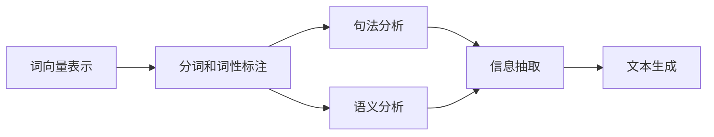

                 

## 1. 背景介绍

### 1.1 问题由来

在人类文明的漫长历程中，语言始终扮演着信息传递和思想交流的桥梁角色。无论是口头的言语、书写的文字，还是电子媒介的传播，语言都是人类社会互动的核心纽带。然而，在计算机逐渐渗透人类生活的今天，我们发现机器缺乏理解和生成人类语言的能力，成为了横跨人类与计算机之间的"数字鸿沟"。

这一问题催生了自然语言处理（NLP）的诞生，旨在让计算机理解和处理人类语言，从而实现人机之间更为流畅、自然的交互。NLP技术不仅推动了人工智能的进步，更为人类的生活、工作带来了前所未有的便利。

### 1.2 问题核心关键点

自然语言处理（NLP）的核心在于如何使计算机能够理解、处理和生成自然语言。具体来说，NLP技术包含以下关键任务：

1. 词向量表示：将自然语言转化为计算机可处理的向量形式，建立词与词之间的关联。
2. 分词和词性标注：将文本切分为词语，并标注每个词语的词性。
3. 句法分析：分析句子的语法结构，如依存关系、句法树等。
4. 语义分析：理解句子的含义，如情感、意图、指代等。
5. 信息抽取：从文本中提取关键信息，如命名实体、关系、事件等。
6. 文本生成：利用自然语言模型生成自然语言文本，如自动摘要、机器翻译等。

NLP技术的进展极大地促进了计算机对人类语言的理解和应用，使得机器能够执行越来越多的智能任务，如问答、对话、推荐、舆情分析等。然而，如何构建高效、鲁棒的NLP模型，实现人机间的顺畅沟通，仍是一大挑战。

## 2. 核心概念与联系

### 2.1 核心概念概述

为了深入理解NLP技术，我们需要对一些关键概念进行清晰的阐述：

1. **词向量表示**：将自然语言中的单词转换为向量形式，以便于计算机处理。常见方法包括Word2Vec、GloVe等。
2. **分词和词性标注**：将连续的文本切分为词语，并为每个词语标注词性。
3. **句法分析**：分析句子中的语法结构，包括依存关系、短语结构等。
4. **语义分析**：理解句子的语义，如情感、意图、指代等。
5. **信息抽取**：从文本中提取结构化信息，如实体关系图、事件序列等。
6. **文本生成**：利用语言模型生成自然语言文本，如自动摘要、机器翻译等。

这些概念之间存在着密切的联系，构成了一个完整的NLP处理流程。例如，词向量表示是分词和词性标注的基础，句法分析和语义分析有助于理解句子的含义，信息抽取和文本生成则是对处理结果的应用和延伸。

### 2.2 概念间的关系

以下是一个简单的Mermaid流程图，展示了NLP技术中各个核心概念之间的联系：



这个流程图展示了NLP技术的基本处理流程：首先通过词向量表示将自然语言转化为向量形式，然后利用分词和词性标注技术对文本进行初步处理，接着通过句法和语义分析对句子进行深入理解，最终通过信息抽取和文本生成技术，将处理结果应用到具体任务中。

### 2.3 核心概念的整体架构

NLP技术的整体架构可以概括为以下几个主要模块：

1. **预处理**：对文本进行分词、词性标注、去停用词等预处理操作。
2. **表示学习**：利用词向量表示技术，将文本转化为向量形式。
3. **模型训练**：通过监督学习或无监督学习训练语言模型。
4. **语义分析**：理解句子的语义，如情感、意图、指代等。
5. **信息抽取**：从文本中提取结构化信息，如命名实体、关系、事件等。
6. **文本生成**：利用语言模型生成自然语言文本。

每个模块都有其特定的任务和算法，共同构成了NLP技术的完整框架。

## 3. 核心算法原理 & 具体操作步骤

### 3.1 算法原理概述

NLP技术中的核心算法包括词向量表示、分词和词性标注、句法分析、语义分析、信息抽取和文本生成等。这里以词向量表示和Transformer模型为例，介绍NLP技术的算法原理。

### 3.2 算法步骤详解

**词向量表示**：

1. **词向量的定义**：将每个单词映射到一个高维向量空间，使得语义相似的单词在向量空间中距离较近。
2. **词向量的训练**：利用大规模语料库，通过神经网络模型训练每个单词的向量表示。
3. **词向量的应用**：将文本中的每个单词转化为对应的向量形式，作为后续NLP处理的基础。

**Transformer模型**：

1. **模型结构**：Transformer模型采用自注意力机制，能够高效地处理长文本序列，适用于序列建模任务。
2. **编码器与解码器**：编码器对输入序列进行编码，解码器对编码结果进行解码。
3. **多头注意力机制**：利用多头自注意力机制，分别从不同角度处理序列中的信息。
4. **位置编码**：为序列中的每个位置添加位置编码，使模型能够处理序列中位置的信息。
5. **模型训练**：利用标注数据，通过反向传播算法训练Transformer模型，最小化损失函数。

### 3.3 算法优缺点

**词向量表示**：

- **优点**：
  - 能够捕捉单词之间的语义关系。
  - 提供了一种通用的语言表示方法，便于计算机处理。

- **缺点**：
  - 需要大量标注数据训练。
  - 难以处理罕见单词。
  - 向量空间维度较高，计算复杂度大。

**Transformer模型**：

- **优点**：
  - 能够高效地处理长文本序列。
  - 并行计算能力强，训练速度快。
  - 能够处理多种语言序列。

- **缺点**：
  - 模型复杂度高，计算资源需求大。
  - 参数量较大，训练和推理速度较慢。
  - 训练数据需求大，难以在小规模数据上获得理想效果。

### 3.4 算法应用领域

NLP技术广泛应用于以下领域：

1. **机器翻译**：将一种语言的文本翻译成另一种语言。利用词向量表示和Transformer模型，可以实现高效的机器翻译。
2. **文本分类**：对文本进行分类，如情感分析、主题分类等。利用Transformer模型，可以获得较好的分类效果。
3. **问答系统**：对自然语言问题进行理解和回答。利用预训练的Transformer模型，可以实现高效的问答系统。
4. **信息抽取**：从文本中提取结构化信息，如命名实体、关系、事件等。利用Transformer模型，可以实现高效的信息抽取。
5. **文本生成**：利用语言模型生成自然语言文本，如自动摘要、机器翻译等。利用预训练的Transformer模型，可以实现高质量的文本生成。

## 4. 数学模型和公式 & 详细讲解 & 举例说明

### 4.1 数学模型构建

以Transformer模型为例，其数学模型可以表示为：

$$
\begin{aligned}
\text{Encoder} &= \text{LayerNorm}(\text{Attention}(\text{LayerNorm}(x_0), \text{Query}, \text{Key}, \text{Value}), \text{LayerNorm}(\text{FeedForward}(\text{LayerNorm}(x_0)))) \\
\text{Decoder} &= \text{LayerNorm}(\text{Attention}(\text{LayerNorm}(x_0), \text{Query}, \text{Key}, \text{Value}), \text{LayerNorm}(\text{FeedForward}(\text{LayerNorm}(x_0)))))
\end{aligned}
$$

其中，$x_0$ 表示输入序列，$\text{LayerNorm}$ 表示归一化层，$\text{Attention}$ 表示多头自注意力机制，$\text{FeedForward}$ 表示前向传播网络。

### 4.2 公式推导过程

以Transformer模型的自注意力机制为例，其推导过程如下：

1. **查询向量**：将输入序列 $x$ 与位置编码 $p$ 相加，得到查询向量 $Q$。
2. **键值向量**：将输入序列 $x$ 与位置编码 $p$ 相加，得到键值向量 $K$ 和值向量 $V$。
3. **缩放点积注意力**：计算查询向量 $Q$ 与键值向量 $K$ 的点积，并进行归一化。
4. **softmax函数**：对点积注意力进行softmax操作，得到注意力权重。
5. **加权和**：将注意力权重与值向量 $V$ 进行加权和，得到注意力输出。

通过上述推导过程，可以看出自注意力机制能够高效地处理长文本序列，并捕捉序列中的重要信息。

### 4.3 案例分析与讲解

假设我们有一个简单的文本分类任务，需要将一段新闻文本分类为体育、政治或经济类别。我们可以使用预训练的Transformer模型，进行以下步骤：

1. **分词和词性标注**：将新闻文本进行分词，并标注每个单词的词性。
2. **词向量表示**：利用预训练的Transformer模型，将新闻文本转化为词向量表示。
3. **分类器训练**：利用标注数据，训练一个线性分类器，将词向量表示映射到分类标签。
4. **模型预测**：将新的新闻文本转化为词向量表示，输入分类器进行分类预测。

## 5. 项目实践：代码实例和详细解释说明

### 5.1 开发环境搭建

以下是使用Python和PyTorch进行NLP任务开发的简单环境配置流程：

1. 安装Anaconda：从官网下载并安装Anaconda，用于创建独立的Python环境。

2. 创建并激活虚拟环境：
```bash
conda create -n pytorch-env python=3.8 
conda activate pytorch-env
```

3. 安装PyTorch：根据CUDA版本，从官网获取对应的安装命令。例如：
```bash
conda install pytorch torchvision torchaudio cudatoolkit=11.1 -c pytorch -c conda-forge
```

4. 安装NLP库：
```bash
pip install spacy
```

5. 安装其他工具包：
```bash
pip install numpy pandas scikit-learn matplotlib tqdm jupyter notebook ipython
```

完成上述步骤后，即可在`pytorch-env`环境中开始NLP任务开发。

### 5.2 源代码详细实现

以下是使用Spacy和PyTorch进行情感分析任务的简单代码实现：

```python
import spacy
import torch
import torch.nn as nn
from torchtext.data import Field, BucketIterator
from torchtext.datasets import IMDB

# 加载IMDB数据集
train_data, test_data = IMDB.splits()

# 定义分词器
nlp = spacy.load('en_core_web_sm')

# 定义数据预处理函数
def tokenize(text):
    return [token.text for token in nlp(text)]

# 定义输入处理函数
def process_data(text, labels):
    return {'text': tokenize(text), 'labels': labels}

# 定义数据集
train_data = Field(tokenize=tokenize, batch_first=True)
test_data = Field(tokenize=tokenize, batch_first=True)

# 构建迭代器
train_iterator, test_iterator = BucketIterator.splits((train_data, test_data),
                                                   batch_size=32, device='cuda')

# 定义模型
class Model(nn.Module):
    def __init__(self, n_classes=2, emb_dim=128):
        super(Model, self).__init__()
        self.emb = nn.Embedding(10000, emb_dim)
        self.fc1 = nn.Linear(emb_dim * 256, 128)
        self.fc2 = nn.Linear(128, n_classes)
        self.dropout = nn.Dropout(0.5)

    def forward(self, text):
        embeds = self.emb(text)
        x = self.fc1(embeds)
        x = self.dropout(x)
        x = self.fc2(x)
        return x

# 定义训练函数
def train(model, train_iterator, optimizer, criterion):
    model.train()
    for batch in train_iterator:
        optimizer.zero_grad()
        text, labels = batch.text, batch.labels
        predictions = model(text)
        loss = criterion(predictions, labels)
        loss.backward()
        optimizer.step()

# 定义评估函数
def evaluate(model, test_iterator, criterion):
    model.eval()
    total_loss = 0
    total_correct = 0
    for batch in test_iterator:
        text, labels = batch.text, batch.labels
        predictions = model(text)
        loss = criterion(predictions, labels)
        total_loss += loss.item() * len(batch)
        total_correct += (predictions.argmax(1) == labels).sum().item()
    return total_correct / len(test_iterator), total_loss / len(test_iterator)

# 训练模型
model = Model()
optimizer = torch.optim.Adam(model.parameters(), lr=0.01)
criterion = nn.BCEWithLogitsLoss()

for epoch in range(5):
    train(model, train_iterator, optimizer, criterion)
    acc, loss = evaluate(model, test_iterator, criterion)
    print(f'Epoch {epoch+1}, Acc: {acc:.3f}, Loss: {loss:.3f}')

# 测试模型
model.eval()
with torch.no_grad():
    _, loss = evaluate(model, test_iterator, criterion)
    print(f'Test Loss: {loss:.3f}')
```

以上代码实现了一个简单的情感分析任务，包括数据预处理、模型定义、训练和评估等步骤。

### 5.3 代码解读与分析

**分词器Spacy**：
- 加载预训练的英文分词器，进行分词操作。
- Spacy能够高效地处理分词和词性标注，是NLP任务开发中常用的工具。

**数据处理函数**：
- 将文本分词，并转换为模型所需的格式。
- 将标签进行标准化处理，用于训练和评估。

**模型定义**：
- 使用嵌入层将文本转化为向量表示。
- 使用全连接层进行特征提取和分类。
- 加入dropout层防止过拟合。

**训练和评估函数**：
- 利用PyTorch的DataLoader和模型进行批量训练和评估。
- 使用交叉熵损失函数计算模型预测与真实标签之间的差异。
- 在每个epoch结束时，评估模型性能并输出结果。

**训练和测试模型**：
- 使用Adam优化器进行模型训练。
- 在训练过程中，利用evaluate函数评估模型性能，调整学习率等超参数。
- 在测试集中测试模型性能，输出最终结果。

## 6. 实际应用场景

### 6.1 智能客服系统

智能客服系统通过NLP技术，实现了对客户咨询的自然语言理解和处理，提供24小时不间断服务，显著提高了客户满意度。

在实际应用中，可以收集企业内部的客服对话记录，利用NLP技术进行自然语言处理和分析，构建智能客服系统。该系统能够自动理解客户咨询内容，匹配最合适的答案模板进行回复，甚至可以实时搜索相关知识库，动态生成回答，提高客户咨询体验和问题解决效率。

### 6.2 金融舆情监测

金融机构利用NLP技术，实时监测市场舆论动向，及时响应负面信息传播，规避金融风险。

通过收集金融领域相关的新闻、报道、评论等文本数据，利用NLP技术进行情感分析和实体抽取，构建舆情监测系统。该系统能够自动判断文本的情感倾向和涉及的实体，快速识别异常情况，提供预警，帮助金融机构防范潜在的金融风险。

### 6.3 个性化推荐系统

个性化推荐系统利用NLP技术，从用户浏览、点击、评论、分享等行为数据中提取语义信息，进行用户兴趣点挖掘和推荐。

在推荐系统开发中，可以收集用户的行为数据，利用NLP技术进行文本表示和语义分析，构建用户兴趣模型。该模型能够从文本内容中准确把握用户的兴趣点，在生成推荐列表时，结合用户的历史行为数据和当前兴趣模型，进行精准推荐。

## 7. 工具和资源推荐

### 7.1 学习资源推荐

为了帮助开发者系统掌握NLP技术，这里推荐一些优质的学习资源：

1. 《自然语言处理综论》（Introduction to Natural Language Processing）：斯坦福大学的经典教材，全面介绍了NLP的基本概念和经典算法。
2. 《深度学习与自然语言处理》（Deep Learning for Natural Language Processing）：梁军、周志华等人合著的NLP教材，详细介绍了深度学习在NLP中的应用。
3. 《NLP入门教程》（NLP Tutorial）：斯坦福大学提供的NLP入门教程，包括分词、词向量表示、语言模型等内容。
4. 《SpaCy官方文档》（SpaCy Documentation）：Spacy的分词器和NLP工具库官方文档，提供了丰富的示例和API接口。
5. 《HuggingFace官方文档》（Hugging Face Documentation）：Hugging Face的NLP工具库和预训练模型官方文档，提供了大量NLP任务的样例代码和预训练模型。

### 7.2 开发工具推荐

高效的NLP开发离不开优秀的工具支持。以下是几款常用的NLP开发工具：

1. SpaCy：Spacy是一个高性能的分词器、命名实体识别器和语义分析器，支持多种语言，易于使用。
2. HuggingFace Transformers：Hugging Face提供的NLP工具库，包含了各种预训练模型和任务适配层，便于NLP任务的开发和部署。
3. NLTK：Natural Language Toolkit，提供了丰富的NLP功能和语料库，适用于各种NLP任务。
4. Gensim：Gensim是一个用于文本处理和建模的工具，支持词向量表示和主题建模等NLP任务。
5. PyTorch和TensorFlow：深度学习框架，提供了丰富的神经网络模型和优化算法，支持NLP任务的开发和训练。

### 7.3 相关论文推荐

NLP技术的发展离不开学界的持续研究。以下是几篇具有代表性的NLP论文，推荐阅读：

1. "Sequence to Sequence Learning with Neural Networks"：Ian Goodfellow等人在ICML 2014年提出的序列到序列学习模型，为机器翻译、对话系统等任务奠定了基础。
2. "Attention Is All You Need"：Google在NIPS 2017年提出的Transformer模型，为自然语言处理带来了革命性变化。
3. "BERT: Pre-training of Deep Bidirectional Transformers for Language Understanding"：Google在arXiv 2018年提出的BERT模型，利用自监督学习预训练语言模型，刷新了多项NLP任务SOTA。
4. "GPT-3: Language Models are Unsupervised Multitask Learners"：OpenAI在arXiv 2020年提出的GPT-3模型，展示了无监督学习的强大能力。
5. "ELMo: Distributed Representations of Words and Phrases Based on Character N-grams"：Allen AI在NAACL 2018年提出的ELMo模型，利用字符级表示提升词向量表示的效果。

这些论文代表了大语言模型和NLP技术的发展脉络，通过学习这些前沿成果，可以帮助研究者把握学科前进方向，激发更多的创新灵感。

## 8. 总结：未来发展趋势与挑战

### 8.1 总结

本文对NLP技术的原理和应用进行了全面系统的介绍。首先阐述了NLP技术的发展历程和意义，明确了其作为人类和计算机沟通桥梁的独特价值。其次，从词向量表示和Transformer模型两个角度，详细讲解了NLP技术的算法原理和操作步骤。最后，我们探讨了NLP技术在智能客服、金融舆情、个性化推荐等多个行业领域的应用前景，展示了NLP技术在构建人机协同智能系统中的巨大潜力。

通过本文的系统梳理，可以看到，NLP技术正在成为人工智能的重要组成部分，极大地拓展了计算机对人类语言的理解能力，为人工智能的普及和应用带来了新的突破。未来，伴随NLP技术的不断进步，我们相信人机交互将更加自然、高效，人工智能将迎来更加广阔的发展前景。

### 8.2 未来发展趋势

展望未来，NLP技术将呈现以下几个发展趋势：

1. **深度学习模型的进步**：随着深度学习模型的不断优化，NLP技术将更加强大和准确。例如，Transformer模型的改进和升级，如长短期记忆（LSTM）、卷积神经网络（CNN）等，将进一步提升NLP任务的性能。
2. **跨模态融合**：NLP技术与计算机视觉、语音识别等技术的融合，将带来更加丰富的应用场景。例如，视频字幕自动生成、语音识别与自然语言处理的结合等。
3. **多语言支持**：NLP技术将更加支持多语言，能够处理不同语言的文本，提供更加广泛的服务。
4. **预训练模型的普及**：预训练语言模型如BERT、GPT-3等，将成为NLP任务开发的标配，大大提高开发效率和效果。
5. **数据处理技术的改进**：大数据技术、数据增强、数据清洗等技术将进一步改进，提高数据处理效率和质量。
6. **模型压缩和优化**：模型压缩、模型蒸馏等技术将进一步提升NLP模型的推理效率和资源利用率。

这些趋势将推动NLP技术的不断进步，带来更多创新和应用的可能性。

### 8.3 面临的挑战

尽管NLP技术已经取得了瞩目成就，但在迈向更加智能化、普适化应用的过程中，仍面临诸多挑战：

1. **数据质量问题**：NLP任务对数据质量要求较高，数据不均衡、噪声等问题可能影响模型性能。
2. **模型复杂度**：NLP模型复杂度高，计算资源需求大，难以在低端设备上实现高效推理。
3. **模型泛化能力**：NLP模型在跨领域、跨语言等场景中，泛化能力有限。
4. **隐私保护**：NLP任务涉及用户隐私，如何在保护隐私的前提下，进行文本处理和分析，是一个重要挑战。
5. **伦理和安全**：NLP模型可能存在歧视、偏见等问题，如何确保模型公平性和安全性，是一个重要课题。

这些挑战需要我们在技术、算法、政策等多个方面进行深入研究和实践，才能进一步推动NLP技术的发展。

### 8.4 研究展望

面对NLP技术面临的诸多挑战，未来的研究需要在以下几个方面寻求新的突破：

1. **多模态融合**：将NLP技术与计算机视觉、语音识别等技术进行深度融合，提升系统综合能力。
2. **跨领域迁移学习**：研究NLP模型在不同领域之间的迁移学习能力，提升模型的通用性和适应性。
3. **数据增强和处理**：开发更多高效的数据增强技术，如数据清洗、数据合成等，提高数据处理效率和质量。
4. **模型压缩和优化**：研究更加高效、轻量级的模型压缩和优化技术，降低计算资源需求。
5. **隐私保护和伦理**：开发隐私保护技术，如差分隐私、联邦学习等，确保数据安全。
6. **公平性和安全性**：研究NLP模型的公平性和安全性，确保模型的公平性、透明性和可解释性。

这些研究方向将进一步推动NLP技术的发展，为人工智能技术在更多领域的应用提供新的动力。总之，NLP技术正在成为人工智能技术的重要组成部分，推动人机交互的不断进步，为构建更加智能、普适的智能系统提供有力支撑。

## 9. 附录：常见问题与解答

**Q1：NLP技术是否适用于所有自然语言？**

A: NLP技术在处理多种自然语言方面已经取得了显著进展，但不同语言的语法、语义结构存在较大差异，因此NLP技术在不同语言中的效果可能会有所不同。对于低资源语言，NLP技术需要更多的训练数据和算法优化。

**Q2：NLP技术如何处理多义词？**

A: NLP技术通过上下文信息和语义分析，可以较好地处理多义词问题。例如，使用预训练的语言模型进行词向量表示时，多义词在向量空间中的距离较近，有助于模型理解其在不同上下文中的含义。此外，利用语义增强的句法分析技术，也可以提高模型对多义词的处理能力。

**Q3：NLP技术在实际应用中面临哪些挑战？**

A: NLP技术在实际应用中面临以下挑战：

1. 数据质量问题：NLP任务对数据质量要求较高，数据不均衡、噪声等问题可能影响模型性能。
2. 模型复杂度：NLP模型复杂度高，计算资源需求大，难以在低端设备上实现高效推理。
3. 模型泛化能力：NLP模型在跨领域、跨语言等场景中，泛化能力有限。
4. 隐私保护：NLP任务涉及用户隐私，如何在保护隐私的前提下，进行文本处理和分析，是一个重要挑战。
5. 伦理和安全：NLP模型可能存在歧视、偏见等问题，如何确保模型公平性和安全性，是一个重要课题。

**Q4：NLP技术如何应对用户输入的不确定性？**

A: NLP技术通过上下文理解、不确定性推理等技术，可以较好地应对用户输入的不确定性。例如，使用语言模型进行上下文理解，可以识别出用户输入中的歧义和不确定性，并给出多种可能的解释和答案。此外，利用知识图谱和语义网络，可以为NLP模型提供更多的上下文信息和语义关系，提高其对不确定性的处理能力。

**Q5：NLP技术在医疗领域的应用前景如何？**

A: NLP

