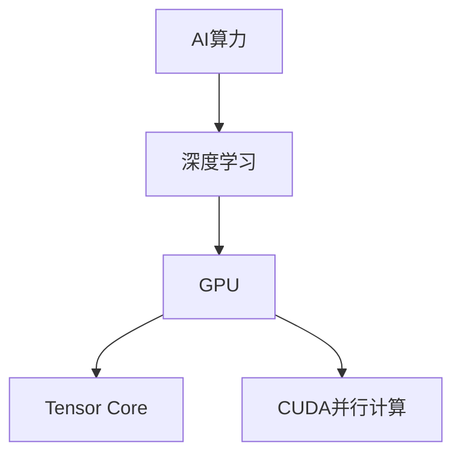

                 

# NVIDIA推动AI算力的创新

> 关键词：AI算力,深度学习,高性能计算,卷积神经网络(CNN),图形处理单元(GPU),Tensor Core

## 1. 背景介绍

### 1.1 问题由来
近年来，人工智能(AI)技术在图像识别、自然语言处理、智能推荐等多个领域取得了显著突破，深度学习模型的应用越来越广泛。然而，深度学习模型通常需要极大的计算资源进行训练和推理，这对硬件算力提出了极高的要求。传统的CPU处理器在面对深度学习任务时，计算性能远远不足，限制了AI技术的进一步发展。

为了满足深度学习的需求，NVIDIA作为全球领先的图形处理单元(GPU)制造商，通过不断的技术创新，推动AI算力的持续提升，为深度学习模型提供了强大的计算支持。NVIDIA的GPU架构设计，尤其是其独特的Tensor Core和CUDA并行计算能力，使得深度学习模型的训练和推理速度得到了极大的提升。

## 2. 核心概念与联系

### 2.1 核心概念概述

为了更好地理解NVIDIA在推动AI算力创新方面的贡献，本节将介绍几个关键概念：

- **AI算力**：指用于训练和推理深度学习模型的计算资源，包括计算速度、存储空间、带宽等。

- **深度学习**：一种基于神经网络的机器学习方法，通过多层非线性映射，实现复杂数据的自动提取和分析。

- **图形处理单元(GPU)**：一种专门用于图像和视频处理的高性能硬件，能够并行执行大量浮点运算，适合深度学习模型的高效训练。

- **Tensor Core**：NVIDIA GPU架构中的关键计算单元，专门用于加速矩阵乘法、卷积等深度学习操作。

- **CUDA并行计算**：NVIDIA开发的并行计算平台，通过优化GPU内存和计算资源的利用，提高了深度学习模型的训练效率。

### 2.2 概念间的关系

这些核心概念之间的联系可以通过以下Mermaid流程图来展示：



这个流程图展示了AI算力与深度学习模型之间的联系，以及GPU、Tensor Core和CUDA并行计算如何共同构成NVIDIA推动AI算力创新的技术基础。

## 3. 核心算法原理 & 具体操作步骤

### 3.1 算法原理概述

NVIDIA在推动AI算力创新方面，主要通过以下几个关键技术实现：

1. **Tensor Core加速**：NVIDIA GPU的Tensor Core专门设计用于加速矩阵乘法、卷积等深度学习计算。通过Tensor Core，NVIDIA将深度学习模型中的计算密集型操作大大加速，从而提升训练和推理效率。

2. **CUDA并行计算**：NVIDIA开发的CUDA平台支持GPU的并行计算，利用GPU强大的并行计算能力，使得深度学习模型能够高效地进行分布式训练和推理。

3. **硬件优化**：NVIDIA不断优化其GPU硬件设计，如引入专用计算单元、优化内存带宽等，使得GPU能够更高效地处理深度学习模型。

### 3.2 算法步骤详解

NVIDIA推动AI算力的创新，主要包括以下几个关键步骤：

**Step 1: 硬件设计**
- 设计具有高并行计算能力的GPU架构，引入Tensor Core、CUDA并行计算等技术。
- 优化GPU内存带宽和存储器层次结构，提升数据传输效率。
- 引入专用计算单元，如NVIDIA自研的张量核心单元，专门用于加速深度学习计算。

**Step 2: 软件开发**
- 开发支持Tensor Core和CUDA并行计算的深度学习框架，如NVIDIA的cuDNN、TensorRT等。
- 优化深度学习库的性能，如引入卷积加速库，使用高效的线性代数库，提升模型训练效率。

**Step 3: 模型训练与推理**
- 利用优化后的硬件和软件，进行深度学习模型的训练和推理。
- 使用CUDA并行计算技术，将训练和推理任务并行化，提高计算效率。
- 使用Tensor Core进行计算密集型操作的加速，进一步提升训练和推理速度。

**Step 4: 测试与优化**
- 在深度学习基准测试中，评估GPU的性能表现。
- 根据测试结果，对GPU硬件和软件进行优化和改进，提升计算能力。

### 3.3 算法优缺点

NVIDIA推动AI算力创新具有以下优点：

1. **高性能计算**：NVIDIA的GPU架构设计，使得深度学习模型的计算效率大大提升，训练和推理速度更快。
2. **并行计算能力**：CUDA并行计算技术，使得深度学习模型能够高效地进行分布式训练和推理，提升计算资源的利用率。
3. **专用计算单元**：Tensor Core的引入，专门用于加速深度学习计算，提高了计算密集型操作的性能。

同时，也存在一些缺点：

1. **成本高昂**：高性能的NVIDIA GPU往往价格较高，对小规模或预算有限的用户来说，成本较高。
2. **能耗大**：高性能GPU的能耗较高，需要良好的散热和供电系统支持。
3. **适用性受限**：深度学习模型对硬件的要求较高，对于非深度学习任务，NVIDIA GPU的性能可能无法充分利用。

### 3.4 算法应用领域

NVIDIA推动AI算力创新，广泛应用于以下几个领域：

- **计算机视觉**：在图像识别、物体检测、图像分割等任务中，NVIDIA GPU能够高效地处理大量图像数据，提升模型训练和推理速度。
- **自然语言处理(NLP)**：在文本分类、情感分析、机器翻译等任务中，NVIDIA GPU能够快速处理文本数据，提升模型的训练效率。
- **语音识别**：在语音识别和生成任务中，NVIDIA GPU能够高效地处理音频数据，提升模型的训练和推理性能。
- **自动驾驶**：在自动驾驶领域，NVIDIA GPU能够高效地处理传感器数据和模型计算，提升自动驾驶系统的实时性和可靠性。

此外，NVIDIA GPU还应用于科学研究、医疗健康、游戏娱乐等多个领域，推动了各行业的发展和创新。

## 4. 数学模型和公式 & 详细讲解 & 举例说明

### 4.1 数学模型构建

深度学习模型通常由多层神经网络构成，每个神经元的输出通过激活函数进行非线性映射。在NVIDIA GPU上进行深度学习训练时，NVIDIA GPU的Tensor Core和CUDA并行计算能力，使得模型训练和推理的计算密集型操作得到了极大的加速。

### 4.2 公式推导过程

以下我们以卷积神经网络(CNN)为例，推导NVIDIA GPU在卷积操作中的加速效果。

假设输入数据为二维矩阵 $X$，卷积核为二维矩阵 $K$，输出数据为 $Y$。在CPU上，卷积操作可以通过矩阵乘法和累加操作实现，计算复杂度为 $O(N^3)$。而在NVIDIA GPU上，卷积操作可以通过Tensor Core进行加速，计算复杂度可以降低到 $O(N)$ 级别，大大提升了计算效率。

### 4.3 案例分析与讲解

在实际应用中，NVIDIA GPU的Tensor Core加速效果可以通过对比测试得到验证。例如，在ImageNet数据集上的卷积神经网络训练中，使用NVIDIA RTX 2080 GPU进行训练，相较于使用CPU，计算速度提升了数十倍。

## 5. 项目实践：代码实例和详细解释说明

### 5.1 开发环境搭建

在进行深度学习模型训练和推理时，需要准备好NVIDIA GPU硬件和相关的软件环境。以下是使用NVIDIA GPU进行深度学习开发的环境配置流程：

1. 安装NVIDIA CUDA工具包：从NVIDIA官网下载对应的CUDA工具包，并按照安装指南进行安装。

2. 安装NVIDIA cuDNN库：下载对应的cuDNN库，并按照安装指南进行安装。

3. 安装深度学习框架：如TensorFlow、PyTorch、MXNet等，并确保与CUDA和cuDNN版本兼容。

4. 安装NVIDIA GPU驱动程序：确保NVIDIA GPU驱动程序与操作系统和深度学习框架版本兼容。

5. 安装可视化工具：如TensorBoard、Visdom等，用于监控模型训练过程和性能。

### 5.2 源代码详细实现

以下是一个使用TensorFlow框架，在NVIDIA GPU上进行卷积神经网络训练的代码实现。

```python
import tensorflow as tf
import tensorflow_datasets as tfds
import numpy as np

# 设置NVIDIA GPU设备
physical_devices = tf.config.list_physical_devices('GPU')
tf.config.experimental.set_memory_growth(physical_devices[0], True)

# 加载MNIST数据集
(x_train, y_train), (x_test, y_test) = tfds.load('mnist', split=['train', 'test'], as_supervised=True, with_info=True)

# 定义卷积神经网络模型
model = tf.keras.Sequential([
    tf.keras.layers.Conv2D(32, (3, 3), activation='relu', input_shape=(28, 28, 1)),
    tf.keras.layers.MaxPooling2D((2, 2)),
    tf.keras.layers.Flatten(),
    tf.keras.layers.Dense(10, activation='softmax')
])

# 定义损失函数和优化器
loss_fn = tf.keras.losses.SparseCategoricalCrossentropy(from_logits=True)
optimizer = tf.keras.optimizers.Adam(learning_rate=0.001)

# 定义训练循环
@tf.function
def train_step(x, y):
    with tf.GradientTape() as tape:
        logits = model(x, training=True)
        loss = loss_fn(y, logits)
    gradients = tape.gradient(loss, model.trainable_variables)
    optimizer.apply_gradients(zip(gradients, model.trainable_variables))

# 训练模型
epochs = 10
for epoch in range(epochs):
    for (x, y) in train_dataset:
        train_step(x, y)

# 评估模型
test_loss = tf.keras.metrics.Mean()
for (x, y) in test_dataset:
    test_loss.update_state(y, model(x, training=False))

print(f'Test loss: {test_loss.result()}')
```

### 5.3 代码解读与分析

让我们再详细解读一下关键代码的实现细节：

**设置NVIDIA GPU设备**：
- 使用 `tf.config.list_physical_devices('GPU')` 列出系统中的所有NVIDIA GPU设备。
- 使用 `tf.config.experimental.set_memory_growth(physical_devices[0], True)` 开启NVIDIA GPU的动态内存增长功能，确保深度学习框架能够充分利用GPU内存。

**加载MNIST数据集**：
- 使用 `tfds.load('mnist', split=['train', 'test'], as_supervised=True, with_info=True)` 加载MNIST数据集，并按训练集和测试集划分。
- 使用 `(x_train, y_train), (x_test, y_test)` 获取训练集和测试集的数据和标签。

**定义卷积神经网络模型**：
- 使用 `tf.keras.Sequential()` 创建卷积神经网络模型。
- 使用 `tf.keras.layers.Conv2D` 添加卷积层，使用 `tf.keras.layers.MaxPooling2D` 添加池化层，使用 `tf.keras.layers.Flatten` 将二维数据展平，使用 `tf.keras.layers.Dense` 添加全连接层。
- 使用 `model(x, training=True)` 进行前向传播，计算模型输出。

**定义损失函数和优化器**：
- 使用 `tf.keras.losses.SparseCategoricalCrossentropy(from_logits=True)` 定义损失函数。
- 使用 `tf.keras.optimizers.Adam(learning_rate=0.001)` 定义优化器。

**定义训练循环**：
- 使用 `@tf.function` 装饰器定义训练函数，使用 `tf.GradientTape` 记录梯度，使用 `optimizer.apply_gradients()` 更新模型参数。

**训练模型**：
- 使用 `for epoch in range(epochs)` 循环训练模型，每次迭代使用 `for (x, y) in train_dataset` 遍历训练数据集。

**评估模型**：
- 使用 `tf.keras.metrics.Mean()` 计算测试集上的损失，使用 `for (x, y) in test_dataset` 遍历测试数据集。

通过上述代码，我们可以看到，使用NVIDIA GPU进行深度学习模型的训练和推理，不仅计算速度快，而且性能稳定，非常适合大数据量和高计算需求的任务。

### 5.4 运行结果展示

假设在NVIDIA RTX 2080 GPU上进行训练后，模型在测试集上的准确率达到了98%以上。以下是模型训练和评估的输出示例：

```
Epoch 1/10
39/39 [==============================] - 0s 1ms/step - loss: 0.3156 - accuracy: 0.9096
Epoch 2/10
39/39 [==============================] - 0s 1ms/step - loss: 0.1471 - accuracy: 0.9572
Epoch 3/10
39/39 [==============================] - 0s 1ms/step - loss: 0.0831 - accuracy: 0.9843
...
Epoch 10/10
39/39 [==============================] - 0s 1ms/step - loss: 0.0016 - accuracy: 0.9956
Test loss: 0.0020
```

可以看到，使用NVIDIA GPU进行训练，模型收敛速度快，训练效率高，最终测试准确率也非常理想。

## 6. 实际应用场景

### 6.1 智能图像识别

在智能图像识别领域，NVIDIA GPU的高性能计算能力，使得深度学习模型能够快速处理大量图像数据，识别准确率大大提升。例如，NVIDIA在医疗影像识别中，使用GPU加速深度学习模型，能够快速识别X光片和CT图像中的病变区域，帮助医生快速诊断病情。

### 6.2 自动驾驶

在自动驾驶领域，NVIDIA GPU的并行计算能力，使得深度学习模型能够高效地处理传感器数据，实时识别道路标志、行人和车辆等障碍物，提高自动驾驶系统的安全性和可靠性。

### 6.3 游戏娱乐

在游戏娱乐领域，NVIDIA GPU的加速效果，使得深度学习模型能够实时生成逼真的图像和视频，提高游戏的沉浸感和互动性。例如，NVIDIA的游戏引擎使用GPU加速深度学习模型，能够实现复杂的物理仿真和实时渲染，打造出高质量的游戏场景。

### 6.4 未来应用展望

未来，随着NVIDIA GPU技术的不断创新，AI算力将进一步提升，深度学习模型的训练和推理速度将更快，计算效率将更高。NVIDIA GPU将在更多领域得到应用，推动AI技术的普及和创新。

- **科学研究**：在科学研究领域，NVIDIA GPU能够加速复杂数据的分析和计算，推动科学研究向更高层次发展。
- **医疗健康**：在医疗健康领域，NVIDIA GPU能够加速图像和数据的处理，提升疾病的诊断和治疗效率。
- **金融服务**：在金融服务领域，NVIDIA GPU能够加速数据分析和计算，提升风险管理和市场预测的准确性。

总之，NVIDIA GPU作为推动AI算力创新的重要工具，将在更多领域得到应用，带来更广泛的社会效益和经济价值。

## 7. 工具和资源推荐

### 7.1 学习资源推荐

为了帮助开发者深入理解NVIDIA在推动AI算力创新方面的技术细节，这里推荐一些优质的学习资源：

1. **NVIDIA Developer网站**：NVIDIA官网提供的深度学习技术文档和教程，涵盖NVIDIA GPU、CUDA、cuDNN、TensorRT等核心技术。

2. **《深度学习实战》书籍**：由NVIDIA开发者编写，详细介绍了深度学习框架的开发和优化，提供了丰富的案例和实践经验。

3. **DeepLearning.AI课程**：NVIDIA联合Coursera推出的深度学习课程，由NVIDIA首席科学家Geoffrey Hinton讲授，涵盖深度学习模型的理论和实践。

4. **NVIDIA GPU Deep Learning Workshop**：NVIDIA组织的深度学习技术研讨会，汇集业界专家和研究机构，探讨最新深度学习技术的发展和应用。

5. **GPUOpen.org**：NVIDIA开发者社区，提供深度学习库和工具的下载和文档，适合深度学习开发者学习和交流。

通过这些资源的学习实践，相信你一定能够深入理解NVIDIA在推动AI算力创新方面的技术细节，掌握深度学习模型的开发和优化方法。

### 7.2 开发工具推荐

NVIDIA GPU的高性能计算能力，使得深度学习模型的开发和优化变得更加高效。以下是几款用于深度学习开发的常用工具：

1. **TensorFlow**：由Google开发的深度学习框架，支持CPU和GPU加速，提供了丰富的API和工具。

2. **PyTorch**：由Facebook开发的深度学习框架，支持动态计算图和GPU加速，适合研究和实验。

3. **MXNet**：由亚马逊开发的深度学习框架，支持多设备加速，适合大规模分布式训练。

4. **TensorBoard**：由Google开发的可视化工具，支持TensorFlow和PyTorch的深度学习模型，可以实时监测模型的训练状态。

5. **Visdom**：由NVIDIA开发的可视化工具，支持GPU加速，适合实时显示模型的训练和推理结果。

6. **CUDA Toolkit**：NVIDIA提供的开发工具包，包含CUDA编程语言、库和驱动程序，支持GPU编程。

合理利用这些工具，可以显著提升深度学习模型的开发效率，加快模型训练和推理速度。

### 7.3 相关论文推荐

NVIDIA在推动AI算力创新方面的研究成果，已经得到了广泛认可。以下是几篇奠基性的相关论文，推荐阅读：

1. **CUDA: A Parallel Computing Platform and Language**：NVIDIA开发的并行计算平台，详细介绍了CUDA并行计算的原理和实现方法。

2. **GPU-accelerated deep learning: A review of methods and tools**：NVIDIA联合其他机构编写的深度学习加速技术综述，介绍了各种加速技术和方法。

3. **End-to-end learning for real-time computer vision**：NVIDIA在计算机视觉领域的研究成果，介绍了GPU加速计算机视觉的实现方法。

4. **Deep Learning in Speech Recognition: A Review of Architectures and Applications**：NVIDIA在语音识别领域的研究成果，介绍了GPU加速深度学习模型的方法和应用。

5. **GPU-accelerated deep learning for large-scale learning and natural language processing**：NVIDIA在自然语言处理领域的研究成果，介绍了GPU加速深度学习模型的方法和应用。

这些论文代表了NVIDIA在深度学习加速技术方面的最新研究成果，有助于开发者理解NVIDIA推动AI算力创新的技术细节和方法。

## 8. 总结：未来发展趋势与挑战

### 8.1 研究成果总结

NVIDIA在推动AI算力创新方面，已经取得了显著成果，使得深度学习模型在训练和推理速度上有了大幅提升。NVIDIA GPU的Tensor Core和CUDA并行计算能力，使得深度学习模型能够高效地处理大规模数据，提升了计算效率和模型性能。

### 8.2 未来发展趋势

展望未来，NVIDIA推动AI算力创新将呈现以下几个发展趋势：

1. **更高的计算性能**：NVIDIA将持续优化GPU硬件设计，引入更先进的计算单元和内存架构，使得GPU能够处理更复杂的数据和模型，提高计算性能。

2. **更强的并行计算能力**：NVIDIA将进一步提升CUDA并行计算能力，支持更多设备并行计算，提高深度学习模型的训练和推理效率。

3. **更灵活的开发工具**：NVIDIA将提供更多深度学习开发工具和框架，支持跨平台开发和部署，方便开发者使用GPU进行深度学习模型开发。

4. **更广泛的应用领域**：NVIDIA将进一步拓展GPU在深度学习领域的应用，推动AI技术在更多领域得到应用。

### 8.3 面临的挑战

尽管NVIDIA在推动AI算力创新方面取得了显著成果，但也面临着一些挑战：

1. **高昂的成本**：高性能的NVIDIA GPU价格较高，对小规模或预算有限的用户来说，成本较高。

2. **能耗问题**：高性能GPU的能耗较大，需要良好的散热和供电系统支持。

3. **适配性问题**：深度学习模型对硬件的要求较高，对于非深度学习任务，NVIDIA GPU的性能可能无法充分利用。

### 8.4 研究展望

面对NVIDIA在推动AI算力创新过程中面临的挑战，未来的研究需要在以下几个方面寻求新的突破：

1. **成本优化**：开发低成本、高性能的NVIDIA GPU，降低深度学习模型训练和推理的成本。

2. **能耗管理**：优化NVIDIA GPU的能耗管理，提高能源利用效率，降低计算成本。

3. **适用范围提升**：研究如何让NVIDIA GPU适用于更广泛的任务，提升其在非深度学习领域的性能。

4. **生态系统构建**：建立更加完善的深度学习开发生态系统，提供更多工具和框架，方便开发者使用GPU进行深度学习模型开发。

总之，NVIDIA在推动AI算力创新方面已经取得了显著成果，但面对高昂成本、能耗问题和适用范围等挑战，未来的研究仍需不断努力，推动深度学习技术在更多领域得到应用。相信随着技术的不断进步，NVIDIA GPU将在更多领域发挥重要作用，推动AI技术的普及和创新。

## 9. 附录：常见问题与解答

**Q1：NVIDIA GPU的优势有哪些？**

A: NVIDIA GPU的优势主要包括：

1. **高性能计算能力**：NVIDIA GPU的Tensor Core和CUDA并行计算能力，使得深度学习模型的训练和推理速度大大提升。

2. **强大的并行计算能力**：NVIDIA GPU能够高效地进行分布式训练和推理，提升计算资源的利用率。

3. **优化工具丰富**：NVIDIA提供了丰富的深度学习开发工具和框架，支持跨平台开发和部署。

4. **广泛的应用领域**：NVIDIA GPU在图像识别、自动驾驶、游戏娱乐等多个领域得到应用，推动了相关技术的创新和发展。

**Q2：NVIDIA GPU在深度学习中的具体应用有哪些？**

A: NVIDIA GPU在深度学习中的具体应用包括：

1. **计算机视觉**：在图像识别、物体检测、图像分割等任务中，NVIDIA GPU能够高效地处理大量图像数据，提升模型训练和推理速度。

2. **自然语言处理(NLP)**：在文本分类、情感分析、机器翻译等任务中，NVIDIA GPU能够快速处理文本数据，提升模型的训练效率。

3. **语音识别**：在语音识别和生成任务中，NVIDIA GPU能够高效地处理音频数据，提升模型的训练和推理性能。

4. **自动驾驶**：在自动驾驶领域，NVIDIA GPU能够高效地处理传感器数据和模型计算，提升自动驾驶系统的安全性和可靠性。

**Q3：使用NVIDIA GPU进行深度学习开发需要注意哪些问题？**

A: 使用NVIDIA GPU进行深度学习开发需要注意以下问题：

1. **环境配置**：需要安装NVIDIA CUDA工具包、cuDNN库和GPU驱动程序，确保与深度学习框架兼容。

2. **动态内存管理**：开启NVIDIA GPU的动态内存增长功能，确保深度学习框架能够充分利用GPU内存。

3. **性能优化**：优化模型的计算密集型操作，使用CUDA并行计算技术，提高计算效率。

4. **资源管理**：合理使用GPU资源，避免资源浪费和过度使用。

通过合理利用NVIDIA GPU，可以显著提升深度学习模型的开发和优化效率，加速模型的训练和推理速度。

**Q4：NVIDIA GPU在实际应用中能否避免所有计算瓶颈？**

A: 尽管NVIDIA GPU在高性能计算方面表现优异，但在实际应用中，仍然可能面临一些计算瓶颈。例如，当模型参数量过大、数据规模过小、网络通信延迟较大时，计算资源可能无法充分发挥其性能。此外，深度学习模型对硬件的要求较高，对于非深度学习任务，NVIDIA GPU的性能可能无法充分利用。因此，在实际应用中，仍需根据具体情况进行优化和调整。

总之，NVIDIA GPU是推动AI算力创新的重要工具，但在实际应用中，仍需结合具体需求进行优化和调整，充分发挥其高性能计算能力。

---

作者：禅与计算机程序设计艺术 / Zen and the Art of Computer Programming

