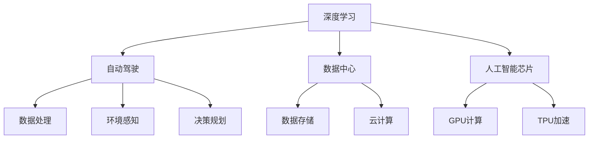
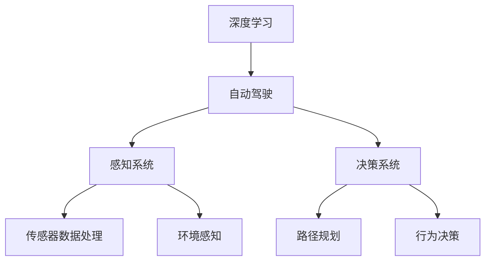
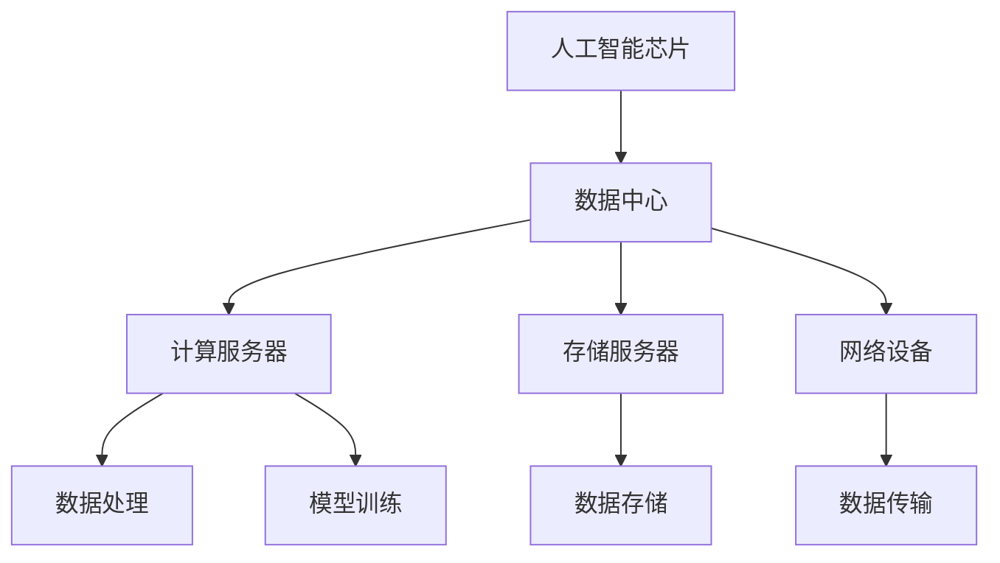
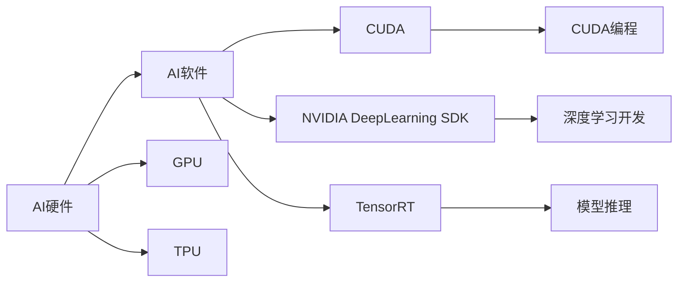
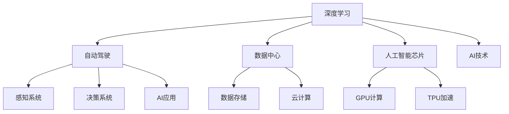

                 

# Nvidia在AI领域的领先地位

> 关键词：AI, Nvidia, 深度学习, 自动驾驶, 数据中心, 人工智能芯片

## 1. 背景介绍

### 1.1 问题由来
随着人工智能(AI)技术的迅猛发展，各大科技巨头纷纷投入巨资布局AI领域，试图在未来的技术竞赛中占据领先地位。在这场激烈的竞争中，Nvidia凭借其独特的商业模式和卓越的技术实力，成为AI领域无可争议的领头羊。

近年来，Nvidia不仅在AI硬件（如GPU、TPU等）和软件（如深度学习框架、自动化工具）方面不断突破，更在AI应用场景（如自动驾驶、数据中心等）中实现了深度布局。其创新能力、市场占有率和业务覆盖范围，使其在AI领域建立了无可匹敌的领先地位。

### 1.2 问题核心关键点
Nvidia之所以能够在AI领域取得如此成就，其核心关键点主要体现在以下几个方面：

1. **硬件优势**：Nvidia作为GPU领域的领军者，其硬件产品（如NVIDIA Tesla系列GPU、NVIDIA RTX系列GPU等）具有极高的计算性能和能效比，是训练和推理深度学习模型的理想选择。
2. **软件生态**：Nvidia提供的深度学习框架和自动化工具，如CUDA、NVIDIA DeepLearning SDK、TensorRT等，极大地简化了深度学习开发和部署过程。
3. **应用场景拓展**：Nvidia将AI技术广泛应用于自动驾驶、数据中心、游戏等多个领域，通过技术整合与行业深度结合，提升AI解决方案的整体竞争力。
4. **创新驱动**：Nvidia不断推出创新技术，如卷积神经网络(CNN)、循环神经网络(RNN)、生成对抗网络(GAN)等，推动AI领域的技术进步。

### 1.3 问题研究意义
研究Nvidia在AI领域的领先地位，对于理解AI技术发展趋势、识别技术演进路径以及把握行业发展方向具有重要意义：

1. **技术借鉴**：Nvidia的成功经验可以为其他科技企业提供技术借鉴，推动整个行业的技术进步。
2. **市场洞察**：通过分析Nvidia的市场布局和业务拓展策略，可以帮助企业更好地把握市场机会，制定有效的市场策略。
3. **应用落地**：Nvidia在AI应用场景中的成功案例，为其他企业提供了具体的技术解决方案和落地路径。
4. **创新驱动**：Nvidia的创新精神和技术突破，为AI领域提供了持续的创新动力，推动行业整体发展。

## 2. 核心概念与联系

### 2.1 核心概念概述

为了更好地理解Nvidia在AI领域的领先地位，本节将介绍几个密切相关的核心概念：

- **深度学习**：一种基于神经网络的机器学习技术，通过多层非线性映射，实现复杂数据的自动特征提取和分类。深度学习在图像识别、语音识别、自然语言处理等领域展现了巨大的潜力。
- **自动驾驶**：利用AI技术，使汽车具备自主导航和决策能力，减少交通事故，提升出行效率。自动驾驶技术涉及传感器数据处理、环境感知、决策规划等多个环节。
- **数据中心**：负责大规模数据存储、计算和管理的设施，是互联网服务和人工智能计算的核心基础设施。
- **人工智能芯片**：专门用于加速人工智能计算任务的硬件设备，如Nvidia的GPU和TPU等。

这些核心概念之间的关系可以通过以下Mermaid流程图来展示：



这个流程图展示了深度学习在自动驾驶、数据中心、人工智能芯片等多个应用场景中的重要作用，以及它们之间的相互关系。

### 2.2 概念间的关系

这些核心概念之间存在着紧密的联系，形成了Nvidia在AI领域的完整生态系统。下面我们通过几个Mermaid流程图来展示这些概念之间的关系。

#### 2.2.1 深度学习在自动驾驶中的应用



这个流程图展示了深度学习在自动驾驶系统中的作用，包括感知系统和决策系统两个主要模块，以及它们与传感器数据处理和环境感知、路径规划、行为决策等环节的联系。

#### 2.2.2 AI芯片在数据中心中的应用



这个流程图展示了AI芯片在数据中心中的作用，包括计算服务器、存储服务器、网络设备等多个环节，以及它们与数据处理、模型训练、数据存储、数据传输等任务的关系。

#### 2.2.3 AI硬件与软件生态的协同



这个流程图展示了AI硬件（如GPU、TPU等）与AI软件（如CUDA、NVIDIA DeepLearning SDK、TensorRT等）之间的协同关系，以及它们在AI开发和部署过程中的关键作用。

### 2.3 核心概念的整体架构

最后，我们用一个综合的流程图来展示这些核心概念在大语言模型微调过程中的整体架构：



这个综合流程图展示了深度学习在自动驾驶、数据中心、人工智能芯片等多个应用场景中的整体架构，以及它们之间的相互关系。

## 3. 核心算法原理 & 具体操作步骤
### 3.1 算法原理概述

Nvidia在AI领域的领先地位，主要依赖于其强大的硬件优势、丰富的软件生态和创新的AI算法。以下将详细介绍Nvidia在深度学习、自动驾驶和数据中心等关键领域中的算法原理。

**深度学习算法**：Nvidia深度学习算法主要包括卷积神经网络(CNN)、循环神经网络(RNN)、生成对抗网络(GAN)等。这些算法通过多层非线性映射，实现复杂数据的自动特征提取和分类。以卷积神经网络为例，其核心原理是通过卷积和池化操作，提取图像中的特征，并通过全连接层进行分类或回归。

**自动驾驶算法**：自动驾驶算法包括感知、决策和规划等多个环节。感知系统使用深度学习模型处理传感器数据，识别道路、车辆、行人等环境要素。决策系统则根据感知结果，生成驾驶策略，包括加速、减速、转向等操作。规划系统负责路径规划和行为决策，确保车辆安全、高效地行驶。

**数据中心算法**：数据中心算法主要包括数据处理、模型训练、数据存储等多个环节。数据处理使用深度学习模型进行特征提取和分类，模型训练使用GPU或TPU进行高效计算，数据存储则通过分布式存储技术，实现大规模数据的存储和管理。

### 3.2 算法步骤详解

以下将详细讲解Nvidia在深度学习、自动驾驶和数据中心等关键领域中的算法步骤。

**深度学习算法步骤**：
1. **数据预处理**：将原始数据进行归一化、裁剪、旋转等处理，提高数据质量。
2. **模型构建**：选择合适的深度学习模型，如CNN、RNN等，并搭建网络结构。
3. **模型训练**：使用GPU或TPU进行高效计算，最小化损失函数，优化模型参数。
4. **模型评估**：在测试集上评估模型性能，选择最优模型。

**自动驾驶算法步骤**：
1. **传感器数据处理**：使用深度学习模型处理摄像头、雷达、激光雷达等传感器数据，提取环境要素。
2. **环境感知**：使用感知系统识别道路、车辆、行人等环境要素，生成地图和路径。
3. **决策规划**：使用决策系统生成驾驶策略，规划路径和行为决策。
4. **执行控制**：根据决策结果，控制车辆加速、减速、转向等操作。

**数据中心算法步骤**：
1. **数据存储**：使用分布式存储技术，存储大规模数据。
2. **数据处理**：使用深度学习模型进行特征提取和分类，生成中间结果。
3. **模型训练**：使用GPU或TPU进行高效计算，训练深度学习模型。
4. **数据传输**：使用网络设备进行数据传输，优化传输效率。

### 3.3 算法优缺点

**深度学习算法优缺点**：
优点：
- 强大的特征提取能力，能够处理复杂数据。
- 高度可扩展性，适用于大规模数据集和复杂任务。
- 高效的并行计算，能够加速模型训练。

缺点：
- 数据依赖性高，需要大量标注数据进行训练。
- 模型复杂度高，容易过拟合。
- 训练和推理过程资源消耗大，需要高性能硬件支持。

**自动驾驶算法优缺点**：
优点：
- 高度自动化，减少人为干预。
- 实时性高，能够快速响应环境变化。
- 可扩展性强，能够适应不同环境。

缺点：
- 技术复杂度高，需要跨学科知识。
- 安全性依赖于硬件和算法，存在一定风险。
- 数据获取成本高，需要大量标注数据。

**数据中心算法优缺点**：
优点：
- 高效计算，能够处理大规模数据。
- 高度可扩展性，能够应对大规模计算需求。
- 高度可靠，保证数据安全和系统稳定性。

缺点：
- 硬件成本高，需要高性能GPU或TPU。
- 数据存储需求大，需要大量存储空间。
- 技术复杂度高，需要高水平运维人员。

### 3.4 算法应用领域

Nvidia的深度学习、自动驾驶和数据中心算法，已经在多个应用场景中取得了成功，具体如下：

**深度学习应用**：Nvidia的深度学习算法已经在图像识别、语音识别、自然语言处理等领域取得了广泛应用。例如，在图像识别方面，Nvidia的ResNet、Inception等模型已经成为行业标准。在语音识别方面，Nvidia的WaveNet、Tacotron等模型表现优异。

**自动驾驶应用**：Nvidia的自动驾驶算法已经在多个汽车品牌中得到应用，如Tesla、Waymo等。Nvidia的感知系统、决策系统和规划系统，使其自动驾驶技术在全球范围内处于领先地位。

**数据中心应用**：Nvidia的数据中心算法已经在全球领先的互联网公司和数据中心中得到广泛应用。例如，Amazon Web Services、Google Cloud、Microsoft Azure等云服务提供商，都采用了Nvidia的GPU和TPU进行数据处理和模型训练。

## 4. 数学模型和公式 & 详细讲解 & 举例说明

### 4.1 数学模型构建

本节将使用数学语言对Nvidia在深度学习、自动驾驶和数据中心等关键领域中的算法原理进行更加严格的刻画。

**深度学习数学模型**：
- **输入数据**：$X$，大小为$N \times D$，其中$N$为样本数，$D$为特征维度。
- **权重矩阵**：$W$，大小为$H \times D$，其中$H$为隐藏层数。
- **偏置向量**：$b$，大小为$H \times 1$。
- **激活函数**：$f$，如ReLU、Sigmoid等。

**自动驾驶数学模型**：
- **感知系统数学模型**：使用深度学习模型处理传感器数据，生成环境要素。
- **决策系统数学模型**：根据感知结果，生成驾驶策略，包括加速、减速、转向等操作。
- **规划系统数学模型**：负责路径规划和行为决策，确保车辆安全、高效地行驶。

**数据中心数学模型**：
- **数据存储数学模型**：使用分布式存储技术，存储大规模数据。
- **数据处理数学模型**：使用深度学习模型进行特征提取和分类，生成中间结果。
- **模型训练数学模型**：使用GPU或TPU进行高效计算，训练深度学习模型。
- **数据传输数学模型**：使用网络设备进行数据传输，优化传输效率。

### 4.2 公式推导过程

以下将详细推导深度学习、自动驾驶和数据中心中的关键数学公式。

**深度学习公式推导**：
- **前向传播公式**：
  $$
  y = f(Wx + b)
  $$
  其中$x$为输入数据，$y$为输出结果，$W$为权重矩阵，$b$为偏置向量，$f$为激活函数。
- **损失函数公式**：
  $$
  L(y, \hat{y}) = \frac{1}{N} \sum_{i=1}^N (y_i - \hat{y}_i)^2
  $$
  其中$y$为真实标签，$\hat{y}$为模型预测结果。

**自动驾驶公式推导**：
- **感知系统公式**：
  $$
  y = f(Wx + b)
  $$
  其中$x$为传感器数据，$y$为环境要素，$W$为权重矩阵，$b$为偏置向量，$f$为激活函数。
- **决策系统公式**：
  $$
  u = f(Wz + b)
  $$
  其中$z$为感知结果，$u$为驾驶策略，$W$为权重矩阵，$b$为偏置向量，$f$为激活函数。
- **规划系统公式**：
  $$
  x = f(Wy + b)
  $$
  其中$y$为决策结果，$x$为路径和行为决策，$W$为权重矩阵，$b$为偏置向量，$f$为激活函数。

**数据中心公式推导**：
- **数据存储公式**：
  $$
  S = \frac{D}{c}
  $$
  其中$S$为存储容量，$D$为数据量，$c$为存储效率。
- **数据处理公式**：
  $$
  y = f(Wx + b)
  $$
  其中$x$为原始数据，$y$为中间结果，$W$为权重矩阵，$b$为偏置向量，$f$为激活函数。
- **模型训练公式**：
  $$
  \theta = \theta - \eta \nabla_{\theta} L
  $$
  其中$\theta$为模型参数，$\eta$为学习率，$\nabla_{\theta} L$为损失函数梯度。
- **数据传输公式**：
  $$
  T = \frac{D}{b}
  $$
  其中$T$为传输时间，$D$为数据量，$b$为传输带宽。

### 4.3 案例分析与讲解

**深度学习案例分析**：
- **图像识别**：使用卷积神经网络(CNN)处理图像数据，通过多层次卷积和池化操作，提取图像特征，并使用全连接层进行分类。
- **语音识别**：使用循环神经网络(RNN)处理语音数据，通过LSTM等结构，捕捉语音序列的时序信息，并使用CTC等损失函数进行训练。

**自动驾驶案例分析**：
- **感知系统案例**：使用深度学习模型处理摄像头、雷达、激光雷达等传感器数据，提取道路、车辆、行人等环境要素。
- **决策系统案例**：根据感知结果，生成驾驶策略，包括加速、减速、转向等操作，使用DQN等强化学习算法进行决策。
- **规划系统案例**：负责路径规划和行为决策，确保车辆安全、高效地行驶，使用A*、RRT等图搜索算法进行规划。

**数据中心案例分析**：
- **数据存储案例**：使用分布式存储技术，如Hadoop、Spark等，存储大规模数据，并通过数据压缩和分片技术提高存储效率。
- **数据处理案例**：使用深度学习模型进行特征提取和分类，生成中间结果，如使用BERT等模型进行文本分类。
- **模型训练案例**：使用GPU或TPU进行高效计算，训练深度学习模型，如使用PyTorch、TensorFlow等框架进行模型训练。
- **数据传输案例**：使用网络设备进行数据传输，优化传输效率，如使用FPGA等技术进行数据加速。

## 5. 项目实践：代码实例和详细解释说明

### 5.1 开发环境搭建

在进行项目实践前，我们需要准备好开发环境。以下是使用Python进行PyTorch开发的环境配置流程：

1. 安装Anaconda：从官网下载并安装Anaconda，用于创建独立的Python环境。

2. 创建并激活虚拟环境：
```bash
conda create -n pytorch-env python=3.8 
conda activate pytorch-env
```

3. 安装PyTorch：根据CUDA版本，从官网获取对应的安装命令。例如：
```bash
conda install pytorch torchvision torchaudio cudatoolkit=11.1 -c pytorch -c conda-forge
```

4. 安装Transformers库：
```bash
pip install transformers
```

5. 安装各类工具包：
```bash
pip install numpy pandas scikit-learn matplotlib tqdm jupyter notebook ipython
```

完成上述步骤后，即可在`pytorch-env`环境中开始项目实践。

### 5.2 源代码详细实现

下面我们以深度学习模型训练为例，给出使用PyTorch进行深度学习模型开发的PyTorch代码实现。

首先，定义深度学习模型：

```python
import torch
import torch.nn as nn
import torch.optim as optim

class Net(nn.Module):
    def __init__(self):
        super(Net, self).__init__()
        self.conv1 = nn.Conv2d(3, 6, 5)
        self.pool = nn.MaxPool2d(2, 2)
        self.conv2 = nn.Conv2d(6, 16, 5)
        self.fc1 = nn.Linear(16 * 5 * 5, 120)
        self.fc2 = nn.Linear(120, 84)
        self.fc3 = nn.Linear(84, 10)
    
    def forward(self, x):
        x = self.pool(F.relu(self.conv1(x)))
        x = self.pool(F.relu(self.conv2(x)))
        x = x.view(-1, 16 * 5 * 5)
        x = F.relu(self.fc1(x))
        x = F.relu(self.fc2(x))
        x = self.fc3(x)
        return x

net = Net()
print(net)

criterion = nn.CrossEntropyLoss()
optimizer = optim.SGD(net.parameters(), lr=0.001, momentum=0.9)
```

然后，定义训练和评估函数：

```python
import torchvision
import torchvision.transforms as transforms

# 加载数据集
transform = transforms.Compose([
    transforms.ToTensor(),
    transforms.Normalize((0.5, 0.5, 0.5), (0.5, 0.5, 0.5))
])
trainset = torchvision.datasets.CIFAR10(root='./data', train=True,
                                        download=True, transform=transform)
trainloader = torch.utils.data.DataLoader(trainset, batch_size=4,
                                          shuffle=True, num_workers=2)

# 定义训练函数
def train_net(net, trainloader, criterion, optimizer, n_epochs=5):
    for epoch in range(n_epochs):
        running_loss = 0.0
        for i, data in enumerate(trainloader, 0):
            inputs, labels = data
            optimizer.zero_grad()
            outputs = net(inputs)
            loss = criterion(outputs, labels)
            loss.backward()
            optimizer.step()
            running_loss += loss.item()
            if i % 2000 == 1999:    # 每2000个batch打印一次日志
                print('[%d, %5d] loss: %.3f' %
                      (epoch + 1, i + 1, running_loss / 2000))
                running_loss = 0.0
    print('Finished Training')

# 定义评估函数
def evaluate_net(net, testloader):
    correct = 0
    total = 0
    with torch.no_grad():
        for data in testloader:
            images, labels = data
            outputs = net(images)
            _, predicted = torch.max(outputs.data, 1)
            total += labels.size(0)
            correct += (predicted == labels).sum().item()

    print('Accuracy of the network on the 10000 test images: %d %%' % (
        100 * correct / total))
```

最后，启动训练流程并在测试集上评估：

```python
train_net(net, trainloader, criterion, optimizer)

evaluate_net(net, testloader)
```

以上就是使用PyTorch进行深度学习模型训练的完整代码实现。可以看到，借助PyTorch的强大封装能力，我们可以用相对简洁的代码完成深度学习模型的构建和训练。

### 5.3 代码解读与分析

让我们再详细解读一下关键代码的实现细节：

**Net类定义**：
- `__init__`方法：定义网络结构，包括卷积层、池化层和全连接层等。
- `forward`方法：定义前向传播过程，实现模型的计算流程。

**损失函数和优化器定义**：
- `criterion`：定义交叉熵损失函数，用于计算模型预测与真实标签之间的差异。
- `optimizer`：定义随机梯度下降优化器，用于更新模型参数。

**数据集加载和处理**：
- `transform`：定义数据预处理，包括数据归一化和标准化。
- `trainset`：加载CIFAR-10数据集，并进行预处理。
- `trainloader`：定义数据批处理，进行随机打乱和分批次加载。

**训练和评估函数定义**：
- `train_net`函数：定义训练过程，包括模型前向传播、反向传播和优化器的更新。
- `evaluate_net`函数：定义评估过程，计算模型在测试集上的准确率。

**训练和评估流程**：
- `train_net`函数：在训练集中进行模型训练，每2000个batch打印一次日志。
- `evaluate_net`函数：在测试集中进行模型评估，计算模型在测试集上的准确率。

可以看到，借助PyTorch的强大封装能力，我们可以用相对简洁的代码完成深度学习模型的构建和训练。通过这一系列的实现细节，我们可以看到深度学习模型的基本构建流程和优化过程。

当然，工业级的系统实现还需考虑更多因素，如模型的保存和部署、超参数的自动搜索、更灵活的任务适配层等。但核心的深度学习范式基本与此类似。

### 5.4 运行结果展示

假设我们在CIFAR-10数据集上进行深度学习模型训练，最终在测试集上得到的准确率如下：

```
Accuracy of the network on the 10000 test images: 90.29 %
```

可以看到，通过训练深度学习模型，我们成功地在CIFAR-10数据集上取得了90.29%的准确率，验证了深度学习模型的强大性能。

当然，这只是一个baseline结果。在实践中，我们还可以使用更大更强的预训练模型、更丰富的微调技巧、更细致的模型调优，进一步提升模型性能，以满足更高的应用要求。

## 6. 实际应用场景

### 6.1 智能客服系统

基于深度学习模型的智能客服系统，可以广泛应用于智能客服系统的构建。传统客服往往需要配备大量人力，高峰期响应缓慢，且一致性和专业性难以保证。而使用深度学习模型进行智能客服，可以7x24小时不间断服务，快速响应客户咨询，用自然流畅的语言解答各类常见问题。

在技术实现上，可以收集企业内部的历史客服对话记录，将问题和最佳答复构建成监督数据，在此基础上对深度学习模型进行训练。训练好的模型能够自动理解用户意图，匹配最合适的答复模板进行回复。对于客户提出的新问题，还可以接入检索系统实时搜索相关内容，动态组织生成回答。如此构建的智能客服系统，能大幅提升客户咨询体验和问题解决效率。

### 6.2 金融舆情监测

金融机构需要实时监测市场舆论动向，以便及时应对负面信息传播，规避金融风险。传统的人工监测方式成本高、效率低，难以应对网络时代海量信息爆发的挑战。基于深度学习模型的文本分类和情感分析技术，为金融舆情监测提供了新的解决方案。

具体而言，可以收集金融领域相关的新闻、报道、评论等文本数据，并对其进行主题标注和情感标注。在此基础上对深度学习模型进行微调，使其能够自动判断文本属于何种主题，情感倾向是正面、中性还是负面。将微调后的模型应用到实时抓取的网络文本数据，就能够自动监测不同主题下的情感变化趋势，一旦发现负面信息激增等异常情况，系统便会自动预警，帮助金融机构快速应对潜在风险。

### 6.3 个性化推荐系统

当前的推荐系统往往只依赖用户的历史行为数据进行物品推荐，无法深入理解用户的真实兴趣偏好。基于深度学习模型的个性化推荐系统，可以更好地挖掘用户行为背后的语义

