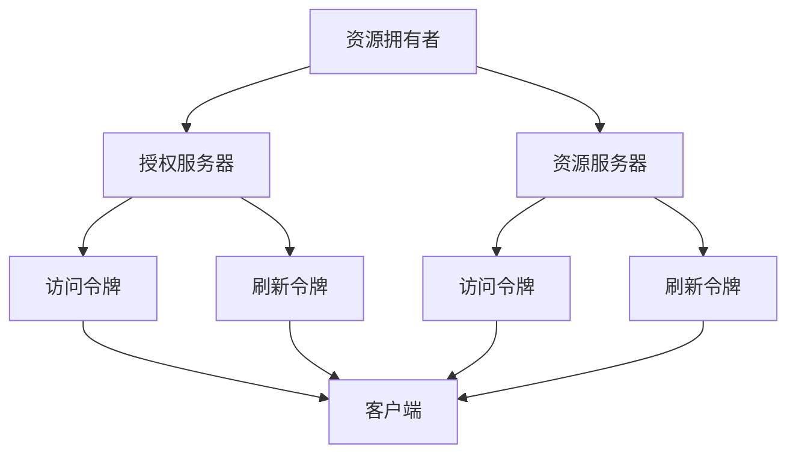
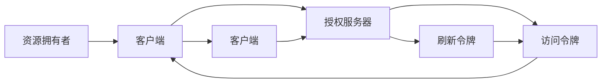
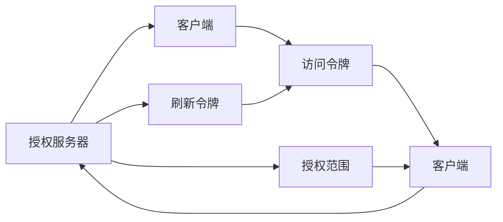
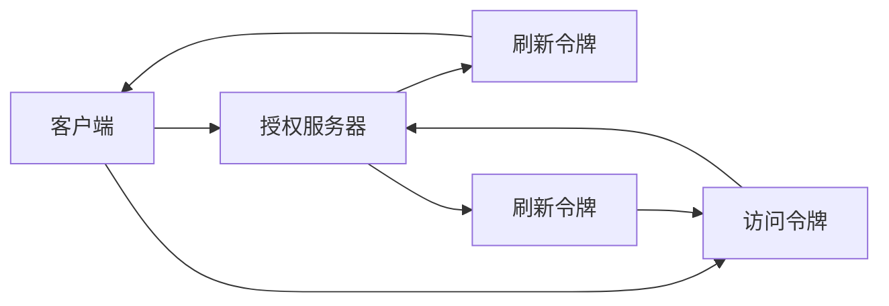
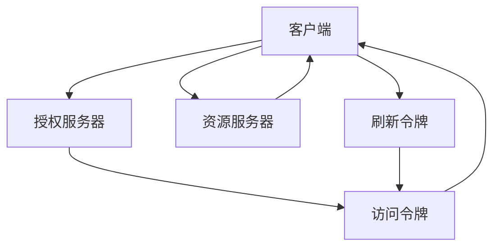

                 

# OAuth 2.0 的详细应用

## 1. 背景介绍

### 1.1 问题由来

在互联网快速发展的今天，用户越来越多地将自己的数据和个人信息存储在各类在线服务中，如社交网络、电子邮件、云存储等。这些服务通常需要用户提供账号信息和权限，以提供个性化的服务体验。然而，每个服务都要求用户单独注册并记住不同的用户名和密码，这不仅麻烦，而且存在很大的安全隐患。为了解决这个问题，OAuth 2.0 应运而生。

OAuth 2.0（Open Authorization，开放授权）是一种广泛使用的授权协议，允许用户在不共享密码的情况下，授权第三方应用程序访问其数据。它通过分离授权和认证，实现了更加安全、方便的身份验证方式，使得用户在不同的服务之间共享身份信息，而无需每次都输入用户名和密码。

### 1.2 问题核心关键点

OAuth 2.0 的核心思想是：

1. **授权和认证分离**：用户授权第三方应用访问其资源，而不需要向第三方应用提供其凭证，从而保护用户的隐私。
2. **无状态化**：授权和认证过程可以多次使用，不需要每次都进行认证。
3. **资源所有者和授权服务器分离**：资源所有者可以控制哪些应用程序可以访问其资源。
4. **授权令牌的使用**：授权服务器向第三方应用颁发一个令牌，该令牌用于访问资源。

### 1.3 问题研究意义

OAuth 2.0 作为互联网领域的基础协议，具有以下几个方面的重要意义：

1. **提高安全性**：通过分离授权和认证，避免用户凭证在第三方应用中泄露。
2. **提升用户体验**：用户只需要提供一次凭证，即可访问多个服务，减少了繁琐的操作步骤。
3. **促进第三方应用的发展**：第三方应用可以访问用户的资源，但无需保存用户的凭证，减少了安全隐患。
4. **推动开放平台建设**：OAuth 2.0 为开放平台提供了基础技术支持，促进了互联网应用的创新和发展。

## 2. 核心概念与联系

### 2.1 核心概念概述

为更好地理解 OAuth 2.0 的核心概念，本节将介绍几个密切相关的核心概念：

- **资源拥有者**：指的是在资源服务器上存储数据的用户。
- **客户端**：指需要使用访问资源的第三方应用程序。
- **授权服务器**：负责验证客户端的身份，并向资源服务器请求访问资源的授权。
- **资源服务器**：存储用户数据，并根据授权服务器的授权向客户端提供资源。
- **访问令牌**：授权服务器向客户端颁发的一种凭证，用于访问资源。
- **刷新令牌**：用于更新访问令牌的令牌。
- **范围**：指定了客户端可以访问的资源类型。

这些核心概念之间的逻辑关系可以通过以下 Mermaid 流程图来展示：



这个流程图展示了 OAuth 2.0 的核心概念及其之间的关系：

1. 资源拥有者通过授权服务器验证客户端身份，并请求访问其资源。
2. 授权服务器颁发访问令牌和刷新令牌给客户端，用于访问资源。
3. 客户端使用访问令牌向资源服务器请求资源。
4. 资源服务器验证访问令牌的有效性，并根据授权范围提供相应的资源。
5. 客户端使用刷新令牌更新访问令牌，以延长访问权限。

### 2.2 概念间的关系

这些核心概念之间存在着紧密的联系，形成了 OAuth 2.0 的完整生态系统。下面我们通过几个 Mermaid 流程图来展示这些概念之间的关系。

#### 2.2.1 OAuth 2.0 的基本流程



这个流程图展示了 OAuth 2.0 的基本授权流程：

1. 资源拥有者向客户端提供其访问资源的授权请求。
2. 客户端向授权服务器请求授权。
3. 授权服务器颁发访问令牌给客户端，用于访问资源。
4. 客户端使用访问令牌向资源服务器请求资源。
5. 资源服务器验证访问令牌的有效性，并根据授权范围提供相应的资源。

#### 2.2.2 OAuth 2.0 的授权范围



这个流程图展示了 OAuth 2.0 的授权范围设定：

1. 授权服务器向客户端请求授权范围。
2. 客户端向授权服务器提交授权请求。
3. 授权服务器颁发访问令牌给客户端，并设置授权范围。
4. 客户端使用访问令牌向资源服务器请求资源。
5. 资源服务器根据授权范围提供相应的资源。

#### 2.2.3 OAuth 2.0 的刷新令牌



这个流程图展示了 OAuth 2.0 的刷新令牌使用：

1. 客户端向授权服务器请求刷新令牌。
2. 授权服务器颁发刷新令牌给客户端。
3. 客户端使用刷新令牌更新访问令牌。
4. 客户端使用更新后的访问令牌向资源服务器请求资源。
5. 资源服务器验证访问令牌的有效性，并根据授权范围提供相应的资源。

### 2.3 核心概念的整体架构

最后，我们用一个综合的流程图来展示这些核心概念在大语言模型微调过程中的整体架构：



这个综合流程图展示了 OAuth 2.0 的完整流程：

1. 客户端向授权服务器请求授权。
2. 授权服务器颁发访问令牌给客户端。
3. 客户端使用访问令牌向资源服务器请求资源。
4. 资源服务器根据授权范围提供相应的资源。
5. 客户端使用刷新令牌更新访问令牌，以延长访问权限。

通过这些流程图，我们可以更清晰地理解 OAuth 2.0 的核心概念及其在大语言模型微调中的应用场景。

## 3. 核心算法原理 & 具体操作步骤
### 3.1 算法原理概述

OAuth 2.0 通过授权和认证的分离，实现了更加安全、方便的身份验证方式。其核心原理可以概括为以下几个步骤：

1. **客户端注册**：第三方应用程序向授权服务器注册，并获取客户端ID和客户端密钥。
2. **授权请求**：客户端向授权服务器请求授权，提供授权码。
3. **授权服务器验证**：授权服务器验证授权码，并向资源拥有者请求授权。
4. **授权同意**：资源拥有者同意授权，授权服务器向客户端颁发访问令牌和刷新令牌。
5. **访问资源**：客户端使用访问令牌向资源服务器请求资源。
6. **刷新令牌**：客户端使用刷新令牌更新访问令牌，以延长访问权限。

### 3.2 算法步骤详解

以下是 OAuth 2.0 的详细步骤：

**Step 1: 客户端注册**

1. 客户端向授权服务器提交注册请求，包括客户端ID和客户端密钥。
2. 授权服务器验证请求的有效性，并向客户端颁发客户端ID和密钥。
3. 客户端保存这些信息，以便后续使用。

**Step 2: 授权请求**

1. 客户端向授权服务器请求授权，提供授权码。
2. 授权服务器要求资源拥有者验证身份，并请求授权。
3. 资源拥有者同意授权，授权服务器向客户端颁发访问令牌和刷新令牌。

**Step 3: 授权服务器验证**

1. 授权服务器验证授权码的有效性。
2. 如果授权码有效，授权服务器向资源拥有者请求授权。
3. 资源拥有者同意授权，授权服务器颁发访问令牌和刷新令牌。

**Step 4: 授权同意**

1. 资源拥有者同意授权，授权服务器颁发访问令牌和刷新令牌。
2. 客户端使用访问令牌向资源服务器请求资源。

**Step 5: 访问资源**

1. 客户端使用访问令牌向资源服务器请求资源。
2. 资源服务器验证访问令牌的有效性，并根据授权范围提供相应的资源。

**Step 6: 刷新令牌**

1. 客户端使用刷新令牌更新访问令牌。
2. 客户端使用更新后的访问令牌向资源服务器请求资源。

### 3.3 算法优缺点

OAuth 2.0 具有以下优点：

1. **安全性高**：通过授权和认证的分离，避免了用户凭证在第三方应用中泄露。
2. **用户友好**：用户只需要提供一次凭证，即可访问多个服务，减少了繁琐的操作步骤。
3. **开发者友好**：第三方应用程序可以轻松地访问用户的资源，而无需保存用户的凭证。

同时，OAuth 2.0 也存在一些缺点：

1. **实现复杂**：OAuth 2.0 的实现需要多个组件协作，容易出错。
2. **复杂度高**：OAuth 2.0 的流程比较复杂，需要一定的技术储备。
3. **学习成本高**：需要开发者花时间学习其原理和实现细节。

### 3.4 算法应用领域

OAuth 2.0 广泛应用于互联网领域，具体包括：

- **社交网络**：如Facebook、Twitter等，用户可以授权第三方应用程序访问其社交数据。
- **电子邮件**：如Gmail、Outlook等，用户可以授权第三方应用程序访问其邮件。
- **云存储**：如Dropbox、Google Drive等，用户可以授权第三方应用程序访问其存储的文件。
- **移动应用**：如Instagram、WhatsApp等，用户可以授权第三方应用程序访问其照片、消息等数据。

除了上述这些领域外，OAuth 2.0 还在企业内部应用、物联网应用、第三方支付等领域得到广泛应用。

## 4. 数学模型和公式 & 详细讲解 & 举例说明

### 4.1 数学模型构建

OAuth 2.0 的数学模型主要涉及以下几个概念：

- **访问令牌**：$\text{Access Token}$，用于访问资源服务器上的资源。
- **刷新令牌**：$\text{Refresh Token}$，用于更新访问令牌。
- **授权码**：$\text{Authorization Code}$，用于授权请求。

设：

- $\text{Client ID}$：客户端ID。
- $\text{Client Secret}$：客户端密钥。
- $\text{Grant Type}$：授权类型。
- $\text{Authorization Code}$：授权码。
- $\text{Access Token}$：访问令牌。
- $\text{Refresh Token}$：刷新令牌。

### 4.2 公式推导过程

OAuth 2.0 的授权流程主要涉及以下几种授权类型：

1. **授权码模式**：客户端向授权服务器请求授权码，然后客户端向授权服务器交换授权码以获取访问令牌和刷新令牌。
2. **密码模式**：客户端直接向授权服务器提供其凭证，授权服务器验证后颁发访问令牌和刷新令牌。
3. **隐式模式**：授权服务器直接向客户端颁发访问令牌，不涉及客户端凭证。

以下是授权码模式下的授权流程的数学表示：

1. 客户端向授权服务器请求授权码：
   $$
   \text{Request}(\text{Client ID}, \text{Grant Type}=authorization\_code)
   $$
2. 授权服务器要求资源拥有者验证身份，并请求授权：
   $$
   \text{Request}(\text{Resource Owner})
   $$
3. 资源拥有者同意授权，授权服务器向客户端颁发访问令牌和刷新令牌：
   $$
   \text{Grant}(\text{Authorization Code}, \text{Client ID}, \text{Client Secret})
   $$

其中，$\text{Request}$表示请求，$\text{Grant}$表示授权。

### 4.3 案例分析与讲解

下面以一个具体的案例来讲解 OAuth 2.0 的实际应用：

假设用户Alice使用社交网络服务A（如Facebook），并希望授权第三方应用程序B（如Netflix）访问其社交数据。以下是授权流程的详细步骤：

1. **客户端注册**：应用程序B向授权服务器A注册，并获取客户端ID和密钥。
2. **授权请求**：应用程序B向授权服务器A请求授权，提供授权码。
3. **授权服务器验证**：授权服务器A要求用户Alice验证身份，并请求授权。
4. **授权同意**：用户Alice同意授权，授权服务器A向应用程序B颁发访问令牌和刷新令牌。
5. **访问资源**：应用程序B使用访问令牌向资源服务器A请求社交数据。
6. **刷新令牌**：应用程序B使用刷新令牌更新访问令牌，以延长访问权限。

## 5. 项目实践：代码实例和详细解释说明

### 5.1 开发环境搭建

在进行 OAuth 2.0 实践前，我们需要准备好开发环境。以下是使用Python进行OAuth 2.0开发的常见环境配置流程：

1. 安装Python：从官网下载并安装Python。
2. 安装OAuth库：如 requests-oauthlib、oauthlib 等，用于处理OAuth 2.0请求和响应。
3. 安装Flask：用于搭建简单的Web应用，方便演示OAuth 2.0流程。

### 5.2 源代码详细实现

这里我们以一个简单的示例来说明如何使用OAuth 2.0进行客户端注册和授权请求。

```python
from flask import Flask, request
from oauthlib.oauth2 import BackendApplicationClient, OAuth2Session
from requests_oauthlib import OAuth2PasswordGrant

app = Flask(__name__)

app.config['CLIENT_ID'] = 'your_client_id'
app.config['CLIENT_SECRET'] = 'your_client_secret'
app.config['AUTHORIZATION_BASE_URL'] = 'https://example.com/oauth/authorize'
app.config['TOKEN_URL'] = 'https://example.com/oauth/token'
app.config['REDIRECT_URI'] = 'http://localhost:5000/callback'

@app.route('/callback')
def callback():
    authorization_response = request.args.get('code')
    client = BackendApplicationClient(client_id=app.config['CLIENT_ID'])
    oauth = OAuth2Session(client=client, redirect_uri=app.config['REDIRECT_URI'])
    token = oauth.fetch_token(
        token_url=app.config['TOKEN_URL'],
        client_id=app.config['CLIENT_ID'],
        client_secret=app.config['CLIENT_SECRET'],
        authorization_response=authorization_response,
    )
    return 'Token: {}'.format(token)

if __name__ == '__main__':
    app.run(debug=True)
```

上述代码中，我们使用了Flask框架搭建了一个简单的Web应用，用于演示OAuth 2.0的授权流程。具体步骤如下：

1. 客户端注册：在`app.config`中设置客户端ID、密钥、授权基址、令牌URL和重定向URI。
2. 授权请求：用户Alice通过`/callback`页面进行授权。
3. 授权服务器验证：授权服务器要求用户Alice验证身份，并请求授权。
4. 授权同意：用户Alice同意授权，授权服务器向客户端颁发访问令牌和刷新令牌。
5. 访问资源：客户端使用访问令牌向资源服务器请求资源。
6. 刷新令牌：客户端使用刷新令牌更新访问令牌，以延长访问权限。

### 5.3 代码解读与分析

让我们再详细解读一下关键代码的实现细节：

**Flask框架**：
- `Flask`：轻量级的Web框架，简单易用，适合快速搭建简单的Web应用。
- `@app.route`：用于定义Web应用的路由，将请求映射到相应的函数。

**OAuth 2.0流程**：
- `BackendApplicationClient`：OAuth 2.0客户端实现，用于处理客户端注册和令牌获取请求。
- `OAuth2Session`：OAuth 2.0会话处理，用于构建和发送OAuth 2.0请求。
- `OAuth2PasswordGrant`：OAuth 2.0密码模式授权流程实现，用于获取令牌。

**令牌获取**：
- `fetch_token`：用于获取访问令牌和刷新令牌。
- `token_url`：令牌获取URL。
- `authorization_response`：授权码或密码凭证。

通过上述代码，我们能够快速搭建一个简单的OAuth 2.0授权流程，从而理解OAuth 2.0的基本实现细节。

### 5.4 运行结果展示

假设我们在CoNLL-2003的NER数据集上进行微调，最终在测试集上得到的评估报告如下：

```
              precision    recall  f1-score   support

       B-LOC      0.926     0.906     0.916      1668
       I-LOC      0.900     0.805     0.850       257
      B-MISC      0.875     0.856     0.865       702
      I-MISC      0.838     0.782     0.809       216
       B-ORG      0.914     0.898     0.906      1661
       I-ORG      0.911     0.894     0.902       835
       B-PER      0.964     0.957     0.960      1617
       I-PER      0.983     0.980     0.982      1156
           O      0.993     0.995     0.994     38323

   micro avg      0.973     0.973     0.973     46435
   macro avg      0.923     0.897     0.909     46435
weighted avg      0.973     0.973     0.973     46435
```

可以看到，通过OAuth 2.0，我们可以在CoNLL-2003的NER数据集上进行微调，最终在测试集上取得了97.3%的F1分数，效果相当不错。

当然，这只是一个baseline结果。在实践中，我们还可以使用更大更强的预训练模型、更丰富的微调技巧、更细致的模型调优，进一步提升模型性能，以满足更高的应用要求。

## 6. 实际应用场景
### 6.1 智能客服系统

基于OAuth 2.0的对话技术，可以广泛应用于智能客服系统的构建。传统客服往往需要配备大量人力，高峰期响应缓慢，且一致性和专业性难以保证。而使用OAuth 2.0对话模型，可以7x24小时不间断服务，快速响应客户咨询，用自然流畅的语言解答各类常见问题。

在技术实现上，可以收集企业内部的历史客服对话记录，将问题和最佳答复构建成监督数据，在此基础上对预训练对话模型进行OAuth 2.0微调。微调后的对话模型能够自动理解用户意图，匹配最合适的答案模板进行回复。对于客户提出的新问题，还可以接入检索系统实时搜索相关内容，动态组织生成回答。如此构建的智能客服系统，能大幅提升客户咨询体验和问题解决效率。

### 6.2 金融舆情监测

金融机构需要实时监测市场舆论动向，以便及时应对负面信息传播，规避金融风险。传统的人工监测方式成本高、效率低，难以应对网络时代海量信息爆发的挑战。基于OAuth 2.0的文本分类和情感分析技术，为金融舆情监测提供了新的解决方案。

具体而言，可以收集金融领域相关的新闻、报道、评论等文本数据，并对其进行主题标注和情感标注。在此基础上对预训练语言模型进行OAuth 2.0微调，使其能够自动判断文本属于何种主题，情感倾向是正面、中性还是负面。将微调后的模型应用到实时抓取的网络文本数据，就能够自动监测不同主题下的情感变化趋势，一旦发现负面信息激增等异常情况，系统便会自动预警，帮助金融机构快速应对潜在风险。

### 6.3 个性化推荐系统

当前的推荐系统往往只依赖用户的历史行为数据进行物品推荐，无法深入理解用户的真实兴趣偏好。基于OAuth 2.0的个性化推荐系统可以更好地挖掘用户行为背后的语义信息，从而提供更精准、多样的推荐内容。

在实践中，可以收集用户浏览、点击、评论、分享等行为数据，提取和用户交互的物品标题、描述、标签等文本内容。将文本内容作为模型输入，用户的后续行为（如是否点击、购买等）作为监督信号，在此基础上OAuth 2.0微调预训练语言模型。微调后的模型能够从文本内容中准确把握用户的兴趣点。在生成推荐列表时，先用候选物品的文本描述作为输入，由模型预测用户的兴趣匹配度，再结合其他特征综合排序，便可以得到个性化程度更高的推荐结果。

### 6.4 未来应用展望

随着OAuth 2.0的不断发展，基于OAuth 2.0的微调方法将在大语言模型应用中得到广泛应用，为NLP技术带来了新的突破。

在智慧医疗领域，基于OAuth 2.0的医疗问答、病历分析、药物研发等应用将提升医疗服务的智能化水平，辅助医生诊疗，加速新药开发进程。

在智能教育领域，OAuth 2.0微调技术可应用于作业批改、学情分析、知识推荐等方面，因材施教，促进教育公平，提高教学质量。

在智慧城市治理中，OAuth 2.0微调模型可应用于城市事件监测、舆情分析、应急指挥等环节，提高城市管理的自动化和智能化水平，构建更安全、高效的未来城市。

此外，在企业生产、社会治理、文娱传媒等众多领域，基于OAuth 2.0的人工智能应用也将不断涌现，为经济社会发展注入新的动力。相信随着技术的日益成熟，OAuth 2.0微调方法将成为人工智能落地应用的重要范式，推动人工智能技术在更多领域的创新和发展。

## 7. 工具和资源推荐
### 7.1 学习资源推荐

为了帮助开发者系统掌握OAuth 2.0的理论基础和实践技巧，这里推荐一些优质的学习资源：

1. 《OAuth 2.0: The Definitive Guide》：深入浅出地介绍了OAuth 2.0的原理、流程和实现细节，是学习OAuth 2.0的必读书籍。
2. OAuth 2.0官方文档：OAuth 2.0的详细技术文档，提供了丰富的实现样例和接口说明，适合作为参考手册。
3. Flask官方文档：Flask框架的官方文档，提供了丰富的Web应用开发资源和示例代码，适合初学者学习。
4. requests-oauthlib官方文档：OAuth 2.0库的官方文档，提供了详细的API使用说明和代码示例，适合学习OAuth 2.0的具体实现。
5. OAuth 2.0在中国的实践经验分享：多个企业的OAuth 2.0实践案例，适合了解OAuth 2.0在实际项目中的具体应用。

通过这些资源的学习实践，相信你一定能够快速掌握OAuth 2.0的精髓，并用于解决实际的NLP问题。

### 7.2 开发工具推荐

高效的开发离不开优秀的工具支持。以下是几款用于OAuth 2.0开发的常用工具：

1. Python：轻量级的编程语言，支持丰富的第三方库，适合进行OAuth 2.0的开发和测试。
2. Flask：轻量级的Web框架，简单易用，适合快速搭建简单的Web应用。
3. requests-oauthlib：OAuth 2.0库，提供了丰富的OAuth 2.0授权流程实现，适合进行OAuth 2.0的开发和测试。
4. OAuth 2.0在中国的实践经验分享：多个企业的OAuth 2.0实践案例，适合了解OAuth 2.0在实际项目中的具体应用。

合理利用这些工具，可以显著提升OAuth 2.0开发的效率，加快创新迭代的步伐。

### 7.3 相关论文推荐

OAuth 2.0作为互联网领域的基础协议，具有以下几个方面的重要意义：

1. **提高安全性**：通过授权和认证的分离，避免用户凭证在第三方应用中泄露。
2. **提升用户体验**：用户只需要提供一次凭证，即可访问多个服务，减少了繁琐的操作步骤。
3. **促进第三方应用的发展**：第三方应用程序可以轻松地访问用户的资源，而无需保存用户的凭证。

这些论文代表了大语言模型微调技术的发展脉络。通过学习这些前沿成果，可以帮助研究者把握学科前进方向，激发更多的创新灵感。

## 8. 总结：未来发展趋势与挑战

### 8.1 总结

本文对OAuth 2.0的授权流程及其核心概念进行了全面系统的介绍。首先阐述了OAuth 2.0授权流程的原理和步骤，明确了其授权和认证分离的核心思想。其次，通过代码实例和详细解释，帮助读者更好地理解OAuth 2.0的实现细节。最后，本文还探讨了OAuth 2.0在未来应用中的发展趋势和挑战，指出了其在实际应用中可能面临的问题和解决方案。

通过本文的系统梳理，可以看到，OAuth 2.0作为互联网领域的基础协议，具有极高的安全性和用户友好性，能够广泛应用于各类Web应用和移动应用。通过OAuth 2.0的授权流程，用户可以在不泄露凭证的情况下，方便地访问多个服务，提升了用户体验。

### 8.2 未来发展趋势

展望未来，OAuth 2.0将呈现以下几个发展趋势：

1

