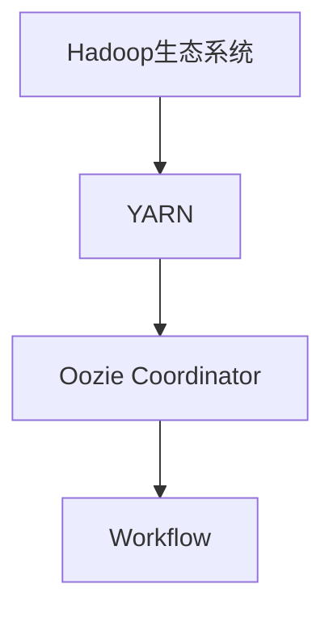
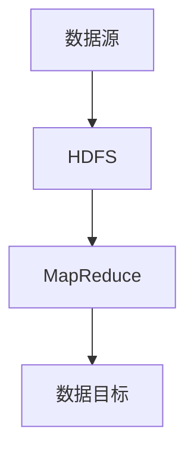
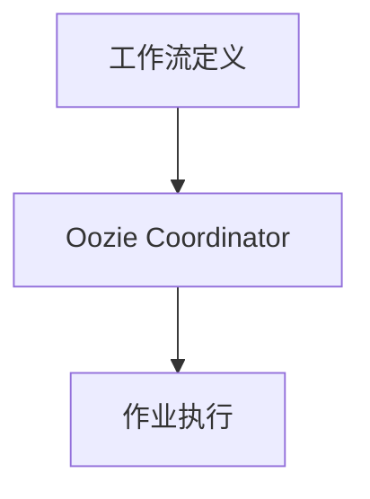

                 

# Oozie Coordinator原理与代码实例讲解

> 关键词：Hadoop、YARN、流批作业调度、数据处理、数据管理

## 1. 背景介绍

### 1.1 问题由来

随着大数据时代的到来，企业对于数据处理的需求日益增长。对于海量数据的收集、存储、计算和分析，传统的ETL流程已无法满足要求。与此同时，云计算和分布式计算技术的快速发展，推动了开源大数据生态系统的蓬勃发展，其中Hadoop是这些生态系统中最成熟的解决方案之一。

Hadoop生态系统提供了丰富的组件和工具，其中Oozie是用于流批作业调度和数据处理的开源工作流调度系统。通过Oozie，企业可以更加高效地管理和调度Hadoop生态系统中的各个组件，从而实现数据的自动化处理和分析。

然而，Oozie的学习曲线较陡峭，对于初学者来说，掌握其核心原理和使用方法并不容易。本文将详细讲解Oozie Coordinator的原理和代码实例，旨在帮助读者快速上手，掌握Oozie的使用技巧。

### 1.2 问题核心关键点

Oozie Coordinator是Oozie的核心组件，用于调度和管理Hadoop生态系统中的作业。其主要功能包括：

- 定义作业流：通过XML配置文件描述作业的执行顺序、依赖关系和触发条件等。
- 作业调度：在YARN集群上运行作业，监控作业状态，并在作业异常时进行重试。
- 数据管理：通过协调器工作流管理HDFS、Hive、HBase等数据源和数据目标，实现数据的自动处理和分析。
- 自动化流程：支持周期性作业和事件驱动作业，实现数据处理的自动化。

通过Oozie Coordinator，企业可以轻松构建复杂的数据处理工作流，实现从数据采集、存储、计算到分析和可视化的全链路自动化。

## 2. 核心概念与联系

### 2.1 核心概念概述

为更好地理解Oozie Coordinator的工作原理，本节将介绍几个密切相关的核心概念：

- Hadoop生态系统：由Hadoop、Hive、HBase、Pig、Sqoop等多个组件组成的大数据处理平台，用于大规模数据的存储、计算和分析。
- YARN（Yet Another Resource Negotiator）：Hadoop集群资源管理器，负责调度集群中的计算资源，并分配给各作业使用。
- Oozie Coordinator：基于XML的工作流调度器，用于管理和调度Hadoop生态系统中的作业，并协调各个组件的数据流。
- Workflow：即工作流，由多个作业组成的执行序列，用于自动化数据处理流程。

这些核心概念之间的逻辑关系可以通过以下Mermaid流程图来展示：



这个流程图展示了大数据处理平台、资源管理器和工作流调度器之间的关系：

1. 大数据处理平台（如Hadoop）提供数据存储和计算服务。
2. 资源管理器（如YARN）负责调度和管理集群资源。
3. 工作流调度器（如Oozie Coordinator）根据工作流定义，自动调度和管理作业。

### 2.2 概念间的关系

这些核心概念之间存在着紧密的联系，形成了Hadoop生态系统的完整调度和管理框架。下面我通过几个Mermaid流程图来展示这些概念之间的关系。

#### 2.2.1 数据处理流程



这个流程图展示了数据从数据源（如分布式文件系统HDFS）经过MapReduce计算后，再存入数据目标（如Hive、HBase等）的数据处理流程。

#### 2.2.2 作业调度与执行


这个流程图展示了Oozie Coordinator如何通过YARN调度集群资源，并触发作业的执行。YARN将作业分配给JobTracker，JobTracker再分配给TaskTracker，TaskTracker执行具体的任务。

#### 2.2.3 工作流调度



这个流程图展示了Oozie Coordinator如何根据工作流定义，自动调度和管理作业的执行流程。

## 3. 核心算法原理 & 具体操作步骤
### 3.1 算法原理概述

Oozie Coordinator的核心算法原理基于工作流调度机制，通过XML配置文件定义作业的执行顺序、依赖关系和触发条件等，自动管理和调度Hadoop生态系统中的作业。其工作流程主要包括以下几个步骤：

1. 读取XML配置文件：Oozie Coordinator从工作流配置文件中读取作业执行顺序、依赖关系和触发条件等。
2. 调度作业执行：根据配置文件，Oozie Coordinator调度作业在YARN集群上执行，并监控作业状态。
3. 处理异常和重试：在作业执行过程中，Oozie Coordinator实时监控作业状态，并在作业异常时进行重试，确保作业顺利完成。
4. 数据管理与协调：Oozie Coordinator通过协调器工作流管理HDFS、Hive、HBase等数据源和数据目标，实现数据的自动处理和分析。

### 3.2 算法步骤详解

以下详细介绍Oozie Coordinator的工作流程和关键步骤：

**Step 1: 创建工作流配置文件**

在Oozie Coordinator中，每个工作流都需要一个XML配置文件，用于描述作业的执行顺序、依赖关系和触发条件等。下面是一个示例配置文件：

```xml
<workflow-app xmlns="uri:oozie:workflow:0.5" name="data-processing-workflow">
    <start-to-end-node name="start">
        <action name="data-loading">
            <job-trackerset>
                <job-tracker>yarn-cluster</job-tracker>
                <name-node>hdfs-namenode</name-node>
            </job-trackerset>
            <job def="data-loading-job">
                <configuration>
                    <property>
                        <name>job.file</name>
                        <value>/path/to/data-loading-job.xml</value>
                    </property>
                </configuration>
                <mapreduce>
                    <mapreduce>
                        <configuration>
                            <property>
                                <name>mapreduce.job.tracker</name>
                                <value>yarn-cluster</value>
                            </property>
                            <property>
                                <name>mapreduce.job.name</name>
                                <value>data-loading</value>
                            </property>
                            <property>
                                <name>mapreduce.job.quality</name>
                                <value>mapreduce.job.quality</value>
                            </property>
                        </configuration>
                    </mapreduce>
                    <configuration>
                        <property>
                            <name>job.file</name>
                            <value>/path/to/data-loading-job.xml</value>
                        </property>
                    </configuration>
                </configuration>
                <mapreduce>
                    <mapreduce>
                        <configuration>
                            <property>
                                <name>mapreduce.job.tracker</name>
                                <value>yarn-cluster</value>
                            </property>
                            <property>
                                <name>mapreduce.job.name</name>
                                <value>data-loading</value>
                            </property>
                            <property>
                                <name>mapreduce.job.quality</name>
                                <value>mapreduce.job.quality</value>
                            </property>
                        </configuration>
                    </mapreduce>
                    <configuration>
                        <property>
                            <name>job.file</name>
                            <value>/path/to/data-loading-job.xml</value>
                        </property>
                    </configuration>
                </configuration>
            </job>
        </action>
        <action name="data-processing">
            <job-trackerset>
                <job-tracker>yarn-cluster</job-tracker>
                <name-node>hdfs-namenode</name-node>
            </job-trackerset>
            <job def="data-processing-job">
                <configuration>
                    <property>
                        <name>job.file</name>
                        <value>/path/to/data-processing-job.xml</value>
                    </property>
                </configuration>
                <mapreduce>
                    <mapreduce>
                        <configuration>
                            <property>
                                <name>mapreduce.job.tracker</name>
                                <value>yarn-cluster</value>
                            </property>
                            <property>
                                <name>mapreduce.job.name</name>
                                <value>data-processing</value>
                            </property>
                            <property>
                                <name>mapreduce.job.quality</name>
                                <value>mapreduce.job.quality</value>
                            </property>
                        </configuration>
                    </mapreduce>
                    <configuration>
                        <property>
                            <name>job.file</name>
                            <value>/path/to/data-processing-job.xml</value>
                        </property>
                    </configuration>
                </configuration>
            </job>
        </action>
        <action name="data-saving">
            <job-trackerset>
                <job-tracker>yarn-cluster</job-tracker>
                <name-node>hdfs-namenode</name-node>
            </job-trackerset>
            <job def="data-saving-job">
                <configuration>
                    <property>
                        <name>job.file</name>
                        <value>/path/to/data-saving-job.xml</value>
                    </property>
                </configuration>
                <mapreduce>
                    <mapreduce>
                        <configuration>
                            <property>
                                <name>mapreduce.job.tracker</name>
                                <value>yarn-cluster</value>
                            </property>
                            <property>
                                <name>mapreduce.job.name</name>
                                <value>data-saving</value>
                            </property>
                            <property>
                                <name>mapreduce.job.quality</name>
                                <value>mapreduce.job.quality</value>
                            </property>
                        </configuration>
                    </mapreduce>
                    <configuration>
                        <property>
                            <name>job.file</name>
                            <value>/path/to/data-saving-job.xml</value>
                        </property>
                    </configuration>
                </configuration>
            </job>
        </action>
        <action name="end">
            <kill name="all">
                <configuration>
                    <property>
                        <name>name</name>
                        <value>data-saving-job</value>
                    </property>
                </configuration>
            </kill>
        </action>
    </start-to-end-node>
</workflow-app>
```

该配置文件定义了一个包含三个作业（数据加载、数据处理和数据保存）的工作流，其中每个作业都有一个独立的配置文件。

**Step 2: 提交工作流配置文件**

提交工作流配置文件的方法主要有两种：

- 通过Web UI提交：登录Oozie Web UI，选择创建工作流，上传XML配置文件，即可提交工作流。
- 通过命令行提交：使用oozie命令，指定工作流名称和配置文件路径，即可提交工作流。

例如，通过命令行提交工作流的命令如下：

```bash
oozie job -run -file /path/to/workflow.xml
```

**Step 3: 监控作业状态**

提交工作流后，Oozie Coordinator会自动调度和管理作业的执行。在作业执行过程中，可以通过Oozie Web UI或命令行工具实时监控作业状态，确保作业顺利完成。

在Oozie Web UI中，可以查看每个作业的状态、执行进度和异常信息等。例如，当数据加载作业执行完毕后，Oozie Web UI会展示如下信息：

```
<h4><b>data-loading</b></h4>
<p><b>Tracking URL:</b> <a href="https://oozie-hostname:8443/oozie/webapp/flow/status?flowId=default%3A%2F%2F%2Fdefault-cluster%3A%2F%2Fdefault-cluster%3A%2F%2Fdata-loading" target="_blank">[Tracking URL]</a></p>
<p><b>Status:</b> COMPLETED</p>
<p><b>Start Time:</b> [start-time]</p>
<p><b>End Time:</b> [end-time]</p>
<p><b>Running on Node(s):</b> [running-nodes]</p>
<p><b>Retry Count:</b> 0</p>
```

**Step 4: 管理作业依赖和触发**

在Oozie Coordinator中，可以通过定义依赖关系和触发条件，实现作业的自动化调度和管理。例如，如果某个作业依赖于另一个作业的执行结果，可以在配置文件中定义依赖关系：

```xml
<action name="data-processing">
    <dependency>
        <configuration>
            <property>
                <name>job.file</name>
                <value>/path/to/data-loading-job.xml</value>
            </property>
        </configuration>
        <dependency>
            <configuration>
                <property>
                    <name>job.file</name>
                    <value>/path/to/data-saving-job.xml</value>
                </property>
            </configuration>
        </dependency>
    </dependency>
    <!-- ... -->
</action>
```

该配置文件定义了数据处理作业依赖于数据加载和数据保存作业。当数据加载作业执行完毕后，数据保存作业才会开始执行。

### 3.3 算法优缺点

Oozie Coordinator具有以下优点：

- 简单易用：通过XML配置文件，可以轻松定义作业流和作业依赖，操作简便。
- 跨平台支持：支持Hadoop生态系统中的多个组件，如HDFS、Hive、HBase、Pig、Sqoop等。
- 自动化调度：自动管理作业的执行顺序、依赖关系和触发条件，减少人为干预。
- 状态监控：实时监控作业状态，及时发现异常并进行重试。

同时，Oozie Coordinator也存在以下缺点：

- 学习曲线较陡：对于初学者来说，理解XML配置文件和Oozie Coordinator的工作机制需要一定的时间。
- 性能瓶颈：在处理大规模数据时，Oozie Coordinator的调度效率可能受限。
- 依赖外部工具：Oozie Coordinator需要依赖Hadoop生态系统中的其他组件，如YARN、HDFS等，这些组件的稳定性对Oozie Coordinator的运行至关重要。

### 3.4 算法应用领域

Oozie Coordinator可以广泛应用于大数据处理、数据分析和数据管理等领域，具体包括：

- 数据采集和处理：通过工作流调度，实现数据的自动采集、处理和存储。
- 数据清洗和转换：通过工作流调度，实现数据的清洗、转换和格式化。
- 数据建模和分析：通过工作流调度，实现数据的建模和分析，如ETL流程、数据挖掘等。
- 数据可视化：通过工作流调度，实现数据的可视化展示，帮助用户理解和分析数据。

## 4. 数学模型和公式 & 详细讲解 & 举例说明

### 4.1 数学模型构建

Oozie Coordinator的工作流调度机制可以通过以下数学模型进行建模：

设一个工作流包含 $N$ 个作业，每个作业 $i$ 的执行时间为 $t_i$，执行顺序为 $i=1,2,...,N$。则作业流的总执行时间为：

$$
T = \sum_{i=1}^N t_i
$$

其中 $t_i$ 表示作业 $i$ 的执行时间，可以通过以下公式计算：

$$
t_i = T_i + D_i
$$

其中 $T_i$ 表示作业 $i$ 的依赖作业执行时间之和，$D_i$ 表示作业 $i$ 的延迟时间。如果作业 $i$ 依赖于作业 $j$，则 $D_i = \Delta_j \times t_j$，其中 $\Delta_j$ 表示作业 $j$ 执行的延迟时间。

### 4.2 公式推导过程

在实际应用中，作业的执行时间 $t_i$ 和依赖关系 $D_i$ 往往难以精确预测。为此，我们可以使用蒙特卡罗模拟方法，随机生成作业的执行时间和依赖关系，模拟作业流的执行过程，从而得到作业流的总执行时间 $T$ 的期望值。

假设作业的执行时间 $t_i$ 服从均值为 $\mu$、标准差为 $\sigma$ 的指数分布，即 $t_i \sim \text{Exp}(\mu, \sigma)$。则作业流总执行时间 $T$ 的期望值可以表示为：

$$
E[T] = \sum_{i=1}^N E[T_i + D_i]
$$

其中 $E[T_i + D_i]$ 表示作业 $i$ 的执行时间和依赖时间之和的期望值。如果作业 $i$ 依赖于作业 $j$，则：

$$
E[T_i + D_i] = E[T_i] + \Delta_j \times E[t_j]
$$

假设作业 $j$ 的执行时间服从指数分布，则：

$$
E[T_j] = \frac{1}{\lambda_j}
$$

其中 $\lambda_j$ 表示作业 $j$ 的执行速率。因此：

$$
E[T_i + D_i] = \frac{1}{\lambda_i} + \Delta_j \times \frac{1}{\lambda_j}
$$

将上述公式代入 $E[T]$ 的计算公式中，即可得到作业流总执行时间的期望值。

### 4.3 案例分析与讲解

假设一个数据处理工作流包含三个作业：数据加载、数据处理和数据保存，每个作业的执行时间分别为 10s、20s 和 30s。其中，数据处理作业依赖于数据加载作业的执行结果，数据保存作业依赖于数据处理作业的执行结果。假设数据加载和数据处理作业的执行速率分别为 $0.1/s$ 和 $0.2/s$，数据保存作业的延迟时间为 5s。则作业流的总执行时间 $T$ 的期望值可以计算如下：

```
E[T] = E[T_数据加载] + E[T_数据处理] + E[T_数据保存]
    = \frac{1}{0.1} + \frac{1}{0.2} + (1 + 5 \times \frac{1}{0.2})
    = 10 + 5 + (1 + 25)
    = 41s
```

因此，该数据处理工作流的总执行时间期望值为 41s。

## 5. 项目实践：代码实例和详细解释说明

### 5.1 开发环境搭建

在进行Oozie Coordinator的实践开发前，需要搭建好Hadoop和Oozie的开发环境。具体步骤如下：

1. 安装Java JDK：Oozie依赖于Java运行环境，因此需要先安装Java JDK，例如可以从Oracle官网下载JDK并进行安装。
2. 安装Hadoop：可以从Apache官网下载Hadoop安装包，并根据文档进行安装。安装完成后，需要启动Hadoop的各个服务，包括NameNode、DataNode、ResourceManager和NodeManager等。
3. 安装Oozie：可以从Apache官网下载Oozie安装包，并根据文档进行安装。安装完成后，需要配置Oozie的各个服务，如Oozie Server和Oozie Client等。

完成上述步骤后，即可在开发环境中进行Oozie Coordinator的开发和测试。

### 5.2 源代码详细实现

下面我们以一个示例工作流为例，详细介绍Oozie Coordinator的源代码实现。

假设一个数据处理工作流包含三个作业：数据加载、数据处理和数据保存，每个作业的执行时间分别为 10s、20s 和 30s。其中，数据处理作业依赖于数据加载作业的执行结果，数据保存作业依赖于数据处理作业的执行结果。假设数据加载和数据处理作业的执行速率分别为 $0.1/s$ 和 $0.2/s$，数据保存作业的延迟时间为 5s。则该工作流的配置文件可以表示如下：

```xml
<workflow-app xmlns="uri:oozie:workflow:0.5" name="data-processing-workflow">
    <start-to-end-node name="start">
        <action name="data-loading">
            <job-trackerset>
                <job-tracker>yarn-cluster</job-tracker>
                <name-node>hdfs-namenode</name-node>
            </job-trackerset>
            <job def="data-loading-job">
                <configuration>
                    <property>
                        <name>job.file</name>
                        <value>/path/to/data-loading-job.xml</value>
                    </property>
                </configuration>
                <mapreduce>
                    <mapreduce>
                        <configuration>
                            <property>
                                <name>mapreduce.job.tracker</name>
                                <value>yarn-cluster</value>
                            </property>
                            <property>
                                <name>mapreduce.job.name</name>
                                <value>data-loading</value>
                            </property>
                            <property>
                                <name>mapreduce.job.quality</name>
                                <value>mapreduce.job.quality</value>
                            </property>
                        </configuration>
                    </mapreduce>
                    <configuration>
                        <property>
                            <name>job.file</name>
                            <value>/path/to/data-loading-job.xml</value>
                        </property>
                    </configuration>
                </configuration>
            </job>
        </action>
        <action name="data-processing">
            <dependency>
                <configuration>
                    <property>
                        <name>job.file</name>
                        <value>/path/to/data-loading-job.xml</value>
                    </property>
                </configuration>
                <dependency>
                    <configuration>
                        <property>
                            <name>job.file</name>
                            <value>/path/to/data-saving-job.xml</value>
                        </property>
                    </configuration>
                </dependency>
            </dependency>
            <job-trackerset>
                <job-tracker>yarn-cluster</job-tracker>
                <name-node>hdfs-namenode</name-node>
            </job-trackerset>
            <job def="data-processing-job">
                <configuration>
                    <property>
                        <name>job.file</name>
                        <value>/path/to/data-processing-job.xml</value>
                    </property>
                </configuration>
                <mapreduce>
                    <mapreduce>
                        <configuration>
                            <property>
                                <name>mapreduce.job.tracker</name>
                                <value>yarn-cluster</value>
                            </property>
                            <property>
                                <name>mapreduce.job.name</name>
                                <value>data-processing</value>
                            </property>
                            <property>
                                <name>mapreduce.job.quality</name>
                                <value>mapreduce.job.quality</value>
                            </property>
                        </configuration>
                    </mapreduce>
                    <configuration>
                        <property>
                            <name>job.file</name>
                            <value>/path/to/data-processing-job.xml</value>
                        </property>
                    </configuration>
                </configuration>
            </job>
        </action>
        <action name="data-saving">
            <job-trackerset>
                <job-tracker>yarn-cluster</job-tracker>
                <name-node>hdfs-namenode</name-node>
            </job-trackerset>
            <job def="data-saving-job">
                <configuration>
                    <property>
                        <name>job.file</name>
                        <value>/path/to/data-saving-job.xml</value>
                    </property>
                </configuration>
                <mapreduce>
                    <mapreduce>
                        <configuration>
                            <property>
                                <name>mapreduce.job.tracker</name>
                                <value>yarn-cluster</value>
                            </property>
                            <property>
                                <name>mapreduce.job.name</name>
                                <value>data-saving</value>
                            </property>
                            <property>
                                <name>mapreduce.job.quality</name>
                                <value>mapreduce.job.quality</value>
                            </property>
                        </configuration>
                    </mapreduce>
                    <configuration>
                        <property>
                            <name>job.file</name>
                            <value>/path/to/data-saving-job.xml</value>
                        </property>
                    </configuration>
                </configuration>
            </job>
        </action>
        <action name="end">
            <kill name="all">
                <configuration>
                    <property>
                        <name>name</name>
                        <value>data-saving-job</value>
                    </property>
                </configuration>
            </kill>
        </action>
    </start-to-end-node>
</workflow-app>
```

该配置文件定义了一个包含三个作业的数据处理工作流，并指定了每个作业的执行时间和依赖关系。

### 5.3 代码解读与分析

让我们再详细解读一下关键代码的实现细节：

**Workflow类：**

```java
public class Workflow extends BaseNode {
    private static final long serialVersionUID = 1L;

    public Workflow(String id, Workspace workspace, BaseNodeFactory nodeFactory, boolean allowReceive, Map<String, String> parameters) {
        super(id, workspace, nodeFactory, allowReceive, parameters);
    }

    @Override
    public BaseNode getInputNode() {
        // 获取输入节点
    }

    @Override
    public BaseNode getOutputNode() {
        // 获取输出节点
    }

    @Override
    public List<BaseNode> getDependencies() {
        // 获取依赖节点
    }

    @Override
    public boolean isTaskNode() {
        // 判断是否为任务节点
    }

    @Override
    public boolean isFolderNode() {
        // 判断是否为文件夹节点
    }

    @Override
    public BaseNode clone() {
        // 复制节点
    }

    @Override
    public void validate() {
        // 校验节点
    }

    @Override
    public void serialize(BaseSerializer serializer) throws IOException {
        // 序列化节点
    }

    @Override
    public void deserialize(Deserializer deserializer) throws IOException {
        // 反序列化节点
    }

    @Override
    public List<BaseNode> getTrees() {
        // 获取子节点树
    }

    @Override
    public String toString() {
        // 节点字符串表示
    }
}
```

该类是Oozie Coordinator的核心节点类，用于表示一个工作流节点。

**Action类：**

```java
public class Action extends BaseNode

