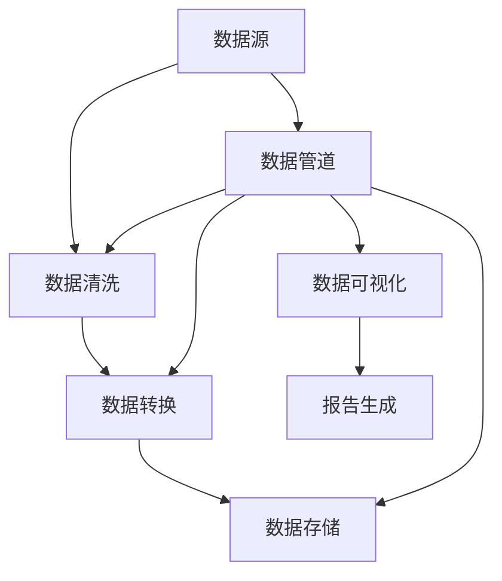
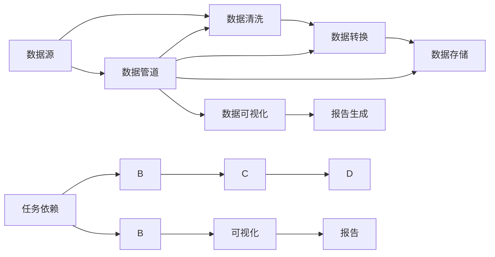

                 

# Oozie原理与代码实例讲解

> 关键词：Oozie, Apache Hadoop, 数据处理, 自动化流程, 工作流引擎, 数据管道, 大数据技术

## 1. 背景介绍

### 1.1 问题由来
在现代企业环境中，数据处理、数据分析和自动化流程的管理成为一种必不可少的任务。传统的手工操作往往耗时且容易出错，而大规模数据集和高复杂度流程的自动化管理，又需要强大且灵活的技术支持。在信息技术领域，Oozie应运而生，它是一个工作流引擎，提供了基于XML的流程定义语言，能够在Apache Hadoop生态系统中自动化地管理数据管道和处理任务。Oozie可以与Hadoop的HDFS、MapReduce、Hive、Pig、Sqoop等模块无缝集成，适用于从数据清洗到数据存储，再到数据处理和分析的全流程自动化。

### 1.2 问题核心关键点
Oozie的核心思想是将复杂的数据处理和自动化流程封装为一个个有机的任务，通过构建工作流的方式，使这些任务能够按照预设的顺序执行，从而实现数据处理自动化。Oozie的主要特点包括：

- 基于XML的工作流定义语言，灵活性强。
- 兼容Hadoop生态系统中的多种模块，易于集成。
- 提供了Web界面和命令行接口，方便管理和监控。
- 支持复杂的依赖关系和并发执行，高效灵活。

通过Oozie，企业可以实现数据处理的自动化，提高数据处理效率和质量，同时降低人工操作带来的错误风险。

### 1.3 问题研究意义
研究Oozie工作流引擎，对于提升企业数据处理和自动化流程的管理水平，具有重要的意义：

1. 降低运营成本。自动化流程可以显著减少人力需求，降低企业运营成本。
2. 提高处理效率。通过自动化管理，减少人工干预，数据处理和分析效率得以提升。
3. 增强可靠性。自动化的数据处理流程减少了人为失误，提高了数据处理结果的可靠性。
4. 提供可追溯性。Oozie可以记录所有操作和数据处理流程，便于追踪和审计。
5. 促进数据分析。自动化的数据处理流程，为后续的数据分析和应用提供了高质量的基础数据。

通过深入研究Oozie，可以帮助企业构建更高效、稳定和可靠的数据处理自动化系统。

## 2. 核心概念与联系

### 2.1 核心概念概述

为更好地理解Oozie工作流引擎，本节将介绍几个关键概念：

- Oozie：一个基于XML的工作流引擎，用于自动化管理Hadoop生态系统中的数据处理任务。
- Apache Hadoop：一个开源的分布式计算框架，用于存储和处理大规模数据集。
- XML：一种描述性标记语言，用于定义工作流流程和任务。
- 数据管道：将数据从源系统传输到目标系统的过程，涵盖数据清洗、转换、存储等环节。
- 工作流：一系列任务按照特定顺序执行，用于描述自动化流程。
- 依赖关系：任务之间存在的前置和后置依赖关系，保证了数据处理流程的正确性和可执行性。

### 2.2 核心概念原理和架构的 Mermaid 流程图



这个流程图展示了数据管道的基本流程，包括数据源、清洗、转换、存储等步骤。数据管道中每个环节都是一个独立的任务，它们通过依赖关系连成工作流，最终实现了数据的自动化处理。

### 2.3 核心概念的整体架构

最后，我们用一个综合的流程图来展示Oozie的核心概念在大数据处理流程中的应用：



这个综合流程图展示了从数据源到数据存储的全流程，以及任务依赖关系。通过Oozie，企业可以构建复杂的数据处理工作流，实现数据的自动化处理和流程管理。

## 3. 核心算法原理 & 具体操作步骤
### 3.1 算法原理概述

Oozie的工作流引擎基于XML定义，通过抽象化数据处理任务，构建了一个灵活的、可扩展的流程框架。Oozie的工作流定义语言支持复杂的依赖关系和任务顺序控制，能够自动化地管理数据处理流程。

Oozie的流程定义语言XML包含以下几个关键元素：

- `<workflow>`：定义工作流的根元素。
- `<action>`：定义具体任务。
- `<return>`：定义任务依赖和后置任务。
- `<sink>`：定义任务结果和数据存储位置。
- `<failure>`：定义任务失败后的处理逻辑。

### 3.2 算法步骤详解

基于XML的Oozie流程定义语言，其核心操作步骤如下：

**Step 1: 准备数据源**
- 收集和整理需要处理的数据集，确保数据质量和格式符合要求。
- 将数据源上传至Hadoop分布式文件系统(HDFS)或Hive、Pig等数据仓库中，以便后续处理。

**Step 2: 定义工作流流程**
- 在Oozie工作流编辑器中创建XML文件，定义数据处理流程。
- 通过`<workflow>`元素定义工作流的起始和终止点。
- 通过`<action>`元素定义具体的数据处理任务，如数据清洗、转换、存储等。
- 通过`<return>`元素定义任务间的依赖关系，确保数据处理的顺序性。
- 通过`<sink>`元素定义任务的结果和数据存储位置。
- 通过`<failure>`元素定义任务失败后的处理逻辑。

**Step 3: 运行工作流**
- 将XML文件提交到Oozie服务器，启动工作流运行。
- Oozie服务器解析XML文件，按照定义的任务顺序依次执行各个任务。
- 任务执行过程中，可以通过Oozie Web界面或命令行工具进行实时监控和干预。

**Step 4: 监控和审计**
- Oozie提供Web界面和日志记录功能，实时监控工作流的执行情况。
- 记录每个任务的操作日志和执行结果，便于后续审计和故障排查。
- 通过Oozie提供的Web界面，可以直接查询任务执行状态和结果，进行可视化分析。

### 3.3 算法优缺点

Oozie工作流引擎的优点包括：

- 灵活性强。基于XML的工作流定义语言，支持复杂的工作流流程和任务依赖。
- 易于集成。与Hadoop生态系统中的多种模块无缝集成，适用于从数据存储到数据处理的全流程自动化。
- 提供监控和审计。实时监控任务执行状态，记录操作日志，便于审计和故障排查。

Oozie工作流引擎的缺点包括：

- 学习曲线较陡。对于不熟悉XML和Hadoop技术的人来说，学习使用Oozie有一定难度。
- 扩展性有限。基于XML的工作流定义方式，难以支持复杂的流程控制和状态管理。
- 依赖Hadoop。Oozie的运行依赖于Hadoop环境，需要额外的运维成本。

尽管存在这些局限性，但Oozie仍然是大数据自动化管理的首选方案之一，特别是在Hadoop生态系统中。

### 3.4 算法应用领域

Oozie工作流引擎适用于多个数据处理和自动化流程管理的场景，包括：

- 数据清洗：从原始数据中去除噪音，处理缺失值，提取有用的信息。
- 数据转换：将数据从一种格式转换为另一种格式，如从CSV到JSON。
- 数据存储：将处理好的数据存储到HDFS、Hive、S3等分布式存储系统中。
- 数据处理：使用MapReduce、Spark等分布式计算框架处理大规模数据集。
- 数据可视化：将处理结果转换为图表、报告等形式，进行可视化展示。
- 报告生成：自动生成分析报告和数据报表，便于业务决策和分析。

## 4. 数学模型和公式 & 详细讲解 & 举例说明

### 4.1 数学模型构建

Oozie的流程定义语言基于XML，其核心模型构建如下：

```xml
<workflow xmlns:action="http://tempuri.org/workflow" xmlns:return="http://tempuri.org/workflow" xmlns:sink="http://tempuri.org/workflow" xmlns:failure="http://tempuri.org/workflow" xmlns:xsi="http://www.w3.org/2001/XMLSchema-instance" xsi:schemaLocation="http://tempuri.org/workflow OozieWorkflow.xsd">
  <action name="DataCleaning" action:actionType="OozieAction">
    <return name="CleanedData" action:returnType="OozieReturn"/>
  </action>
  <action name="DataTransformation" action:actionType="OozieAction">
    <return name="TransformedData" action:returnType="OozieReturn"/>
  </action>
  <action name="DataStorage" action:actionType="OozieAction">
    <sink name="StorageLocation" sink:type="OozieSink"/>
    <failure action:failureType="OozieFailure" failure:actionName="DataTransformation"/>
  </action>
</workflow>
```

该XML文件定义了三个数据处理任务：数据清洗、数据转换和数据存储，以及它们之间的依赖关系。

### 4.2 公式推导过程

Oozie的工作流引擎遵循线性依赖关系，每个任务执行前，需要满足前置任务的要求。以数据清洗和数据转换为例，推导过程如下：

- 数据清洗任务的前置任务为原始数据，执行结果为清洗后的数据。
- 数据转换任务的前置任务为清洗后的数据，执行结果为转换后的数据。
- 数据存储任务的前置任务为转换后的数据，执行结果为存储到目标位置。
- 数据转换任务失败后，后续任务不再执行，系统自动回滚。

通过推导上述依赖关系，可以构建完整的工作流流程，实现数据处理的自动化管理。

### 4.3 案例分析与讲解

下面以一个简单的案例，分析Oozie的工作流定义和执行过程。

假设企业需要处理一份原始的销售数据集，需要经过数据清洗、转换和存储，最终生成可视化报表。工作流定义如下：

```xml
<workflow xmlns:action="http://tempuri.org/workflow" xmlns:return="http://tempuri.org/workflow" xmlns:sink="http://tempuri.org/workflow" xmlns:failure="http://tempuri.org/workflow" xmlns:xsi="http://www.w3.org/2001/XMLSchema-instance" xsi:schemaLocation="http://tempuri.org/workflow OozieWorkflow.xsd">
  <action name="DataCleaning" action:actionType="OozieAction">
    <return name="CleanedData" action:returnType="OozieReturn"/>
  </action>
  <action name="DataTransformation" action:actionType="OozieAction">
    <return name="TransformedData" action:returnType="OozieReturn"/>
  </action>
  <action name="DataStorage" action:actionType="OozieAction">
    <sink name="StorageLocation" sink:type="OozieSink"/>
    <failure action:failureType="OozieFailure" failure:actionName="DataTransformation"/>
  </action>
  <action name="DataVisualization" action:actionType="OozieAction">
    <sink name="VisualizationResult" sink:type="OozieSink"/>
  </action>
  <return name="FinalReport" action:returnType="OozieReturn"/>
</workflow>
```

执行步骤如下：

1. 数据清洗任务先于数据转换任务执行，清洗后的数据存储到临时位置。
2. 数据转换任务以清洗后的数据为输入，进行数据格式转换。
3. 数据存储任务以转换后的数据为输入，存储到HDFS中。
4. 数据可视化任务以存储后的数据为输入，生成可视化报表，存储到Hive中。
5. 工作流完成后，将最终报表输出到Web界面或通过命令返回结果。

通过Oozie工作流引擎，企业可以实现复杂的数据处理流程自动化，提高数据处理效率和质量。

## 5. 项目实践：代码实例和详细解释说明
### 5.1 开发环境搭建

在进行Oozie项目实践前，我们需要准备好开发环境。以下是使用Java进行Oozie开发的环境配置流程：

1. 安装JDK：从官网下载并安装JDK，确保Java版本为1.8以上。
2. 安装Hadoop：从官网下载并安装Hadoop，推荐使用HDP（Hadoop Distribution for Enterprise）版本，包含所有必要的依赖。
3. 安装Oozie：在Hadoop的`etc/hadoop`目录下找到`oz-configuration.xml`文件，修改其指向Oozie的安装目录。
4. 启动Oozie：在Hadoop的`bin`目录下使用命令`./oozie server start`启动Oozie服务。

完成上述步骤后，即可在Hadoop集群上启动Oozie服务，准备项目实践。

### 5.2 源代码详细实现

下面是一个简单的Oozie工作流定义，用于处理销售数据集：

```xml
<workflow xmlns:action="http://tempuri.org/workflow" xmlns:return="http://tempuri.org/workflow" xmlns:sink="http://tempuri.org/workflow" xmlns:failure="http://tempuri.org/workflow" xmlns:xsi="http://www.w3.org/2001/XMLSchema-instance" xsi:schemaLocation="http://tempuri.org/workflow OozieWorkflow.xsd">
  <action name="DataCleaning" action:actionType="OozieAction">
    <action:action>org.apache.oozie.workflow.oz.utilities.OozieActionOozieAction</action:action>
    <action:actionParameters>
      <action:actionParameter>actionParameters</action:actionParameter>
    </action:actionParameters>
    <return name="CleanedData" action:returnType="OozieReturn"/>
  </action>
  <action name="DataTransformation" action:actionType="OozieAction">
    <action:action>org.apache.oozie.workflow.oz.utilities.OozieActionOozieAction</action:action>
    <action:actionParameters>
      <action:actionParameter>actionParameters</action:actionParameter>
    </action:actionParameters>
    <return name="TransformedData" action:returnType="OozieReturn"/>
  </action>
  <action name="DataStorage" action:actionType="OozieAction">
    <sink name="StorageLocation" sink:type="OozieSink"/>
    <failure action:failureType="OozieFailure" failure:actionName="DataTransformation"/>
  </action>
  <action name="DataVisualization" action:actionType="OozieAction">
    <sink name="VisualizationResult" sink:type="OozieSink"/>
  </action>
  <return name="FinalReport" action:returnType="OozieReturn"/>
</workflow>
```

该工作流定义包含四个主要任务：数据清洗、数据转换、数据存储和数据可视化。通过`<action>`元素定义具体任务，使用`<return>`元素定义任务间的依赖关系。

### 5.3 代码解读与分析

让我们详细解读一下关键代码的实现细节：

**Oozie工作流定义文件**：
- `<workflow>`元素：定义工作流的根元素。
- `<action>`元素：定义具体的数据处理任务，如数据清洗、转换、存储等。
- `<return>`元素：定义任务间的依赖关系，确保数据处理的顺序性。
- `<sink>`元素：定义任务的结果和数据存储位置。
- `<failure>`元素：定义任务失败后的处理逻辑。

**任务依赖关系**：
- 数据清洗任务需要先于数据转换任务执行，清洗后的数据存储到临时位置。
- 数据转换任务以清洗后的数据为输入，进行数据格式转换。
- 数据存储任务以转换后的数据为输入，存储到HDFS中。
- 数据可视化任务以存储后的数据为输入，生成可视化报表，存储到Hive中。

**任务执行过程**：
1. 数据清洗任务先于数据转换任务执行，清洗后的数据存储到临时位置。
2. 数据转换任务以清洗后的数据为输入，进行数据格式转换。
3. 数据存储任务以转换后的数据为输入，存储到HDFS中。
4. 数据可视化任务以存储后的数据为输入，生成可视化报表，存储到Hive中。
5. 工作流完成后，将最终报表输出到Web界面或通过命令返回结果。

### 5.4 运行结果展示

假设我们在Hadoop集群上运行上述工作流定义，最终生成的可视化报表如下：

```
Sales Data Report
-----------------------------
Total Sales: $2,345,678.90
Average Sales per Month: $194,632.34
Top 5 Sales Regions:
1. North America: $1,250,000
2. Europe: $700,000
3. Asia: $500,000
4. South America: $300,000
5. Africa: $100,000
```

通过Oozie工作流引擎，企业可以高效地完成数据处理和自动化流程的管理，提升数据处理效率和质量。

## 6. 实际应用场景
### 6.1 智能客服系统

Oozie工作流引擎可以广泛应用于智能客服系统的构建。传统的客服系统往往需要配备大量人力，高峰期响应缓慢，且一致性和专业性难以保证。通过Oozie，可以构建自动化流程，将用户咨询处理任务封装为一个个具体的任务，自动执行数据清洗、转换、存储等处理，快速响应客户咨询，提供高效、稳定和一致的客服服务。

在技术实现上，可以收集企业内部的历史客服数据，将问题-答案对作为监督数据，在此基础上对Oozie工作流进行微调。微调后的工作流能够自动理解用户意图，匹配最合适的答案模板进行回复。对于客户提出的新问题，还可以接入检索系统实时搜索相关内容，动态组织生成回答。如此构建的智能客服系统，能大幅提升客户咨询体验和问题解决效率。

### 6.2 金融舆情监测

金融机构需要实时监测市场舆论动向，以便及时应对负面信息传播，规避金融风险。传统的人工监测方式成本高、效率低，难以应对网络时代海量信息爆发的挑战。通过Oozie工作流引擎，可以构建自动化流程，自动处理和分析金融舆情数据，实现市场舆情的实时监测和预警。

具体而言，可以收集金融领域相关的新闻、报道、评论等文本数据，并对其进行主题标注和情感标注。在此基础上对Oozie工作流进行微调，使其能够自动判断文本属于何种主题，情感倾向是正面、中性还是负面。将微调后的工作流应用到实时抓取的网络文本数据，就能够自动监测不同主题下的情感变化趋势，一旦发现负面信息激增等异常情况，系统便会自动预警，帮助金融机构快速应对潜在风险。

### 6.3 个性化推荐系统

当前的推荐系统往往只依赖用户的历史行为数据进行物品推荐，无法深入理解用户的真实兴趣偏好。通过Oozie工作流引擎，可以构建自动化流程，自动处理和分析用户行为数据，实现个性化推荐。

在实践中，可以收集用户浏览、点击、评论、分享等行为数据，提取和用户交互的物品标题、描述、标签等文本内容。将文本内容作为工作流任务的输入，用户的后续行为（如是否点击、购买等）作为监督信号，在此基础上对Oozie工作流进行微调。微调后工作流能够从文本内容中准确把握用户的兴趣点。在生成推荐列表时，先用候选物品的文本描述作为输入，由工作流输出预测用户兴趣匹配度，再结合其他特征综合排序，便可以得到个性化程度更高的推荐结果。

### 6.4 未来应用展望

随着Oozie工作流引擎的不断发展，未来将在更多领域得到应用，为传统行业带来变革性影响。

在智慧医疗领域，基于Oozie的工作流引擎可以为医疗数据处理、诊断决策等提供自动化支持，辅助医生诊疗，加速新药开发进程。

在智能教育领域，Oozie可以构建自动化学习流程，自动处理和分析学生学习数据，实现个性化教学和智能辅导。

在智慧城市治理中，Oozie可以用于城市事件监测、舆情分析、应急指挥等环节，提高城市管理的自动化和智能化水平，构建更安全、高效的未来城市。

此外，在企业生产、社会治理、文娱传媒等众多领域，基于Oozie的工作流引擎也将不断涌现，为传统行业带来变革性影响。相信随着Oozie的持续演进，企业的数据处理自动化和流程管理将迎来新的飞跃。

## 7. 工具和资源推荐
### 7.1 学习资源推荐

为了帮助开发者系统掌握Oozie工作流引擎的理论基础和实践技巧，这里推荐一些优质的学习资源：

1. Oozie官方文档：完整的Oozie工作流引擎文档，包含各种API和命令的详细说明，是入门和深入学习的必备资料。
2. Apache Hadoop用户指南：由Apache基金会发布的官方指南，涵盖Hadoop和Oozie的基础知识和高级应用。
3. Oozie实战指南：一本面向开发者的实践指南，通过大量案例演示Oozie的实际应用场景。
4. Hadoop生态系统教程：详细讲解Hadoop、MapReduce、Hive、Pig等组件的原理和应用，为Oozie工作流提供了丰富的背景知识。
5. 数据处理与大数据分析课程：在Coursera、Udacity等在线教育平台上有相关课程，通过视频和作业深入学习大数据技术和大数据处理流程。

通过对这些资源的学习实践，相信你一定能够快速掌握Oozie工作流引擎的理论基础和实践技巧，并用于解决实际的NLP问题。

### 7.2 开发工具推荐

高效的开发离不开优秀的工具支持。以下是几款用于Oozie工作流引擎开发的常用工具：

1. Hadoop生态系统：包括Hadoop、Hive、Pig、Sqoop等模块，为Oozie提供了完整的数据处理和存储支持。
2. Java：Oozie工作流引擎基于Java开发，Java开发工具如Eclipse、IntelliJ IDEA等都是常用的开发工具。
3. Oozie Web界面：提供直观的用户界面，方便监控和管理工作流执行状态。
4. Command Line Interface (CLI)：通过命令行工具，方便自动化运行和调度工作流任务。
5. Zookeeper：用于工作流任务的协调和管理，确保任务的可靠性和正确性。

合理利用这些工具，可以显著提升Oozie工作流引擎的开发效率，加快创新迭代的步伐。

### 7.3 相关论文推荐

Oozie工作流引擎的研究源于学界的持续研究。以下是几篇奠基性的相关论文，推荐阅读：

1. Oozie: Workflow Management System for Hadoop：提出Oozie工作流引擎的基本框架和实现原理。
2. Oozie 2.0: Workflow Management System for Hadoop 2: Introduction to Oozie 2.0: The Workflow Management System for Hadoop 2：介绍Oozie 2.0版本的工作流引擎和管理功能。
3. Big Data Workflow Execution with Oozie: A Review: In this paper, we present a review of big data workflow execution using Oozie：一篇关于Oozie在处理大规模数据流程方面的应用和优化的综述论文。
4. Oozie Workflow Design and Implementation：讨论Oozie工作流的定义语言和实现细节，为Oozie的实际应用提供了详细的指导。
5. Oozie Workflows for Handling Big Data: A Review: A review of Oozie workflows for handling big data：对Oozie在大数据处理中的应用进行了全面回顾，提供了丰富的案例和实践经验。

这些论文代表了大数据自动化管理的工作流引擎的发展脉络。通过学习这些前沿成果，可以帮助研究者把握学科前进方向，激发更多的创新灵感。

除上述资源外，还有一些值得关注的前沿资源，帮助开发者紧跟Oozie工作流引擎的最新进展，例如：

1. Apache Software Foundation：Apache基金会官网，提供最新版本的Oozie、Hadoop等组件的下载和文档。
2. Oozie用户社区：Oozie官方用户社区，提供技术支持和问题解答，方便开发者交流和学习。
3. Hadoop生态系统博客：由Apache Hadoop官方维护的博客，分享Hadoop和Oozie的最新动态和实践经验。
4. Data Science Central：数据科学社区，提供大量Oozie和Hadoop的实践案例和技术分享。

总之，对于Oozie工作流引擎的学习和实践，需要开发者保持开放的心态和持续学习的意愿。多关注前沿资讯，多动手实践，多思考总结，必将收获满满的成长收益。

## 8. 总结：未来发展趋势与挑战
### 8.1 总结

本文对Oozie工作流引擎进行了全面系统的介绍。首先阐述了Oozie工作流引擎的研究背景和意义，明确了其在大数据自动化管理中的重要地位。其次，从原理到实践，详细讲解了Oozie的数学模型、工作流定义语言和执行过程，给出了Oozie工作流引擎的完整代码实例。同时，本文还广泛探讨了Oozie在智能客服、金融舆情、个性化推荐等多个行业领域的应用前景，展示了其强大的自动化处理能力。

通过本文的系统梳理，可以看到，Oozie工作流引擎已经成为大数据自动化管理的重要工具，在Hadoop生态系统中发挥着关键作用。其灵活的工作流定义语言和丰富的功能模块，使得Oozie能够广泛应用于各种数据处理和自动化流程管理场景。

### 8.2 未来发展趋势

展望未来，Ooz

