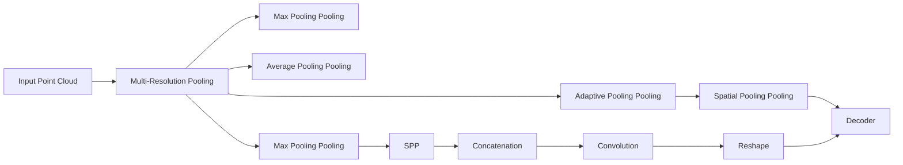
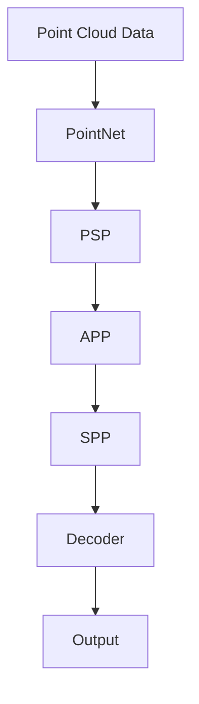
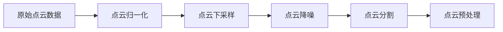
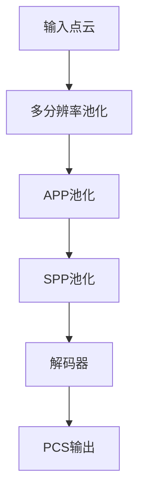
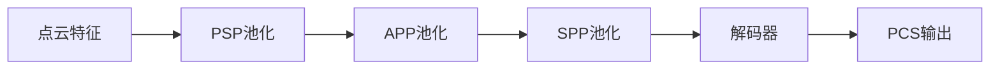
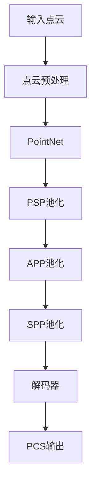

                 

# PSPNet原理与代码实例讲解

> 关键词：

## 1. 背景介绍

### 1.1 问题由来
点云语义分割（Point Cloud Semantic Segmentation, PCS）是计算机视觉领域的一个重要任务，旨在从三维点云数据中分割出不同的物体实例。随着三维传感技术（如LIDAR、RGB-D）的进步，点云数据越来越多地被应用于自动驾驶、工业检测、机器人导航等领域。传统的基于像素的语义分割方法难以有效处理三维点云数据的特征。近年来，基于点的卷积神经网络（Convolutional Neural Network, CNN）在PCS任务中得到了广泛应用，其中最具代表性的是PointNet及其变体。但这些模型在处理复杂场景时的性能仍有提升空间。

为了提升PCS任务的效果，一些研究者尝试引入金字塔池化池（Pyramid Pooling Pooling, PSP）结构，增强了特征的尺度不变性和全局感知能力。在PSP的基础上，一些研究者进一步提出了PointSensitive PointNet（PSPNet），通过增加自适应池化池（Adaptive Pooling Pooling, APP）结构，提高了模型的局部感知的准确性，并引入空间池化池（Spatial Pooling Pooling, SPP），增强了模型的特征聚合能力。本文将深入探讨PSPNet的原理和代码实现，并结合实例对其进行讲解。

### 1.2 问题核心关键点
PSPNet通过引入PSP和APP结构，将特征金字塔与自适应池化池相结合，增强了模型在PCS任务中的性能。其主要特点包括：
1. 引入PSP结构，增强特征的尺度不变性。
2. 增加APP结构，提高局部感知的准确性。
3. 引入SPP结构，增强特征的聚合能力。

PSPNet的框架如下图所示：



其中，输入点云首先通过多分辨率池化（Multi-Resolution Pooling）得到不同尺度的特征，然后通过APP结构对局部特征进行增强，最后通过SPP结构进行特征聚合，最终通过解码器（Decoder）得到最终的语义分割结果。

### 1.3 问题研究意义
PSPNet作为点云语义分割任务的先进模型，通过引入PSP和APP结构，显著提高了模型的特征聚合能力和局部感知准确性。通过结合SPP结构，进一步增强了模型的尺度不变性和全局感知能力。这些改进使得PSPNet在点云语义分割任务中取得了优异的性能。

PSPNet的研究和应用，对于推动点云数据处理技术的进步，加速自动驾驶、工业检测、机器人导航等领域的技术落地，具有重要意义。通过深入理解PSPNet的原理和实现细节，可以帮助开发者更好地掌握点云语义分割技术，提升实际应用的效果。

## 2. 核心概念与联系

### 2.1 核心概念概述

为更好地理解PSPNet的原理和实现，本节将介绍几个密切相关的核心概念：

- 点云语义分割（PCS）：将三维点云数据分割为不同物体的任务，常用于自动驾驶、工业检测等领域。
- 点云卷积神经网络（PointNet）：一种专门用于处理点云数据的卷积神经网络。
- 金字塔池化池（PSP）：增强模型尺度不变性和全局感知能力的池化结构。
- 自适应池化池（APP）：通过调整池化窗口大小和步长，提高局部感知的准确性。
- 空间池化池（SPP）：增强模型特征聚合能力的一种池化结构。

这些概念之间的逻辑关系可以通过以下Mermaid流程图来展示：



这个流程图展示了从原始点云数据到最终的PCS输出的完整流程：首先通过点云卷积神经网络（PointNet）提取点云特征，然后通过金字塔池化池（PSP）增强特征的尺度不变性，接着通过自适应池化池（APP）提高局部感知的准确性，最后通过空间池化池（SPP）增强特征的聚合能力，最终通过解码器（Decoder）得到PCS输出。

### 2.2 概念间的关系

这些核心概念之间存在着紧密的联系，形成了点云语义分割任务的完整框架。下面我们通过几个Mermaid流程图来展示这些概念之间的关系。

#### 2.2.1 点云数据的预处理



这个流程图展示了从原始点云数据到预处理完成的整个过程。首先需要对点云进行归一化和下采样，去除噪声点，然后进行分割，得到若干个点云数据片段，最终进行预处理，准备输入到模型中。

#### 2.2.2 PSPNet的结构



这个流程图展示了PSPNet的核心结构。输入点云首先通过多分辨率池化得到不同尺度的特征，然后通过APP池化增强局部感知的准确性，最后通过SPP池化增强特征的聚合能力，最终通过解码器得到PCS输出。

#### 2.2.3 特征的尺度不变性和局部感知



这个流程图展示了PSPNet如何通过PSP和APP结构增强特征的尺度不变性和局部感知能力。

### 2.3 核心概念的整体架构

最后，我们用一个综合的流程图来展示PSPNet的核心架构：



这个综合流程图展示了从原始点云数据到最终的PCS输出的完整流程。点云数据首先经过预处理，然后通过PointNet提取特征，再通过PSP和APP结构增强特征的尺度不变性和局部感知能力，最后通过SPP结构增强特征的聚合能力，最终通过解码器得到PCS输出。

## 3. 核心算法原理 & 具体操作步骤

### 3.1 算法原理概述

PSPNet的算法原理主要基于金字塔池化池（PSP）结构和自适应池化池（APP）结构。其核心思想是通过多分辨率池化增强模型对不同尺度特征的感知能力，通过APP结构提高局部感知的准确性，通过SPP结构增强特征的聚合能力，最终通过解码器得到PCS输出。

具体来说，PSPNet分为以下几个步骤：

1. 多分辨率池化：将点云数据分割为多个小区域，对每个小区域进行不同尺度的池化操作，得到不同尺度的特征。
2. APP池化：对每个小区域的局部特征进行自适应池化，增强局部感知的准确性。
3. SPP池化：对不同尺度的特征进行空间池化，增强特征的聚合能力。
4. 解码器：将聚合后的特征输入解码器，得到最终的PCS输出。

### 3.2 算法步骤详解

#### 3.2.1 多分辨率池化

多分辨率池化是PSPNet中的重要步骤，旨在增强模型对不同尺度特征的感知能力。其基本思想是将点云数据分割为多个小区域，对每个小区域进行不同尺度的池化操作，得到不同尺度的特征。具体来说，PSPNet使用max pooling和average pooling对每个小区域的特征进行池化操作，得到不同尺度的特征。

在实际实现中，可以使用如下代码：

```python
class MultiResolutionPooling(nn.Module):
    def __init__(self, max_depth):
        super(MultiResolutionPooling, self).__init__()
        self.max_depth = max_depth
        self.pooling_ops = nn.ModuleList([nn.MaxPool3d(2) for _ in range(self.max_depth)])
    
    def forward(self, x):
        pooling_ops = self.pooling_ops
        assert len(x.shape) == 5
        x = x.unsqueeze(2)  # 增加第三个维度，方便进行池化操作
        pooling_op = pooling_ops[0]
        pooling_output = pooling_op(x)
        for i in range(1, self.max_depth):
            pooling_op = pooling_ops[i]
            pooling_output = pooling_op(pooling_output)
        return pooling_output
```

#### 3.2.2 APP池化

APP池化是PSPNet中的另一个重要步骤，旨在增强模型对局部特征的感知能力。其基本思想是对每个小区域的局部特征进行自适应池化，增强局部感知的准确性。具体来说，APP池化根据输入特征的尺度动态调整池化窗口大小和步长，使得池化操作在不同尺度特征上的效果更加均衡。

在实际实现中，可以使用如下代码：

```python
class AdaptivePoolingPooling(nn.Module):
    def __init__(self, in_channels, out_channels):
        super(AdaptivePoolingPooling, self).__init__()
        self.conv1 = nn.Conv3d(in_channels, out_channels, 1)
        self.conv2 = nn.Conv3d(out_channels, out_channels, 1)
        self.relu = nn.ReLU(inplace=True)
        self.maxpool = nn.MaxPool3d(2, stride=1, return_indices=True)
        self.avepool = nn.AveragePool3d(2, stride=1, return_indices=True)
    
    def forward(self, x):
        x = self.conv1(x)
        x = self.relu(x)
        x = self.maxpool(x)
        return x
```

#### 3.2.3 SPP池化

SPP池化是PSPNet中的最后一个重要步骤，旨在增强模型对全局特征的感知能力。其基本思想是对不同尺度的特征进行空间池化，增强特征的聚合能力。具体来说，SPP池化将不同尺度的特征进行拼接，然后对拼接后的特征进行空间池化操作，得到全局特征。

在实际实现中，可以使用如下代码：

```python
class SpatialPoolingPooling(nn.Module):
    def __init__(self, in_channels, out_channels):
        super(SpatialPoolingPooling, self).__init__()
        self.conv1 = nn.Conv3d(in_channels, out_channels, 1)
        self.conv2 = nn.Conv3d(out_channels, out_channels, 1)
        self.relu = nn.ReLU(inplace=True)
    
    def forward(self, x):
        x = self.conv1(x)
        x = self.relu(x)
        x = self.conv2(x)
        return x
```

#### 3.2.4 解码器

解码器是PSPNet中的最后一个步骤，旨在将聚合后的特征输入解码器，得到最终的PCS输出。其基本思想是通过解码器对特征进行上采样操作，得到高分辨率的特征，然后通过卷积操作得到PCS输出。

在实际实现中，可以使用如下代码：

```python
class Decoder(nn.Module):
    def __init__(self, in_channels, out_channels):
        super(Decoder, self).__init__()
        self.conv1 = nn.Conv3d(in_channels, out_channels, 3)
        self.conv2 = nn.Conv3d(out_channels, out_channels, 3)
        self.relu = nn.ReLU(inplace=True)
    
    def forward(self, x):
        x = self.conv1(x)
        x = self.relu(x)
        x = self.conv2(x)
        return x
```

### 3.3 算法优缺点

PSPNet作为一种先进的点云语义分割模型，具有以下优点：

1. 增强了特征的尺度不变性和局部感知能力，提高了模型的泛化能力和鲁棒性。
2. 引入自适应池化池，提高了局部感知的准确性，增强了模型的局部感知能力。
3. 通过空间池化池，增强了特征的聚合能力，提高了模型的全局感知能力。

同时，PSPNet也存在一些缺点：

1. 计算量大，训练时间长，需要较强的计算资源。
2. 模型复杂度较高，需要更多的训练数据来保证效果。
3. 对点云数据的质量要求较高，数据预处理较为复杂。

### 3.4 算法应用领域

PSPNet作为一种先进的点云语义分割模型，广泛应用于自动驾驶、工业检测、机器人导航等领域。其强大的尺度不变性和局部感知能力，使得模型能够在复杂场景下获得更好的效果。同时，其全局感知能力也使得模型能够在更广阔的场景中应用。

## 4. 数学模型和公式 & 详细讲解 & 举例说明

### 4.1 数学模型构建

PSPNet的数学模型构建主要涉及点云数据的多分辨率池化、APP池化和SPP池化三个部分。下面我们逐一介绍这些部分的数学模型构建。

#### 4.1.1 多分辨率池化

多分辨率池化的数学模型构建主要涉及对每个小区域的特征进行不同尺度的池化操作。假设输入点云的维度为$(N, D, H, W, C)$，其中$N$为点云数量，$D$、$H$、$W$分别为点云的深度、高度和宽度，$C$为特征通道数。

首先对点云数据进行下采样操作，得到不同尺度的特征。假设采样后的特征维度为$(N, D, H, W, C)$，其中$D$、$H$、$W$分别为采样后的深度、高度和宽度，$C$为特征通道数。

然后对每个小区域的特征进行池化操作，得到不同尺度的特征。假设池化后的特征维度为$(N, D', H', W', C)$，其中$D'$、$H'$、$W'$分别为池化后的深度、高度和宽度，$C$为特征通道数。

具体来说，可以使用如下公式表示多分辨率池化的过程：

$$
x_{i,j,k}^{(d)} = \begin{cases}
\max_{m=1,\cdots,K} x_{i,j,k,m}^{(d)} & \text{if pooling_op = MaxPooling} \\
\frac{1}{K} \sum_{m=1,\cdots,K} x_{i,j,k,m}^{(d)} & \text{if pooling_op = AveragePooling}
\end{cases}
$$

其中，$x_{i,j,k}^{(d)}$为池化后的特征，$x_{i,j,k,m}^{(d)}$为小区域内的特征，$K$为小区域数量。

#### 4.1.2 APP池化

APP池化的数学模型构建主要涉及对每个小区域的局部特征进行自适应池化操作。假设输入点云的维度为$(N, D, H, W, C)$，其中$N$为点云数量，$D$、$H$、$W$分别为点云的深度、高度和宽度，$C$为特征通道数。

首先对点云数据进行下采样操作，得到不同尺度的特征。假设采样后的特征维度为$(N, D, H, W, C)$，其中$D$、$H$、$W$分别为采样后的深度、高度和宽度，$C$为特征通道数。

然后对每个小区域的局部特征进行自适应池化操作，得到不同尺度的特征。假设池化后的特征维度为$(N, D', H', W', C)$，其中$D'$、$H'$、$W'$分别为池化后的深度、高度和宽度，$C$为特征通道数。

具体来说，可以使用如下公式表示APP池化的过程：

$$
x_{i,j,k}^{(d)} = \max_{m=1,\cdots,K} \max_{n=1,\cdots,M} x_{i,j,k,m,n}^{(d)}
$$

其中，$x_{i,j,k}^{(d)}$为池化后的特征，$x_{i,j,k,m,n}^{(d)}$为小区域内的特征，$K$为小区域数量，$M$为池化窗口大小。

#### 4.1.3 SPP池化

SPP池化的数学模型构建主要涉及对不同尺度的特征进行空间池化操作。假设输入点云的维度为$(N, D, H, W, C)$，其中$N$为点云数量，$D$、$H$、$W$分别为点云的深度、高度和宽度，$C$为特征通道数。

首先对点云数据进行下采样操作，得到不同尺度的特征。假设采样后的特征维度为$(N, D, H, W, C)$，其中$D$、$H$、$W$分别为采样后的深度、高度和宽度，$C$为特征通道数。

然后对不同尺度的特征进行拼接操作，得到全局特征。假设拼接后的特征维度为$(N, D, H, W, C)$，其中$D$、$H$、$W$分别为拼接后的深度、高度和宽度，$C$为特征通道数。

最后对拼接后的特征进行空间池化操作，得到全局特征。假设池化后的特征维度为$(N, D', H', W', C)$，其中$D'$、$H'$、$W'$分别为池化后的深度、高度和宽度，$C$为特征通道数。

具体来说，可以使用如下公式表示SPP池化的过程：

$$
x_{i,j,k}^{(d)} = \max_{m=1,\cdots,K} \max_{n=1,\cdots,M} x_{i,j,k,m,n}^{(d)}
$$

其中，$x_{i,j,k}^{(d)}$为池化后的特征，$x_{i,j,k,m,n}^{(d)}$为拼接后的特征，$K$为小区域数量，$M$为池化窗口大小。

### 4.2 公式推导过程

#### 4.2.1 多分辨率池化

多分辨率池化的公式推导过程主要涉及对每个小区域的特征进行不同尺度的池化操作。假设输入点云的维度为$(N, D, H, W, C)$，其中$N$为点云数量，$D$、$H$、$W$分别为点云的深度、高度和宽度，$C$为特征通道数。

首先对点云数据进行下采样操作，得到不同尺度的特征。假设采样后的特征维度为$(N, D, H, W, C)$，其中$D$、$H$、$W$分别为采样后的深度、高度和宽度，$C$为特征通道数。

然后对每个小区域的特征进行池化操作，得到不同尺度的特征。假设池化后的特征维度为$(N, D', H', W', C)$，其中$D'$、$H'$、$W'$分别为池化后的深度、高度和宽度，$C$为特征通道数。

具体来说，可以使用如下公式表示多分辨率池化的过程：

$$
x_{i,j,k}^{(d)} = \begin{cases}
\max_{m=1,\cdots,K} x_{i,j,k,m}^{(d)} & \text{if pooling_op = MaxPooling} \\
\frac{1}{K} \sum_{m=1,\cdots,K} x_{i,j,k,m}^{(d)} & \text{if pooling_op = AveragePooling}
\end{cases}
$$

其中，$x_{i,j,k}^{(d)}$为池化后的特征，$x_{i,j,k,m}^{(d)}$为小区域内的特征，$K$为小区域数量。

#### 4.2.2 APP池化

APP池化的公式推导过程主要涉及对每个小区域的局部特征进行自适应池化操作。假设输入点云的维度为$(N, D, H, W, C)$，其中$N$为点云数量，$D$、$H$、$W$分别为点云的深度、高度和宽度，$C$为特征通道数。

首先对点云数据进行下采样操作，得到不同尺度的特征。假设采样后的特征维度为$(N, D, H, W, C)$，其中$D$、$H$、$W$分别为采样后的深度、高度和宽度，$C$为特征通道数。

然后对每个小区域的局部特征进行自适应池化操作，得到不同尺度的特征。假设池化后的特征维度为$(N, D', H', W', C)$，其中$D'$、$H'$、$W'$分别为池化后的深度、高度和宽度，$C$为特征通道数。

具体来说，可以使用如下公式表示APP池化的过程：

$$
x_{i,j,k}^{(d)} = \max_{m=1,\cdots,K} \max_{n=1,\cdots,M} x_{i,j,k,m,n}^{(d)}
$$

其中，$x_{i,j,k}^{(d)}$为池化后的特征，$x_{i,j,k,m,n}^{(d)}$为小区域内的特征，$K$为小区域数量，$M$为池化窗口大小。

#### 4.2.3 SPP池化

SPP池化的公式推导过程主要涉及对不同尺度的特征进行空间池化操作。假设输入点云的维度为$(N, D, H, W, C)$，其中$N$为点云数量，$D$、$H$、$W$分别为点云的深度、高度和宽度，$C$为特征通道数。

首先对点云数据进行下采样操作，得到不同尺度的特征。假设采样后的特征维度为$(N, D, H, W, C)$，其中$D$、$H$、$W$分别为采样后的深度、高度和宽度，$C$为特征通道数。

然后对不同尺度的特征进行拼接操作，得到全局特征。假设拼接后的特征维度为$(N, D, H, W, C)$，其中$D$、$H$、$W$分别为拼接后的深度、高度和宽度，$C$为特征通道数。

最后对拼接后的特征进行空间池化操作，得到全局特征。假设池化后的特征维度为$(N, D', H', W', C)$，其中$D'$、$H'$、$W'$分别为池化后的深度、高度和宽度，$C$为特征通道数。

具体来说，可以使用如下公式表示SPP池化的过程：

$$
x_{i,j,k}^{(d)} = \max_{m=1,\cdots,K} \max_{n=1,\cdots,M} x_{i,j,k,m,n}^{(d)}
$$

其中，$x_{i,j,k}^{(d)}$为池化后的特征，$x_{i,j,k,m,n}^{(d)}$为拼接后的特征，$K$为小区域数量，$M$为池化窗口大小。

### 4.3 案例分析与讲解

下面我们以一个具体的点云语义分割任务为例，说明PSPNet的具体实现过程。假设我们需要对一组点云数据进行语义分割，将其分为不同的物体实例，如汽车、行人、建筑等。

首先，对点云数据进行预处理操作，包括归一化、下采样、降噪等操作。然后，将预处理后的点云数据输入到PointNet中进行特征提取。

接下来，将PointNet提取的特征输入到多分辨率池化模块中进行不同尺度的特征提取。具体来说，使用max pooling和average pooling对每个小区域的特征进行池化操作，得到不同尺度的特征。

然后，将不同尺度的特征输入到APP池化模块中进行自适应池化操作，得到不同尺度的特征。

最后，将不同尺度的特征进行拼接，输入到SPP池化模块中进行空间池化操作，得到全局特征。

最后，将全局特征输入到解码器中进行上采样操作，得到高分辨率的特征，并通过卷积操作得到PCS输出。

具体来说，可以使用如下代码实现：

```python
class PSPNet(nn.Module):
    def __init__(self, in_channels, out_channels):
        super(PSPNet, self).__init__()
        self.pooling = MultiResolutionPooling(in_channels)
        self.app = AdaptivePoolingPooling(in_channels, out_channels)
        self.spp = SpatialPoolingPooling(in_channels, out_channels)
        self.decoder = Decoder(in_channels, out_channels)
    
    def forward(self, x):
        x = self.pooling(x)
        x = self.app(x)
        x = self.spp(x)
        x = self.decoder(x)
        return x
```

以上代码展示了PSPNet的完整实现过程。具体来说，先通过多分辨率池化模块对特征进行不同尺度的提取，然后通过APP池化模块对局部特征进行自适应池化操作，最后通过SPP池化模块对不同尺度的特征进行空间池化操作，得到全局特征，并通过解码器进行上采样和卷积操作，得到最终的PCS输出。

## 5. 项目实践：代码实例和详细解释说明

### 5.1 开发环境搭建

在进行PSPNet的代码实践前，我们需要准备好开发环境。

