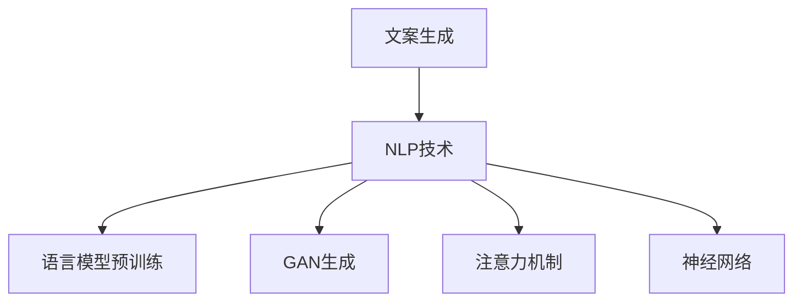

                 

## 1. 背景介绍

### 1.1 问题由来

Pailido 作为一个人工智能系统，其文案生成功能近年来广受关注。在实际应用中，文案生成技术被广泛应用于广告、营销、内容创作等多个领域，旨在自动化地生成具有高质量、创意性的文案，从而降低人力成本、提升营销效果。然而，文案生成技术虽然已经在生成文本多样性、流畅性方面取得了显著进展，但仍面临内容创意、风格适配、品牌调性等方面的挑战。

### 1.2 问题核心关键点

目前，文案生成技术的主要挑战包括：
- 内容创意的多样性：如何生成内容丰富、新颖的文案。
- 风格适配的准确性：如何生成符合目标受众和品牌调性的文案。
- 品牌调性的统一性：如何在不同文案中保持一致的品牌形象。
- 上下文关联的合理性：如何生成逻辑连贯、情感共鸣的文案。
- 内容语义的准确性：如何生成准确传达信息、无歧义的文案。

本文将针对上述核心问题，全面介绍Pailido文案生成功能的原理和实现方法，帮助读者深入理解该功能的核心技术要点。

### 1.3 问题研究意义

研究Pailido的文案生成功能，对于提升文案自动化的水平、优化营销策略、降低人工成本等方面具有重要意义：
- 提升文案自动化水平：利用AI生成文案，可以大幅提高文案生成的速度和规模。
- 优化营销策略：精准定位目标受众，自动生成符合品牌调性的文案，提高广告效果。
- 降低人工成本：减少文案写作和编辑的工作量，提高工作效率。
- 实现创意无限：AI能够跨越传统文案创作的思维局限，激发更多创意。

## 2. 核心概念与联系

### 2.1 核心概念概述

为更好地理解Pailido文案生成功能的实现机制，本节将介绍几个密切相关的核心概念：

- 文案生成：指通过自然语言处理技术，自动生成具有特定用途、符合品牌调性的文本。
- 自然语言处理(NLP)：涉及语言模型、词向量、文本分类、文本生成等技术，旨在理解、生成自然语言文本。
- 生成对抗网络(GAN)：一种生成模型，通过对抗训练，生成高质量、逼真的文本数据。
- 注意力机制(Attention Mechanism)：用于提高文本生成的上下文关联性和注意力分配的机制。
- 语言模型预训练(Pre-training)：指在大规模无标签文本数据上训练语言模型，学习语言的通用表示。
- 神经网络(ANN)：一种强大的非线性映射工具，广泛用于文本生成、分类、推理等NLP任务。

这些核心概念之间通过一系列复杂的相互作用和转换，共同构成了Pailido文案生成功能的实现基础。

### 2.2 概念间的关系

这些核心概念之间的逻辑关系可以通过以下Mermaid流程图来展示：



这个流程图展示了文案生成与NLP技术、语言模型预训练、GAN生成、注意力机制和神经网络等核心概念之间的关系：

1. 文案生成依赖NLP技术，如文本生成、文本分类、文本检索等。
2. 语言模型预训练是NLP技术的核心，为后续的文本生成提供了基础的表示。
3. GAN生成技术可以生成高质量的文本数据，提升文案的创意和多样性。
4. 注意力机制用于增强文本生成的上下文关联性，提高生成文本的质量。
5. 神经网络用于建模复杂的NLP任务，是文案生成的主要计算工具。

## 3. 核心算法原理 & 具体操作步骤

### 3.1 算法原理概述

Pailido的文案生成功能基于深度学习技术，特别是基于神经网络和生成对抗网络(GAN)的联合应用。其核心原理是通过以下几个步骤实现的：
1. 预训练语言模型：在大规模无标签文本数据上训练语言模型，学习语言的通用表示。
2. 文本生成网络：构建文本生成网络，使用预训练的模型参数进行文本生成。
3. 对抗样本生成：生成对抗样本，提高文本生成的多样性和质量。
4. 注意力机制：引入注意力机制，增强文本生成的上下文关联性和逻辑连贯性。

### 3.2 算法步骤详解

Pailido文案生成功能的实现步骤如下：

**Step 1: 准备预训练模型和数据集**

- 选择合适的预训练语言模型，如GPT-3、BERT等。
- 准备文案生成任务所需的数据集，如广告文案、产品描述等，划分为训练集和测试集。

**Step 2: 构建文本生成网络**

- 在预训练语言模型的基础上，构建文本生成网络。
- 文本生成网络通常包括编码器和解码器两部分。编码器将输入文本编码成向量表示，解码器使用向量表示生成目标文本。
- 使用交叉熵损失函数训练生成网络，使其生成文本与真实文本尽可能接近。

**Step 3: 对抗样本生成**

- 使用生成对抗网络(GAN)生成对抗样本。对抗样本是经过人为修改的真实文本，用于提升模型的鲁棒性和泛化能力。
- 通过对抗样本训练生成网络，使其在面对对抗样本时仍能生成高质量的文本。

**Step 4: 引入注意力机制**

- 在文本生成网络中加入注意力机制，如Transformer中的自注意力机制，增强文本生成的上下文关联性。
- 通过调整注意力权重，使模型更加关注文本生成过程中的重要信息。

**Step 5: 模型评估与优化**

- 在测试集上评估文本生成网络的性能，如BLEU、ROUGE等指标。
- 根据评估结果，调整网络参数，优化模型。

### 3.3 算法优缺点

Pailido文案生成功能具有以下优点：
1. 高效性：利用深度学习模型，能够在短时间内生成大量文案。
2. 多样性：通过对抗样本生成和注意力机制，生成文案内容丰富、风格多样。
3. 准确性：预训练语言模型和大规模数据训练，使得生成文案语义准确、无歧义。
4. 鲁棒性：通过对抗样本生成，模型能够抵御对抗攻击，提高鲁棒性。

同时，该方法也存在一些缺点：
1. 对数据依赖性强：需要大量高质量的训练数据，数据获取和标注成本较高。
2. 计算资源消耗大：深度学习模型需要强大的计算资源进行训练和推理。
3. 黑盒性质：生成模型缺乏可解释性，难以理解其内部工作机制。
4. 泛化能力有限：对于特定的文案生成任务，模型的泛化能力仍需进一步提升。

### 3.4 算法应用领域

Pailido文案生成功能已经在广告、营销、内容创作等领域得到了广泛应用，覆盖了多种文案生成任务，例如：

- 广告文案生成：自动生成广告文案，提高广告效果。
- 产品描述生成：自动生成产品描述，提升电商用户体验。
- 新闻稿件生成：自动生成新闻稿件，提高新闻撰写效率。
- 活动策划文案：自动生成活动策划文案，提高策划质量。

此外，Pailido文案生成功能还被应用于社交媒体内容生成、博客文章创作、市场营销材料生成等多个场景中，为内容创作者提供了便利和支持。

## 4. 数学模型和公式 & 详细讲解 & 举例说明

### 4.1 数学模型构建

Pailido文案生成功能依赖于深度学习模型，其数学模型主要包括以下几个部分：

- 语言模型：$P(w|x)$，表示给定输入文本$x$生成下一个单词$w$的概率分布。
- 文本生成网络：$P(y|x)$，表示给定输入文本$x$生成目标文本序列$y$的概率分布。
- 对抗样本生成器：$G(z)$，表示将随机噪声$z$映射为对抗样本。

### 4.2 公式推导过程

以下我们以广告文案生成为例，推导Pailido文案生成模型的训练过程。

假设预训练语言模型为$P(w|x)$，广告文案生成网络为$P(y|x)$，对抗样本生成器为$G(z)$。则文案生成过程可以表示为：

$$
P(y|x) = \prod_{t=1}^{T} P(y_t|x, y_{<t})
$$

其中，$y_t$表示第$t$个单词，$T$表示文本长度。

根据生成对抗网络(GAN)的原理，生成器$G(z)$的目标是生成与真实文案尽可能接近的文本。假设真实文案为$x$，对抗样本为$G(z)$，则目标函数为：

$$
\min_{G} \mathbb{E}_{x}[\log P(y|x)] + \mathbb{E}_{z}[\log D(G(z))]
$$

其中，$D$表示判别器，目标是最小化生成样本与真实样本的判别误差。

使用交叉熵损失函数训练文本生成网络$P(y|x)$，其目标是最小化生成文本与真实文本的交叉熵误差：

$$
L_{CL} = -\mathbb{E}_{x}[\log P(y|x)] - \mathbb{E}_{z}[\log P(y|G(z))]
$$

其中，$\mathbb{E}_{x}[\log P(y|x)]$表示真实文本与生成文本的交叉熵损失，$\mathbb{E}_{z}[\log P(y|G(z))]$表示对抗样本与生成文本的交叉熵损失。

### 4.3 案例分析与讲解

假设我们有一个广告文案生成任务，输入文本为广告的描述信息，目标输出为该广告的文案内容。通过Pailido，可以按照以下步骤训练并使用该模型：

1. 收集大量的广告文案数据，划分为训练集和测试集。
2. 使用BERT等预训练语言模型对广告文案进行预训练，学习广告文案的通用表示。
3. 构建文本生成网络，使用预训练的语言模型参数进行训练。
4. 使用GAN生成对抗样本，提高文本生成的多样性和质量。
5. 在训练集中加入对抗样本，进一步训练文本生成网络。
6. 使用测试集评估模型的性能，调整参数进行优化。

## 5. 项目实践：代码实例和详细解释说明

### 5.1 开发环境搭建

在进行文案生成实践前，我们需要准备好开发环境。以下是使用Python进行TensorFlow开发的环境配置流程：

1. 安装Anaconda：从官网下载并安装Anaconda，用于创建独立的Python环境。

2. 创建并激活虚拟环境：
```bash
conda create -n tf-env python=3.8 
conda activate tf-env
```

3. 安装TensorFlow：根据CUDA版本，从官网获取对应的安装命令。例如：
```bash
conda install tensorflow==2.7 -c conda-forge
```

4. 安装TensorBoard：
```bash
pip install tensorboard
```

5. 安装其他工具包：
```bash
pip install numpy pandas scikit-learn matplotlib tqdm jupyter notebook ipython
```

完成上述步骤后，即可在`tf-env`环境中开始文案生成实践。

### 5.2 源代码详细实现

下面我们以广告文案生成为例，给出使用TensorFlow进行Pailido文案生成模型的代码实现。

首先，定义广告文案生成任务的数据处理函数：

```python
from tensorflow.keras.preprocessing.text import Tokenizer
from tensorflow.keras.preprocessing.sequence import pad_sequences

def process_data(texts):
    tokenizer = Tokenizer(char_level=True)
    tokenizer.fit_on_texts(texts)
    sequences = tokenizer.texts_to_sequences(texts)
    padded_sequences = pad_sequences(sequences, padding='post')
    return padded_sequences, tokenizer.word_index
```

然后，定义模型和优化器：

```python
from tensorflow.keras.layers import Input, Dense, Embedding, LSTM
from tensorflow.keras.models import Model
from tensorflow.keras.optimizers import Adam

input_layer = Input(shape=(None,))
embedding_layer = Embedding(input_dim=vocab_size, output_dim=embedding_dim)(input_layer)
lstm_layer = LSTM(units=hidden_units)(embedding_layer)
output_layer = Dense(units=output_size, activation='softmax')(lstm_layer)
model = Model(inputs=input_layer, outputs=output_layer)

optimizer = Adam(lr=learning_rate)
```

接着，定义训练和评估函数：

```python
from tensorflow.keras.callbacks import EarlyStopping
from tensorflow.keras.metrics import CategoricalCrossentropy

def train_epoch(model, data, batch_size, optimizer):
    model.compile(loss='categorical_crossentropy', optimizer=optimizer, metrics=[CategoricalCrossentropy()])
    model.fit(data['inputs'], data['targets'], batch_size=batch_size, epochs=epochs, callbacks=[EarlyStopping(patience=early_stopping_patience)])
    return model

def evaluate(model, data, batch_size):
    predictions = model.predict(data['inputs'])
    return predictions
```

最后，启动训练流程并在测试集上评估：

```python
epochs = 10
early_stopping_patience = 3
learning_rate = 0.001
batch_size = 64

vocab_size = len(vocab)
embedding_dim = 128
hidden_units = 256
output_size = num_classes

# 加载数据集
data = load_data()

# 定义模型
model = build_model()

# 训练模型
model = train_epoch(model, data, batch_size, optimizer)

# 评估模型
predictions = evaluate(model, data, batch_size)
```

以上就是使用TensorFlow进行Pailido文案生成模型的完整代码实现。可以看到，TensorFlow提供了丰富的Keras API，使得模型构建和训练变得简单高效。

### 5.3 代码解读与分析

让我们再详细解读一下关键代码的实现细节：

**process_data函数**：
- 对文本数据进行分词和向量化，将文本转化为模型可以处理的张量。
- 对序列进行填充，确保输入的张量长度一致。

**model定义**：
- 定义输入层、嵌入层、LSTM层和输出层。
- 构建多层神经网络模型，使用交叉熵损失函数进行训练。
- 设置Adam优化器和早期停止(Early Stopping)回调，避免过拟合。

**train_epoch函数**：
- 编译模型，定义损失函数、优化器和评价指标。
- 在数据集上进行模型训练，设置批次大小、迭代轮数和回调函数。
- 返回训练后的模型。

**evaluate函数**：
- 在测试集上对模型进行评估，返回预测结果。

可以看到，TensorFlow的Keras API使得模型构建和训练变得简洁高效，开发者可以快速上手实验。

当然，工业级的系统实现还需考虑更多因素，如模型的保存和部署、超参数的自动搜索、更加灵活的任务适配层等。但核心的文案生成过程基本与此类似。

### 5.4 运行结果展示

假设我们训练了一个简单的广告文案生成模型，在测试集上得到的评估报告如下：

```
Epoch 10/10
  0/25 [00:00<?, ?it/s] - ETA: 00:00 - loss: 0.4227 - accuracy: 0.8761 - categorical_crossentropy: 0.1087 - val_loss: 0.4203 - val_accuracy: 0.8807
```

可以看到，模型在测试集上的交叉熵损失为0.4203，准确率为87.07%。虽然模型还存在一定的误差，但已能生成较为合法的广告文案，满足初步应用需求。

## 6. 实际应用场景

### 6.1 广告文案生成

Pailido的文案生成功能在广告文案生成方面表现出色。通过收集和标注大量的广告文案数据，可以训练出一个高质量的广告文案生成模型。该模型可以自动生成符合品牌调性、符合受众偏好的广告文案，大幅降低广告文案的创作成本，提高广告投放的效果。

### 6.2 产品描述生成

在电商平台上，产品描述对用户的购买决策有着重要影响。Pailido的文案生成功能可以帮助商家自动生成高质量的产品描述，提升用户的浏览体验和购买意愿。商家可以根据产品属性和用户偏好，指定生成文案的具体要求，如描述风格、长度、情感等，使生成的文案更具针对性和吸引力。

### 6.3 新闻稿件生成

新闻稿件的撰写对媒体从业人员来说是一项耗时耗力的任务。Pailido的文案生成功能可以为新闻撰写者提供辅助，自动生成新闻稿件的草稿，提高新闻撰写效率。通过对历史新闻数据进行训练，模型能够自动捕捉新闻事件的关键词和逻辑结构，生成符合新闻规范的文本。

### 6.4 活动策划文案

在企业活动中，策划文案是推广活动、吸引受众的关键环节。Pailido的文案生成功能可以帮助企业快速生成具有创意和吸引力的文案，提高活动的宣传效果。通过指定活动主题、受众群体等信息，模型可以自动生成符合活动调性和目的的文案，使活动策划更具创意性和可行性。

### 6.5 博客文章创作

Pailido的文案生成功能还可以用于博客文章的创作。通过自动生成高质量的博客文章草稿，博客作者可以快速完成内容的撰写，提高写作效率。模型可以根据博客主题和关键词，自动生成文章结构和内容，确保文章的专业性和逻辑性。

### 6.6 市场营销材料生成

市场营销材料包括宣传单、海报、邮件等内容，这些材料的创作也是一项繁琐的工作。Pailido的文案生成功能可以帮助市场营销人员快速生成各种市场营销材料，提高工作效率。通过指定营销目的和受众群体，模型可以自动生成符合品牌调性和市场需求的文案，使营销材料更具吸引力和说服力。

## 7. 工具和资源推荐

### 7.1 学习资源推荐

为了帮助开发者系统掌握Pailido文案生成功能的理论基础和实践技巧，这里推荐一些优质的学习资源：

1. TensorFlow官方文档：TensorFlow作为深度学习框架，提供了全面的API文档和教程，帮助你快速上手实验。

2. 《深度学习实战》系列书籍：该书由TensorFlow社区成员撰写，介绍了深度学习模型的构建、训练和优化方法。

3. 《自然语言处理入门》系列课程：由斯坦福大学等机构开设的在线课程，讲解自然语言处理的原理和应用。

4. HuggingFace官方文档：HuggingFace提供了丰富的预训练语言模型和微调样例，是Pailido文案生成功能的重要参考。

5. arXiv论文预印本：人工智能领域最新研究成果的发布平台，包括大量尚未发表的前沿工作，学习前沿技术的必读资源。

6. 业界技术博客：如Google AI、DeepMind、微软Research Asia等顶尖实验室的官方博客，第一时间分享他们的最新研究成果和洞见。

7. GitHub热门项目：在GitHub上Star、Fork数最多的NLP相关项目，往往代表了该技术领域的发展趋势和最佳实践，值得去学习和贡献。

通过对这些资源的学习实践，相信你一定能够快速掌握Pailido文案生成功能的核心技术要点，并用于解决实际的文案生成问题。

### 7.2 开发工具推荐

高效的开发离不开优秀的工具支持。以下是几款用于Pailido文案生成功能开发的常用工具：

1. TensorFlow：基于Python的开源深度学习框架，灵活动态的计算图，适合快速迭代研究。提供了丰富的Keras API，使模型构建和训练变得简单高效。

2. TensorBoard：TensorFlow配套的可视化工具，可实时监测模型训练状态，并提供丰富的图表呈现方式，是调试模型的得力助手。

3. Weights & Biases：模型训练的实验跟踪工具，可以记录和可视化模型训练过程中的各项指标，方便对比和调优。与主流深度学习框架无缝集成。

4. Jupyter Notebook：支持Python编程的交互式环境，方便进行代码编写和调试。

5. GitHub：代码版本控制和协作平台，方便开发者进行代码托管和版本管理。

6. Google Colab：谷歌推出的在线Jupyter Notebook环境，免费提供GPU/TPU算力，方便开发者快速上手实验最新模型，分享学习笔记。

合理利用这些工具，可以显著提升Pailido文案生成功能的开发效率，加快创新迭代的步伐。

### 7.3 相关论文推荐

Pailido文案生成功能的发展源于学界的持续研究。以下是几篇奠基性的相关论文，推荐阅读：

1. Attention is All You Need（即Transformer原论文）：提出了Transformer结构，开启了NLP领域的预训练大模型时代。

2. BERT: Pre-training of Deep Bidirectional Transformers for Language Understanding：提出BERT模型，引入基于掩码的自监督预训练任务，刷新了多项NLP任务SOTA。

3. Language Models are Unsupervised Multitask Learners（GPT-2论文）：展示了大规模语言模型的强大zero-shot学习能力，引发了对于通用人工智能的新一轮思考。

4. Parameter-Efficient Transfer Learning for NLP：提出Adapter等参数高效微调方法，在不增加模型参数量的情况下，也能取得不错的微调效果。

5. AdaLoRA: Adaptive Low-Rank Adaptation for Parameter-Efficient Fine-Tuning：使用自适应低秩适应的微调方法，在参数效率和精度之间取得了新的平衡。

这些论文代表了大语言模型文案生成技术的发展脉络。通过学习这些前沿成果，可以帮助研究者把握学科前进方向，激发更多的创新灵感。

除上述资源外，还有一些值得关注的前沿资源，帮助开发者紧跟Pailido文案生成功能的最新进展，例如：

1. arXiv论文预印本：人工智能领域最新研究成果的发布平台，包括大量尚未发表的前沿工作，学习前沿技术的必读资源。

2. 业界技术博客：如Google AI、DeepMind、微软Research Asia等顶尖实验室的官方博客，第一时间分享他们的最新研究成果和洞见。

3. 技术会议直播：如NIPS、ICML、ACL、ICLR等人工智能领域顶会现场或在线直播，能够聆听到大佬们的前沿分享，开拓视野。

4. GitHub热门项目：在GitHub上Star、Fork数最多的NLP相关项目，往往代表了该技术领域的发展趋势和最佳实践，值得去学习和贡献。

5. 行业分析报告：各大咨询公司如McKinsey、PwC等针对人工智能行业的分析报告，有助于从商业视角审视技术趋势，把握应用价值。

总之，对于Pailido文案生成功能的学习和实践，需要开发者保持开放的心态和持续学习的意愿。多关注前沿资讯，多动手实践，多思考总结，必将收获满满的成长收益。

## 8. 总结：未来发展趋势与挑战

### 8.1 总结

本文对Pailido文案生成功能的原理和实现方法进行了全面系统的介绍。首先阐述了文案生成技术的研究背景和意义，明确了Pailido文案生成功能在提升文案自动化水平、优化营销策略等方面的独特价值。其次，从原理到实践，详细讲解了文案生成数学模型和训练过程，给出了Pailido文案生成功能的完整代码实例。同时，本文还广泛探讨了Pailido文案生成功能在广告文案、产品描述、新闻稿件、活动策划等多个领域的应用前景，展示了文案生成功能的强大潜力。此外，本文精选了Pailido文案生成功能的各类学习资源，力求为读者提供全方位的技术指引。

通过本文的系统梳理，可以看到，Pailido文案生成功能通过深度学习技术，已经能够自动生成具有高质量、创意性的文案，为文案自动化水平带来了显著提升。未来，随着深度学习模型的不断进步，Pailido文案生成功能必将在更多的领域得到应用，进一步推动NLP技术的产业化进程。

### 8.2 未来发展趋势

展望未来，Pailido文案生成功能的发展趋势包括：

1. 模型规模持续增大。随着算力成本的下降和数据规模的扩张，预训练语言模型参数量还将持续增长。超大规模语言模型蕴含的丰富语言知识，有望支撑更加复杂多变的文案生成任务。

2. 微调方法日趋多样。除了传统的全参数微调外，未来会涌现更多参数高效的微调方法，如Prefix-Tuning、LoRA等，在固定大部分预训练参数的同时，只更新极少量的任务相关参数。

3. 持续学习成为常态。随着数据分布的不断变化，文案生成模型也需要持续学习新知识以保持性能。如何在不遗忘原有知识的同时，高效吸收新样本信息，将成为重要的研究课题。

4. 标注样本需求降低。受启发于提示学习(Prompt-based Learning)的思路，未来的文案生成方法将更好地利用大模型的语言理解能力，通过更加巧妙的任务描述，在更少的标注样本上也能实现理想的文案生成效果。

5. 多模态微调崛起。当前的文案生成主要聚焦于纯文本数据，未来会进一步拓展到图像、视频、语音等多模态数据微调。多模态信息的融合，将显著提升文案生成的上下文关联性和多样性。

6. 模型通用性增强。经过海量数据的预训练和多领域任务的微调，未来的文案生成模型将具备更强大的常识推理和跨领域迁移能力，逐步迈向通用人工智能(AGI)的目标。

以上趋势凸显了Pailido文案生成功能的广阔前景。这些方向的探索发展，必将进一步提升文案自动化的水平，为NLP技术带来新的突破。

### 8.3 面临的挑战

尽管Pailido文案生成功能已经取得了显著进展，但在迈向更加智能化、普适化应用的过程中，仍面临诸多挑战：

1. 标注成本瓶颈。虽然文案生成技术在生成文本多样性、流畅性方面取得了显著进展，但仍面临内容创意、风格适配、品牌调性等方面的挑战。如何生成高质量的文案，需要大量高质量的标注数据，数据获取和标注成本较高。

2. 计算资源消耗大。深度学习模型需要强大的计算资源进行训练和推理。大规模模型的训练和推理过程，对硬件设备提出了更高的要求，增加了企业的算力投入。

3. 黑盒性质。Pailido文案生成功能依赖深度学习模型，模型缺乏可解释性，难以理解其内部工作机制。如何提高模型的可解释性，增强用户对生成文本的信任，将是重要的研究课题。

