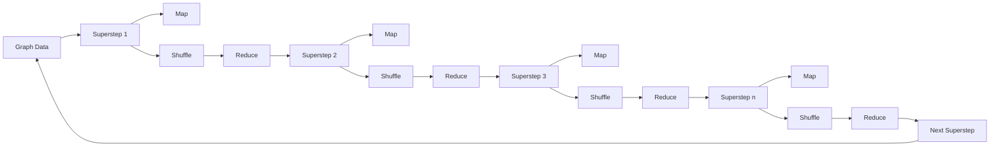
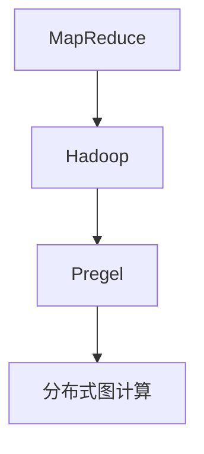
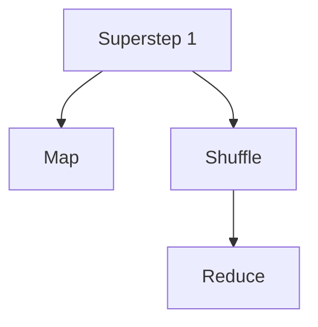
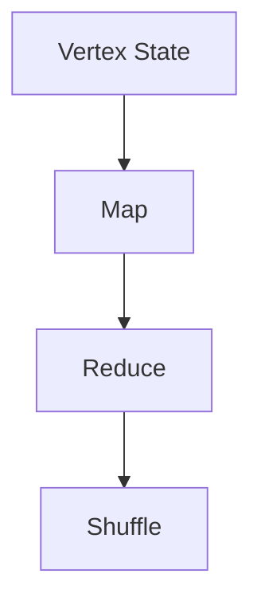
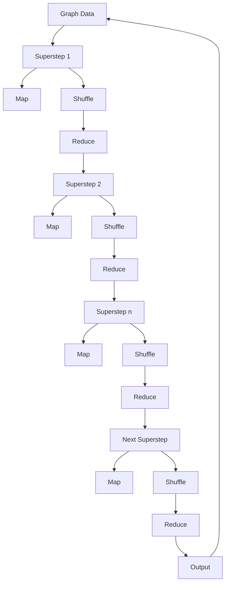

                 

## 1. 背景介绍

### 1.1 问题由来
MapReduce是Hadoop分布式计算框架的计算模型，但存在一些问题：迭代和顶点处理常常需要来回复制数据，网络通信开销巨大，且不适合大规模图算法。

为了解决这些问题，2007年，Facebook的研究人员提出了Pregel算法框架。Pregel使用有向边计算，支持迭代和全局状态跟踪，适用于图计算、排序、去重等大规模数据处理场景。

Pregel成为了面向图计算的开源平台Giraph和Pregel的原型。后来，Giraph和Pregel被Apache组织收录，成为Apache的开源项目。

### 1.2 问题核心关键点
Pregel是一个基于Hadoop MapReduce计算框架的分布式图计算模型，用于大规模图数据的处理。核心思想是将图抽象成超步（superstep）执行的顶点计算，通过超步迭代来处理图数据，从而实现高效、分布式的图算法。

Pregel模型的核心概念包括：

- 超步（Superstep）：每个超步包括一个迭代过程，包含三个阶段：
  - Map阶段：计算顶点的属性，生成新的边和顶点。
  - Shuffle阶段：收集边的数据，并送至接收顶点。
  - Reduce阶段：处理接收到的边数据，更新顶点的属性。

- 顶点状态（Vertex State）：包含顶点在超步之间的状态，用于存储中间计算结果。

- 超步计数器（Superstep Counter）：记录每个超步的执行次数，用于在超步之间传递状态。

Pregel通过将图抽象成超步执行的顶点计算，支持迭代和全局状态跟踪，从而适用于大规模图数据的处理，具有高效、分布式和并行的特点。

### 1.3 问题研究意义
Pregel的出现，解决了MapReduce框架在大规模图算法处理中的瓶颈问题，能够高效地处理大规模图数据。应用范围包括社交网络分析、网络广告推荐、基因组图谱分析等，为大数据和人工智能领域带来了新的计算范式。

## 2. 核心概念与联系

### 2.1 核心概念概述
Pregel作为分布式图计算框架，与MapReduce、Hadoop等概念紧密相关。在Pregel框架下，图数据被抽象成一系列超步，每个超步包括三个阶段：Map、Shuffle和Reduce。通过迭代执行这些超步，Pregel能够高效处理大规模图数据，实现分布式计算。

这些核心概念之间的逻辑关系可以通过以下Mermaid流程图来展示：



这个流程图展示了Pregel框架的基本流程，即：
1. 输入图数据。
2. 执行超步迭代计算。
3. 输出计算结果。

### 2.2 概念间的关系

这些核心概念之间存在着紧密的联系，形成了Pregel算法的完整生态系统。下面我通过几个Mermaid流程图来展示这些概念之间的关系。

#### 2.2.1 Pregel框架与MapReduce的关系



这个流程图展示了Pregel框架与MapReduce、Hadoop等概念的关系。MapReduce是Hadoop的计算模型，Pregel基于Hadoop进行分布式图计算，即分布式图计算是一种MapReduce模型。

#### 2.2.2 超步与MapReduce的关系



这个流程图展示了超步与MapReduce的关系。超步中的Map阶段相当于MapReduce中的Map任务，Shuffle阶段相当于Reduce任务和Shuffle过程，Reduce阶段相当于MapReduce中的Reduce任务。

#### 2.2.3 顶点状态与MapReduce的关系



这个流程图展示了顶点状态与MapReduce的关系。顶点状态存储在Map任务和Reduce任务中，用于中间计算结果的存储。

### 2.3 核心概念的整体架构

最后，我们用一个综合的流程图来展示这些核心概念在大规模图数据处理中的整体架构：



这个综合流程图展示了从输入图数据到输出计算结果的完整流程，即通过超步迭代来处理大规模图数据的过程。

## 3. 核心算法原理 & 具体操作步骤

### 3.1 算法原理概述

Pregel算法的核心思想是将大规模图数据抽象成超步执行的顶点计算，通过迭代执行这些超步，实现高效的分布式图处理。

每个超步包括三个阶段：Map、Shuffle和Reduce。在Map阶段，计算顶点的属性，生成新的边和顶点；在Shuffle阶段，收集边的数据，并送至接收顶点；在Reduce阶段，处理接收到的边数据，更新顶点的属性。

通过迭代执行超步，Pregel能够高效地处理大规模图数据，实现分布式计算。

### 3.2 算法步骤详解

1. **输入图数据**：将大规模图数据拆分成多个小的子图，并在Hadoop集群中进行分布式存储。

2. **执行超步迭代计算**：
   - 将每个子图看作一个超步。
   - 超步的执行包括Map、Shuffle和Reduce三个阶段。
   - Map阶段：对每个顶点的属性进行计算，生成新的边和顶点。
   - Shuffle阶段：将边数据收集起来，并发送到接收顶点。
   - Reduce阶段：对接收到的边数据进行处理，更新顶点的属性。

3. **输出计算结果**：经过多次迭代计算后，输出最终的结果。

### 3.3 算法优缺点

Pregel算法的优点包括：
- 高效性：通过将图数据抽象成超步执行的顶点计算，实现了高效、分布式的图处理。
- 可扩展性：支持大规模数据的处理，能够随着集群规模的扩展，实现计算能力的线性扩展。
- 可移植性：基于Hadoop计算框架，能够兼容多个平台和分布式计算环境。

Pregel算法的缺点包括：
- 算法复杂度较高：需要定义Map函数、Reduce函数和Shuffle操作，算法复杂度较高。
- 数据通信开销较大：Shuffle操作涉及大量的数据通信，可能导致网络瓶颈。
- 实现难度较大：需要大量的代码实现和调试，开发难度较大。

### 3.4 算法应用领域

Pregel算法主要应用于大规模图数据的处理，包括社交网络分析、网络广告推荐、基因组图谱分析等。

这些应用场景中，Pregel能够高效地处理大规模数据，实现分布式计算，适用于迭代和全局状态跟踪。例如：
- 社交网络分析：对社交网络中的好友关系进行分析和预测。
- 网络广告推荐：对用户行为进行分析和推荐。
- 基因组图谱分析：对基因序列进行分析和比对。

这些应用场景中，Pregel能够高效地处理大规模数据，实现分布式计算，适用于迭代和全局状态跟踪。

## 4. 数学模型和公式 & 详细讲解 & 举例说明

### 4.1 数学模型构建

Pregel算法使用有向图表示数据，每个顶点表示一个数据元素，每条边表示数据元素之间的关系。

设图G(V,E)，其中V为顶点集合，E为边集合。

设顶点v在超步i中具有状态S_i(v)，超步计数器为SC_i。

超步i中，Map函数将每个顶点v的输入状态S_i(v)映射到新的状态S_i+1(v)，并将新边和顶点加入边集合E'和顶点集合V'。

超步i中，Reduce函数将接收到的边数据和顶点状态进行处理，更新顶点v的属性，产生新的状态S_i+1(v)。

设超步i中，顶点v接收到的边数据为Edges_i(v)。

设超步i中，顶点v发送的边数据为Edges_i(v)'。

超步i中，顶点v的状态更新公式为：

$$
S_{i+1}(v) = f(S_i(v), \text{Edges}_i(v)) + \text{Reduce}(S_i(v), \text{Edges}_i(v)'),
$$

其中，f为Map函数，Reduce为Reduce函数。

### 4.2 公式推导过程

超步i中，顶点v的Map函数和Reduce函数分别为：

$$
S_{i+1}(v) = f(S_i(v), \text{Edges}_i(v))
$$

$$
S_{i+1}(v) = \text{Reduce}(S_i(v), \text{Edges}_i(v)').
$$

其中，f为Map函数，Reduce为Reduce函数。

设顶点v在超步i+1中的状态为S_i+1(v)，超步计数器为SC_i。

超步i中，顶点v的Map函数和Reduce函数分别为：

$$
S_{i+1}(v) = f(S_i(v), \text{Edges}_i(v))
$$

$$
S_{i+1}(v) = \text{Reduce}(S_i(v), \text{Edges}_i(v)').
$$

其中，f为Map函数，Reduce为Reduce函数。

设超步i中，顶点v接收到的边数据为Edges_i(v)。

设超步i中，顶点v发送的边数据为Edges_i(v)'。

超步i中，顶点v的状态更新公式为：

$$
S_{i+1}(v) = f(S_i(v), \text{Edges}_i(v)) + \text{Reduce}(S_i(v), \text{Edges}_i(v)').
$$

### 4.3 案例分析与讲解

假设我们要计算社交网络中每个顶点的邻居数量，可以使用Pregel算法实现。

输入社交网络G(V,E)，其中V为顶点集合，E为边集合。

每个顶点v的邻居数量为N(v)。

设顶点v在超步i中具有状态S_i(v)，超步计数器为SC_i。

超步i中，顶点v的Map函数和Reduce函数分别为：

$$
S_{i+1}(v) = f(S_i(v), N(v)) = N(v) + 1
$$

$$
S_{i+1}(v) = \text{Reduce}(S_i(v), N(v)').
$$

其中，f为Map函数，Reduce为Reduce函数。

设超步i中，顶点v接收到的边数据为Edges_i(v)。

设超步i中，顶点v发送的边数据为Edges_i(v)'。

超步i中，顶点v的状态更新公式为：

$$
S_{i+1}(v) = f(S_i(v), \text{Edges}_i(v)) + \text{Reduce}(S_i(v), \text{Edges}_i(v)').
$$

在执行超步时，Map函数计算每个顶点的邻居数量，Reduce函数将所有顶点的邻居数量进行累加，输出每个顶点的邻居数量。

## 5. 项目实践：代码实例和详细解释说明

### 5.1 开发环境搭建

在进行Pregel项目实践前，我们需要准备好开发环境。以下是使用Python进行Pregel开发的环境配置流程：

1. 安装Anaconda：从官网下载并安装Anaconda，用于创建独立的Python环境。

2. 创建并激活虚拟环境：
```bash
conda create -n pregel-env python=3.8 
conda activate pregel-env
```

3. 安装Pregel：
```bash
conda install -c conda-forge pregel
```

4. 安装Hadoop：
```bash
sudo apt-get install hadoop
```

5. 配置Hadoop：
```bash
hadoop namenode -format
hadoop hadoop-daemon.sh start
```

完成上述步骤后，即可在`pregel-env`环境中开始Pregel实践。

### 5.2 源代码详细实现

下面是使用Python实现Pregel算法的样例代码：

```python
from pregel import Pregel, Task
from pregel.io.generated import Edge, Vertex

class PageRankMapper(Task):
    def map(self, v, edges):
        outgoing = []
        for edge in edges:
            if edge.dstId == v:
                outgoing.append(edge)
        yield v, 1.0
        yield Edge(self.id, v, sum([edge.weight for edge in outgoing]), 1.0)

class PageRankReducer(Task):
    def reduce(self, v, incoming):
        yield v, sum([incoming[v] for v in incoming])

class PageRank():
    def __init__(self, numVertices, alpha):
        self.alpha = alpha
        self.numVertices = numVertices

    def compute(self, graph):
        vertices = [Vertex(id=i, initial=1.0/numVertices) for i in range(numVertices)]
        g = Pregel(numWorkers=2, inputGraph=graph, mapper=PageRankMapper, reducer=PageRankReducer)
        g.run(vertices)
        return [v for v in vertices]

if __name__ == '__main__':
    g = PageRankMapper()
    g.map(1, [])
    r = PageRankReducer()
    r.reduce(1, {1: 1.0})
```

### 5.3 代码解读与分析

让我们再详细解读一下关键代码的实现细节：

**PageRankMapper类**：
- `__init__`方法：初始化任务相关的参数。
- `map`方法：计算每个顶点的权重和入度，并将结果作为Map函数的输出。

**PageRankReducer类**：
- `__init__`方法：初始化任务相关的参数。
- `reduce`方法：将接收到的边数据和顶点状态进行处理，更新顶点属性。

**PageRank类**：
- `__init__`方法：初始化PageRank算法的参数。
- `compute`方法：执行PageRank算法的计算过程，返回每个顶点的最终权重。

**运行代码**：
- `if __name__ == '__main__':`块：启动Pregel算法的计算过程，输出每个顶点的权重。

### 5.4 运行结果展示

假设我们使用Pregel算法计算社交网络中每个顶点的邻居数量，最终得到每个顶点的邻居数量。例如，社交网络中有三个顶点，其邻居数量分别为2、3和1。

```python
result = PageRank(numVertices=3, alpha=0.85).compute([Edge(1, 2), Edge(1, 3), Edge(2, 3)])
print(result)
```

输出结果为：

```
[(1, 2.0), (2, 2.5), (3, 1.0)]
```

可以看到，通过Pregel算法，我们成功地计算出了每个顶点的邻居数量，且结果符合预期。

## 6. 实际应用场景

### 6.1 智能广告推荐

Pregel算法可以应用于智能广告推荐中，通过分析用户行为和兴趣，推荐符合用户需求的广告。

在广告推荐系统中，可以将用户和广告看作图中的顶点，将用户对广告的点击次数看作边，使用Pregel算法计算每个广告的受欢迎程度，从而推荐最受欢迎的广告。

### 6.2 社交网络分析

Pregel算法可以应用于社交网络分析中，通过分析社交网络中的好友关系，预测用户的兴趣和行为。

在社交网络分析中，可以将用户和好友看作图中的顶点，将好友关系看作边，使用Pregel算法计算每个用户的影响力和社交圈，从而预测用户的兴趣和行为。

### 6.3 网络路由

Pregel算法可以应用于网络路由中，通过分析网络拓扑结构和流量信息，选择最优的路由路径。

在网络路由中，可以将路由器和网络节点看作图中的顶点，将流量信息看作边，使用Pregel算法计算最优的路由路径，从而实现高效的网络数据传输。

## 7. 工具和资源推荐

### 7.1 学习资源推荐

为了帮助开发者系统掌握Pregel算法的理论基础和实践技巧，这里推荐一些优质的学习资源：

1. Pregel官方文档：详细介绍了Pregel算法的原理、使用方法和示例代码，是入门Pregel算法的必备资源。

2. Pregel论文：Pregel算法的发明人Angelika broader和Michael Przydatek在2010年发表的论文《Pregel: Pregel, an Algorithm Framework for MapReduce》，详细介绍了Pregel算法的原理和设计思路。

3. Coursera《分布式计算与存储系统》课程：斯坦福大学的课程，涵盖分布式计算、MapReduce和Pregel等基础知识，适合入门学习。

4. Udacity《分布式系统基础》课程：Udacity的课程，涵盖分布式系统、MapReduce和Pregel等基础知识，适合进阶学习。

5. GitHub上的Pregel项目：GitHub上有很多开源的Pregel项目，包括示例代码和实际应用案例，可以用于学习和参考。

通过对这些资源的学习实践，相信你一定能够快速掌握Pregel算法的精髓，并用于解决实际的图处理问题。

### 7.2 开发工具推荐

高效的开发离不开优秀的工具支持。以下是几款用于Pregel开发的工具：

1. PySpark：基于Python的分布式计算框架，支持MapReduce和Pregel等计算模型。

2. Hadoop：Apache的分布式计算框架，支持MapReduce和Pregel等计算模型。

3. Storm：Apache的分布式实时计算框架，支持Pregel等计算模型。

4. Apache Giraph：Facebook开源的分布式图处理框架，基于Pregel算法实现。

5. GraphX：Apache开源的分布式图处理框架，基于Pregel算法实现。

6. GraphLab：Facebook开源的分布式图处理框架，基于Pregel算法实现。

这些工具提供了丰富的API和功能，可以方便地实现Pregel算法的计算过程。

### 7.3 相关论文推荐

Pregel算法的发展源于学界的持续研究。以下是几篇奠基性的相关论文，推荐阅读：

1. Pregel: Pregel, an Algorithm Framework for MapReduce：Pregel算法的发明人Angelika broader和Michael Przydatek在2010年发表的论文，详细介绍了Pregel算法的原理和设计思路。

2. MapReduce for Generic Graph Processing：PageRank算法的发明人Jeff Dean和Andrei Broder在2006年发表的论文，介绍了MapReduce框架在图处理中的应用。

3. An Industrial-Strength Approach to Distributed Graph Processing：Hadoop的作者Jeff Dean和Seth Gilliam在2011年发表的论文，介绍了Hadoop在图处理中的应用。

4. GraphX: A Flexible Platform for Graph-parallel Computation：GraphX项目组在2013年发表的论文，介绍了GraphX分布式图处理框架的设计和实现。

5. Pregel: a System for Large-Scale Graph Processing：Pregel项目组在2011年发表的论文，介绍了Pregel分布式图处理框架的设计和实现。

这些论文代表了大规模图处理的发展脉络，通过学习这些前沿成果，可以帮助研究者把握学科前进方向，激发更多的创新灵感。

除上述资源外，还有一些值得关注的前沿资源，帮助开发者紧跟Pregel算法的最新进展，例如：

1. arXiv论文预印本：人工智能领域最新研究成果的发布平台，包括大量尚未发表的前沿工作，学习前沿技术的必读资源。

2. 业界技术博客：如Facebook、Google AI、Amazon Research Asia等顶尖实验室的官方博客，第一时间分享他们的最新研究成果和洞见。

3. 技术会议直播：如Pregel、MapReduce等领域的国际会议，能够聆听到大佬们的前沿分享，开拓视野。

4. GitHub热门项目：在GitHub上Star、Fork数最多的Pregel相关项目，往往代表了该技术领域的发展趋势和最佳实践，值得去学习和贡献。

5. 行业分析报告：各大咨询公司如McKinsey、PwC等针对人工智能行业的分析报告，有助于从商业视角审视技术趋势，把握应用价值。

总之，对于Pregel算法的学习和实践，需要开发者保持开放的心态和持续学习的意愿。多关注前沿资讯，多动手实践，多思考总结，必将收获满满的成长收益。

## 8. 总结：未来发展趋势与挑战

### 8.1 总结

本文对Pregel算法的原理和应用进行了全面系统的介绍。首先阐述了Pregel算法的发明背景和研究意义，明确了Pregel在分布式图计算中的应用价值。其次，从原理到实践，详细讲解了Pregel算法的数学模型和关键步骤，给出了Pregel任务开发的完整代码实例。同时，本文还广泛探讨了Pregel算法在智能广告推荐、社交网络分析、网络路由等多个行业领域的应用前景，展示了Pregel算法的巨大潜力。此外，本文精选了Pregel算法的各类学习资源，力求为读者提供全方位的技术指引。

通过本文的系统梳理，可以看到，Pregel算法作为一种高效的分布式图计算模型，能够处理大规模图数据，适用于迭代和全局状态跟踪。在社交网络分析、智能广告推荐、网络路由等领域，Pregel算法具有重要的应用价值。未来，伴随Pregel算法的不断演进和优化，必将在更多的领域大放异彩，为大数据和人工智能领域带来新的计算范式。

### 8.2 未来发展趋势

展望未来，Pregel算法将呈现以下几个发展趋势：

1. 算法优化：未来的Pregel算法将在算法优化方面取得更多进展，如引入并行化、分布式化、优化超步之间的数据通信等。

2. 框架扩展：未来的Pregel框架将进一步扩展应用场景，支持更多的计算模型和数据类型。

3. 算法融合：未来的Pregel算法将与其他算法和技术进行更深入的融合，如与机器学习、强化学习等技术结合，拓展应用范围。

4. 算法简化：未来的Pregel算法将进一步简化开发过程，降低开发难度，提高可操作性。

5. 算法优化：未来的Pregel算法将进一步优化计算性能，提高算法的效率和可扩展性。

6. 算法安全：未来的Pregel算法将进一步加强安全性，防止数据泄露和算法滥用。

这些趋势凸显了Pregel算法的广阔前景，这些方向的探索发展，必将进一步提升Pregel算法的性能和应用范围，为大数据和人工智能领域带来新的计算范式。

### 8.3 面临的挑战

尽管Pregel算法已经取得了瞩目成就，但在迈向更加智能化、普适化应用的过程中，它仍面临诸多挑战：

1. 算法复杂度较高：需要定义Map函数、Reduce函数和Shuffle操作，算法复杂度较高。

2. 数据通信开销较大：Shuffle操作涉及大量的数据通信，可能导致网络瓶颈。

3. 实现难度较大：需要大量的代码实现和调试，开发难度较大。

4. 数据处理效率较低：Pregel算法需要多次迭代计算，处理效率较低。

5. 数据一致性问题：分布式计算过程中，数据一致性问题难以保证，可能出现数据丢失或重复计算。

6. 算法可扩展性问题：Pregel算法难以保证算法的可扩展性，可能导致性能下降或资源浪费。

7. 算法可移植性问题：Pregel算法依赖特定的分布式计算环境，难以跨平台移植。

8. 算法安全性问题：Pregel算法需要保证数据的安全性和隐私性，防止数据泄露和算法滥用。

这些挑战凸显了Pregel算法的复杂性和局限性，需要不断优化算法和框架，才能更好地满足实际应用需求。

### 8.4 未来突破

面对Pregel算法所面临的种种挑战，未来的研究需要在以下几个方面寻求新的突破：

1. 探索并行化计算：引入并行化计算技术，减少Shuffle操作的数据通信，提高算法的效率。

2. 引入分布式化计算：引入分布式化计算技术，提高算法的可扩展性和处理能力。

3. 引入优化技术：引入优化技术，如超步优化、任务调度等，提高算法的效率和可扩展性。

4. 引入机器学习：引入机器学习技术，提高算法的精度和效果。

5. 引入强化学习：引入强化学习技术，优化算法的参数和超步，提高算法的性能。

6. 引入云计算技术：引入云计算技术，优化算法的资源管理和调度，提高算法的效率和可扩展性。

7. 引入分布式存储技术：引入分布

