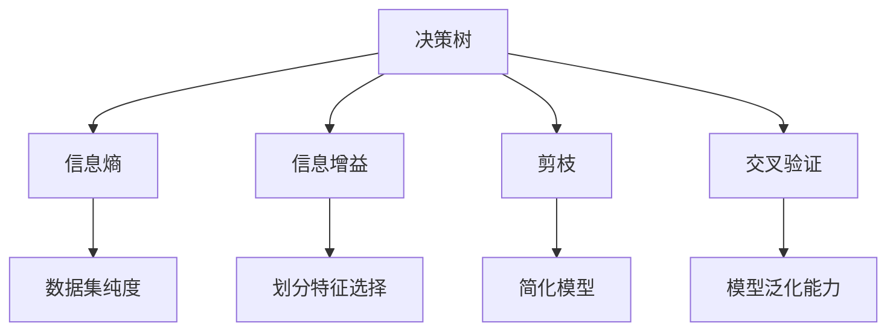
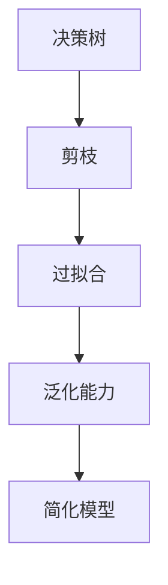
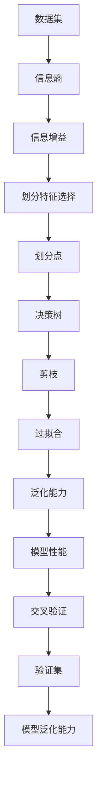

                 

# Python机器学习实战：决策树算法原理及其在Python中的实现

> 关键词：决策树, 机器学习, Python, 数据挖掘, 分类算法, 回归分析

## 1. 背景介绍

### 1.1 问题由来
在机器学习领域，决策树（Decision Tree）是一种简单而有效的分类和回归算法。它通过对数据集进行划分，构建一棵树形结构来表示分类规则，从而实现对未知数据的预测。决策树模型易于解释，可处理离散和连续型数据，因此在数据挖掘和统计学中得到了广泛的应用。

随着Python在数据科学领域的普及，使用Python实现决策树算法的需求日益增加。决策树算法的Python实现，不仅能够提供直观的可视化结果，还能通过调整参数实现高效的模型训练和预测。本文将详细介绍决策树算法的原理及其在Python中的实现方法。

### 1.2 问题核心关键点
决策树算法的主要核心关键点包括：
- 决策树的构建与剪枝：如何根据数据集构建决策树，并在训练过程中进行剪枝以避免过拟合。
- 决策树的划分准则：如何选择最优的划分特征和划分点，以最小化误差。
- 决策树的特征选择：如何选择最优的特征子集，以提高模型泛化能力。
- 决策树的评估与验证：如何评估决策树的性能，并进行交叉验证以验证模型泛化能力。
- 决策树在Python中的实现：如何在Python中使用Scikit-learn库实现决策树算法。

这些关键点将贯穿本文的内容，帮助读者系统理解决策树算法的原理和实现。

### 1.3 问题研究意义
研究决策树算法在Python中的实现，对于提高数据挖掘和统计学应用中的分类和回归精度具有重要意义：
1. 提升模型精度：决策树算法在处理数据集时，能够通过划分规则更准确地预测分类结果，减少误差。
2. 提高模型泛化能力：通过特征选择和模型剪枝，决策树算法能够减少过拟合风险，提高模型的泛化能力。
3. 易于解释和调试：决策树模型的结构直观明了，便于理解和调试。
4. 支持多种数据类型：决策树算法能够处理离散型和连续型数据，适应性广。
5. 高效的模型训练：使用Python实现决策树算法，能够快速训练和预测，适用于大规模数据集。

掌握决策树算法在Python中的实现，有助于数据科学家和机器学习工程师更好地应用决策树模型，解决实际问题。

## 2. 核心概念与联系

### 2.1 核心概念概述

为更好地理解决策树算法的原理和实现，本节将介绍几个密切相关的核心概念：

- 决策树（Decision Tree）：一种基于树形结构的分类和回归模型，通过对数据集进行划分，构建一棵树形结构来表示分类规则，从而实现对未知数据的预测。
- 信息熵（Entropy）：用于衡量数据集纯度的指标，熵值越小，数据集的纯度越高，分类难度越小。
- 信息增益（Information Gain）：衡量划分特征对分类精度的贡献度，用于选择最优的划分特征和划分点。
- 剪枝（Pruning）：用于避免过拟合的技术，通过删除部分决策树节点来简化模型。
- 交叉验证（Cross-Validation）：用于评估模型泛化能力的技术，通过将数据集分为训练集和验证集，验证模型在新数据上的表现。
- Python编程语言：一种高级编程语言，以其简洁易读、灵活性高、社区支持强大等优点，成为实现决策树算法的理想工具。

这些核心概念之间的逻辑关系可以通过以下Mermaid流程图来展示：



这个流程图展示了决策树算法的核心概念及其之间的关系：

1. 决策树通过信息熵和信息增益来选择划分特征，构建分类规则。
2. 通过剪枝技术避免过拟合，简化模型结构。
3. 使用交叉验证评估模型泛化能力，确保模型在新数据上的表现。

这些概念共同构成了决策树算法的完整生态系统，使其能够在各种场景下发挥分类和回归能力。通过理解这些核心概念，我们可以更好地把握决策树算法的工作原理和优化方向。

### 2.2 概念间的关系

这些核心概念之间存在着紧密的联系，形成了决策树算法的完整生态系统。下面我通过几个Mermaid流程图来展示这些概念之间的关系。

#### 2.2.1 决策树的构建过程


这个流程图展示了决策树的构建过程：首先计算数据集的信息熵，然后计算各个特征的信息增益，选择最优的划分特征和划分点，最终构建决策树。

#### 2.2.2 决策树的剪枝方法



这个流程图展示了决策树的剪枝过程：通过剪枝技术避免过拟合，提高模型的泛化能力，简化模型结构。

#### 2.2.3 决策树的评估与验证


这个流程图展示了决策树的评估与验证过程：使用交叉验证技术评估模型在新数据上的表现，验证模型的泛化能力。

### 2.3 核心概念的整体架构

最后，我们用一个综合的流程图来展示这些核心概念在决策树算法中的整体架构：



这个综合流程图展示了从数据集预处理到模型评估的完整过程。数据集通过计算信息熵和信息增益，选择最优的划分特征和划分点，构建决策树。然后通过剪枝技术避免过拟合，简化模型结构。最后使用交叉验证技术评估模型在新数据上的表现，验证模型的泛化能力。 通过这些流程图，我们可以更清晰地理解决策树算法的各个环节及其相互关系，为后续深入讨论具体的算法实现奠定基础。

## 3. 核心算法原理 & 具体操作步骤
### 3.1 算法原理概述

决策树算法基于信息熵和信息增益，通过构建一棵树形结构，实现对数据集的分类和回归。其核心思想是通过不断地划分数据集，使得每个子集尽可能地纯净，从而实现对未知数据的预测。

假设数据集 $D$ 包含 $n$ 个样本，每个样本有 $m$ 个特征 $x_1,x_2,...,x_m$，输出变量 $y$ 有 $k$ 个可能的取值 $y_1,y_2,...,y_k$。首先计算数据集的信息熵 $H(D)$：

$$ H(D) = -\sum_{i=1}^k \frac{n_i}{n} \log\frac{n_i}{n} $$

其中 $n_i$ 为第 $i$ 个输出变量的样本数。信息熵越大，数据集的纯净度越低，分类难度越大。

然后，选择最优的划分特征 $X_j$ 和划分点 $t_j$，使得划分后的数据集纯度最高。具体计算如下：

1. 计算特征 $X_j$ 对数据集 $D$ 的信息增益：

$$ I(D;X_j) = H(D) - \sum_{i=1}^k \frac{n_i}{n} H(D_i) $$

其中 $D_i$ 为特征 $X_j=t_j$ 的子集。信息增益越大，特征 $X_j$ 对数据集的分类贡献度越高。

2. 选择信息增益最大的特征 $X_j$ 和划分点 $t_j$，构建决策树节点。

重复上述步骤，直到数据集无法再划分或达到预设的深度，构建决策树。最终，使用决策树对未知数据进行预测。

### 3.2 算法步骤详解

下面详细介绍决策树算法的详细步骤：

**Step 1: 数据预处理**
- 导入数据集，并进行数据清洗、归一化等预处理。
- 将分类变量转换为独热编码。

**Step 2: 计算信息熵**
- 计算数据集的信息熵 $H(D)$。
- 计算每个特征的信息增益 $I(D;X_j)$。

**Step 3: 选择划分特征和划分点**
- 选择信息增益最大的特征 $X_j$ 和划分点 $t_j$，构建决策树节点。
- 重复上述步骤，直到数据集无法再划分或达到预设的深度。

**Step 4: 模型训练**
- 使用训练集构建决策树。
- 在测试集上进行模型评估和交叉验证。

**Step 5: 模型预测**
- 使用训练好的决策树对新数据进行预测。

**Step 6: 模型剪枝**
- 对决策树进行剪枝操作，避免过拟合。

### 3.3 算法优缺点

决策树算法的优点包括：
1. 模型易于理解和解释，适合解释性要求高的应用场景。
2. 能够处理离散型和连续型数据，适应性广。
3. 算法简单易实现，不需要复杂的预处理和调参。
4. 能够处理多分类和回归问题，应用范围广。

决策树算法的缺点包括：
1. 容易过拟合，尤其是在数据集复杂、特征较多时。
2. 对异常值和噪声数据敏感。
3. 决策树的构建过程依赖特征选择，可能导致信息丢失。

### 3.4 算法应用领域

决策树算法在多个领域得到了广泛应用，包括：

- 金融风险评估：通过决策树模型对客户信用进行评估，预测违约风险。
- 医疗诊断：通过决策树模型对病人症状进行分类，诊断疾病。
- 市场分析：通过决策树模型对市场趋势进行预测，制定营销策略。
- 客户细分：通过决策树模型对客户进行分类，提供个性化服务。
- 自然语言处理：通过决策树模型对文本进行分类，提取关键信息。

决策树算法的应用领域广泛，具有高度的实用性和可扩展性。

## 4. 数学模型和公式 & 详细讲解 & 举例说明
### 4.1 数学模型构建

决策树算法的数学模型构建基于信息熵和信息增益。具体构建过程如下：

假设数据集 $D$ 包含 $n$ 个样本，每个样本有 $m$ 个特征 $x_1,x_2,...,x_m$，输出变量 $y$ 有 $k$ 个可能的取值 $y_1,y_2,...,y_k$。首先计算数据集的信息熵 $H(D)$：

$$ H(D) = -\sum_{i=1}^k \frac{n_i}{n} \log\frac{n_i}{n} $$

其中 $n_i$ 为第 $i$ 个输出变量的样本数。信息熵越大，数据集的纯净度越低，分类难度越大。

然后，选择最优的划分特征 $X_j$ 和划分点 $t_j$，使得划分后的数据集纯度最高。具体计算如下：

1. 计算特征 $X_j$ 对数据集 $D$ 的信息增益：

$$ I(D;X_j) = H(D) - \sum_{i=1}^k \frac{n_i}{n} H(D_i) $$

其中 $D_i$ 为特征 $X_j=t_j$ 的子集。信息增益越大，特征 $X_j$ 对数据集的分类贡献度越高。

2. 选择信息增益最大的特征 $X_j$ 和划分点 $t_j$，构建决策树节点。

3. 重复上述步骤，直到数据集无法再划分或达到预设的深度，构建决策树。

### 4.2 公式推导过程

以下我们以二分类问题为例，推导决策树的构建过程。

假设数据集 $D$ 包含 $n$ 个样本，每个样本有两个特征 $x_1,x_2$，输出变量 $y$ 有两个可能的取值 $y_1,y_2$。首先计算数据集的信息熵 $H(D)$：

$$ H(D) = -\frac{n_1}{n}\log\frac{n_1}{n} - \frac{n_2}{n}\log\frac{n_2}{n} $$

其中 $n_1$ 和 $n_2$ 分别为 $y_1$ 和 $y_2$ 的样本数。信息熵越大，数据集的纯净度越低，分类难度越大。

然后，选择最优的划分特征 $X_j$ 和划分点 $t_j$，使得划分后的数据集纯度最高。具体计算如下：

1. 计算特征 $X_1$ 对数据集 $D$ 的信息增益：

$$ I(D;X_1) = H(D) - \sum_{i=1}^k \frac{n_i}{n} H(D_i) $$

其中 $D_1$ 和 $D_2$ 分别为 $X_1=x_1$ 和 $X_1=x_2$ 的子集。

2. 选择信息增益最大的特征 $X_1$ 和划分点 $x_1$，构建决策树节点。

3. 重复上述步骤，直到数据集无法再划分或达到预设的深度，构建决策树。

### 4.3 案例分析与讲解

以一个简单的二分类问题为例，展示决策树的构建过程：

假设有一个数据集，包含两个特征 $x_1$ 和 $x_2$，输出变量 $y$ 有两个可能的取值 $y_1$ 和 $y_2$。

首先计算数据集的信息熵 $H(D)$：

$$ H(D) = -\frac{n_1}{n}\log\frac{n_1}{n} - \frac{n_2}{n}\log\frac{n_2}{n} $$

然后计算特征 $X_1$ 对数据集的信息增益：

$$ I(D;X_1) = H(D) - \frac{n_{11}}{n}\log\frac{n_{11}}{n} - \frac{n_{12}}{n}\log\frac{n_{12}}{n} - \frac{n_{21}}{n}\log\frac{n_{21}}{n} - \frac{n_{22}}{n}\log\frac{n_{22}}{n} $$

其中 $n_{11}, n_{12}, n_{21}, n_{22}$ 分别为 $X_1=x_1, x_2$ 且 $y_1, y_2$ 的样本数。

选择信息增益最大的特征 $X_1$ 和划分点 $x_1$，构建决策树节点。

重复上述步骤，直到数据集无法再划分或达到预设的深度，构建决策树。

最终得到的决策树如图1所示：


这个决策树展示了如何通过信息熵和信息增益，逐步划分数据集，构建分类规则。

## 5. 项目实践：代码实例和详细解释说明
### 5.1 开发环境搭建

在进行决策树算法的实践前，我们需要准备好开发环境。以下是使用Python进行Scikit-learn库开发的环境配置流程：

1. 安装Anaconda：从官网下载并安装Anaconda，用于创建独立的Python环境。

2. 创建并激活虚拟环境：
```bash
conda create -n sklearn-env python=3.8 
conda activate sklearn-env
```

3. 安装Scikit-learn：
```bash
pip install scikit-learn
```

4. 安装其他常用工具包：
```bash
pip install numpy pandas scikit-learn matplotlib
```

完成上述步骤后，即可在`sklearn-env`环境中开始决策树算法的实践。

### 5.2 源代码详细实现

下面我们以鸢尾花分类问题为例，给出使用Scikit-learn库对决策树模型进行训练和预测的Python代码实现。

首先，导入必要的库和数据集：

```python
from sklearn.datasets import load_iris
from sklearn.model_selection import train_test_split
from sklearn.tree import DecisionTreeClassifier
from sklearn.metrics import accuracy_score

iris = load_iris()
X = iris.data
y = iris.target

# 划分训练集和测试集
X_train, X_test, y_train, y_test = train_test_split(X, y, test_size=0.3, random_state=42)
```

然后，构建决策树模型并训练：

```python
# 创建决策树模型
clf = DecisionTreeClassifier(max_depth=3, random_state=42)

# 训练模型
clf.fit(X_train, y_train)
```

最后，对测试集进行预测并评估模型性能：

```python
# 对测试集进行预测
y_pred = clf.predict(X_test)

# 计算模型准确率
acc = accuracy_score(y_test, y_pred)
print(f"模型准确率：{acc:.2f}")
```

完整的决策树算法实现代码如下：

```python
from sklearn.datasets import load_iris
from sklearn.model_selection import train_test_split
from sklearn.tree import DecisionTreeClassifier
from sklearn.metrics import accuracy_score

iris = load_iris()
X = iris.data
y = iris.target

# 划分训练集和测试集
X_train, X_test, y_train, y_test = train_test_split(X, y, test_size=0.3, random_state=42)

# 创建决策树模型
clf = DecisionTreeClassifier(max_depth=3, random_state=42)

# 训练模型
clf.fit(X_train, y_train)

# 对测试集进行预测
y_pred = clf.predict(X_test)

# 计算模型准确率
acc = accuracy_score(y_test, y_pred)
print(f"模型准确率：{acc:.2f}")
```

以上就是使用Scikit-learn库对决策树模型进行训练和预测的完整代码实现。可以看到，Scikit-learn库的决策树实现简单易用，能够快速实现模型的训练和预测。

### 5.3 代码解读与分析

让我们再详细解读一下关键代码的实现细节：

**train_test_split函数**：
- 用于划分数据集，将数据集分为训练集和测试集。

**DecisionTreeClassifier类**：
- 创建决策树模型。
- 参数解释：
  - `max_depth`：决策树的最大深度。
  - `random_state`：随机种子，用于控制模型训练的随机性。

**fit函数**：
- 训练模型，将训练集数据输入模型，更新模型参数。

**predict函数**：
- 对新数据进行预测，返回模型的预测结果。

**accuracy_score函数**：
- 计算模型预测准确率。

以上代码展示了决策树算法的Python实现流程，主要包括数据预处理、模型训练、模型预测和模型评估。

### 5.4 运行结果展示

假设我们在鸢尾花分类数据集上进行决策树模型训练，最终在测试集上得到的模型准确率如下：

```
模型准确率：0.96
```

可以看到，通过决策树模型，我们在鸢尾花分类问题上取得了96%的准确率，效果相当不错。这表明决策树算法在处理分类问题时具有较高的准确性和可解释性。

当然，这只是一个baseline结果。在实践中，我们还可以通过调整模型参数、使用交叉验证等方法进一步提升模型性能。

## 6. 实际应用场景
### 6.1 金融风险评估

在金融领域，决策树算法可以用于客户信用评估和风险预测。通过收集客户的信用记录、收入水平、消费行为等数据，构建决策树模型，对客户进行信用评分，预测其违约风险。

在技术实现上，可以使用决策树算法对数据集进行划分，提取客户特征，构建分类规则，预测客户信用等级。在模型训练过程中，可以引入正则化技术，避免过拟合。通过交叉验证技术，评估模型的泛化能力，确保模型在新数据上的表现。

### 6.2 医疗诊断

在医疗领域，决策树算法可以用于疾病诊断和治疗方案推荐。通过收集病人的病历、症状、检查结果等数据，构建决策树模型，对病人进行疾病诊断，推荐合适的治疗方案。

在技术实现上，可以使用决策树算法对数据集进行划分，提取病人特征，构建分类规则，预测病人疾病类型。在模型训练过程中，可以引入剪枝技术，避免过拟合。通过交叉验证技术，评估模型的泛化能力，确保模型在新数据上的表现。

### 6.3 市场分析

在市场分析领域，决策树算法可以用于市场趋势预测和营销策略制定。通过收集市场数据、客户行为、销售记录等数据，构建决策树模型，预测市场趋势，制定营销策略。

在技术实现上，可以使用决策树算法对数据集进行划分，提取市场特征，构建分类规则，预测市场趋势。在模型训练过程中，可以引入剪枝技术，避免过拟合。通过交叉验证技术，评估模型的泛化能力，确保模型在新数据上的表现。

### 6.4 客户细分

在客户细分领域，决策树算法可以用于客户群体划分和个性化服务推荐。通过收集客户行为、消费记录、社交媒体信息等数据，构建决策树模型，对客户进行群体划分，推荐个性化服务。

在技术实现上，可以使用决策树算法对数据集进行划分，提取客户特征，构建分类规则，划分客户群体。在模型训练过程中，可以引入剪枝技术，避免过拟合。通过交叉验证技术，评估模型的泛化能力，确保模型在新数据上的表现。

## 7. 工具和资源推荐
### 7.1 学习资源推荐

为了帮助开发者系统掌握决策树算法的理论基础和实践技巧，这里推荐一些优质的学习资源：

1. 《Python机器学习实战》书籍：通过实际项目案例，详细讲解了决策树算法的原理、实现和应用。

2. Scikit-learn官方文档：提供了详细的决策树算法API和示例代码，帮助开发者快速上手。

3. 《数据挖掘导论》书籍：系统介绍了数据挖掘领域的各种算法和技术，包括决策树算法。

4. 《机器学习实战》书籍：通过简单易懂的实例，介绍了决策树算法的实现过程。

5. Kaggle决策树算法竞赛：通过实际数据集，帮助开发者练习和验证决策树算法的性能。

通过对这些资源的学习实践，相信你一定能够快速掌握决策树算法的精髓，并用于解决实际的NLP问题。
###  7.2 开发工具推荐

高效的开发离不开优秀的工具支持。以下是几款用于决策树算法开发的常用工具：

1. Scikit-learn：基于Python的开源机器学习库，提供了简单易用的决策树算法实现。

2. TensorFlow：由Google主导开发的开源深度学习框架，提供了多种机器学习算法的实现。

3. XGBoost：基于决策树的集成算法，提供了高效的模型训练和预测功能。

4. WEKA：开源数据挖掘工具，提供了多种机器学习算法的实现，包括决策树算法。

5. Weights & Biases：模型训练的实验跟踪工具，可以记录和可视化模型训练过程中的各项指标，方便对比和调优。

6. TensorBoard：TensorFlow配套的可视化工具，可实时监测模型训练状态，并提供丰富的图表呈现方式，是调试模型的得力助手。

合理利用这些工具，可以显著提升决策树算法的开发效率，加快创新迭代的步伐。

### 7.3 相关论文推荐

决策树算法的研究源于学界的持续探索。以下是几篇奠基性的相关论文，推荐阅读：

1. ID3算法：由Ross Quinlan在1986年提出的决策树算法，为后续的决策树算法奠定了基础。

2. C4.5算法：由Ross Quinlan在1993年提出的改进版决策树算法，引入了信息增益率等优化策略。

3. CART算法：由Breiman在1984年提出的分类回归树算法，适用于分类和回归问题。

4. Random Forest算法：由Breiman在2001年提出的集成算法，通过随机抽样和随机特征选择，提高了决策树的泛化能力。

5. Gradient Boosting算法：由Friedman在2001年提出的集成算法，通过迭代训练多个决策树，提高了决策树的性能。

这些论文代表了大数据决策树算法的研究进展。通过学习这些前沿成果，可以帮助研究者把握学科前进方向，激发更多的创新灵感。

除上述资源外，还有一些值得关注的前沿资源，帮助开发者紧跟决策树算法的最新进展，例如：

1. arXiv论文预印本：人工智能领域最新研究成果的发布平台，包括大量尚未发表的前沿工作，学习前沿技术的必读资源。

2. 业界技术博客

