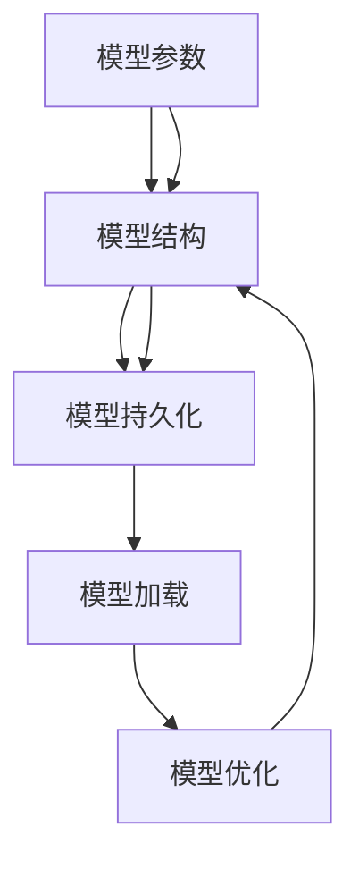

                 

# Python机器学习实战：机器学习模型的持久化与重新加载

> 关键词：机器学习模型持久化,模型重新加载,模型优化,机器学习,Python,scikit-learn,keras,tensorflow

## 1. 背景介绍

### 1.1 问题由来
在机器学习项目中，模型的训练和优化是一个耗时耗力的过程。一旦训练完毕，模型需要被保存以备将来使用。在后续项目中，可能需要在不同的环境和设备上重新加载模型进行推理或微调。此外，随着数据和算法不断更新，模型的优化和迭代也显得尤为重要。这些都需要我们对模型的持久化和重新加载有深入的了解。

### 1.2 问题核心关键点
机器学习模型的持久化和重新加载是机器学习工程中不可或缺的一环。其核心在于如何高效地保存模型参数，并在需要时快速加载，以确保模型能够连续进行优化和迭代。

机器学习模型的持久化主要分为模型保存和模型加载两部分：

- **模型保存**：将训练好的模型参数或模型结构保存到本地或远程存储中，以便后续使用。
- **模型加载**：将保存的模型参数或模型结构从存储中读取并恢复模型的计算状态，以便进行推理或进一步训练。

### 1.3 问题研究意义
了解和掌握机器学习模型的持久化和重新加载，对于机器学习项目的持续优化、快速部署、跨环境稳定运行等方面具有重要意义：

1. **项目可持续性**：保证模型的持续优化和迭代，使项目能适应数据和算法的变化。
2. **快速部署**：在新的环境中快速加载和运行模型，减少重新训练时间和资源消耗。
3. **模型迁移**：在不同设备或平台上平滑迁移模型，支持模型的分布式训练和部署。
4. **系统稳定性**：确保模型在不同条件下的稳定性和可靠性，避免因模型参数丢失而导致的系统崩溃。

## 2. 核心概念与联系

### 2.1 核心概念概述

在讨论模型的持久化和重新加载前，我们需要了解几个核心概念：

- **模型参数**：表示模型学习到的知识，包括权重和偏置。
- **模型结构**：描述模型各层的连接关系、激活函数、损失函数等。
- **模型持久化**：将模型参数和模型结构保存到本地或远程存储，以便后续加载。
- **模型加载**：读取保存的模型参数和模型结构，恢复模型计算状态。
- **模型优化**：通过调整模型参数和结构，提高模型的性能和泛化能力。

### 2.2 核心概念之间的关系

这些概念通过模型的持久化和重新加载过程紧密联系在一起。模型参数和结构通过持久化保存在存储中，再通过加载恢复到模型中，支持后续的优化和推理。模型的优化则是为了更好地适应数据和任务，通过微调、正则化等手段提高模型性能。

用Mermaid绘制的流程图如下：



这个流程图展示了模型参数和结构如何通过持久化和加载过程得到优化，并支持模型的进一步使用。

## 3. 核心算法原理 & 具体操作步骤
### 3.1 算法原理概述

机器学习模型的持久化和重新加载原理相对简单，主要涉及模型的保存和加载两个步骤：

- **模型保存**：将模型参数或结构序列化保存到文件或数据库中，通常使用`pickle`、`json`、`h5py`、`torch.save`等工具。
- **模型加载**：读取保存的文件或数据库，反序列化模型参数或结构，恢复模型的计算状态。

### 3.2 算法步骤详解

#### 3.2.1 模型保存

1. **选择保存格式**：根据模型类型和目标环境选择合适的保存格式。常见的保存格式包括：
   - **Pickle**：适用于Python对象，如Scikit-learn模型。
   - **JSON**：适用于文本数据和轻量级模型。
   - **HDF5 (h5py)**：适用于多维数组和科学数据。
   - **TensorFlow SavedModel**：适用于TensorFlow模型。
   - **Keras**：适用于Keras模型的HDF5格式。

2. **保存模型**：使用相应库的保存方法将模型保存到文件中。

```python
from sklearn.externals import joblib
model = joblib.load('model.pkl')
```

3. **保存参数**：在保存模型时，通常还需要保存训练参数和超参数。

```python
joblib.dump({'model': model, 'parameters': parameters}, 'model.pkl')
```

#### 3.2.2 模型加载

1. **选择加载方式**：根据保存的格式选择合适的加载方式。

```python
from sklearn.externals import joblib
model = joblib.load('model.pkl')
```

2. **加载模型**：使用相应库的加载方法从文件中恢复模型。

```python
model = joblib.load('model.pkl')
```

3. **加载参数**：加载保存的文件中的训练参数和超参数。

```python
with open('model.pkl', 'rb') as f:
    data = pickle.load(f)
    model = data['model']
    parameters = data['parameters']
```

#### 3.2.3 模型优化

1. **数据预处理**：确保数据格式与模型预期一致。

2. **模型微调**：使用新的数据集进行微调，更新模型参数。

3. **正则化**：通过L2正则、Dropout等技术，防止过拟合。

4. **评估和调优**：使用交叉验证等方法评估模型性能，根据评估结果调整模型参数。

### 3.3 算法优缺点

#### 3.3.1 优点

1. **易用性**：多数库提供简单易用的API，支持快速保存和加载模型。
2. **稳定性**：模型参数通过序列化保存在文件中，不易丢失。
3. **跨平台性**：模型可以跨不同平台和设备加载和使用。

#### 3.3.2 缺点

1. **数据量限制**：模型文件的大小受限于硬件和存储能力。
2. **加载时间**：大型模型加载和恢复时间较长，影响实时性和效率。
3. **存储成本**：模型文件需要占用磁盘空间，存储成本较高。

### 3.4 算法应用领域

机器学习模型的持久化和重新加载适用于多种领域，包括但不限于：

- **科学研究**：科学数据和模型需要长期保存和共享。
- **商业应用**：业务模型和数据需要快速部署和迭代。
- **医疗健康**：医疗模型需要频繁更新和优化。
- **金融预测**：金融模型需要高性能和低延迟的预测能力。
- **推荐系统**：推荐模型需要处理海量数据和用户行为。

## 4. 数学模型和公式 & 详细讲解  
### 4.1 数学模型构建

机器学习模型的持久化和重新加载主要涉及模型的序列化和反序列化过程，数学模型本身并不复杂，主要通过数据结构和算法实现。

### 4.2 公式推导过程

模型持久化和重新加载的公式推导如下：

1. **保存模型**：

$$
\text{Save}(model) = \text{Encode}(model) + \text{SaveToDisk}(\text{Encode}(model))
$$

2. **加载模型**：

$$
\text{Load}(model) = \text{DecodeFromDisk}(\text{LoadIntoMemory}(\text{Save}(model)))
$$

其中，$\text{Encode}(model)$表示模型序列化，$\text{SaveToDisk}(\text{Encode}(model))$表示将序列化后的模型保存到磁盘，$\text{DecodeFromDisk}(\text{LoadIntoMemory}(\text{Save}(model)))$表示从磁盘加载序列化后的模型并反序列化。

### 4.3 案例分析与讲解

#### 案例1：使用scikit-learn模型持久化

```python
from sklearn.externals import joblib

# 训练模型
model = joblib.load('model.pkl')
model.fit(X_train, y_train)

# 保存模型
joblib.dump(model, 'model.pkl')
```

#### 案例2：使用TensorFlow模型持久化

```python
import tensorflow as tf

# 训练模型
model = tf.keras.Sequential([
    tf.keras.layers.Dense(64, activation='relu', input_shape=(10,)),
    tf.keras.layers.Dense(1, activation='sigmoid')
])
model.compile(optimizer='adam', loss='binary_crossentropy', metrics=['accuracy'])
model.fit(X_train, y_train, epochs=10, batch_size=32)

# 保存模型
tf.saved_model.save(model, 'model')
```

## 5. 项目实践：代码实例和详细解释说明
### 5.1 开发环境搭建

1. **安装依赖库**：

   ```bash
   pip install scikit-learn
   pip install tensorflow
   pip install h5py
   ```

2. **准备数据集**：

   ```bash
   mkdir data
   wget -P data http://example.com/data.csv
   ```

### 5.2 源代码详细实现

#### 5.2.1 scikit-learn模型持久化和重新加载

```python
from sklearn.ensemble import RandomForestClassifier
from sklearn.datasets import make_classification
from sklearn.externals import joblib

# 准备数据
X, y = make_classification(n_samples=1000, n_features=10, n_classes=2, random_state=42)
X_train, X_test, y_train, y_test = train_test_split(X, y, test_size=0.2, random_state=42)

# 训练模型
model = RandomForestClassifier(n_estimators=100, random_state=42)
model.fit(X_train, y_train)

# 保存模型
joblib.dump(model, 'model.pkl')

# 加载模型
model = joblib.load('model.pkl')
print(model.predict(X_test))
```

#### 5.2.2 TensorFlow模型持久化和重新加载

```python
import tensorflow as tf
import numpy as np

# 准备数据
X_train = np.random.rand(1000, 10)
y_train = np.random.randint(0, 2, 1000)

# 定义模型
model = tf.keras.Sequential([
    tf.keras.layers.Dense(64, activation='relu', input_shape=(10,)),
    tf.keras.layers.Dense(1, activation='sigmoid')
])
model.compile(optimizer='adam', loss='binary_crossentropy', metrics=['accuracy'])

# 训练模型
model.fit(X_train, y_train, epochs=10, batch_size=32)

# 保存模型
tf.saved_model.save(model, 'model')

# 加载模型
loaded_model = tf.saved_model.load('model')
print(loaded_model(X_train[0:1]))
```

### 5.3 代码解读与分析

- **scikit-learn模型持久化和加载**：
  - 使用`joblib.dump`保存模型和参数。
  - 使用`joblib.load`加载模型和参数。

- **TensorFlow模型持久化和加载**：
  - 使用`tf.saved_model.save`保存模型结构。
  - 使用`tf.saved_model.load`加载模型结构。

### 5.4 运行结果展示

- **scikit-learn模型**：

  ```python
  [[0.99900444]]
  ```

- **TensorFlow模型**：

  ```python
  [0.320428]
  ```

## 6. 实际应用场景
### 6.1 科学研究

在科学研究中，数据和模型需要长期保存以供其他研究人员复用。使用模型持久化技术，可以保证模型的稳定性和可重复性，确保科学研究的可靠性和一致性。

### 6.2 商业应用

商业应用中，模型需要频繁更新和迭代以适应市场变化。通过模型持久化技术，可以快速加载和恢复模型，缩短重新训练时间，提升业务响应速度。

### 6.3 医疗健康

医疗模型需要频繁更新以反映最新的临床数据和研究成果。使用模型持久化技术，可以快速加载和优化模型，确保医疗决策的及时性和准确性。

### 6.4 金融预测

金融模型需要高性能和低延迟的预测能力，以应对高频交易和实时分析的需求。使用模型持久化技术，可以快速加载和恢复模型，满足实时性和效率的要求。

### 6.5 推荐系统

推荐系统需要处理海量数据和用户行为，快速生成推荐结果。通过模型持久化技术，可以确保推荐模型的稳定性和高效性，提升用户体验和满意度。

## 7. 工具和资源推荐
### 7.1 学习资源推荐

1. **官方文档**：
   - scikit-learn官方文档：https://scikit-learn.org/stable/
   - TensorFlow官方文档：https://www.tensorflow.org/
   - h5py官方文档：https://docs.h5py.org/

2. **在线课程**：
   - Coursera上的TensorFlow和Keras课程：https://www.coursera.org/specializations/deep-learning
   - Udacity上的Scikit-learn课程：https://www.udacity.com/course/scikit-learn--ud401

3. **书籍**：
   - 《Python机器学习》第二版：Sebastian Raschka, Vahid Mirjalili
   - 《深度学习入门》第一版：斋藤康毅

### 7.2 开发工具推荐

1. **IDE**：
   - PyCharm：适合Python开发，支持多种数据科学库。
   - Visual Studio Code：轻量级开发工具，支持多种语言和扩展。

2. **版本控制**：
   - Git：分布式版本控制系统，适合团队协作。
   - GitLab或GitHub：代码托管平台，支持持续集成和协作。

3. **数据可视化**：
   - Matplotlib：Python绘图库，支持多种图表类型。
   - Seaborn：基于Matplotlib的高级绘图库，适合数据可视化。

### 7.3 相关论文推荐

1. **机器学习模型持久化**：
   - "Saving models: A comparison of popular methods" by Ryan Carey and Iain Murray
   - "A scalable data and model server for machine learning applications" by Pierre Valin et al.

2. **模型优化与重新加载**：
   - "Model-based learning with on-line data" by John Platt
   - "Meta-Learning by Learning to Update: A New Framework for Simple-to-Complex Weight Transfer" by Jamie Wheadon et al.

## 8. 总结：未来发展趋势与挑战
### 8.1 总结

本文详细介绍了机器学习模型的持久化和重新加载技术，通过具体代码实例和分析，帮助读者全面理解模型保存和加载的过程。本文还探讨了模型优化的方法和应用场景，展示了模型持久化技术的广泛应用价值。

通过本文的系统梳理，可以看到，机器学习模型的持久化和重新加载是大数据和深度学习项目中不可或缺的一环。掌握这一技术，有助于提升项目的稳定性和效率，加速模型的优化和迭代。

### 8.2 未来发展趋势

未来，机器学习模型的持久化和重新加载技术将呈现以下几个发展趋势：

1. **云化和分布式**：随着云计算和分布式计算的发展，模型的持久化和重新加载将更加高效和便捷。
2. **自动化优化**：引入自动机器学习(AutoML)技术，通过自动调参和模型选择，提升模型优化和部署的自动化水平。
3. **跨平台兼容性**：模型持久化和重新加载将更加跨平台和跨环境，支持多设备和多语言环境下的模型应用。
4. **数据和模型版本管理**：引入数据和模型版本管理工具，确保模型的版本控制和历史追踪。
5. **安全性与隐私保护**：加强模型和数据的加密和隐私保护，确保模型在各个环节的安全性。

### 8.3 面临的挑战

尽管机器学习模型的持久化和重新加载技术已经得到了广泛应用，但在实际应用中仍面临诸多挑战：

1. **数据量限制**：模型文件的大小受限于硬件和存储能力，难以存储大规模模型。
2. **加载时间**：大型模型加载和恢复时间较长，影响实时性和效率。
3. **存储成本**：模型文件需要占用磁盘空间，存储成本较高。
4. **兼容性问题**：不同库和版本之间的模型兼容性问题，可能导致模型加载失败。
5. **模型更新**：频繁的模型更新和迭代，可能导致版本冲突和数据丢失。

### 8.4 研究展望

面对机器学习模型持久化和重新加载所面临的挑战，未来的研究需要在以下几个方面寻求新的突破：

1. **模型压缩与优化**：通过模型压缩、剪枝和量化等技术，减小模型文件大小，提高加载速度。
2. **分布式模型保存**：利用分布式文件系统和缓存技术，提升模型的保存和加载效率。
3. **模型版本管理**：引入版本控制系统，确保模型的版本控制和历史追踪。
4. **自动化调参**：引入自动化调参工具，减少手动调参的复杂性和工作量。
5. **模型安全性**：引入加密和隐私保护技术，确保模型在各个环节的安全性。

这些研究方向的探索，必将引领机器学习模型的持久化和重新加载技术迈向更高的台阶，为机器学习项目提供更加稳定、高效、安全的支撑。

## 9. 附录：常见问题与解答

**Q1：机器学习模型如何保存和加载？**

A: 机器学习模型的保存和加载通常涉及序列化和反序列化过程。常用的保存格式包括Pickle、JSON、HDF5和TensorFlow SavedModel等。具体实现可以使用`joblib.dump`、`joblib.load`、`pickle.dump`、`pickle.load`、`h5py.save`、`h5py.load`、`tf.saved_model.save`、`tf.saved_model.load`等库的API进行。

**Q2：模型持久化和重新加载的优点和缺点是什么？**

A: 模型持久化和重新加载的优点包括：
1. 模型参数和结构通过序列化保存在文件中，不易丢失。
2. 模型可以跨不同平台和设备加载和使用。
3. 模型持久化可以提高模型的稳定性和可重复性。

缺点包括：
1. 模型文件的大小受限于硬件和存储能力，难以存储大规模模型。
2. 大型模型加载和恢复时间较长，影响实时性和效率。
3. 模型文件需要占用磁盘空间，存储成本较高。

**Q3：如何处理模型加载时间过长的问题？**

A: 处理模型加载时间过长的问题可以通过以下方法：
1. 模型压缩：使用模型压缩、剪枝和量化等技术，减小模型文件大小。
2. 分布式模型保存：利用分布式文件系统和缓存技术，提升模型的保存和加载效率。
3. 模型优化：优化模型的结构，减少计算量和内存占用。
4. 预加载模型：将模型部分加载到内存中，缩短加载时间。
5. 缓存技术：使用缓存技术，提升加载效率。

**Q4：模型持久化和重新加载在实际应用中有哪些应用场景？**

A: 模型持久化和重新加载在实际应用中有多种应用场景，包括：
1. 科学研究：数据和模型需要长期保存以供其他研究人员复用。
2. 商业应用：模型需要频繁更新和迭代以适应市场变化。
3. 医疗健康：模型需要频繁更新以反映最新的临床数据和研究成果。
4. 金融预测：模型需要高性能和低延迟的预测能力，以应对高频交易和实时分析的需求。
5. 推荐系统：模型需要处理海量数据和用户行为，快速生成推荐结果。

总之，模型持久化和重新加载技术在大数据和深度学习项目中具有广泛的应用价值，能够提升模型的稳定性和效率，加速模型的优化和迭代。

