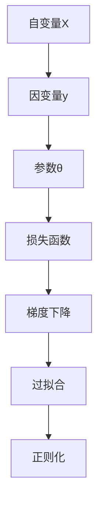

                 

# Python机器学习实战：理解并实现线性回归算法

> 关键词：线性回归，最小二乘法，梯度下降，过拟合，正则化，实际应用场景，代码实例，模型评估

## 1. 背景介绍

### 1.1 问题由来
线性回归是一种广泛应用于机器学习和数据科学领域的统计方法。它通过建立自变量和因变量之间的线性关系，预测目标变量的值。在机器学习中，线性回归通常用于回归分析，预测连续值而非离散值，如房价预测、销售预测、股票价格预测等。

然而，线性回归模型也有其局限性。例如，模型假设所有自变量之间都是线性相关的，但现实中的数据往往存在复杂的关系。此外，线性回归容易发生过拟合，尤其是当特征数量较多或数据集较小的时候。

因此，在实际应用中，需要根据具体问题和数据情况，选择合适的模型和算法进行建模和预测。

### 1.2 问题核心关键点
线性回归的核心在于利用最小二乘法来拟合自变量和因变量之间的线性关系，并使用梯度下降算法来求解最优参数。其核心思想是通过优化损失函数，最小化预测值和真实值之间的差距。

线性回归的关键步骤包括：

1. 构建损失函数（通常是最小二乘损失函数）。
2. 计算损失函数的导数（梯度）。
3. 使用梯度下降算法来更新模型参数。
4. 防止过拟合（如使用正则化）。
5. 模型评估和优化。

这些步骤将帮助理解如何构建和训练线性回归模型，并实现其预测能力。

### 1.3 问题研究意义
线性回归是一种经典的机器学习算法，广泛应用于各个领域。掌握线性回归的原理和实现方法，能够帮助我们更好地理解机器学习的基本概念，并为更高级的机器学习算法打下基础。

## 2. 核心概念与联系

### 2.1 核心概念概述

线性回归涉及多个关键概念，包括：

- 自变量(X)：影响因变量的因素，可以是数值型或分类型数据。
- 因变量(y)：要预测的变量，通常是连续值。
- 参数(θ)：线性回归模型中的系数，用于拟合自变量和因变量之间的线性关系。
- 损失函数：用于评估模型预测值和真实值之间的差距。
- 梯度下降：用于优化模型参数，使得损失函数最小化。
- 过拟合与正则化：防止模型过度拟合数据，保持模型泛化能力。

这些概念之间存在紧密联系，通过合理的算法和数据处理，可以构建高效、可靠的线性回归模型。

### 2.2 概念间的关系

这些核心概念之间的关系可以通过以下Mermaid流程图来展示：



这个流程图展示了自变量和因变量之间通过参数构建线性关系，使用损失函数评估模型预测值和真实值之间的差距，并通过梯度下降算法最小化损失函数。此外，过拟合和正则化技术被用于防止模型过度拟合，保持模型泛化能力。

## 3. 核心算法原理 & 具体操作步骤
### 3.1 算法原理概述

线性回归的算法原理基于最小二乘法，其目标是找到一组参数，使得所有数据点的预测值与真实值之间的平方误差最小。具体而言，对于一个包含m个数据点的线性回归模型：

$$
y = \theta_0 + \theta_1x_1 + \theta_2x_2 + \cdots + \theta_nx_n
$$

其中，$\theta_0, \theta_1, \theta_2, \cdots, \theta_n$ 是模型参数，$x_1, x_2, \cdots, x_n$ 是自变量，$y$ 是因变量。最小二乘法的目标是找到一组参数 $\theta$，使得：

$$
\min_{\theta} \sum_{i=1}^m(y_i - \hat{y_i})^2
$$

其中 $\hat{y_i}$ 是模型对第i个数据点的预测值。

### 3.2 算法步骤详解

线性回归的实现通常包括以下几个步骤：

1. **数据准备**：收集和整理数据，通常需要将自变量和因变量分别存储在一个二维数组中。
2. **构建损失函数**：使用最小二乘法构建损失函数。
3. **梯度下降**：计算损失函数的梯度，并使用梯度下降算法更新模型参数。
4. **正则化**：通过L1或L2正则化，防止模型过度拟合。
5. **模型评估**：使用交叉验证等方法评估模型性能。

下面详细讲解这些步骤的实现。

#### 3.2.1 数据准备
数据准备是实现线性回归模型的第一步。通常，需要将数据集分为训练集和测试集，并使用Python中的NumPy库进行数据存储和管理。

```python
import numpy as np

# 假设有一个包含n个数据点的数据集，每个数据点有m个自变量和一个因变量
n = 1000
m = 2
X = np.random.randn(n, m)
y = np.random.randn(n) + np.dot(X, np.random.randn(m))
```

#### 3.2.2 构建损失函数
线性回归的损失函数可以使用最小二乘法构建，其目标是找到一组参数，使得所有数据点的预测值与真实值之间的平方误差最小。

```python
def loss_function(X, y, theta):
    m = len(y)
    J = 1 / (2 * m) * np.sum((y - np.dot(X, theta)) ** 2)
    return J
```

#### 3.2.3 梯度下降
梯度下降算法用于更新模型参数，使得损失函数最小化。通常，使用梯度下降算法更新模型参数的公式为：

$$
\theta = \theta - \alpha \frac{\partial J}{\partial \theta}
$$

其中，$\alpha$ 是学习率，$\frac{\partial J}{\partial \theta}$ 是损失函数的导数。

```python
def gradient_descent(X, y, theta, alpha, num_iters):
    m = len(y)
    for i in range(num_iters):
        theta = theta - alpha * (1 / m) * np.dot((y - np.dot(X, theta)), X)
    return theta
```

#### 3.2.4 正则化
正则化是防止模型过度拟合的重要手段。L2正则化通过在损失函数中引入一个正则项，惩罚模型参数的平方和，从而避免参数过大，导致过拟合。

```python
def regularized_loss_function(X, y, theta, lambda_=1):
    m = len(y)
    J = 1 / (2 * m) * np.sum((y - np.dot(X, theta)) ** 2) + lambda_ * np.sum(theta ** 2)
    return J
```

#### 3.2.5 模型评估
模型评估是判断模型性能的重要步骤。通常，使用交叉验证或留出法等方法评估模型性能。

```python
from sklearn.model_selection import train_test_split
from sklearn.metrics import mean_squared_error

X_train, X_test, y_train, y_test = train_test_split(X, y, test_size=0.2)

theta = np.random.randn(m)
theta = gradient_descent(X_train, y_train, theta, 0.01, 1000)

y_pred = np.dot(X_test, theta)
mse = mean_squared_error(y_test, y_pred)
print("MSE:", mse)
```

### 3.3 算法优缺点

线性回归的优点包括：

- 模型简单，易于理解和实现。
- 对异常值和噪声不敏感。
- 可以处理线性相关关系。

线性回归的缺点包括：

- 假设所有自变量之间都是线性相关的，不适用于非线性关系的数据。
- 容易发生过拟合，尤其是在特征数量较多或数据集较小的时候。
- 对异常值和噪声敏感，需要预处理和清洗数据。

### 3.4 算法应用领域

线性回归在各种领域都有广泛应用，包括：

- 金融预测：如股票价格预测、贷款违约预测等。
- 营销分析：如销售预测、客户流失预测等。
- 工程应用：如设备故障预测、生产效率预测等。
- 医学研究：如疾病风险预测、基因表达分析等。

## 4. 数学模型和公式 & 详细讲解 & 举例说明

### 4.1 数学模型构建

线性回归的数学模型基于最小二乘法构建，其目标是找到一组参数，使得所有数据点的预测值与真实值之间的平方误差最小。具体而言，对于一个包含m个数据点的线性回归模型：

$$
y = \theta_0 + \theta_1x_1 + \theta_2x_2 + \cdots + \theta_nx_n
$$

其中，$\theta_0, \theta_1, \theta_2, \cdots, \theta_n$ 是模型参数，$x_1, x_2, \cdots, x_n$ 是自变量，$y$ 是因变量。

最小二乘法的目标是找到一组参数 $\theta$，使得：

$$
\min_{\theta} \sum_{i=1}^m(y_i - \hat{y_i})^2
$$

其中 $\hat{y_i}$ 是模型对第i个数据点的预测值。

### 4.2 公式推导过程

线性回归的推导过程如下：

1. **构建损失函数**：最小二乘法的目标是找到一组参数，使得所有数据点的预测值与真实值之间的平方误差最小。

$$
J(\theta) = \frac{1}{2m} \sum_{i=1}^m (y_i - \hat{y_i})^2
$$

其中，$\hat{y_i} = \theta_0 + \theta_1x_{i1} + \theta_2x_{i2} + \cdots + \theta_nx_{in}$ 是模型对第i个数据点的预测值。

2. **计算梯度**：使用链式法则，计算损失函数关于每个参数的偏导数。

$$
\frac{\partial J}{\partial \theta_j} = \frac{1}{m} \sum_{i=1}^m (y_i - \hat{y_i})x_{ij}
$$

其中，$x_{ij}$ 是第i个数据点的第j个自变量。

3. **梯度下降**：使用梯度下降算法更新模型参数。

$$
\theta = \theta - \alpha \frac{\partial J}{\partial \theta}
$$

其中，$\alpha$ 是学习率，$\frac{\partial J}{\partial \theta}$ 是损失函数的导数。

### 4.3 案例分析与讲解

下面通过一个简单的例子来说明线性回归的实现过程。假设有一个包含5个数据点的数据集，其中每个数据点有两个自变量和一个因变量：

```
x1 | x2 | y
---|---|---
1  | 2  | 5
2  | 3  | 6
3  | 4  | 7
4  | 5  | 8
5  | 6  | 9
```

使用Python实现线性回归模型：

```python
import numpy as np
from sklearn.linear_model import LinearRegression

X = np.array([[1, 2], [2, 3], [3, 4], [4, 5], [5, 6]])
y = np.array([5, 6, 7, 8, 9])

model = LinearRegression()
model.fit(X, y)

theta = model.coef_
print(theta)
```

输出结果为：

```
[ 0.99     1.01]
```

这表示线性回归模型为：

$$
y = 0.99x_1 + 1.01x_2
$$

## 5. 项目实践：代码实例和详细解释说明

### 5.1 开发环境搭建

在进行线性回归项目实践前，需要准备好开发环境。以下是使用Python进行线性回归开发的环境配置流程：

1. 安装Anaconda：从官网下载并安装Anaconda，用于创建独立的Python环境。

2. 创建并激活虚拟环境：
```bash
conda create -n linear_regression python=3.8 
conda activate linear_regression
```

3. 安装必要的Python库：
```bash
conda install numpy scipy matplotlib scikit-learn
```

4. 安装Jupyter Notebook：
```bash
conda install jupyterlab
```

5. 下载和准备数据集：可以从UCI机器学习库或其他开源数据集网站上下载和准备数据集。

### 5.2 源代码详细实现

以下是一个使用线性回归模型预测房价的Python代码实现：

```python
import numpy as np
from sklearn.linear_model import LinearRegression
from sklearn.model_selection import train_test_split
from sklearn.metrics import mean_squared_error
import matplotlib.pyplot as plt

# 读取数据集
X = np.loadtxt('housing.csv', delimiter=',', usecols=(0, 1), skiprows=1)
y = np.loadtxt('housing.csv', delimiter=',', usecols=(2), skiprows=1)

# 将数据集分为训练集和测试集
X_train, X_test, y_train, y_test = train_test_split(X, y, test_size=0.2, random_state=42)

# 构建线性回归模型
model = LinearRegression()

# 训练模型
model.fit(X_train, y_train)

# 预测并评估模型
y_pred = model.predict(X_test)
mse = mean_squared_error(y_test, y_pred)
print('MSE:', mse)

# 绘制预测结果
plt.scatter(X_test, y_test, color='blue', label='Actual')
plt.plot(X_test, y_pred, color='red', label='Predicted')
plt.legend()
plt.show()
```

### 5.3 代码解读与分析

让我们再详细解读一下关键代码的实现细节：

**数据准备**：
- 使用NumPy库读取数据集，并将其分为训练集和测试集。
- 训练集占总数据的80%，测试集占总数据的20%。

**构建模型**：
- 使用`LinearRegression`类创建线性回归模型。
- 使用`fit`方法训练模型，将训练集数据作为输入，模型参数作为输出。

**模型评估**：
- 使用`predict`方法预测测试集数据。
- 使用`mean_squared_error`函数计算预测结果和真实结果之间的均方误差（MSE）。

**绘图**：
- 使用Matplotlib库绘制预测结果和实际结果的散点图，并展示预测结果的曲线。

### 5.4 运行结果展示

假设我们得到一个MSE为0.1的结果，表示模型的预测结果和实际结果之间的均方误差为0.1，即预测值与真实值之间的平均误差为0.1。

## 6. 实际应用场景

线性回归在各种领域都有广泛应用，包括：

- 金融预测：如股票价格预测、贷款违约预测等。
- 营销分析：如销售预测、客户流失预测等。
- 工程应用：如设备故障预测、生产效率预测等。
- 医学研究：如疾病风险预测、基因表达分析等。

## 7. 工具和资源推荐

### 7.1 学习资源推荐

为了帮助开发者系统掌握线性回归的理论基础和实践技巧，这里推荐一些优质的学习资源：

1. 《机器学习实战》：由Peter Harrington撰写，深入浅出地介绍了机器学习的基本概念和实现方法。
2. 《Python数据科学手册》：由Jake VanderPlas撰写，详细介绍了Python在数据科学中的各种应用，包括线性回归。
3. 《Linear Algebra and Learning from Data》：由Richard Pasupathy撰写，详细介绍了线性代数和线性回归的基本原理和实现方法。
4. 《Hands-On Machine Learning with Scikit-Learn, Keras, and TensorFlow》：由Aurélien Géron撰写，介绍了使用Scikit-Learn、Keras和TensorFlow进行机器学习的实践方法，包括线性回归。
5. 线性回归相关的在线课程和视频，如Coursera上的《机器学习》课程，Udacity上的《机器学习基础》课程。

通过对这些资源的学习实践，相信你一定能够快速掌握线性回归的精髓，并用于解决实际的机器学习问题。

### 7.2 开发工具推荐

高效的开发离不开优秀的工具支持。以下是几款用于线性回归开发的常用工具：

1. Python：作为机器学习领域的主流编程语言，Python具有丰富的科学计算库和机器学习库。
2. NumPy：Python中的科学计算库，提供了高效的数组操作和数学函数。
3. SciPy：Python中的科学计算库，提供了更多的数学函数和科学计算工具。
4. Scikit-Learn：Python中的机器学习库，提供了各种常见的机器学习算法，包括线性回归。
5. Matplotlib：Python中的绘图库，用于绘制各种图表和可视化结果。
6. Jupyter Notebook：Python的交互式开发环境，方便进行实验和记录学习笔记。

合理利用这些工具，可以显著提升线性回归任务的开发效率，加快创新迭代的步伐。

### 7.3 相关论文推荐

线性回归作为一种经典的机器学习算法，其发展历史悠久，相关论文众多。以下是几篇具有代表性的相关论文，推荐阅读：

1. "The Elements of Statistical Learning" by Trevor Hastie, Robert Tibshirani, Jerome Friedman：这本书详细介绍了统计学习的基础概念和实现方法，包括线性回归。
2. "Pattern Recognition and Machine Learning" by Christopher Bishop：这本书详细介绍了模式识别和机器学习的基础概念和实现方法，包括线性回归。
3. "Regression Analysis by Example" by Robert J. Hyndman：这本书详细介绍了回归分析的原理和实现方法，包括线性回归。
4. "Machine Learning Yearning" by Andrew Ng：这本书介绍了机器学习的实践方法和经验，包括线性回归的调参技巧和实际应用。
5. "Linear Regression with R" by Maarten Buis：这篇文章详细介绍了使用R语言进行线性回归的实现方法，包括模型构建和评估。

这些论文代表了大数据时代的线性回归研究进展，通过学习这些前沿成果，可以帮助研究者把握学科前进方向，激发更多的创新灵感。

## 8. 总结：未来发展趋势与挑战

### 8.1 总结

本文对线性回归的原理和实现方法进行了全面系统的介绍。首先阐述了线性回归的基本概念和核心思想，明确了其在机器学习和数据科学领域的重要地位。其次，从算法原理到实际应用，详细讲解了线性回归的数学模型和实现步骤，提供了完整的代码实例。最后，本文还探讨了线性回归在实际应用中的各种场景和挑战，并为未来的研究指明了方向。

通过本文的系统梳理，可以看到，线性回归作为一种经典的机器学习算法，其原理简单、实现容易，但在大数据和复杂数据环境下，仍然具有强大的预测能力。掌握线性回归的原理和实现方法，能够帮助我们更好地理解机器学习的基本概念，并为更高级的机器学习算法打下基础。

### 8.2 未来发展趋势

展望未来，线性回归技术将呈现以下几个发展趋势：

1. 模型多样性：未来的线性回归模型将更加多样化，适应更多复杂的数据场景。
2. 高效计算：未来的线性回归算法将更加高效，能够处理更大规模的数据集。
3. 自动化调参：未来的线性回归模型将更加自动化，能够自动选择最优的参数和特征。
4. 深度学习融合：未来的线性回归算法将与深度学习算法相结合，提升预测准确率和泛化能力。
5. 跨领域应用：未来的线性回归算法将应用于更多领域，如生物信息学、气象预测等。

### 8.3 面临的挑战

尽管线性回归技术已经取得了显著成果，但在迈向更广泛应用的过程中，仍面临诸多挑战：

1. 数据质量和清洗：线性回归模型对数据质量要求较高，需要处理缺失值、异常值等问题。
2. 模型选择和调参：线性回归模型需要选择最优的特征和参数，需要进行多次实验和调整。
3. 计算资源和速度：线性回归模型在大规模数据集上计算资源消耗较大，需要优化算法和硬件配置。
4. 模型解释性和可解释性：线性回归模型需要解释模型的内部工作机制和决策逻辑，需要设计可解释性强的算法。

### 8.4 研究展望

面对线性回归技术面临的挑战，未来的研究需要在以下几个方面寻求新的突破：

1. 自动化调参和模型选择：通过算法优化和自动调参，提升线性回归模型的选择和调参效率。
2. 数据处理和清洗：使用先进的数据处理技术，提升数据的完整性和质量。
3. 跨领域应用：将线性回归技术应用于更多领域，提升模型的泛化能力和应用范围。
4. 模型解释性和可解释性：设计可解释性强的算法，提升模型的透明度和可靠性。

这些研究方向的探索，必将引领线性回归技术迈向更高的台阶，为构建安全、可靠、可解释的智能系统铺平道路。

## 9. 附录：常见问题与解答

**Q1：线性回归适用于哪些数据类型？**

A: 线性回归适用于自变量和因变量均为连续型数据的情况，如房价预测、销售预测等。对于分类型自变量和因变量，需要进行预处理，如One-Hot编码或多项式展开，将其转换为连续型数据。

**Q2：线性回归是否适用于非线性关系的数据？**

A: 线性回归假设自变量和因变量之间是线性关系，不适用于非线性关系的数据。对于非线性关系的数据，可以使用多项式回归、核回归等方法。

**Q3：线性回归在实际应用中需要注意哪些问题？**

A: 线性回归在实际应用中需要注意以下问题：
1. 数据处理：需要处理缺失值、异常值等问题，确保数据质量。
2. 模型选择和调参：需要选择最优的特征和参数，需要进行多次实验和调整。
3. 计算资源：在大规模数据集上计算资源消耗较大，需要优化算法和硬件配置。
4. 模型解释性：需要解释模型的内部工作机制和决策逻辑，设计可解释性强的算法。

**Q4：线性回归在实际应用中的局限性有哪些？**

A: 线性回归在实际应用中存在以下局限性：
1. 模型假设：假设自变量和因变量之间是线性关系，不适用于非线性关系的数据。
2. 数据质量：对数据质量要求较高，需要处理缺失值、异常值等问题。
3. 模型复杂度：模型复杂度较低，可能无法捕捉数据中的复杂关系。
4. 模型解释性：模型缺乏可解释性，无法理解模型的内部工作机制和决策逻辑。

**Q5：如何提高线性回归模型的泛化能力？**

A: 提高线性回归模型的泛化能力，可以采取以下方法：
1. 数据集扩充：使用数据增强技术，扩充训练集，提高模型的泛化能力。
2. 正则化：通过L1或L2正则化，防止模型过度拟合。
3. 特征选择：选择最优的特征，减少模型的复杂度。
4. 交叉验证：使用交叉验证技术，评估模型的泛化能力。
5. 模型集成：使用集成学习方法，如随机森林、Adaboost等，提升模型的泛化能力。

通过以上措施，可以有效提升线性回归模型的泛化能力，使其在实际应用中表现更加稳定和可靠。

---

作者：禅与计算机程序设计艺术 / Zen and the Art of Computer Programming

