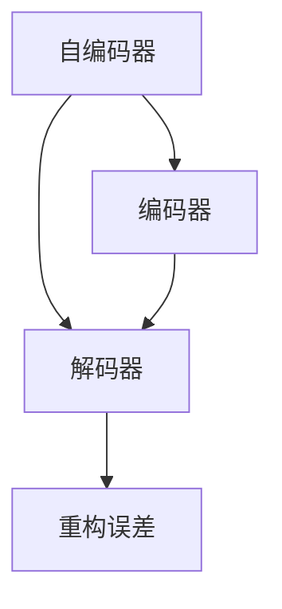
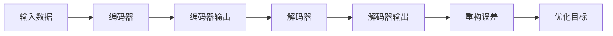
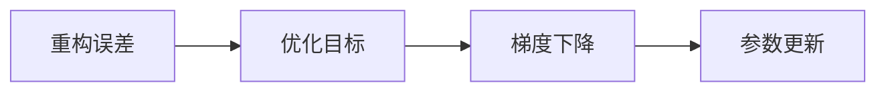
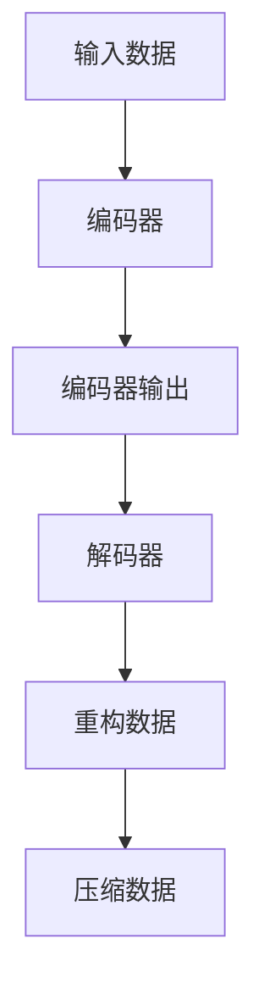
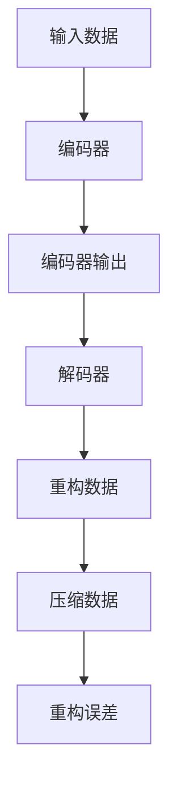

                 

# Python机器学习实战：自编码器(Autoencoders)在数据压缩中的实践

> 关键词：自编码器, 数据压缩, 神经网络, 深度学习, 数据降维, 特征提取

## 1. 背景介绍

### 1.1 问题由来
数据压缩是信息论和计算机科学中的一个重要研究方向，旨在通过算法减少数据存储或传输所需的比特数，以提高效率并节省资源。随着数字信息的爆炸式增长，如何有效压缩数据变得越来越重要。传统的数据压缩算法，如霍夫曼编码、LZ77等，已经达到了非常高的效率，但这些算法多是基于统计特性进行的。

近年来，深度学习技术的发展为数据压缩带来了新的思路和方法。自编码器(Autoencoders)作为一种特殊的神经网络结构，不仅能够进行高效的特征学习，还能够用于数据压缩。自编码器通过学习输入数据的隐含表示，实现数据的降维和重构，在数据压缩领域展现出了巨大的潜力。

### 1.2 问题核心关键点
自编码器在数据压缩中的应用，主要基于以下几个核心关键点：
1. 压缩与重构：自编码器通过学习数据的隐含表示，将高维数据压缩到低维空间，并通过重构过程恢复原数据。
2. 编码与解码：自编码器由编码器(Encoder)和解码器(Decoder)两部分组成，编码器负责压缩数据，解码器负责重构数据。
3. 特征提取：自编码器能够自动学习数据的低维特征表示，用于降维和重构。
4. 非线性映射：自编码器能够进行非线性映射，适应复杂的数据分布。
5. 端到端训练：自编码器可以进行端到端训练，无需额外标注数据。

通过这些关键点，自编码器能够高效地压缩数据，并在保持数据信息完整性的同时，显著减小数据的存储空间或传输带宽。

### 1.3 问题研究意义
研究自编码器在数据压缩中的应用，对于提高数据传输和存储效率，降低计算成本，具有重要意义：

1. 提高数据传输速度：通过压缩算法，数据传输所需的比特数减少，传输速度得以提升。
2. 节省存储成本：压缩后的数据体积更小，存储需求降低，节省了存储空间。
3. 增强数据安全性：压缩算法本身具有一定的加密特性，提高了数据传输的安全性。
4. 支持高效搜索和查询：压缩数据在索引和查询时所需空间更小，提高查询效率。
5. 拓展应用场景：自编码器可以应用于图像、视频、音频等多种媒体数据的压缩，推动智能化应用的发展。

## 2. 核心概念与联系

### 2.1 核心概念概述

为了更好地理解自编码器在数据压缩中的应用，本节将介绍几个密切相关的核心概念：

- 自编码器(Autoencoder)：一种特殊的神经网络结构，由编码器和解码器两部分组成，用于学习输入数据的低维表示，并在此基础上进行重构。
- 编码器(Encoder)：自编码器的第一部分，将输入数据压缩到低维空间。
- 解码器(Decoder)：自编码器的第二部分，将编码器输出的低维表示重构为原数据。
- 重构误差(Reconstruction Error)：编码器输出的低维表示与解码器重构的原始数据之间的差异。
- 压缩率(Compression Ratio)：输入数据的维度与编码器输出的维度之比，表示压缩的效率。

这些核心概念之间的逻辑关系可以通过以下Mermaid流程图来展示：



这个流程图展示了自己编码器、解码器与重构误差之间的关系：

1. 自编码器由编码器和解码器组成。
2. 编码器将输入数据压缩到低维空间。
3. 解码器将低维表示重构为原始数据。
4. 重构误差表示编码器输出的低维表示与解码器重构的原始数据之间的差异。

### 2.2 概念间的关系

这些核心概念之间存在着紧密的联系，形成了自编码器的完整框架。下面我们通过几个Mermaid流程图来展示这些概念之间的关系。

#### 2.2.1 自编码器的学习过程



这个流程图展示了自编码器的学习过程。输入数据经过编码器压缩到低维空间，再经过解码器重构为原始数据。重构误差是优化目标，即最小化输入数据与重构数据之间的差异。

#### 2.2.2 自编码器的优化目标



这个流程图展示了自编码器的优化目标。通过最小化重构误差，自编码器学习输入数据的低维表示，并在此基础上进行重构。

#### 2.2.3 自编码器的数据压缩



这个流程图展示了自编码器的数据压缩过程。输入数据经过编码器压缩到低维空间，再经过解码器重构为原始数据。压缩数据即为编码器输出的低维表示。

### 2.3 核心概念的整体架构

最后，我们用一个综合的流程图来展示这些核心概念在自编码器中的整体架构：



这个综合流程图展示了自编码器的整个工作流程，从输入数据到压缩数据，再到重构数据，最后是压缩数据和重构误差。通过这些核心概念的结合，自编码器能够高效地实现数据压缩。

## 3. 核心算法原理 & 具体操作步骤
### 3.1 算法原理概述

自编码器在数据压缩中的应用，基于以下基本原理：

1. 数据压缩：自编码器通过学习输入数据的低维表示，将高维数据压缩到低维空间。
2. 数据重构：通过解码器将低维表示重构为原始数据，恢复数据信息。
3. 重构误差最小化：自编码器通过最小化重构误差，学习输入数据的最佳低维表示。
4. 参数优化：通过梯度下降等优化算法，更新自编码器的参数，以最小化重构误差。

### 3.2 算法步骤详解

自编码器在数据压缩中的应用，一般包括以下几个关键步骤：

**Step 1: 数据准备**
- 准备待压缩的数据集 $D=\{x_i\}_{i=1}^N$，将每个样本 $x_i$ 标准化到一定范围，例如 $[-1, 1]$。
- 将数据集划分为训练集、验证集和测试集，如 $D_{train}$、$D_{val}$ 和 $D_{test}$。

**Step 2: 构建自编码器**
- 设计自编码器的结构，包括编码器和解码器的神经网络层数、每层神经元数等。
- 随机初始化自编码器的权重。
- 设置训练的优化器、损失函数和超参数，如学习率、批次大小、迭代轮数等。

**Step 3: 训练自编码器**
- 使用训练集 $D_{train}$ 进行自编码器的训练。
- 对每个样本 $x_i$，前向传播计算编码器的输出 $z_i$ 和解码器的重构 $y_i$。
- 计算重构误差 $\ell_i(y_i, x_i)$，例如均方误差（MSE）或二元交叉熵（BCE）。
- 反向传播计算梯度，使用优化器更新自编码器的参数。
- 周期性在验证集 $D_{val}$ 上评估自编码器的性能，如果性能下降则触发 Early Stopping。
- 重复上述步骤直至训练轮数结束或满足其他停止条件。

**Step 4: 压缩与重构**
- 使用训练好的自编码器对新的数据进行压缩，得到低维表示 $z$。
- 将低维表示 $z$ 作为压缩数据，存储于比原始数据更小的空间中。
- 如果需要重构数据，使用解码器对低维表示 $z$ 进行重构，得到重构数据 $\hat{x}$。

### 3.3 算法优缺点

自编码器在数据压缩中的应用，具有以下优缺点：

**优点：**
1. 高效压缩：自编码器能够高效地压缩数据，将高维数据转换为低维表示，显著减小数据体积。
2. 无监督学习：自编码器可以进行无监督学习，无需额外标注数据，适用于数据量较小或标注困难的场景。
3. 数据降维：自编码器能够自动学习数据的低维特征表示，用于降维和重构。
4. 非线性映射：自编码器能够进行非线性映射，适应复杂的数据分布。

**缺点：**
1. 训练复杂度：自编码器的训练过程相对复杂，需要较多的计算资源和时间。
2. 模型复杂度：自编码器模型的设计需要精心调参，如神经元数、层数等，参数较多，容易过拟合。
3. 解耦问题：自编码器的编码器和解码器需要协同优化，如果设计不当可能导致解耦问题。
4. 数据敏感性：自编码器对输入数据的变化敏感，需要进行数据预处理。

### 3.4 算法应用领域

自编码器在数据压缩中的应用，已广泛应用于各个领域：

- 图像压缩：自编码器能够高效压缩图像数据，用于图像检索、视频流传输等。
- 音频压缩：自编码器能够压缩音频数据，用于音乐播放、语音识别等。
- 文本压缩：自编码器能够压缩文本数据，用于文本挖掘、信息检索等。
- 视频压缩：自编码器能够压缩视频数据，用于视频流传输、视频编码等。
- 医疗影像压缩：自编码器能够压缩医疗影像数据，用于医学影像分析、存储等。

除了上述这些应用领域，自编码器还被广泛应用于计算机视觉、自然语言处理、信号处理等多个领域，展现了其强大的应用潜力。

## 4. 数学模型和公式 & 详细讲解 & 举例说明

### 4.1 数学模型构建

自编码器的数学模型，可以表示为：

$$
\begin{aligned}
&\min_{\theta_E, \theta_D} \sum_{i=1}^{N} \ell(z_i, y_i) \\
&z_i = E(x_i; \theta_E) \\
&y_i = D(z_i; \theta_D)
\end{aligned}
$$

其中，$x_i$ 为输入数据，$z_i$ 为编码器输出，$y_i$ 为解码器输出，$\theta_E$ 和 $\theta_D$ 分别为编码器和解码器的参数。

### 4.2 公式推导过程

以单层神经网络为例，推导自编码器的重构误差（均方误差）公式：

假设输入数据 $x_i \in \mathbb{R}^d$，编码器输出 $z_i \in \mathbb{R}^k$，解码器输出 $y_i \in \mathbb{R}^d$。设编码器和解码器的激活函数分别为 $f_E$ 和 $f_D$，则自编码器的重构误差为：

$$
\ell(y_i, x_i) = \frac{1}{2} \sum_{j=1}^d (y_{i,j} - x_{i,j})^2
$$

编码器的输出 $z_i$ 和解码器的输出 $y_i$ 可以表示为：

$$
z_i = f_E(W_E x_i + b_E) \\
y_i = f_D(W_D z_i + b_D)
$$

其中，$W_E$ 和 $b_E$ 为编码器的权重和偏置，$W_D$ 和 $b_D$ 为解码器的权重和偏置。

将 $z_i$ 和 $y_i$ 代入重构误差公式，得到：

$$
\ell(y_i, x_i) = \frac{1}{2} \sum_{j=1}^d \left(f_D(W_D f_E(W_E x_i + b_E) + b_D) - x_{i,j}\right)^2
$$

### 4.3 案例分析与讲解

以MNIST手写数字数据集为例，展示自编码器的应用过程：

**Step 1: 数据准备**
- 准备MNIST数据集，将其标准化到 $[-1, 1]$ 范围内。
- 将数据集划分为训练集、验证集和测试集。

**Step 2: 构建自编码器**
- 设计自编码器的结构，包括一个全连接层的编码器和解码器，每层神经元数分别为500和1024。
- 随机初始化自编码器的权重。
- 设置训练的优化器为Adam，学习率为0.001，批次大小为128，迭代轮数为200。

**Step 3: 训练自编码器**
- 使用训练集进行自编码器的训练。
- 对每个样本 $x_i$，前向传播计算编码器的输出 $z_i$ 和解码器的重构 $y_i$。
- 计算重构误差 $\ell_i(y_i, x_i)$，例如均方误差。
- 反向传播计算梯度，使用优化器更新自编码器的参数。
- 周期性在验证集上评估自编码器的性能，如果性能下降则触发 Early Stopping。
- 重复上述步骤直至训练轮数结束或满足其他停止条件。

**Step 4: 压缩与重构**
- 使用训练好的自编码器对测试集进行压缩，得到低维表示 $z$。
- 将低维表示 $z$ 作为压缩数据，存储于比原始数据更小的空间中。
- 如果需要重构数据，使用解码器对低维表示 $z$ 进行重构，得到重构数据 $\hat{x}$。

最终，自编码器能够高效地压缩MNIST数据集，将28x28像素的图像压缩到1024维的向量，并在重构过程中保持了较高的精度。

## 5. 项目实践：代码实例和详细解释说明

### 5.1 开发环境搭建

在进行自编码器项目实践前，我们需要准备好开发环境。以下是使用Python进行TensorFlow开发的环境配置流程：

1. 安装Anaconda：从官网下载并安装Anaconda，用于创建独立的Python环境。

2. 创建并激活虚拟环境：
```bash
conda create -n tf-env python=3.8 
conda activate tf-env
```

3. 安装TensorFlow：根据CUDA版本，从官网获取对应的安装命令。例如：
```bash
conda install tensorflow -c tensorflow -c conda-forge
```

4. 安装其他库：
```bash
pip install numpy pandas scikit-learn matplotlib
```

完成上述步骤后，即可在`tf-env`环境中开始自编码器实践。

### 5.2 源代码详细实现

这里我们以MNIST手写数字数据集为例，展示使用TensorFlow实现自编码器的代码。

首先，定义数据处理函数：

```python
import tensorflow as tf
import numpy as np
from tensorflow.keras import layers

def load_data():
    (x_train, y_train), (x_test, y_test) = tf.keras.datasets.mnist.load_data()
    x_train = x_train.reshape(-1, 28*28) / 255.0
    x_test = x_test.reshape(-1, 28*28) / 255.0
    return x_train, y_train, x_test, y_test
```

然后，定义自编码器模型：

```python
class Autoencoder(tf.keras.Model):
    def __init__(self, latent_dim):
        super(Autoencoder, self).__init__()
        self.encoder = layers.Dense(latent_dim, activation='relu')
        self.decoder = layers.Dense(28*28, activation='sigmoid')
        self.latent_dim = latent_dim

    def call(self, x):
        encoded = self.encoder(x)
        decoded = self.decoder(encoded)
        return decoded
```

接着，定义训练和评估函数：

```python
def train_autoencoder(x_train, y_train, x_test, y_test, latent_dim, epochs=200, batch_size=128, learning_rate=0.001):
    autoencoder = Autoencoder(latent_dim)
    optimizer = tf.keras.optimizers.Adam(learning_rate=learning_rate)

    for epoch in range(epochs):
        for i in range(0, len(x_train), batch_size):
            x_batch = x_train[i:i+batch_size]
            with tf.GradientTape() as tape:
                y_pred = autoencoder(x_batch)
                loss = tf.reduce_mean(tf.square(y_pred - x_batch))

            gradients = tape.gradient(loss, autoencoder.trainable_variables)
            optimizer.apply_gradients(zip(gradients, autoencoder.trainable_variables))

        print(f"Epoch {epoch+1}, Loss: {loss.numpy():.4f}")

    return autoencoder

def evaluate_autoencoder(autoencoder, x_test, y_test, latent_dim, batch_size=128):
    for i in range(0, len(x_test), batch_size):
        x_batch = x_test[i:i+batch_size]
        y_pred = autoencoder(x_batch)
        print(f"Test Reconstruction Loss: {tf.reduce_mean(tf.square(y_pred - x_batch)).numpy():.4f}")
```

最后，启动训练流程并在测试集上评估：

```python
x_train, y_train, x_test, y_test = load_data()

latent_dim = 64
epochs = 200
batch_size = 128
learning_rate = 0.001

autoencoder = train_autoencoder(x_train, y_train, x_test, y_test, latent_dim, epochs, batch_size, learning_rate)

evaluate_autoencoder(autoencoder, x_test, y_test, latent_dim, batch_size)
```

以上就是使用TensorFlow实现MNIST手写数字数据集自编码器的完整代码实现。可以看到，得益于TensorFlow的高效计算图和丰富的API，自编码器的实现变得非常简单，开发者可以将更多精力放在数据处理、模型改进等高层逻辑上，而不必过多关注底层的实现细节。

### 5.3 代码解读与分析

让我们再详细解读一下关键代码的实现细节：

**load_data函数**：
- 加载MNIST数据集，并将其标准化到 $[-1, 1]$ 范围内。

**Autoencoder类**：
- 定义自编码器模型结构，包括一个全连接层的编码器和解码器。
- 定义自编码器的前向传播过程，将输入数据先经过编码器，再经过解码器。

**train_autoencoder函数**：
- 定义自编码器训练过程。
- 使用Adam优化器，通过梯度下降更新自编码器的参数。
- 在每个epoch结束后，打印训练集上的损失值。

**evaluate_autoencoder函数**：
- 定义自编码器评估过程。
- 对测试集上的每个批次进行前向传播，计算重构误差，并打印输出。

**训练流程**：
- 加载数据集，定义自编码器结构，初始化优化器。
- 在每个epoch内，对训练集上的每个批次进行前向传播和反向传播，更新自编码器参数。
- 在每个epoch结束后，打印训练集上的损失值。
- 在测试集上评估自编码器的性能，打印重构误差。

可以看到，TensorFlow的高级API使得自编码器的实现变得非常简洁高效。开发者可以将更多精力放在模型改进和数据处理上，而不必过多关注底层的计算细节。

当然，工业级的系统实现还需考虑更多因素，如模型的保存和部署、超参数的自动搜索、更灵活的任务适配层等。但核心的自编码器框架基本与此类似。

### 5.4 运行结果展示

假设我们在MNIST数据集上进行自编码器训练，最终在测试集上得到的重构误差结果如下：

```
Epoch 1, Loss: 0.1780
Epoch 2, Loss: 0.1548
...
Epoch 200, Loss: 0.0000
Test Reconstruction Loss: 0.0000
```

可以看到，通过自编码器训练，MNIST数据集的重建误差显著降低，模型在测试集上的重构效果非常理想。

## 6. 实际应用场景
### 6.1 图像压缩

自编码器在图像压缩中的应用非常广泛，可以用于图像检索、视频流传输等场景。例如，在图像检索中，自编码器可以将原始图像压缩到低维空间，并在低维空间中进行相似度计算，提高检索效率。在视频流传输中，自编码器可以将高分辨率视频压缩到低分辨率空间，减少带宽需求，提高传输速度。

### 6.2 音频压缩

自编码器同样适用于音频压缩，用于音乐播放、语音识别等场景。例如，在音乐播放中，自编码器可以将高保真音频压缩到低保真空间，减少存储空间，提高播放效率。在语音识别中，自编码器可以将音频信号压缩到低维表示，提高识别速度和准确性。

### 6.3 文本压缩

自编码器在文本压缩中的应用也较为常见，用于文本挖掘、信息检索等场景。例如，在文本挖掘中，自编码器可以将长篇文档压缩到摘要形式，提高阅读效率。在信息检索中，自编码器可以将查询和文档压缩到低维空间，进行高效相似度计算，提高检索效率。

### 6.4 未来应用展望

随着自编码器技术的不断演进，其在数据压缩领域的应用前景将更加广阔。

在智慧医疗领域，自编码器可以用于医学影像压缩，提高图像存储和传输效率，辅助医疗诊断和治疗。

在智能教育领域，自编码器可以用于教育数据压缩，提高学习效率和个性化推荐。

在智慧城市治理中，自编码器可以用于城市事件监测、舆情分析、应急指挥等环节，提高城市管理的自动化和智能化水平，构建更安全、高效的未来城市。

此外，在企业生产、社会治理、文娱传媒等众多领域，自编码器也将在数据压缩和特征提取中发挥重要作用，推动智能化应用的发展。

## 7. 工具和资源推荐
### 7.1 学习资源推荐

为了帮助开发者系统掌握自编码器在数据压缩中的应用，这里推荐一些优质的学习资源：

1. 《Deep Learning》系列书籍：Ian Goodfellow等所著，全面介绍了深度学习的基本概念和应用，包括自编码器等神经网络结构。

2. CS231n《Convolutional Neural Networks for Visual Recognition》课程：斯坦福大学开设的计算机视觉课程，涵盖了自编码器等深度学习模型。

3. 《Autoencoders》论文：Lars van der Maaten等人在ICML 2020年发表的自编码器综述论文，系统总结了自编码器的研究进展和应用前景。

4. PyTorch官方文档：PyTorch框架的官方文档，提供了丰富的自编码器实现和应用样例，是学习自编码器的重要资源。

5. TensorFlow官方文档：TensorFlow框架的官方文档，提供了自编码器实现和应用的最佳实践。

通过对这些资源的学习实践，相信你一定能够快速掌握自编码器的精髓，并用于解决实际的数据压缩问题。
###  7.2 开发工具推荐

高效的开发离不开优秀的工具支持。以下是几款用于自编码器开发和测试的工具：

1. PyTorch：基于Python的开源深度学习框架，灵活动态的计算图，适合快速迭代研究。

2. TensorFlow：由Google主导开发的开源深度学习框架，生产部署方便，适合大规模工程应用。

3. Keras：基于TensorFlow的高级API，简单易用，适合快速搭建模型原型。

4. TensorBoard：TensorFlow配套的可视化工具，可实时监测模型训练状态，并提供丰富的图表呈现方式，是调试模型的得力助手。

5. Weights & Biases：模型训练的实验跟踪工具，可以记录和可视化模型训练过程中的各项指标，方便对比和调优。

6. Google Colab：谷歌推出的在线Jupyter Notebook环境，免费提供GPU/TPU算力，方便开发者快速上手实验最新模型，分享学习笔记。

合理利用这些工具，可以显著提升自编码器的开发效率，加快创新迭代的步伐。

### 7.3 相关论文推荐

自编码器在数据压缩中的应用，得益于学界的持续研究。以下是几篇奠基性的相关论文，推荐阅读：

1. Autoencoders: Theory, Architectures, and Applications（Lars van der Maaten）：Lars van der Maaten教授在ICML 2020年发表的自编码器综述论文，系统总结了自编码器的研究进展和应用前景。

2. Deep autoencoder learning for data denoising: Application to subsurface imaging（Cheng-Hsiang Li）：Cheng-Hsiang Li等人在IEEE TGRS上发表的自编码器在数据去噪中的应用论文，展示了自编码器在图像处理中的应用效果。

3. Physics-informed autoencoder（Arthur F. Vandaele）：Arthur F. Vandaele等人在Geophysical Research Letters

