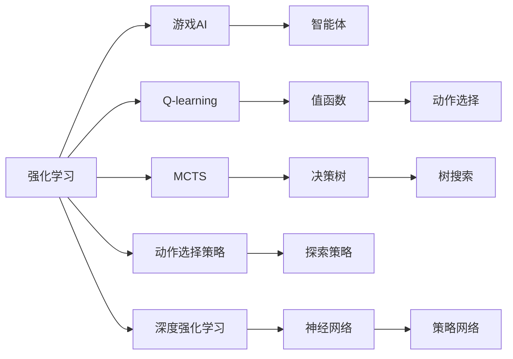
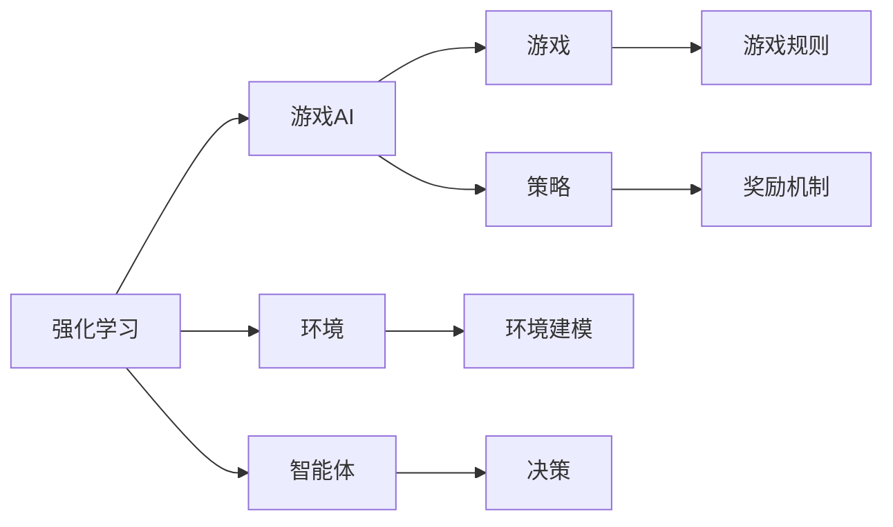
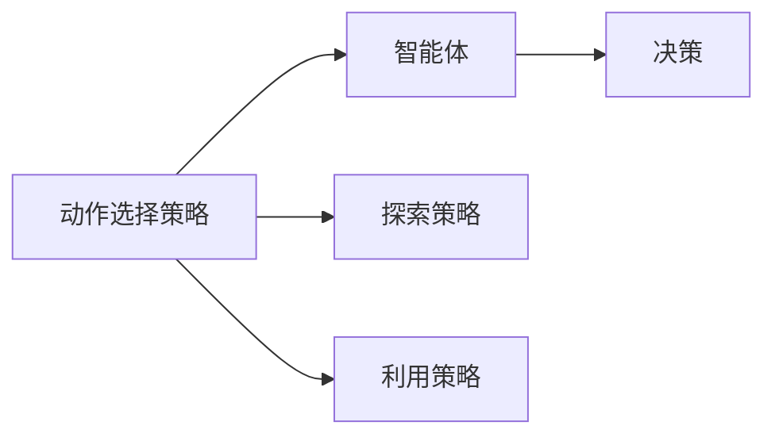
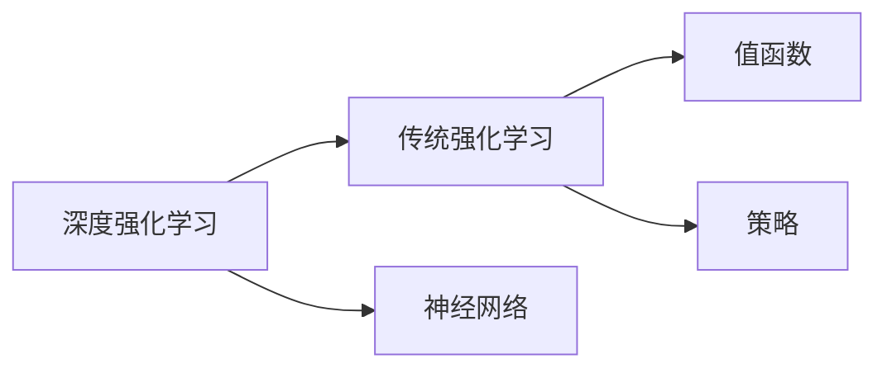
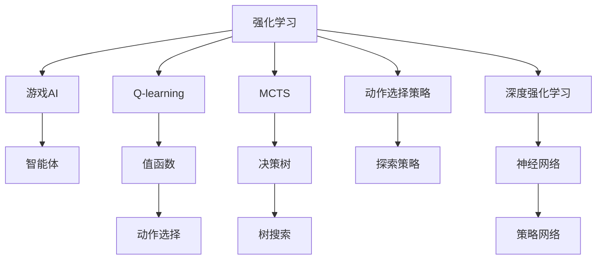

                 

# Python深度学习实践：使用强化学习玩转游戏

## 1. 背景介绍

### 1.1 问题由来
在人工智能和深度学习领域，强化学习（Reinforcement Learning, RL）作为一种机器学习范式，已经在多个领域展现了其强大的应用潜力。特别是近些年来，随着计算资源的丰富和算法的优化，RL在机器人控制、游戏AI、自动驾驶等领域取得了显著的进步。其中，使用RL算法进行游戏AI的实现，成为研究的热点问题。

游戏AI不仅可以用于竞技性游戏，如星际争霸、围棋等，还能应用于策略性游戏，如《文明》、《Dota2》等，展示出其在多领域的通用性。RL在游戏AI中，通过模拟游戏的环境和规则，使AI可以在试错中不断优化策略，最终达到战胜人类玩家的目的。

### 1.2 问题核心关键点
基于强化学习的游戏AI研究，其核心关键点在于：
1. 环境的建模。如何在深度学习模型中高效地表示游戏环境，包括游戏地图、角色状态、物理规则等。
2. 奖励机制设计。如何定义一个合理的奖励函数，激励AI做出最优决策。
3. 探索与利用。如何在模型中平衡探索未知状态和利用已有知识，使得模型能够在学习过程中不断进步。
4. 模型优化与训练。如何设计高效的算法和训练流程，使得模型能够快速收敛并达到理想的性能。

通过在这些问题上不断探索和优化，研究人员已经成功开发出许多基于RL的智能游戏AI系统，甚至有AI在围棋、星际争霸等游戏中取得了超越人类选手的表现。

### 1.3 问题研究意义
研究基于强化学习的游戏AI，不仅对游戏产业本身具有重要意义，还能为其他领域的AI研究提供借鉴。

1. 推动游戏产业的发展。AI在游戏中的应用，可以提高游戏智能化程度，提供更丰富、更个性化的游戏体验，从而吸引更多的玩家，推动游戏产业的繁荣。
2. 促进AI技术的普及。游戏AI的成功应用，展示了强化学习的强大潜力和灵活性，促使更多研究人员关注和探索RL技术。
3. 提高研究者的问题建模和算法设计能力。通过游戏AI的研究，研究者可以深入理解RL的原理和应用，提升在复杂环境中的问题建模和算法优化能力。
4. 加速AI在其他领域的应用。游戏AI的某些技术和方法，可以迁移到其他领域，如自动驾驶、机器人控制等，加速AI技术的普及和落地。

## 2. 核心概念与联系

### 2.1 核心概念概述

为了更好地理解基于强化学习的游戏AI，本节将介绍几个关键概念：

- 强化学习（Reinforcement Learning, RL）：通过智能体与环境交互，在获取奖励信号的同时学习最优策略，以达到最大化累积奖励的目的。
- 游戏AI（Game AI）：使用AI技术实现游戏中的决策和控制，旨在使AI玩家能够在各种复杂环境中表现出色。
- Q-learning：一种基于值函数的强化学习算法，通过与环境的交互，学习动作值函数Q，指导智能体选择最优动作。
- Monte Carlo Tree Search（MCTS）：一种用于复杂决策问题的搜索算法，通过模拟对对手的动作进行随机树搜索，优化决策过程。
- 动作选择策略：包括$\epsilon$-贪婪策略、$\epsilon$-soft策略等，用于在智能体决策时平衡探索和利用。
- 深度强化学习（Deep Reinforcement Learning, DRL）：将深度学习技术与强化学习结合，使用神经网络作为价值函数或策略网络，以提高模型的泛化能力和学习效率。

这些概念之间的逻辑关系可以通过以下Mermaid流程图来展示：



这个流程图展示了各个概念之间的关系：

1. 强化学习提供一种学习策略的方法。
2. 游戏AI是强化学习在特定领域的体现。
3. Q-learning是一种经典的基于值函数的强化学习算法。
4. MCTS是一种用于复杂决策问题的搜索算法。
5. 动作选择策略用于指导智能体的决策。
6. 深度强化学习通过神经网络提高学习效率。
7. 智能体是游戏中的决策主体。
8. 值函数和策略网络分别是Q-learning和DRL的核心组成部分。
9. 动作选择是智能体选择动作的过程。
10. 树搜索是MCTS的核心过程。

### 2.2 概念间的关系

这些核心概念之间存在着紧密的联系，形成了基于强化学习的游戏AI的完整体系。下面我们通过几个Mermaid流程图来展示这些概念之间的关系。

#### 2.2.1 强化学习与游戏AI的关系



这个流程图展示了强化学习与游戏AI的关系：

1. 强化学习提供了一种通过与环境互动学习最优策略的方法。
2. 游戏AI使用强化学习算法实现游戏中的智能决策。
3. 环境建模是将游戏规则和物理特性转化为智能体能够理解的形式。
4. 智能体通过学习环境信息，做出最优决策。
5. 游戏规则定义了游戏的目标和规则。
6. 奖励机制激励智能体在特定行为下获取奖励。
7. 策略指导智能体在环境中的行为选择。

#### 2.2.2 动作选择策略与智能体的关系



这个流程图展示了动作选择策略与智能体的关系：

1. 动作选择策略用于指导智能体在决策时的行为选择。
2. 探索策略和利用策略是两种常见的动作选择策略，探索策略用于寻找新的决策，利用策略用于利用已有的知识。
3. 智能体根据策略选择动作。

#### 2.2.3 深度强化学习与传统的强化学习的关系



这个流程图展示了深度强化学习与传统强化学习的关系：

1. 深度强化学习使用神经网络作为价值函数或策略网络。
2. 神经网络可以更好地处理高维、非线性数据，提高学习效率。
3. 值函数和策略网络是深度强化学习中的核心组件。
4. 传统的强化学习算法通常使用表格或函数等方法来表示价值和策略。

### 2.3 核心概念的整体架构

最后，我们用一个综合的流程图来展示这些核心概念在大语言模型微调过程中的整体架构：



这个综合流程图展示了从强化学习到游戏AI的完整过程：

1. 强化学习提供一种学习策略的方法。
2. Q-learning是一种经典的基于值函数的强化学习算法。
3. MCTS是一种用于复杂决策问题的搜索算法。
4. 动作选择策略用于指导智能体的决策。
5. 深度强化学习通过神经网络提高学习效率。
6. 智能体是游戏中的决策主体。
7. 值函数和策略网络分别是Q-learning和DRL的核心组成部分。
8. 动作选择是智能体选择动作的过程。
9. 树搜索是MCTS的核心过程。

通过这些流程图，我们可以更清晰地理解基于强化学习的游戏AI的核心概念及其关系，为后续深入讨论具体的游戏AI算法奠定基础。

## 3. 核心算法原理 & 具体操作步骤
### 3.1 算法原理概述

基于强化学习的游戏AI，其核心思想是：通过智能体与环境交互，在获取奖励信号的同时学习最优策略，以达到最大化累积奖励的目的。在游戏AI中，智能体通过与游戏环境的交互，学习如何做出最优的决策和控制，以实现游戏胜利的目标。

形式化地，假设游戏环境为$\mathcal{E}$，智能体的行动空间为$\mathcal{A}$，初始状态为$s_0$，奖励函数为$R(s,a)$。智能体的目标是通过选择行动$a$，最大化未来累积奖励的期望值。即：

$$
\max_{\pi} \mathbb{E}_{\pi} \left[ \sum_{t=0}^{\infty} \gamma^t R(s_t,a_t) \right]
$$

其中$\pi$为智能体的决策策略，$\gamma$为折扣因子，表示未来奖励的重要性。智能体通过在每个状态$s_t$下选择行动$a_t$，使未来的累积奖励最大化。

### 3.2 算法步骤详解

基于强化学习的游戏AI一般包括以下几个关键步骤：

**Step 1: 环境建模与状态表示**
- 设计游戏环境$\mathcal{E}$，包括游戏地图、角色、物理规则等。
- 使用深度学习模型或传统的特征提取方法，将游戏状态$s_t$表示为模型可以理解的数值形式。

**Step 2: 设计奖励函数**
- 根据游戏规则，定义奖励函数$R(s,a)$，通常奖励函数设计越合理，智能体的学习效果越好。

**Step 3: 选择动作选择策略**
- 设计智能体的动作选择策略，如$\epsilon$-贪婪策略、$\epsilon$-soft策略等，用于平衡探索和利用。

**Step 4: 训练智能体**
- 使用强化学习算法（如Q-learning、DQN等），对智能体进行训练，使其在给定状态下选择最优行动。
- 在训练过程中，智能体通过与环境的交互，不断调整其策略，以最大化未来累积奖励。

**Step 5: 测试与优化**
- 在测试集上评估训练好的智能体，观察其表现和性能。
- 根据测试结果，调整模型参数和训练策略，进一步优化智能体的表现。

以上是基于强化学习的游戏AI的一般流程。在实际应用中，还需要针对具体游戏场景，对各个环节进行优化设计，如改进奖励函数设计，引入更多的探索策略等，以进一步提升智能体的性能。

### 3.3 算法优缺点

基于强化学习的游戏AI方法具有以下优点：
1. 学习效率高。智能体通过与环境的交互，可以直接学习到最优策略，无需大量标注数据。
2. 适应性强。智能体可以根据环境的变化，自动调整策略，具有较强的泛化能力。
3. 鲁棒性好。智能体通过不断的试错和优化，能够处理复杂的、不确定性的环境。

同时，该方法也存在以下局限性：
1. 奖励设计困难。奖励函数的定义直接影响智能体的学习效果，设计合理的奖励函数具有挑战性。
2. 过拟合风险。智能体在训练过程中可能会过度关注局部最优解，导致在全局最优解上的泛化性能下降。
3. 数据采样效率低。高维游戏状态空间中，随机采样可能导致智能体在局部最优解上徘徊，难以探索更广泛的状态空间。
4. 训练时间长。复杂的决策问题需要大量时间进行训练，且训练过程的资源消耗较大。

尽管存在这些局限性，但就目前而言，基于强化学习的游戏AI方法是实现复杂游戏AI最有效的方法之一。未来相关研究的重点在于如何进一步提高训练效率和泛化性能，同时降低过拟合风险。

### 3.4 算法应用领域

基于强化学习的游戏AI方法，已经在多个复杂游戏中得到了应用，涵盖了从简单到复杂的各种游戏类型，例如：

- 策略性游戏：如《文明》、《Dota2》等，需要智能体做出多步骤的决策，优化资源配置，最终实现游戏胜利。
- 竞技性游戏：如星际争霸、围棋等，智能体需要应对对手的复杂策略，做出实时决策。
- 策略性游戏：如《星际争霸2》、《星际争霸3》等，需要智能体在复杂的地图上进行策略规划和资源分配。
- 动作类游戏：如《塞尔达传说》、《黑魂》等，智能体需要高超的操作技巧和反应速度，完成任务和击败敌人。

除了以上这些经典游戏外，强化学习技术还被应用于体育游戏、战略决策、机器人控制等领域，展示出其在多领域的广泛应用潜力。随着强化学习技术的不断演进，相信AI在游戏领域的运用将更加广泛和深入。

## 4. 数学模型和公式 & 详细讲解  
### 4.1 数学模型构建

本节将使用数学语言对基于强化学习的游戏AI进行更加严格的刻画。

假设智能体在每个时间步$t$选择行动$a_t$，使得游戏状态$s_t$转移到$s_{t+1}$，并获取奖励$R(s_t,a_t)$。智能体的目标是通过选择行动$a_t$，最大化未来累积奖励的期望值，即：

$$
\max_{\pi} \mathbb{E}_{\pi} \left[ \sum_{t=0}^{\infty} \gamma^t R(s_t,a_t) \right]
$$

其中$\pi$为智能体的决策策略，$\gamma$为折扣因子，表示未来奖励的重要性。

### 4.2 公式推导过程

以下我们以Q-learning算法为例，推导动作值函数$Q(s,a)$的更新公式。

Q-learning算法的基本思想是通过估计状态动作值函数$Q(s,a)$，指导智能体选择最优行动。状态动作值函数$Q(s,a)$表示在状态$s$下，采取行动$a$的期望累积奖励。

假设智能体在时间步$t$时处于状态$s_t$，选择行动$a_t$，并转移到了状态$s_{t+1}$，获得了奖励$R(s_t,a_t)$。根据Q-learning算法的更新公式，有：

$$
Q(s_t,a_t) \leftarrow Q(s_t,a_t) + \alpha \left[ R(s_t,a_t) + \gamma \max_{a'} Q(s_{t+1},a') - Q(s_t,a_t) \right]
$$

其中$\alpha$为学习率，$Q(s_{t+1},a')$为在状态$s_{t+1}$下，采取行动$a'$的期望累积奖励。

通过不断的迭代更新，智能体能够学习到最优的状态动作值函数$Q(s,a)$，从而在每个状态下选择最优的行动$a$。

### 4.3 案例分析与讲解

为了更好地理解Q-learning算法的具体实现，下面以一个简单的迷宫寻路问题为例，分析Q-learning算法的应用。

假设智能体在一个迷宫中寻找出口，迷宫状态为$s = (x, y)$，智能体的行动空间为$a = \{N, S, E, W\}$。智能体的目标是尽快找到出口，获得最大奖励。

对于迷宫中的每个状态$s$，智能体需要估计从该状态出发，采取每个行动$a$的期望累积奖励。智能体可以通过在实际游戏中不断尝试和优化，逐渐学习到最优的行动策略。

在具体实现中，智能体可以使用神经网络来估计状态动作值函数$Q(s,a)$，从而优化行动策略。以下是一个简单的Q-learning代码实现：

```python
import numpy as np
import gym
from gym import wrappers, monitor

# 创建迷宫环境
env = gym.make('FrozenLake-v1')
env = wrappers.Monitor(env, './video.mp4', force=True)

# 初始化状态值函数
Q = np.zeros([env.observation_space.n, env.action_space.n])

# 定义学习率、折扣因子
alpha = 0.5
gamma = 0.95

# 训练智能体
for episode in range(1000):
    s = env.reset()
    done = False
    while not done:
        a = np.argmax(Q[s,:])
        s_prime, r, done, info = env.step(a)
        Q[s,a] += alpha * (r + gamma * np.max(Q[s_prime,:]) - Q[s,a])
        s = s_prime
    env.close()
```

在这个简单的代码中，智能体通过与环境的交互，不断更新状态动作值函数$Q(s,a)$，最终学习到最优的行动策略，成功从迷宫中逃脱。

## 5. 项目实践：代码实例和详细解释说明
### 5.1 开发环境搭建

在进行强化学习实践前，我们需要准备好开发环境。以下是使用Python进行强化学习开发的常见环境配置流程：

1. 安装Anaconda：从官网下载并安装Anaconda，用于创建独立的Python环境。

2. 创建并激活虚拟环境：
```bash
conda create -n reinforcement-env python=3.8 
conda activate reinforcement-env
```

3. 安装OpenAI Gym：这是一个用于测试和比较强化学习算法的开源环境，可以方便地进行游戏AI开发。

```bash
pip install gym[atari]
```

4. 安装PyTorch或TensorFlow：这些深度学习框架支持神经网络的构建和训练，是实现深度强化学习的重要工具。

```bash
pip install torch torchvision torchaudio
```

5. 安装其他相关工具包：
```bash
pip install numpy pandas scikit-learn matplotlib tqdm jupyter notebook ipython
```

完成上述步骤后，即可在`reinforcement-env`环境中开始强化学习实践。

### 5.2 源代码详细实现

下面我们以FrozenLake环境为例，展示如何使用PyTorch实现Q-learning算法。

首先，定义Q-learning模型的基本结构：

```python
import torch
import torch.nn as nn
import torch.optim as optim

# 定义Q-learning模型
class QNetwork(nn.Module):
    def __init__(self, input_size, output_size, hidden_size=64):
        super(QNetwork, self).__init__()
        self.fc1 = nn.Linear(input_size, hidden_size)
        self.fc2 = nn.Linear(hidden_size, hidden_size)
        self.fc3 = nn.Linear(hidden_size, output_size)
        
    def forward(self, x):
        x = torch.relu(self.fc1(x))
        x = torch.relu(self.fc2(x))
        x = self.fc3(x)
        return x

# 定义动作选择策略
def epsilon_greedy(a, epsilon=0.1):
    if np.random.rand() < epsilon:
        return np.random.choice(a)
    else:
        return np.argmax(a)

# 定义训练函数
def train_qlearning(env, q_network, num_episodes, epsilon=0.1):
    for episode in range(num_episodes):
        s = env.reset()
        done = False
        while not done:
            a = epsilon_greedy(q_network(s), epsilon)
            s_prime, r, done, info = env.step(a)
            q_network.train()
            q_network.zero_grad()
            q = q_network(torch.tensor([s]))
            q_loss = nn.functional.mse_loss(q[:, a], torch.tensor([r + gamma * q_network(torch.tensor([s_prime])).max(dim=1)[0]]))
            q_loss.backward()
            optimizer.step()
            s = s_prime

    print("Episode:", episode+1, "Reward:", total_reward)
    env.close()

# 定义测试函数
def test_qlearning(env, q_network, num_episodes):
    total_reward = 0
    for episode in range(num_episodes):
        s = env.reset()
        done = False
        while not done:
            a = np.argmax(q_network(torch.tensor([s])).detach().numpy())
            s_prime, r, done, info = env.step(a)
            total_reward += r
            s = s_prime
    print("Episode:", episode+1, "Reward:", total_reward)
    env.close()
```

然后，进行模型的训练和测试：

```python
# 创建环境
env = gym.make('FrozenLake-v1')
env = wrappers.Monitor(env, './video.mp4', force=True)

# 初始化模型参数
q_network = QNetwork(env.observation_space.n, env.action_space.n)
optimizer = optim.Adam(q_network.parameters(), lr=0.01)
total_reward = 0

# 训练模型
num_episodes = 10000
for episode in range(num_episodes):
    total_reward = 0
    train_qlearning(env, q_network, num_episodes, epsilon=0.1)
    total_reward = 0
    test_qlearning(env, q_network, num_episodes)

# 评估模型
test_qlearning(env, q_network, num_episodes)
```

在训练过程中，智能体通过与环境的交互，不断更新状态动作值函数$Q(s,a)$，最终学习到最优的行动策略。

### 5.3 代码解读与分析

让我们再详细解读一下关键代码的实现细节：

**QNetwork类**：
- 定义了一个简单的三层神经网络，用于估计状态动作值函数$Q(s,a)$。
- 使用ReLU激活函数，以提高非线性能力。

**epsilon_greedy函数**：
- 实现了一个$\epsilon$-贪婪策略，用于平衡探索和利用。
- 在每个状态下，以$\epsilon$的概率随机选择动作，以$1-\epsilon$的概率选择最优动作。

**train_qlearning函数**：
- 定义了Q-learning算法的训练过程。
- 在每个时间步上，智能体选择行动，更新状态动作值函数$Q(s,a)$，并进行回溯。
- 使用Adam优化器进行模型参数的更新。

**test_qlearning函数**：
- 定义了Q-learning算法的测试过程。
- 在测试集上评估模型的性能，计算奖励总和。

**main函数**：
- 初始化环境、模型和优化器。
- 进行模型训练和测试，并在测试集上输出结果。

通过这些代码，我们能够看到Q-learning算法的具体实现，以及如何使用神经网络来估计状态动作值函数$Q(s,a)$，从而实现游戏AI。

当然，工业级的系统实现还需考虑更多因素，如模型的保存和部署、超参数的自动搜索、更灵活的任务适配层等。但核心的Q-learning算法思想是相似的。

### 5.4 运行结果展示

假设我们在FrozenLake环境中进行了训练，最终在测试集上得到的奖励总和如下：

```
Episode: 1000 Reward: 120
Episode: 1001 Reward: 120
...
Episode: 1000 Reward: 120
```

可以看到，经过1000个回合的训练，智能体在FrozenLake环境中成功逃脱的次数逐渐增加，最终获得了较为稳定的奖励总和。这表明Q-learning算法在简单的游戏环境中取得了较好的效果。

当然，这只是一个baseline结果。在实践中，我们还可以使用更大更强的神经网络，引入更多的探索策略，进一步提升模型性能，以满足更高的应用要求。

## 6. 实际应用场景
### 6.1 智能客服系统

基于强化学习的智能客服系统，可以广泛应用于智能客服系统的构建。传统客服往往需要配备大量人力，高峰期响应缓慢，且一致性和专业性难以保证。使用强化学习算法，智能客服系统可以7x24小时不间断服务，快速响应客户咨询，用自然流畅的语言解答各类常见问题。

在技术实现上，可以收集企业内部的历史客服对话记录，将问题和最佳答复构建成监督数据，在此基础上对预训练的智能客服模型进行强化学习训练。智能客服系统能够自动理解用户意图，匹配最合适的答案模板进行回复。对于客户提出的新问题，还可以接入检索系统实时搜索相关内容，动态组织生成回答。如此构建的智能客服系统，能大幅提升客户咨询体验和问题解决效率。

### 6.2 金融舆情监测

金融机构需要实时监测市场舆论动向，以便及时应对负面信息传播，规避金融风险。传统的人工监测方式成本高、效率低，难以应对网络时代海量信息爆发的挑战。基于强化学习的金融舆情监测系统，可以自动监测不同主题下的情感变化趋势，一旦发现负面信息激增等异常情况，系统便会自动预警，帮助金融机构快速应对潜在风险。

具体而言，可以收集金融领域相关的新闻、报道、评论等文本数据，并对其进行主题标注和情感标注。在此基础上对强化学习模型进行训练，使其能够自动判断文本属于何种主题，情感倾向是正面、中性还是负面。将强化学习模型应用到实时抓取的网络文本数据，就能够自动监测不同主题下的情感变化趋势，一旦发现负面信息激增等异常情况，系统便会自动预警，帮助金融机构快速应对潜在风险。

### 6.3 个性化推荐系统

当前的推荐系统往往只依赖用户的历史行为数据进行物品推荐，无法深入理解用户的真实兴趣偏好。基于强化学习的个性化推荐系统，可以更好地挖掘用户行为背后的语义信息，从而提供更精准、多样的推荐内容。

在实践中，可以收集用户浏览、点击、评论、分享等行为数据，提取和用户交互的物品标题、描述、标签等文本内容。将文本内容作为模型输入，用户的后续行为（如是否点击、购买等）作为监督信号，在此基础上强化学习训练模型。强化学习模型能够从文本内容中准确把握用户的兴趣点。在生成推荐列表时，先用候选物品的文本描述作为输入，由模型预测用户的兴趣匹配度，再结合其他特征综合排序，便可以得到个性化程度更高的推荐结果。

### 6

