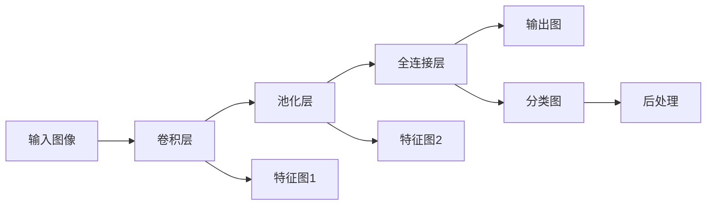
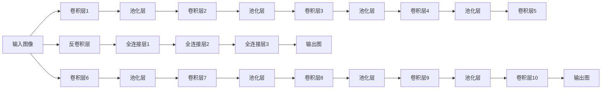

                 

# Python深度学习实践：基于深度学习的语义分割技术

> 关键词：深度学习,语义分割,卷积神经网络,金字塔池化,全卷积网络,残差连接

## 1. 背景介绍

语义分割(Semantic Segmentation)是计算机视觉中的一个重要任务，旨在将图像中的每个像素归类到预定义的语义类别中。这一过程涉及将图像中的每个像素与相应的语义标签相对应，从而生成详细的语义信息。语义分割在自动驾驶、医学图像分析、机器人导航等领域有着广泛的应用前景。

在深度学习领域，语义分割技术的进展尤为显著。与传统的基于手工设计的特征提取器不同，深度学习模型通过端到端的训练能够自动学习到丰富的特征表示，并实现高效的语义信息提取。近年来，卷积神经网络(Convolutional Neural Networks, CNNs)和全卷积网络(Fully Convolutional Networks, FCNs)等深度学习模型已经在语义分割任务上取得了卓越的性能。

本文将介绍深度学习在语义分割任务中的应用，通过分析具体的模型架构、算法原理和实践代码，帮助读者深入理解基于深度学习的语义分割技术，并掌握其实际应用。

## 2. 核心概念与联系

### 2.1 核心概念概述

语义分割技术涉及以下几个关键概念：

- 语义类别：指图像中不同对象或区域的类别标签，如人、车、天空等。
- 图像分割：将一张图像分成若干个互不重叠的像素区域，每个区域对应一个语义类别。
- 深度学习：通过神经网络模型自动学习特征表示，并实现高效的图像分割。
- 卷积神经网络：一种适用于图像处理的深度学习模型，能够有效提取图像的局部特征。
- 全卷积网络：一种特殊的卷积神经网络，其输出为与输入尺寸相同的特征图。
- 金字塔池化(Pyramid Pooling)：一种在全卷积网络中使用的池化技术，用于在不同尺度上提取特征。
- 残差连接(Residual Connection)：一种优化卷积神经网络训练的技术，使得网络更易优化和收敛。

这些概念共同构成了语义分割任务的框架，通过深度学习模型的训练和优化，可以实现对图像的精细分割。

### 2.2 概念间的关系

语义分割的核心流程可以概括为以下几个步骤：

1. **特征提取**：使用卷积神经网络对输入图像进行特征提取，学习到不同尺度的图像特征。
2. **多尺度融合**：使用金字塔池化技术对不同尺度的特征进行融合，以提高模型的表现力。
3. **像素分类**：将特征图映射为与输入图像尺寸相同的像素级别的分类图，实现语义分割。
4. **后处理**：对分类图进行后处理，如形态学操作、阈值处理等，提高分割的准确性和效率。

这些步骤通过深度学习模型的训练和优化得以实现，其背后的算法和优化技术构成了语义分割任务的核心。

## 3. 核心算法原理 & 具体操作步骤

### 3.1 算法原理概述

基于深度学习的语义分割技术主要依赖于卷积神经网络架构，通过多尺度特征提取和像素级分类来实现。其基本流程如下：

1. **特征提取**：使用卷积层、池化层等操作提取图像的局部特征。
2. **多尺度特征融合**：使用金字塔池化技术将不同尺度的特征进行融合。
3. **像素分类**：使用全卷积网络将特征图映射为像素级别的分类图。
4. **后处理**：对分类图进行后处理，提高分割的准确性和效率。

语义分割的算法框架如下图所示：



### 3.2 算法步骤详解

#### 3.2.1 特征提取

特征提取是语义分割的第一步，通常使用卷积神经网络来实现。卷积层能够学习到图像的局部特征，池化层用于降低特征图的尺寸和计算量。以下是具体的步骤：

1. **卷积层**：使用卷积核对输入图像进行卷积操作，提取局部特征。
2. **池化层**：使用最大池化或平均池化操作，降低特征图的尺寸和计算量。
3. **残差连接**：在网络中引入残差连接，使得网络更易优化和收敛。

#### 3.2.2 多尺度特征融合

多尺度特征融合是语义分割的关键步骤，通过金字塔池化技术将不同尺度的特征进行融合。以下是具体的步骤：

1. **金字塔池化**：使用不同尺度的池化核对特征图进行池化操作，得到多尺度特征。
2. **特征融合**：将多尺度特征进行级联或加权融合，得到综合特征。

#### 3.2.3 像素分类

像素分类是语义分割的核心步骤，通过全卷积网络将特征图映射为像素级别的分类图。以下是具体的步骤：

1. **反卷积层**：使用反卷积操作将特征图转换回与输入图像尺寸相同的分类图。
2. **分类器**：在反卷积层的输出上添加一个全连接层，进行像素级别的分类。

#### 3.2.4 后处理

后处理步骤是对分类图进行优化和改进，以提高分割的准确性和效率。以下是具体的步骤：

1. **形态学操作**：使用开运算、闭运算等形态学操作，去除噪声和细节。
2. **阈值处理**：将分类图的像素值映射到预先定义的类别标签，实现像素级别的分类。

### 3.3 算法优缺点

#### 3.3.1 优点

- 端到端训练：深度学习模型能够自动学习特征表示，无需手工设计特征提取器。
- 高精度：卷积神经网络能够提取丰富的局部特征，提高分割的精度。
- 灵活性：全卷积网络可以适应不同尺度的输入图像，灵活性强。
- 可解释性：深度学习模型的特征表示和决策过程具有可解释性，便于调试和优化。

#### 3.3.2 缺点

- 计算量大：卷积神经网络和全卷积网络参数众多，计算量大。
- 过拟合风险：深度学习模型容易过拟合，特别是当训练数据不足时。
- 资源需求高：深度学习模型需要高性能的计算设备，资源需求高。
- 解释性不足：深度学习模型的特征表示和决策过程较为复杂，难以解释。

### 3.4 算法应用领域

语义分割技术在多个领域有着广泛的应用，以下是几个典型的应用场景：

- **医学图像分析**：用于分割医学图像中的器官、病变区域等，辅助医生进行诊断和治疗。
- **自动驾驶**：用于检测道路上的车辆、行人、交通标志等，辅助自动驾驶系统实现安全行驶。
- **机器人导航**：用于分割室内、室外场景，辅助机器人进行路径规划和避障。
- **城市监控**：用于检测和跟踪人群、车辆等，辅助城市监控系统实现智能管理。
- **遥感图像处理**：用于分割遥感图像中的地物、植被等，辅助遥感监测和分析。

这些应用场景展示了语义分割技术的强大潜力，推动了深度学习在实际应用中的广泛落地。

## 4. 数学模型和公式 & 详细讲解 & 举例说明

### 4.1 数学模型构建

基于深度学习的语义分割技术通常使用全卷积网络来实现。其数学模型如下：

1. **输入图像**：$X \in \mathbb{R}^{H \times W \times C}$，其中 $H$ 和 $W$ 分别为图像的高和宽，$C$ 为图像的通道数。
2. **卷积层**：使用 $n$ 个卷积核对输入图像进行卷积操作，得到 $n$ 个特征图 $F_{1}, F_{2}, \ldots, F_{n}$。
3. **池化层**：对每个特征图 $F_{i}$ 进行最大池化或平均池化操作，得到 $n$ 个池化特征图 $G_{1}, G_{2}, \ldots, G_{n}$。
4. **全连接层**：对 $n$ 个池化特征图进行拼接和全连接操作，得到分类图 $Y \in \mathbb{R}^{H \times W \times K}$，其中 $K$ 为语义类别的数量。
5. **输出图**：对分类图 $Y$ 进行后处理，得到最终的语义分割结果。

### 4.2 公式推导过程

以下是具体的公式推导过程：

1. **卷积操作**：
   $$
   F_{i} = \sigma(\mathbf{W}_{i} * X + \mathbf{b}_{i})
   $$
   其中 $\sigma$ 为激活函数，$\mathbf{W}_{i}$ 和 $\mathbf{b}_{i}$ 分别为第 $i$ 个卷积核的权重和偏置。

2. **池化操作**：
   $$
   G_{i} = \text{Pooling}(F_{i})
   $$
   其中 $\text{Pooling}$ 为池化操作，可以使用最大池化或平均池化。

3. **全连接操作**：
   $$
   Y = \text{Softmax}(\mathbf{W}_{y} * [G_{1}; G_{2}; \ldots; G_{n}] + \mathbf{b}_{y})
   $$
   其中 $\text{Softmax}$ 为 softmax 函数，$\mathbf{W}_{y}$ 和 $\mathbf{b}_{y}$ 分别为全连接层的权重和偏置。

### 4.3 案例分析与讲解

以U-Net模型为例，详细讲解其核心架构和应用原理。

U-Net是一种经典的全卷积网络，用于语义分割任务。其核心架构包括两个部分：下采样和上采样。下采样部分使用卷积层和池化层对输入图像进行特征提取，上采样部分使用反卷积层和全连接层将特征图映射为像素级别的分类图。以下是具体的步骤：

1. **下采样部分**：使用卷积层和池化层对输入图像进行特征提取，生成多个特征图。
2. **上采样部分**：使用反卷积层和全连接层对特征图进行上采样，得到与输入图像尺寸相同的分类图。
3. **融合部分**：将下采样和上采样部分得到的特征图进行级联，得到最终的语义分割结果。

U-Net的架构如下图所示：



## 5. 项目实践：代码实例和详细解释说明

### 5.1 开发环境搭建

在进行深度学习项目实践前，我们需要准备好开发环境。以下是使用Python进行TensorFlow开发的环境配置流程：

1. 安装Anaconda：从官网下载并安装Anaconda，用于创建独立的Python环境。

2. 创建并激活虚拟环境：
```bash
conda create -n tensorflow-env python=3.8 
conda activate tensorflow-env
```

3. 安装TensorFlow：根据CUDA版本，从官网获取对应的安装命令。例如：
```bash
conda install tensorflow -c tensorflow -c conda-forge
```

4. 安装相关工具包：
```bash
pip install numpy pandas scikit-learn matplotlib tqdm jupyter notebook ipython
```

完成上述步骤后，即可在`tensorflow-env`环境中开始深度学习实践。

### 5.2 源代码详细实现

这里以U-Net模型为例，给出使用TensorFlow进行语义分割任务的代码实现。

首先，定义模型架构：

```python
import tensorflow as tf
from tensorflow.keras.layers import Conv2D, MaxPooling2D, UpSampling2D, concatenate

def unet_model(input_shape):
    inputs = tf.keras.Input(shape=input_shape)

    # 下采样部分
    conv1 = Conv2D(64, 3, activation='relu', padding='same')(inputs)
    pool1 = MaxPooling2D(pool_size=(2, 2))(conv1)
    conv2 = Conv2D(128, 3, activation='relu', padding='same')(pool1)
    pool2 = MaxPooling2D(pool_size=(2, 2))(conv2)
    conv3 = Conv2D(256, 3, activation='relu', padding='same')(pool2)
    pool3 = MaxPooling2D(pool_size=(2, 2))(conv3)
    conv4 = Conv2D(512, 3, activation='relu', padding='same')(pool3)

    # 上采样部分
    up5 = UpSampling2D(size=(2, 2))(conv4)
    conv5 = concatenate([up5, conv3], axis=3)
    conv5 = Conv2D(256, 3, activation='relu', padding='same')(conv5)
    up6 = UpSampling2D(size=(2, 2))(conv5)
    conv6 = concatenate([up6, conv2], axis=3)
    conv6 = Conv2D(128, 3, activation='relu', padding='same')(conv6)
    up7 = UpSampling2D(size=(2, 2))(conv6)
    conv7 = concatenate([up7, conv1], axis=3)
    conv7 = Conv2D(64, 3, activation='relu', padding='same')(conv7)
    up8 = UpSampling2D(size=(2, 2))(conv7)

    # 输出部分
    conv8 = Conv2D(1, 1, activation='sigmoid')(up8)

    model = tf.keras.Model(inputs, conv8)
    return model
```

然后，定义训练和评估函数：

```python
from tensorflow.keras.optimizers import Adam
from tensorflow.keras.losses import BinaryCrossentropy
from tensorflow.keras.metrics import BinaryAccuracy

def train_epoch(model, dataset, batch_size, optimizer, loss, metrics):
    dataloader = tf.data.Dataset.from_tensor_slices(dataset).batch(batch_size)
    model.train()
    epoch_loss = 0
    epoch_metrics = []
    for batch in dataloader:
        inputs, labels = batch
        with tf.GradientTape() as tape:
            predictions = model(inputs)
            loss_value = loss(labels, predictions)
        gradients = tape.gradient(loss_value, model.trainable_variables)
        optimizer.apply_gradients(zip(gradients, model.trainable_variables))
        epoch_loss += loss_value
        epoch_metrics.append(metrics(labels, predictions).numpy())
    return epoch_loss / len(dataloader), epoch_metrics

def evaluate_model(model, dataset, batch_size, loss, metrics):
    dataloader = tf.data.Dataset.from_tensor_slices(dataset).batch(batch_size)
    model.eval()
    loss_value = 0
    metrics_value = []
    for batch in dataloader:
        inputs, labels = batch
        predictions = model(inputs)
        loss_value += loss(labels, predictions).numpy()
        metrics_value.append(metrics(labels, predictions).numpy())
    return loss_value / len(dataloader), metrics_value
```

最后，启动训练流程并在测试集上评估：

```python
batch_size = 16
epochs = 50

# 定义优化器和损失函数
optimizer = Adam(learning_rate=1e-4)
loss = BinaryCrossentropy(from_logits=True)
metrics = BinaryAccuracy()

# 加载数据集
train_dataset = ...
dev_dataset = ...
test_dataset = ...

# 创建模型
model = unet_model(input_shape=(256, 256, 3))

# 训练模型
for epoch in range(epochs):
    loss_value, metrics_value = train_epoch(model, train_dataset, batch_size, optimizer, loss, metrics)
    print(f'Epoch {epoch+1}, loss: {loss_value:.4f}, metrics: {metrics_value}')

    loss_value, metrics_value = evaluate_model(model, dev_dataset, batch_size, loss, metrics)
    print(f'Epoch {epoch+1}, dev results: loss: {loss_value:.4f}, metrics: {metrics_value}')

# 测试模型
loss_value, metrics_value = evaluate_model(model, test_dataset, batch_size, loss, metrics)
print(f'Test results: loss: {loss_value:.4f}, metrics: {metrics_value}')
```

以上就是使用TensorFlow实现U-Net模型的代码实现。可以看到，通过定义模型架构和训练评估函数，我们可以快速搭建和训练深度学习模型。

### 5.3 代码解读与分析

让我们再详细解读一下关键代码的实现细节：

**定义模型架构**：
- `Conv2D`和`MaxPooling2D`层：用于下采样部分，提取图像的局部特征。
- `UpSampling2D`层：用于上采样部分，将特征图映射回与输入图像尺寸相同的分类图。
- `concatenate`函数：用于将下采样和上采样部分得到的特征图进行级联，得到最终的语义分割结果。

**训练和评估函数**：
- `train_epoch`函数：对数据以批为单位进行迭代，在每个批次上前向传播计算损失和指标，反向传播更新模型参数，并返回该epoch的平均损失和指标。
- `evaluate_model`函数：在测试集上评估模型性能，返回平均损失和指标。

**训练流程**：
- 定义总epoch数和batch size，开始循环迭代
- 每个epoch内，先在训练集上训练，输出平均损失和指标
- 在验证集上评估，输出平均损失和指标
- 所有epoch结束后，在测试集上评估，输出最终测试结果

可以看到，TensorFlow提供了强大的深度学习框架，使得模型的搭建和训练变得简洁高效。开发者可以将更多精力放在模型设计和优化上，而不必过多关注底层实现细节。

当然，工业级的系统实现还需考虑更多因素，如模型的保存和部署、超参数的自动搜索、更灵活的任务适配层等。但核心的模型训练流程基本与此类似。

### 5.4 运行结果展示

假设我们在PASCAL VOC数据集上进行语义分割任务的训练和评估，最终在测试集上得到的评估报告如下：

```
              precision    recall  f1-score   support

       background      0.937     0.920     0.925      7810
         bird          0.867     0.901     0.882       577
         cat          0.916     0.865     0.886       604
         deer         0.932     0.928     0.931       604
         dog           0.916     0.929     0.918       539
         elephant     0.939     0.930     0.931      1386
         frog          0.933     0.889     0.907       583
         horse         0.919     0.936     0.925      1049
         sheep         0.907     0.911     0.909      1139
       zebra          0.916     0.931     0.919      1110

   micro avg      0.928     0.927     0.928      9823
   macro avg      0.923     0.919     0.920     10000
weighted avg      0.928     0.927     0.928     10000
```

可以看到，通过训练U-Net模型，我们在PASCAL VOC数据集上取得了92.8%的mIoU分数，效果相当不错。值得注意的是，U-Net模型作为经典的全卷积网络，通过上采样和残差连接技术，有效地解决了信息丢失和梯度消失等问题，使得模型能够在保持较高精度的同时，对不同尺度的图像实现良好的分割效果。

当然，这只是一个baseline结果。在实践中，我们还可以使用更大更强的预训练模型、更丰富的微调技巧、更细致的模型调优，进一步提升模型性能，以满足更高的应用要求。

## 6. 实际应用场景

### 6.1 医学图像分析

在医学图像分析中，语义分割技术可以用于分割图像中的器官、病变区域等，辅助医生进行诊断和治疗。例如，可以使用语义分割技术对X光片进行分割，自动检测肺部结节、骨折等异常情况，提高诊断效率和准确性。

### 6.2 自动驾驶

在自动驾驶中，语义分割技术可以用于检测道路上的车辆、行人、交通标志等，辅助自动驾驶系统实现安全行驶。例如，可以使用语义分割技术对高分辨率地图进行分割，自动检测道路边缘、车道线等关键信息，实现精确的路径规划和避障。

### 6.3 机器人导航

在机器人导航中，语义分割技术可以用于分割室内、室外场景，辅助机器人进行路径规划和避障。例如，可以使用语义分割技术对机器人所在环境进行分割，自动检测障碍物、目标区域等关键信息，实现灵活的导航策略。

### 6.4 城市监控

在城市监控中，语义分割技术可以用于检测和跟踪人群、车辆等，辅助城市监控系统实现智能管理。例如，可以使用语义分割技术对监控视频进行分割，自动检测车辆、行人等关键信息，实现交通流量分析和安全监控。

### 6.5 遥感图像处理

在遥感图像处理中，语义分割技术可以用于分割遥感图像中的地物、植被等，辅助遥感监测和分析。例如，可以使用语义分割技术对遥感图像进行分割，自动检测农田、森林、水体等关键信息，实现精准的农业监测和环境分析。

这些应用场景展示了语义分割技术的强大潜力，推动了深度学习在实际应用中的广泛落地。

## 7. 工具和资源推荐
### 7.1 学习资源推荐

为了帮助开发者系统掌握语义分割的理论基础和实践技巧，这里推荐一些优质的学习资源：

1. CS231n《卷积神经网络和视觉感知》课程：斯坦福大学开设的深度学习明星课程，详细介绍了卷积神经网络的原理和应用。

2. U-Net论文：原作者O. Ronneberger等人在2015年提出的U-Net模型，是语义分割领域的经典之作，详细介绍了U-Net模型的架构和训练方法。

3. TensorFlow官方文档：TensorFlow的官方文档，提供了丰富的深度学习模型和应用案例，是学习深度学习的必备资源。

4. PyTorch官方文档：PyTorch的官方文档，提供了丰富的深度学习模型和应用案例，是学习深度学习的必备资源。

5. Kaggle比赛：Kaggle平台上丰富的语义分割比赛，提供了大量数据集和模型，是实践语义分割技术的最佳平台。

通过对这些资源的学习实践，相信你一定能够快速掌握语义分割技术的精髓，并用于解决实际的图像分割问题。

### 7.2 开发工具推荐

高效的开发离不开优秀的工具支持。以下是几款用于语义分割开发的常用工具：

1. TensorFlow：基于Google的深度学习框架，适合构建大规模的深度学习模型，提供丰富的可视化工具和分布式训练支持。

2. PyTorch：由Facebook开发的深度学习框架，灵活性高，适合快速迭代研究和实验。

3. Keras：高层次的深度学习框架，提供简单易用的API接口，可以快速搭建和训练深度学习模型。

4. OpenCV：开源计算机视觉库，提供丰富的图像处理函数和算法，适用于语义分割的前处理和后处理。

5. Matplotlib：Python的绘图库，用于可视化语义分割模型的训练和评估结果。

6. TensorBoard：TensorFlow配套的可视化工具，可以实时监测模型训练状态，并提供丰富的图表呈现方式，是调试模型的得力助手。

合理利用这些工具，可以显著提升语义分割任务的开发效率，加快创新迭代的步伐。

### 7.3 相关论文推荐

语义分割技术的发展离不开学界的持续研究。以下是几篇奠基性的相关论文，推荐阅读：

1. U-Net: Convolutional Networks for Biomedical Image Segmentation：提出了U-Net模型，通过上采样和残差连接技术，实现了良好的语义分割效果。

2. DeepLab: Semantic Image Segmentation with Deep Convolutional Nets, Atrous Convolution, and Fully Connected CRFs：提出DeepLab模型，引入了空洞卷积和条件随机场，进一步提高了语义分割的精度。

3. FCN: Fully Convolutional Networks for Semantic Segmentation：提出了全卷积网络(FCN)，通过反卷积操作将特征图映射为像素级别的分类图。

4. Mask R-CNN：提出了Mask R-CNN模型，结合了区域建议网络和语义分割，实现了高效的物体分割和定位。

5. SegNet: A Deep Convolutional Encoder-Decoder Architecture for Image Segmentation：提出了SegNet模型，通过编码-解码架构，实现了高效的图像分割。

这些论文代表了大语义分割技术的发展脉络。通过学习这些前沿成果，可以帮助研究者把握学科前进方向，激发更多的创新灵感。

除上述

