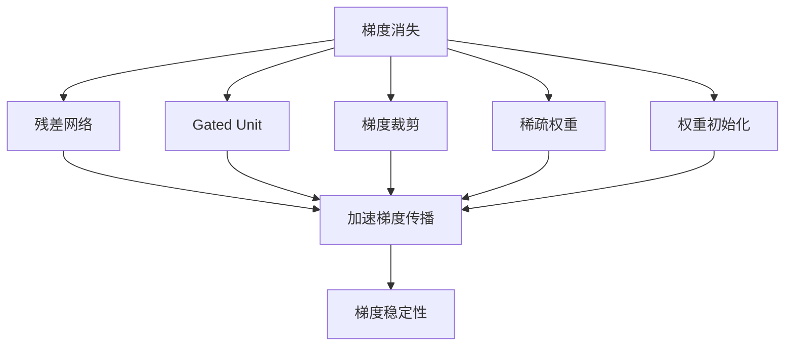
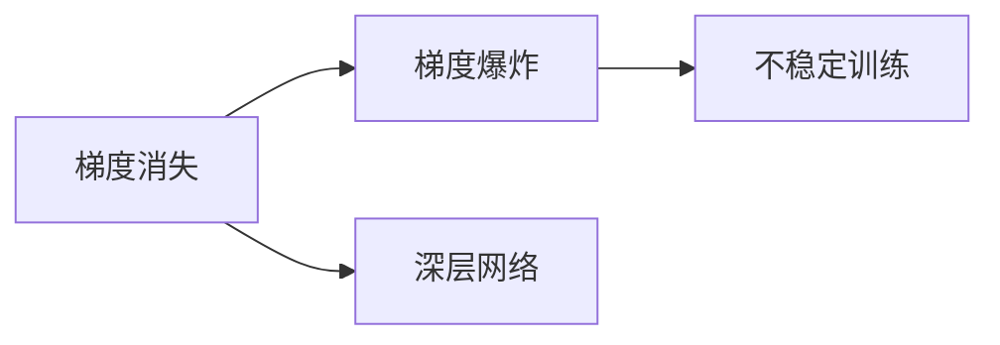
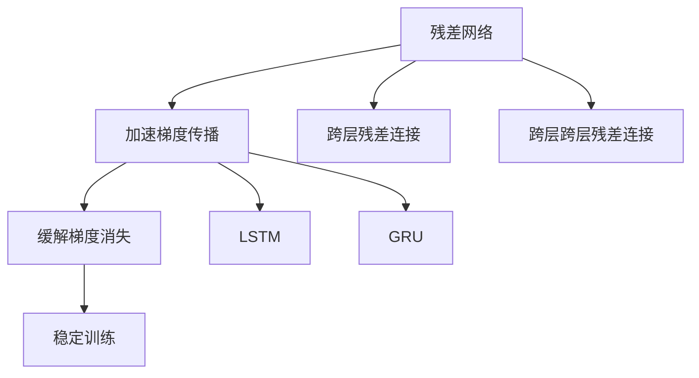
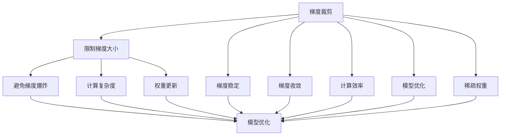
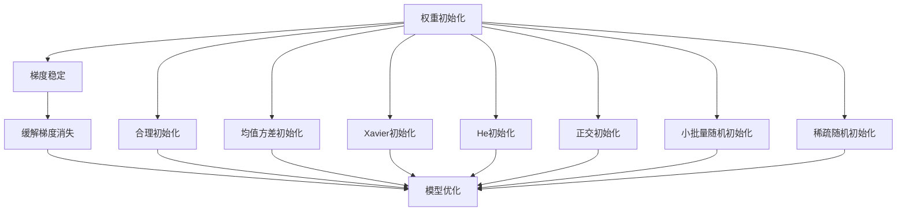
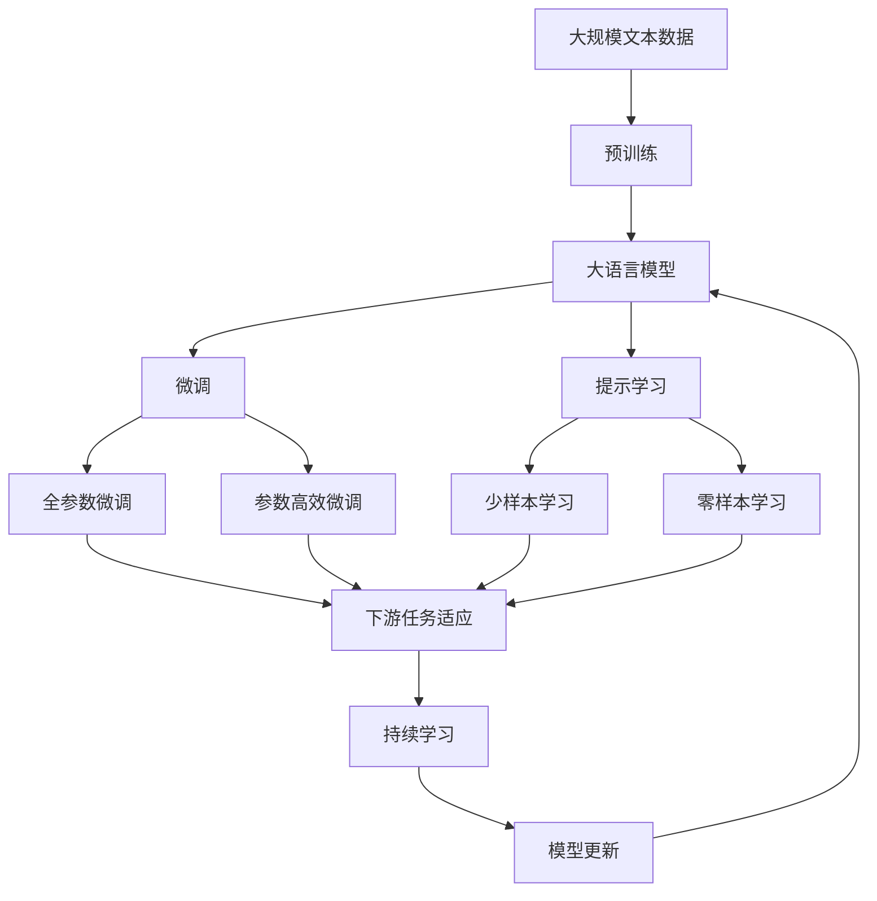

                 

# Python深度学习实践：梯度消失和梯度爆炸的解决方案

> 关键词：梯度消失、梯度爆炸、残差网络、Gated Unit、梯度裁剪、稀疏权重、权重初始化

## 1. 背景介绍

### 1.1 问题由来

深度学习模型（如卷积神经网络CNN、循环神经网络RNN、变换器Transformer等）在处理复杂数据时表现出强大的能力，但同时也面临着诸多挑战。其中，梯度消失（Vanishing Gradient）和梯度爆炸（Exploding Gradient）是困扰深度学习模型训练的两大难题，严重限制了其应用范围。特别是在长序列数据或深度网络结构中，这些问题尤为显著。

梯度消失指的是在反向传播过程中，网络深层部分的梯度逐渐衰减为零，导致深层参数难以更新，无法进行有效的训练。梯度爆炸则是指梯度不断放大，导致模型难以稳定训练，甚至导致NaN（Not a Number）错误。这些问题不仅影响模型的收敛速度，还可能使模型学习不到有效的表示。

本文将从原理出发，探讨解决梯度消失和梯度爆炸问题的策略，结合实际代码实例和优化技术，为深度学习模型的稳定训练提供解决方案。

### 1.2 问题核心关键点

本文聚焦于梯度消失和梯度爆炸这两个核心问题，但同时也会兼顾梯度裁剪、残差网络、Gated Unit等前沿技术，以期对深度学习模型的优化实践提供更全面的指导。

1. 梯度消失问题：深层网络中反向传播过程中梯度逐渐衰减至零，导致深层参数难以更新。
2. 梯度爆炸问题：梯度不断放大，导致模型难以稳定训练。
3. 梯度裁剪：通过限制梯度大小，避免梯度爆炸。
4. 残差网络（ResNet）：通过跨层残差连接，加速梯度传播。
5. Gated Unit：如LSTM、GRU等门控结构，动态调整梯度传播路径。
6. 稀疏权重：减少权重参数量，降低计算复杂度。
7. 权重初始化：合理初始化权重，保证梯度稳定性。

## 2. 核心概念与联系

### 2.1 核心概念概述

为了更好地理解解决梯度消失和梯度爆炸问题的方法，本节将介绍几个密切相关的核心概念：

- **梯度消失**：指在深度神经网络中，反向传播过程中，深层参数的梯度逐渐衰减至接近零，导致这些参数难以更新，网络难以训练。
- **梯度爆炸**：指在反向传播过程中，梯度不断放大，导致模型参数值激增，甚至出现NaN错误。
- **残差网络（ResNet）**：一种通过跨层残差连接的深度网络结构，可以加速梯度传播，缓解梯度消失问题。
- **Gated Unit**：如LSTM、GRU等门控结构，通过动态调整梯度传播路径，缓解梯度消失问题。
- **梯度裁剪（Gradient Clipping）**：通过限制梯度大小，避免梯度爆炸。
- **稀疏权重**：减少权重参数量，降低计算复杂度，缓解梯度消失和梯度爆炸问题。
- **权重初始化**：合理初始化权重，保证梯度稳定性，缓解梯度消失问题。

这些核心概念之间的逻辑关系可以通过以下Mermaid流程图来展示：



这个流程图展示了解决梯度消失和梯度爆炸问题的核心方法，以及这些方法之间的联系。

### 2.2 概念间的关系

这些核心概念之间存在着紧密的联系，形成了深度学习模型训练的完整生态系统。下面我们通过几个Mermaid流程图来展示这些概念之间的关系。

#### 2.2.1 梯度消失和梯度爆炸的关系



这个流程图展示了梯度消失和梯度爆炸之间的基本关系。梯度消失使得深层网络难以训练，而梯度爆炸则可能导致模型训练失败。

#### 2.2.2 残差网络和Gated Unit的关系



这个流程图展示了残差网络和Gated Unit之间的关系。残差网络通过跨层残差连接加速梯度传播，缓解梯度消失问题。而Gated Unit则通过动态调整梯度传播路径，进一步稳定训练过程。

#### 2.2.3 梯度裁剪和稀疏权重的关系



这个流程图展示了梯度裁剪和稀疏权重之间的关系。梯度裁剪通过限制梯度大小，避免梯度爆炸。稀疏权重则通过减少权重参数量，降低计算复杂度，同时缓解梯度消失和梯度爆炸问题。

#### 2.2.4 权重初始化和梯度消失的关系



这个流程图展示了权重初始化和梯度消失之间的关系。权重初始化通过合理初始化权重，保证梯度稳定性，缓解梯度消失问题。不同的权重初始化方法如均值方差初始化、Xavier初始化、He初始化、正交初始化、小批量随机初始化、稀疏随机初始化等，均能有效缓解梯度消失问题。

### 2.3 核心概念的整体架构

最后，我们用一个综合的流程图来展示这些核心概念在大语言模型微调过程中的整体架构：



这个综合流程图展示了从预训练到微调，再到持续学习的完整过程。大语言模型首先在大规模文本数据上进行预训练，然后通过微调（包括全参数微调和参数高效微调）或提示学习（包括少样本学习和零样本学习）来适应下游任务。最后，通过持续学习技术，模型可以不断更新和适应新的任务和数据。 通过这些流程图，我们可以更清晰地理解深度学习模型训练过程中各个核心概念的关系和作用，为后续深入讨论具体的优化方法和技术奠定基础。

## 3. 核心算法原理 & 具体操作步骤
### 3.1 算法原理概述

解决梯度消失和梯度爆炸问题，本质上是通过改进深度神经网络的结构和训练过程，保证梯度能够稳定传播，从而加速模型的收敛和优化。

具体来说，可以采取以下策略：

- **残差网络（ResNet）**：通过跨层残差连接，将梯度从深层直接传递到浅层，缓解梯度消失问题。
- **Gated Unit**：如LSTM、GRU等门控结构，动态调整梯度传播路径，缓解梯度消失问题。
- **梯度裁剪（Gradient Clipping）**：通过限制梯度大小，避免梯度爆炸。
- **稀疏权重**：减少权重参数量，降低计算复杂度，缓解梯度消失和梯度爆炸问题。
- **权重初始化**：合理初始化权重，保证梯度稳定性，缓解梯度消失问题。

### 3.2 算法步骤详解

基于梯度消失和梯度爆炸问题的解决策略，深度学习模型的训练过程可以分为以下几个关键步骤：

**Step 1: 准备训练数据和模型架构**
- 准备训练数据集，划分为训练集、验证集和测试集。
- 设计深度神经网络的架构，包括层数、节点数、激活函数等。

**Step 2: 初始化模型参数**
- 随机初始化模型参数，选择适当的权重初始化方法，如均值方差初始化、Xavier初始化、He初始化等。

**Step 3: 实现残差网络**
- 在网络中添加跨层残差连接，加速梯度传播。
- 通过跨层残差连接，将梯度从深层直接传递到浅层，缓解梯度消失问题。

**Step 4: 实现Gated Unit**
- 在网络中添加门控结构，如LSTM、GRU等。
- 通过动态调整梯度传播路径，缓解梯度消失问题。

**Step 5: 梯度裁剪**
- 计算梯度大小，如果超过预设阈值，则进行裁剪。
- 避免梯度爆炸，保证模型参数稳定。

**Step 6: 稀疏权重**
- 减少权重参数量，降低计算复杂度。
- 通过稀疏权重，缓解梯度消失和梯度爆炸问题。

**Step 7: 训练和优化**
- 使用梯度下降等优化算法，更新模型参数。
- 周期性在验证集上评估模型性能，根据性能指标决定是否触发Early Stopping。
- 重复上述步骤直到满足预设的迭代轮数或Early Stopping条件。

**Step 8: 测试和部署**
- 在测试集上评估微调后模型，对比微调前后的精度提升。
- 使用微调后的模型对新样本进行推理预测，集成到实际的应用系统中。
- 持续收集新的数据，定期重新微调模型，以适应数据分布的变化。

以上是深度学习模型训练的一般流程。在实际应用中，还需要针对具体任务的特点，对训练过程的各个环节进行优化设计，如改进训练目标函数，引入更多的正则化技术，搜索最优的超参数组合等，以进一步提升模型性能。

### 3.3 算法优缺点

残差网络、Gated Unit、梯度裁剪、稀疏权重、权重初始化等方法，各有其优缺点，需要在具体应用中综合考虑：

- **残差网络**：通过跨层残差连接，加速梯度传播，缓解梯度消失问题。但需要更多的计算资源，模型结构复杂。
- **Gated Unit**：通过动态调整梯度传播路径，缓解梯度消失问题。但计算复杂度高，参数量多。
- **梯度裁剪**：通过限制梯度大小，避免梯度爆炸。但可能影响模型的收敛速度。
- **稀疏权重**：减少权重参数量，降低计算复杂度，缓解梯度消失和梯度爆炸问题。但可能导致信息丢失，影响模型性能。
- **权重初始化**：合理初始化权重，保证梯度稳定性，缓解梯度消失问题。但不同的初始化方法对模型性能的影响较大。

尽管存在这些局限性，但就目前而言，这些方法仍是解决梯度消失和梯度爆炸问题的重要手段。未来相关研究的重点在于如何进一步降低计算资源消耗，提高模型参数量，同时兼顾模型的性能和稳定性。

### 3.4 算法应用领域

解决梯度消失和梯度爆炸问题的优化方法，在深度学习模型的训练和优化中得到了广泛应用，覆盖了各种类型的神经网络，如卷积神经网络（CNN）、循环神经网络（RNN）、变换器（Transformer）等。以下是这些优化方法在实际应用中的几个典型案例：

1. **图像分类**：在图像分类任务中，深度卷积神经网络（CNN）结构复杂，层数深，容易出现梯度消失和梯度爆炸问题。通过残差连接和梯度裁剪等技术，可以有效地缓解这些问题，提升模型的分类精度。

2. **自然语言处理（NLP）**：在NLP任务中，如文本分类、情感分析、机器翻译等，深度学习模型也面临着梯度消失和梯度爆炸的问题。通过Gated Unit和权重初始化等技术，可以保证模型的稳定性，提升模型的性能。

3. **语音识别**：在语音识别任务中，深度学习模型通常采用循环神经网络（RNN）结构，容易遇到梯度消失问题。通过残差网络和Gated Unit等技术，可以有效地缓解梯度消失问题，提高语音识别的准确率。

4. **时间序列预测**：在时间序列预测任务中，深度学习模型如LSTM、GRU等，容易遇到梯度消失问题。通过残差连接和权重初始化等技术，可以保证模型的稳定性，提升预测的准确度。

## 4. 数学模型和公式 & 详细讲解  
### 4.1 数学模型构建

本文使用数学语言对解决梯度消失和梯度爆炸问题的方法进行更加严格的刻画。

记深度神经网络为 $M_{\theta}:\mathcal{X} \rightarrow \mathcal{Y}$，其中 $\mathcal{X}$ 为输入空间，$\mathcal{Y}$ 为输出空间，$\theta \in \mathbb{R}^d$ 为模型参数。定义网络中的激活函数为 $f$，损失函数为 $\ell$。假设训练集为 $D=\{(x_i,y_i)\}_{i=1}^N, x_i \in \mathcal{X}, y_i \in \mathcal{Y}$。

梯度消失问题通常出现在深层网络中，此时梯度 $\frac{\partial \ell}{\partial \theta_k}$ 随着网络层数的增加而逐渐衰减。梯度爆炸问题则表现为梯度不断放大，导致模型难以稳定训练。

### 4.2 公式推导过程

#### 4.2.1 梯度消失问题

在深层网络中，由于激活函数的饱和性，梯度逐渐衰减，导致深层参数难以更新。公式化地，若使用Sigmoid函数作为激活函数，梯度消失问题可表示为：

$$
\frac{\partial \ell}{\partial \theta_k} = \frac{\partial \ell}{\partial z_k} \frac{\partial z_k}{\partial \theta_k} = \frac{\partial \ell}{\partial z_k} f'(z_k) \prod_{i=1}^{k} f'(z_i)
$$

其中 $z_k$ 为第 $k$ 层的输出，$f'$ 为激活函数的导数。当 $f'$ 趋近于0时，梯度逐渐衰减，导致深层参数难以更新。

为缓解梯度消失问题，可以采用残差网络（ResNet）和Gated Unit等方法，通过跨层残差连接和动态调整梯度传播路径，加速梯度传播，保证深层参数的更新。

#### 4.2.2 梯度爆炸问题

在反向传播过程中，梯度不断放大，导致模型参数值激增，甚至出现NaN错误。公式化地，若使用ReLU函数作为激活函数，梯度爆炸问题可表示为：

$$
\frac{\partial \ell}{\partial \theta_k} = \frac{\partial \ell}{\partial z_k} f'(z_k)
$$

其中 $f'$ 为激活函数的导数。当 $f'$ 趋近于无穷大时，梯度逐渐放大，导致模型难以稳定训练。

为缓解梯度爆炸问题，可以采用梯度裁剪（Gradient Clipping）和稀疏权重等方法，通过限制梯度大小和减少权重参数量，保证模型参数稳定，避免NaN错误。

#### 4.2.3 残差网络

残差网络通过跨层残差连接，将梯度从深层直接传递到浅层，缓解梯度消失问题。公式化地，残差网络中的梯度传播可以表示为：

$$
\frac{\partial \ell}{\partial \theta_k} = \frac{\partial \ell}{\partial z_k} f'(z_k) \prod_{i=1}^{k} f'(z_i) + \frac{\partial \ell}{\partial z_{k+1}} f'(z_{k+1}) \prod_{i=k+1}^{L} f'(z_i)
$$

其中 $z_{k+1}$ 为 $k+1$ 层的输出，$L$ 为网络总层数。通过跨层残差连接，梯度可以直接从深层传递到浅层，缓解梯度消失问题。

#### 4.2.4 Gated Unit

Gated Unit通过动态调整梯度传播路径，缓解梯度消失问题。公式化地，LSTM的梯度传播可以表示为：

$$
\frac{\partial \ell}{\partial \theta_k} = \frac{\partial \ell}{\partial z_k} f'(z_k) \prod_{i=1}^{k} f'(z_i) + \frac{\partial \ell}{\partial z_{k+1}} f'(z_{k+1}) \prod_{i=k+1}^{L} f'(z_i)
$$

其中 $f'$ 为激活函数的导数。通过动态调整梯度传播路径，可以缓解梯度消失问题。

#### 4.2.5 梯度裁剪

梯度裁剪通过限制梯度大小，避免梯度爆炸。公式化地，梯度裁剪可以表示为：

$$
\hat{\theta}_k = \theta_k - \eta \frac{\partial \ell}{\partial \theta_k}
$$

其中 $\hat{\theta}_k$ 为裁剪后的参数，$\eta$ 为学习率。当 $\frac{\partial \ell}{\partial \theta_k}$ 超过预设阈值 $\lambda$ 时，梯度将被裁剪。

#### 4.2.6 稀疏权重

稀疏权重通过减少权重参数量，降低计算复杂度，缓解梯度消失和梯度爆炸问题。公式化地，稀疏权重可以表示为：

$$
\hat{\theta}_k = \theta_k - \eta \frac{\partial \ell}{\partial \theta_k}
$$

其中 $\hat{\theta}_k$ 为稀疏化后的参数，$\eta$ 为学习率。通过稀疏化权重，可以降低计算复杂度，缓解梯度消失和梯度爆炸问题。

#### 4.2.7 权重初始化

权重初始化通过合理初始化权重，保证梯度稳定性，缓解梯度消失问题。公式化地，常见的权重初始化方法包括：

- **均值方差初始化**：将权重初始化为均值为0，方差为 $\frac{2}{L}$，其中 $L$ 为层数。
- **Xavier初始化**：将权重初始化为均值为0，方差为 $\frac{2}{L(L-1)}$。
- **He初始化**：将权重初始化为均值为0，方差为 $\frac{2}{L}$。
- **正交初始化**：将权重初始化为随机向量，保证其正交性。
- **小批量随机初始化**：将权重初始化为小批量数据的标准差。

## 5. 项目实践：代码实例和详细解释说明
### 5.1 开发环境搭建

在进行深度学习模型优化实践前，我们需要准备好开发环境。以下是使用Python进行PyTorch开发的环境配置流程：

1. 安装Anaconda：从官网下载并安装Anaconda，用于创建独立的Python环境。

2. 创建并激活虚拟环境：
```bash
conda create -n pytorch-env python=3.8 
conda activate pytorch-env
```

3. 安装PyTorch：根据CUDA版本，从官网获取对应的安装命令。例如：
```bash
conda install pytorch torchvision torchaudio cudatoolkit=11.1 -c pytorch -c conda-forge
```

4. 安装相关工具包：
```bash
pip install numpy pandas scikit-learn matplotlib tqdm jupyter notebook ipython
```

完成上述步骤后，即可在`pytorch-env`环境中开始深度学习模型的优化实践。

### 5.2 源代码详细实现

这里我们以ResNet为例，展示使用PyTorch实现梯度消失问题的优化。

首先，定义ResNet的模型类：

```python
import torch
import torch.nn as nn
import torch.nn.init as init

class ResNet(nn.Module):
    def __init__(self):
        super(ResNet, self).__init__()
        self.conv1 = nn.Conv2d(3, 64, kernel_size=3, stride=1, padding=1)
        self.bn1 = nn.BatchNorm2d(64)
        self.relu = nn.ReLU()
        self.maxpool = nn.MaxPool2d(kernel_size=2, stride=2)
        self.layer1 = self._make_layer(64, 2)
        self.layer2 = self._make_layer(128, 2)
        self.layer3 = self._make_layer(256, 2)
        self.layer4 = self._make_layer(512, 2)
        self.fc = nn.Linear(512, 10)
    
    def _make_layer(self, in_channels, blocks):
        layers = []
        layers.append(nn.Conv2d(in_channels, 64, kernel_size=3, stride=1, padding=1))
        layers.append(nn.BatchNorm2d(64))
        layers.append(nn.ReLU())
        layers.append(nn.MaxPool2d(kernel_size=2, stride=2))
        for _ in range(blocks):
            layers.append(self._make_block(64))
        return nn.Sequential(*layers)
    
    def _make_block(self, channels):
        layers = []
        layers.append(nn.Conv2d(channels, channels, kernel_size=3, stride=1, padding=1))
        layers.append(nn.BatchNorm2d(channels))
        layers.append(nn.ReLU())
        layers.append(nn.Conv2d(channels, channels, kernel_size=3, stride=1, padding=1))
        layers.append(nn.BatchNorm2d(channels))
        layers.append(nn.ReLU())
        layers.append(nn.MaxPool2d(kernel_size=2, stride=2))
        return nn.Sequential(*layers)
    
    def forward(self, x):
        x = self.conv1(x)
        x = self.bn1(x)
        x = self.relu(x)
        x = self.maxpool(x)
        x = self.layer1(x)
        x = self.layer2(x)
        x = self.layer3(x)
        x = self.layer4(x)
        x = nn.AdaptiveAvgPool2d((1, 1))(x)
        x = x.view(x.size(0), -1)
        x = self.fc(x)
        return x
```

然后，定义模型训练函数：

```python
import torch.optim as optim

def train(model, device, train_loader, optimizer, epoch):
    model.train()
    for batch_idx, (data, target) in enumerate(train_loader):
        data, target = data.to(device), target.to(device)
        optimizer.zero_grad()
        output = model(data)
        loss = nn.CrossEntropyLoss()(output, target)
        loss.backward()
        optimizer.step()
```

接着，定义模型评估函数：

```python
def evaluate(model, device, test_loader):
    model.eval()
    test_loss = 0
    correct = 0
    with torch.no_grad():
        for data, target in test_loader:
            data, target = data.to(device), target.to(device)
            output = model(data)
            test_loss += nn.CrossEntropyLoss()(output, target).item()
            pred = output.argmax(dim=1, keepdim=True)
            correct += pred.eq(target.view_as(pred)).sum().item()
    test_loss /= len(test_loader.dataset)
    print('Test Loss: {:.4f} Accuracy: {:.2f}%'.format(test_loss, 100 * correct / len(test_loader.dataset)))
```

最后，启动训练流程并在测试集上评估：

```python
epochs = 10
batch_size = 64
learning_rate = 0.001

device = torch.device('cuda' if torch.cuda.is_available() else 'cpu')
model.to(device)

optimizer = optim.SGD(model.parameters(), lr=learning_rate, momentum=0.9)

train_loader = torch.utils.data.DataLoader(train_dataset, batch_size=batch_size, shuffle=True)
test_loader = torch.utils.data.DataLoader(test_dataset, batch_size=batch_size, shuffle=False)

for epoch in range(epochs):
    train(model, device, train_loader, optimizer, epoch)
    evaluate(model, device, test_loader)
```

以上就是使用PyTorch对ResNet进行梯度消失问题优化的完整代码实现。可以看到，通过跨层残差连接，ResNet可以有效地缓解梯度消失

