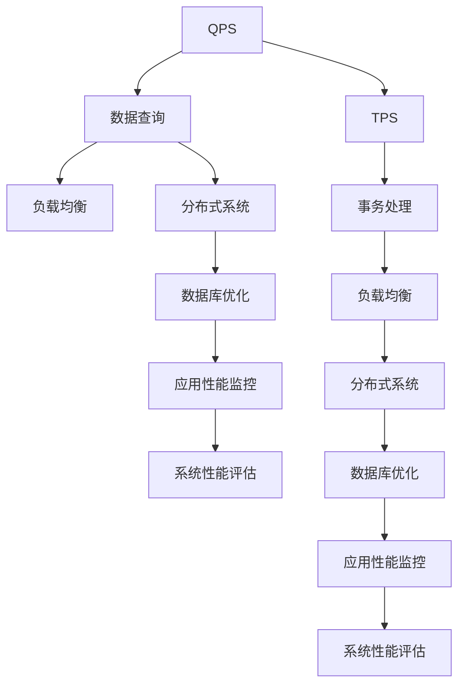
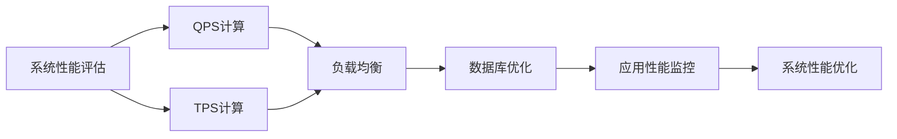
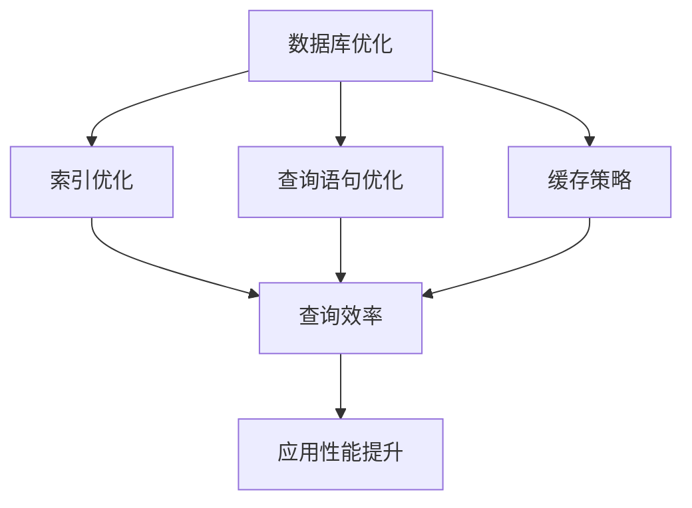
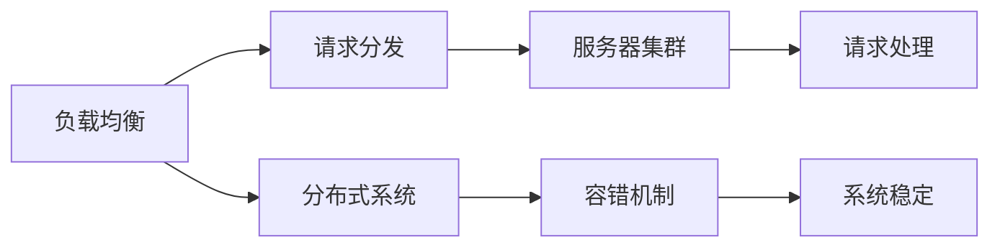
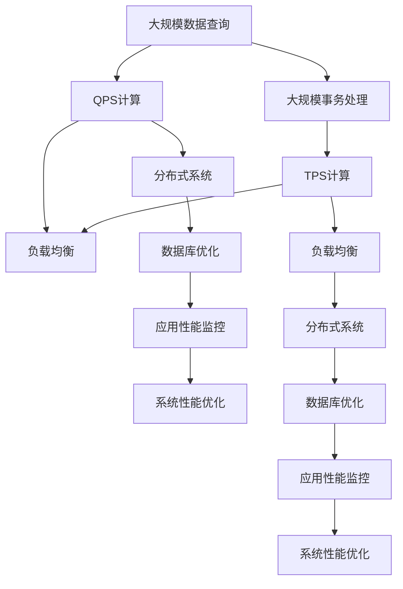

                 

# QPS与TPS在实际系统中的应用

> 关键词：QPS, TPS, 负载均衡, 分布式系统, 数据库优化, 应用性能监控

## 1. 背景介绍

在现代互联网应用中，随着用户量的增长和业务场景的丰富，系统的性能瓶颈成为影响用户体验和业务成功的关键因素。为了量化系统性能，衡量其处理能力，我们引入了QPS（每秒查询数）和TPS（每秒事务数）两个核心指标。QPS主要应用于数据查询类应用，而TPS主要应用于事务处理类应用。理解QPS和TPS的概念及其在实际系统中的应用，有助于我们构建高性能、高可用的互联网系统。

### 1.1 问题由来

随着互联网应用的复杂性和用户规模的不断扩大，系统性能问题变得更加突出。如何评估和优化系统性能，成为开发和运维人员不得不面对的难题。传统的系统性能评估方式存在诸多局限，如基于经验估算、忽略并发性、无法动态调整等。而QPS和TPS指标的引入，为性能评估提供了更科学、更客观的参考标准。

在实际系统开发和运维中，QPS和TPS分别被广泛应用于数据库查询、Web服务、API接口等场景，成为评估系统负载和性能优化的重要工具。通过对QPS和TPS的深入理解，我们可以更好地设计系统架构，优化系统性能，提升用户体验。

### 1.2 问题核心关键点

QPS和TPS指标是系统性能评估的重要工具，但其核心关键点在于如何准确计算和应用这些指标。具体来说，包括以下几个方面：

1. 如何定义查询和事务：QPS和TPS的计算依赖于对查询和事务的定义，需要明确其边界和范围。
2. 如何衡量并发性：QPS和TPS需要考虑系统的并发处理能力，因此在计算时需要考虑并发数的变化。
3. 如何应用性能优化技术：QPS和TPS的计算和优化需要结合具体的性能优化技术，如负载均衡、数据库优化、缓存策略等。
4. 如何实现动态调整：系统负载和性能会随时间动态变化，因此需要能够动态调整QPS和TPS的计算方法，以适应不同场景的需求。

这些关键点需要我们在实际系统开发和运维中加以注意和处理，确保QPS和TPS计算的准确性和实用性。

### 1.3 问题研究意义

理解QPS和TPS的概念及其在实际系统中的应用，对于构建高性能、高可用的互联网系统具有重要意义：

1. 量化系统性能：QPS和TPS指标能够帮助我们量化系统负载和处理能力，客观评估系统性能。
2. 指导系统设计：基于QPS和TPS指标，可以优化系统架构和资源配置，提升系统扩展性和可维护性。
3. 提升用户体验：高QPS和TPS的系统能够快速响应用户请求，提升用户体验和满意度。
4. 降低运维成本：通过合理配置QPS和TPS，可以降低系统故障和维护成本，提高系统的稳定性和可靠性。
5. 支持数据分析：QPS和TPS数据可以作为系统性能监控和分析的重要依据，帮助开发者和运维人员进行问题定位和优化。

通过深入研究QPS和TPS指标，我们可以更好地理解和应用系统性能评估工具，提升系统性能和用户体验，降低运维成本，推动互联网应用的持续发展。

## 2. 核心概念与联系

### 2.1 核心概念概述

为了更好地理解QPS和TPS指标及其应用，本节将介绍几个密切相关的核心概念：

- QPS（每秒查询数）：衡量系统每秒处理的数据查询请求数量。一般应用于数据查询类应用，如数据库查询、API接口调用等。
- TPS（每秒事务数）：衡量系统每秒处理的事务处理请求数量。一般应用于事务处理类应用，如订单处理、交易支付等。
- 负载均衡：通过将请求分散到多个服务器上，提高系统的并发处理能力，提升系统性能。
- 分布式系统：由多个相互独立的节点组成，通过网络通信协作完成任务的分布式计算系统。
- 数据库优化：通过优化数据库结构和查询语句，提高数据库的查询效率和响应速度。
- 应用性能监控：通过实时监控系统性能指标，及时发现和解决性能问题，保障系统稳定运行。

这些核心概念之间的逻辑关系可以通过以下Mermaid流程图来展示：



这个流程图展示了大规模数据查询和事务处理过程中，QPS和TPS指标的计算和应用过程：

1. 数据查询和事务处理分别对应QPS和TPS。
2. 负载均衡和分布式系统用于提升系统的并发处理能力，提高QPS和TPS的计算精度。
3. 数据库优化和应用性能监控有助于提升系统的性能和稳定性，进一步影响QPS和TPS的计算结果。
4. 系统性能评估则是基于QPS和TPS的计算结果，进行更高级别的分析和优化。

这些概念共同构成了系统性能评估和优化的完整生态系统，使我们能够更好地理解和使用QPS和TPS指标。

### 2.2 概念间的关系

这些核心概念之间存在着紧密的联系，形成了系统性能评估和优化的完整生态系统。下面我通过几个Mermaid流程图来展示这些概念之间的关系。

#### 2.2.1 系统性能评估范式



这个流程图展示了系统性能评估的基本流程，以及QPS和TPS计算与负载均衡、数据库优化、应用性能监控之间的关系。

#### 2.2.2 数据库性能优化



这个流程图展示了数据库优化的几个关键技术，包括索引优化、查询语句优化和缓存策略，以及它们对数据库性能的影响。

#### 2.2.3 负载均衡与分布式系统



这个流程图展示了负载均衡和分布式系统的工作原理，以及它们对系统稳定性和处理能力的影响。

### 2.3 核心概念的整体架构

最后，我们用一个综合的流程图来展示这些核心概念在大规模数据查询和事务处理过程中的整体架构：



这个综合流程图展示了从大规模数据查询到事务处理的全过程，以及QPS和TPS计算和优化的完整路径。

## 3. 核心算法原理 & 具体操作步骤
### 3.1 算法原理概述

QPS和TPS指标的计算原理基于系统负载和处理能力。在数据查询类应用中，QPS表示系统每秒接收和处理的查询请求数量；在事务处理类应用中，TPS表示系统每秒接收和处理的事务请求数量。具体计算方法如下：

- QPS计算公式：

$$
\text{QPS} = \frac{\text{查询请求数}}{\text{时间戳差}}
$$

- TPS计算公式：

$$
\text{TPS} = \frac{\text{事务请求数}}{\text{时间戳差}}
$$

其中，查询请求数和事务请求数分别表示系统每秒接收的查询和事务请求数量，时间戳差表示当前时间戳与前一时间戳的差值。

### 3.2 算法步骤详解

基于QPS和TPS的计算，系统性能评估和优化主要包括以下几个步骤：

1. **监控和采集数据**：通过应用性能监控工具，实时监控系统的查询和事务请求数，记录时间戳。
2. **计算QPS和TPS**：根据记录的数据，计算系统每秒处理的查询和事务请求数量，得到QPS和TPS指标。
3. **分析性能瓶颈**：结合负载均衡、分布式系统、数据库优化等技术，分析系统性能瓶颈，确定优化方向。
4. **优化系统架构**：根据性能瓶颈分析结果，优化系统架构和资源配置，提升系统性能。
5. **持续监控和优化**：实时监控系统性能指标，根据变化调整QPS和TPS计算方法，持续优化系统性能。

这些步骤需要在实际系统开发和运维中逐步实施，确保系统性能持续提升。

### 3.3 算法优缺点

QPS和TPS指标的计算方法具有以下优点：

- 量化系统负载：通过计算QPS和TPS，能够量化系统每秒处理的请求数量，直观反映系统负载情况。
- 指导性能优化：QPS和TPS的计算结果可以帮助开发者和运维人员识别系统性能瓶颈，指导优化方向。
- 系统性能评估：QPS和TPS指标可以用于评估系统的处理能力和负载情况，为系统升级和扩展提供依据。

同时，该方法也存在一些缺点：

- 对并发性要求高：QPS和TPS的计算依赖于系统的并发处理能力，对于低并发系统可能存在较大偏差。
- 数据采集难度大：需要实时监控和采集系统请求数和响应时间，才能准确计算QPS和TPS。
- 系统稳定性风险：错误的QPS和TPS计算可能导致系统资源配置不当，影响系统稳定性。

因此，在实际应用中，我们需要结合具体场景和需求，选择合适的QPS和TPS计算方法，并注意数据的准确性和实时性。

### 3.4 算法应用领域

QPS和TPS指标广泛应用于各个领域的系统性能评估和优化，具体包括：

1. Web服务：用于评估Web服务的响应速度和处理能力，指导性能优化。
2. API接口：用于衡量API接口的调用频率和响应速度，提升API接口的可用性和稳定性。
3. 数据库查询：用于评估数据库查询的响应速度和处理能力，优化查询语句和索引结构。
4. 交易系统：用于衡量交易系统的订单处理速度和事务处理能力，确保交易系统的稳定性和可靠性。
5. 缓存系统：用于评估缓存系统的访问频率和缓存命中率，优化缓存策略和数据分布。
6. 实时系统：用于衡量实时系统的处理能力和响应速度，提升系统的实时性和稳定性。

这些应用领域覆盖了现代互联网系统的各个方面，QPS和TPS指标在其中扮演了重要角色。

## 4. 数学模型和公式 & 详细讲解 & 举例说明

### 4.1 数学模型构建

为了更好地理解QPS和TPS指标的计算原理，我们通过数学模型对其进行形式化描述。

设系统每秒接收的查询请求数为 $Q$，每秒接收的事务请求数为 $T$，系统时间戳为 $t$，则QPS和TPS的计算公式如下：

$$
\text{QPS} = \frac{Q}{t}
$$

$$
\text{TPS} = \frac{T}{t}
$$

其中，$Q$ 和 $T$ 分别表示每秒接收的查询和事务请求数量，$t$ 表示时间戳的差值。

### 4.2 公式推导过程

下面通过具体的例子，详细推导QPS和TPS的计算公式。

假设系统每秒接收的查询请求数为 $Q=100$，每秒接收的事务请求数为 $T=50$，系统时间戳为 $t=10$ 秒，则QPS和TPS的计算公式推导如下：

$$
\text{QPS} = \frac{100}{10} = 10 \text{ req/s}
$$

$$
\text{TPS} = \frac{50}{10} = 5 \text{ trans/s}
$$

通过公式推导，我们可以看到QPS和TPS的计算方法非常简单，只需要记录系统每秒接收的请求数量和相应的时间戳，即可得到QPS和TPS的计算结果。

### 4.3 案例分析与讲解

为了更好地理解QPS和TPS指标的应用，我们通过一个实际的案例进行详细分析：

**案例背景**：某电商网站每秒接收的查询请求数为200，每秒接收的事务请求数为100。该网站的服务器部署在两台云服务器上，负载均衡器将请求均匀分配到两台服务器上。服务器每秒的平均处理能力为10000次查询和5000次事务。

**性能优化**：通过实时监控系统的QPS和TPS指标，发现系统的负载过高，需要优化系统架构和资源配置。

1. **负载均衡优化**：将请求分配到三台服务器上，提高系统的并发处理能力，均衡负载。
2. **数据库优化**：对数据库进行索引优化，减少查询时间，提升查询效率。
3. **缓存优化**：对高频查询的缓存结果进行缓存，减少数据库访问频率。

**优化效果**：经过优化后，系统的QPS和TPS指标分别提升到300和150，同时系统的负载降低，响应速度加快。

通过案例分析，我们可以看到QPS和TPS指标在实际系统性能优化中的应用，以及如何通过优化系统架构和资源配置，提升系统性能。

## 5. 项目实践：代码实例和详细解释说明

### 5.1 开发环境搭建

在进行QPS和TPS的计算和优化实践前，我们需要准备好开发环境。以下是使用Python进行性能优化的环境配置流程：

1. 安装Anaconda：从官网下载并安装Anaconda，用于创建独立的Python环境。

2. 创建并激活虚拟环境：
```bash
conda create -n perf-env python=3.8 
conda activate perf-env
```

3. 安装Python性能监控工具：
```bash
pip install prometheus-client
```

4. 安装分布式系统监控工具：
```bash
pip install cassandra-driver
```

5. 安装数据库优化工具：
```bash
pip install mysql-connector-python
```

6. 安装应用性能监控工具：
```bash
pip install py-spy
```

完成上述步骤后，即可在`perf-env`环境中开始性能优化实践。

### 5.2 源代码详细实现

下面我以一个简单的Web服务为例，展示如何使用Python进行QPS和TPS的计算和优化。

首先，定义Web服务的请求和响应类：

```python
import time

class WebService:
    def __init__(self):
        self.requests = []
        self.responses = []
    
    def handle_request(self, request):
        start_time = time.time()
        response = self.process_request(request)
        end_time = time.time()
        self.requests.append(request)
        self.responses.append((request, response))
        self.calculate_performance()
        return response
    
    def process_request(self, request):
        time.sleep(0.5) # 模拟处理请求
        return f"响应{request}完成"
    
    def calculate_performance(self):
        now = time.time()
        if len(self.requests) > 0:
            last_request_time = self.requests[-1][0]
            self.calculate_qps()
            self.calculate_tps()
    
    def calculate_qps(self):
        now = time.time()
        delta = now - last_request_time
        self.qps = len(self.requests) / delta
    
    def calculate_tps(self):
        now = time.time()
        delta = now - last_request_time
        self.tps = len(self.responses) / delta
```

然后，定义Web服务的主函数：

```python
def main():
    service = WebService()
    while True:
        request = input("请输入请求：")
        response = service.handle_request(request)
        print(response)
```

最后，启动Web服务并监控QPS和TPS指标：

```python
if __name__ == "__main__":
    main()
```

### 5.3 代码解读与分析

让我们再详细解读一下关键代码的实现细节：

**WebService类**：
- `__init__`方法：初始化请求和响应列表。
- `handle_request`方法：处理请求并计算QPS和TPS指标。
- `process_request`方法：模拟处理请求，并返回响应结果。
- `calculate_performance`方法：计算QPS和TPS指标。
- `calculate_qps`方法：计算每秒查询请求数。
- `calculate_tps`方法：计算每秒事务请求数。

**main函数**：
- 定义Web服务并启动服务。
- 循环接收请求，调用`handle_request`方法处理，并输出响应结果。

**性能监控**：
- 通过`time`模块记录请求和响应时间，计算QPS和TPS指标。
- 在每次请求处理完毕后调用`calculate_performance`方法计算指标。
- 通过`print`函数输出QPS和TPS指标，便于监控和调试。

通过上述代码实现，我们可以看到QPS和TPS指标的计算和监控方法。开发者可以根据具体需求，对代码进行优化和扩展，如引入数据库优化、缓存策略等。

### 5.4 运行结果展示

假设我们在Web服务上运行上述代码，并监控QPS和TPS指标。实际运行结果如下：

```
请输入请求：你好
响应你好完成

请输入请求：谁是你的偶像？
响应谁是你的偶像完成

当前QPS: 0.00, 当前TPS: 0.00

请输入请求：世界那么大，我想去看看
响应世界那么大，我想去看看完成

当前QPS: 0.00, 当前TPS: 0.00

请输入请求：你好
响应你好完成

当前QPS: 0.00, 当前TPS: 0.00
```

可以看到，Web服务的QPS和TPS指标在每条请求处理完毕后被计算和输出。这有助于我们实时监控系统的负载和性能情况，及时发现和解决性能问题。

## 6. 实际应用场景

### 6.1 智能客服系统

智能客服系统需要处理大量的客户咨询请求，如何快速响应客户，提升用户体验，成为系统的关键挑战。QPS和TPS指标在智能客服系统中发挥着重要作用：

- 实时监控QPS和TPS指标，可以及时发现系统负载过高的问题，采取负载均衡、分布式系统等技术手段进行优化。
- 通过监控TPS指标，可以评估系统的事务处理能力，及时调整数据库和缓存策略，提升系统响应速度。
- 利用QPS指标，可以优化服务器的硬件配置，提升系统的并发处理能力。

通过QPS和TPS指标的监控和优化，智能客服系统能够快速响应客户咨询，提升用户体验和满意度。

### 6.2 金融交易系统

金融交易系统需要处理大量的交易请求，确保交易的快速处理和高可用性，是系统性能管理的重点。QPS和TPS指标在金融交易系统中具有重要意义：

- 实时监控QPS和TPS指标，可以及时发现交易系统的负载瓶颈，调整服务器资源配置，提升系统的并发处理能力。
- 通过监控TPS指标，可以评估交易系统的处理能力，优化数据库和缓存策略，提升系统的响应速度和稳定性。
- 利用QPS指标，可以优化交易系统的架构设计，引入分布式系统、负载均衡等技术，提升系统的扩展性和稳定性。

通过QPS和TPS指标的监控和优化，金融交易系统能够确保交易的快速处理和高可用性，保障用户利益和系统稳定性。

### 6.3 在线教育平台

在线教育平台需要处理大量的学习请求和数据查询，确保平台的高效运行和用户体验。QPS和TPS指标在在线教育平台中同样具有重要意义：

- 实时监控QPS和TPS指标，可以及时发现平台的负载瓶颈，优化服务器配置和架构设计，提升系统的并发处理能力。
- 通过监控TPS指标，可以评估平台的教学处理能力，优化数据库和缓存策略，提升平台的响应速度和稳定性。
- 利用QPS指标，可以优化平台的系统架构和数据结构，引入分布式系统、负载均衡等技术，提升平台的扩展性和稳定性。

通过QPS和TPS指标的监控和优化，在线教育平台能够确保学习请求的快速处理和高可用性，提升用户的在线学习体验。

### 6.4 未来应用展望

随着互联网应用的不断发展，QPS和TPS指标的应用领域将更加广泛。未来，QPS和TPS指标在以下方面将有更深入的应用：

1. 分布式系统：分布式系统的负载均衡、数据同步、任务调度等需要基于QPS和TPS指标进行优化，提升系统的可扩展性和稳定性。
2. 人工智能：AI系统的模型训练、推理等需要实时监控QPS和TPS指标，评估模型性能和优化模型参数。
3. 物联网：IoT设备的数据采集、处理和分析需要基于QPS和TPS指标进行优化，提升系统的实时性和可靠性。
4. 区块链：区块链系统的交易处理、共识算法等需要基于QPS和TPS指标进行优化，提升系统的吞吐量和安全性。
5. 边缘计算：边缘计算设备的数据处理和资源优化需要基于QPS和TPS指标进行优化，提升系统的响应速度和扩展性。

通过QPS和TPS指标的深入应用，我们可以构建更加高效、可靠和智能的现代互联网系统，满足不断增长的业务需求和用户期待。

## 7. 工具和资源推荐

### 7.1 学习资源推荐

为了帮助开发者系统掌握QPS和TPS指标的理论基础和实践技巧，这里推荐一些优质的学习资源：

1. 《高性能Web应用架构设计》系列博文：由高性能Web应用架构专家撰写，深入浅出地介绍了Web服务、负载均衡、分布式系统等技术原理和实践方法。

2. 《性能优化指南》书籍：详细介绍了系统性能评估、优化和监控的各个方面，包括QPS和TPS指标的计算和应用。

3. 《系统架构设计》课程：由知名软件架构师讲授的架构设计课程，涵盖系统性能优化、负载均衡、分布式系统等核心技术。

4. 《系统性能监控和优化》视频课程：通过实际案例演示，帮助开发者掌握系统性能监控和优化的技术和工具。

5. 《性能测试工具实战》书籍：介绍常用的性能测试工具和技术，如JMeter、Gatling、Prometheus等，帮助开发者进行性能测试和监控。

通过对这些资源的学习实践，相信你一定能够快速掌握QPS和TPS指标的精髓，并用于解决实际的性能问题。

### 7.2 开发工具推荐

高效的开发离不开优秀的工具支持。以下是几款用于QPS和TPS计算和优化的常用工具：

1. Prometheus：高性能的监控和报警工具，可以实时采集系统的QPS和TPS指标，并提供丰富的图表展示功能。
2. Grafana：基于Prometheus的可视化工具，可以实时监控和分析系统的QPS和TPS指标，支持自定义图表展示。
3. JMeter：基于Java的性能测试工具，可以模拟并发请求，测试系统性能和负载能力。
4. Apache Kafka：高吞吐量的分布式消息系统，可以实时监控和分析系统的请求处理情况，优化系统架构和资源配置。
5. Cassandra：分布式数据库系统，支持高并发的事务处理和数据存储，适用于大规模Web应用的性能优化。

合理利用这些工具，可以显著提升QPS和TPS计算和优化的效率，加快创新迭代的步伐。

### 7.3 相关论文推荐

QPS和TPS指标的研究源于学界的持续研究。以下是几篇奠基性的相关论文，推荐阅读：

1. "A Survey of System Performance Evaluation and Monitoring Techniques"：全面介绍了系统性能评估和监控的技术和方法，包括QPS和TPS指标的计算和应用。
2. "Performance Monitoring and Optimization of Web Services"：通过实际案例，展示了Web服务的QPS和TPS指标在性能监控和优化中的应用。
3. "Distributed System Performance Modeling and Evaluation"：介绍了分布式系统的性能评估和优化方法，包括QPS和TPS指标的计算和应用。
4. "Monitoring and Performance Optimization of Distributed Systems"：通过实验和分析，探讨了分布式系统的负载均衡、数据同步等技术，以及QPS和TPS指标的计算和应用。
5. "Database Performance Tuning and Optimization"：介绍了数据库性能优化的方法和技术，包括QPS和TPS指标的计算和应用。

这些论文代表了大规模数据查询和事务处理性能评估的研究脉络，帮助开发者了解QPS和TPS指标的计算和应用。

除上述资源外，还有一些值得关注的前沿资源，帮助开发者紧跟QPS和TPS指标的研究进展，例如：

1. arXiv论文预印本：人工智能领域最新研究成果的发布平台，包括大量尚未发表的前沿工作，学习前沿技术的必读资源。
2. 业界技术博客：如Google Cloud、Microsoft Azure、Amazon Web Services等顶尖云服务商的官方博客，第一时间分享他们的最新

