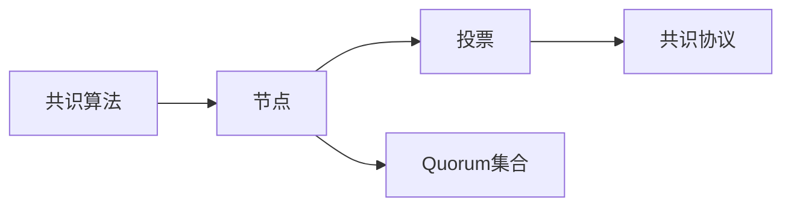
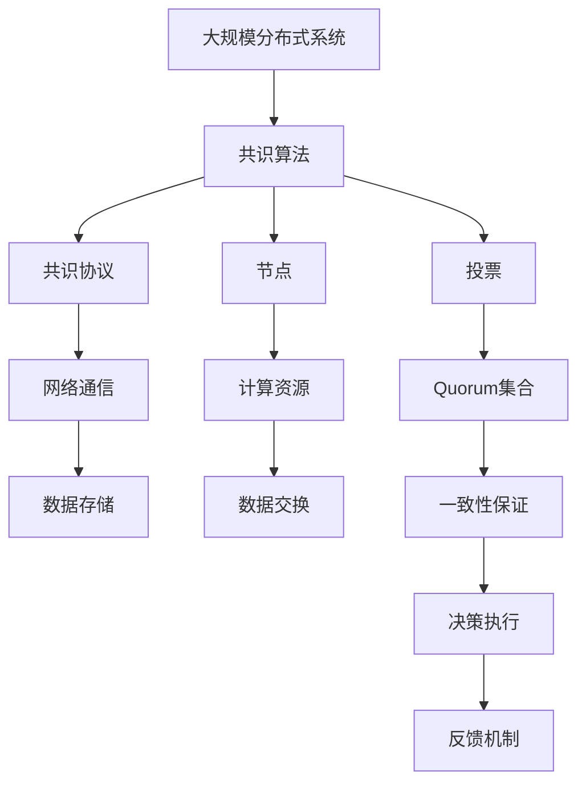

                 

## 1. 背景介绍

Quorum机制（Quorum-based Mechanism）是一种用于分布式共识算法中的基础机制，广泛应用于区块链和分布式系统领域。它基于“多数人决定”的原则，通过多数投票的方式来确定某个决策的最终结果。Quorum机制的关键在于设定合适的Quorum集合（Quorum Set），以确保决策的公正性和效率。

### 1.1 问题由来

在分布式系统中，由于网络的分散性和不确定性，单个节点或少数节点对系统的影响可能非常有限。Quorum机制的核心思想是通过节点间的协作，增加决策的可信度和可靠性。这种机制最早可以追溯到PoS（Proof of Stake）和PoW（Proof of Work）等共识算法中，已经被广泛应用于比特币、以太坊等主流区块链平台。

Quorum机制的优缺点如下：

- 优点：
  - 提升系统的鲁棒性和安全性
  - 减少攻击和故障带来的影响
  - 支持节点动态加入和退出

- 缺点：
  - 实现复杂，需要节点间进行高效的通信和协调
  - 对网络延迟和故障敏感
  - 可能存在单点故障的风险

### 1.2 问题核心关键点

Quorum机制的核心在于Quorum集合的设计，Quorum集合中包含了一定数量的节点，它们通过投票来确定最终决策。Quorum集合的大小通常与系统的参与节点数和容错能力有关。一个常用的Quorum集合设计方法是K门限（K-of-N）机制，其中K和N分别表示Quorum集合大小和系统总节点数。

Quorum机制在实际应用中的关键点包括：

- Quorum集合大小的设计
- 投票规则的设定
- 容错能力和一致性保证
- 动态节点管理

这些关键点决定了Quorum机制在具体场景中的应用效果和性能。

## 2. 核心概念与联系

### 2.1 核心概念概述

为了更好地理解Quorum机制，本节将介绍几个密切相关的核心概念：

- **共识算法**：用于在分布式系统中达成一致决策的协议，包括PoS、PoW、PBFT（Practical Byzantine Fault Tolerance）等。
- **节点**：分布式系统中的参与者，每个节点具有独立的计算和存储能力。
- **投票**：节点通过交换信息，共同决定某个决策的过程。
- **Quorum集合**：参与投票的节点集合，通过多数投票决定最终结果。
- **共识协议**：定义了节点之间如何进行投票和消息交换的协议，以达成一致决策。

### 2.2 概念间的关系

这些核心概念之间的逻辑关系可以通过以下Mermaid流程图来展示：



这个流程图展示了一致算法、节点、投票、Quorum集合和共识协议之间的关系：

1. 共识算法定义了节点之间如何进行投票和消息交换，以达成一致决策。
2. 节点是分布式系统中的参与者，通过共识算法进行决策。
3. 投票是节点通过交换信息，共同决定某个决策的过程。
4. Quorum集合是参与投票的节点集合，通过多数投票决定最终结果。
5. 共识协议定义了节点之间的消息交换规则，以确保投票过程的公正和高效。

### 2.3 核心概念的整体架构

最后，我们用一个综合的流程图来展示这些核心概念在大规模分布式系统中的应用架构：



这个综合流程图展示了从大规模分布式系统到决策执行的全过程，包括共识算法、节点、投票、Quorum集合、共识协议、网络通信、数据存储、计算资源、数据交换、一致性保证和决策执行。通过这些关键组件的协同工作，系统能够高效、可靠地达成一致决策，并执行最终结果。

## 3. 核心算法原理 & 具体操作步骤
### 3.1 算法原理概述

Quorum机制的核心思想是通过多数投票来决定某个决策，即需要在Quorum集合中通过一定数量的投票来达成共识。算法的具体实现依赖于共识协议的设计。

一个典型的Quorum机制可以包含以下几个步骤：

1. 初始化阶段：系统启动，每个节点生成初始状态，并开始等待其他节点的信息。
2. 投票阶段：节点接收其他节点的消息，进行投票。
3. 聚合阶段：接收到的投票被聚合，通过多数投票决定最终结果。
4. 执行阶段：最终结果被广播给所有节点，并执行相应的操作。
5. 反馈机制：节点间交换反馈信息，更新状态。

### 3.2 算法步骤详解

以下是一个简单的Quorum机制的详细步骤：

1. **初始化**：系统启动时，所有节点收到初始状态，并初始化Quorum集合。例如，在K门限机制中，如果系统总节点数为N，Quorum集合大小为K，则K个节点的状态将被用于初始化。

2. **投票**：每个节点接收其他节点的状态更新消息，并根据某种规则决定是否进行投票。例如，PoS机制中，节点根据其持有的权益份额进行投票。

3. **聚合**：接收到的投票被聚合，通过多数投票决定最终状态。例如，在K门限机制中，如果收到K个或以上的状态更新消息，则最终状态更新为这些消息中的多数状态。

4. **执行**：最终状态被广播给所有节点，并执行相应的操作。例如，更新区块链中的区块。

5. **反馈**：节点间交换反馈信息，更新状态。例如，节点A接收到节点B的投票，并反馈是否接受投票。

### 3.3 算法优缺点

Quorum机制的优点在于其简单高效，能够快速达成一致决策，适用于大多数分布式系统场景。其缺点包括：

- **实现复杂**：需要定义合适的Quorum集合和投票规则，并实现相应的共识协议。
- **对网络延迟敏感**：网络延迟可能影响节点之间的通信和投票过程。
- **容易受攻击**：恶意节点可能会通过攻击破坏Quorum机制的公正性。
- **单点故障风险**：如果某个关键节点故障或被攻击，可能会影响整个系统的决策。

### 3.4 算法应用领域

Quorum机制广泛应用于以下领域：

- **区块链**：例如，以太坊中的共识机制PBFT就是基于Quorum机制设计的。
- **分布式数据库**：例如，Amazon DynamoDB使用Quorum机制来保证数据的一致性和可用性。
- **分布式存储**：例如，Google Cloud Storage使用Quorum机制来确保数据的高可用性和一致性。
- **云计算**：例如，AWS使用Quorum机制来管理和管理节点的状态和资源。

## 4. 数学模型和公式 & 详细讲解 & 举例说明

### 4.1 数学模型构建

Quorum机制的数学模型可以简单表示为：

$$
Q = \{node_1, node_2, ..., node_K\}
$$

其中，$Q$表示Quorum集合，$node_i$表示系统中的某个节点。在K门限机制中，Quorum集合大小为K，即至少需要K个节点的投票才能达成共识。

### 4.2 公式推导过程

假设系统总节点数为N，Quorum集合大小为K，则Quorum集合的大小计算公式为：

$$
K = \left\lfloor \frac{N}{2} + 1 \right\rfloor
$$

其中，$\lfloor \cdot \rfloor$表示向下取整。例如，如果系统总节点数为5，则Quorum集合大小为3，即至少需要3个节点的投票才能达成共识。

### 4.3 案例分析与讲解

假设在一个K门限机制中，系统总节点数为N=5，Quorum集合大小为K=3。则Quorum集合中的节点为$\{node_1, node_2, node_3\}$。例如，假设某个决策的最终状态为状态A，则需要至少3个节点的投票才能决定最终状态A。

## 5. 项目实践：代码实例和详细解释说明
### 5.1 开发环境搭建

在进行Quorum机制的实践前，我们需要准备好开发环境。以下是使用Python进行PyTorch开发的环境配置流程：

1. 安装Anaconda：从官网下载并安装Anaconda，用于创建独立的Python环境。

2. 创建并激活虚拟环境：
```bash
conda create -n pytorch-env python=3.8 
conda activate pytorch-env
```

3. 安装PyTorch：根据CUDA版本，从官网获取对应的安装命令。例如：
```bash
conda install pytorch torchvision torchaudio cudatoolkit=11.1 -c pytorch -c conda-forge
```

4. 安装各类工具包：
```bash
pip install numpy pandas scikit-learn matplotlib tqdm jupyter notebook ipython
```

完成上述步骤后，即可在`pytorch-env`环境中开始实践。

### 5.2 源代码详细实现

下面我们以Quorum机制为例，给出使用PyTorch实现的Quorum集合计算代码：

```python
import numpy as np

def quorum_size(total_nodes, quorum_threshold):
    quorum_size = int(np.ceil(total_nodes / 2) + 1)
    if quorum_size <= quorum_threshold:
        raise ValueError("Quorum size should be larger than quorum threshold.")
    return quorum_size

# 示例
total_nodes = 5
quorum_threshold = 3
quorum_size = quorum_size(total_nodes, quorum_threshold)
print(f"Quorum size: {quorum_size}")
```

在这个示例中，我们定义了一个`quorum_size`函数，计算给定总节点数和Quorum集合大小的Quorum集合大小。如果Quorum集合大小小于等于Quorum集合阈值，则抛出异常。

### 5.3 代码解读与分析

让我们再详细解读一下关键代码的实现细节：

- **总节点数和Quorum集合大小**：通过调用`quorum_size`函数计算Quorum集合大小。
- **异常处理**：如果Quorum集合大小小于等于Quorum集合阈值，则抛出异常，提示错误信息。
- **结果输出**：输出计算得到的Quorum集合大小。

这个代码示例展示了如何使用Python和NumPy计算Quorum集合大小。通过这个示例，我们可以更好地理解Quorum机制的核心概念和实现方法。

### 5.4 运行结果展示

假设我们在5个节点的系统中，Quorum集合大小为3。运行代码后，输出结果如下：

```
Quorum size: 3
```

这表示在5个节点中，至少需要3个节点的投票才能达成共识，符合K门限机制的设计。

## 6. 实际应用场景

### 6.1 区块链系统

Quorum机制在区块链系统中被广泛应用。例如，以太坊中的PBFT共识机制，就是一个基于Quorum机制设计的协议。它通过多数投票来决定新区块的确认，确保系统的安全和一致性。

### 6.2 分布式数据库

分布式数据库中，Quorum机制被用于确保数据的一致性和可用性。例如，Amazon DynamoDB使用Quorum机制来管理和管理节点的状态和资源，保证数据的可靠性和性能。

### 6.3 分布式存储

分布式存储系统中，Quorum机制被用于确保数据的高可用性和一致性。例如，Google Cloud Storage使用Quorum机制来管理和管理节点的状态和资源，确保数据的高可用性和一致性。

### 6.4 云计算

云计算系统中，Quorum机制被用于管理和管理节点的状态和资源。例如，AWS使用Quorum机制来管理和管理节点的状态和资源，确保系统的稳定性和可靠性。

## 7. 工具和资源推荐
### 7.1 学习资源推荐

为了帮助开发者系统掌握Quorum机制的理论基础和实践技巧，这里推荐一些优质的学习资源：

1. 《分布式系统原理与实践》系列博文：由分布式系统专家撰写，深入浅出地介绍了分布式系统的核心原理和应用场景。

2. CS312《分布式系统》课程：斯坦福大学开设的分布式系统课程，系统讲解了分布式系统的基本概念和设计原则。

3. 《区块链原理与技术》书籍：深入介绍区块链技术的原理和实现方法，涵盖共识算法和Quorum机制等内容。

4. Quorum机制官方文档：以太坊、Hyperledger等开源项目中的Quorum机制官方文档，提供了详细的实现细节和应用场景。

5. 行业技术博客：如Blockchain、Hyperledger、Google Cloud等顶尖实验室的官方博客，第一时间分享他们的最新研究成果和洞见。

通过对这些资源的学习实践，相信你一定能够快速掌握Quorum机制的理论基础和实践技巧，并用于解决实际的分布式系统问题。

### 7.2 开发工具推荐

高效的开发离不开优秀的工具支持。以下是几款用于Quorum机制开发的常用工具：

1. PyTorch：基于Python的开源深度学习框架，灵活动态的计算图，适合快速迭代研究。大部分Quorum机制的实现都有PyTorch版本的实现。

2. TensorFlow：由Google主导开发的开源深度学习框架，生产部署方便，适合大规模工程应用。同样有丰富的Quorum机制资源。

3. Ethereum：以太坊区块链平台，其共识机制PBFT就是一个基于Quorum机制设计的协议，提供了丰富的Quorum机制实现和应用案例。

4. Hyperledger：Hyperledger区块链平台，其共识机制Fabric也是一个基于Quorum机制设计的协议，提供了丰富的Quorum机制实现和应用案例。

5. Weights & Biases：模型训练的实验跟踪工具，可以记录和可视化Quorum机制的训练过程中的各项指标，方便对比和调优。与主流深度学习框架无缝集成。

6. TensorBoard：TensorFlow配套的可视化工具，可实时监测Quorum机制的训练状态，并提供丰富的图表呈现方式，是调试模型的得力助手。

合理利用这些工具，可以显著提升Quorum机制的开发效率，加快创新迭代的步伐。

### 7.3 相关论文推荐

Quorum机制的研究始于20世纪70年代，已经积累了大量研究成果。以下是几篇奠基性的相关论文，推荐阅读：

1. F. B. Benssousan and Y. Pierre. Consensus algorithms in computer systems. Addison-Wesley, 2003.
2. M. Castro and B. Liskov. Practical Byzantine fault tolerance. ACM Transactions on Computer Systems, 1999.
3. D. Garay. Byzantine agreement with an optimal failure detector. Journal of the ACM, 1995.
4. T. Hona和E. Sikharulidze. PBFT: A Survey and New Directions. International Journal of Blockchain & Cryptocurrency, 2020.
5. M. V. Angluin. Can we learn a consensus protocol from a positive test? Journal of the ACM, 1995.

这些论文代表了大规模分布式系统中的共识机制的发展脉络。通过学习这些前沿成果，可以帮助研究者把握学科前进方向，激发更多的创新灵感。

除上述资源外，还有一些值得关注的前沿资源，帮助开发者紧跟分布式系统中的Quorum机制技术的最新进展，例如：

1. arXiv论文预印本：人工智能领域最新研究成果的发布平台，包括大量尚未发表的前沿工作，学习前沿技术的必读资源。

2. 业界技术博客：如Blockchain、Hyperledger、Google Cloud等顶尖实验室的官方博客，第一时间分享他们的最新研究成果和洞见。

3. 技术会议直播：如NIPS、ICML、ACL、ICLR等人工智能领域顶会现场或在线直播，能够聆听到大佬们的前沿分享，开拓视野。

4. GitHub热门项目：在GitHub上Star、Fork数最多的Quorum机制相关项目，往往代表了该技术领域的发展趋势和最佳实践，值得去学习和贡献。

5. 行业分析报告：各大咨询公司如McKinsey、PwC等针对分布式系统中的Quorum机制的研究报告，有助于从商业视角审视技术趋势，把握应用价值。

总之，对于Quorum机制的学习和实践，需要开发者保持开放的心态和持续学习的意愿。多关注前沿资讯，多动手实践，多思考总结，必将收获满满的成长收益。

## 8. 总结：未来发展趋势与挑战
### 8.1 总结

本文对Quorum机制的实例应用进行了全面系统的介绍。首先阐述了Quorum机制的背景和意义，明确了Quorum机制在分布式系统中的核心地位。其次，从原理到实践，详细讲解了Quorum机制的数学模型和实现步骤，给出了Quorum机制计算的代码实现。同时，本文还广泛探讨了Quorum机制在区块链、分布式数据库、分布式存储、云计算等多个领域的应用前景，展示了Quorum机制的广泛应用价值。此外，本文精选了Quorum机制的学习资源，力求为读者提供全方位的技术指引。

通过本文的系统梳理，可以看到，Quorum机制在大规模分布式系统中具有重要的作用，为系统的可靠性和安全性提供了有力保障。未来，随着分布式系统规模的不断扩大和复杂度的不断增加，Quorum机制的研究和应用仍将是一个热门话题。

### 8.2 未来发展趋势

展望未来，Quorum机制的研究和应用将呈现以下几个趋势：

1. **跨链共识**：随着跨链技术的不断发展，Quorum机制将被应用到更多链间共识场景中，实现不同区块链平台间的互操作。

2. **智能合约**：智能合约需要高效、安全、一致的共识机制，Quorum机制将被用于智能合约的执行和验证，提升合约的可靠性。

3. **边缘计算**：边缘计算需要高效、可扩展的共识机制，Quorum机制将被用于边缘节点的状态同步和管理，提高系统的性能。

4. **隐私保护**：Quorum机制可以用于保护节点的隐私和数据安全，通过分布式加密和匿名投票等方式，提高系统的隐私保护能力。

5. **可扩展性**：随着系统的扩展，Quorum机制将需要更多的优化和改进，以支持大规模节点和高吞吐量的需求。

6. **新兴共识算法**：Quorum机制将被与其他共识算法结合，如PoS、PoW等，形成混合共识算法，提升系统的灵活性和鲁棒性。

以上趋势凸显了Quorum机制在分布式系统中的重要性和广泛应用前景。这些方向的探索发展，必将进一步提升分布式系统的性能和可靠性，推动分布式技术的发展。

### 8.3 面临的挑战

尽管Quorum机制已经取得了一定的研究成果，但在实际应用中仍面临诸多挑战：

1. **性能瓶颈**：Quorum机制在大规模系统中需要高效的通信和计算，存在性能瓶颈。如何优化通信协议和计算模型，提高系统的响应速度，是一个重要的研究方向。

2. **安全性问题**：Quorum机制需要确保系统的安全性，防止恶意节点的攻击和故障。如何设计合理的投票规则和验证机制，增强系统的安全性，是一个重要的问题。

3. **公平性问题**：Quorum机制需要确保节点的公平性，防止节点的权力和资源不均衡导致的决策偏差。如何设计合理的节点权值分配和投票权重，实现节点的公平性，是一个重要的研究方向。

4. **动态性问题**：Quorum机制需要支持动态节点的加入和退出，确保系统的稳定性和可用性。如何设计合理的节点动态管理策略，提高系统的可扩展性，是一个重要的问题。

5. **容错能力**：Quorum机制需要具有较强的容错能力，防止单个节点的故障或攻击导致系统瘫痪。如何增强系统的容错能力，设计合理的冗余机制，是一个重要的问题。

6. **可扩展性问题**：Quorum机制需要支持大规模节点和高吞吐量的需求，如何优化通信协议和计算模型，提高系统的可扩展性，是一个重要的研究方向。

以上挑战凸显了Quorum机制在实际应用中的复杂性和挑战性，需要更多的研究和实践来克服。只有不断创新和优化，才能使Quorum机制在分布式系统中发挥更大的作用。

### 8.4 研究展望

面对Quorum机制面临的种种挑战，未来的研究需要在以下几个方面寻求新的突破：

1. **优化通信协议**：开发更加高效、可扩展的通信协议，支持大规模节点和高吞吐量的需求。

2. **增强安全性**：设计合理的投票规则和验证机制，增强系统的安全性，防止恶意节点的攻击和故障。

3. **实现公平性**：设计合理的节点权值分配和投票权重，实现节点的公平性，防止节点的权力和资源不均衡导致的决策偏差。

4. **增强容错能力**：增强系统的容错能力，设计合理的冗余机制，防止单个节点的故障或攻击导致系统瘫痪。

5. **优化计算模型**：优化计算模型，提高系统的响应速度和效率，支持大规模系统的需求。

6. **融合新兴技术**：将新兴技术如区块链、物联网、人工智能等与Quorum机制结合，提升系统的综合性能和应用价值。

这些研究方向的探索，必将引领Quorum机制的研究和应用走向新的高度，为分布式系统的稳定性和可靠性提供更强有力的保障。

## 9. 附录：常见问题与解答
### 9.1 什么是Quorum机制？

Quorum机制是一种用于分布式共识算法中的基础机制，基于“多数人决定”的原则，通过多数投票的方式来确定某个决策的最终结果。

### 9.2 Quorum机制的优缺点是什么？

Quorum机制的优点在于其简单高效，能够快速达成一致决策，适用于大多数分布式系统场景。缺点包括实现复杂，对网络延迟和故障敏感，容易受攻击，存在单点故障的风险。

### 9.3 如何设计Quorum集合大小？

Quorum集合大小的设计与系统的参与节点数和容错能力有关。通常，Quorum集合大小为系统总节点数的一半加一，即 $K = \left\lfloor \frac{N}{2} + 1 \right\rfloor$。

### 9.4 如何使用Python实现Quorum机制？

使用Python和NumPy可以轻松实现Quorum机制的计算。具体实现可以参考代码示例。

### 9.5 如何优化Quorum机制的性能？

Quorum机制的性能瓶颈在于通信和计算。优化通信协议和计算模型，支持大规模节点和高吞吐量的需求，是提升性能的关键。

---

作者：禅与计算机程序设计艺术 / Zen and the Art of Computer Programming

