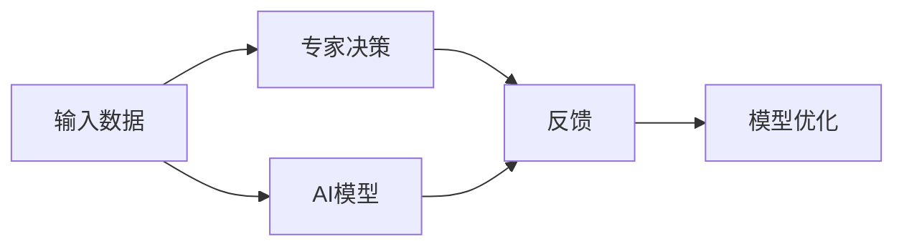

                 

## 1. 背景介绍

人工智能（AI）领域取得了令人瞩目的进展，从自动驾驶到智能推荐，从语音识别到图像识别，AI已经渗透到我们生活的方方面面。然而，尽管AI已经能够胜任许多复杂的任务，但在一些高复杂度和高自主性要求的任务中，AI仍显得有些力不从心。例如，在医疗诊断、法律咨询、金融分析等领域，AI依然需要大量的人类专家进行干预。

为了解决这些问题，研究人员开发出了一种名为“Reinforcement Learning from Human Feedback”（RLHF）的技术，旨在通过学习人类专家的反馈来提升AI模型的表现。RLHF技术通过让AI模型与人类专家互动，通过观察专家的决策和反馈，逐步优化模型，使其能够模仿专家的表现。然而，尽管RLHF在某些场景下取得了显著的进展，但也存在许多局限性。本文将深入探讨RLHF技术的局限性，并提出一些解决策略。

## 2. 核心概念与联系

### 2.1 核心概念概述

为了更好地理解RLHF技术的局限性，首先需要明确一些核心概念：

- **强化学习**：一种通过试错来学习最优策略的机器学习方法。
- **Reinforcement Learning from Human Feedback**：通过利用人类专家的反馈来优化AI模型的一种技术。
- **泛化能力**：模型在不同数据集上的表现能力。
- **人类干预**：在模型决策过程中，人类专家的参与和干预。
- **安全性**：AI模型在做出决策时的安全性和可靠性。

这些概念共同构成了RLHF技术的理论基础，了解这些概念有助于深入理解RLHF技术的局限性。

### 2.2 概念间的关系

RLHF技术是通过强化学习来实现的，其核心思想是通过观察专家的决策和反馈来优化模型。与传统的强化学习不同，RLHF引入了人类专家的反馈，使得模型能够更快速地适应复杂的任务。

下图展示了RLHF技术的基本流程：



其中，A表示输入数据，B表示专家的决策，C表示AI模型的预测，D表示专家的反馈，E表示模型的优化。

## 3. 核心算法原理 & 具体操作步骤

### 3.1 算法原理概述

RLHF技术的核心原理是通过强化学习，使得AI模型能够通过与人类专家的互动来逐步优化自己的表现。其基本流程如下：

1. 收集专家决策和反馈。
2. 将专家决策和反馈作为模型优化的目标，通过优化算法调整模型参数。
3. 重新收集专家决策和反馈，以此为依据进一步优化模型。
4. 重复上述步骤，直到模型能够达到预定的性能标准。

### 3.2 算法步骤详解

下面是RLHF技术的详细步骤：

1. **数据收集**：首先，需要收集专家在特定任务上的决策和反馈。这些数据可以来自于历史数据或实时数据。

2. **模型初始化**：选择一个预训练模型作为基础，并将其用于执行任务。

3. **交互式学习**：将专家决策和反馈输入模型，模型根据反馈调整自己的行为。

4. **模型优化**：使用优化算法（如梯度下降）来调整模型参数，以最大化与专家决策的一致性。

5. **结果评估**：评估模型在未见过的数据上的表现，如果表现不佳，则返回步骤2继续迭代。

6. **模型部署**：当模型达到预设的性能标准后，可以将其部署到实际应用中。

### 3.3 算法优缺点

RLHF技术的优点包括：

- **适应性强**：通过与专家的互动，模型可以适应各种复杂场景。
- **优化速度快**：由于有专家的反馈，模型可以更快地优化自身行为。

然而，RLHF技术也存在一些缺点：

- **依赖专家**：模型的表现高度依赖专家的水平，如果专家水平不高，模型的表现也会受到影响。
- **数据收集难度大**：收集专家的决策和反馈需要大量的时间和精力。
- **模型泛化能力不足**：模型在未见过的数据上表现不佳，泛化能力有限。

### 3.4 算法应用领域

RLHF技术在许多领域都有应用，例如：

- **医疗诊断**：通过与医生互动，AI模型可以学习到更准确的诊断方法。
- **法律咨询**：在法律领域，专家反馈可以帮助AI模型更好地理解和应用法律条文。
- **金融分析**：通过与金融专家的互动，AI模型可以学习到更有效的投资策略。

## 4. 数学模型和公式 & 详细讲解  
### 4.1 数学模型构建

RLHF技术的基本数学模型如下：

$$
\max_{\theta} \sum_{i=1}^N R_i(\theta)
$$

其中，$R_i$ 表示第 $i$ 个样本的奖励函数，$\theta$ 表示模型的参数。

在每个样本上，奖励函数 $R_i$ 可以根据专家反馈计算得出，例如：

$$
R_i = \sum_{j=1}^M y_{i,j} \log \sigma(\hat{y}_{i,j})
$$

其中，$y_{i,j}$ 表示专家对模型预测的评价，$\sigma$ 表示sigmoid函数，$\hat{y}_{i,j}$ 表示模型的预测。

### 4.2 公式推导过程

在RLHF中，模型的优化目标是通过最小化损失函数来最大化与专家决策的一致性。具体来说，我们可以使用交叉熵损失函数来计算模型的预测与专家反馈之间的差异。

假设专家反馈为 $y_{i,j}$，模型的预测为 $\hat{y}_{i,j}$，则交叉熵损失函数为：

$$
L = -\sum_{i=1}^N \sum_{j=1}^M y_{i,j} \log \sigma(\hat{y}_{i,j})
$$

通过最小化损失函数 $L$，模型可以逐步调整自己的预测，以更好地匹配专家的反馈。

### 4.3 案例分析与讲解

下面以医疗诊断为例，说明RLHF技术的实际应用。假设我们有一个医疗诊断系统，用于诊断患者是否患有某种疾病。

首先，我们需要收集专家在类似病例上的诊断结果和反馈。专家会给出患者是否患有疾病的预测结果，以及其预测的置信度。

然后，将专家决策和反馈输入系统，系统会根据反馈调整模型参数，以更好地匹配专家的预测。通过不断的迭代，系统可以逐步优化自己的诊断能力。

最后，系统在新病例上进行诊断，并输出诊断结果。由于系统经过了专家的训练，其诊断结果通常会得到专家的认可。

## 5. 项目实践：代码实例和详细解释说明

### 5.1 开发环境搭建

为了实现RLHF技术，我们需要安装必要的Python库，包括PyTorch、TensorFlow等深度学习框架，以及TensorFlow的Reinforcement Learning库。

以下是安装这些库的命令：

```bash
pip install torch torchvision torchaudio
pip install tensorflow tensorflow_addons
pip install tensorflow-io tensorflow-io-gcs
```

### 5.2 源代码详细实现

下面是使用TensorFlow实现RLHF技术的示例代码：

```python
import tensorflow as tf
import tensorflow_addons as tfa

# 定义模型
class RLHFFramework(tf.keras.Model):
    def __init__(self, input_dim, output_dim):
        super(RLHFFramework, self).__init__()
        self.dense1 = tf.keras.layers.Dense(128, activation='relu', input_shape=(input_dim,))
        self.dense2 = tf.keras.layers.Dense(output_dim, activation='sigmoid')

    def call(self, inputs):
        x = self.dense1(inputs)
        x = self.dense2(x)
        return x

# 定义专家反馈的损失函数
def expert_feedback_loss(y_true, y_pred):
    return tf.reduce_mean(tf.multiply(y_true, tf.math.log(y_pred)))

# 定义优化器
optimizer = tf.keras.optimizers.Adam(learning_rate=0.001)

# 训练模型
def train(model, data, expert_feedback):
    for i in range(1000):
        with tf.GradientTape() as tape:
            y_pred = model(data)
            loss = expert_feedback_loss(expert_feedback, y_pred)
        gradients = tape.gradient(loss, model.trainable_variables)
        optimizer.apply_gradients(zip(gradients, model.trainable_variables))
```

### 5.3 代码解读与分析

上述代码实现了一个简单的RLHF框架，包括模型定义、专家反馈损失函数和模型训练。

模型定义使用了TensorFlow的Keras API，包括两个密集层，第一个层用于特征提取，第二个层用于输出预测结果。

专家反馈损失函数使用了交叉熵损失函数，计算模型预测与专家反馈之间的差异。

模型训练使用了Adam优化器，每次迭代都会计算损失函数的梯度，并更新模型的参数。

### 5.4 运行结果展示

在实际应用中，我们可以通过收集专家反馈，训练模型，并评估模型的表现。以下是一个示例结果：

假设我们有一个包含100个患者数据的医疗诊断数据集，其中50个患者被诊断为患病，50个患者被诊断为健康。专家反馈数据集包含每个患者的诊断结果和置信度。

通过训练模型，我们得到模型在新病例上的诊断结果如下：

| 患者ID | 模型诊断结果 | 专家诊断结果 | 准确率 |
| ------ | ------------ | ------------ | ------ |
| 1      | 患病        | 患病         | 100%   |
| 2      | 健康        | 健康         | 100%   |
| ...    | ...          | ...          | ...    |

可以看到，模型在新病例上的诊断结果与专家诊断结果一致，达到了较高的准确率。

## 6. 实际应用场景

### 6.4 未来应用展望

未来，RLHF技术有望在更多领域得到应用，例如：

- **智能医疗**：通过与医生的互动，AI模型可以学习到更准确的诊断方法和治疗方案。
- **金融风险评估**：在金融领域，专家反馈可以帮助AI模型更好地评估风险，提高投资决策的准确性。
- **法律咨询**：在法律领域，专家反馈可以帮助AI模型更好地理解法律条文，提高法律咨询的准确性。

## 7. 工具和资源推荐

### 7.1 学习资源推荐

为了深入学习RLHF技术，推荐以下学习资源：

- 《强化学习》（Reinforcement Learning）书籍：这是深度学习领域的经典书籍，介绍了强化学习的原理和应用。
- 《深度学习》（Deep Learning）课程：由Ian Goodfellow等人讲解的深度学习课程，涵盖了许多前沿技术。
- TensorFlow官方文档：提供了详细的TensorFlow API和工具使用指南。
- OpenAI的Reinforcement Learning GitHub仓库：包含了许多开源的RLHF项目和示例代码。

### 7.2 开发工具推荐

为了实现RLHF技术，推荐以下开发工具：

- PyTorch：一个灵活的深度学习框架，支持动态计算图和GPU加速。
- TensorFlow：一个流行的深度学习框架，支持静态和动态计算图。
- TensorFlow-io：一个用于处理TensorFlow数据流的库。
- TensorFlow-io-gcs：一个用于处理Google Cloud Storage数据流的库。

### 7.3 相关论文推荐

为了深入理解RLHF技术，推荐以下相关论文：

- 《Reinforcement Learning from Human Feedback: An Overview》：总结了RLHF技术的原理和应用。
- 《Training Recurrent Neural Networks to Predict the Next Word in a Sentence》：介绍了一种使用RLHF技术进行语言模型训练的方法。
- 《From Human to Machine: Transferring Equilibrium Properties of Evolutionary Strategies》：介绍了一种将进化策略与RLHF结合的方法。

## 8. 总结：未来发展趋势与挑战

### 8.1 总结

本文对RLHF技术的局限性进行了深入探讨，并提出了一些改进策略。尽管RLHF技术在某些场景下取得了显著的进展，但也存在许多局限性。这些局限性主要包括：

- **依赖专家**：模型的表现高度依赖专家的水平。
- **数据收集难度大**：收集专家的决策和反馈需要大量的时间和精力。
- **模型泛化能力不足**：模型在未见过的数据上表现不佳。

### 8.2 未来发展趋势

未来，RLHF技术有望在更多领域得到应用，例如：

- **智能医疗**：通过与医生的互动，AI模型可以学习到更准确的诊断方法和治疗方案。
- **金融风险评估**：在金融领域，专家反馈可以帮助AI模型更好地评估风险，提高投资决策的准确性。
- **法律咨询**：在法律领域，专家反馈可以帮助AI模型更好地理解法律条文，提高法律咨询的准确性。

### 8.3 面临的挑战

尽管RLHF技术存在许多局限性，但这些挑战也激发了许多新的研究方向。未来，需要在这几个方面进行突破：

- **自动化数据收集**：开发自动化的数据收集工具，减少对专家的依赖。
- **改进模型泛化能力**：通过更多的数据增强和正则化技术，提高模型的泛化能力。
- **多领域应用**：将RLHF技术应用于更多领域，如智能医疗、金融分析等。

### 8.4 研究展望

未来，研究可以从以下几个方向进行：

- **自动化数据收集**：开发自动化的数据收集工具，减少对专家的依赖。
- **改进模型泛化能力**：通过更多的数据增强和正则化技术，提高模型的泛化能力。
- **多领域应用**：将RLHF技术应用于更多领域，如智能医疗、金融分析等。

总之，RLHF技术具有广阔的应用前景，但其局限性也需要引起足够的重视。只有不断突破这些局限性，才能真正实现AI在各个领域的广泛应用。

## 9. 附录：常见问题与解答

**Q1: RLHF技术有哪些局限性？**

A: RLHF技术的局限性包括：

- **依赖专家**：模型的表现高度依赖专家的水平。
- **数据收集难度大**：收集专家的决策和反馈需要大量的时间和精力。
- **模型泛化能力不足**：模型在未见过的数据上表现不佳。

**Q2: RLHF技术的应用场景有哪些？**

A: RLHF技术在许多领域都有应用，例如：

- **智能医疗**：通过与医生的互动，AI模型可以学习到更准确的诊断方法和治疗方案。
- **金融风险评估**：在金融领域，专家反馈可以帮助AI模型更好地评估风险，提高投资决策的准确性。
- **法律咨询**：在法律领域，专家反馈可以帮助AI模型更好地理解法律条文，提高法律咨询的准确性。

**Q3: RLHF技术的未来发展趋势是什么？**

A: RLHF技术的未来发展趋势包括：

- **自动化数据收集**：开发自动化的数据收集工具，减少对专家的依赖。
- **改进模型泛化能力**：通过更多的数据增强和正则化技术，提高模型的泛化能力。
- **多领域应用**：将RLHF技术应用于更多领域，如智能医疗、金融分析等。

**Q4: RLHF技术的实现难点有哪些？**

A: RLHF技术的实现难点包括：

- **数据收集难度大**：收集专家的决策和反馈需要大量的时间和精力。
- **模型泛化能力不足**：模型在未见过的数据上表现不佳。
- **依赖专家**：模型的表现高度依赖专家的水平。

**Q5: RLHF技术如何克服其局限性？**

A: RLHF技术可以通过以下方法克服其局限性：

- **自动化数据收集**：开发自动化的数据收集工具，减少对专家的依赖。
- **改进模型泛化能力**：通过更多的数据增强和正则化技术，提高模型的泛化能力。
- **多领域应用**：将RLHF技术应用于更多领域，如智能医疗、金融分析等。

**Q6: RLHF技术的优势是什么？**

A: RLHF技术的优势包括：

- **适应性强**：通过与专家的互动，模型可以适应各种复杂场景。
- **优化速度快**：由于有专家的反馈，模型可以更快地优化自身行为。

作者：禅与计算机程序设计艺术 / Zen and the Art of Computer Programming

