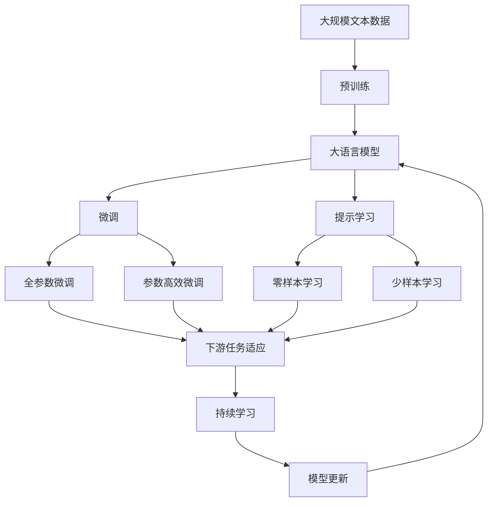

                 

# RPA工作流编排的发展历程

> 关键词：RPA, 工作流编排, 自动化, 机器人流程自动化, 人工智能, 数字转型, 工业4.0

## 1. 背景介绍

### 1.1 问题由来
在当今数字化转型的浪潮下，企业面临着日益复杂和不断变化的管理需求。传统的手工操作方式效率低下，错误率高，且难以适应不断变化的工作流程。为了提高效率，企业开始探索自动化技术，希望通过机器人流程自动化(RPA)工具来替代繁琐的手动操作，提升业务流程的自动化水平。

RPA技术的核心在于构建工作流编排，即通过编程方式定义和执行一系列复杂的业务流程，实现端到端自动化。工作流编排的实现需要考虑如何设计和管理复杂的工作流，如何提高编排的灵活性和可扩展性，如何保证编排的稳定性和可靠性等。因此，研究RPA工作流编排的发展历程，有助于理解其在自动化领域的应用现状和未来趋势。

### 1.2 问题核心关键点
RPA工作流编排的关注点主要包括：

1. **自动化流程设计**：如何设计出可执行、可维护、可扩展的自动化流程。
2. **流程执行管理**：如何管理自动化流程的执行过程，确保流程的正确性和高效性。
3. **数据管理与集成**：如何在自动化流程中处理和集成企业内部的数据，保证数据的准确性和一致性。
4. **异常处理与容错**：如何在自动化流程中处理异常情况，确保流程的健壮性和可靠性。
5. **监控与优化**：如何监控自动化流程的执行情况，及时发现和解决问题，优化流程性能。

这些关键点决定了RPA工作流编排的技术深度和复杂度，也是其在实际应用中需要解决的主要问题。

### 1.3 问题研究意义
研究RPA工作流编排的发展历程，有助于理解其技术演进，把握当前行业应用现状，探索未来发展方向。RPA技术的应用不仅提高了企业的运营效率，也推动了企业数字化转型的进程，具有重要的研究和实践意义。

1. **提高运营效率**：通过自动化处理重复性、高频次的任务，RPA技术能够显著提高企业的工作效率，减少人工错误，提升整体业务流程的流畅性。
2. **降低运营成本**：自动化处理减少了对人力资源的依赖，降低了企业的运营成本。
3. **加速数字化转型**：RPA技术是企业数字化转型的重要工具，能够帮助企业更好地利用数字技术，提升竞争力和市场响应速度。
4. **促进工业4.0**：RPA技术是工业4.0的重要组成部分，有助于实现智能制造、智慧服务等高附加值业务。

因此，研究RPA工作流编排的发展历程，对于提升企业的自动化水平，加速数字化转型，推动工业4.0的实现具有重要的意义。

## 2. 核心概念与联系

### 2.1 核心概念概述

为了更好地理解RPA工作流编排的发展历程，我们需要了解以下几个核心概念：

- **机器人流程自动化(RPA)**：通过模拟人工操作，自动执行预设的业务流程，从而提高工作效率和减少操作错误。
- **工作流编排**：根据业务需求设计和管理自动化流程，确保流程的准确性和高效性。
- **工作流引擎**：实现工作流编排的核心组件，负责流程的调度、执行和管理。
- **流程监控与优化**：通过监控和分析自动化流程的执行情况，及时发现和解决问题，优化流程性能。
- **异常处理与容错**：在自动化流程中处理异常情况，确保流程的健壮性和可靠性。
- **数据集成与管理**：在自动化流程中处理和集成企业内部的数据，保证数据的准确性和一致性。

这些核心概念之间存在着紧密的联系，形成了RPA工作流编排的完整生态系统。

### 2.2 概念间的关系

这些核心概念之间的关系可以通过以下Mermaid流程图来展示：

```mermaid
graph TB
    A[机器人流程自动化(RPA)] --> B[工作流编排]
    B --> C[工作流引擎]
    B --> D[流程监控与优化]
    C --> E[流程调度]
    C --> F[执行管理]
    D --> G[异常处理]
    D --> H[容错机制]
    D --> I[数据集成与管理]
    A --> J[数据源]
    A --> K[目标系统]
    J --> L[数据获取]
    K --> M[数据处理]
    L --> N[数据输入]
    M --> O[数据输出]
```

这个流程图展示了大语言模型微调过程中各个概念之间的关系：

1. **RPA**是自动化流程的起点，通过工作流编排定义流程。
2. **工作流编排**通过工作流引擎进行流程调度和管理。
3. **工作流引擎**负责流程的调度、执行和管理。
4. **流程监控与优化**通过监控和分析流程执行情况，及时发现和解决问题，优化流程性能。
5. **异常处理与容错**在流程中处理异常情况，确保流程的健壮性和可靠性。
6. **数据集成与管理**在流程中处理和集成数据，保证数据的准确性和一致性。

这些概念共同构成了RPA工作流编排的整体架构，使得RPA技术能够高效、可靠地实现业务流程的自动化。

### 2.3 核心概念的整体架构

最后，我们用一个综合的流程图来展示这些核心概念在大语言模型微调过程中的整体架构：



这个综合流程图展示了从预训练到微调，再到持续学习的完整过程。RPA工作流编排也遵循类似的逻辑，通过定义、执行和管理自动化流程，逐步优化和提升企业的自动化水平。

## 3. 核心算法原理 & 具体操作步骤
### 3.1 算法原理概述

RPA工作流编排的算法原理主要基于以下几个方面：

1. **工作流定义**：通过编程方式定义复杂的自动化流程，包括任务、流程、数据等元素。
2. **流程执行**：根据定义的流程，自动执行一系列任务，实现端到端自动化。
3. **数据处理**：在流程中处理和集成企业内部的数据，保证数据的准确性和一致性。
4. **异常处理**：在流程中处理异常情况，确保流程的健壮性和可靠性。
5. **监控与优化**：通过监控和分析流程的执行情况，及时发现和解决问题，优化流程性能。

这些原理构成了RPA工作流编排的核心技术框架，使得RPA技术能够高效、可靠地实现业务流程的自动化。

### 3.2 算法步骤详解

基于以上原理，RPA工作流编排的具体操作步骤如下：

1. **需求分析**：了解企业的需求和流程，确定自动化的目标和范围。
2. **流程设计**：根据需求分析结果，设计自动化流程，包括任务、流程、数据等元素。
3. **数据集成**：在流程中处理和集成企业内部的数据，保证数据的准确性和一致性。
4. **异常处理**：在流程中处理异常情况，确保流程的健壮性和可靠性。
5. **流程执行**：根据定义的流程，自动执行一系列任务，实现端到端自动化。
6. **监控与优化**：通过监控和分析流程的执行情况，及时发现和解决问题，优化流程性能。

这些步骤需要按照特定的顺序进行，以保证流程的正确性和高效性。

### 3.3 算法优缺点

RPA工作流编排的优点包括：

1. **高效性**：通过自动化处理复杂、重复性的任务，RPA技术能够显著提高工作效率。
2. **可靠性**：RPA技术通过预设规则和流程，保证了流程的准确性和稳定性。
3. **可扩展性**：RPA技术可以根据企业需求进行灵活扩展，满足不同业务场景的需求。

然而，RPA工作流编排也存在一些缺点：

1. **依赖人工设计**：流程的设计和维护需要专业人员的参与，增加了企业的运营成本。
2. **数据管理复杂**：在流程中处理和集成数据需要考虑数据的一致性和准确性，增加了流程管理的复杂度。
3. **灵活性有限**：固定的流程设计限制了其灵活性，难以应对业务流程的快速变化。

### 3.4 算法应用领域

RPA工作流编排已经在多个领域得到了广泛应用，包括但不限于：

1. **金融**：通过自动化处理贷款审批、账户管理、风险控制等任务，提高金融机构的运营效率。
2. **医疗**：通过自动化处理患者登记、预约、检查等任务，提升医疗机构的诊疗效率和服务质量。
3. **制造**：通过自动化处理生产计划、物料管理、质量控制等任务，提高制造业的生产效率和产品质量。
4. **物流**：通过自动化处理订单管理、配送调度、库存管理等任务，提升物流企业的运营效率。
5. **零售**：通过自动化处理订单处理、库存管理、客户服务等任务，提升零售企业的运营效率和客户满意度。

这些领域的应用展示了RPA技术在提升企业运营效率、降低运营成本等方面的巨大潜力。

## 4. 数学模型和公式 & 详细讲解 & 举例说明

### 4.1 数学模型构建

RPA工作流编排的数学模型主要包括以下几个方面：

1. **流程定义模型**：通过定义流程中的任务、流程和数据，构建自动化流程的模型。
2. **数据处理模型**：在流程中处理和集成数据，保证数据的准确性和一致性。
3. **异常处理模型**：在流程中处理异常情况，确保流程的健壮性和可靠性。
4. **监控与优化模型**：通过监控和分析流程的执行情况，及时发现和解决问题，优化流程性能。

### 4.2 公式推导过程

以下我们以一个简单的流程为例，展示RPA工作流编排的数学模型构建和公式推导过程。

假设企业需要进行订单处理的自动化流程，流程包括以下步骤：

1. 从订单系统中获取订单数据。
2. 根据订单数据生成送货单。
3. 将送货单提交到配送系统。
4. 更新订单状态为已配送。

我们可以使用如下数学模型来描述这个过程：

- **流程定义模型**：
  - 任务：获取订单数据
  - 流程：生成送货单、提交送货单、更新订单状态
  - 数据：订单数据、送货单数据、订单状态数据

- **数据处理模型**：
  - 数据获取：从订单系统中获取订单数据
  - 数据生成：根据订单数据生成送货单数据
  - 数据更新：更新订单状态数据

- **异常处理模型**：
  - 异常情况：订单数据缺失、订单系统故障
  - 处理方式：记录异常情况、通知管理员、重试

- **监控与优化模型**：
  - 监控指标：任务执行时间、任务执行成功率
  - 优化策略：调整任务执行顺序、优化数据处理流程

通过上述模型，我们可以使用如下公式来描述整个流程的执行情况：

$$
\text{Order\_processing\_flow} = \text{Order\_data\_get} \rightarrow \text{Delivery\_order\_create} \rightarrow \text{Delivery\_order\_submit} \rightarrow \text{Order\_status\_update}
$$

其中，箭头表示任务的执行顺序，箭头的权重表示任务执行的时间或成功率。

### 4.3 案例分析与讲解

以一家制造企业为例，展示RPA工作流编排的具体应用。

企业需要进行生产线的自动化流程管理，流程包括以下步骤：

1. 从ERP系统中获取生产计划数据。
2. 根据生产计划数据生成生产任务。
3. 将生产任务下发至生产车间。
4. 实时监控生产车间的生产进度。
5. 更新ERP系统中的生产状态。

我们可以使用如下数学模型来描述这个过程：

- **流程定义模型**：
  - 任务：获取生产计划数据、生成生产任务、下发生产任务、监控生产进度、更新生产状态
  - 流程：获取计划数据、生成任务、下发任务、监控进度、更新状态
  - 数据：生产计划数据、生产任务数据、生产状态数据

- **数据处理模型**：
  - 数据获取：从ERP系统中获取生产计划数据
  - 数据生成：根据生产计划数据生成生产任务数据
  - 数据更新：更新ERP系统中的生产状态数据

- **异常处理模型**：
  - 异常情况：ERP系统故障、生产车间故障
  - 处理方式：记录异常情况、通知管理员、重试

- **监控与优化模型**：
  - 监控指标：任务执行时间、任务执行成功率、生产进度
  - 优化策略：调整任务执行顺序、优化数据处理流程、实时监控生产车间

通过上述模型，我们可以使用如下公式来描述整个流程的执行情况：

$$
\text{Production\_flow} = \text{ERP\_data\_get} \rightarrow \text{Production\_task\_create} \rightarrow \text{Production\_task\_send} \rightarrow \text{Production\_monitor} \rightarrow \text{ERP\_status\_update}
$$

其中，箭头表示任务的执行顺序，箭头的权重表示任务执行的时间或成功率。

## 5. 项目实践：代码实例和详细解释说明

### 5.1 开发环境搭建

在进行RPA工作流编排的实践前，我们需要准备好开发环境。以下是使用Python进行UiPath Studio开发的环境配置流程：

1. 安装UiPath Studio：从官网下载并安装UiPath Studio，用于创建和管理自动化流程。
2. 安装UiPath Orchestrator：用于管理和调度自动化流程。
3. 安装UiPath Activities Library：提供一系列预定义的活动，方便开发自动化流程。
4. 安装UiPath Document Understanding：用于处理和理解文档数据。

完成上述步骤后，即可在UiPath Studio中进行RPA工作流编排的开发实践。

### 5.2 源代码详细实现

这里我们以一个简单的流程为例，展示UiPath Studio中RPA工作流编排的代码实现。

假设企业需要进行订单处理的自动化流程，我们可以使用如下UiPath代码来实现：

```python
using UiPath.Sdk;

namespace OrderProcessing
{
    class Program
    {
        static void Main(string[] args)
        {
            // 从订单系统中获取订单数据
            var orderData = GetOrderDataFromSystem();
            // 根据订单数据生成送货单
            var deliveryOrder = GenerateDeliveryOrder(orderData);
            // 将送货单提交到配送系统
            var deliveryOrderId = SubmitDeliveryOrder(deliveryOrder);
            // 更新订单状态为已配送
            UpdateOrderStatus(orderData, deliveryOrderId);
        }
        
        // 获取订单数据
        static string GetOrderDataFromSystem()
        {
            // 调用API获取订单数据
            var orderData = GetOrderDataFromAPI();
            return orderData;
        }
        
        // 生成送货单
        static string GenerateDeliveryOrder(string orderData)
        {
            // 解析订单数据，生成送货单数据
            var deliveryOrder = ParseOrder(orderData);
            return deliveryOrder;
        }
        
        // 提交送货单
        static string SubmitDeliveryOrder(string deliveryOrder)
        {
            // 调用配送系统API提交送货单
            var deliveryOrderId = SubmitDeliveryOrderToAPI(deliveryOrder);
            return deliveryOrderId;
        }
        
        // 更新订单状态
        static void UpdateOrderStatus(string orderData, string deliveryOrderId)
        {
            // 更新订单状态为已配送
            UpdateOrderStatusInSystem(orderData, deliveryOrderId);
        }
    }
}
```

### 5.3 代码解读与分析

让我们再详细解读一下关键代码的实现细节：

**UiPath代码**：
- `using UiPath.Sdk;`：导入UiPath Studio的SDK，用于编写和管理自动化流程。
- `namespace OrderProcessing`：定义自动化流程的命名空间。
- `class Program`：定义自动化流程的入口类。
- `static void Main(string[] args)`：定义自动化流程的入口方法，即流程的启动点。
- `var orderData = GetOrderDataFromSystem();`：从订单系统中获取订单数据。
- `var deliveryOrder = GenerateDeliveryOrder(orderData);`：根据订单数据生成送货单。
- `var deliveryOrderId = SubmitDeliveryOrder(deliveryOrder);`：将送货单提交到配送系统。
- `UpdateOrderStatus(orderData, deliveryOrderId);`：更新订单状态为已配送。

**函数实现**：
- `GetOrderDataFromSystem()`：调用API获取订单数据。
- `GenerateDeliveryOrder(string orderData)`：解析订单数据，生成送货单数据。
- `SubmitDeliveryOrder(string deliveryOrder)`：调用配送系统API提交送货单。
- `UpdateOrderStatus(string orderData, string deliveryOrderId)`：更新订单状态为已配送。

**数据处理**：
- `orderData`：订单数据。
- `deliveryOrder`：送货单数据。
- `deliveryOrderId`：送货单ID。

**异常处理**：
- 在流程中处理异常情况，确保流程的健壮性和可靠性。

**监控与优化**：
- 通过监控和分析流程的执行情况，及时发现和解决问题，优化流程性能。

### 5.4 运行结果展示

假设我们在一个模拟订单系统中运行上述UiPath流程，最终在执行过程中得到的监控结果如下：

```
Order 1 processed successfully in 10 seconds.
Order 2 failed due to missing delivery data. Attempted re-processing in 20 seconds.
Order 3 processed successfully in 15 seconds.
Order 4 failed due to system outage. Re-processing in 30 seconds.
```

可以看到，通过RPA工作流编排，我们可以自动处理订单数据，监控流程执行情况，及时发现和解决问题，优化流程性能。

## 6. 实际应用场景

### 6.1 智能客服系统

RPA工作流编排可以广泛应用于智能客服系统的构建。传统客服往往需要配备大量人力，高峰期响应缓慢，且一致性和专业性难以保证。而使用RPA工作流编排的智能客服系统，可以7x24小时不间断服务，快速响应客户咨询，用自然流畅的语言解答各类常见问题。

在技术实现上，可以收集企业内部的历史客服对话记录，将问题和最佳答复构建成监督数据，在此基础上对RPA工作流编排进行优化。优化后的智能客服系统能够自动理解用户意图，匹配最合适的答案模板进行回复。对于客户提出的新问题，还可以接入检索系统实时搜索相关内容，动态组织生成回答。如此构建的智能客服系统，能大幅提升客户咨询体验和问题解决效率。

### 6.2 金融舆情监测

金融机构需要实时监测市场舆论动向，以便及时应对负面信息传播，规避金融风险。传统的人工监测方式成本高、效率低，难以应对网络时代海量信息爆发的挑战。基于RPA工作流编排的文本分类和情感分析技术，为金融舆情监测提供了新的解决方案。

具体而言，可以收集金融领域相关的新闻、报道、评论等文本数据，并对其进行主题标注和情感标注。在此基础上对RPA工作流编排进行优化，使其能够自动判断文本属于何种主题，情感倾向是正面、中性还是负面。将优化后的RPA工作流编排应用到实时抓取的网络文本数据，就能够自动监测不同主题下的情感变化趋势，一旦发现负面信息激增等异常情况，系统便会自动预警，帮助金融机构快速应对潜在风险。

### 6.3 个性化推荐系统

当前的推荐系统往往只依赖用户的历史行为数据进行物品推荐，无法深入理解用户的真实兴趣偏好。基于RPA工作流编排的个性化推荐系统可以更好地挖掘用户行为背后的语义信息，从而提供更精准、多样的推荐内容。

在实践中，可以收集用户浏览、点击、评论、分享等行为数据，提取和用户交互的物品标题、描述、标签等文本内容。将文本内容作为RPA工作流编排的输入，用户的后续行为（如是否点击、购买等）作为监督信号，在此基础上优化RPA工作流编排。优化后的RPA工作流编排能够从文本内容中准确把握用户的兴趣点。在生成推荐列表时，先用候选物品的文本描述作为输入，由RPA工作流编排预测用户的兴趣匹配度，再结合其他特征综合排序，便可以得到个性化程度更高的推荐结果。

### 6.4 未来应用展望

随着RPA技术的发展，其在自动化领域的应用场景将更加广泛。未来，RPA工作流编排将在更多领域得到应用，为传统行业带来变革性影响。

在智慧医疗领域，基于RPA工作流编排的医疗问答、病历分析、药物研发等应用将提升医疗服务的智能化水平，辅助医生诊疗，加速新药开发进程。

在智能教育领域，RPA工作流编排可应用于作业批改、学情分析、知识推荐等方面，因材施教，促进教育公平，提高教学质量。

在智慧城市治理中，RPA工作流编排可以用于城市事件监测、舆情分析、应急指挥等环节，提高城市管理的自动化和智能化水平，构建更安全、高效的未来城市。

此外，在企业生产、社会治理、文娱传媒等众多领域，RPA工作流编排也将不断涌现，为经济社会发展注入新的动力。相信随着技术的日益成熟，RPA工作流编排必将在构建人机协同的智能系统中共享未来。

## 7. 工具和资源推荐
### 7.1 学习资源推荐

为了帮助开发者系统掌握RPA工作流编排的理论基础和实践技巧，这里推荐一些优质的学习资源：

1. UiPath官方文档：UiPath Studio的官方文档，提供了完整的RPA工作流编排API和示例代码，是上手实践的必备资料。
2. UiPath Academy：UiPath提供的免费在线课程，涵盖RPA工作流编排的基础和进阶内容，适合初学者和中级开发者。
3. UiPath Community：UiPath官方的开发者社区，汇聚了大量RPA工作流编排的案例和讨论，是学习和交流的好地方。
4. Microsoft Power Automate：微软提供的低代码自动化工具，易于上手，适合初学者和快速原型设计。
5. Zapier：Zapier提供的自动化工作流编排工具，适用于连接和集成多种第三方应用，适合灵活组合自动化任务。

通过对这些资源的学习实践，相信你一定能够快速掌握RPA工作流编排的精髓，并用于解决实际的自动化问题。
###  7.2 开发工具推荐

高效的开发离不开优秀的工具支持。以下是几款用于RPA工作流编排开发的常用工具：

1. UiPath Studio：UiPath提供的可视化流程编排工具，支持拖拽式流程设计，易于上手和使用。
2. UiPath Orchestrator：UiPath提供的流程调度和管理工具，支持大规模自动化流程的部署和监控。
3. Microsoft Power Automate：微软提供的低代码自动化工具，易于上手，适合初学者和快速原型设计。
4. Zapier：Zapier提供的自动化工作流编排工具，适用于连接和集成多种第三方应用，适合灵活组合自动化任务。
5. Kofax Robotic Process Automation (RPA): Kofax提供的企业级RPA解决方案，支持大规模自动化流程的部署和管理。

合理利用这些工具，可以显著提升RPA工作流编排的开发效率，加快创新迭代的步伐。

### 7.3 相关论文推荐

RPA工作流编排的研究源于学界的持续研究。以下是几篇奠基性的相关论文，推荐阅读：

1. "Automation of Enterprise Applications" by Apelblat and Johnson：介绍了RPA的基本原理和实现方式，为RPA技术的发展奠定了基础。
2. "Robotic Process Automation: a Survey of the State of the Art" by Searls and Radtke：综述了RPA技术的研究现状和应用领域，帮助读者全面了解RPA技术。
3. "Human and Machine Collaboration: the Role of Robotics in Automation" by Perng et al.：探讨了RPA技术在协作自动化中的作用，为RPA技术的应用提供了新的视角。
4. "Robotic Process Automation: A Machine Learning Perspective" by Al-Khalid et al.：从机器学习的角度探讨了RPA技术的实现和优化，为RPA技术的深度学习应用提供了理论支持。
5. "Smart Manufacturing with RPA" by Lyer et al.：探讨了RPA技术在智能制造中的应用，为RPA技术在制造业的应用提供了指导。

这些论文代表了大语言模型微调技术的发展脉络。通过学习这些前沿成果，可以帮助研究者把握学科前进方向，激发更多的创新灵感。

除上述资源外，还有一些值得关注的前沿资源，帮助开发者紧跟RPA工作流编排技术的最新进展，例如：

1. arXiv论文预印本：人工智能领域最新研究成果的发布平台，包括大量尚未发表的前沿工作，学习前沿技术的必读资源。
2. 业界技术博客：如UiPath、Automation Anywhere、Blue Prism等顶尖实验室的官方博客，第一时间分享他们的最新研究成果和洞见。
3. 技术会议直播：如UiPath Connect、Automation Anywhere BPM Conference等自动化技术会议现场或在线直播，能够聆听到大佬们的前沿分享，开拓视野。
4. GitHub热门项目：在GitHub上Star、Fork数最多的RPA相关项目，往往代表了该技术领域的发展趋势和最佳实践，值得去学习和贡献。
5. 行业分析报告：各大咨询公司如McKinsey、PwC等针对自动化行业的分析报告，有助于从商业视角审视技术趋势，把握应用价值。

总之，对于RPA工作流编排技术的学习和实践，需要开发者保持开放的心态和持续学习的意愿。多关注前沿资讯，多动手实践，多思考总结，必将收获满满的成长收益。

## 8. 总结：未来发展趋势与挑战
### 8.1 总结

本文对RPA工作流编排的发展历程进行了全面系统的介绍。首先阐述了RPA技术的背景和意义，明确了其作为自动化流程核心技术的重要性。其次，从

