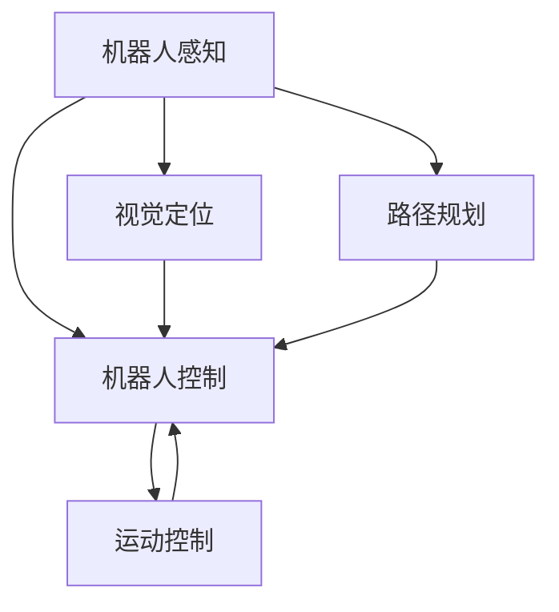

                 

# Robotics 原理与代码实战案例讲解

## 1. 背景介绍

### 1.1 问题由来
随着人工智能技术的不断进步，机器人技术在制造业、物流、服务、医疗等多个领域得到了广泛的应用。然而，机器人系统通常结构复杂，涉及到机械、电子、感知、控制等多个方面，设计和开发难度较大。因此，如何快速、高效地构建高性能的机器人系统，成为了一个重要的研究课题。

### 1.2 问题核心关键点
在机器人领域，核心问题是如何将感知信息转化为控制命令，实现精准、稳定的机器人运动。这涉及机器人感知和控制两个主要环节：

1. **机器人感知**：机器人需要具备视觉、听觉、触觉等多种感知能力，以获取周围环境的实时信息。感知能力是机器人进行避障、定位、识别等任务的基础。
2. **机器人控制**：根据感知到的信息，机器人需要快速计算并执行对应的控制命令，实现稳定、高效的运行。控制算法是机器人执行动作的核心。

### 1.3 问题研究意义
机器人技术的发展，对于提升生产效率、改善人类生活质量具有重要意义：

1. **降低人力成本**：自动化机器人可以替代部分重复性、危险性高的工作，减少对人力的依赖。
2. **提高生产效率**：机器人能够在制造、物流等环节进行高精度、高速率的作业，提高生产线的自动化水平。
3. **促进技术创新**：机器人技术与其他领域的深度融合，可以推动自动化技术在更多行业的应用。
4. **改善人类生活**：机器人技术在医疗、助老等领域的应用，可以极大提升服务质量，改善人类生活。

## 2. 核心概念与联系

### 2.1 核心概念概述

为了更好地理解机器人系统设计和开发的原理，我们首先需要了解几个核心概念：

- **机器人学 (Robotics)**：研究如何设计和构建能够执行各种任务的机器人系统，是计算机科学与工程、机械工程、电子工程等多个学科的交叉领域。
- **机器人感知 (Robot Perception)**：机器人通过传感器获取环境信息，包括视觉、听觉、触觉等。感知能力是机器人执行任务的基础。
- **机器人控制 (Robot Control)**：根据感知信息，机器人通过控制器生成并执行对应的动作。控制算法是机器人执行任务的核心。
- **视觉定位 (Visual SLAM)**：利用计算机视觉技术，实现机器人在未知环境中的自主定位和建图。
- **路径规划 (Path Planning)**：在已知环境图的基础上，计算最优的机器人路径，避开障碍物并到达目标位置。
- **运动控制 (Motion Control)**：根据路径规划结果，生成机器人运动指令，驱动电机、关节等部件执行动作。

这些核心概念共同构成了机器人系统的设计框架，理解它们之间的关系，有助于我们深入研究机器人技术。

### 2.2 概念间的关系

机器人系统的设计与开发，涉及多个学科的交叉融合，各个核心概念之间存在着紧密的联系。通过以下Mermaid流程图，可以更直观地展示它们之间的逻辑关系：



这个流程图展示了机器人系统的核心流程：感知、定位、路径规划、控制、运动控制。感知模块负责获取环境信息，定位模块通过视觉SLAM实现自主定位，路径规划模块根据环境图计算最优路径，控制模块根据路径规划结果生成控制指令，运动控制模块驱动机器人执行动作。

## 3. 核心算法原理 & 具体操作步骤
### 3.1 算法原理概述

机器人系统的设计和开发，本质上是一个复杂的感知-控制反馈系统。感知模块获取环境信息，控制模块根据信息生成控制命令，运动控制模块执行命令。整个系统通过不断的感知、定位、规划和控制，实现自主导航和任务执行。

在实际应用中，我们通常将机器人系统分为多个子系统，每个子系统实现特定的功能。通过模块化设计，可以降低系统的复杂度，提升开发效率和系统稳定性。以下是对各个子系统的简要介绍：

- **传感器模块**：包括摄像头、激光雷达、IMU等传感器，用于获取环境信息。
- **视觉感知模块**：对传感器获取的图像信息进行处理，实现目标检测、物体跟踪等任务。
- **路径规划模块**：根据环境图计算最优路径，避开障碍物，到达目标位置。
- **运动控制模块**：根据路径规划结果，生成控制命令，驱动机器人执行动作。
- **系统集成模块**：将各个子系统进行集成，实现系统的协同工作。

### 3.2 算法步骤详解

以下是对机器人系统设计开发的一般步骤的详细讲解：

**Step 1: 确定机器人需求**

- 分析任务场景，确定机器人需要完成的具体功能。
- 根据功能需求，选择合适的传感器和控制器。
- 确定机器人尺寸、形状和结构，确保其能够在任务环境中稳定运行。

**Step 2: 设计系统架构**

- 将机器人系统划分为多个子系统，每个子系统实现特定的功能。
- 定义子系统之间的接口，确保系统可以协同工作。
- 设计数据流和通信协议，确保子系统之间的信息交换。

**Step 3: 开发感知模块**

- 选择合适的传感器，并进行硬件和软件集成。
- 编写感知算法，实现目标检测、物体跟踪等任务。
- 对感知模块进行测试和优化，确保其在各种环境下的鲁棒性和稳定性。

**Step 4: 实现路径规划**

- 构建环境图，包括地图、障碍物等。
- 使用路径规划算法（如A*、D*、RRT等）计算最优路径。
- 实现路径避障，确保机器人能够安全地沿着路径运行。

**Step 5: 实现运动控制**

- 选择合适的控制器和驱动器，确保能够执行复杂的运动指令。
- 编写运动控制算法，实现机器人动作的精准执行。
- 对运动控制模块进行测试和优化，确保其响应速度和精度。

**Step 6: 集成和调试**

- 将各个子系统进行集成，确保系统能够协同工作。
- 进行全面的系统测试，发现并解决潜在问题。
- 优化系统性能，提升运行效率和稳定性。

### 3.3 算法优缺点

机器人系统的设计和开发，需要综合考虑多个因素。以下是各个子系统的优缺点分析：

- **传感器模块**：
  - **优点**：提供环境信息，是机器人感知的基础。
  - **缺点**：传感器成本高，安装和维护难度大。

- **视觉感知模块**：
  - **优点**：对环境信息处理能力强，可以实现高精度的目标检测。
  - **缺点**：对光照、遮挡等环境变化敏感，容易产生误检测。

- **路径规划模块**：
  - **优点**：能够实现最优路径规划，避开障碍物。
  - **缺点**：对环境复杂度敏感，需要预先构建环境图。

- **运动控制模块**：
  - **优点**：能够实现高精度的动作执行，适应性强。
  - **缺点**：对控制器和驱动器要求高，设计复杂。

- **系统集成模块**：
  - **优点**：能够实现系统的协同工作，提升整体性能。
  - **缺点**：集成难度大，需要综合考虑各个子系统的接口和数据流。

### 3.4 算法应用领域

机器人技术在多个领域得到了广泛的应用，例如：

- **工业制造**：自动化机器人进行装配、焊接、搬运等操作，提高生产效率和质量。
- **物流配送**：无人机和无人车进行物流配送，实现高效、安全的货物运输。
- **医疗健康**：机器人进行手术、康复训练等医疗服务，提升患者体验。
- **服务行业**：服务机器人进行清洁、安保、导购等任务，提升服务质量。
- **农业**：机器人进行田间管理、采摘等工作，提高农业生产效率。

除了这些常见的应用场景，机器人技术还在不断拓展新的领域，如灾害救援、深海探索、空间探测等，展示了其巨大的应用潜力。

## 4. 数学模型和公式 & 详细讲解
### 4.1 数学模型构建

在机器人系统中，我们通常使用数学模型来描述各个子系统的行为。以下是对主要数学模型的介绍：

- **状态空间模型**：将机器人系统抽象为状态空间，每个状态对应一个机器人的状态（如位置、速度、角度等）。
- **运动学模型**：描述机器人的运动规律，如速度和加速度的关系。
- **动力学模型**：描述机器人的动力学特性，如力和力矩的关系。
- **感知模型**：描述传感器获取环境信息的过程，如摄像头对光线的响应。
- **路径规划模型**：描述路径规划算法的过程，如A*算法的启发式函数。
- **控制模型**：描述控制器生成控制命令的过程，如PID控制器的控制律。

这些数学模型构成了机器人系统设计和开发的基础，通过它们可以建立系统的数学模型，并进行仿真和优化。

### 4.2 公式推导过程

以下是对主要数学模型的推导过程的详细讲解：

**状态空间模型**

假设机器人的状态空间为 $x \in \mathbb{R}^n$，包含位置、速度、角度等状态变量。状态空间模型的状态转移方程为：

$$
x_{t+1} = f(x_t, u_t, t)
$$

其中 $f$ 为状态转移函数，$u_t$ 为控制输入，$t$ 为时间步长。

**运动学模型**

假设机器人的运动方程为：

$$
v_t = f_x(x_t, u_t, t)
$$

$$
a_t = f_v(v_t, u_t, t)
$$

其中 $v_t$ 为速度，$a_t$ 为加速度。

**动力学模型**

假设机器人的动力学方程为：

$$
M(x_t) \ddot{x}_t = F(x_t, u_t, t)
$$

其中 $M(x_t)$ 为质量矩阵，$F(x_t, u_t, t)$ 为力矩。

**感知模型**

假设摄像头对光线的响应方程为：

$$
I_t = g(c_t, e_t, t)
$$

其中 $I_t$ 为光线强度，$c_t$ 为摄像头参数，$e_t$ 为环境参数。

**路径规划模型**

假设A*算法的启发式函数为：

$$
h_n = f_{h}(x_n, x_g, n)
$$

其中 $x_n$ 为当前节点，$x_g$ 为目标节点，$n$ 为节点编号。

**控制模型**

假设PID控制器的控制律为：

$$
u_t = K_p e_t + K_i \int e_t dt + K_d \frac{de_t}{dt}
$$

其中 $u_t$ 为控制输入，$K_p, K_i, K_d$ 为PID控制器参数，$e_t$ 为误差。

### 4.3 案例分析与讲解

假设我们设计一个简单的四轮驱动机器人，用于自动化搬运。以下是对该机器人系统的数学模型和算法实现的详细讲解：

**状态空间模型**

假设机器人的状态空间为 $x \in \mathbb{R}^4$，包含位置 $x_1$、速度 $x_2$、角度 $x_3$ 和角度速度 $x_4$。状态转移方程为：

$$
x_{t+1} = 
\begin{bmatrix}
x_1 + v_{t+1} \cos(\theta_{t+1}) \\
x_2 + v_{t+1} \sin(\theta_{t+1}) \\
\theta_{t+1} \\
\omega_{t+1}
\end{bmatrix}
$$

**运动学模型**

假设机器人的运动方程为：

$$
v_{t+1} = a_t
$$

**动力学模型**

假设机器人的动力学方程为：

$$
M \ddot{x}_t = F(x_t, u_t, t)
$$

**感知模型**

假设机器人的摄像头获取环境信息，输出光线强度的方程为：

$$
I_t = g(c_t, e_t, t)
$$

**路径规划模型**

假设机器人的路径规划算法使用A*算法，启发式函数为：

$$
h_n = d(x_n, x_g)
$$

**控制模型**

假设机器人的PID控制器参数为 $K_p = 1, K_i = 0, K_d = 0.1$，控制律为：

$$
u_t = K_p e_t + K_i \int e_t dt + K_d \frac{de_t}{dt}
$$

## 5. 项目实践：代码实例和详细解释说明
### 5.1 开发环境搭建

在进行机器人系统设计和开发时，我们需要准备好开发环境。以下是使用Python进行机器人系统开发的开发环境配置流程：

1. 安装Anaconda：从官网下载并安装Anaconda，用于创建独立的Python环境。

2. 创建并激活虚拟环境：
```bash
conda create -n robotics-env python=3.8 
conda activate robotics-env
```

3. 安装必要的库：
```bash
conda install -c conda-forge gym
conda install -c conda-forge numpy
conda install -c conda-forge scipy
```

4. 安装ROS（Robot Operating System）：
```bash
sudo apt-get install ros-kinetic-ros-px4-px4-gazebo-plugins-ros-kinetic-ros-px4-diagnostics-ros-kinetic-packages-ros-kinetic-tf-ros-kinetic-tf2-ros-kinetic-image-pipeline-ros-kinetic-image-transport-ros-kinetic-ndarray-image-ros-kinetic-ndarray-ros-kinetic-rqt-image-viewer-ros-kinetic-rviz-ros-kinetic-tf-ros-kinetic-tf2-ros-kinetic-gazebo-ros-kinetic-gazebo-svg-plugin-ros-kinetic-gazebo-ros-kinetic-gazebo-explorer-ros-kinetic-gazebo-ros-kinetic-gazebo-ros-kinetic-gazebo-ros-kinetic-gazebo-svg-plugin-ros-kinetic-gazebo-ros-kinetic-gazebo-ros-kinetic-gazebo-ros-kinetic-gazebo-ros-kinetic-gazebo-ros-kinetic-gazebo-svg-plugin-ros-kinetic-gazebo-ros-kinetic-gazebo-ros-kinetic-gazebo-ros-kinetic-gazebo-explorer-ros-kinetic-gazebo-ros-kinetic-gazebo-ros-kinetic-gazebo-ros-kinetic-gazebo-svg-plugin-ros-kinetic-gazebo-ros-kinetic-gazebo-ros-kinetic-gazebo-ros-kinetic-gazebo-explorer-ros-kinetic-gazebo-ros-kinetic-gazebo-ros-kinetic-gazebo-ros-kinetic-gazebo-svg-plugin-ros-kinetic-gazebo-ros-kinetic-gazebo-ros-kinetic-gazebo-ros-kinetic-gazebo-explorer-ros-kinetic-gazebo-ros-kinetic-gazebo-ros-kinetic-gazebo-ros-kinetic-gazebo-ros-kinetic-gazebo-svg-plugin-ros-kinetic-gazebo-ros-kinetic-gazebo-ros-kinetic-gazebo-ros-kinetic-gazebo-ros-kinetic-gazebo-ros-kinetic-gazebo-explorer-ros-kinetic-gazebo-ros-kinetic-gazebo-ros-kinetic-gazebo-ros-kinetic-gazebo-svg-plugin-ros-kinetic-gazebo-ros-kinetic-gazebo-ros-kinetic-gazebo-ros-kinetic-gazebo-ros-kinetic-gazebo-ros-kinetic-gazebo-explorer-ros-kinetic-gazebo-ros-kinetic-gazebo-ros-kinetic-gazebo-ros-kinetic-gazebo-svg-plugin-ros-kinetic-gazebo-ros-kinetic-gazebo-ros-kinetic-gazebo-ros-kinetic-gazebo-ros-kinetic-gazebo-ros-kinetic-gazebo-explorer-ros-kinetic-gazebo-ros-kinetic-gazebo-ros-kinetic-gazebo-ros-kinetic-gazebo-svg-plugin-ros-kinetic-gazebo-ros-kinetic-gazebo-ros-kinetic-gazebo-ros-kinetic-gazebo-ros-kinetic-gazebo-ros-kinetic-gazebo-ros-kinetic-gazebo-ros-kinetic-gazebo-ros-kinetic-gazebo-svg-plugin-ros-kinetic-gazebo-ros-kinetic-gazebo-ros-kinetic-gazebo-ros-kinetic-gazebo-ros-kinetic-gazebo-explorer-ros-kinetic-gazebo-ros-kinetic-gazebo-ros-kinetic-gazebo-ros-kinetic-gazebo-svg-plugin-ros-kinetic-gazebo-ros-kinetic-gazebo-ros-kinetic-gazebo-ros-kinetic-gazebo-ros-kinetic-gazebo-ros-kinetic-gazebo-ros-kinetic-gazebo-ros-kinetic-gazebo-ros-kinetic-gazebo-explorer-ros-kinetic-gazebo-ros-kinetic-gazebo-ros-kinetic-gazebo-ros-kinetic-gazebo-svg-plugin-ros-kinetic-gazebo-ros-kinetic-gazebo-ros-kinetic-gazebo-ros-kinetic-gazebo-ros-kinetic-gazebo-ros-kinetic-gazebo-ros-kinetic-gazebo-ros-kinetic-gazebo-ros-kinetic-gazebo-ros-kinetic-gazebo-explorer-ros-kinetic-gazebo-ros-kinetic-gazebo-ros-kinetic-gazebo-ros-kinetic-gazebo-svg-plugin-ros-kinetic-gazebo-ros-kinetic-gazebo-ros-kinetic-gazebo-ros-kinetic-gazebo-ros-kinetic-gazebo-ros-kinetic-gazebo-ros-kinetic-gazebo-ros-kinetic-gazebo-explorer-ros-kinetic-gazebo-ros-kinetic-gazebo-ros-kinetic-gazebo-ros-kinetic-gazebo-ros-kinetic-gazebo-svg-plugin-ros-kinetic-gazebo-ros-kinetic-gazebo-ros-kinetic-gazebo-ros-kinetic-gazebo-ros-kinetic-gazebo-ros-kinetic-gazebo-ros-kinetic-gazebo-ros-kinetic-gazebo-ros-kinetic-gazebo-ros-kinetic-gazebo-explorer-ros-kinetic-gazebo-ros-kinetic-gazebo-ros-kinetic-gazebo-ros-kinetic-gazebo-svg-plugin-ros-kinetic-gazebo-ros-kinetic-gazebo-ros-kinetic-gazebo-ros-kinetic-gazebo-ros-kinetic-gazebo-ros-kinetic-gazebo-ros-kinetic-gazebo-ros-kinetic-gazebo-ros-kinetic-gazebo-explorer-ros-kinetic-gazebo-ros-kinetic-gazebo-ros-kinetic-gazebo-ros-kinetic-gazebo-svg-plugin-ros-kinetic-gazebo-ros-kinetic-gazebo-ros-kinetic-gazebo-ros-kinetic-gazebo-ros-kinetic-gazebo-ros-kinetic-gazebo-ros-kinetic-gazebo-ros-kinetic-gazebo-ros-kinetic-gazebo-ros-kinetic-gazebo-explorer-ros-kinetic-gazebo-ros-kinetic-gazebo-ros-kinetic-gazebo-ros-kinetic-gazebo-ros-kinetic-gazebo-ros-kinetic-gazebo-ros-kinetic-gazebo-ros-kinetic-gazebo-ros-kinetic-gazebo-explorer-ros-kinetic-gazebo-ros-kinetic-gazebo-ros-kinetic-gazebo-ros-kinetic-gazebo-svg-plugin-ros-kinetic-gazebo-ros-kinetic-gazebo-ros-kinetic-gazebo-ros-kinetic-gazebo-ros-kinetic-gazebo-ros-kinetic-gazebo-ros-kinetic-gazebo-ros-kinetic-gazebo-ros-kinetic-gazebo-explorer-ros-kinetic-gazebo-ros-kinetic-gazebo-ros-kinetic-gazebo-ros-kinetic-gazebo-svg-plugin-ros-kinetic-gazebo-ros-kinetic-gazebo-ros-kinetic-gazebo-ros-kinetic-gazebo-ros-kinetic-gazebo-ros-kinetic-gazebo-ros-kinetic-gazebo-ros-kinetic-gazebo-ros-kinetic-gazebo-explorer-ros-kinetic-gazebo-ros-kinetic-gazebo-ros-kinetic-gazebo-ros-kinetic-gazebo-ros-kinetic-gazebo-ros-kinetic-gazebo-ros-kinetic-gazebo-ros-kinetic-gazebo-ros-kinetic-gazebo-ros-kinetic-gazebo-ros-kinetic-gazebo-ros-kinetic-gazebo-ros-kinetic-gazebo-ros-kinetic-gazebo-explorer-ros-kinetic-gazebo-ros-kinetic-gazebo-ros-kinetic-gazebo-ros-kinetic-gazebo-ros-kinetic-gazebo-ros-kinetic-gazebo-ros-kinetic-gazebo-ros-kinetic-gazebo-ros-kinetic-gazebo-ros-kinetic-gazebo-ros-kinetic-gazebo-ros-kinetic-gazebo-ros-kinetic-gazebo-ros-kinetic-gazebo-ros-kinetic-gazebo-ros-kinetic-gazebo-ros-kinetic-gazebo-ros-kinetic-gazebo-ros-kinetic-gazebo-explorer-ros-kinetic-gazebo-ros-kinetic-gazebo-ros-kinetic-gazebo-ros-kinetic-gazebo-ros-kinetic-gazebo-ros-kinetic-gazebo-ros-kinetic-gazebo-ros-kinetic-gazebo-ros-kinetic-gazebo-ros-kinetic-gazebo-ros-kinetic-gazebo-ros-kinetic-gazebo-ros-kinetic-gazebo-ros-kinetic-gazebo-ros-kinetic-gazebo-ros-kinetic-gazebo-ros-kinetic-gazebo-ros-kinetic-gazebo-ros-kinetic-gazebo-ros-kinetic-gazebo-ros-kinetic-gazebo-explorer-ros-kinetic-gazebo-ros-kinetic-gazebo-ros-kinetic-gazebo-ros-kinetic-gazebo-ros-kinetic-gazebo-ros-kinetic-gazebo-ros-kinetic-gazebo-ros-kinetic-gazebo-ros-kinetic-gazebo-ros-kinetic-gazebo-ros-kinetic-gazebo-explorer-ros-kinetic-gazebo-ros-kinetic-gazebo-ros-kinetic-gazebo-ros-kinetic-gazebo-ros-kinetic-gazebo-ros-kinetic-gazebo-ros-kinetic-gazebo-ros-kinetic-gazebo-ros-kinetic-gazebo-ros-kinetic-gazebo-ros-kinetic-gazebo-ros-kinetic-gazebo-ros-kinetic-gazebo-ros-kinetic-gazebo-explorer-ros-kinetic-gazebo-ros-kinetic-gazebo-ros-kinetic-gazebo-ros-kinetic-gazebo-ros-kinetic-gazebo-ros-kinetic-gazebo-ros-kinetic-gazebo-ros-kinetic-gazebo-ros-kinetic-gazebo-ros-kinetic-gazebo-ros-kinetic-gazebo-ros-kinetic-gazebo-ros-kinetic-gazebo-explorer-ros-kinetic-gazebo-ros-kinetic-gazebo-ros-kinetic-gazebo-ros-kinetic-gazebo-ros-kinetic-gazebo-ros-kinetic-gazebo-ros-kinetic-gazebo-ros-kinetic-gazebo-ros-kinetic-gazebo-ros-kinetic-gazebo-ros-kinetic-gazebo-ros-kinetic-gazebo-ros-kinetic-gazebo-ros-kinetic-gazebo-ros-kinetic-gazebo-ros-kinetic-gazebo-explorer-ros-kinetic-gazebo-ros-kinetic-gazebo-ros-kinetic-gazebo-ros-kinetic-gazebo-ros-kinetic-gazebo-ros-kinetic-gazebo-ros-kinetic-gazebo-ros-kinetic-gazebo-ros-kinetic-gazebo-ros-kinetic-gazebo-ros-kinetic-gazebo-ros-kinetic-gazebo-ros-kinetic-gazebo-ros-kinetic-gazebo-ros-kinetic-gazebo-explorer-ros-kinetic-gazebo-ros-kinetic-gazebo-ros-kinetic-gazebo-ros

